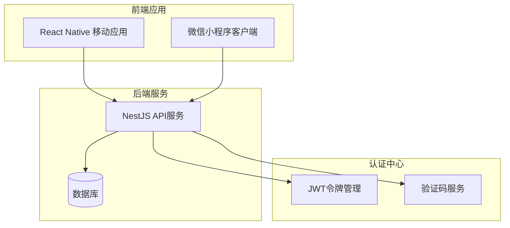
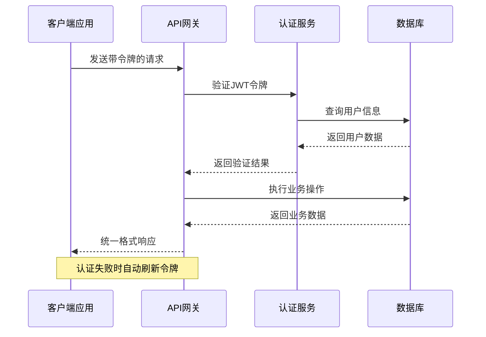
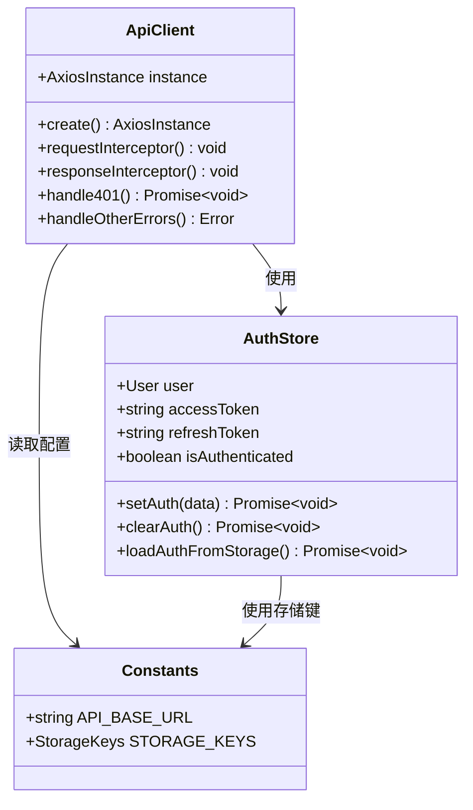
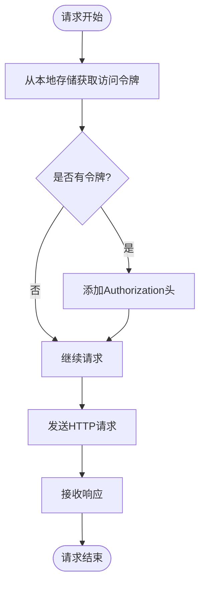
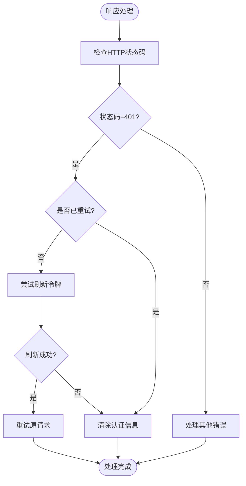
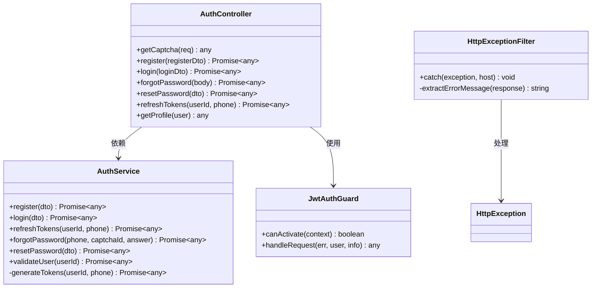
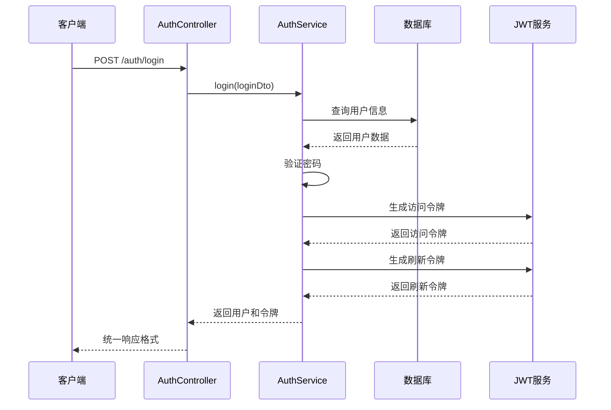
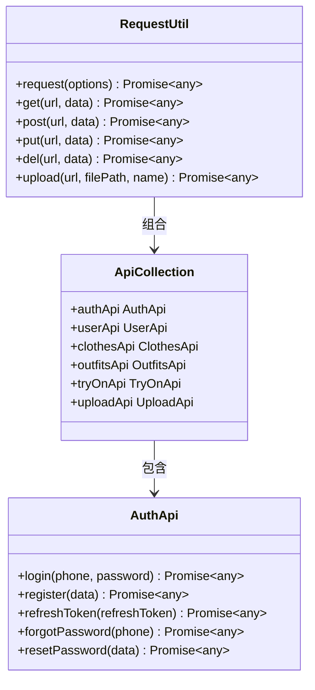
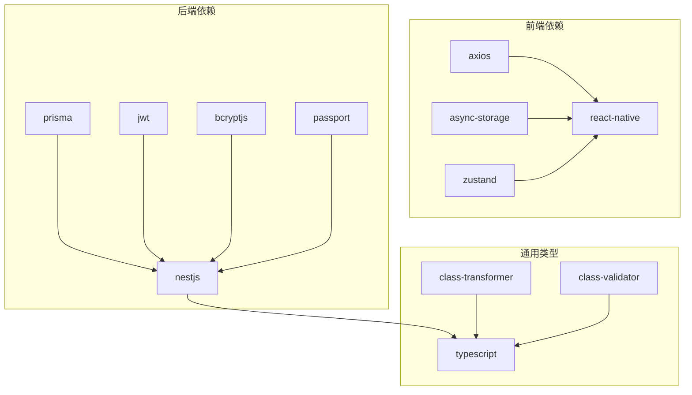
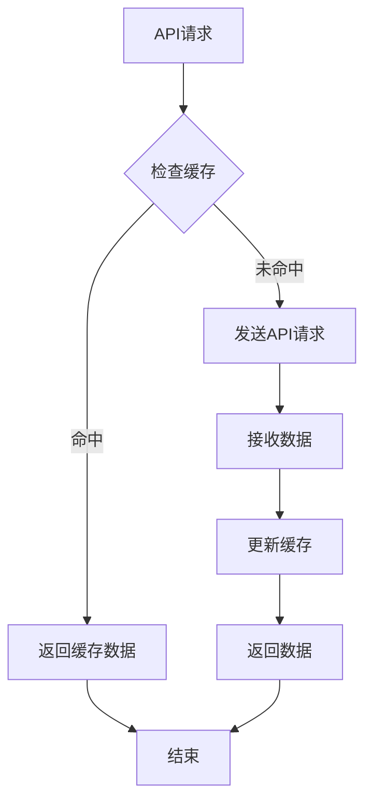

# API调用问题排查指南

<cite>
**本文档引用的文件**
- [axios.ts](file://FreeDressApp/src/api/axios.ts)
- [auth.ts](file://FreeDressApp/src/api/auth.ts)
- [authStore.ts](file://FreeDressApp/src/store/authStore.ts)
- [index.ts](file://FreeDressApp/src/constants/index.ts)
- [index.ts](file://FreeDressApp/src/types/index.ts)
- [main.ts](file://backend/src/main.ts)
- [http-exception.filter.ts](file://backend/src/common/filters/http-exception.filter.ts)
- [jwt-auth.guard.ts](file://backend/src/common/guards/jwt-auth.guard.ts)
- [auth.controller.ts](file://backend/src/modules/auth/auth.controller.ts)
- [auth.service.ts](file://backend/src/modules/auth/auth.service.ts)
- [request.js](file://freeDressWechat/utils/request.js)
- [api.js](file://freeDressWechat/utils/api.js)
</cite>

## 目录
1. [简介](#简介)
2. [项目结构](#项目结构)
3. [核心组件](#核心组件)
4. [架构概览](#架构概览)
5. [详细组件分析](#详细组件分析)
6. [依赖关系分析](#依赖关系分析)
7. [性能考虑](#性能考虑)
8. [故障排除指南](#故障排除指南)
9. [结论](#结论)

## 简介

本指南专为畅搭(FreeDress)项目设计，提供全面的API调用问题排查方法。该系统采用前后端分离架构，前端使用React Native开发移动应用，后端基于NestJS构建RESTful API服务，同时支持微信小程序客户端。

系统的核心特性包括：
- **统一的认证体系**：基于JWT的令牌管理，支持自动刷新机制
- **标准化的响应格式**：统一的API响应结构，便于错误处理
- **完整的跨域支持**：灵活的CORS配置，支持多端访问
- **健壮的错误处理**：多层次的异常捕获和错误响应机制

## 项目结构

畅搭项目采用清晰的分层架构设计，主要分为三个部分：



**图表来源**
- [main.ts:12-62](file://backend/src/main.ts#L12-L62)
- [axios.ts:12-18](file://FreeDressApp/src/api/axios.ts#L12-L18)

**章节来源**
- [main.ts:12-62](file://backend/src/main.ts#L12-L62)
- [axios.ts:12-18](file://FreeDressApp/src/api/axios.ts#L12-L18)

## 核心组件

### 前端API客户端

前端使用Axios创建统一的API客户端，具备以下关键功能：

- **自动认证**：通过请求拦截器自动添加JWT令牌
- **错误处理**：统一的响应拦截器处理各种HTTP状态码
- **Token刷新**：401错误时自动尝试刷新访问令牌
- **超时配置**：默认10秒超时时间

### 后端API服务

后端采用NestJS框架，提供RESTful API服务：

- **CORS配置**：支持跨域请求，允许凭据传递
- **全局验证**：使用ValidationPipe进行请求参数验证
- **统一响应**：通过拦截器统一API响应格式
- **异常处理**：两级异常过滤器处理不同类型的错误

### 认证系统

系统实现完整的用户认证流程：

- **JWT令牌**：访问令牌7天有效期，刷新令牌30天有效期
- **验证码**：图片验证码防止暴力破解
- **密码加密**：使用bcryptjs进行密码哈希存储
- **权限控制**：基于角色的访问控制

**章节来源**
- [axios.ts:24-105](file://FreeDressApp/src/api/axios.ts#L24-L105)
- [main.ts:31-35](file://backend/src/main.ts#L31-L35)
- [auth.service.ts:153-171](file://backend/src/modules/auth/auth.service.ts#L153-L171)

## 架构概览



**图表来源**
- [axios.ts:54-98](file://FreeDressApp/src/api/axios.ts#L54-L98)
- [auth.service.ts:102-135](file://backend/src/modules/auth/auth.service.ts#L102-L135)

## 详细组件分析

### 前端API客户端组件

前端API客户端是整个系统的网络层核心，负责处理所有HTTP请求和响应。



**图表来源**
- [axios.ts:12-105](file://FreeDressApp/src/api/axios.ts#L12-L105)
- [authStore.ts:28-122](file://FreeDressApp/src/store/authStore.ts#L28-L122)
- [index.ts:9-205](file://FreeDressApp/src/constants/index.ts#L9-L205)

#### 请求拦截器工作流程



**图表来源**
- [axios.ts:24-38](file://FreeDressApp/src/api/axios.ts#L24-L38)

#### 响应拦截器处理流程



**图表来源**
- [axios.ts:49-105](file://FreeDressApp/src/api/axios.ts#L49-L105)

**章节来源**
- [axios.ts:24-105](file://FreeDressApp/src/api/axios.ts#L24-L105)
- [authStore.ts:39-92](file://FreeDressApp/src/store/authStore.ts#L39-L92)

### 后端API服务组件

后端API服务采用模块化设计，每个功能模块都有独立的控制器和服务类。



**图表来源**
- [auth.controller.ts:16-91](file://backend/src/modules/auth/auth.controller.ts#L16-L91)
- [auth.service.ts:23-37](file://backend/src/modules/auth/auth.service.ts#L23-L37)
- [jwt-auth.guard.ts:8-21](file://backend/src/common/guards/jwt-auth.guard.ts#L8-L21)
- [http-exception.filter.ts:8-44](file://backend/src/common/filters/http-exception.filter.ts#L8-L44)

#### 认证服务工作流程



**图表来源**
- [auth.controller.ts:46-50](file://backend/src/modules/auth/auth.controller.ts#L46-L50)
- [auth.service.ts:102-135](file://backend/src/modules/auth/auth.service.ts#L102-L135)

**章节来源**
- [auth.controller.ts:16-91](file://backend/src/modules/auth/auth.controller.ts#L16-L91)
- [auth.service.ts:44-145](file://backend/src/modules/auth/auth.service.ts#L44-L145)
- [jwt-auth.guard.ts:8-21](file://backend/src/common/guards/jwt-auth.guard.ts#L8-L21)

### 微信小程序API组件

微信小程序客户端提供了独立的API封装，支持与移动端相同的认证机制。



**图表来源**
- [request.js:6-86](file://freeDressWechat/utils/request.js#L6-L86)
- [api.js:6-61](file://freeDressWechat/utils/api.js#L6-L61)

**章节来源**
- [request.js:6-86](file://freeDressWechat/utils/request.js#L6-L86)
- [api.js:6-61](file://freeDressWechat/utils/api.js#L6-L61)

## 依赖关系分析



**图表来源**
- [package.json:26-44](file://backend/package.json#L26-L44)

**章节来源**
- [package.json:26-44](file://backend/package.json#L26-L44)

## 性能考虑

### 超时配置

前端API客户端设置了合理的超时时间：
- **默认超时**：10秒
- **可调整范围**：根据网络环境和API复杂度进行优化
- **最佳实践**：对于大数据传输建议增加超时时间

### 并发控制

系统支持多种并发控制策略：
- **请求队列**：避免同时发起过多请求
- **重试机制**：对临时性错误进行自动重试
- **限流控制**：防止API滥用和过载

### 缓存策略



## 故障排除指南

### 网络连接失败诊断

#### CORS跨域问题

**症状表现**：
- 控制台出现CORS错误
- 预检请求失败
- 无法访问API资源

**诊断步骤**：
1. **检查CORS配置**
   ```bash
   # 后端CORS配置
   app.enableCors({
     origin: true,
     credentials: true,
   });
   ```

2. **验证预检请求**
   - 检查OPTIONS请求是否正常响应
   - 确认Access-Control-Allow-Origin头正确设置
   - 验证凭据传递是否启用

3. **前端请求验证**
   - 确认请求头包含正确的Origin
   - 检查是否正确处理预检响应

**解决方案**：
- 配置允许的源列表
- 启用凭据传递支持
- 设置适当的CORS头

#### 代理配置问题

**症状表现**：
- 本地开发环境无法访问API
- 代理设置导致请求失败

**诊断步骤**：
1. **检查API基础URL配置**
   ```typescript
   export const API_BASE_URL = 'http://10.0.2.2:3000/api';
   ```

2. **验证网络连通性**
   - 使用curl测试API可达性
   - 检查防火墙设置
   - 验证端口开放情况

3. **代理服务器配置**
   - 确认代理服务器正常运行
   - 检查代理规则配置
   - 验证SSL证书有效性

**解决方案**：
- 正确配置API基础URL
- 设置开发环境代理
- 验证网络基础设施

#### 防火墙设置

**症状表现**：
- 服务器端口无法访问
- API请求被阻断

**诊断步骤**：
1. **端口检查**
   ```bash
   # 检查端口监听状态
   netstat -an | grep :3000
   
   # 验证防火墙规则
   iptables -L
   ```

2. **安全组配置**
   - 检查云服务安全组规则
   - 验证入站和出站规则
   - 确认IP白名单设置

**解决方案**：
- 开放必要的服务器端口
- 配置安全组访问规则
- 设置适当的IP限制

### 认证失败排查

#### Token过期问题

**症状表现**：
- 401未授权错误
- 自动跳转到登录页面
- 请求被拒绝访问

**诊断步骤**：
1. **检查Token状态**
   ```typescript
   // 前端检查
   const token = await AsyncStorage.getItem(STORAGE_KEYS.ACCESS_TOKEN);
   console.log('访问令牌:', token);
   
   // 后端验证
   const payload = jwt.verify(token, JWT_SECRET);
   console.log('令牌负载:', payload);
   ```

2. **验证刷新流程**
   - 检查刷新令牌是否存在
   - 验证刷新令牌有效性
   - 确认刷新请求成功

3. **日志分析**
   - 查看认证相关日志
   - 检查令牌生成时间
   - 验证用户状态

**解决方案**：
- 实现自动刷新机制
- 处理刷新失败场景
- 提供手动重新登录选项

#### 签名验证错误

**症状表现**：
- JWT签名验证失败
- 令牌被篡改检测
- 认证过程中断

**诊断步骤**：
1. **检查密钥配置**
   ```typescript
   // 确认JWT密钥设置
   process.env.JWT_SECRET
   process.env.JWT_REFRESH_SECRET
   ```

2. **验证令牌格式**
   - 检查JWT结构完整性
   - 验证Base64编码正确性
   - 确认签名算法一致性

3. **时间同步检查**
   - 验证系统时间准确性
   - 检查时区设置
   - 确认NTP服务正常

**解决方案**：
- 确保密钥配置正确
- 处理时钟偏差问题
- 实施令牌版本管理

#### 权限不足问题

**症状表现**：
- 403禁止访问错误
- 角色权限验证失败
- 资源访问被拒绝

**诊断步骤**：
1. **检查用户角色**
   ```typescript
   // 验证用户角色
   const user = await authService.validateUser(userId);
   console.log('用户角色:', user.role);
   ```

2. **权限矩阵分析**
   - 检查API端点权限要求
   - 验证角色权限映射
   - 确认动态权限检查

3. **会话状态验证**
   - 检查用户登录状态
   - 验证会话有效性
   - 确认权限缓存一致性

**解决方案**：
- 实施细粒度权限控制
- 提供权限升级机制
- 添加权限审计日志

### 数据格式错误解决

#### JSON解析失败

**症状表现**：
- JSON.parse异常
- 响应数据格式错误
- 解析器抛出语法错误

**诊断步骤**：
1. **检查响应格式**
   ```typescript
   // 前端检查
   console.log('原始响应:', response);
   console.log('响应类型:', typeof response);
   
   // 后端验证
   res.setHeader('Content-Type', 'application/json');
   ```

2. **验证API响应结构**
   - 检查统一响应格式
   - 验证必需字段完整性
   - 确认数据类型正确性

3. **编码问题排查**
   - 检查字符编码设置
   - 验证UTF-8支持
   - 确认特殊字符处理

**解决方案**：
- 实施严格的响应格式验证
- 添加数据类型转换层
- 提供格式化错误处理

#### 参数类型不匹配

**症状表现**：
- 参数验证失败
- 400错误响应
- 请求被拒绝

**诊断步骤**：
1. **检查DTO定义**
   ```typescript
   // 使用class-validator进行验证
   export class LoginDto {
     @IsMobilePhone()
     phone: string;
     
     @IsString()
     @MinLength(6)
     password: string;
   }
   ```

2. **验证输入数据**
   - 检查参数类型转换
   - 验证数据范围限制
   - 确认必填字段完整性

3. **前端数据准备**
   - 确保参数类型正确
   - 验证数据格式规范
   - 检查空值处理

**解决方案**：
- 实施前端表单验证
- 使用TypeScript类型检查
- 添加后端参数验证

#### 响应格式异常

**症状表现**：
- 统一响应格式破坏
- 前端解析困难
- 错误处理失效

**诊断步骤**：
1. **检查拦截器配置**
   ```typescript
   // 统一响应格式拦截器
   @Injectable()
   export class TransformInterceptor implements NestInterceptor {
     intercept(context, next) {
       return next.handle().pipe(
         map(data => ({
           code: 200,
           message: 'success',
           data: data,
           timestamp: new Date().toISOString(),
         }))
       );
     }
   }
   ```

2. **验证异常过滤器**
   - 检查错误响应格式
   - 验证状态码映射
   - 确认消息文本一致性

3. **测试响应结构**
   - 使用Postman验证API
   - 检查Swagger文档
   - 验证不同场景响应

**解决方案**：
- 实施严格的响应格式规范
- 添加响应结构验证
- 提供详细的错误信息

### API超时和限流问题

#### 超时问题处理

**症状表现**：
- 请求长时间无响应
- 超时错误提示
- 用户体验下降

**诊断步骤**：
1. **检查超时配置**
   ```typescript
   // 前端超时设置
   const apiClient = axios.create({
     timeout: 10000, // 10秒
   });
   
   // 后端超时设置
   app.setTimeout(30000); // 30秒
   ```

2. **性能监控**
   - 监控API响应时间
   - 检查数据库查询性能
   - 验证外部服务响应

3. **网络诊断**
   - 检查网络延迟
   - 验证DNS解析速度
   - 确认服务器负载

**解决方案**：
- 优化数据库查询
- 实施缓存策略
- 增加异步处理能力

#### 限流问题解决

**症状表现**：
- 429状态码错误
- 请求被临时阻止
- 服务降级响应

**诊断步骤**：
1. **检查限流配置**
   ```typescript
   // 速率限制中间件
   app.use(rateLimit({
     windowMs: 15 * 60 * 1000, // 15分钟
     max: 100 // 最大请求次数
   }));
   ```

2. **分析请求模式**
   - 检查峰值请求时间
   - 验证用户行为模式
   - 确认异常请求识别

3. **监控限流效果**
   - 监控限流触发频率
   - 检查用户影响范围
   - 验证保护效果

**解决方案**：
- 实施智能限流算法
- 提供用户等级差异化
- 添加人工审核机制

### 常见HTTP状态码处理

#### 401未授权

**可能原因**：
- 访问令牌缺失或过期
- 刷新令牌无效
- 用户认证失败

**处理方案**：
1. 自动尝试令牌刷新
2. 清除本地认证信息
3. 引导用户重新登录

#### 403禁止访问

**可能原因**：
- 用户权限不足
- 角色权限不匹配
- 资源访问限制

**处理方案**：
1. 检查用户角色和权限
2. 验证API端点访问权限
3. 提供权限升级建议

#### 404资源不存在

**可能原因**：
- 请求的资源ID无效
- API端点路径错误
- 数据库记录不存在

**处理方案**：
1. 验证资源ID格式
2. 检查API路由配置
3. 提供友好的错误提示

#### 500服务器错误

**可能原因**：
- 服务器内部异常
- 数据库连接失败
- 外部服务不可用

**处理方案**：
1. 检查服务器日志
2. 验证数据库连接
3. 实施降级策略

**章节来源**
- [axios.ts:54-98](file://FreeDressApp/src/api/axios.ts#L54-L98)
- [http-exception.filter.ts:10-28](file://backend/src/common/filters/http-exception.filter.ts#L10-L28)
- [jwt-auth.guard.ts:14-20](file://backend/src/common/guards/jwt-auth.guard.ts#L14-L20)

## 结论

畅搭(FreeDress)项目的API调用问题排查指南涵盖了从网络连接到认证授权的完整故障排除流程。通过理解系统的架构设计和各组件的工作原理，可以快速定位和解决大多数API相关问题。

### 关键要点总结

1. **统一的错误处理机制**：前后端都实现了标准化的错误响应格式
2. **完善的认证体系**：基于JWT的令牌管理和自动刷新机制
3. **灵活的CORS配置**：支持多端访问和跨域请求
4. **健壮的异常处理**：多层次的异常捕获和恢复策略

### 最佳实践建议

1. **监控和日志**：建立完善的监控体系，及时发现和解决问题
2. **测试覆盖**：确保API有足够的单元测试和集成测试
3. **文档维护**：保持API文档的实时更新，便于问题排查
4. **性能优化**：持续优化API性能，提升用户体验

通过遵循本指南提供的方法和建议，可以有效提高API系统的稳定性和可靠性，为用户提供更好的服务体验。