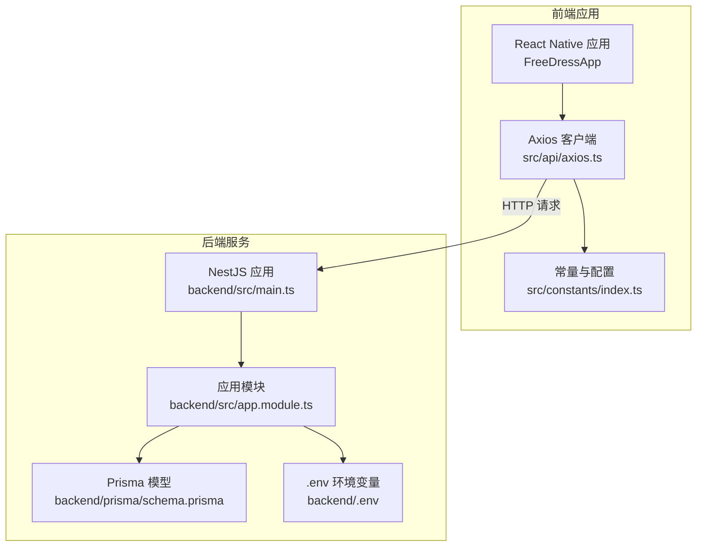
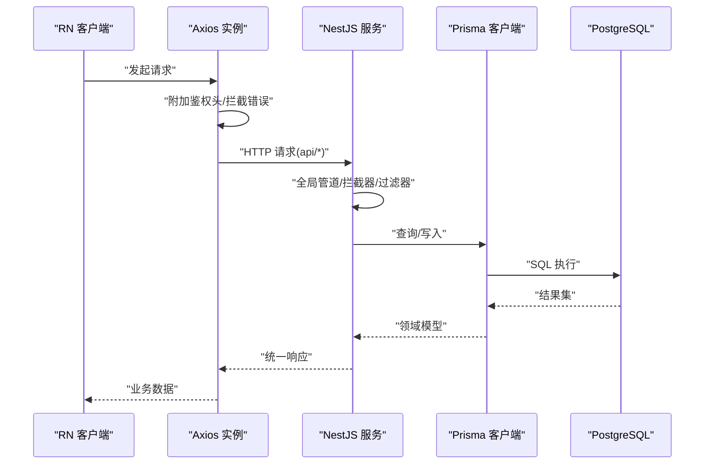
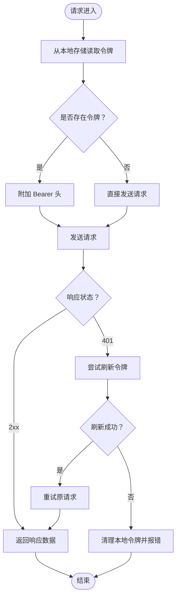
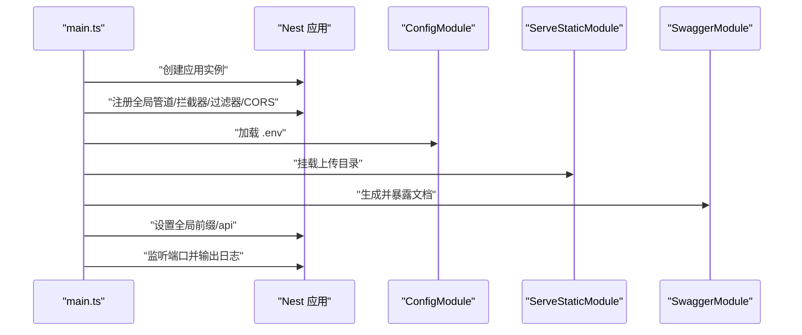
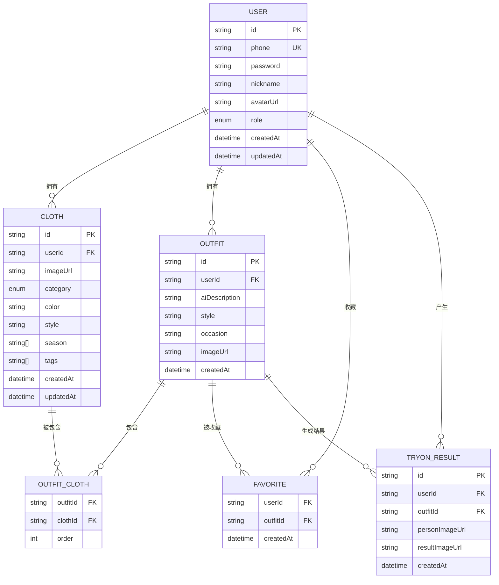
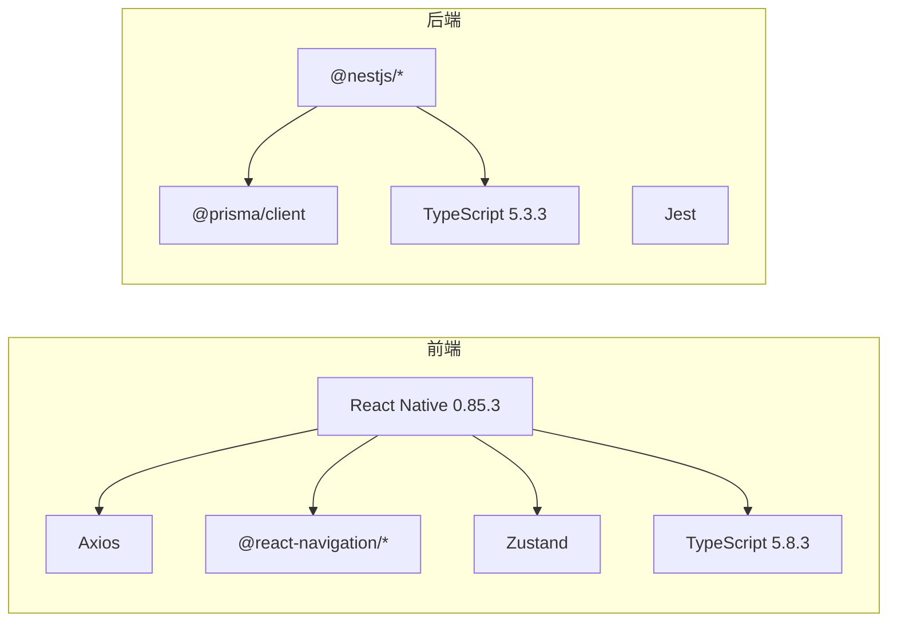

# 开发环境问题

<cite>
**本文引用的文件**
- [FreeDressApp/package.json](file://FreeDressApp/package.json)
- [backend/package.json](file://backend/package.json)
- [FreeDressApp/tsconfig.json](file://FreeDressApp/tsconfig.json)
- [backend/tsconfig.json](file://backend/tsconfig.json)
- [FreeDressApp/.eslintrc.js](file://FreeDressApp/.eslintrc.js)
- [FreeDressApp/.prettierrc.js](file://FreeDressApp/.prettierrc.js)
- [FreeDressApp/babel.config.js](file://FreeDressApp/babel.config.js)
- [FreeDressApp/metro.config.js](file://FreeDressApp/metro.config.js)
- [FreeDressApp/react-native.config.js](file://FreeDressApp/react-native.config.js)
- [FreeDressApp/app.json](file://FreeDressApp/app.json)
- [FreeDressApp/src/constants/index.ts](file://FreeDressApp/src/constants/index.ts)
- [FreeDressApp/src/api/axios.ts](file://FreeDressApp/src/api/axios.ts)
- [backend/.env](file://backend/.env)
- [backend/src/app.module.ts](file://backend/src/app.module.ts)
- [backend/src/main.ts](file://backend/src/main.ts)
- [backend/prisma/schema.prisma](file://backend/prisma/schema.prisma)
</cite>

## 目录
1. [简介](#简介)
2. [项目结构](#项目结构)
3. [核心组件](#核心组件)
4. [架构总览](#架构总览)
5. [详细组件分析](#详细组件分析)
6. [依赖分析](#依赖分析)
7. [性能考虑](#性能考虑)
8. [故障排查指南](#故障排查指南)
9. [结论](#结论)
10. [附录](#附录)

## 简介
本指南面向畅搭(FreeDress)项目的开发者，聚焦于开发环境常见问题的定位与修复，覆盖以下主题：
- Node.js 版本兼容性与包管理工具（npm/yarn）安装依赖失败
- TypeScript 编译错误诊断（配置文件、类型定义冲突、模块解析）
- 环境变量配置错误排查（后端数据库连接、前端 API 地址）
- 跨平台开发问题（Windows/macOS/Linux 差异、Android/iOS 模拟器）
- IDE 配置问题（VSCode 插件、调试、代码格式化）

## 项目结构
畅搭项目采用前后端分离架构：
- 前端：React Native 应用，位于 FreeDressApp 目录，使用 React Navigation、Zustand 状态管理、Reanimated 动画、Axios 网络层等
- 后端：NestJS 应用，位于 backend 目录，使用 Prisma ORM、JWT 认证、Swagger 文档、静态资源服务等
- 微信小程序：freeDressWechat 目录（非本次排查重点）

图表来源
- [FreeDressApp/src/api/axios.ts:1-108](file://FreeDressApp/src/api/axios.ts#L1-L108)
- [FreeDressApp/src/constants/index.ts:1-212](file://FreeDressApp/src/constants/index.ts#L1-L212)
- [backend/src/main.ts:1-62](file://backend/src/main.ts#L1-L62)
- [backend/src/app.module.ts:1-33](file://backend/src/app.module.ts#L1-L33)
- [backend/prisma/schema.prisma:1-132](file://backend/prisma/schema.prisma#L1-L132)
- [backend/.env:1-28](file://backend/.env#L1-L28)

章节来源
- [FreeDressApp/package.json:1-57](file://FreeDressApp/package.json#L1-L57)
- [backend/package.json:1-91](file://backend/package.json#L1-L91)

## 核心组件
- 前端构建与运行脚本：通过 React Native CLI 提供 android/ios/start/test/lint 等命令
- 后端构建与运行脚本：通过 Nest CLI 提供 build/start/start:dev/start:debug 等命令
- TypeScript 配置：前端继承 @react-native/typescript-config；后端自定义路径映射与严格性控制
- ESLint/Prettier：统一代码风格与质量检查
- Metro/Babel：前端打包与语法转换
- Axios：统一的 HTTP 客户端，内置鉴权与刷新逻辑
- 环境变量：后端通过 .env 加载数据库、JWT、文件上传、AI 服务等配置

章节来源
- [FreeDressApp/package.json:5-11](file://FreeDressApp/package.json#L5-L11)
- [backend/package.json:8-24](file://backend/package.json#L8-L24)
- [FreeDressApp/tsconfig.json:1-9](file://FreeDressApp/tsconfig.json#L1-L9)
- [backend/tsconfig.json:1-32](file://backend/tsconfig.json#L1-L32)
- [FreeDressApp/.eslintrc.js:1-5](file://FreeDressApp/.eslintrc.js#L1-L5)
- [FreeDressApp/.prettierrc.js:1-6](file://FreeDressApp/.prettierrc.js#L1-L6)
- [FreeDressApp/babel.config.js:1-4](file://FreeDressApp/babel.config.js#L1-L4)
- [FreeDressApp/metro.config.js:1-12](file://FreeDressApp/metro.config.js#L1-L12)
- [FreeDressApp/src/api/axios.ts:1-108](file://FreeDressApp/src/api/axios.ts#L1-L108)
- [backend/.env:1-28](file://backend/.env#L1-L28)

## 架构总览
前端通过 Axios 发起请求，后端通过 NestJS 提供 REST 接口，并使用 Prisma 连接 PostgreSQL 数据库。静态资源由 ServeStaticModule 提供，Swagger 用于接口文档。

图表来源
- [FreeDressApp/src/api/axios.ts:1-108](file://FreeDressApp/src/api/axios.ts#L1-L108)
- [backend/src/main.ts:12-62](file://backend/src/main.ts#L12-L62)
- [backend/src/app.module.ts:13-32](file://backend/src/app.module.ts#L13-L32)
- [backend/prisma/schema.prisma:1-132](file://backend/prisma/schema.prisma#L1-L132)

## 详细组件分析

### 前端：API 客户端与常量配置
- Axios 实例：统一基础地址、超时、请求/响应拦截器，含鉴权令牌自动附加与刷新流程
- 常量：API 基础地址、存储键名、分页参数等集中管理
- 配置要点：API 基础地址需与后端启动端口一致；移动端模拟器访问宿主机需注意 10.0.2.2（Android）或相应桥接地址

图表来源
- [FreeDressApp/src/api/axios.ts:24-105](file://FreeDressApp/src/api/axios.ts#L24-L105)
- [FreeDressApp/src/constants/index.ts:9-205](file://FreeDressApp/src/constants/index.ts#L9-L205)

章节来源
- [FreeDressApp/src/api/axios.ts:1-108](file://FreeDressApp/src/api/axios.ts#L1-L108)
- [FreeDressApp/src/constants/index.ts:1-212](file://FreeDressApp/src/constants/index.ts#L1-L212)

### 后端：应用启动与模块装配
- 全局配置：ValidationPipe、拦截器、过滤器、CORS、全局前缀、Swagger
- 静态资源：ServeStaticModule 挂载 uploads 目录为 /uploads
- 环境加载：ConfigModule.forRoot 从 .env 读取配置
- 端口与文档：默认端口来自环境变量，Swagger 文档路径为 /api/docs

图表来源
- [backend/src/main.ts:12-62](file://backend/src/main.ts#L12-L62)
- [backend/src/app.module.ts:13-32](file://backend/src/app.module.ts#L13-L32)
- [backend/.env:1-28](file://backend/.env#L1-L28)

章节来源
- [backend/src/main.ts:1-62](file://backend/src/main.ts#L1-L62)
- [backend/src/app.module.ts:1-33](file://backend/src/app.module.ts#L1-L33)

### 数据库与模型
- 数据源：PostgreSQL，通过 DATABASE_URL 连接
- 模型：用户、衣物、搭配、收藏、AI 试穿结果，具备索引与外键约束
- Prisma 生成：在后端执行 prisma:generate 或 prisma:migrate 前确保数据库可达且 .env 正确

图表来源
- [backend/prisma/schema.prisma:1-132](file://backend/prisma/schema.prisma#L1-L132)

章节来源
- [backend/prisma/schema.prisma:1-132](file://backend/prisma/schema.prisma#L1-L132)
- [backend/.env:1-28](file://backend/.env#L1-L28)

## 依赖分析
- 前端依赖：React Native、导航、动画、向量图标、状态管理、图片选择、Axios、Jest、Prettier、ESLint、TypeScript
- 后端依赖：NestJS 生态、Prisma、JWT、Passport、Swagger、测试框架、ESLint/Prettier、TypeScript
- 版本引擎：前端要求 Node >= 22.11.0；后端使用 TypeScript ^5.3.3

图表来源
- [FreeDressApp/package.json:12-52](file://FreeDressApp/package.json#L12-L52)
- [backend/package.json:26-72](file://backend/package.json#L26-L72)

章节来源
- [FreeDressApp/package.json:1-57](file://FreeDressApp/package.json#L1-L57)
- [backend/package.json:1-91](file://backend/package.json#L1-L91)

## 性能考虑
- 前端打包：Metro 默认配置已启用增量编译与缓存，建议在大型项目中开启 Hermes 与摇树优化
- 后端编译：TypeScript 编译开启增量模式，生产构建建议关闭 watch，使用 dist 输出
- 网络层：Axios 设置合理超时与重试策略，避免阻塞 UI；鉴权刷新仅在必要时触发
- 数据库：Prisma 查询尽量使用索引列，避免 N+1 查询；批量操作使用事务

## 故障排查指南

### 1. Node.js 版本兼容性问题
- 症状：安装依赖时报引擎版本不满足、运行时报语法不支持
- 排查步骤：
  - 检查前端 package.json 的 engines 字段，确认 Node 版本满足要求
  - 检查后端 package.json 的 TypeScript 版本与 Node 兼容性
  - 使用 nvm（macOS/Linux）或 nodist（Windows）切换到推荐版本
- 修复建议：
  - 升级 Node 至满足 engines 的版本
  - 清理缓存后重装依赖（删除 node_modules、lockfile、重装）

章节来源
- [FreeDressApp/package.json:53-56](file://FreeDressApp/package.json#L53-L56)
- [backend/package.json:69-71](file://backend/package.json#L69-L71)

### 2. npm/yarn 安装依赖失败
- 症状：安装阶段卡住、权限错误、网络超时、依赖冲突
- 排查步骤：
  - 前端与后端分别执行安装，优先使用 yarn（若项目使用 yarn.lock）
  - 清理缓存：yarn cache clean 或 npm cache verify
  - 检查代理与镜像源，必要时临时禁用代理
  - 删除 lockfile 与 node_modules 后重装
- 修复建议：
  - 固定 Node 与包管理器版本
  - 使用 pnpm 降低内存占用（可选）
  - 若存在二进制扩展，确保系统已安装对应构建工具链

章节来源
- [FreeDressApp/package.json:1-57](file://FreeDressApp/package.json#L1-L57)
- [backend/package.json:1-91](file://backend/package.json#L1-L91)

### 3. TypeScript 编译错误
- 配置文件错误
  - 前端：tsconfig.json 继承 @react-native/typescript-config，确保类型声明正确
  - 后端：tsconfig.json 定义了路径别名与严格性开关，检查路径映射是否与实际目录一致
- 类型定义冲突
  - 检查第三方库的类型声明是否重复或版本不匹配
  - 在 tsconfig 中排除不需要的库或使用 types 字段限定类型范围
- 模块解析问题
  - 后端使用路径映射（如 @/*），确保 baseUrl 与 paths 配置一致
  - 避免同名文件导致解析歧义，统一命名规范
- 修复建议：
  - 保持 TypeScript 版本与项目依赖一致
  - 使用 IDE 的“显示问题”功能定位具体文件与行号
  - 逐步注释可疑模块，缩小问题范围

章节来源
- [FreeDressApp/tsconfig.json:1-9](file://FreeDressApp/tsconfig.json#L1-L9)
- [backend/tsconfig.json:23-29](file://backend/tsconfig.json#L23-L29)

### 4. 环境变量配置错误
- 后端数据库连接字符串
  - 检查 .env 中 DATABASE_URL 是否指向可用的 PostgreSQL 实例
  - 确认 Prisma schema 中 datasource db 的 url 来源于环境变量
- 前端 API 地址
  - 检查常量 API_BASE_URL 是否与后端监听地址一致
  - 移动端模拟器访问宿主机时，使用正确的桥接 IP（例如 10.0.2.2）
- 修复建议：
  - 在 .env 中补充缺失项（如 OSS、AI 服务密钥），或留空以禁用相关功能
  - 启动后端前先验证数据库连通性（如使用 psql）

章节来源
- [backend/.env:1-28](file://backend/.env#L1-L28)
- [backend/prisma/schema.prisma:8-11](file://backend/prisma/schema.prisma#L8-L11)
- [FreeDressApp/src/constants/index.ts:9-9](file://FreeDressApp/src/constants/index.ts#L9-L9)

### 5. 跨平台开发问题
- Windows/macOS/Linux 差异
  - 文件路径大小写敏感性：Linux 对路径大小写敏感，避免混用
  - 脚本换行符：确保 .sh/.bat 文件编码一致
  - Android Studio/Gradle：使用最新稳定版，同步 Gradle Wrapper
  - Xcode：iOS 项目依赖的 Podfile 需要正确安装依赖
- Android/iOS 模拟器启动问题
  - Android：检查 AVD 镜像与硬件加速（HAXM/Hyper-V 冲突），必要时重建 AVD
  - iOS：Xcode 模拟器需与所选 SDK 匹配，清理 DerivedData 后重试
- 修复建议：
  - 使用官方模拟器镜像，避免自定义修改
  - 在 CI 环境中统一使用容器化构建（可选）

### 6. IDE 配置问题
- VSCode 插件设置
  - 前端：安装 React Native Tools、ESLint、Prettier、TypeScript TSServer
  - 后端：安装 NestJS 专用插件、ESLint、Prettier、Prisma
- 调试配置
  - 前端：使用 React Native Debugger 或 VSCode 的调试任务
  - 后端：使用 Jest/Debug 配置启动带断点的进程
- 代码格式化
  - ESLint 与 Prettier 已配置，确保保存时自动格式化
  - 如出现冲突，优先遵循 .prettierrc.js 规则
- 修复建议：
  - 在工作区设置中启用“editor.formatOnSave”
  - 为不同语言设置合适的缩进与换行符

章节来源
- [FreeDressApp/.eslintrc.js:1-5](file://FreeDressApp/.eslintrc.js#L1-L5)
- [FreeDressApp/.prettierrc.js:1-6](file://FreeDressApp/.prettierrc.js#L1-L6)
- [backend/package.json:57-62](file://backend/package.json#L57-L62)

## 结论
本指南围绕畅搭(FreeDress)项目的开发环境，提供了从 Node.js 版本、依赖安装、TypeScript 编译、环境变量、跨平台差异到 IDE 配置的系统化排查路径。建议团队在本地与 CI 环境中统一工具链版本，完善 .env 与 tsconfig 的校验流程，以减少环境漂移带来的问题。

## 附录
- 前端常用命令
  - 启动：yarn start
  - Android：yarn android
  - iOS：yarn ios
  - Lint：yarn lint
  - 测试：yarn test
- 后端常用命令
  - 启动：yarn start:dev
  - 构建：yarn build
  - Lint：yarn lint
  - 测试：yarn test
  - Prisma：yarn prisma:generate / prisma:migrate / prisma:studio