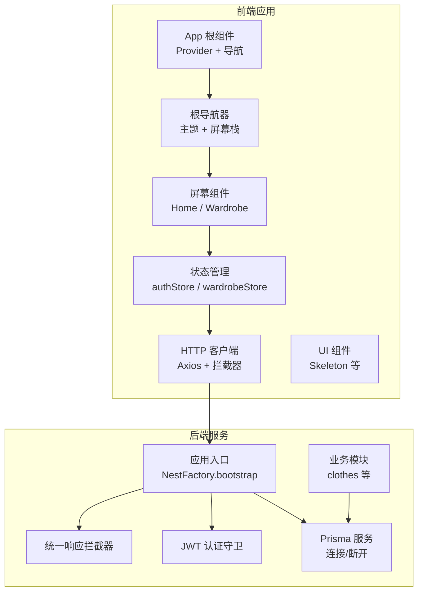
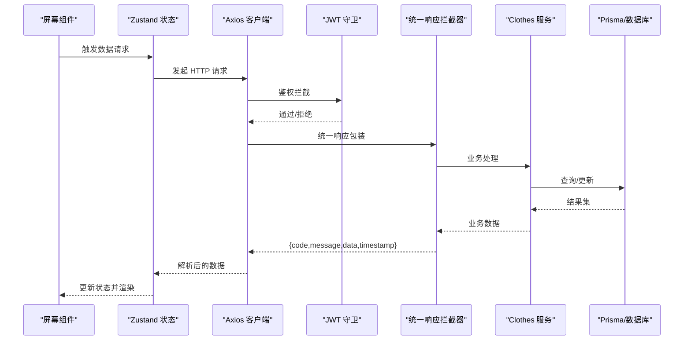
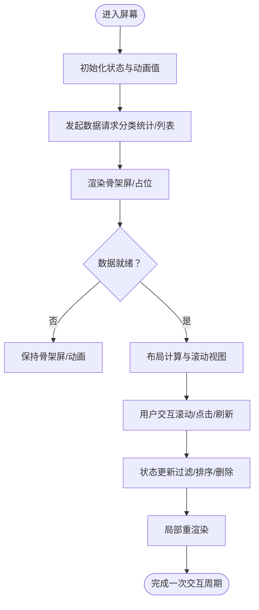
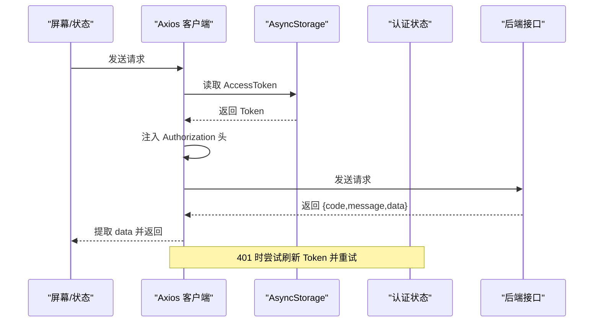
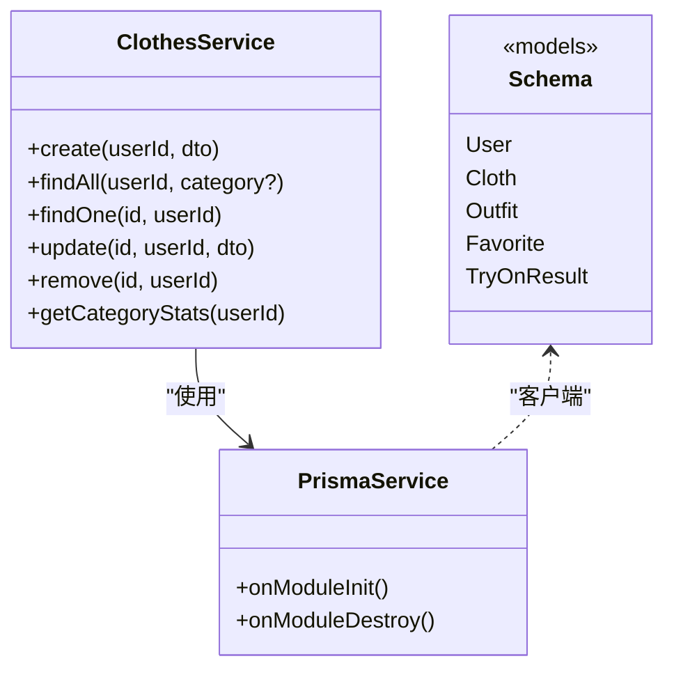
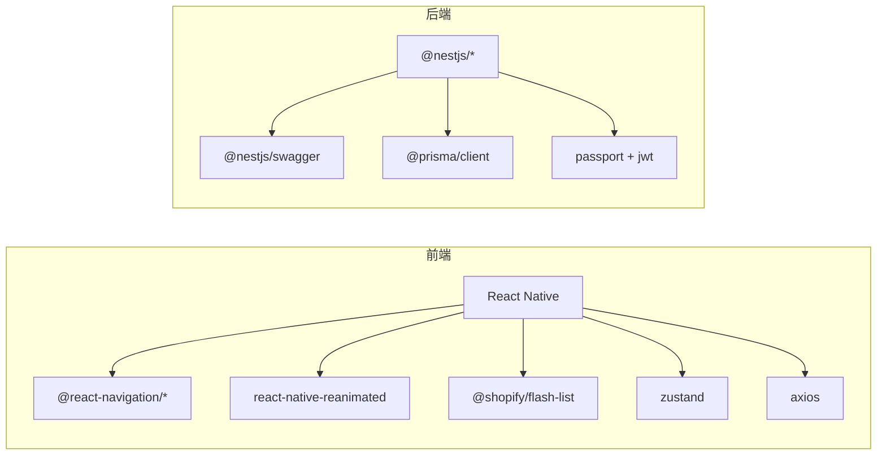

# 性能问题诊断

<cite>
**本文引用的文件**
- [FreeDressApp/package.json](file://FreeDressApp/package.json)
- [FreeDressApp/metro.config.js](file://FreeDressApp/metro.config.js)
- [FreeDressApp/babel.config.js](file://FreeDressApp/babel.config.js)
- [FreeDressApp/src/App.tsx](file://FreeDressApp/src/App.tsx)
- [FreeDressApp/src/navigation/RootNavigator.tsx](file://FreeDressApp/src/navigation/RootNavigator.tsx)
- [FreeDressApp/src/store/authStore.ts](file://FreeDressApp/src/store/authStore.ts)
- [FreeDressApp/src/store/wardrobeStore.ts](file://FreeDressApp/src/store/wardrobeStore.ts)
- [FreeDressApp/src/api/axios.ts](file://FreeDressApp/src/api/axios.ts)
- [FreeDressApp/src/screens/HomeScreen.tsx](file://FreeDressApp/src/screens/HomeScreen.tsx)
- [FreeDressApp/src/screens/WardrobeScreen.tsx](file://FreeDressApp/src/screens/WardrobeScreen.tsx)
- [FreeDressApp/src/components/Skeleton.tsx](file://FreeDressApp/src/components/Skeleton.tsx)
- [backend/src/main.ts](file://backend/src/main.ts)
- [backend/src/common/interceptors/transform.interceptor.ts](file://backend/src/common/interceptors/transform.interceptor.ts)
- [backend/src/common/guards/jwt-auth.guard.ts](file://backend/src/common/guards/jwt-auth.guard.ts)
- [backend/src/prisma/prisma.service.ts](file://backend/src/prisma/prisma.service.ts)
- [backend/src/modules/clothes/clothes.service.ts](file://backend/src/modules/clothes/clothes.service.ts)
- [backend/prisma/schema.prisma](file://backend/prisma/schema.prisma)
</cite>

## 目录
1. [简介](#简介)
2. [项目结构](#项目结构)
3. [核心组件](#核心组件)
4. [架构总览](#架构总览)
5. [详细组件分析](#详细组件分析)
6. [依赖分析](#依赖分析)
7. [性能考虑](#性能考虑)
8. [故障排除指南](#故障排除指南)
9. [结论](#结论)
10. [附录](#附录)

## 简介
本指南面向畅搭(FreeDress)项目的前端、后端与移动端性能问题诊断与优化。内容覆盖：
- 前端性能：渲染卡顿、内存泄漏、网络请求延迟的识别与定位
- 后端性能：数据库查询优化、API响应时间监控、资源使用率统计
- 移动端性能：CPU使用率、内存占用、电池消耗分析
- 性能监控工具：性能分析器、APM工具、日志分析系统
- 最佳实践：缓存策略、异步处理、资源压缩与懒加载

## 项目结构
项目采用多模块组织：
- 前端应用（React Native）：FreeDressApp，包含导航、状态管理、API封装、屏幕组件与主题样式
- 后端服务（NestJS + Prisma）：backend，包含模块化控制器、服务层、拦截器、守卫与数据库模型
- 微信小程序（freeDressWechat）：微信端页面与工具脚本（不在本次性能诊断范围内）

**图表来源**
- [FreeDressApp/src/App.tsx:11-19](file://FreeDressApp/src/App.tsx#L11-L19)
- [FreeDressApp/src/navigation/RootNavigator.tsx:41-84](file://FreeDressApp/src/navigation/RootNavigator.tsx#L41-L84)
- [FreeDressApp/src/store/authStore.ts:28-122](file://FreeDressApp/src/store/authStore.ts#L28-L122)
- [FreeDressApp/src/store/wardrobeStore.ts:35-82](file://FreeDressApp/src/store/wardrobeStore.ts#L35-L82)
- [FreeDressApp/src/api/axios.ts:12-107](file://FreeDressApp/src/api/axios.ts#L12-L107)
- [backend/src/main.ts:12-62](file://backend/src/main.ts#L12-L62)
- [backend/src/common/interceptors/transform.interceptor.ts:19-31](file://backend/src/common/interceptors/transform.interceptor.ts#L19-L31)
- [backend/src/common/guards/jwt-auth.guard.ts:8-21](file://backend/src/common/guards/jwt-auth.guard.ts#L8-L21)
- [backend/src/prisma/prisma.service.ts:8-26](file://backend/src/prisma/prisma.service.ts#L8-L26)
- [backend/src/modules/clothes/clothes.service.ts:11-147](file://backend/src/modules/clothes/clothes.service.ts#L11-L147)

**章节来源**
- [FreeDressApp/src/App.tsx:11-19](file://FreeDressApp/src/App.tsx#L11-L19)
- [backend/src/main.ts:12-62](file://backend/src/main.ts#L12-L62)

## 核心组件
- 前端根组件与导航：提供全局 Provider、手势处理与导航容器，是性能监控的入口点
- 状态管理（Zustand）：集中管理认证与衣橱数据，避免重复渲染与无效更新
- HTTP 客户端（Axios）：统一请求/响应拦截器，支持自动 Token 刷新与错误处理
- 屏幕组件：首页与衣橱页承载大量 UI 与交互，是渲染性能的关键区域
- 后端入口：配置全局管道、拦截器、过滤器、CORS 与 Swagger 文档
- 数据库层：Prisma 连接生命周期管理与查询优化基础

**章节来源**
- [FreeDressApp/src/App.tsx:11-19](file://FreeDressApp/src/App.tsx#L11-L19)
- [FreeDressApp/src/navigation/RootNavigator.tsx:41-84](file://FreeDressApp/src/navigation/RootNavigator.tsx#L41-L84)
- [FreeDressApp/src/store/authStore.ts:28-122](file://FreeDressApp/src/store/authStore.ts#L28-L122)
- [FreeDressApp/src/store/wardrobeStore.ts:35-82](file://FreeDressApp/src/store/wardrobeStore.ts#L35-L82)
- [FreeDressApp/src/api/axios.ts:12-107](file://FreeDressApp/src/api/axios.ts#L12-L107)
- [backend/src/main.ts:12-62](file://backend/src/main.ts#L12-L62)
- [backend/src/prisma/prisma.service.ts:8-26](file://backend/src/prisma/prisma.service.ts#L8-L26)

## 架构总览
前端通过 Axios 发起请求，经由后端统一拦截器返回标准化响应；后端使用 Prisma 访问数据库，配合索引与查询策略保障性能。

**图表来源**
- [FreeDressApp/src/store/wardrobeStore.ts:43-52](file://FreeDressApp/src/store/wardrobeStore.ts#L43-L52)
- [FreeDressApp/src/api/axios.ts:24-38](file://FreeDressApp/src/api/axios.ts#L24-L38)
- [backend/src/common/guards/jwt-auth.guard.ts:8-21](file://backend/src/common/guards/jwt-auth.guard.ts#L8-L21)
- [backend/src/common/interceptors/transform.interceptor.ts:19-31](file://backend/src/common/interceptors/transform.interceptor.ts#L19-L31)
- [backend/src/modules/clothes/clothes.service.ts:38-51](file://backend/src/modules/clothes/clothes.service.ts#L38-L51)
- [backend/src/prisma/prisma.service.ts:8-26](file://backend/src/prisma/prisma.service.ts#L8-L26)

## 详细组件分析

### 前端渲染与交互性能
- 根组件与导航：全局 Provider 与导航容器影响首屏与切换性能
- 首页（HomeScreen）：包含动画、横向滚动列表与图片占位，需关注滚动与布局计算
- 衣橱页（WardrobeScreen）：网格布局、搜索过滤、长按删除与骨架屏，需关注渲染与交互流畅度
- 状态管理（Zustand）：集中式状态减少跨组件传递，但需避免不必要的订阅与重复渲染
- 动画与骨架屏：Reanimated 控制透明度动画，骨架屏提升加载体验

**图表来源**
- [FreeDressApp/src/screens/HomeScreen.tsx:100-121](file://FreeDressApp/src/screens/HomeScreen.tsx#L100-L121)
- [FreeDressApp/src/screens/WardrobeScreen.tsx:40-90](file://FreeDressApp/src/screens/WardrobeScreen.tsx#L40-L90)
- [FreeDressApp/src/components/Skeleton.tsx:23-44](file://FreeDressApp/src/components/Skeleton.tsx#L23-L44)

**章节来源**
- [FreeDressApp/src/screens/HomeScreen.tsx:100-121](file://FreeDressApp/src/screens/HomeScreen.tsx#L100-L121)
- [FreeDressApp/src/screens/WardrobeScreen.tsx:40-90](file://FreeDressApp/src/screens/WardrobeScreen.tsx#L40-L90)
- [FreeDressApp/src/components/Skeleton.tsx:23-44](file://FreeDressApp/src/components/Skeleton.tsx#L23-L44)

### 网络请求与认证流程
- Axios 实例：统一基地址、超时、请求头
- 请求拦截器：自动注入 Bearer Token
- 响应拦截器：统一数据提取、401 自动刷新 Token、错误消息标准化
- 认证状态：Zustand 管理 Token 与用户信息，AsyncStorage 持久化

**图表来源**
- [FreeDressApp/src/api/axios.ts:12-18](file://FreeDressApp/src/api/axios.ts#L12-L18)
- [FreeDressApp/src/api/axios.ts:24-38](file://FreeDressApp/src/api/axios.ts#L24-L38)
- [FreeDressApp/src/api/axios.ts:44-105](file://FreeDressApp/src/api/axios.ts#L44-L105)
- [FreeDressApp/src/store/authStore.ts:28-122](file://FreeDressApp/src/store/authStore.ts#L28-L122)

**章节来源**
- [FreeDressApp/src/api/axios.ts:12-18](file://FreeDressApp/src/api/axios.ts#L12-L18)
- [FreeDressApp/src/api/axios.ts:24-38](file://FreeDressApp/src/api/axios.ts#L24-L38)
- [FreeDressApp/src/api/axios.ts:44-105](file://FreeDressApp/src/api/axios.ts#L44-L105)
- [FreeDressApp/src/store/authStore.ts:28-122](file://FreeDressApp/src/store/authStore.ts#L28-L122)

### 后端数据库与查询优化
- Prisma 生命周期：模块初始化连接、销毁断开，确保连接池健康
- 衣物服务：按用户与分类查询、权限校验、分组统计
- 数据库模型：为用户、衣物、搭配、收藏、试穿结果建模，并建立索引

**图表来源**
- [backend/src/prisma/prisma.service.ts:8-26](file://backend/src/prisma/prisma.service.ts#L8-L26)
- [backend/src/modules/clothes/clothes.service.ts:11-147](file://backend/src/modules/clothes/clothes.service.ts#L11-L147)
- [backend/prisma/schema.prisma:14-131](file://backend/prisma/schema.prisma#L14-L131)

**章节来源**
- [backend/src/prisma/prisma.service.ts:8-26](file://backend/src/prisma/prisma.service.ts#L8-L26)
- [backend/src/modules/clothes/clothes.service.ts:11-147](file://backend/src/modules/clothes/clothes.service.ts#L11-L147)
- [backend/prisma/schema.prisma:14-131](file://backend/prisma/schema.prisma#L14-L131)

## 依赖分析
- 前端依赖：React Native、导航库、Reanimated、Flash List、Zustand、Axios 等
- 后端依赖：NestJS、Swagger、Prisma、Passport/JWT、bcrypt 等
- 构建与打包：Metro 默认配置、Babel 预设与插件（含 Reanimated 插件）

**图表来源**
- [FreeDressApp/package.json:12-30](file://FreeDressApp/package.json#L12-L30)
- [backend/package.json:26-44](file://backend/package.json#L26-L44)

**章节来源**
- [FreeDressApp/package.json:12-30](file://FreeDressApp/package.json#L12-L30)
- [backend/package.json:26-44](file://backend/package.json#L26-L44)

## 性能考虑
- 前端渲染
  - 使用 Flash List 替代 FlatList 以提升滚动性能
  - 合理使用 Reanimated 动画，避免在 JS 线程做重型计算
  - 骨架屏与懒加载结合，降低首屏阻塞
  - 避免深层嵌套布局与频繁重排
- 网络请求
  - 合理设置超时与重试策略，避免长时间挂起
  - 对高频接口启用缓存（如分类统计），减少重复请求
  - 批量请求与去抖动处理用户输入
- 后端查询
  - 为高频查询字段建立索引（如用户 ID、分类）
  - 使用分页与限制返回字段，避免全表扫描
  - 统一响应格式便于前端缓存与调试
- 移动端
  - 使用性能分析器检测主线程阻塞
  - 监控内存峰值与泄漏，避免大对象常驻
  - 电池消耗与 CPU 使用率可通过系统工具与 APM 采集

[本节为通用指导，无需特定文件引用]

## 故障排除指南
- 前端卡顿
  - 检查是否存在过度重渲染（Zustand 订阅范围过大）
  - 评估图片尺寸与数量，必要时启用懒加载与缩略图
  - 使用动画调试工具观察帧率与掉帧
- 内存泄漏
  - 确认导航与状态未持有不再使用的引用
  - 检查定时器与订阅是否正确清理
- 网络延迟
  - 查看请求拦截器日志，确认 Token 刷新是否频繁
  - 后端接口是否返回冗余数据，导致解析耗时
- 后端慢查询
  - 检查 Prisma 查询是否命中索引
  - 使用数据库 EXPLAIN 分析执行计划
- 认证失败
  - 确认 JWT 守卫是否正确传递用户信息
  - 检查拦截器是否正确包装响应

**章节来源**
- [FreeDressApp/src/store/wardrobeStore.ts:35-82](file://FreeDressApp/src/store/wardrobeStore.ts#L35-L82)
- [FreeDressApp/src/api/axios.ts:44-105](file://FreeDressApp/src/api/axios.ts#L44-L105)
- [backend/src/common/guards/jwt-auth.guard.ts:8-21](file://backend/src/common/guards/jwt-auth.guard.ts#L8-L21)
- [backend/src/common/interceptors/transform.interceptor.ts:19-31](file://backend/src/common/interceptors/transform.interceptor.ts#L19-L31)
- [backend/src/prisma/prisma.service.ts:8-26](file://backend/src/prisma/prisma.service.ts#L8-L26)

## 结论
通过统一的前端状态与网络层、后端拦截器与数据库索引策略，结合系统化的性能监控与优化手段，可以有效识别并解决畅搭(FreeDress)在渲染、网络与数据库方面的性能瓶颈。建议持续引入 APM 工具与自动化测试，形成闭环的性能治理流程。

[本节为总结性内容，无需特定文件引用]

## 附录
- 性能监控工具
  - 前端：Flipper、React DevTools Profiler、Reanimated 2 调试面板
  - 后端：NestJS Swagger 文档、Prisma 日志、数据库性能分析
  - 移动端：Xcode Instruments、Android Studio Profiler、APM（如 Firebase Performance Monitoring）
- 最佳实践清单
  - 缓存策略：接口缓存、图片缓存、状态缓存
  - 异步处理：后台线程、分批加载、并发控制
  - 资源压缩：图片压缩、代码分割、Tree Shaking

[本节为通用指导，无需特定文件引用]