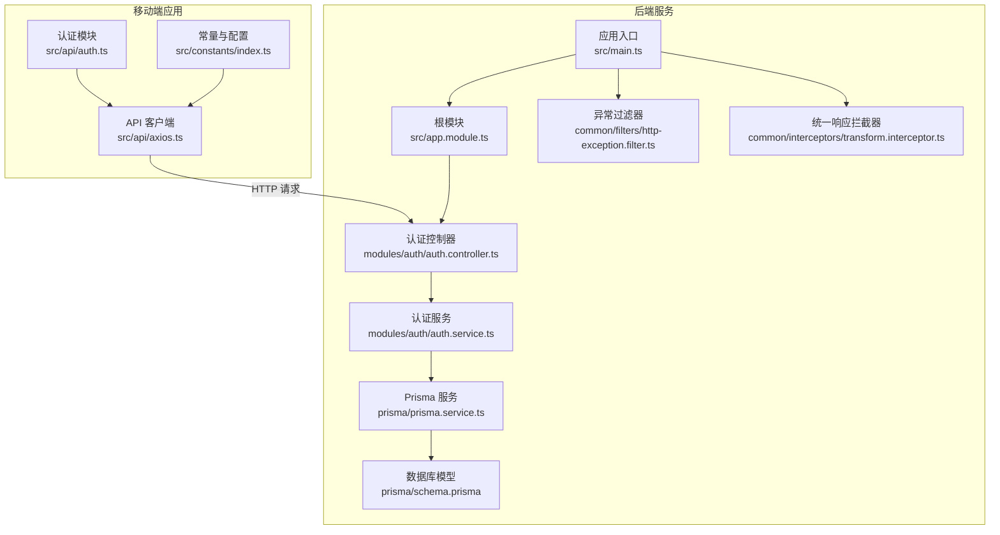
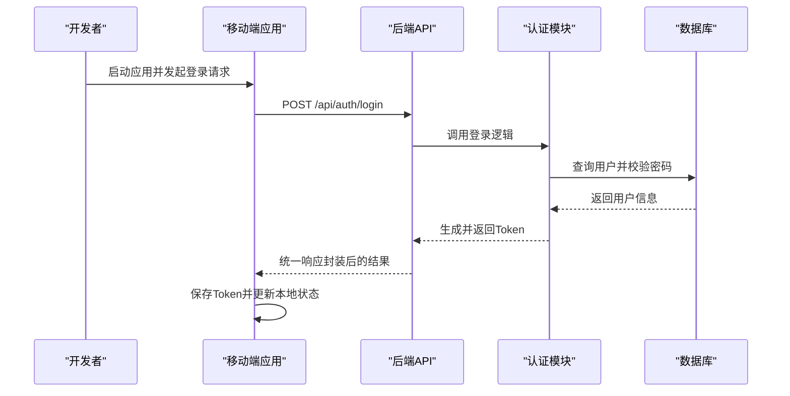
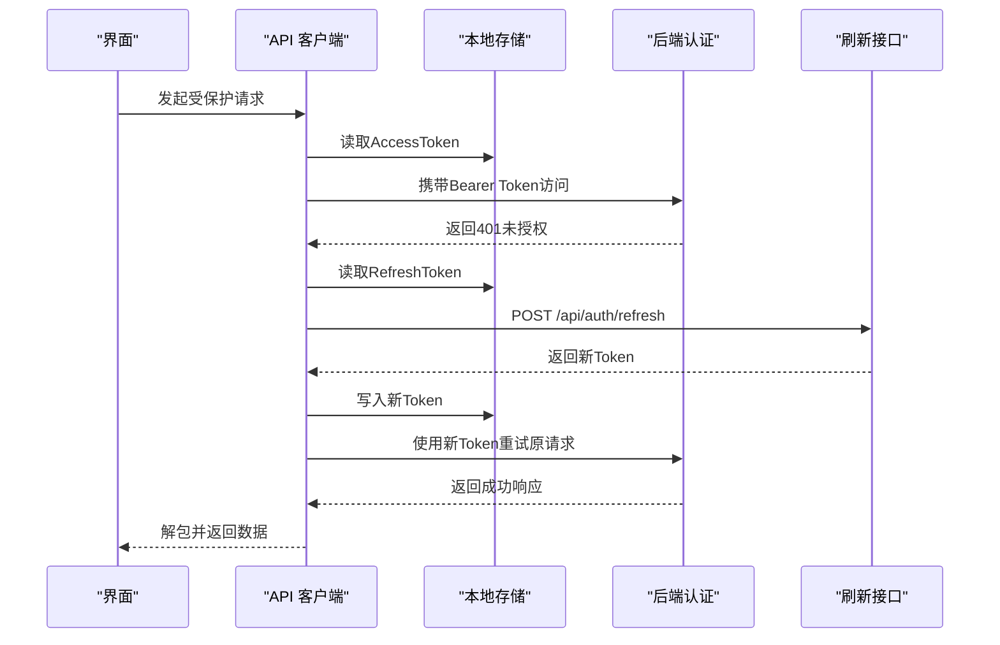
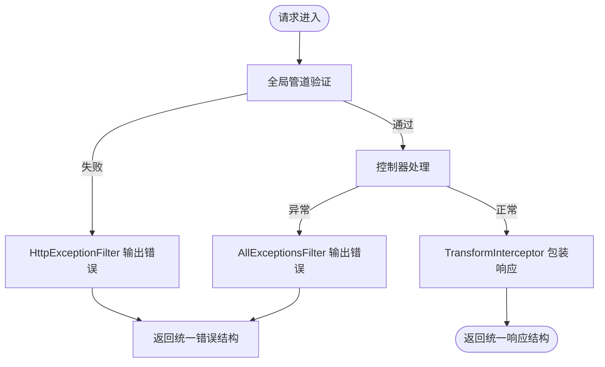
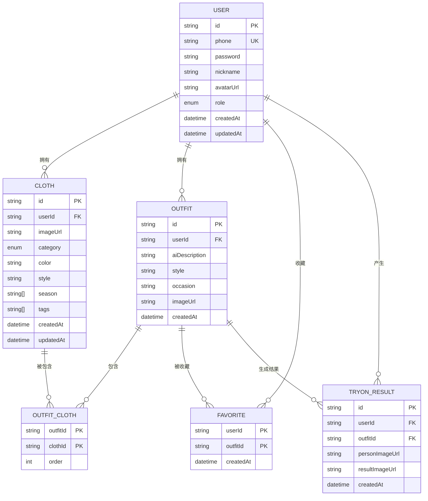
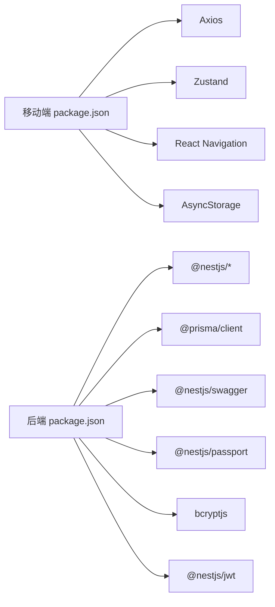

# 故障排除

<cite>
**本文引用的文件**
- [FreeDressApp/package.json](file://FreeDressApp/package.json)
- [FreeDressApp/src/constants/index.ts](file://FreeDressApp/src/constants/index.ts)
- [FreeDressApp/src/api/axios.ts](file://FreeDressApp/src/api/axios.ts)
- [FreeDressApp/src/api/auth.ts](file://FreeDressApp/src/api/auth.ts)
- [FreeDressApp/android/app/build.gradle](file://FreeDressApp/android/app/build.gradle)
- [backend/package.json](file://backend/package.json)
- [backend/src/main.ts](file://backend/src/main.ts)
- [backend/src/app.module.ts](file://backend/src/app.module.ts)
- [backend/src/common/filters/http-exception.filter.ts](file://backend/src/common/filters/http-exception.filter.ts)
- [backend/src/common/interceptors/transform.interceptor.ts](file://backend/src/common/interceptors/transform.interceptor.ts)
- [backend/src/modules/auth/auth.controller.ts](file://backend/src/modules/auth/auth.controller.ts)
- [backend/src/modules/auth/auth.service.ts](file://backend/src/modules/auth/auth.service.ts)
- [backend/src/prisma/prisma.service.ts](file://backend/src/prisma/prisma.service.ts)
- [backend/prisma/schema.prisma](file://backend/prisma/schema.prisma)
- [FreeDressApp/README.md](file://FreeDressApp/README.md)
- [backend/README.md](file://backend/README.md)
</cite>

## 目录
1. [简介](#简介)
2. [项目结构](#项目结构)
3. [核心组件](#核心组件)
4. [架构总览](#架构总览)
5. [详细组件分析](#详细组件分析)
6. [依赖关系分析](#依赖关系分析)
7. [性能考虑](#性能考虑)
8. [故障排除指南](#故障排除指南)
9. [结论](#结论)
10. [附录](#附录)

## 简介
本指南面向畅搭(FreeDress)项目的开发者与运维人员，提供从开发环境搭建、依赖冲突、配置错误，到API调用失败、数据库连接问题、移动端崩溃、后端服务异常与性能问题的系统化故障排除流程与应急处理方案。文档结合前端React Native应用、后端NestJS服务与Prisma数据库的实际实现，给出可落地的诊断步骤与修复建议。

## 项目结构
畅搭项目采用前后端分离架构：
- 移动端应用（React Native）位于 FreeDressApp，负责用户交互、状态管理与API调用。
- 后端服务（NestJS）位于 backend，提供REST API、认证、业务逻辑与数据库访问。
- 数据库使用 PostgreSQL，ORM为 Prisma，模型定义于 schema.prisma。

图表来源
- [backend/src/main.ts:1-62](file://backend/src/main.ts#L1-L62)
- [backend/src/app.module.ts:1-33](file://backend/src/app.module.ts#L1-L33)
- [backend/src/common/filters/http-exception.filter.ts:1-81](file://backend/src/common/filters/http-exception.filter.ts#L1-L81)
- [backend/src/common/interceptors/transform.interceptor.ts](file://backend/src/common/interceptors/transform.interceptor.ts)
- [backend/src/modules/auth/auth.controller.ts:1-92](file://backend/src/modules/auth/auth.controller.ts#L1-L92)
- [backend/src/modules/auth/auth.service.ts:1-279](file://backend/src/modules/auth/auth.service.ts#L1-L279)
- [backend/src/prisma/prisma.service.ts:1-27](file://backend/src/prisma/prisma.service.ts#L1-L27)
- [backend/prisma/schema.prisma:1-132](file://backend/prisma/schema.prisma#L1-L132)
- [FreeDressApp/src/api/axios.ts:1-108](file://FreeDressApp/src/api/axios.ts#L1-L108)
- [FreeDressApp/src/api/auth.ts:1-101](file://FreeDressApp/src/api/auth.ts#L1-L101)
- [FreeDressApp/src/constants/index.ts:1-212](file://FreeDressApp/src/constants/index.ts#L1-L212)

章节来源
- [backend/src/main.ts:1-62](file://backend/src/main.ts#L1-L62)
- [backend/src/app.module.ts:1-33](file://backend/src/app.module.ts#L1-L33)
- [backend/src/modules/auth/auth.controller.ts:1-92](file://backend/src/modules/auth/auth.controller.ts#L1-L92)
- [backend/src/modules/auth/auth.service.ts:1-279](file://backend/src/modules/auth/auth.service.ts#L1-L279)
- [backend/src/prisma/prisma.service.ts:1-27](file://backend/src/prisma/prisma.service.ts#L1-L27)
- [backend/prisma/schema.prisma:1-132](file://backend/prisma/schema.prisma#L1-L132)
- [FreeDressApp/src/api/axios.ts:1-108](file://FreeDressApp/src/api/axios.ts#L1-L108)
- [FreeDressApp/src/api/auth.ts:1-101](file://FreeDressApp/src/api/auth.ts#L1-L101)
- [FreeDressApp/src/constants/index.ts:1-212](file://FreeDressApp/src/constants/index.ts#L1-L212)

## 核心组件
- 移动端API客户端：统一请求/响应处理、自动注入认证头、401自动刷新Token、错误消息标准化。
- 后端异常过滤器：统一HTTP异常与全局异常输出格式，便于前端识别与提示。
- 认证模块：注册/登录/刷新/重置密码，配合JWT与Prisma用户模型。
- 数据库层：Prisma连接生命周期管理，模型定义清晰，索引与外键约束明确。

章节来源
- [FreeDressApp/src/api/axios.ts:1-108](file://FreeDressApp/src/api/axios.ts#L1-L108)
- [backend/src/common/filters/http-exception.filter.ts:1-81](file://backend/src/common/filters/http-exception.filter.ts#L1-L81)
- [backend/src/modules/auth/auth.service.ts:1-279](file://backend/src/modules/auth/auth.service.ts#L1-L279)
- [backend/src/prisma/prisma.service.ts:1-27](file://backend/src/prisma/prisma.service.ts#L1-L27)

## 架构总览
后端服务启动时完成以下关键配置：
- 全局管道：参数白名单、类型转换与验证。
- 全局拦截器：统一响应包装。
- 全局过滤器：统一错误输出。
- CORS启用与API前缀设置。
- Swagger文档暴露。
- Prisma连接建立与断开日志。

图表来源
- [backend/src/main.ts:12-59](file://backend/src/main.ts#L12-L59)
- [backend/src/modules/auth/auth.controller.ts:46-49](file://backend/src/modules/auth/auth.controller.ts#L46-L49)
- [backend/src/modules/auth/auth.service.ts:102-135](file://backend/src/modules/auth/auth.service.ts#L102-L135)
- [backend/src/prisma/prisma.service.ts:14-24](file://backend/src/prisma/prisma.service.ts#L14-L24)

## 详细组件分析

### 移动端API客户端与认证流程
移动端通过Axios实例统一处理请求与响应，具备以下能力：
- 自动从本地存储读取并附加认证头。
- 401未授权时尝试刷新Token并重试原请求。
- 其他错误提取message并抛出，便于UI层统一提示。

图表来源
- [FreeDressApp/src/api/axios.ts:24-105](file://FreeDressApp/src/api/axios.ts#L24-L105)
- [FreeDressApp/src/constants/index.ts:9-205](file://FreeDressApp/src/constants/index.ts#L9-L205)

章节来源
- [FreeDressApp/src/api/axios.ts:1-108](file://FreeDressApp/src/api/axios.ts#L1-L108)
- [FreeDressApp/src/constants/index.ts:1-212](file://FreeDressApp/src/constants/index.ts#L1-L212)

### 后端异常处理与统一响应
- 异常过滤器：捕获HttpException与全局异常，统一输出包含状态码、消息、时间戳与路径的结构化响应。
- 统一响应拦截器：将业务返回值包裹在统一结构中，便于前端解析。

图表来源
- [backend/src/common/filters/http-exception.filter.ts:8-81](file://backend/src/common/filters/http-exception.filter.ts#L8-L81)
- [backend/src/common/interceptors/transform.interceptor.ts](file://backend/src/common/interceptors/transform.interceptor.ts)
- [backend/src/main.ts:15-29](file://backend/src/main.ts#L15-L29)

章节来源
- [backend/src/common/filters/http-exception.filter.ts:1-81](file://backend/src/common/filters/http-exception.filter.ts#L1-L81)
- [backend/src/common/interceptors/transform.interceptor.ts](file://backend/src/common/interceptors/transform.interceptor.ts)
- [backend/src/main.ts:1-62](file://backend/src/main.ts#L1-L62)

### 认证模块与数据库模型
- 认证服务：注册/登录/刷新/重置密码，使用bcrypt加密、JWT签发，以及内存Map维护重置令牌（生产需Redis）。
- 数据库模型：用户、衣物、搭配、收藏、试穿结果，定义了主键、唯一索引、外键与删除级联策略。

图表来源
- [backend/prisma/schema.prisma:14-131](file://backend/prisma/schema.prisma#L14-L131)

章节来源
- [backend/src/modules/auth/auth.service.ts:1-279](file://backend/src/modules/auth/auth.service.ts#L1-L279)
- [backend/prisma/schema.prisma:1-132](file://backend/prisma/schema.prisma#L1-L132)

## 依赖关系分析
- 移动端依赖：React Native、Axios、Zustand、React Navigation、AsyncStorage等；脚本与引擎版本在package.json中声明。
- 后端依赖：NestJS、Prisma、Swagger、Passport、bcryptjs、JWT等；脚本命令涵盖构建、开发、测试与Prisma相关任务。

图表来源
- [FreeDressApp/package.json:12-56](file://FreeDressApp/package.json#L12-L56)
- [backend/package.json:26-72](file://backend/package.json#L26-L72)

章节来源
- [FreeDressApp/package.json:1-57](file://FreeDressApp/package.json#L1-L57)
- [backend/package.json:1-91](file://backend/package.json#L1-L91)

## 性能考虑
- 前端性能：使用Reanimated、FlashList优化动画与列表渲染；合理拆分组件与懒加载；避免不必要的重渲染。
- 后端性能：开启全局验证管道减少脏数据；使用Prisma查询优化与索引；限制分页大小；缓存热点数据（如验证码、静态资源）。
- 网络与存储：移动端请求超时与重试策略已在Axios中配置；后端CORS与API前缀有助于跨域与路由清晰。

章节来源
- [FreeDressApp/package.json:12-31](file://FreeDressApp/package.json#L12-L31)
- [backend/src/main.ts:15-39](file://backend/src/main.ts#L15-L39)
- [backend/prisma/schema.prisma:56-58](file://backend/prisma/schema.prisma#L56-L58)

## 故障排除指南

### 一、开发环境搭建问题
- 环境要求不符
  - 现象：安装或运行时报错，提示Node版本过低或缺少JDK/Xcode。
  - 排查：核对移动端与后端各自要求的最低版本，确保Node、JDK、Xcode满足要求。
  - 修复：升级Node至要求版本，安装JDK 17与Xcode，或按README指引准备环境。
- 依赖安装失败
  - 现象：npm install报错，或iOS依赖安装失败。
  - 排查：检查网络与npm源；确认已执行iOS依赖安装命令；查看具体错误日志。
  - 修复：更换镜像源，清理缓存后重试；iOS需先执行bundle install与pod install。
- 端口占用
  - 现象：后端启动失败，提示端口被占用。
  - 排查：确认默认端口是否被占用。
  - 修复：修改端口或释放占用端口。

章节来源
- [FreeDressApp/README.md:51-84](file://FreeDressApp/README.md#L51-L84)
- [backend/README.md:57-109](file://backend/README.md#L57-L109)

### 二、依赖冲突与配置错误
- 版本不匹配
  - 现象：Metro打包失败、iOS构建失败、Gradle同步失败。
  - 排查：对比package.json中的版本与工程要求，检查Gradle与Xcode版本。
  - 修复：按README调整版本，必要时降级/升级以兼容。
- 配置文件缺失
  - 现象：后端无法连接数据库或启动失败。
  - 排查：确认.env文件是否存在且包含数据库URL、JWT密钥等。
  - 修复：复制.env.example并填写正确配置项。

章节来源
- [backend/README.md:77-88](file://backend/README.md#L77-L88)
- [backend/src/main.ts:51-52](file://backend/src/main.ts#L51-L52)

### 三、API调用失败排查
- 网络问题
  - 现象：请求超时、无法连接后端。
  - 排查：确认移动端API基础地址指向正确后端；检查防火墙与代理；验证后端是否已启动。
  - 修复：修正API_BASE_URL；确保后端监听端口可达。
- 认证失败
  - 现象：401未授权，频繁弹出登录。
  - 排查：检查本地存储中的Token是否有效；确认刷新流程是否成功；核对JWT密钥配置。
  - 修复：清理本地Token并重新登录；检查后端JWT密钥与过期时间。
- 数据格式错误
  - 现象：400错误，提示参数非法。
  - 排查：查看后端统一异常输出中的message；确认请求体字段与类型。
  - 修复：根据message提示修正参数；启用全局验证管道以提前拦截。

章节来源
- [FreeDressApp/src/constants/index.ts](file://FreeDressApp/src/constants/index.ts#L9)
- [FreeDressApp/src/api/axios.ts:14-18](file://FreeDressApp/src/api/axios.ts#L14-L18)
- [backend/src/common/filters/http-exception.filter.ts:19-25](file://backend/src/common/filters/http-exception.filter.ts#L19-L25)
- [backend/src/main.ts:15-22](file://backend/src/main.ts#L15-L22)

### 四、数据库连接问题
- 连接超时/失败
  - 现象：应用启动时报数据库连接错误。
  - 排查：确认DATABASE_URL正确；数据库服务是否运行；网络连通性。
  - 修复：修正连接字符串；启动数据库服务；检查防火墙。
- 权限不足
  - 现象：查询/写入失败，提示权限错误。
  - 排查：核对数据库用户权限；确认数据库与表存在。
  - 修复：授予相应权限或创建数据库与用户。
- 迁移失败
  - 现象：执行迁移时报错。
  - 排查：查看Prisma迁移日志；确认schema.prisma与数据库版本一致。
  - 修复：按README执行prisma:generate与prisma:migrate；必要时回滚并重新迁移。

章节来源
- [backend/prisma/schema.prisma:8-11](file://backend/prisma/schema.prisma#L8-L11)
- [backend/src/prisma/prisma.service.ts:14-24](file://backend/src/prisma/prisma.service.ts#L14-L24)
- [backend/README.md:90-98](file://backend/README.md#L90-L98)

### 五、移动端应用崩溃调试
- 日志分析
  - 步骤：使用设备日志或调试器查看控制台输出；关注401自动刷新失败、网络异常与未捕获异常。
  - 工具：React Native调试器、Flipper、设备系统日志。
- 内存泄漏检测
  - 步骤：观察长时间使用后内存持续增长；检查未释放的订阅、定时器与缓存。
  - 建议：使用弱引用、及时清理订阅；避免在组件卸载后仍回调。
- 性能问题诊断
  - 步骤：使用Reanimated与FlashList优化动画与列表；减少不必要的重渲染；启用StrictMode定位问题。
  - 建议：拆分组件、延迟加载、缓存计算结果。

章节来源
- [FreeDressApp/src/api/axios.ts:54-98](file://FreeDressApp/src/api/axios.ts#L54-L98)
- [FreeDressApp/android/app/build.gradle:75-108](file://FreeDressApp/android/app/build.gradle#L75-L108)

### 六、后端服务异常处理
- 错误日志分析
  - 步骤：查看统一异常过滤器输出的错误详情；在开发环境打印堆栈以便定位。
  - 建议：结合Swagger测试接口，逐步缩小问题范围。
- 服务重启
  - 步骤：后端进程异常退出时，使用脚本或容器编排工具重启；确保Prisma连接在模块初始化/销毁时正确管理。
- 数据恢复
  - 步骤：备份数据库；在迁移失败时回滚并修复schema；使用Prisma Studio检查数据一致性。

章节来源
- [backend/src/common/filters/http-exception.filter.ts:67-70](file://backend/src/common/filters/http-exception.filter.ts#L67-L70)
- [backend/src/prisma/prisma.service.ts:14-24](file://backend/src/prisma/prisma.service.ts#L14-L24)
- [backend/README.md:259-261](file://backend/README.md#L259-L261)

### 七、性能问题诊断与优化
- 前端
  - 使用Reanimated与FlashList；避免深层嵌套与重复计算；合理分页与懒加载。
- 后端
  - 启用全局验证与拦截器；为高频查询建立索引；限制分页大小；缓存静态资源。
- 网络
  - 移动端设置合理超时与重试；后端开启CORS与API前缀，减少跨域与路由歧义。

章节来源
- [FreeDressApp/package.json:18-24](file://FreeDressApp/package.json#L18-L24)
- [backend/src/main.ts:15-39](file://backend/src/main.ts#L15-L39)
- [backend/prisma/schema.prisma:56-58](file://backend/prisma/schema.prisma#L56-L58)

## 结论
本指南提供了从开发环境到服务上线的全链路故障排除方法。通过统一的异常与响应处理、严谨的数据库模型与迁移流程、以及移动端与后端的协同配置，可以快速定位并解决问题。建议团队在CI/CD中加入自动化测试与健康检查，以降低线上风险。

## 附录
- 常用命令
  - 移动端：启动Metro、运行Android/iOS、代码检查与测试。
  - 后端：开发/生产启动、构建、测试、Prisma生成/迁移/Studio。
- 环境变量
  - 数据库URL、JWT密钥与过期时间等需在.env中正确配置。

章节来源
- [FreeDressApp/README.md:183-191](file://FreeDressApp/README.md#L183-L191)
- [backend/README.md:248-262](file://backend/README.md#L248-L262)
- [backend/README.md:82-88](file://backend/README.md#L82-L88)