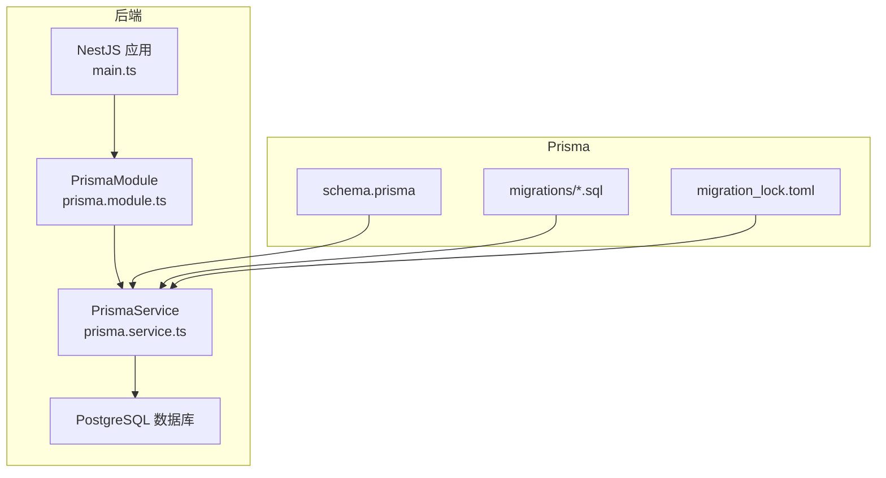
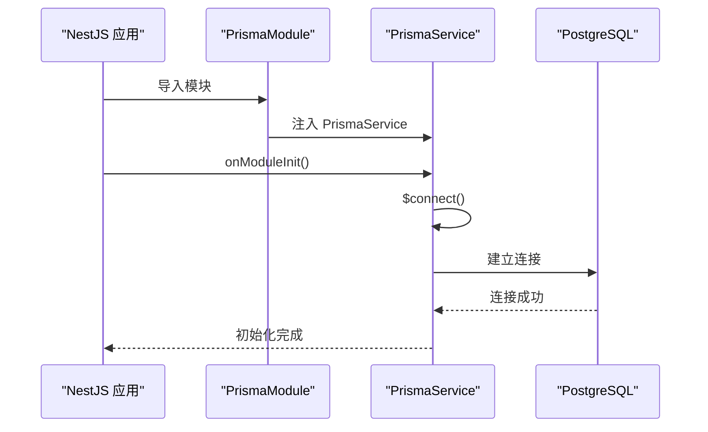
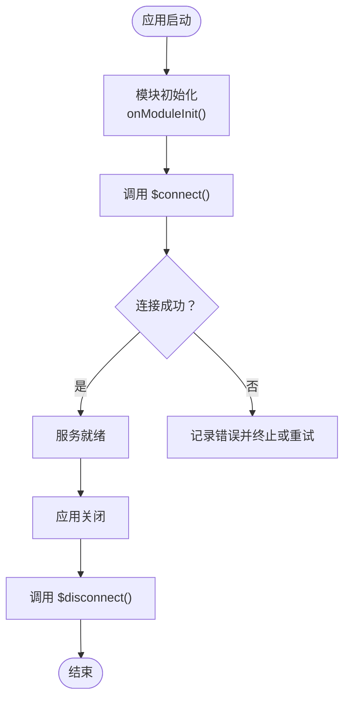
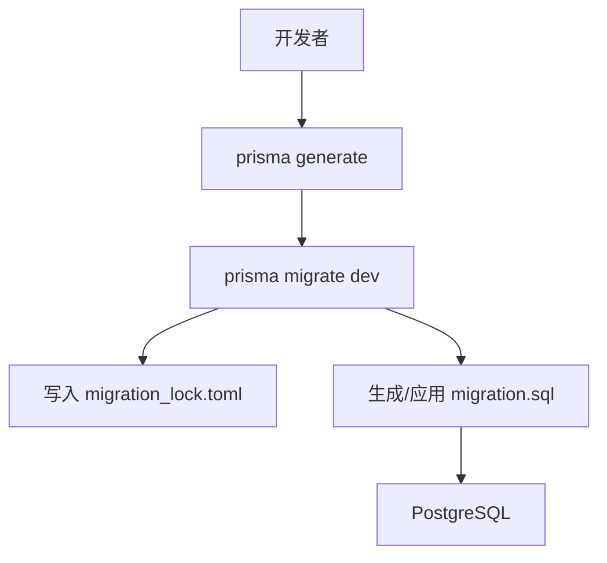
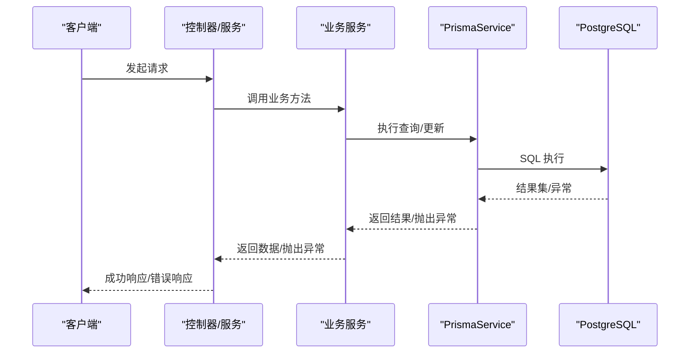
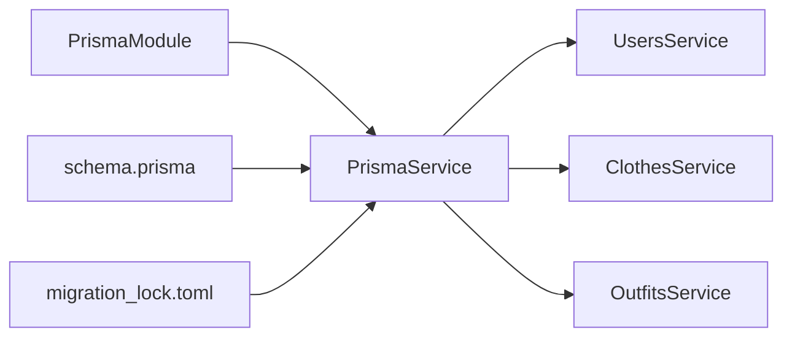

# 数据库问题

<cite>
**本文引用的文件**
- [schema.prisma](file://backend/prisma/schema.prisma)
- [prisma.service.ts](file://backend/src/prisma/prisma.service.ts)
- [prisma.module.ts](file://backend/src/prisma/prisma.module.ts)
- [package.json](file://backend/package.json)
- [migration_lock.toml](file://backend/prisma/migrations/migration_lock.toml)
- [20260507090458_init/migration.sql](file://backend/prisma/migrations/20260507090458_init/migration.sql)
- [users.service.ts](file://backend/src/modules/users/users.service.ts)
- [clothes.service.ts](file://backend/src/modules/clothes/clothes.service.ts)
- [outfits.service.ts](file://backend/src/modules/outfits/outfits.service.ts)
- [http-exception.filter.ts](file://backend/src/common/filters/http-exception.filter.ts)
</cite>

## 目录
1. [简介](#简介)
2. [项目结构](#项目结构)
3. [核心组件](#核心组件)
4. [架构总览](#架构总览)
5. [详细组件分析](#详细组件分析)
6. [依赖分析](#依赖分析)
7. [性能考虑](#性能考虑)
8. [故障排查指南](#故障排查指南)
9. [结论](#结论)
10. [附录](#附录)

## 简介
本指南面向畅搭(FreeDress)项目的数据库问题排查与优化，覆盖以下主题：
- 数据库连接失败的诊断：连接字符串配置、网络连通性与服务可用性检查
- Prisma 迁移失败的解决方案：迁移文件冲突、数据类型不兼容与约束违反
- 查询性能问题的优化：索引缺失、查询语句优化与事务锁等待
- 数据一致性问题的排查：外键约束检查、数据完整性验证与事务回滚
- 数据库备份与恢复操作指南
- 常见数据库错误的诊断与修复

## 项目结构
后端使用 NestJS + Prisma，数据库为 PostgreSQL。关键位置如下：
- Prisma 模式定义：backend/prisma/schema.prisma
- Prisma 客户端生成与迁移脚本：backend/package.json 中的 prisma:* 脚本
- Prisma 连接与生命周期：backend/src/prisma/prisma.service.ts
- Prisma 模块导出：backend/src/prisma/prisma.module.ts
- 初始迁移 SQL：backend/prisma/migrations/20260507090458_init/migration.sql
- 迁移锁文件：backend/prisma/migrations/migration_lock.toml
- 业务服务层（查询示例）：backend/src/modules/*/service.ts
- 全局异常过滤器：backend/src/common/filters/http-exception.filter.ts

图表来源
- [prisma.module.ts:1-14](file://backend/src/prisma/prisma.module.ts#L1-L14)
- [prisma.service.ts:1-27](file://backend/src/prisma/prisma.service.ts#L1-L27)
- [schema.prisma:1-132](file://backend/prisma/schema.prisma#L1-L132)
- [20260507090458_init/migration.sql:1-121](file://backend/prisma/migrations/20260507090458_init/migration.sql#L1-L121)
- [migration_lock.toml:1-3](file://backend/prisma/migrations/migration_lock.toml#L1-L3)

章节来源
- [prisma.module.ts:1-14](file://backend/src/prisma/prisma.module.ts#L1-L14)
- [prisma.service.ts:1-27](file://backend/src/prisma/prisma.service.ts#L1-L27)
- [schema.prisma:1-132](file://backend/prisma/schema.prisma#L1-L132)
- [package.json:8-25](file://backend/package.json#L8-L25)
- [20260507090458_init/migration.sql:1-121](file://backend/prisma/migrations/20260507090458_init/migration.sql#L1-L121)
- [migration_lock.toml:1-3](file://backend/prisma/migrations/migration_lock.toml#L1-L3)

## 核心组件
- Prisma 模式(schema.prisma)：定义数据模型、索引、外键与枚举类型，驱动客户端生成与迁移
- PrismaService：封装 PrismaClient 的连接与断开生命周期，确保应用启动/关闭时正确管理连接
- PrismaModule：全局模块，向整个应用注入 PrismaService
- 迁移系统：通过 Prisma CLI 生成迁移并应用；迁移锁文件防止并发冲突
- 业务服务：users/clothes/outfits 服务展示典型查询模式与错误处理

章节来源
- [schema.prisma:1-132](file://backend/prisma/schema.prisma#L1-L132)
- [prisma.service.ts:1-27](file://backend/src/prisma/prisma.service.ts#L1-L27)
- [prisma.module.ts:1-14](file://backend/src/prisma/prisma.module.ts#L1-L14)
- [package.json:21-24](file://backend/package.json#L21-L24)
- [users.service.ts:1-102](file://backend/src/modules/users/users.service.ts#L1-L102)
- [clothes.service.ts:1-148](file://backend/src/modules/clothes/clothes.service.ts#L1-L148)
- [outfits.service.ts:1-123](file://backend/src/modules/outfits/outfits.service.ts#L1-L123)

## 架构总览
下图展示数据库连接与迁移的关键交互：

图表来源
- [prisma.module.ts:1-14](file://backend/src/prisma/prisma.module.ts#L1-L14)
- [prisma.service.ts:14-17](file://backend/src/prisma/prisma.service.ts#L14-L17)

## 详细组件分析

### Prisma 连接与生命周期
- 连接建立：在模块初始化阶段调用 $connect()，并在应用销毁时 $disconnect()
- 日志输出：连接成功与断开时打印日志，便于运维观察
- 环境变量：数据库 URL 来自环境变量 DATABASE_URL，需确保在运行环境中正确设置

图表来源
- [prisma.service.ts:14-25](file://backend/src/prisma/prisma.service.ts#L14-L25)

章节来源
- [prisma.service.ts:1-27](file://backend/src/prisma/prisma.service.ts#L1-L27)

### 迁移系统与锁定机制
- 迁移命令：通过 package.json 中的 prisma:migrate 脚本执行
- 迁移文件：初始迁移位于 migrations/20260507090458_init/migration.sql
- 锁文件：migration_lock.toml 标识迁移提供者为 postgresql，避免并发冲突
- 模式驱动：schema.prisma 决定迁移内容与客户端行为

图表来源
- [package.json:21-24](file://backend/package.json#L21-L24)
- [schema.prisma:1-12](file://backend/prisma/schema.prisma#L1-L12)
- [20260507090458_init/migration.sql:1-121](file://backend/prisma/migrations/20260507090458_init/migration.sql#L1-L121)
- [migration_lock.toml:1-3](file://backend/prisma/migrations/migration_lock.toml#L1-L3)

章节来源
- [package.json:21-24](file://backend/package.json#L21-L24)
- [schema.prisma:1-12](file://backend/prisma/schema.prisma#L1-L12)
- [20260507090458_init/migration.sql:1-121](file://backend/prisma/migrations/20260507090458_init/migration.sql#L1-L121)
- [migration_lock.toml:1-3](file://backend/prisma/migrations/migration_lock.toml#L1-L3)

### 业务查询与错误处理
- 用户查询：按 ID 查找用户并统计资源数量
- 衣物查询：分页/排序/条件过滤，包含权限校验
- 搭配查询：包含关联数据与收藏状态判断
- 异常处理：统一捕获 HttpException 与未处理异常，返回标准化错误响应

图表来源
- [users.service.ts:18-44](file://backend/src/modules/users/users.service.ts#L18-L44)
- [clothes.service.ts:38-51](file://backend/src/modules/clothes/clothes.service.ts#L38-L51)
- [outfits.service.ts:49-73](file://backend/src/modules/outfits/outfits.service.ts#L49-L73)
- [http-exception.filter.ts:8-28](file://backend/src/common/filters/http-exception.filter.ts#L8-L28)

章节来源
- [users.service.ts:1-102](file://backend/src/modules/users/users.service.ts#L1-L102)
- [clothes.service.ts:1-148](file://backend/src/modules/clothes/clothes.service.ts#L1-L148)
- [outfits.service.ts:1-123](file://backend/src/modules/outfits/outfits.service.ts#L1-L123)
- [http-exception.filter.ts:1-81](file://backend/src/common/filters/http-exception.filter.ts#L1-L81)

## 依赖分析
- Prisma 模块与服务：PrismaModule 导出 PrismaService，供各业务模块注入使用
- 业务服务依赖：users/clothes/outfits 服务均依赖 PrismaService
- 迁移依赖：schema.prisma 与 migration_lock.toml 共同决定迁移行为

图表来源
- [prisma.module.ts:1-14](file://backend/src/prisma/prisma.module.ts#L1-L14)
- [prisma.service.ts:1-27](file://backend/src/prisma/prisma.service.ts#L1-L27)
- [users.service.ts:1-12](file://backend/src/modules/users/users.service.ts#L1-L12)
- [clothes.service.ts:1-13](file://backend/src/modules/clothes/clothes.service.ts#L1-L13)
- [outfits.service.ts:1-7](file://backend/src/modules/outfits/outfits.service.ts#L1-L7)
- [schema.prisma:1-12](file://backend/prisma/schema.prisma#L1-L12)
- [migration_lock.toml:1-3](file://backend/prisma/migrations/migration_lock.toml#L1-L3)

章节来源
- [prisma.module.ts:1-14](file://backend/src/prisma/prisma.module.ts#L1-L14)
- [prisma.service.ts:1-27](file://backend/src/prisma/prisma.service.ts#L1-L27)
- [users.service.ts:1-12](file://backend/src/modules/users/users.service.ts#L1-L12)
- [clothes.service.ts:1-13](file://backend/src/modules/clothes/clothes.service.ts#L1-L13)
- [outfits.service.ts:1-7](file://backend/src/modules/outfits/outfits.service.ts#L1-L7)
- [schema.prisma:1-12](file://backend/prisma/schema.prisma#L1-L12)
- [migration_lock.toml:1-3](file://backend/prisma/migrations/migration_lock.toml#L1-L3)

## 性能考虑
- 索引策略
  - schema.prisma 已为 clothes.category、outfits.userId、tryon_results.userId/ outiftId 等字段建立索引
  - 业务查询中涉及这些字段的 WHERE/ORDER BY 可受益于现有索引
- 查询优化建议
  - 避免 N+1 查询：优先使用 include 或 select 精准投影
  - 控制返回字段大小：仅选择需要的列，减少序列化开销
  - 合理分页：对大数据量表使用分页与游标
- 事务与锁
  - 将相关写操作放入单个事务，减少锁竞争
  - 避免长事务，及时提交或回滚
- 监控与诊断
  - 开启慢查询日志与执行计划分析
  - 在开发环境开启详细日志以便定位瓶颈

## 故障排查指南

### 一、数据库连接失败
- 检查环境变量
  - 确认运行环境存在 DATABASE_URL，并指向正确的 PostgreSQL 实例
  - 验证连接串格式与凭据正确性
- 网络连通性
  - 从应用服务器 ping/ telnet 数据库主机与端口
  - 检查防火墙与安全组规则是否放行数据库端口
- 服务可用性
  - 确认数据库服务进程正常运行
  - 查看数据库日志，确认无认证/权限/资源限制错误
- 应用侧检查
  - 观察 PrismaService 初始化日志，确认 $connect() 是否抛错
  - 如连接池耗尽，检查并发连接数与超时配置

章节来源
- [prisma.service.ts:14-17](file://backend/src/prisma/prisma.service.ts#L14-L17)
- [schema.prisma:8-11](file://backend/prisma/schema.prisma#L8-L11)

### 二、Prisma 迁移失败
- 迁移文件冲突
  - 检查 migration_lock.toml 是否与当前数据库提供者一致
  - 若多人协作，确保迁移顺序一致，避免重复或遗漏
- 数据类型不兼容
  - 对比 schema.prisma 与迁移 SQL，确认枚举与数组类型定义一致
  - 若已有数据，注意默认值与非空约束对历史数据的影响
- 约束违反
  - 检查外键约束与唯一索引冲突
  - 必要时先清理或修正历史数据再重试迁移
- 常用操作
  - 重新生成客户端：使用 prisma:generate 脚本
  - 应用迁移：使用 prisma:migrate 脚本
  - 启动数据目录：使用 prisma:studio 脚本进行本地可视化

章节来源
- [package.json:21-24](file://backend/package.json#L21-L24)
- [schema.prisma:1-132](file://backend/prisma/schema.prisma#L1-L132)
- [20260507090458_init/migration.sql:1-121](file://backend/prisma/migrations/20260507090458_init/migration.sql#L1-L121)
- [migration_lock.toml:1-3](file://backend/prisma/migrations/migration_lock.toml#L1-L3)

### 三、查询性能问题
- 索引缺失
  - 检查 schema.prisma 中的索引声明与实际数据库索引是否一致
  - 对高频查询字段补充必要索引
- 查询语句优化
  - 使用 select 精准投影，避免不必要的 include
  - 对复杂聚合使用 groupBy 并结合 where 条件
- 事务锁等待
  - 减少事务范围，避免长时间持有行级锁
  - 降低隔离级别（谨慎评估一致性影响）

章节来源
- [schema.prisma:56-58](file://backend/prisma/schema.prisma#L56-L58)
- [users.service.ts:75-99](file://backend/src/modules/users/users.service.ts#L75-L99)
- [clothes.service.ts:123-146](file://backend/src/modules/clothes/clothes.service.ts#L123-L146)
- [outfits.service.ts:104-121](file://backend/src/modules/outfits/outfits.service.ts#L104-L121)

### 四、数据一致性问题
- 外键约束检查
  - 确认 schema.prisma 中的外键关系与迁移 SQL 一致
  - 删除/更新父记录前，检查是否有子记录依赖
- 数据完整性验证
  - 使用 Prisma 查询验证关键唯一性（如用户手机号）
  - 对枚举字段进行边界校验
- 事务回滚处理
  - 将关键写操作包裹在事务中，失败时回滚
  - 记录回滚原因，便于后续修复与审计

章节来源
- [schema.prisma:98-120](file://backend/prisma/schema.prisma#L98-L120)
- [20260507090458_init/migration.sql:98-120](file://backend/prisma/migrations/20260507090458_init/migration.sql#L98-L120)
- [users.service.ts:39-41](file://backend/src/modules/users/users.service.ts#L39-L41)
- [clothes.service.ts:75-78](file://backend/src/modules/clothes/clothes.service.ts#L75-L78)
- [outfits.service.ts:81-102](file://backend/src/modules/outfits/outfits.service.ts#L81-L102)

### 五、数据库备份与恢复
- 备份
  - 使用数据库自带工具进行逻辑/物理备份
  - 备份 schema 与数据，保留迁移历史与锁文件
- 恢复
  - 在新环境还原数据后，确保 DATABASE_URL 正确
  - 重新执行 prisma:generate 与 prisma:migrate，确保客户端与数据库一致
- 验证
  - 使用 prisma:studio 检查关键表数据
  - 运行核心接口用例，验证读写功能

章节来源
- [package.json:21-24](file://backend/package.json#L21-L24)
- [schema.prisma:1-12](file://backend/prisma/schema.prisma#L1-L12)
- [migration_lock.toml:1-3](file://backend/prisma/migrations/migration_lock.toml#L1-L3)

### 六、常见数据库错误与修复
- 连接超时/拒绝
  - 检查网络连通性与数据库负载
  - 调整连接池参数与超时时间
- 权限不足
  - 确认数据库用户具备所需权限
  - 检查迁移与查询使用的模式与表名
- 迁移冲突
  - 清理锁文件并重新生成迁移
  - 同步团队迁移进度，避免重复迁移
- 查询异常
  - 使用 Prisma 日志与数据库执行计划分析
  - 逐步简化查询，定位具体字段或条件

章节来源
- [http-exception.filter.ts:50-80](file://backend/src/common/filters/http-exception.filter.ts#L50-L80)
- [prisma.service.ts:14-17](file://backend/src/prisma/prisma.service.ts#L14-L17)

## 结论
通过规范的连接配置、严格的迁移流程、合理的索引与查询优化，以及完善的异常与回滚处理，可以有效提升畅搭(FreeDress)项目的数据库稳定性与性能。建议在开发与生产环境中分别制定明确的备份与恢复策略，并持续监控关键指标以预防问题发生。

## 附录
- 关键文件路径与用途
  - backend/prisma/schema.prisma：数据模型与索引定义
  - backend/src/prisma/prisma.service.ts：数据库连接生命周期
  - backend/src/prisma/prisma.module.ts：全局注入
  - backend/package.json：迁移与客户端生成脚本
  - backend/prisma/migrations/migration_lock.toml：迁移锁
  - backend/prisma/migrations/20260507090458_init/migration.sql：初始迁移 SQL
  - backend/src/modules/*/services.ts：查询与业务逻辑示例
  - backend/src/common/filters/http-exception.filter.ts：异常统一处理