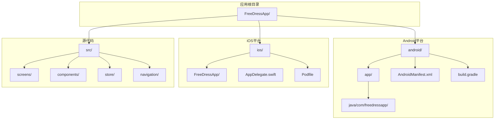
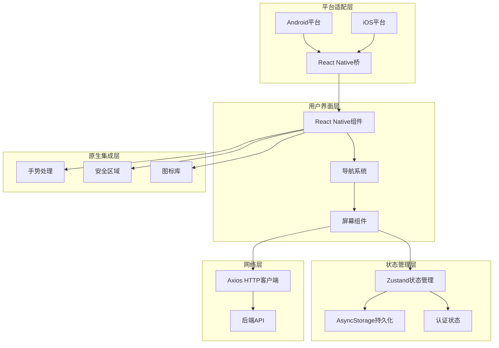
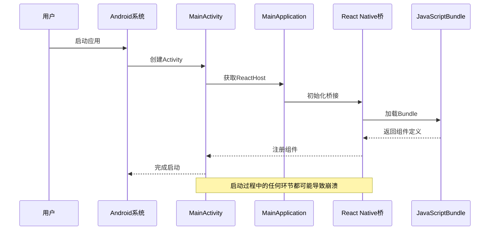
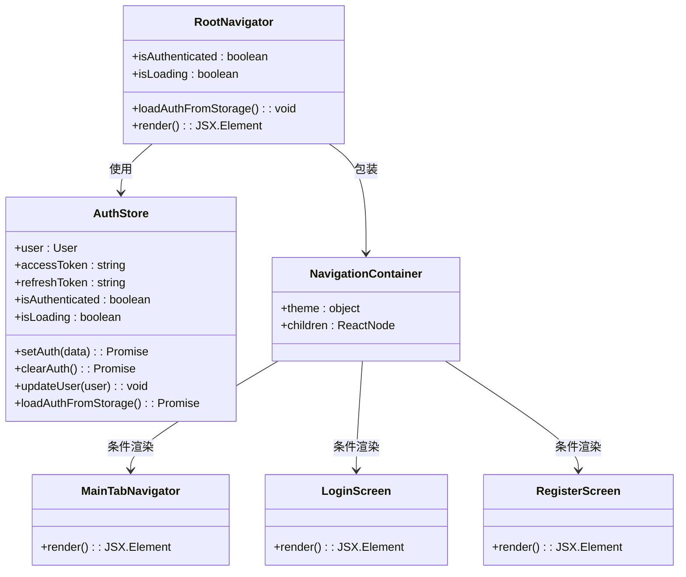
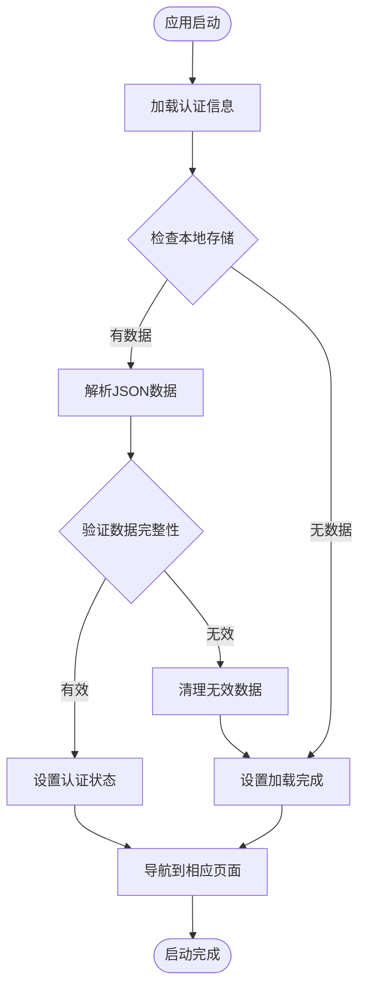
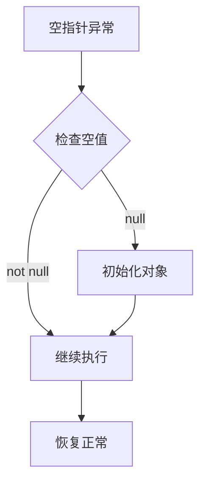
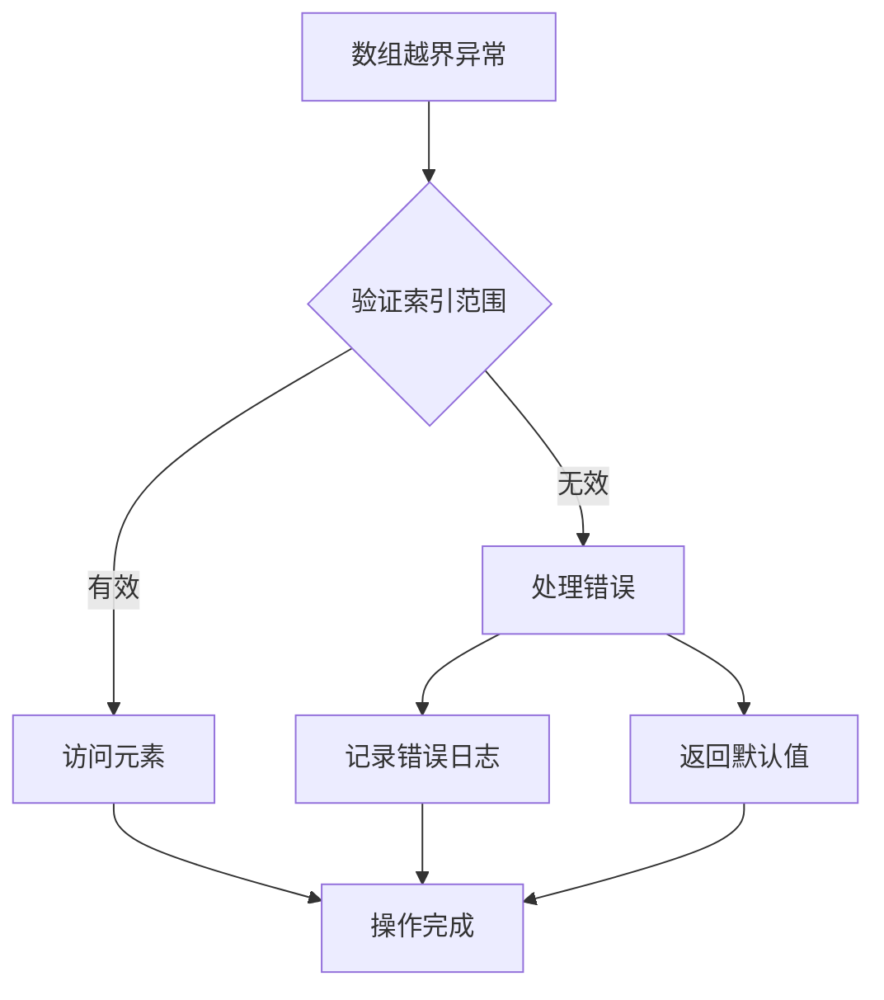
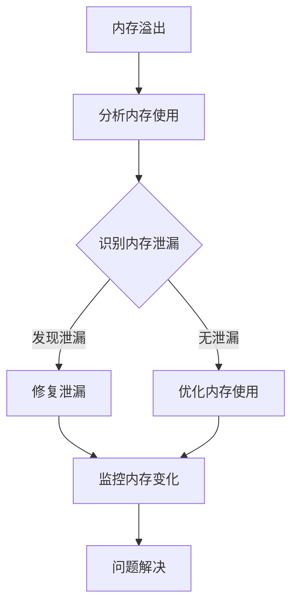

# 移动端应用崩溃排查指南

<cite>
**本文档引用的文件**
- [package.json](file://FreeDressApp/package.json)
- [App.tsx](file://FreeDressApp/App.tsx)
- [index.js](file://FreeDressApp/index.js)
- [MainActivity.kt](file://FreeDressApp/android/app/src/main/java/com/freedressapp/MainActivity.kt)
- [MainApplication.kt](file://FreeDressApp/android/app/src/main/java/com/freedressapp/MainApplication.kt)
- [AppDelegate.swift](file://FreeDressApp/ios/FreeDressApp/AppDelegate.swift)
- [build.gradle](file://FreeDressApp/android/app/build.gradle)
- [Podfile](file://FreeDressApp/ios/Podfile)
- [metro.config.js](file://FreeDressApp/metro.config.js)
- [react-native.config.js](file://FreeDressApp/react-native.config.js)
- [AndroidManifest.xml](file://FreeDressApp/android/app/src/main/AndroidManifest.xml)
- [src/App.tsx](file://FreeDressApp/src/App.tsx)
- [src/navigation/RootNavigator.tsx](file://FreeDressApp/src/navigation/RootNavigator.tsx)
- [src/store/authStore.ts](file://FreeDressApp/src/store/authStore.ts)
- [__tests__/App.test.tsx](file://FreeDressApp/__tests__/App.test.tsx)
</cite>

## 目录
1. [简介](#简介)
2. [项目结构](#项目结构)
3. [核心组件](#核心组件)
4. [架构概览](#架构概览)
5. [详细组件分析](#详细组件分析)
6. [依赖分析](#依赖分析)
7. [性能考虑](#性能考虑)
8. [故障排除指南](#故障排除指南)
9. [结论](#结论)
10. [附录](#附录)

## 简介

畅搭(FreeDress)是一个基于React Native开发的移动端应用，支持Android和iOS平台。本指南专注于移动端应用崩溃排查，涵盖应用启动失败诊断、运行时崩溃调试、常见崩溃类型解决方案以及平台特定问题排查。

## 项目结构

畅搭项目采用标准的React Native项目结构，包含以下关键目录：



**图表来源**
- [package.json:1-57](file://FreeDressApp/package.json#L1-L57)
- [MainActivity.kt:1-23](file://FreeDressApp/android/app/src/main/java/com/freedressapp/MainActivity.kt#L1-L23)
- [AppDelegate.swift:1-49](file://FreeDressApp/ios/FreeDressApp/AppDelegate.swift#L1-L49)

**章节来源**
- [package.json:1-57](file://FreeDressApp/package.json#L1-L57)
- [AndroidManifest.xml:1-28](file://FreeDressApp/android/app/src/main/AndroidManifest.xml#L1-L28)

## 核心组件

### 应用入口点

应用的启动流程通过以下关键组件协调：

1. **JavaScript入口点** (`index.js`)
   - 注册React Native组件
   - 初始化应用注册表

2. **Android主活动** (`MainActivity.kt`)
   - 继承ReactActivity
   - 配置ReactActivityDelegate
   - 启用Fabric架构支持

3. **iOS应用委托** (`AppDelegate.swift`)
   - 实现UIApplicationDelegate协议
   - 管理React Native桥接
   - 处理Bundle加载

4. **根组件** (`src/App.tsx`)
   - 提供全局Provider包装
   - 配置手势处理器
   - 集成导航系统

**章节来源**
- [index.js:1-11](file://FreeDressApp/index.js#L1-L11)
- [MainActivity.kt:1-23](file://FreeDressApp/android/app/src/main/java/com/freedressapp/MainActivity.kt#L1-L23)
- [AppDelegate.swift:1-49](file://FreeDressApp/ios/FreeDressApp/AppDelegate.swift#L1-L49)
- [src/App.tsx:1-28](file://FreeDressApp/src/App.tsx#L1-L28)

## 架构概览

畅搭应用采用React Native混合架构，结合原生模块实现：



**图表来源**
- [src/App.tsx:1-28](file://FreeDressApp/src/App.tsx#L1-L28)
- [src/store/authStore.ts:1-123](file://FreeDressApp/src/store/authStore.ts#L1-L123)
- [package.json:12-31](file://FreeDressApp/package.json#L12-L31)

## 详细组件分析

### 应用启动流程

应用启动涉及多个关键步骤，每个环节都可能成为崩溃的源头：



**图表来源**
- [MainActivity.kt:10-21](file://FreeDressApp/android/app/src/main/java/com/freedressapp/MainActivity.kt#L10-L21)
- [MainApplication.kt:12-26](file://FreeDressApp/android/app/src/main/java/com/freedressapp/MainApplication.kt#L12-L26)
- [index.js:6-10](file://FreeDressApp/index.js#L6-L10)

### 导航系统架构

应用采用React Navigation实现复杂的导航逻辑：



**图表来源**
- [src/navigation/RootNavigator.tsx:41-84](file://FreeDressApp/src/navigation/RootNavigator.tsx#L41-L84)
- [src/store/authStore.ts:28-122](file://FreeDressApp/src/store/authStore.ts#L28-L122)

**章节来源**
- [src/navigation/RootNavigator.tsx:1-95](file://FreeDressApp/src/navigation/RootNavigator.tsx#L1-L95)
- [src/store/authStore.ts:1-123](file://FreeDressApp/src/store/authStore.ts#L1-L123)

### 状态管理系统

应用使用Zustand实现高效的状态管理：



**图表来源**
- [src/store/authStore.ts:97-121](file://FreeDressApp/src/store/authStore.ts#L97-L121)

**章节来源**
- [src/store/authStore.ts:1-123](file://FreeDressApp/src/store/authStore.ts#L1-L123)

## 依赖分析

### 核心依赖关系

应用的关键依赖及其作用：

```mermaid
graph LR
subgraph "React Native核心"
RN[react-native]
RNConfig[react-native-config]
RNCLI[react-native-cli]
end
subgraph "导航系统"
RNNav[@react-navigation/native]
NativeStack[@react-navigation/native-stack]
BottomTabs[@react-navigation/bottom-tabs]
end
subgraph "状态管理"
Zustand[zustand]
AsyncStorage[@react-native-async-storage/async-storage]
end
subgraph "UI组件"
GestureHandler[react-native-gesture-handler]
Reanimated[react-native-reanimated]
SafeArea[react-native-safe-area-context]
VectorIcons[react-native-vector-icons]
FlashList[@shopify/flash-list]
end
subgraph "网络请求"
Axios[axios]
end
subgraph "开发工具"
Jest[jest]
ESLint[eslint]
Prettier[prettier]
end
RN --> RNNav
RN --> GestureHandler
RN --> SafeArea
RN --> VectorIcons
RNNav --> NativeStack
RNNav --> BottomTabs
RN --> Zustand
Zustand --> AsyncStorage
RN --> Axios
RN --> FlashList
RN --> Jest
RN --> ESLint
RN --> Prettier
```

**图表来源**
- [package.json:12-31](file://FreeDressApp/package.json#L12-L31)

**章节来源**
- [package.json:1-57](file://FreeDressApp/package.json#L1-L57)

### 平台特定依赖

#### Android平台依赖

- **React Native Gradle插件**: 自动链接原生库
- **Hermes引擎**: JavaScript引擎选择
- **Vector Icons字体**: 图标资源管理
- **JSC引擎**: JavaScriptCore替代方案

#### iOS平台依赖

- **CocoaPods**: 依赖包管理
- **React Native框架**: 原生模块支持
- **SwiftUI兼容性**: 现代iOS开发支持

**章节来源**
- [build.gradle:109-123](file://FreeDressApp/android/app/build.gradle#L109-L123)
- [Podfile:17-34](file://FreeDressApp/ios/Podfile#L17-L34)

## 性能考虑

### 内存管理策略

应用采用多层内存管理策略：

1. **状态管理优化**
   - 使用Zustand减少不必要的重渲染
   - 实现状态分片避免全局状态膨胀
   - 异步加载认证数据防止阻塞主线程

2. **UI性能优化**
   - 使用FlashList实现高性能列表渲染
   - 配置Reanimated进行硬件加速动画
   - 合理使用SafeAreaView避免布局抖动

3. **网络请求优化**
   - 实现请求缓存机制
   - 使用Axios拦截器统一处理响应
   - 避免重复网络请求

### 性能监控指标

建议监控以下关键指标：
- 应用启动时间
- 内存使用峰值
- FPS帧率稳定性
- 网络请求延迟
- 电池消耗情况

## 故障排除指南

### 应用启动失败诊断

#### Bundle加载错误

**症状表现**:
- 应用启动立即崩溃
- 控制台显示Bundle加载失败
- 黑屏或白屏无响应

**诊断步骤**:
1. 检查Metro服务器状态
2. 验证Bundle路径配置
3. 确认网络连接正常
4. 查看设备日志输出

**解决方案**:
- 重启Metro服务器
- 清理缓存并重新构建
- 检查防火墙设置
- 验证Bundle文件完整性

#### 依赖库冲突

**症状表现**:
- 编译时出现版本冲突警告
- 运行时类加载异常
- 功能模块不可用

**诊断步骤**:
1. 检查package.json版本兼容性
2. 分析依赖树冲突
3. 验证原生模块链接状态
4. 确认平台特定依赖

**解决方案**:
- 统一依赖版本
- 手动链接冲突模块
- 清理并重新安装依赖
- 检查平台特定配置

#### 初始化异常

**症状表现**:
- 应用启动过程中崩溃
- 特定功能模块初始化失败
- 空指针异常

**诊断步骤**:
1. 检查应用生命周期回调
2. 验证全局状态初始化
3. 确认第三方服务可用性
4. 分析异常堆栈信息

**解决方案**:
- 实现优雅降级机制
- 添加初始化超时处理
- 配置错误边界组件
- 优化异步初始化流程

### 运行时崩溃调试

#### 堆栈跟踪分析

**Android平台**:
1. 使用Logcat查看详细日志
2. 检查ANR监控器
3. 分析崩溃报告
4. 使用Android Studio调试

**iOS平台**:
1. 使用Xcode控制台日志
2. 检查崩溃符号化
3. 分析内存转储
4. 使用Instruments性能分析

#### 内存泄漏检测

**常见泄漏场景**:
- 未清理的定时器和监听器
- 循环引用导致的对象无法释放
- 大对象未及时释放
- 全局变量持有上下文引用

**检测方法**:
1. 使用内存分析工具
2. 监控内存使用趋势
3. 检查对象生命周期
4. 实施泄漏预防措施

#### 性能监控

**监控指标**:
- 应用启动时间
- 响应延迟
- 内存使用峰值
- CPU使用率
- 网络请求成功率

**优化策略**:
- 实现懒加载机制
- 优化图片和资源加载
- 减少不必要的重渲染
- 实施缓存策略

### 常见崩溃类型解决方案

#### NullPointerException

**Android平台**:


**iOS平台**:
- 使用可选绑定检查
- 实现默认值处理
- 使用guard语句保护

**解决方案**:
1. 在访问对象前检查空值
2. 实现适当的默认值处理
3. 使用现代语言特性进行安全访问
4. 添加异常处理机制

#### ArrayIndexOutOfBoundsException

**Android/iOS平台**:


**解决方案**:
1. 在访问数组元素前验证索引
2. 实现边界检查机制
3. 使用安全的数组访问方法
4. 添加异常处理和日志记录

#### OutOfMemoryError

**Android平台**:


**iOS平台**:
- 实现内存压力处理
- 优化大对象管理
- 使用ARC自动内存管理

**解决方案**:
1. 实现内存使用监控
2. 优化大对象处理
3. 实施垃圾回收策略
4. 添加内存压力处理机制

### 平台特定问题排查

#### Android ART/Dalvik虚拟机问题

**常见问题**:
- Dex文件过大导致加载缓慢
- 多Dex配置问题
- 运行时编译性能问题
- 内存分配限制

**排查步骤**:
1. 检查Dex文件大小
2. 验证Multidex配置
3. 分析运行时编译日志
4. 监控内存使用情况

**优化方案**:
- 实施代码分割
- 优化资源文件
- 调整Dalvik配置
- 实现渐进式加载

#### iOS内存管理问题

**常见问题**:
- ARC内存管理异常
- 循环引用导致的泄漏
- 大对象内存占用
- 内存警告处理不当

**排查步骤**:
1. 使用Instruments分析内存
2. 检查循环引用
3. 监控内存警告
4. 分析内存增长趋势

**优化方案**:
1. 实现弱引用避免循环
2. 优化大对象处理
3. 实施内存清理策略
4. 添加内存压力处理

#### React Native桥接异常

**常见问题**:
- 原生模块注册失败
- JavaScript与原生通信异常
- 类型转换错误
- 线程切换问题

**排查步骤**:
1. 检查原生模块链接
2. 验证桥接配置
3. 分析类型映射
4. 监控线程状态

**解决方案**:
1. 重新链接原生模块
2. 验证桥接接口
3. 实现类型安全检查
4. 使用正确的线程上下文

### 调试工具使用

#### Flipper调试

**安装配置**:
1. 安装Flipper桌面应用
2. 在应用中集成Flipper SDK
3. 配置网络连接
4. 启动调试会话

**功能特性**:
- 设备状态监控
- 网络请求调试
- 数据库查看
- 日志过滤

#### Chrome DevTools

**配置步骤**:
1. 启用开发者菜单
2. 连接到调试服务器
3. 打开DevTools
4. 开始调试会话

**调试功能**:
- JavaScript断点调试
- DOM元素检查
- 网络请求分析
- 性能分析

#### Xcode调试器

**使用方法**:
1. 打开Xcode项目
2. 连接物理设备
3. 配置调试目标
4. 开始调试会话

**调试功能**:
- 断点设置和管理
- 内存使用分析
- 线程状态检查
- 符号化崩溃报告

**章节来源**
- [metro.config.js:1-12](file://FreeDressApp/metro.config.js#L1-L12)
- [react-native.config.js:1-3](file://FreeDressApp/react-native.config.js#L1-L3)

## 结论

畅搭应用的崩溃排查需要从多个维度综合考虑，包括应用启动流程、运行时环境、平台特定问题和调试工具使用。通过建立完善的监控体系、实施预防性措施和掌握有效的调试技巧，可以显著降低应用崩溃率并提升用户体验。

关键要点总结：
- 建立完整的崩溃监控和日志收集系统
- 实施预防性的内存管理和状态管理策略
- 掌握平台特定的调试工具和技术
- 建立标准化的故障排除流程
- 持续优化应用性能和稳定性

## 附录

### 快速故障排除清单

**启动阶段**:
- [ ] 检查Metro服务器状态
- [ ] 验证Bundle文件完整性
- [ ] 确认网络连接正常
- [ ] 检查权限配置

**运行阶段**:
- [ ] 监控内存使用情况
- [ ] 分析CPU使用率
- [ ] 检查网络请求状态
- [ ] 验证第三方服务可用性

**调试准备**:
- [ ] 配置调试工具
- [ ] 准备日志收集
- [ ] 建立重现步骤
- [ ] 准备回滚方案

### 常用命令参考

**开发环境**:
- `npm run android` - 构建Android应用
- `npm run ios` - 构建iOS应用
- `npm run start` - 启动Metro服务器
- `npm run test` - 运行测试套件

**调试工具**:
- `flipper` - 启动Flipper调试器
- `adb logcat` - 查看Android日志
- `xcrun simctl` - iOS模拟器管理
- `jest` - 运行单元测试