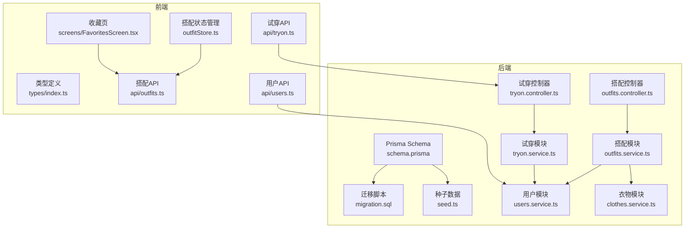
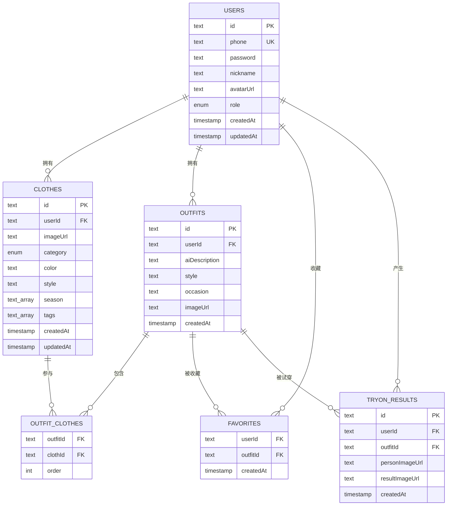
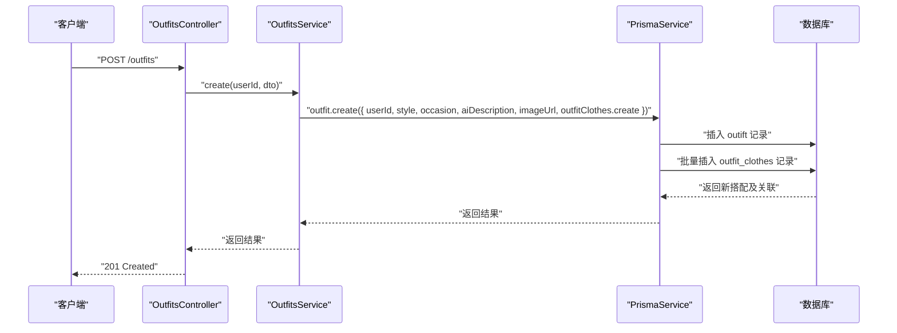
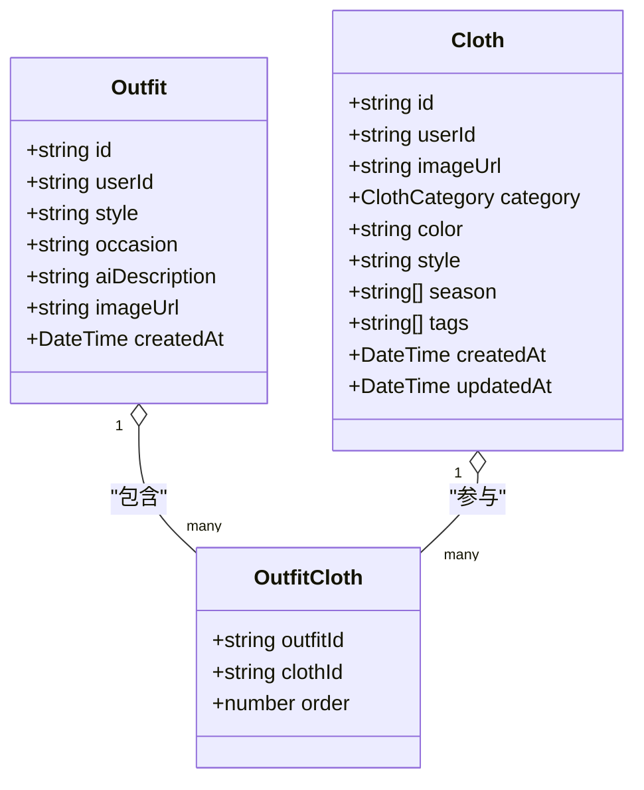
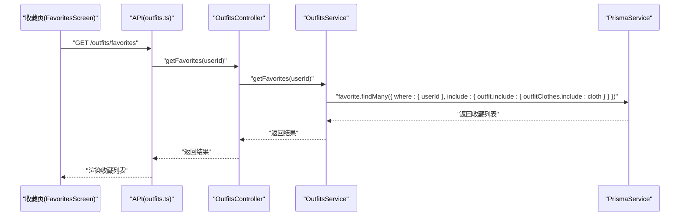
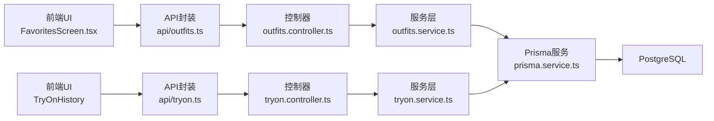

# 实体关系映射

<cite>
**本文引用的文件**
- [schema.prisma](file://backend/prisma/schema.prisma)
- [migration.sql](file://backend/prisma/migrations/20260507090458_init/migration.sql)
- [seed.ts](file://backend/prisma/seed.ts)
- [users.service.ts](file://backend/src/modules/users/users.service.ts)
- [clothes.service.ts](file://backend/src/modules/clothes/clothes.service.ts)
- [outfits.service.ts](file://backend/src/modules/outfits/outfits.service.ts)
- [tryon.service.ts](file://backend/src/modules/tryon/tryon.service.ts)
- [outfits.controller.ts](file://backend/src/modules/outfits/outfits.controller.ts)
- [tryon.controller.ts](file://backend/src/modules/tryon/tryon.controller.ts)
- [index.ts](file://FreeDressApp/src/types/index.ts)
- [outfitStore.ts](file://FreeDressApp/src/store/outfitStore.ts)
- [outfits.ts](file://FreeDressApp/src/api/outfits.ts)
- [tryon.ts](file://FreeDressApp/src/api/tryon.ts)
- [users.ts](file://FreeDressApp/src/api/users.ts)
- [FavoritesScreen.tsx](file://FreeDressApp/src/screens/FavoritesScreen.tsx)
</cite>

## 目录
1. [简介](#简介)
2. [项目结构](#项目结构)
3. [核心组件](#核心组件)
4. [架构总览](#架构总览)
5. [详细组件分析](#详细组件分析)
6. [依赖分析](#依赖分析)
7. [性能考虑](#性能考虑)
8. [故障排查指南](#故障排查指南)
9. [结论](#结论)
10. [附录](#附录)

## 简介
本文件系统性梳理畅搭(FreeDress)应用的实体关系映射，聚焦用户(User)、衣物(Cloth)、搭配(Outfit)、收藏(Favorite)、试穿结果(TryOnResult)等核心实体之间的关系设计与实现。内容涵盖：
- 一对一、一对多、多对多关系的建模与外键约束
- 级联删除策略与关系表设计
- OutfitCloth多对多关联表的作用与设计原理
- 关系查询的实现方式：嵌套查询、关系预加载、反向查询
- 关系完整性约束与数据一致性保障机制
- ER图与关系图，帮助开发者快速理解实体间的依赖关系

## 项目结构
后端采用NestJS + Prisma架构，数据库为PostgreSQL；前端为React Native应用，通过API与后端交互。Prisma负责数据模型定义、迁移与种子数据初始化。

**图表来源**
- [schema.prisma](file://backend/prisma/schema.prisma)
- [migration.sql](file://backend/prisma/migrations/20260507090458_init/migration.sql)
- [seed.ts](file://backend/prisma/seed.ts)
- [users.service.ts](file://backend/src/modules/users/users.service.ts)
- [clothes.service.ts](file://backend/src/modules/clothes/clothes.service.ts)
- [outfits.service.ts](file://backend/src/modules/outfits/outfits.service.ts)
- [tryon.service.ts](file://backend/src/modules/tryon/tryon.service.ts)
- [outfits.controller.ts](file://backend/src/modules/outfits/outfits.controller.ts)
- [tryon.controller.ts](file://backend/src/modules/tryon/tryon.controller.ts)
- [index.ts](file://FreeDressApp/src/types/index.ts)
- [outfitStore.ts](file://FreeDressApp/src/store/outfitStore.ts)
- [outfits.ts](file://FreeDressApp/src/api/outfits.ts)
- [tryon.ts](file://FreeDressApp/src/api/tryon.ts)
- [users.ts](file://FreeDressApp/src/api/users.ts)
- [FavoritesScreen.tsx](file://FreeDressApp/src/screens/FavoritesScreen.tsx)

**章节来源**
- [schema.prisma](file://backend/prisma/schema.prisma)
- [migration.sql](file://backend/prisma/migrations/20260507090458_init/migration.sql)
- [seed.ts](file://backend/prisma/seed.ts)

## 核心组件
- 用户(User)：系统主体，拥有衣物、搭配、收藏、试穿记录。
- 衣物(Cloth)：属于某个用户，参与多个搭配。
- 搭配(Outfit)：由多个衣物组成，支持收藏与试穿。
- 收藏(Favorite)：用户与搭配之间的多对多关系，用于“收藏”。
- 试穿结果(TryOnResult)：用户对某搭配进行AI试穿后产生的结果。
- OutfitCloth：搭配与衣物的多对多关联表，包含顺序字段(order)，确保搭配内衣物的展示顺序。

这些组件在Prisma Schema中通过关系字段与外键约束明确表达，并在迁移脚本中落实到数据库层面。

**章节来源**
- [schema.prisma](file://backend/prisma/schema.prisma)
- [migration.sql](file://backend/prisma/migrations/20260507090458_init/migration.sql)

## 架构总览
下图展示实体关系的ER视图，标注主键、外键、索引与级联删除策略。

**图表来源**
- [schema.prisma](file://backend/prisma/schema.prisma)
- [migration.sql](file://backend/prisma/migrations/20260507090458_init/migration.sql)

## 详细组件分析

### 用户(User)与衣物(Cloth)：一对多
- 关系：一个用户可以拥有多个衣物。
- 外键：Cloth.userId 引用 User.id。
- 级联删除：Cloth.userId 的外键设置为级联删除，当用户被删除时，其所有衣物也会被删除。
- 查询方式：
  - 嵌套查询：按用户ID查询衣物列表，支持按分类过滤。
  - 关系预加载：在查询衣物时可包含其所属搭配关系（用于展示）。
- 完整性约束：Cloth.userId 非空，且与User.id一致。

**图表来源**
- [outfits.controller.ts](file://backend/src/modules/outfits/outfits.controller.ts)
- [outfits.service.ts](file://backend/src/modules/outfits/outfits.service.ts)

**章节来源**
- [schema.prisma](file://backend/prisma/schema.prisma)
- [migration.sql](file://backend/prisma/migrations/20260507090458_init/migration.sql)
- [clothes.service.ts](file://backend/src/modules/clothes/clothes.service.ts)

### 用户(User)与搭配(Outfit)：一对多
- 关系：一个用户可以创建多个搭配。
- 外键：Outfit.userId 引用 User.id。
- 级联删除：Outfit.userId 的外键设置为级联删除。
- 查询方式：
  - 列表查询：按用户ID查询搭配列表，并预加载每条搭配的衣物明细与收藏数。
  - 详情查询：按ID查询搭配详情，同时判断当前用户是否已收藏该搭配。
- 完整性约束：Outfit.userId 非空，且与User.id一致。

**章节来源**
- [schema.prisma](file://backend/prisma/schema.prisma)
- [migration.sql](file://backend/prisma/migrations/20260507090458_init/migration.sql)
- [outfits.service.ts](file://backend/src/modules/outfits/outfits.service.ts)

### 搭配(Outfit)与衣物(Cloth)：多对多（通过OutfitCloth）
- 关系：一个搭配包含多件衣物；一件衣物可出现在多个搭配中。
- 关联表：OutfitCloth，复合主键(outfitId, clothId)，并包含顺序字段order。
- 设计原理：
  - 顺序控制：通过order字段保证搭配内衣物的展示顺序。
  - 关系解耦：避免在Outfit中直接存储衣物集合导致的重复与冗余。
- 查询方式：
  - 预加载：创建/查询搭配时，预加载outfitClothes并包含cloth详情，按order升序排列。
  - 反向查询：查询某件衣物被哪些搭配使用，便于“衣物使用统计”。

**图表来源**
- [schema.prisma](file://backend/prisma/schema.prisma)

**章节来源**
- [schema.prisma](file://backend/prisma/schema.prisma)
- [migration.sql](file://backend/prisma/migrations/20260507090458_init/migration.sql)
- [outfits.service.ts](file://backend/src/modules/outfits/outfits.service.ts)
- [clothes.service.ts](file://backend/src/modules/clothes/clothes.service.ts)

### 用户(User)与收藏(Favorite)：多对多
- 关系：一个用户可以收藏多个搭配；一个搭配可被多个用户收藏。
- 关联表：Favorite，复合主键(userId, outfitId)。
- 查询方式：
  - 列表查询：按用户ID查询其收藏的搭配，并预加载搭配详情与衣物明细。
  - 反向查询：判断当前用户是否已收藏某搭配（用于UI状态同步）。
- 完整性约束：Favorite(userId, outfitId)均非空，分别引用User与Outfit。

**图表来源**
- [FavoritesScreen.tsx](file://FreeDressApp/src/screens/FavoritesScreen.tsx)
- [outfits.ts](file://FreeDressApp/src/api/outfits.ts)
- [outfits.controller.ts](file://backend/src/modules/outfits/outfits.controller.ts)
- [outfits.service.ts](file://backend/src/modules/outfits/outfits.service.ts)

**章节来源**
- [schema.prisma](file://backend/prisma/schema.prisma)
- [migration.sql](file://backend/prisma/migrations/20260507090458_init/migration.sql)
- [outfits.service.ts](file://backend/src/modules/outfits/outfits.service.ts)
- [FavoritesScreen.tsx](file://FreeDressApp/src/screens/FavoritesScreen.tsx)

### 用户(User)与试穿结果(TryOnResult)：一对多
- 关系：一个用户可以产生多条试穿结果。
- 外键：TryOnResult.userId 引用 User.id；TryOnResult.outfitId 引用 Outfit.id。
- 级联删除：两者均为级联删除。
- 查询方式：
  - 列表查询：按用户ID查询试穿记录，并预加载对应的搭配及其衣物明细。
  - 详情查询：按ID查询并校验归属用户。
- 完整性约束：TryOnResult.userId 与 TryOnResult.outfitId 均非空。

**章节来源**
- [schema.prisma](file://backend/prisma/schema.prisma)
- [migration.sql](file://backend/prisma/migrations/20260507090458_init/migration.sql)
- [tryon.service.ts](file://backend/src/modules/tryon/tryon.service.ts)

### 关系查询实现方式
- 嵌套查询：在ClothesService中按userId与可选category进行过滤查询。
- 关系预加载：在OutfitsService与TryonService中通过include加载outfitClothes与cloth详情，并按order排序。
- 反向查询：在OutfitsService中通过favorites字段反查当前用户是否收藏某搭配，用于UI状态标记。

**章节来源**
- [clothes.service.ts](file://backend/src/modules/clothes/clothes.service.ts)
- [outfits.service.ts](file://backend/src/modules/outfits/outfits.service.ts)
- [tryon.service.ts](file://backend/src/modules/tryon/tryon.service.ts)

### 关系完整性约束与数据一致性
- 主键约束：所有实体主键唯一且非空。
- 外键约束：Cloth.userId、Outfit.userId、TryOnResult.userId/outfitId均引用对应实体主键。
- 级联删除：用户删除时，其衣物、搭配、收藏、试穿记录均被级联清理，避免悬挂数据。
- 索引优化：Cloth.userId、Cloth.category、Outfit.userId、TryOnResult.userId/outfitId建立索引，提升查询效率。
- 前端一致性：前端通过状态管理与API交互保持收藏状态与列表的一致性。

**章节来源**
- [migration.sql](file://backend/prisma/migrations/20260507090458_init/migration.sql)
- [outfitStore.ts](file://FreeDressApp/src/store/outfitStore.ts)
- [outfits.ts](file://FreeDressApp/src/api/outfits.ts)

## 依赖分析
- 控制器层：OutfitsController与TryonController统一使用JWT鉴权守卫，从装饰器注入当前用户ID，确保业务层无需重复鉴权。
- 服务层：各Service封装具体业务逻辑，使用PrismaService执行数据库操作，集中处理权限校验与关系查询。
- 前端层：API模块封装HTTP请求，Store管理状态，Screen组件负责UI渲染与交互。

**图表来源**
- [outfits.controller.ts](file://backend/src/modules/outfits/outfits.controller.ts)
- [outfits.service.ts](file://backend/src/modules/outfits/outfits.service.ts)
- [tryon.controller.ts](file://backend/src/modules/tryon/tryon.controller.ts)
- [tryon.service.ts](file://backend/src/modules/tryon/tryon.service.ts)
- [FavoritesScreen.tsx](file://FreeDressApp/src/screens/FavoritesScreen.tsx)
- [outfits.ts](file://FreeDressApp/src/api/outfits.ts)
- [tryon.ts](file://FreeDressApp/src/api/tryon.ts)

**章节来源**
- [outfits.controller.ts](file://backend/src/modules/outfits/outfits.controller.ts)
- [tryon.controller.ts](file://backend/src/modules/tryon/tryon.controller.ts)
- [outfits.service.ts](file://backend/src/modules/outfits/outfits.service.ts)
- [tryon.service.ts](file://backend/src/modules/tryon/tryon.service.ts)
- [FavoritesScreen.tsx](file://FreeDressApp/src/screens/FavoritesScreen.tsx)
- [outfits.ts](file://FreeDressApp/src/api/outfits.ts)
- [tryon.ts](file://FreeDressApp/src/api/tryon.ts)

## 性能考虑
- 索引策略：针对高频过滤字段（如Cloth.userId、Cloth.category、Outfit.userId、TryOnResult.userId/outfitId）建立索引，降低查询成本。
- 预加载优化：在需要展示搭配详情或试穿记录时，通过include一次性加载关联数据，减少N+1查询风险。
- 排序控制：OutfitCloth按order升序返回，避免前端二次排序带来的开销。
- 批量写入：创建搭配时，通过outfitClothes.create批量插入关联记录，减少多次往返。

[本节为通用性能建议，不直接分析特定文件，故无“章节来源”]

## 故障排查指南
- 权限错误：
  - 现象：访问/删除他人资源时报错。
  - 原因：服务层在查询前先校验资源归属用户ID。
  - 处理：确认当前登录用户与资源userId一致，或检查JWT令牌有效性。
- 资源不存在：
  - 现象：查询搭配/试穿记录时抛出“不存在”异常。
  - 原因：Prisma查询未命中或已被删除。
  - 处理：检查ID合法性与级联删除策略，必要时重建数据。
- 收藏状态不同步：
  - 现象：前端收藏按钮状态与实际收藏列表不一致。
  - 原因：前端Store未及时更新或API返回值未正确解析。
  - 处理：确认toggleFavorite调用成功并更新Store状态；检查API响应结构。

**章节来源**
- [outfits.service.ts](file://backend/src/modules/outfits/outfits.service.ts)
- [tryon.service.ts](file://backend/src/modules/tryon/tryon.service.ts)
- [outfitStore.ts](file://FreeDressApp/src/store/outfitStore.ts)

## 结论
本项目通过清晰的实体关系设计与严格的外键约束，实现了用户、衣物、搭配、收藏、试穿结果之间的高内聚低耦合。OutfitCloth作为多对多关联表，既保证了搭配顺序的可控性，又避免了数据冗余。配合Prisma的预加载与索引策略，前后端协同实现了高效、一致的数据访问体验。开发者在扩展新功能时，应遵循现有关系模式与约束，确保数据完整性与查询性能。

[本节为总结性内容，不直接分析特定文件，故无“章节来源”]

## 附录

### 数据模型与字段说明（摘要）
- User：id、phone（唯一）、password、nickname、avatarUrl、role、createdAt、updatedAt
- Cloth：id、userId、imageUrl、category、color、style、season[]、tags[]、createdAt、updatedAt
- Outfit：id、userId、aiDescription、style、occasion、imageUrl、createdAt
- OutfitCloth：outfitId、clothId、order
- Favorite：userId、outfitId、createdAt
- TryOnResult：id、userId、outfitId、personImageUrl、resultImageUrl、createdAt

**章节来源**
- [schema.prisma](file://backend/prisma/schema.prisma)
- [migration.sql](file://backend/prisma/migrations/20260507090458_init/migration.sql)

### 种子数据概览
- 创建两个测试用户（USER/VIP），生成若干衣物、搭配，并建立收藏与试穿记录，便于本地开发与演示。

**章节来源**
- [seed.ts](file://backend/prisma/seed.ts)