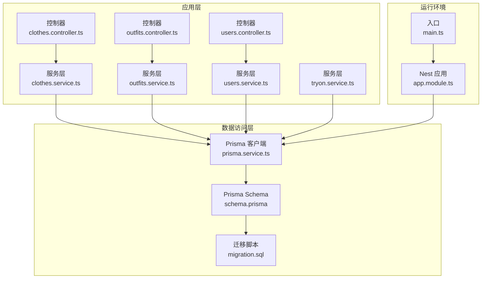
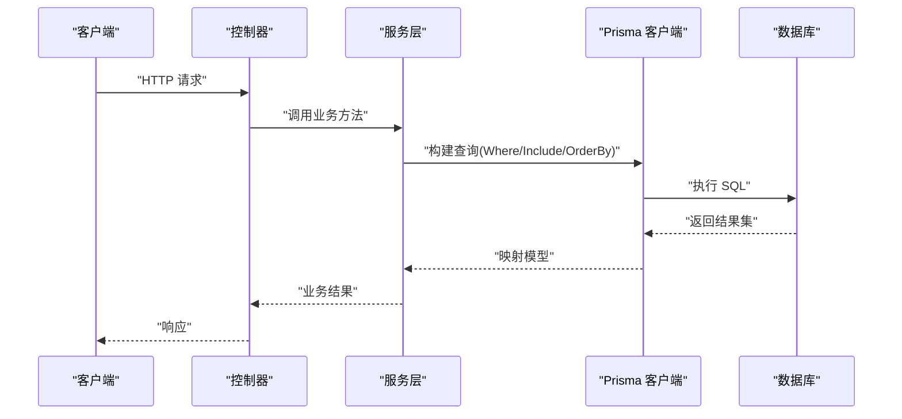
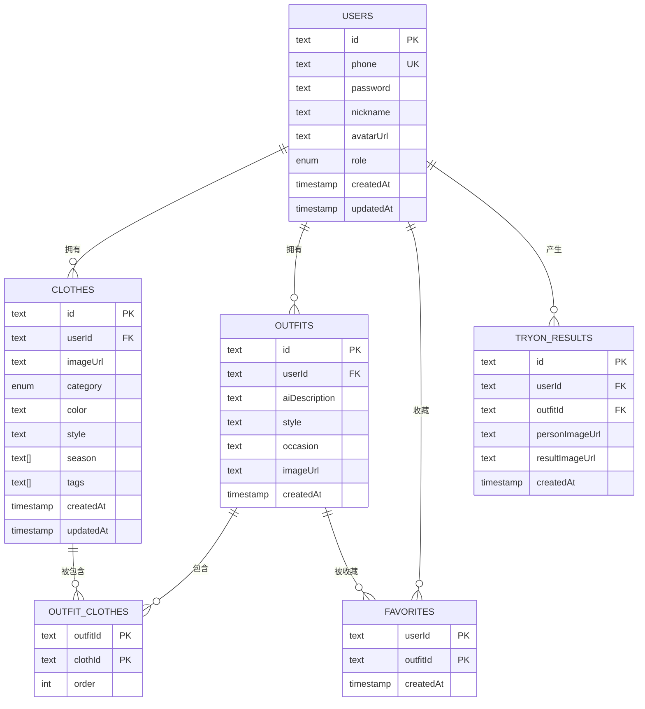
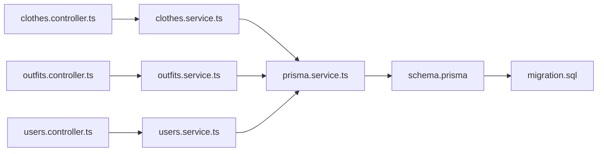

# 数据库性能优化

<cite>
**本文引用的文件**
- [schema.prisma](file://backend/prisma/schema.prisma)
- [migration.sql](file://backend/prisma/migrations/20260507090458_init/migration.sql)
- [prisma.service.ts](file://backend/src/prisma/prisma.service.ts)
- [package.json](file://backend/package.json)
- [clothes.service.ts](file://backend/src/modules/clothes/clothes.service.ts)
- [outfits.service.ts](file://backend/src/modules/outfits/outfits.service.ts)
- [users.service.ts](file://backend/src/modules/users/users.service.ts)
- [tryon.service.ts](file://backend/src/modules/tryon/tryon.service.ts)
- [clothes.controller.ts](file://backend/src/modules/clothes/clothes.controller.ts)
- [outfits.controller.ts](file://backend/src/modules/outfits/outfits.controller.ts)
- [users.controller.ts](file://backend/src/modules/users/users.controller.ts)
- [app.module.ts](file://backend/src/app.module.ts)
- [main.ts](file://backend/src/main.ts)
</cite>

## 目录
1. [简介](#简介)
2. [项目结构](#项目结构)
3. [核心组件](#核心组件)
4. [架构总览](#架构总览)
5. [详细组件分析](#详细组件分析)
6. [依赖关系分析](#依赖关系分析)
7. [性能考量](#性能考量)
8. [故障排查指南](#故障排查指南)
9. [结论](#结论)
10. [附录](#附录)

## 简介
本文件面向畅搭(FreeDress)应用的数据库性能优化，基于现有代码库进行系统性分析与建议。重点覆盖索引设计策略、查询优化技术、连接池与连接管理、慢查询分析与性能监控、数据缓存策略、数据库分区与分表思路，以及最佳实践与常见问题解决方案。由于当前仓库中数据库配置主要通过 Prisma 管理，本文在不改变现有实现的前提下，提出可落地的优化建议与改进方向。

## 项目结构
后端采用 NestJS + Prisma 架构，数据库层由 PrismaService 统一管理连接生命周期；业务模块围绕用户、衣物、搭配、试穿等实体展开，均通过 Prisma 进行数据访问。

图表来源
- [prisma.service.ts:1-27](file://backend/src/prisma/prisma.service.ts#L1-L27)
- [migration.sql:1-121](file://backend/prisma/migrations/20260507090458_init/migration.sql#L1-L121)
- [schema.prisma](file://backend/prisma/schema.prisma)
- [clothes.controller.ts:1-102](file://backend/src/modules/clothes/clothes.controller.ts#L1-L102)
- [outfits.controller.ts:1-65](file://backend/src/modules/outfits/outfits.controller.ts#L1-L65)
- [users.controller.ts:1-49](file://backend/src/modules/users/users.controller.ts#L1-L49)
- [clothes.service.ts:1-148](file://backend/src/modules/clothes/clothes.service.ts#L1-L148)
- [outfits.service.ts:1-123](file://backend/src/modules/outfits/outfits.service.ts#L1-L123)
- [users.service.ts:1-102](file://backend/src/modules/users/users.service.ts#L1-L102)
- [tryon.service.ts:1-88](file://backend/src/modules/tryon/tryon.service.ts#L1-L88)
- [app.module.ts:1-33](file://backend/src/app.module.ts#L1-L33)
- [main.ts:1-62](file://backend/src/main.ts#L1-L62)

章节来源
- [app.module.ts:1-33](file://backend/src/app.module.ts#L1-L33)
- [main.ts:1-62](file://backend/src/main.ts#L1-L62)

## 核心组件
- PrismaService：封装 PrismaClient 的连接与断开生命周期，确保应用启动时连接数据库、关闭时断开连接。
- 业务服务：ClothesService、OutfitsService、UsersService、TryonService 将业务逻辑与数据访问解耦，统一通过 Prisma 执行 CRUD 与聚合查询。
- 控制器：负责路由、鉴权、参数校验与响应包装，调用对应服务完成业务处理。

章节来源
- [prisma.service.ts:1-27](file://backend/src/prisma/prisma.service.ts#L1-L27)
- [clothes.service.ts:1-148](file://backend/src/modules/clothes/clothes.service.ts#L1-L148)
- [outfits.service.ts:1-123](file://backend/src/modules/outfits/outfits.service.ts#L1-L123)
- [users.service.ts:1-102](file://backend/src/modules/users/users.service.ts#L1-L102)
- [tryon.service.ts:1-88](file://backend/src/modules/tryon/tryon.service.ts#L1-L88)
- [clothes.controller.ts:1-102](file://backend/src/modules/clothes/clothes.controller.ts#L1-L102)
- [outfits.controller.ts:1-65](file://backend/src/modules/outfits/outfits.controller.ts#L1-L65)
- [users.controller.ts:1-49](file://backend/src/modules/users/users.controller.ts#L1-L49)

## 架构总览
下图展示从控制器到服务再到 Prisma 的调用链路，并标注关键查询模式（WHERE、JOIN、GROUP BY）与潜在性能点。

图表来源
- [clothes.controller.ts:1-102](file://backend/src/modules/clothes/clothes.controller.ts#L1-L102)
- [outfits.controller.ts:1-65](file://backend/src/modules/outfits/outfits.controller.ts#L1-L65)
- [users.controller.ts:1-49](file://backend/src/modules/users/users.controller.ts#L1-L49)
- [clothes.service.ts:1-148](file://backend/src/modules/clothes/clothes.service.ts#L1-L148)
- [outfits.service.ts:1-123](file://backend/src/modules/outfits/outfits.service.ts#L1-L123)
- [users.service.ts:1-102](file://backend/src/modules/users/users.service.ts#L1-L102)
- [tryon.service.ts:1-88](file://backend/src/modules/tryon/tryon.service.ts#L1-L88)
- [prisma.service.ts:1-27](file://backend/src/prisma/prisma.service.ts#L1-L27)

## 详细组件分析

### 数据模型与索引现状
- 用户表(users)：主键 id；唯一索引 phone；角色枚举字段 role。
- 衣物表(clothes)：主键 id；外键 userId 指向 users；索引 userId、category。
- 搭配表(outfits)：主键 id；外键 userId 指向 users。
- 搭配-衣物关联表(outfit_clothes)：复合主键(outfitId, clothId)；外键约束。
- 收藏表(favorites)：复合主键(userId, outfitId)；外键约束。
- 试穿结果表(tryon_results)：主键 id；外键 userId、outfitId 指向 users、outfits；索引 userId、outfitId。

图表来源
- [migration.sql:1-121](file://backend/prisma/migrations/20260507090458_init/migration.sql#L1-L121)

章节来源
- [migration.sql:1-121](file://backend/prisma/migrations/20260507090458_init/migration.sql#L1-L121)

### 查询路径与性能要点
- 衣物列表查询：支持按 userId 与可选 category 过滤，排序按 createdAt 倒序。当前对 clothes.category 建有索引，但未见针对 clothes.userId+category 的复合索引，可能影响多条件过滤性能。
- 搭配详情查询：包含 outfitClothes 关联与 cloth 明细，同时统计收藏数。涉及多表 JOIN 与 include，需关注 include 层级与排序。
- 用户统计查询：使用 _count 聚合统计各类资源数量，适合在用户维度做汇总。
- 试穿历史查询：按 userId 过滤并包含 outfit 及其 cloth 列表，排序 createdAt 倒序。

章节来源
- [clothes.service.ts:38-51](file://backend/src/modules/clothes/clothes.service.ts#L38-L51)
- [clothes.service.ts:123-146](file://backend/src/modules/clothes/clothes.service.ts#L123-L146)
- [outfits.service.ts:35-47](file://backend/src/modules/outfits/outfits.service.ts#L35-L47)
- [outfits.service.ts:49-73](file://backend/src/modules/outfits/outfits.service.ts#L49-L73)
- [users.service.ts:75-100](file://backend/src/modules/users/users.service.ts#L75-L100)
- [tryon.service.ts:35-50](file://backend/src/modules/tryon/tryon.service.ts#L35-L50)

### 索引设计策略
- 主键索引：所有表主键默认建立，无需额外处理。
- 唯一索引：users.phone 已建立唯一索引，保障登录与去重。
- 复合索引建议：
  - clothes(userId, category)：当前 category 独立索引存在，但多条件过滤场景建议复合索引以避免回表与排序成本。
  - favorites(userId, createdAt)：收藏列表按时间倒序，复合索引可提升排序与过滤效率。
  - tryon_results(userId, createdAt)：试穿历史按用户过滤与时间排序，建议复合索引。
- 覆盖索引：对于高频 SELECT 字段较多的查询，可考虑覆盖索引减少回表（例如 clothes(userId, category, id, createdAt)）。

章节来源
- [migration.sql:80-96](file://backend/prisma/migrations/20260507090458_init/migration.sql#L80-L96)
- [clothes.service.ts:38-51](file://backend/src/modules/clothes/clothes.service.ts#L38-L51)
- [outfits.service.ts:104-121](file://backend/src/modules/outfits/outfits.service.ts#L104-L121)
- [tryon.service.ts:35-50](file://backend/src/modules/tryon/tryon.service.ts#L35-L50)

### 查询优化技术
- WHERE 条件优化：
  - 使用精确相等条件优先于范围或模糊匹配；尽量将选择性高的列放在 WHERE 前部。
  - 对枚举字段(category)与外键(userId)过滤，结合现有索引可获得较好性能。
- JOIN 优化：
  - include 层级应控制在合理范围内；对非必要字段使用 select 抽取，减少传输与解析成本。
  - 对多对多关联(outfit_clothes)建议明确 orderBy 与限定数量，避免全量扫描。
- LIMIT 使用策略：
  - 列表查询应配合分页(LIMIT/OFFSET 或游标分页)，避免一次性返回大量数据。
  - 在 ORDER BY 上建立合适索引，保证排序成本可控。

章节来源
- [clothes.service.ts:38-51](file://backend/src/modules/clothes/clothes.service.ts#L38-L51)
- [outfits.service.ts:35-47](file://backend/src/modules/outfits/outfits.service.ts#L35-L47)
- [outfits.service.ts:49-73](file://backend/src/modules/outfits/outfits.service.ts#L49-L73)
- [tryon.service.ts:35-50](file://backend/src/modules/tryon/tryon.service.ts#L35-L50)

### 数据库连接池配置与连接管理
- 当前实现：PrismaService 在模块初始化时连接，在销毁时断开，生命周期与 Nest 模块绑定。
- 连接池配置：Prisma 默认行为受环境变量与数据库驱动影响，可在 .env 中设置连接池参数（如最大连接数、空闲超时、连接超时等），具体键值参考 Prisma 官方文档。
- 连接复用：建议在生产环境启用连接池复用，避免频繁创建/销毁连接带来的开销。

章节来源
- [prisma.service.ts:14-25](file://backend/src/prisma/prisma.service.ts#L14-L25)
- [package.json:21-24](file://backend/package.json#L21-L24)

### 慢查询分析与性能监控
- 执行计划分析：通过数据库自带 EXPLAIN/EXPLAIN ANALYZE 查看 SQL 执行计划，确认索引使用情况与扫描方式。
- 性能指标监控：建议采集以下指标并可视化：
  - QPS、P95/P99 延迟
  - 慢查询数量与阈值
  - 连接池利用率、等待时间
  - 索引命中率、回表次数
- 实践建议：对高频查询建立基准测试，定期回归对比优化效果。

[本节为通用指导，不直接分析具体文件]

### 数据缓存策略
- 应用层缓存：
  - 对读多写少的数据（如用户基础信息、分类统计）使用内存缓存，设置 TTL 与失效策略。
  - 缓存键建议包含用户维度与查询参数，避免脏读。
- 数据库层缓存：
  - 利用数据库查询缓存（如 MySQL 查询缓存/二级缓存）或外部缓存（Redis/Memcached）承载热点数据。
  - 对聚合查询结果进行缓存，降低 GROUP BY 与 JOIN 成本。

[本节为通用指导，不直接分析具体文件]

### 数据库分区与分表策略
- 水平分片：
  - 按用户 ID 哈希或范围分片，将不同用户数据分布到不同库/表，降低单表数据量。
  - 适用于衣物、搭配、试穿结果等用户强相关的表。
- 垂直分表：
  - 将大字段（如图片 URL、描述文本）拆分到独立表，减少主表宽度，提升 IO 效率。
- 分区策略：
  - 按时间分区（如按月/季度）存储日志型数据（如 tryon_results），便于归档与清理。

[本节为通用指导，不直接分析具体文件]

## 依赖关系分析
- 控制器依赖对应服务；服务依赖 PrismaService；PrismaService 依赖 Prisma 客户端；Prisma 客户端依赖 schema 与迁移脚本。
- 业务模块之间通过外键关系耦合，遵循一对一、一对多、多对多关系。

图表来源
- [clothes.controller.ts:1-102](file://backend/src/modules/clothes/clothes.controller.ts#L1-L102)
- [outfits.controller.ts:1-65](file://backend/src/modules/outfits/outfits.controller.ts#L1-L65)
- [users.controller.ts:1-49](file://backend/src/modules/users/users.controller.ts#L1-L49)
- [clothes.service.ts:1-148](file://backend/src/modules/clothes/clothes.service.ts#L1-L148)
- [outfits.service.ts:1-123](file://backend/src/modules/outfits/outfits.service.ts#L1-L123)
- [users.service.ts:1-102](file://backend/src/modules/users/users.service.ts#L1-L102)
- [prisma.service.ts:1-27](file://backend/src/prisma/prisma.service.ts#L1-L27)
- [schema.prisma](file://backend/prisma/schema.prisma)
- [migration.sql:1-121](file://backend/prisma/migrations/20260507090458_init/migration.sql#L1-L121)

章节来源
- [app.module.ts:1-33](file://backend/src/app.module.ts#L1-L33)
- [main.ts:1-62](file://backend/src/main.ts#L1-L62)

## 性能考量
- 索引与查询：
  - 为高频过滤与排序列建立复合索引，减少回表与排序成本。
  - 控制 include 层级与投影字段，避免不必要的 JOIN 与数据传输。
- 连接池：
  - 在生产环境配置合理的连接池大小与超时参数，避免连接争用与堆积。
- 分页与限流：
  - 列表查询必须分页；对高并发场景增加请求限流与排队策略。
- 缓存：
  - 对热点数据与聚合结果进行缓存，缩短数据库压力。
- 监控：
  - 建立完善的指标体系与告警机制，持续跟踪性能变化。

[本节为通用指导，不直接分析具体文件]

## 故障排查指南
- 连接问题：
  - 检查 PrismaService 生命周期钩子是否正确触发；确认数据库可达与凭据正确。
- 查询缓慢：
  - 使用 EXPLAIN 分析执行计划；核对 WHERE 条件与索引是否匹配；评估是否需要新增复合索引。
- 内存与 GC：
  - 控制 include 与 projection，避免一次性加载过多数据；对大对象进行分页或懒加载。
- 缓存失效：
  - 校验缓存键构造与 TTL 设置；对写操作进行主动失效或版本控制。

章节来源
- [prisma.service.ts:14-25](file://backend/src/prisma/prisma.service.ts#L14-L25)

## 结论
本项目基于 Prisma 的数据访问模式清晰，服务层与控制器职责分离良好。当前索引覆盖了常用过滤字段，但在多条件过滤与时间序列查询上仍有优化空间。建议优先完善复合索引、引入分页与缓存策略，并建立系统化的性能监控与慢查询分析流程，以支撑业务增长与用户体验提升。

[本节为总结性内容，不直接分析具体文件]

## 附录

### 快速检查清单
- 是否为高频过滤列建立了复合索引？
- 查询是否包含不必要的 include 与大字段？
- 列表查询是否使用了分页与合适的排序索引？
- 连接池参数是否根据负载进行了调优？
- 是否对热点数据设置了缓存与失效策略？

[本节为通用指导，不直接分析具体文件]