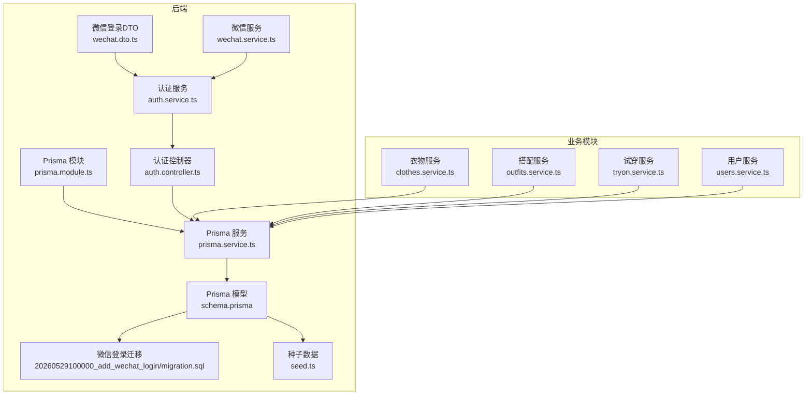
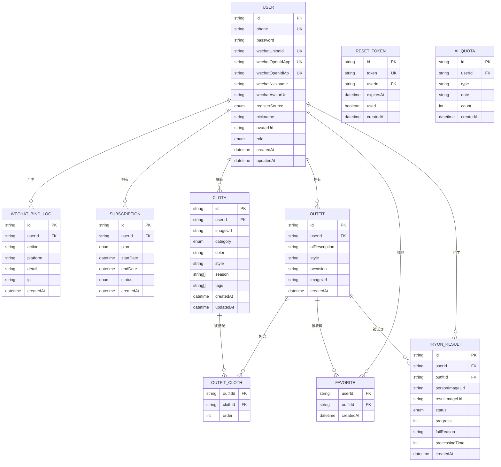
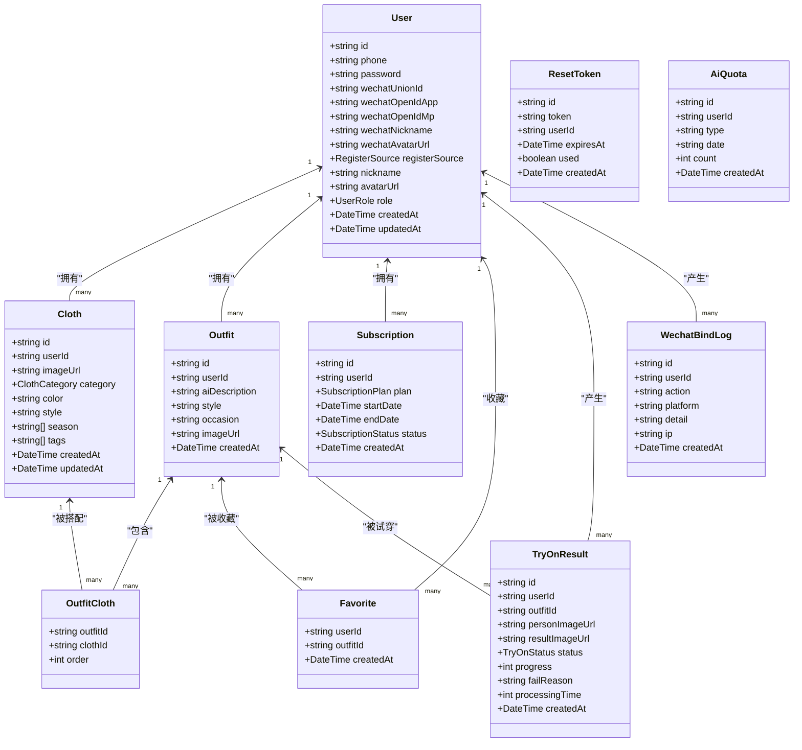
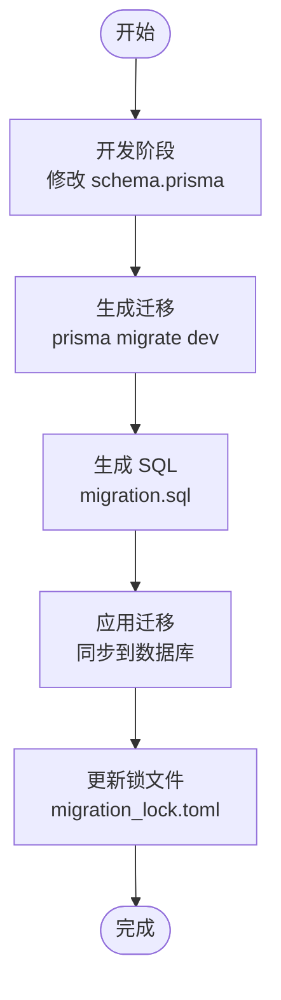
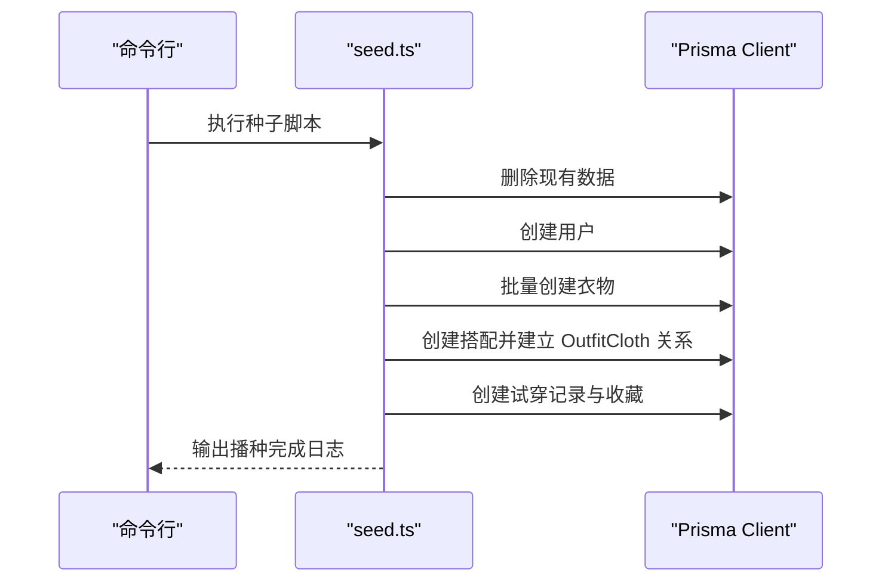
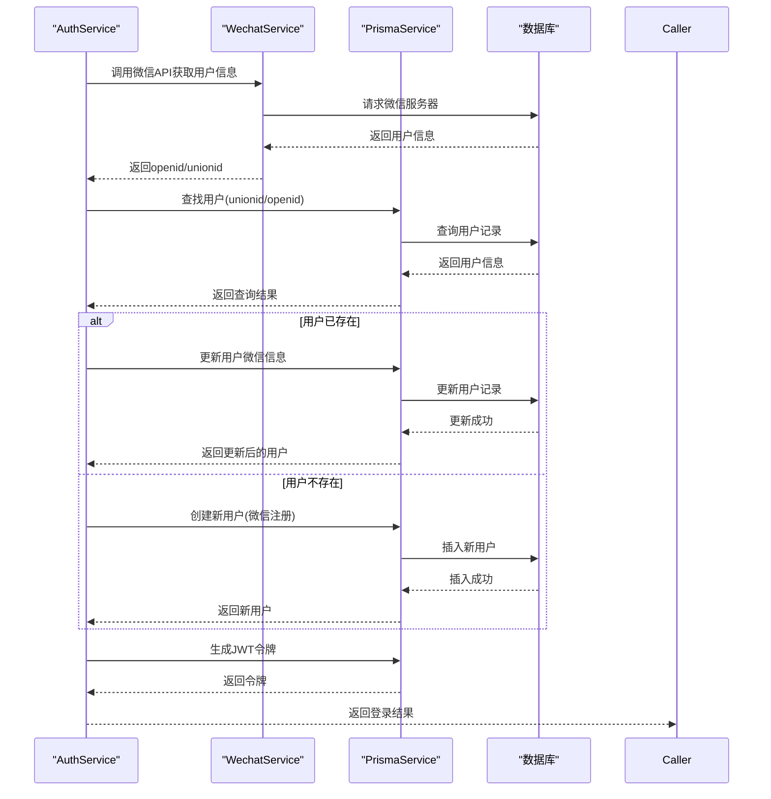
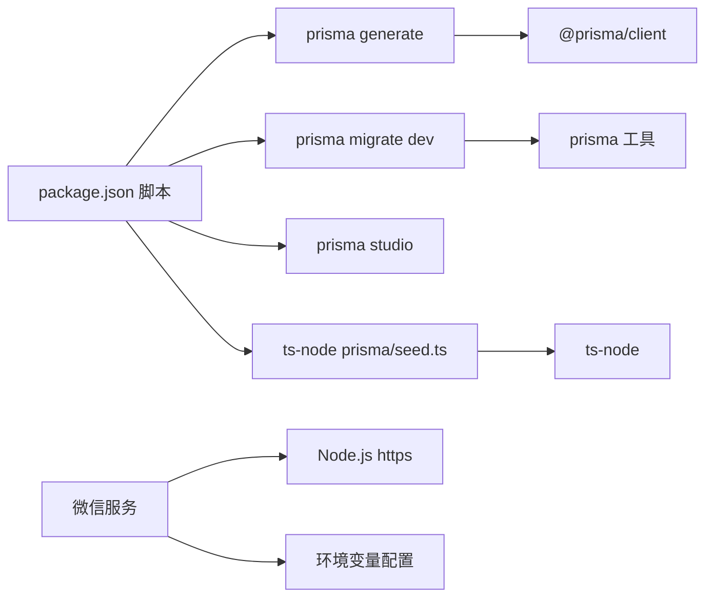

# 数据库设计

<cite>
**本文引用的文件**
- [schema.prisma](file://backend/prisma/schema.prisma)
- [migration.sql](file://backend/prisma/migrations/20260529100000_add_wechat_login/migration.sql)
- [wechat.dto.ts](file://backend/src/modules/auth/dto/wechat.dto.ts)
- [wechat.service.ts](file://backend/src/modules/auth/wechat.service.ts)
- [auth.service.ts](file://backend/src/modules/auth/auth.service.ts)
- [auth.controller.ts](file://backend/src/modules/auth/auth.controller.ts)
- [seed.ts](file://backend/prisma/seed.ts)
- [prisma.service.ts](file://backend/src/prisma/prisma.service.ts)
- [prisma.module.ts](file://backend/src/prisma/prisma.module.ts)
- [package.json](file://backend/package.json)
- [clothes.service.ts](file://backend/src/modules/clothes/clothes.service.ts)
- [outfits.service.ts](file://backend/src/modules/outfits/outfits.service.ts)
- [tryon.service.ts](file://backend/src/modules/tryon/tryon.service.ts)
- [users.service.ts](file://backend/src/modules/users/users.service.ts)
- [create-cloth.dto.ts](file://backend/src/modules/clothes/dto/create-cloth.dto.ts)
- [create-outfit.dto.ts](file://backend/src/modules/outfits/dto/create-outfit.dto.ts)
- [create-tryon.dto.ts](file://backend/src/modules/tryon/dto/create-tryon.dto.ts)
- [migration_lock.toml](file://backend/prisma/migrations/migration_lock.toml)
</cite>

## 更新摘要
**所做更改**
- 新增微信登录相关字段和表结构支持
- 更新用户表字段定义，支持phone和password的nullable属性
- 新增微信绑定/解绑审计日志表
- 更新注册来源枚举，支持微信注册场景
- 完善微信登录服务的实现和API接口

## 目录
1. [简介](#简介)
2. [项目结构](#项目结构)
3. [核心组件](#核心组件)
4. [架构总览](#架构总览)
5. [详细组件分析](#详细组件分析)
6. [依赖分析](#依赖分析)
7. [性能考虑](#性能考虑)
8. [故障排查指南](#故障排查指南)
9. [结论](#结论)
10. [附录](#附录)

## 简介
本文件系统性梳理畅搭(FreeDress)项目的数据库设计与实现，重点围绕 Prisma ORM 的模型定义、关系映射、迁移管理、索引与查询优化、种子数据初始化、安全配置与并发控制、以及监控与维护最佳实践展开。特别关注最新加入的微信登录功能，包括数据库模式变更、字段约束调整和相关表结构设计。

## 项目结构
数据库相关的核心位置集中在 backend/prisma 目录，包含 Prisma 模型定义、迁移脚本、种子数据与客户端生成；同时在 NestJS 后端模块中通过 PrismaService 提供统一的数据库访问能力。新增的微信登录功能通过专门的DTO和服务类实现完整的登录绑定流程。

**图表来源**
- [schema.prisma:1-234](file://backend/prisma/schema.prisma#L1-L234)
- [migration.sql:1-36](file://backend/prisma/migrations/20260529100000_add_wechat_login/migration.sql#L1-L36)
- [wechat.dto.ts:1-78](file://backend/src/modules/auth/dto/wechat.dto.ts#L1-L78)
- [wechat.service.ts:1-166](file://backend/src/modules/auth/wechat.service.ts#L1-L166)
- [auth.service.ts:1-658](file://backend/src/modules/auth/auth.service.ts#L1-L658)
- [auth.controller.ts:1-201](file://backend/src/modules/auth/auth.controller.ts#L1-L201)

**章节来源**
- [schema.prisma:1-234](file://backend/prisma/schema.prisma#L1-L234)
- [package.json:1-91](file://backend/package.json#L1-L91)

## 核心组件
- 数据库与ORM：PostgreSQL + Prisma Client，通过环境变量 DATABASE_URL 连接数据库。
- 数据模型：用户(User)、微信绑定日志(WechatBindLog)、订阅(Subscription)、衣物(Cloth)、搭配(Outfit)、搭配-衣物关联(OutfitCloth)、收藏(Favorite)、试穿记录(TryOnResult)、重置令牌(ResetToken)、AI配额(AiQuota)。
- 关系映射：一对一、一对多、多对多；外键级联删除保证数据一致性。
- 微信登录支持：新增微信UnionId/OpenId字段，支持纯微信注册和多平台绑定。
- 迁移与版本控制：基于 Prisma Migrate 的迁移目录与锁文件，确保团队协作一致。
- 种子数据：初始化用户、衣物、搭配、收藏与试穿记录，便于开发与演示。
- 查询与统计：服务层封装常用查询、权限校验与聚合统计。
- 安全与并发：PrismaService 生命周期管理连接；服务层进行权限校验与错误处理。

**章节来源**
- [schema.prisma:14-234](file://backend/prisma/schema.prisma#L14-L234)
- [prisma.service.ts:1-27](file://backend/src/prisma/prisma.service.ts#L1-L27)
- [prisma.module.ts:1-14](file://backend/src/prisma/prisma.module.ts#L1-L14)
- [seed.ts:1-194](file://backend/prisma/seed.ts#L1-L194)

## 架构总览
下图展示数据库模型之间的关系与典型查询路径，包括新增的微信登录相关表结构：

**图表来源**
- [schema.prisma:14-234](file://backend/prisma/schema.prisma#L14-L234)
- [migration.sql:21-36](file://backend/prisma/migrations/20260529100000_add_wechat_login/migration.sql#L21-L36)

## 详细组件分析

### 数据模型与字段定义
- 用户表(User)
  - 主键：id（UUID，默认生成）
  - 唯一索引：phone、wechatUnionId、wechatOpenIdApp、wechatOpenIdMp
  - 可空字段：phone、password、wechatUnionId、wechatOpenIdApp、wechatOpenIdMp、wechatNickname、wechatAvatarUrl
  - 新增字段：registerSource（注册来源枚举）
  - 关系：一对多到衣物、搭配、收藏、试穿记录、微信绑定日志
- 微信绑定日志表(WechatBindLog)
  - 主键：id（UUID）
  - 外键：userId → User(id)
  - 字段：action（绑定/解绑操作类型）、platform（APP/MP）、detail（JSON详情）、ip地址
  - 索引：userId
- 订阅表(Subscription)
  - 主键：id（UUID）
  - 外键：userId → User(id)
  - 字段：plan（订阅计划）、startDate、endDate、status（ACTIVE/EXPIRED/CANCELLED）
  - 索引：userId、endDate
- 衣物表(Cloth)
  - 主键：id（UUID）
  - 外键：userId → User(id)，级联删除
  - 数组字段：season、tags
  - 索引：userId、category
  - 关系：多对多通过 OutfitCloth 关联搭配
- 搭配表(Outfit)
  - 主键：id（UUID）
  - 外键：userId → User(id)，级联删除
  - 索引：userId
  - 关系：一对多到 OutfitCloth、收藏、试穿记录
- 搭配-衣物关联表(OutfitCloth)
  - 复合主键：(outfitId, clothId)
  - 外键：outfitId → Outfit(id)、clothId → Cloth(id)，级联删除
  - 字段：order（排序）
- 收藏表(Favorite)
  - 复合主键：(userId, outfitId)
  - 外键：用户与搭配均级联删除
- 试穿记录表(TryOnResult)
  - 主键：id（UUID）
  - 外键：userId → User(id)、outfitId → Outfit(id)，级联删除
  - 索引：userId、outfitId
  - 新增字段：status（状态枚举）、progress（进度）、failReason（失败原因）、processingTime（处理耗时）
- 重置令牌表(ResetToken)
  - 主键：id（UUID）
  - 外键：userId → User(id)
  - 字段：token（唯一）、expiresAt、used
  - 索引：token、expiresAt
- AI配额表(AiQuota)
  - 主键：id（UUID）
  - 外键：userId → User(id)
  - 字段：type（tryon/recommend）、date（YYYY-MM-DD）、count
  - 唯一索引：(userId, type, date)
  - 索引：userId

**章节来源**
- [schema.prisma:14-234](file://backend/prisma/schema.prisma#L14-L234)
- [migration.sql:1-36](file://backend/prisma/migrations/20260529100000_add_wechat_login/migration.sql#L1-L36)

### 关系映射与实现
- 一对多：User → Cloth/Outfit/Subscription/Favorite/TryOnResult/WechatBindLog，Outfit → OutfitCloth
- 多对多：Outfit ↔ Cloth 通过 OutfitCloth 实现，并以 order 字段保持顺序
- 级联删除：所有外键均设置级联删除，保证删除主实体时清理关联数据
- 复合主键：OutfitCloth 与 Favorite 使用复合主键避免重复记录
- 新增关系：User → WechatBindLog（用户产生的微信绑定日志）

**图表来源**
- [schema.prisma:14-234](file://backend/prisma/schema.prisma#L14-L234)

**章节来源**
- [schema.prisma:90-114](file://backend/prisma/schema.prisma#L90-L114)

### 微信登录功能实现
- 微信登录支持：用户可通过小程序(App)微信登录，支持纯微信注册和已有账号绑定
- 字段设计：phone和password字段设为可空，兼容纯微信注册用户
- 注册来源：新增RegisterSource枚举，支持PHONE、WECHAT_APP、WECHAT_MP三种注册方式
- 绑定策略：支持用户在登录后自动绑定微信，或手动绑定不同平台的微信账号
- 审计日志：所有微信绑定/解绑操作都会记录详细的审计日志

**章节来源**
- [schema.prisma:17-33](file://backend/prisma/schema.prisma#L17-L33)
- [schema.prisma:54-59](file://backend/prisma/schema.prisma#L54-L59)
- [auth.service.ts:397-468](file://backend/src/modules/auth/auth.service.ts#L397-L468)
- [wechat.service.ts:37-118](file://backend/src/modules/auth/wechat.service.ts#L37-L118)

### 数据库迁移管理策略
- 版本控制：迁移文件位于 backend/prisma/migrations/...，每次变更由 Prisma Migrate 生成 SQL 并写入 migration.sql
- 锁文件：migration_lock.toml 标识迁移提供者，防止多人误操作
- 团队协作：迁移文件纳入版本控制，确保各环境一致
- 回滚机制：Prisma 支持跳转到指定迁移版本，但建议通过新增迁移修复问题而非直接回滚
- 新增迁移：微信登录功能通过独立的迁移文件实现，不影响现有数据结构

**图表来源**
- [package.json:21-24](file://backend/package.json#L21-L24)
- [migration_lock.toml:1-3](file://backend/prisma/migrations/migration_lock.toml#L1-L3)

**章节来源**
- [package.json:21-24](file://backend/package.json#L21-L24)
- [migration_lock.toml:1-3](file://backend/prisma/migrations/migration_lock.toml#L1-L3)

### 索引设计与查询优化
- 已有索引
  - users.phone：唯一索引，保障登录唯一性
  - users.wechatUnionId、users.wechatOpenIdApp、users.wechatOpenIdMp：唯一索引，支持微信登录
  - clothes.userId、clothes.category：加速按用户与分类查询
  - outfits.userId：加速用户搭配列表
  - tryon_results.userId、tryon_results.outfitId：加速试穿记录查询
  - wechat_bind_logs.userId：加速微信绑定日志查询
- 建议优化
  - 在 OutfitCloth.order 上建立索引，若频繁按顺序查询
  - 对 Outfit.aiDescription、Outfit.style、Outfit.occasion 建立文本搜索索引（Gin），支持模糊匹配
  - 对 Cloth.color、Cloth.tags 建立 Gist/Gin 索引，支持数组字段检索
  - 对 ResetToken.token、ResetToken.expiresAt 建立索引，优化密码重置流程
  - 对 AiQuota.userId、AiQuota.date 建立复合索引，优化AI配额查询
  - 使用分页查询与选择性字段返回，减少网络与内存压力

**章节来源**
- [migration.sql:16-36](file://backend/prisma/migrations/20260529100000_add_wechat_login/migration.sql#L16-L36)

### 种子数据生成与初始化流程
- 初始化步骤
  - 清理：先删除 tryon_results、favorites、outfit_clothes、outfits、clothes、users
  - 创建测试用户：两个用户（普通与VIP），密码经 bcrypt 加密
  - 批量创建衣物：为用户创建多种类别的示例衣物
  - 创建搭配：构建两套搭配，使用 OutfitCloth 建立多对多关系并设置顺序
  - 创建试穿记录与收藏：为用户创建试穿记录与收藏
- 执行命令：通过 npm/yarn 脚本执行种子数据生成

**图表来源**
- [seed.ts:6-183](file://backend/prisma/seed.ts#L6-L183)
- [package.json:24-24](file://backend/package.json#L24-L24)

**章节来源**
- [seed.ts:1-194](file://backend/prisma/seed.ts#L1-L194)
- [package.json:24-24](file://backend/package.json#L24-L24)

### 安全配置与并发控制
- 连接管理
  - PrismaService 在模块初始化时连接数据库，在销毁时断开，避免连接泄漏
- 事务处理
  - 服务层通过 PrismaClient 的事务接口（例如在批量写入或需要强一致性的场景）进行事务包裹
- 并发控制
  - 利用数据库外键约束与级联删除保证并发下的数据一致性
  - 服务层在读取/更新前进行权限校验，避免越权访问
- 密码安全
  - 用户密码采用 bcrypt 加密存储
- 微信安全
  - 微信绑定日志记录所有绑定/解绑操作，支持审计追踪
  - 解绑微信要求账号已绑手机号+密码，避免账号锁死

**章节来源**
- [prisma.service.ts:8-26](file://backend/src/prisma/prisma.service.ts#L8-L26)
- [users.service.ts:18-44](file://backend/src/modules/users/users.service.ts#L18-L44)
- [seed.ts:18-26](file://backend/prisma/seed.ts#L18-L26)
- [auth.service.ts:588-614](file://backend/src/modules/auth/auth.service.ts#L588-L614)

### 业务查询与权限校验
- 衣物服务
  - 创建、查询、更新、删除均结合 userId 校验归属
  - 支持按分类筛选与统计分类数量
- 搭配服务
  - 创建搭配时批量写入 OutfitCloth，并按 order 排序
  - 查找搭配时包含衣物明细与收藏状态
  - 收藏/取消收藏通过复合主键去重
- 试穿服务
  - 创建试穿记录前校验搭配归属
  - Mock AI 生成占位图，后续替换为真实服务调用
  - 新增状态管理和进度跟踪
- 用户服务
  - 提供用户资料查询与统计信息（衣物、搭配、收藏、试穿数量）
- 微信登录服务
  - 支持小程序和App两种微信登录方式
  - 实现自动绑定和手动绑定功能
  - 提供绑定状态检查和解绑保护

**图表来源**
- [auth.service.ts:397-468](file://backend/src/modules/auth/auth.service.ts#L397-L468)
- [wechat.service.ts:37-118](file://backend/src/modules/auth/wechat.service.ts#L37-L118)

**章节来源**
- [clothes.service.ts:21-116](file://backend/src/modules/clothes/clothes.service.ts#L21-L116)
- [outfits.service.ts:9-79](file://backend/src/modules/outfits/outfits.service.ts#L9-L79)
- [tryon.service.ts:9-33](file://backend/src/modules/tryon/tryon.service.ts#L9-L33)
- [users.service.ts:18-100](file://backend/src/modules/users/users.service.ts#L18-L100)
- [auth.service.ts:397-468](file://backend/src/modules/auth/auth.service.ts#L397-L468)

## 依赖分析
- Prisma 依赖
  - @prisma/client：运行时客户端
  - prisma：开发期工具（generate、migrate、studio）
- NestJS 集成
  - PrismaModule 全局导出 PrismaService，各业务模块注入使用
  - 微信登录功能通过AuthModule集成
- 脚本命令
  - prisma:generate、prisma:migrate、prisma:studio、prisma:seed
- 微信服务依赖
  - Node.js https模块用于调用微信API
  - 环境变量配置：WECHAT_MP_APPID、WECHAT_MP_SECRET、WECHAT_APP_APPID、WECHAT_APP_SECRET

**图表来源**
- [package.json:21-24](file://backend/package.json#L21-L24)
- [wechat.service.ts:38-94](file://backend/src/modules/auth/wechat.service.ts#L38-L94)

**章节来源**
- [package.json:21-24](file://backend/package.json#L21-L24)

## 性能考虑
- 查询优化
  - 使用索引覆盖常见过滤字段（userId、category、outfitId、wechatUnionId等）
  - 分页查询与投影字段，避免一次性加载过多数据
  - 对数组字段（tags、season）建立合适索引，提升检索效率
  - 新增微信相关字段的唯一索引，优化登录查询性能
- 写入优化
  - 批量插入（如种子数据）减少往返次数
  - 合理使用事务，保证一致性与性能平衡
  - 微信绑定日志异步写入，不影响主流程性能
- 缓存策略
  - 对热点搭配与用户统计结果进行缓存（Redis 等），降低数据库压力
  - 微信登录状态可短期缓存，减少API调用频率
- 监控与告警
  - 慢查询日志、连接数上限、QPS/TPS 监控，异常自动告警
  - 微信API调用成功率监控，及时发现第三方服务异常

## 故障排查指南
- 迁移失败
  - 检查 migration_lock.toml 是否正确，确认数据库连接字符串是否有效
  - 使用 prisma migrate dev 重新生成并应用迁移
- 连接问题
  - 确认 PrismaService 生命周期钩子已触发连接/断开
  - 检查 DATABASE_URL 环境变量
- 权限错误
  - 服务层会抛出未找到或禁止访问异常，检查 userId 与资源归属
- 数据不一致
  - 检查外键约束与级联删除是否生效
  - 使用 Prisma Studio 或数据库客户端核对数据
- 微信登录问题
  - 检查微信AppID/Secret配置是否正确
  - 验证微信API调用是否正常，查看日志输出
  - 确认用户绑定状态，检查微信UnionId/OpenId冲突情况
- 审计日志问题
  - 检查WechatBindLog表是否正常写入
  - 验证日志记录的完整性和准确性

**章节来源**
- [prisma.service.ts:14-24](file://backend/src/prisma/prisma.service.ts#L14-L24)
- [clothes.service.ts:71-78](file://backend/src/modules/clothes/clothes.service.ts#L71-L78)
- [outfits.service.ts:61-66](file://backend/src/modules/outfits/outfits.service.ts#L61-L66)
- [tryon.service.ts:67-72](file://backend/src/modules/tryon/tryon.service.ts#L67-L72)
- [wechat.service.ts:44-94](file://backend/src/modules/auth/wechat.service.ts#L44-L94)

## 结论
本数据库设计方案以 Prisma ORM 为核心，围绕用户、衣物、搭配、收藏与试穿记录构建清晰的实体关系，配合完善的迁移、索引与种子数据流程，满足开发与生产的多阶段需求。新增的微信登录功能通过灵活的字段设计和完善的审计机制，支持纯微信注册和多平台绑定场景，同时保持了系统的安全性和可追溯性。通过服务层的权限校验与统计查询封装，进一步提升了系统的安全性与易用性。建议在生产环境中持续关注索引策略、缓存与慢查询治理，以及微信登录相关的性能优化，以获得更优的用户体验。

## 附录
- 常用命令
  - 生成客户端：prisma:generate
  - 应用迁移：prisma:migrate
  - 启动数据库可视化：prisma:studio
  - 初始化种子数据：prisma:seed
- DTO 校验
  - WechatMpLoginDto：小程序微信登录参数校验
  - WechatAppLoginDto：App微信登录参数校验
  - BindPhoneDto：手机号绑定参数校验
  - BindWechatMpDto/BindWechatAppDto：微信绑定参数校验
- 微信登录API
  - 小程序登录：POST /auth/wechat/mp-login
  - App登录：POST /auth/wechat/app-login
  - 绑定手机号：POST /auth/bind/phone
  - 绑定微信：POST /auth/bind/wechat-mp 或 /auth/bind/wechat-app
  - 解绑微信：POST /auth/unbind/wechat

**章节来源**
- [package.json:21-24](file://backend/package.json#L21-L24)
- [wechat.dto.ts:1-78](file://backend/src/modules/auth/dto/wechat.dto.ts#L1-L78)
- [auth.controller.ts:64-145](file://backend/src/modules/auth/auth.controller.ts#L64-L145)