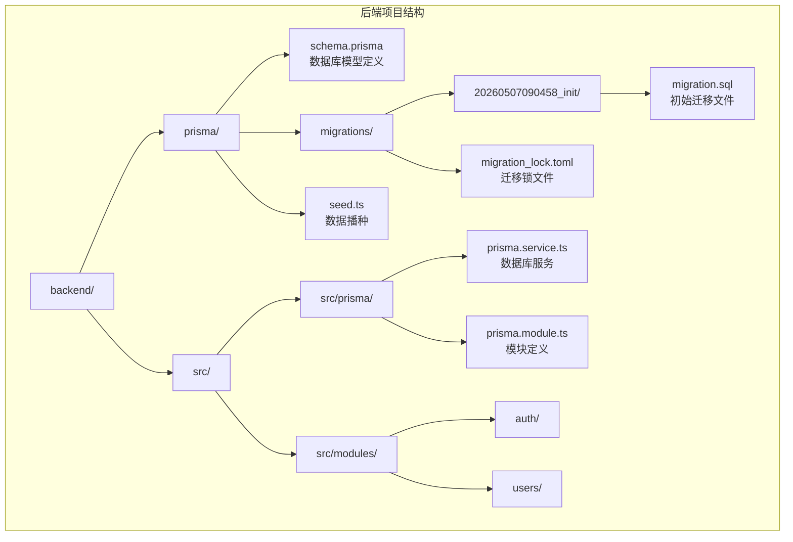
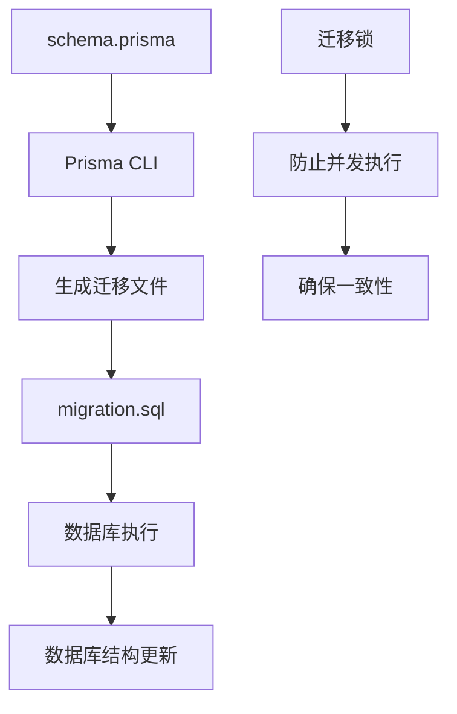
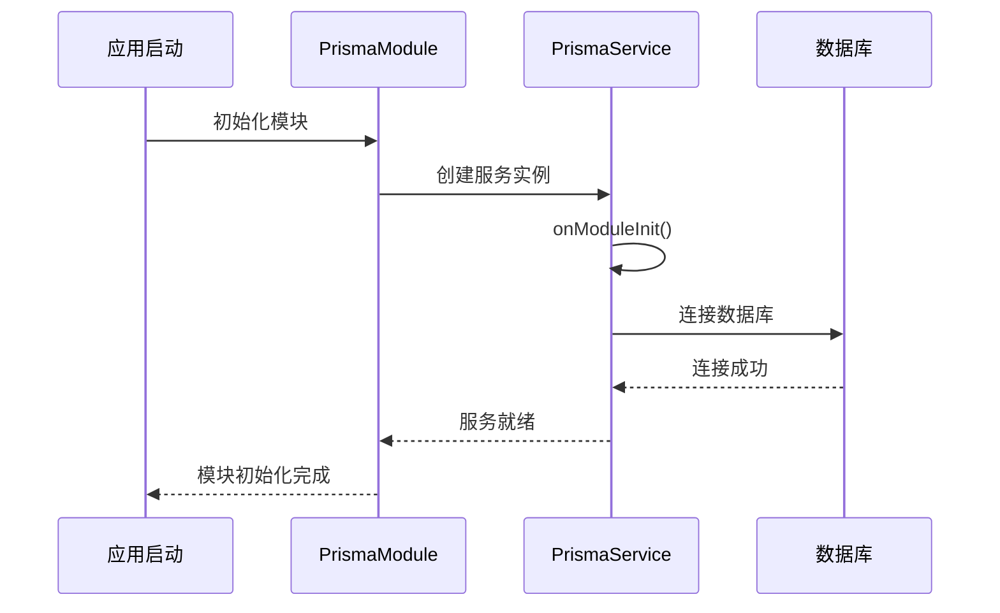
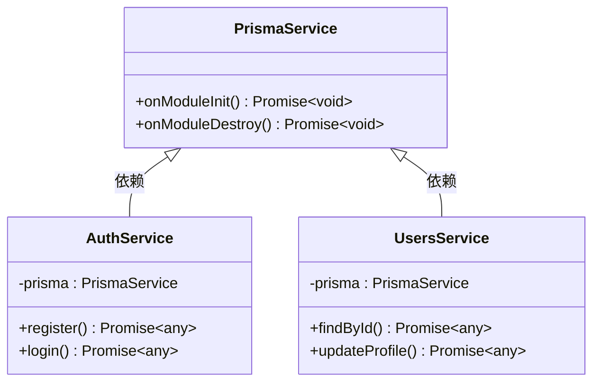
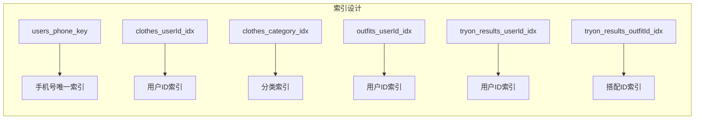
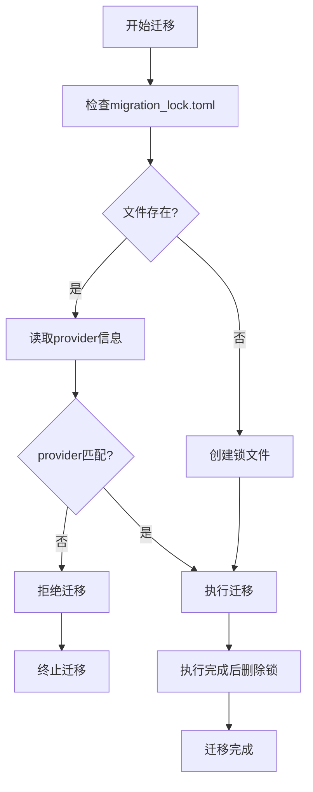
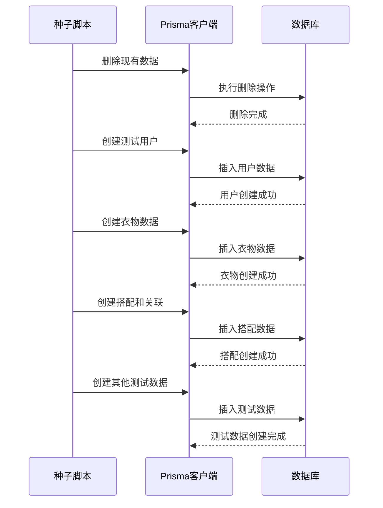
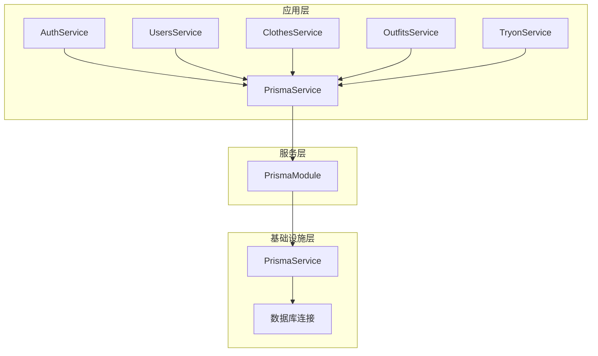

# 数据库迁移管理

<cite>
**本文档引用的文件**
- [schema.prisma](file://backend/prisma/schema.prisma)
- [migration.sql](file://backend/prisma/migrations/20260507090458_init/migration.sql)
- [migration_lock.toml](file://backend/prisma/migrations/migration_lock.toml)
- [seed.ts](file://backend/prisma/seed.ts)
- [prisma.service.ts](file://backend/src/prisma/prisma.service.ts)
- [prisma.module.ts](file://backend/src/prisma/prisma.module.ts)
- [package.json](file://backend/package.json)
- [app.module.ts](file://backend/src/app.module.ts)
- [auth.service.ts](file://backend/src/modules/auth/auth.service.ts)
- [users.service.ts](file://backend/src/modules/users/users.service.ts)
</cite>

## 目录
1. [简介](#简介)
2. [项目结构](#项目结构)
3. [核心组件](#核心组件)
4. [架构概览](#架构概览)
5. [详细组件分析](#详细组件分析)
6. [依赖关系分析](#依赖关系分析)
7. [性能考虑](#性能考虑)
8. [故障排除指南](#故障排除指南)
9. [结论](#结论)

## 简介

畅搭(FreeDress)应用采用Prisma作为数据库ORM工具，实现了完整的数据库迁移管理流程。本文档详细说明了Prisma迁移系统的使用方法，包括迁移文件的生成、执行和版本控制，深入解析了初始迁移文件的内容和作用，解释了数据库结构的初始化过程，并阐述了迁移锁机制的工作原理和使用场景。

## 项目结构

畅搭项目的数据库迁移管理主要集中在后端目录的Prisma配置中：

**图表来源**
- [schema.prisma:1-132](file://backend/prisma/schema.prisma#L1-L132)
- [migration.sql:1-121](file://backend/prisma/migrations/20260507090458_init/migration.sql#L1-L121)
- [prisma.service.ts:1-27](file://backend/src/prisma/prisma.service.ts#L1-L27)

**章节来源**
- [schema.prisma:1-132](file://backend/prisma/schema.prisma#L1-L132)
- [package.json:1-91](file://backend/package.json#L1-L91)

## 核心组件

### Prisma数据库模型定义

畅搭应用使用Prisma的数据库模式语言定义了完整的数据模型，包括用户、衣物、搭配、收藏和AI试穿结果等核心实体。

**用户模型**包含以下关键属性：
- 唯一标识符：UUID类型
- 手机号码：唯一约束
- 密码：加密存储
- 昵称：默认值"用户"
- 角色：UserRole枚举(USER/VIP)
- 时间戳：创建和更新时间

**衣物模型**支持多种分类：
- TOP(上衣)、BOTTOM(下装)、COAT(外套)
- ACCESSORY(配饰)、SHOE(鞋子)
- 支持颜色、风格、季节和标签字段

**章节来源**
- [schema.prisma:14-131](file://backend/prisma/schema.prisma#L14-L131)

### 迁移系统架构

Prisma迁移系统采用声明式设计，通过schema.prisma文件定义数据库结构，自动生成SQL迁移文件。

**图表来源**
- [schema.prisma:1-132](file://backend/prisma/schema.prisma#L1-L132)
- [migration.sql:1-121](file://backend/prisma/migrations/20260507090458_init/migration.sql#L1-L121)

**章节来源**
- [package.json:21-24](file://backend/package.json#L21-L24)

## 架构概览

### 数据库连接管理

畅搭应用通过NestJS的全局模块模式管理数据库连接：

**图表来源**
- [prisma.module.ts:1-14](file://backend/src/prisma/prisma.module.ts#L1-L14)
- [prisma.service.ts:14-25](file://backend/src/prisma/prisma.service.ts#L14-L25)

### 数据访问层

各业务模块通过注入PrismaService进行数据库操作：

**图表来源**
- [prisma.service.ts:1-27](file://backend/src/prisma/prisma.service.ts#L1-L27)
- [auth.service.ts:30-37](file://backend/src/modules/auth/auth.service.ts#L30-L37)
- [users.service.ts:10-11](file://backend/src/modules/users/users.service.ts#L10-L11)

**章节来源**
- [app.module.ts:1-33](file://backend/src/app.module.ts#L1-L33)
- [auth.service.ts:1-200](file://backend/src/modules/auth/auth.service.ts#L1-L200)
- [users.service.ts:1-102](file://backend/src/modules/users/users.service.ts#L1-L102)

## 详细组件分析

### 初始迁移文件分析

初始迁移文件包含了完整的数据库结构初始化，涵盖了所有核心实体的创建和关系建立。

#### 数据库对象创建

迁移文件按顺序创建了以下数据库对象：

**枚举类型创建**：
- UserRole：包含USER和VIP两种角色
- ClothCategory：包含TOP、BOTTOM、COAT、ACCESSORY、SHOE五种分类

**核心表结构**：
- users表：用户基本信息和认证数据
- clothes表：衣物详细信息和分类
- outfits表：搭配方案和描述
- outfit_clothes表：多对多关联表
- favorites表：用户收藏关系
- tryon_results表：AI试穿结果

**章节来源**
- [migration.sql:1-121](file://backend/prisma/migrations/20260507090458_init/migration.sql#L1-L121)

#### 索引优化设计

迁移文件包含了多个关键索引以优化查询性能：

**图表来源**
- [migration.sql:80-96](file://backend/prisma/migrations/20260507090458_init/migration.sql#L80-L96)

#### 外键关系建立

建立了完整的数据完整性约束：

- 衣物与用户的级联删除关系
- 搭配与用户的级联删除关系
- 多对多关联的级联删除关系
- 收藏关系的级联删除关系
- 试穿结果与用户的级联删除关系

**章节来源**
- [migration.sql:98-120](file://backend/prisma/migrations/20260507090458_init/migration.sql#L98-L120)

### 迁移锁机制详解

迁移锁文件是Prisma迁移系统的重要安全机制：

**图表来源**
- [migration_lock.toml:1-3](file://backend/prisma/migrations/migration_lock.toml#L1-L3)

迁移锁文件的作用：
- 防止多个进程同时执行迁移
- 确保数据库提供程序的一致性
- 提供迁移状态的可见性

**章节来源**
- [migration_lock.toml:1-3](file://backend/prisma/migrations/migration_lock.toml#L1-L3)

### 数据播种功能

种子文件提供了完整的测试数据初始化：

**图表来源**
- [seed.ts:6-171](file://backend/prisma/seed.ts#L6-L171)

**章节来源**
- [seed.ts:1-182](file://backend/prisma/seed.ts#L1-L182)

## 依赖关系分析

### 数据库依赖链

**图表来源**
- [auth.service.ts:30-37](file://backend/src/modules/auth/auth.service.ts#L30-L37)
- [users.service.ts:10-11](file://backend/src/modules/users/users.service.ts#L10-L11)
- [prisma.module.ts:8-13](file://backend/src/prisma/prisma.module.ts#L8-L13)

### 迁移命令依赖

应用提供了完整的迁移管理脚本：

| 脚本命令 | 功能描述 | 使用场景 |
|---------|----------|----------|
| prisma:generate | 生成Prisma客户端代码 | 开发环境初始化 |
| prisma:migrate | 执行开发环境迁移 | 开发和测试环境 |
| prisma:studio | 启动Prisma Studio可视化工具 | 数据调试和验证 |
| prisma:seed | 执行数据播种 | 测试数据准备 |

**章节来源**
- [package.json:21-24](file://backend/package.json#L21-L24)

## 性能考虑

### 索引优化策略

数据库迁移中包含了多个关键索引以确保查询性能：

1. **用户手机号唯一索引**：确保用户注册的唯一性
2. **衣物表复合索引**：优化用户和分类查询
3. **试穿结果表关联索引**：提升关联查询效率

### 查询性能监控

建议在生产环境中监控以下指标：
- 数据库连接池使用率
- 查询响应时间分布
- 索引使用效率
- 并发连接数

## 故障排除指南

### 常见迁移问题

**问题1：迁移锁冲突**
- 症状：迁移执行被拒绝
- 解决方案：检查migration_lock.toml文件，确认没有其他进程占用

**问题2：数据库连接失败**
- 症状：应用启动时报数据库连接错误
- 解决方案：检查DATABASE_URL环境变量配置

**问题3：数据播种失败**
- 症状：种子数据无法正确插入
- 解决方案：检查Prisma客户端版本兼容性和数据库权限

### 调试方法

1. **启用详细日志**：在开发环境中增加Prisma日志输出
2. **使用Prisma Studio**：通过可视化界面检查数据状态
3. **单元测试验证**：编写数据库操作的单元测试
4. **数据库监控**：监控慢查询和异常操作

**章节来源**
- [prisma.service.ts:14-25](file://backend/src/prisma/prisma.service.ts#L14-L25)

## 结论

畅搭应用的数据库迁移管理系统展现了现代Web应用的最佳实践：

1. **声明式设计**：通过schema.prisma定义数据库结构，确保版本控制和可重复性
2. **自动化迁移**：自动生成SQL文件，减少手动错误
3. **安全性保障**：迁移锁机制防止并发冲突
4. **开发友好**：提供完整的开发工具链和调试支持

该系统为后续的功能扩展和维护奠定了坚实的基础，建议团队遵循既定的迁移规范，在每次数据库变更前都进行充分的测试和备份。