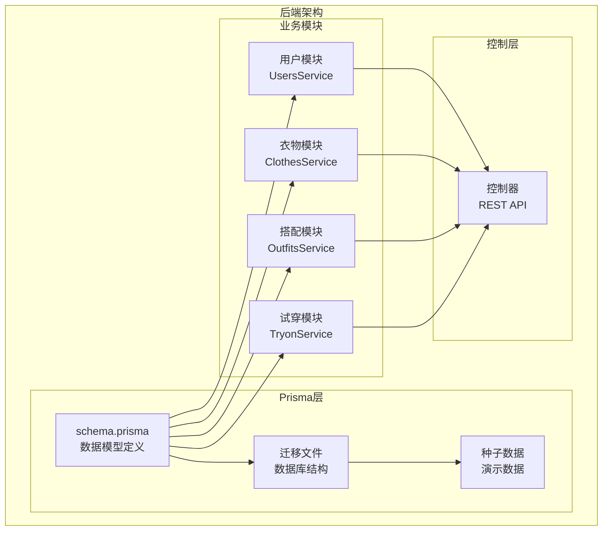
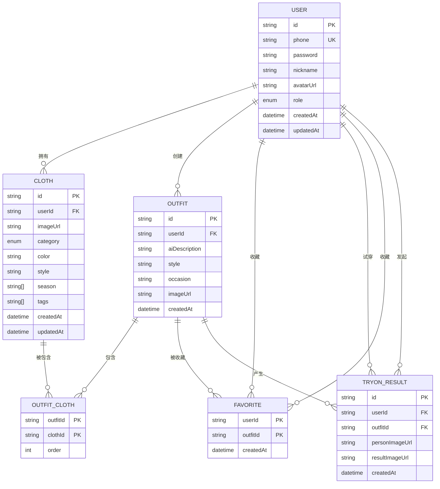
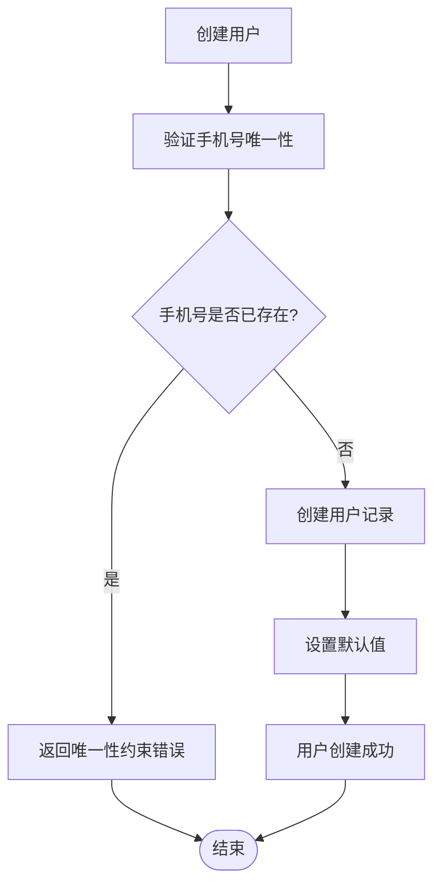
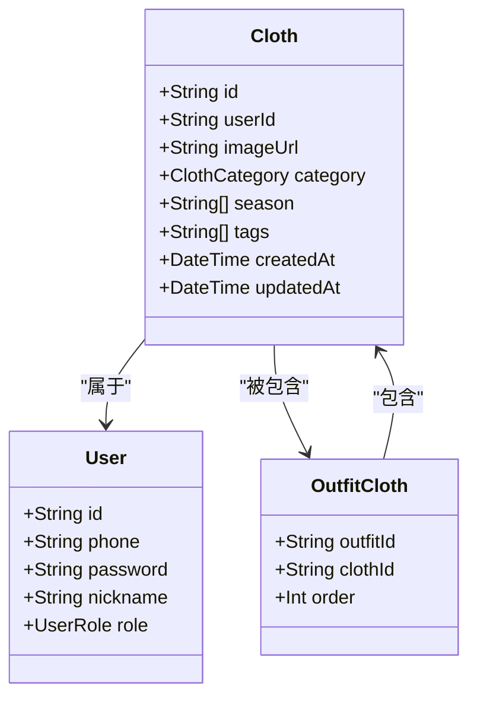
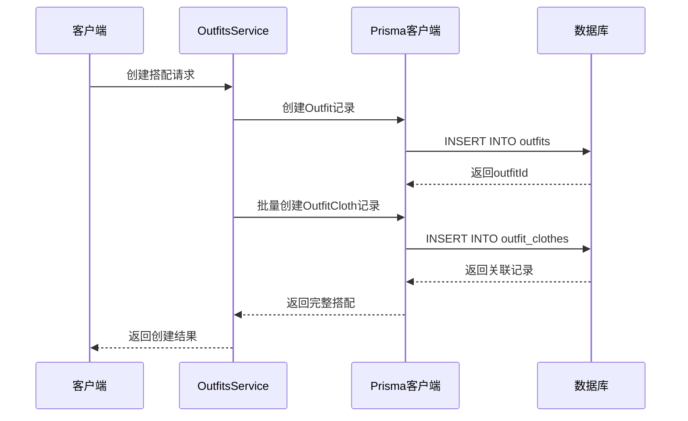
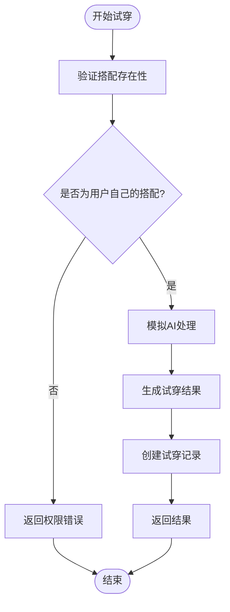
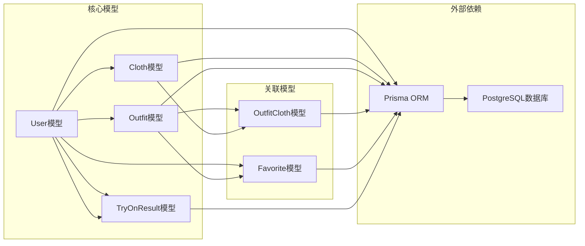
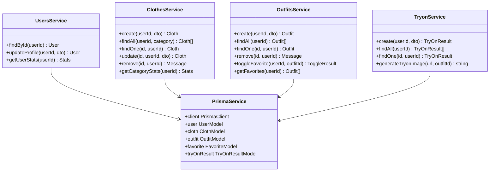

# 数据模型定义

<cite>
**本文档引用的文件**
- [schema.prisma](file://backend/prisma/schema.prisma)
- [migration.sql](file://backend/prisma/migrations/20260507090458_init/migration.sql)
- [seed.ts](file://backend/prisma/seed.ts)
- [users.service.ts](file://backend/src/modules/users/users.service.ts)
- [clothes.service.ts](file://backend/src/modules/clothes/clothes.service.ts)
- [outfits.service.ts](file://backend/src/modules/outfits/outfits.service.ts)
- [tryon.service.ts](file://backend/src/modules/tryon/tryon.service.ts)
- [update-profile.dto.ts](file://backend/src/modules/users/dto/update-profile.dto.ts)
- [create-cloth.dto.ts](file://backend/src/modules/clothes/dto/create-cloth.dto.ts)
- [update-cloth.dto.ts](file://backend/src/modules/clothes/dto/update-cloth.dto.ts)
- [create-outfit.dto.ts](file://backend/src/modules/outfits/dto/create-outfit.dto.ts)
- [create-tryon.dto.ts](file://backend/src/modules/tryon/dto/create-tryon.dto.ts)
- [users.controller.ts](file://backend/src/modules/users/users.controller.ts)
- [clothes.controller.ts](file://backend/src/modules/clothes/clothes.controller.ts)
- [outfits.controller.ts](file://backend/src/modules/outfits/outfits.controller.ts)
- [tryon.controller.ts](file://backend/src/modules/tryon/tryon.controller.ts)
</cite>

## 目录
1. [简介](#简介)
2. [项目结构](#项目结构)
3. [核心组件](#核心组件)
4. [架构概览](#架构概览)
5. [详细组件分析](#详细组件分析)
6. [依赖分析](#依赖分析)
7. [性能考虑](#性能考虑)
8. [故障排除指南](#故障排除指南)
9. [结论](#结论)

## 简介

畅搭(FreeDress)是一个基于Prisma的数据模型系统，专注于服装搭配和个人衣橱管理。本系统采用PostgreSQL作为数据存储，通过Prisma ORM实现数据模型定义和数据库操作。

系统包含五个核心数据模型：User用户模型、Cloth衣物模型、Outfit搭配模型、TryOnResult试穿结果模型，以及用于实现多对多关系的OutfitCloth关联表。这些模型共同构成了完整的服装搭配生态系统。

## 项目结构

后端采用模块化架构，每个功能领域都有独立的服务层和控制器层：

**图表来源**
- [schema.prisma:1-132](file://backend/prisma/schema.prisma#L1-L132)
- [users.service.ts:1-102](file://backend/src/modules/users/users.service.ts#L1-L102)
- [clothes.service.ts:1-148](file://backend/src/modules/clothes/clothes.service.ts#L1-L148)

**章节来源**
- [schema.prisma:1-132](file://backend/prisma/schema.prisma#L1-L132)
- [migration.sql:1-121](file://backend/prisma/migrations/20260507090458_init/migration.sql#L1-L121)

## 核心组件

### 数据模型概述

系统采用Prisma数据模型语法，通过装饰器实现各种约束和索引配置。每个模型都遵循统一的设计原则：

- **主键标识**：使用`@id`装饰器标识主键字段
- **默认值设置**：通过`@default()`装饰器设置字段默认值
- **唯一性约束**：使用`@unique`装饰器确保字段唯一性
- **索引配置**：通过`@@index()`装饰器创建复合索引
- **表映射**：使用`@@map()`装饰器自定义表名

**章节来源**
- [schema.prisma:14-131](file://backend/prisma/schema.prisma#L14-L131)

## 架构概览

**图表来源**
- [schema.prisma:14-131](file://backend/prisma/schema.prisma#L14-L131)

## 详细组件分析

### User用户模型

User模型是整个系统的核心实体，代表平台的用户身份。

#### 字段定义与约束

| 字段名 | 类型 | 约束 | 默认值 | 描述 |
|--------|------|--------|--------|------|
| id | String | @id, @default(uuid()) | UUID | 用户唯一标识符 |
| phone | String | @unique | - | 用户手机号码，全局唯一 |
| password | String | - | - | 用户密码哈希值 |
| nickname | String | - | "用户" | 用户昵称 |
| avatarUrl | String? | - | null | 用户头像URL |
| role | UserRole | @default(USER) | USER | 用户角色枚举 |
| createdAt | DateTime | @default(now()) | 当前时间 | 创建时间戳 |
| updatedAt | DateTime | @updatedAt | 当前时间 | 更新时间戳 |

#### 关系设计

User模型与多个其他模型建立关联关系：
- 一对多：拥有衣物(Cloth[])
- 一对多：创建搭配(Outfit[])
- 一对多：收藏(Favorite[])
- 一对多：试穿结果(TryOnResult[])

#### 数据完整性保证

**图表来源**
- [schema.prisma:14-31](file://backend/prisma/schema.prisma#L14-L31)
- [users.service.ts:18-44](file://backend/src/modules/users/users.service.ts#L18-L44)

**章节来源**
- [schema.prisma:14-31](file://backend/prisma/schema.prisma#L14-L31)
- [users.service.ts:18-44](file://backend/src/modules/users/users.service.ts#L18-L44)

### Cloth衣物模型

Cloth模型用于存储用户衣橱中的具体衣物信息。

#### 字段定义与约束

| 字段名 | 类型 | 约束 | 默认值 | 描述 |
|--------|------|--------|--------|------|
| id | String | @id, @default(uuid()) | UUID | 衣物唯一标识符 |
| userId | String | - | - | 所属用户ID |
| imageUrl | String | - | - | 衣物图片URL |
| category | ClothCategory | - | - | 衣物分类枚举 |
| color | String? | - | null | 衣物颜色 |
| style | String? | - | null | 衣物风格 |
| season | String[] | - | [] | 适用季节数组 |
| tags | String[] | - | [] | 标签数组 |
| createdAt | DateTime | @default(now()) | 当前时间 | 创建时间戳 |
| updatedAt | DateTime | @updatedAt | 当前时间 | 更新时间戳 |

#### 关系设计

Cloth模型通过userId字段与User模型建立外键关系，并通过onDelete: Cascade设置级联删除策略。

#### 索引优化

**图表来源**
- [schema.prisma:40-59](file://backend/prisma/schema.prisma#L40-L59)

**章节来源**
- [schema.prisma:40-59](file://backend/prisma/schema.prisma#L40-L59)
- [clothes.service.ts:21-30](file://backend/src/modules/clothes/clothes.service.ts#L21-L30)

### Outfit搭配模型

Outfit模型表示用户创建的服装搭配组合。

#### 字段定义与约束

| 字段名 | 类型 | 约束 | 默认值 | 描述 |
|--------|------|--------|--------|------|
| id | String | @id, @default(uuid()) | UUID | 搭配唯一标识符 |
| userId | String | - | - | 创建用户ID |
| aiDescription | String? | - | null | AI生成的搭配描述 |
| style | String? | - | null | 搭配风格 |
| occasion | String? | - | null | 适用场合 |
| imageUrl | String? | - | null | 搭配效果图URL |
| createdAt | DateTime | @default(now()) | 当前时间 | 创建时间戳 |

#### 多对多关系实现

Outfit与Cloth之间的多对多关系通过中间表OutfitCloth实现：

**图表来源**
- [outfits.service.ts:9-33](file://backend/src/modules/outfits/outfits.service.ts#L9-L33)
- [schema.prisma:91-101](file://backend/prisma/schema.prisma#L91-L101)

**章节来源**
- [schema.prisma:70-101](file://backend/prisma/schema.prisma#L70-L101)
- [outfits.service.ts:9-33](file://backend/src/modules/outfits/outfits.service.ts#L9-L33)

### TryOnResult试穿结果模型

TryOnResult模型存储AI试穿功能产生的结果数据。

#### 字段定义与约束

| 字段名 | 类型 | 约束 | 默认值 | 描述 |
|--------|------|--------|--------|------|
| id | String | @id, @default(uuid()) | UUID | 试穿结果唯一标识符 |
| userId | String | - | - | 发起试穿的用户ID |
| outfitId | String | - | - | 试穿的搭配ID |
| personImageUrl | String | - | - | 人物照片URL |
| resultImageUrl | String | - | - | AI生成结果URL |
| createdAt | DateTime | @default(now()) | 当前时间 | 创建时间戳 |

#### 业务流程

**图表来源**
- [tryon.service.ts:9-33](file://backend/src/modules/tryon/tryon.service.ts#L9-L33)

**章节来源**
- [schema.prisma:116-131](file://backend/prisma/schema.prisma#L116-L131)
- [tryon.service.ts:9-33](file://backend/src/modules/tryon/tryon.service.ts#L9-L33)

### Favorite收藏模型

Favorite模型实现用户对搭配的收藏功能。

#### 字段定义与约束

| 字段名 | 类型 | 约束 | 默认值 | 描述 |
|--------|------|--------|--------|------|
| userId | String | - | - | 用户ID |
| outfitId | String | - | - | 搭配ID |
| createdAt | DateTime | @default(now()) | 当前时间 | 收藏时间戳 |

#### 复合主键设计

Favorite模型使用复合主键(userId, outfitId)，确保同一用户不能重复收藏同一搭配。

**章节来源**
- [schema.prisma:103-114](file://backend/prisma/schema.prisma#L103-L114)

## 依赖分析

### 数据模型依赖关系

**图表来源**
- [schema.prisma:14-131](file://backend/prisma/schema.prisma#L14-L131)

### 服务层依赖

每个业务服务都依赖于PrismaService来执行数据库操作，同时通过DTO进行输入验证：

**图表来源**
- [users.service.ts:10-11](file://backend/src/modules/users/users.service.ts#L10-L11)
- [clothes.service.ts:12-13](file://backend/src/modules/clothes/clothes.service.ts#L12-L13)
- [outfits.service.ts:6-7](file://backend/src/modules/outfits/outfits.service.ts#L6-L7)
- [tryon.service.ts:6-7](file://backend/src/modules/tryon/tryon.service.ts#L6-L7)

**章节来源**
- [users.service.ts:10-11](file://backend/src/modules/users/users.service.ts#L10-L11)
- [clothes.service.ts:12-13](file://backend/src/modules/clothes/clothes.service.ts#L12-L13)
- [outfits.service.ts:6-7](file://backend/src/modules/outfits/outfits.service.ts#L6-L7)
- [tryon.service.ts:6-7](file://backend/src/modules/tryon/tryon.service.ts#L6-L7)

## 性能考虑

### 索引策略

系统通过多种索引策略优化查询性能：

1. **唯一索引**：用户手机号(phone)确保全局唯一性
2. **普通索引**：衣物分类(category)和用户ID(userId)提高查询效率
3. **复合索引**：收藏表(userId, outfitId)和多对多关联表(outfitId, clothId)支持高效关联查询

### 查询优化建议

- **分页查询**：对于大量数据的列表查询，建议实现分页机制
- **选择性字段**：在高频查询中优先使用有索引的字段
- **批量操作**：对于多对多关系的创建，使用批量插入提高性能

## 故障排除指南

### 常见问题及解决方案

#### 数据库连接问题
- **症状**：应用启动时无法连接数据库
- **原因**：DATABASE_URL环境变量配置错误
- **解决**：检查环境配置文件中的数据库连接字符串

#### 数据唯一性冲突
- **症状**：创建用户时返回唯一性约束错误
- **原因**：手机号已被其他用户注册
- **解决**：提示用户更换手机号或找回账号

#### 权限验证失败
- **症状**：访问他人数据时返回权限错误
- **原因**：业务逻辑中未正确验证数据所有权
- **解决**：检查服务层的权限验证逻辑

**章节来源**
- [users.service.ts:39-41](file://backend/src/modules/users/users.service.ts#L39-L41)
- [clothes.service.ts:75-78](file://backend/src/modules/clothes/clothes.service.ts#L75-L78)
- [outfits.service.ts:64-66](file://backend/src/modules/outfits/outfits.service.ts#L64-L66)
- [tryon.service.ts:70-72](file://backend/src/modules/tryon/tryon.service.ts#L70-L72)

## 结论

畅搭(FreeDress)的数据模型设计体现了现代Web应用的最佳实践：

1. **清晰的实体关系**：通过Prisma的关联语法清晰表达了用户、衣物、搭配之间的层次关系
2. **完善的约束机制**：利用装饰器实现了主键、唯一性、默认值等多重约束
3. **合理的索引策略**：针对高频查询场景设计了相应的索引优化
4. **模块化的架构设计**：服务层与数据层分离，便于维护和扩展

该数据模型为后续的功能扩展奠定了坚实的基础，包括AI试穿功能、社交分享、智能推荐等特性都可以在此基础上进行开发。