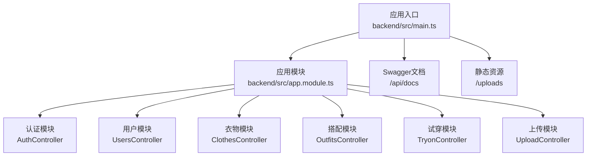
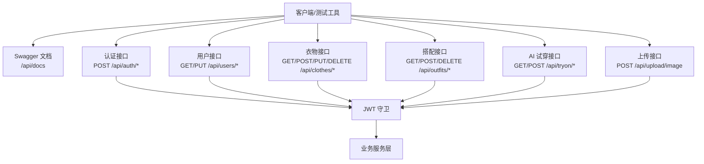
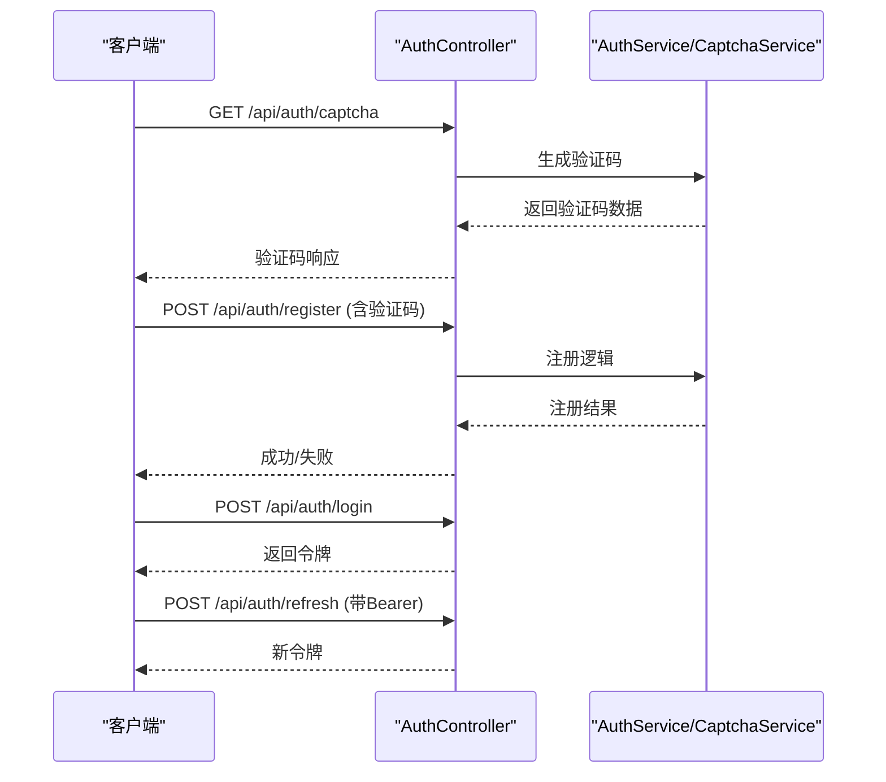
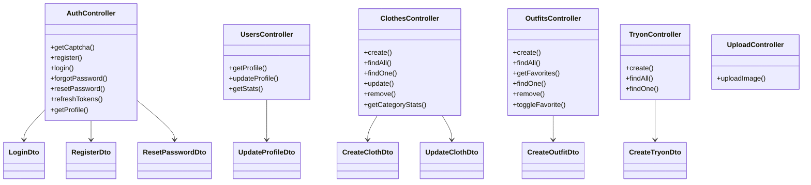

# API测试

<cite>
**本文引用的文件**
- [backend/src/main.ts](file://backend/src/main.ts)
- [backend/src/app.module.ts](file://backend/src/app.module.ts)
- [backend/src/modules/auth/auth.controller.ts](file://backend/src/modules/auth/auth.controller.ts)
- [backend/src/modules/auth/dto/login.dto.ts](file://backend/src/modules/auth/dto/login.dto.ts)
- [backend/src/modules/auth/dto/register.dto.ts](file://backend/src/modules/auth/dto/register.dto.ts)
- [backend/src/modules/auth/dto/reset-password.dto.ts](file://backend/src/modules/auth/dto/reset-password.dto.ts)
- [backend/src/modules/users/users.controller.ts](file://backend/src/modules/users/users.controller.ts)
- [backend/src/modules/users/dto/update-profile.dto.ts](file://backend/src/modules/users/dto/update-profile.dto.ts)
- [backend/src/modules/clothes/clothes.controller.ts](file://backend/src/modules/clothes/clothes.controller.ts)
- [backend/src/modules/clothes/dto/create-cloth.dto.ts](file://backend/src/modules/clothes/dto/create-cloth.dto.ts)
- [backend/src/modules/clothes/dto/update-cloth.dto.ts](file://backend/src/modules/clothes/dto/update-cloth.dto.ts)
- [backend/src/modules/outfits/outfits.controller.ts](file://backend/src/modules/outfits/outfits.controller.ts)
- [backend/src/modules/outfits/dto/create-outfit.dto.ts](file://backend/src/modules/outfits/dto/create-outfit.dto.ts)
- [backend/src/modules/tryon/tryon.controller.ts](file://backend/src/modules/tryon/tryon.controller.ts)
- [backend/src/modules/tryon/dto/create-tryon.dto.ts](file://backend/src/modules/tryon/dto/create-tryon.dto.ts)
- [backend/src/modules/upload/upload.controller.ts](file://backend/src/modules/upload/upload.controller.ts)
</cite>

## 目录
1. [简介](#简介)
2. [项目结构](#项目结构)
3. [核心组件](#核心组件)
4. [架构总览](#架构总览)
5. [详细组件分析](#详细组件分析)
6. [依赖分析](#依赖分析)
7. [性能考虑](#性能考虑)
8. [故障排查指南](#故障排查指南)
9. [结论](#结论)
10. [附录](#附录)

## 简介
本测试文档面向畅搭(FreeDress)项目的后端RESTful API，覆盖认证、用户、衣物、搭配与AI试穿五大模块的测试策略与实践。文档提供基于Postman/Insomnia的手动测试流程、自动化测试脚本编写指南、参数与响应验证、错误处理测试、安全性与性能可靠性测试方法，并给出测试用例设计与测试报告生成建议，以确保API质量的全面保障。

## 项目结构
后端采用NestJS框架，统一通过“/api”前缀暴露REST接口；Swagger文档在“/api/docs”提供在线交互式API说明；全局启用CORS、统一响应格式与异常过滤器；认证通过JWT守卫保护受保护路由。

图表来源
- [backend/src/main.ts:12-58](file://backend/src/main.ts#L12-L58)
- [backend/src/app.module.ts:13-31](file://backend/src/app.module.ts#L13-L31)

章节来源
- [backend/src/main.ts:12-58](file://backend/src/main.ts#L12-L58)
- [backend/src/app.module.ts:13-31](file://backend/src/app.module.ts#L13-L31)

## 核心组件
- 全局配置与中间件
  - 全局验证管道：白名单过滤、非白名单禁止、自动类型转换
  - 全局拦截器：统一响应包装
  - 全局异常过滤器：统一错误响应
  - CORS：允许凭据跨域
  - 全局前缀：/api
  - Swagger：生成交互式API文档
- 模块化路由
  - 认证：验证码、注册、登录、忘记/重置密码、刷新令牌、获取当前用户
  - 用户：获取/更新资料、获取统计
  - 衣物：增删改查、分类统计
  - 搭配：增删改查、收藏切换、列表查询
  - AI试穿：提交请求、列表与详情查询
  - 上传：图片上传（multipart/form-data）

章节来源
- [backend/src/main.ts:15-48](file://backend/src/main.ts#L15-L48)
- [backend/src/app.module.ts:14-29](file://backend/src/app.module.ts#L14-L29)
- [backend/src/modules/auth/auth.controller.ts:24-90](file://backend/src/modules/auth/auth.controller.ts#L24-L90)
- [backend/src/modules/users/users.controller.ts:19-47](file://backend/src/modules/users/users.controller.ts#L19-L47)
- [backend/src/modules/clothes/clothes.controller.ts:31-100](file://backend/src/modules/clothes/clothes.controller.ts#L31-L100)
- [backend/src/modules/outfits/outfits.controller.ts:17-63](file://backend/src/modules/outfits/outfits.controller.ts#L17-L63)
- [backend/src/modules/tryon/tryon.controller.ts:17-39](file://backend/src/modules/tryon/tryon.controller.ts#L17-L39)
- [backend/src/modules/upload/upload.controller.ts:33-49](file://backend/src/modules/upload/upload.controller.ts#L33-L49)

## 架构总览
下图展示客户端与后端模块间的调用关系与认证流程。

图表来源
- [backend/src/main.ts:40-48](file://backend/src/main.ts#L40-L48)
- [backend/src/modules/auth/auth.controller.ts:16-22](file://backend/src/modules/auth/auth.controller.ts#L16-L22)
- [backend/src/modules/users/users.controller.ts:12-17](file://backend/src/modules/users/users.controller.ts#L12-L17)
- [backend/src/modules/clothes/clothes.controller.ts:24-29](file://backend/src/modules/clothes/clothes.controller.ts#L24-L29)
- [backend/src/modules/outfits/outfits.controller.ts:10-15](file://backend/src/modules/outfits/outfits.controller.ts#L10-L15)
- [backend/src/modules/tryon/tryon.controller.ts:10-15](file://backend/src/modules/tryon/tryon.controller.ts#L10-L15)
- [backend/src/modules/upload/upload.controller.ts:28-31](file://backend/src/modules/upload/upload.controller.ts#L28-L31)

## 详细组件分析

### 认证接口测试
- 接口范围
  - 获取验证码：GET /api/auth/captcha
  - 注册：POST /api/auth/register（需验证码）
  - 登录：POST /api/auth/login
  - 忘记密码：POST /api/auth/forgot-password（需验证码）
  - 重置密码：POST /api/auth/reset-password
  - 刷新令牌：POST /api/auth/refresh（需要JWT）
  - 获取当前用户：GET /api/auth/profile（需要JWT）
- 参数与验证要点
  - 手机号格式、密码长度、验证码长度与格式均在DTO中声明并由全局ValidationPipe生效
  - 忘记密码/重置密码依赖验证码ID与答案
- 测试策略
  - 手动：使用Postman/Insomnia依次调用，先取验证码，再注册/登录，最后携带Authorization访问受保护接口
  - 自动化：构造合法/非法参数集，覆盖必填缺失、格式错误、长度越界、枚举非法等场景
  - 错误处理：断言HTTP状态码与错误消息字段，验证异常过滤器统一返回结构
- 关键路径时序

图表来源
- [backend/src/modules/auth/auth.controller.ts:27-89](file://backend/src/modules/auth/auth.controller.ts#L27-L89)
- [backend/src/modules/auth/dto/register.dto.ts:8-37](file://backend/src/modules/auth/dto/register.dto.ts#L8-L37)
- [backend/src/modules/auth/dto/login.dto.ts:7-19](file://backend/src/modules/auth/dto/login.dto.ts#L7-L19)
- [backend/src/modules/auth/dto/reset-password.dto.ts:7-18](file://backend/src/modules/auth/dto/reset-password.dto.ts#L7-L18)

章节来源
- [backend/src/modules/auth/auth.controller.ts:24-90](file://backend/src/modules/auth/auth.controller.ts#L24-L90)
- [backend/src/modules/auth/dto/register.dto.ts:8-37](file://backend/src/modules/auth/dto/register.dto.ts#L8-L37)
- [backend/src/modules/auth/dto/login.dto.ts:7-19](file://backend/src/modules/auth/dto/login.dto.ts#L7-L19)
- [backend/src/modules/auth/dto/reset-password.dto.ts:7-18](file://backend/src/modules/auth/dto/reset-password.dto.ts#L7-L18)

### 用户接口测试
- 接口范围
  - 获取用户资料：GET /api/users/profile
  - 更新用户资料：PUT /api/users/profile（昵称、头像URL）
  - 获取用户统计：GET /api/users/stats
- 参数与验证要点
  - 更新资料支持可选字段，长度限制在DTO中定义
- 测试策略
  - 先登录获取令牌，再携带Authorization访问受保护接口
  - 覆盖空值、超长、非法字符等边界条件
  - 断言返回字段完整性与类型一致性

章节来源
- [backend/src/modules/users/users.controller.ts:19-47](file://backend/src/modules/users/users.controller.ts#L19-L47)
- [backend/src/modules/users/dto/update-profile.dto.ts:7-18](file://backend/src/modules/users/dto/update-profile.dto.ts#L7-L18)

### 衣物接口测试
- 接口范围
  - 创建衣物：POST /api/clothes
  - 查询衣物列表：GET /api/clothes?category=TOP|BOTTOM|...
  - 查询衣物详情：GET /api/clothes/:id
  - 更新衣物：PUT /api/clothes/:id
  - 删除衣物：DELETE /api/clothes/:id
  - 分类统计：GET /api/clothes/stats/categories
- 参数与验证要点
  - 创建/更新DTO包含分类枚举、颜色/风格/季节/标签数组等字段
  - 分类枚举在DTO中限定
- 测试策略
  - 先登录，携带Authorization
  - 覆盖分类枚举非法、数组格式错误、必填缺失等
  - 列表查询支持按分类筛选，验证过滤逻辑

章节来源
- [backend/src/modules/clothes/clothes.controller.ts:31-100](file://backend/src/modules/clothes/clothes.controller.ts#L31-L100)
- [backend/src/modules/clothes/dto/create-cloth.dto.ts:8-42](file://backend/src/modules/clothes/dto/create-cloth.dto.ts#L8-L42)
- [backend/src/modules/clothes/dto/update-cloth.dto.ts:8](file://backend/src/modules/clothes/dto/update-cloth.dto.ts#L8)

### 搭配接口测试
- 接口范围
  - 创建搭配：POST /api/outfits
  - 查询搭配列表：GET /api/outfits
  - 查询收藏列表：GET /api/outfits/favorites
  - 查询搭配详情：GET /api/outfits/:id
  - 删除搭配：DELETE /api/outfits/:id
  - 收藏/取消收藏：POST /api/outfits/:id/favorite
- 参数与验证要点
  - 至少选择一件衣物，clothIds为字符串数组且非空
- 测试策略
  - 先登录，携带Authorization
  - 覆盖空数组、非字符串元素、ID不存在等场景
  - 收藏切换接口需幂等与状态一致性验证

章节来源
- [backend/src/modules/outfits/outfits.controller.ts:17-63](file://backend/src/modules/outfits/outfits.controller.ts#L17-L63)
- [backend/src/modules/outfits/dto/create-outfit.dto.ts:4-30](file://backend/src/modules/outfits/dto/create-outfit.dto.ts#L4-L30)

### AI试穿接口测试
- 接口范围
  - 提交试穿请求：POST /api/tryon
  - 查询试穿记录列表：GET /api/tryon
  - 查询单条试穿记录：GET /api/tryon/:id
- 参数与验证要点
  - 人物照片URL与搭配ID均为必填字符串
- 测试策略
  - 先登录，携带Authorization
  - 覆盖URL为空、ID为空、无效ID等场景

章节来源
- [backend/src/modules/tryon/tryon.controller.ts:17-39](file://backend/src/modules/tryon/tryon.controller.ts#L17-L39)
- [backend/src/modules/tryon/dto/create-tryon.dto.ts:4-14](file://backend/src/modules/tryon/dto/create-tryon.dto.ts#L4-L14)

### 上传接口测试
- 接口范围
  - 图片上传：POST /api/upload/image（multipart/form-data）
- 参数与验证要点
  - 文件字段名为file，二进制格式
- 测试策略
  - 先登录，携带Authorization
  - 覆盖非图片类型、空文件、过大文件等场景

章节来源
- [backend/src/modules/upload/upload.controller.ts:33-49](file://backend/src/modules/upload/upload.controller.ts#L33-L49)

## 依赖分析
- 控制器依赖服务层，服务层依赖Prisma/数据库
- 全局守卫与装饰器注入当前用户上下文
- DTO作为输入契约，配合全局ValidationPipe进行参数校验

图表来源
- [backend/src/modules/auth/auth.controller.ts:16-90](file://backend/src/modules/auth/auth.controller.ts#L16-L90)
- [backend/src/modules/users/users.controller.ts:12-47](file://backend/src/modules/users/users.controller.ts#L12-L47)
- [backend/src/modules/clothes/clothes.controller.ts:24-100](file://backend/src/modules/clothes/clothes.controller.ts#L24-L100)
- [backend/src/modules/outfits/outfits.controller.ts:10-63](file://backend/src/modules/outfits/outfits.controller.ts#L10-L63)
- [backend/src/modules/tryon/tryon.controller.ts:10-39](file://backend/src/modules/tryon/tryon.controller.ts#L10-L39)
- [backend/src/modules/upload/upload.controller.ts:28-49](file://backend/src/modules/upload/upload.controller.ts#L28-L49)

## 性能考虑
- 并发与限流
  - 对验证码接口与登录接口实施IP/手机号限流，避免暴力破解与刷验证码
- 数据库优化
  - 衣物列表按分类查询应有索引；搭配收藏查询需关注关联表性能
- 缓存策略
  - 常用统计接口可引入缓存，降低数据库压力
- 上传与存储
  - 图片上传建议限制大小与格式，开启CDN与缩略图策略
- 监控与日志
  - 记录关键接口耗时、错误率与异常堆栈，便于定位瓶颈

## 故障排查指南
- 常见问题
  - 401未授权：检查Authorization头是否携带Bearer Token，Token是否过期
  - 403禁止：确认JWT守卫生效与用户权限
  - 422参数校验失败：检查DTO字段约束（长度、格式、枚举、数组）
  - 500服务器错误：查看异常过滤器输出的统一错误结构
- 排查步骤
  - 使用Swagger快速复现问题
  - 在Postman/Insomnia中逐步缩小参数范围
  - 查看服务端日志与数据库异常
  - 对比单元/集成测试用例，定位边界条件

章节来源
- [backend/src/main.ts:24-29](file://backend/src/main.ts#L24-L29)

## 结论
通过结合Swagger交互式文档、Postman/Insomnia手动测试与自动化脚本，配合全局验证、拦截器与异常过滤器，可以系统性地覆盖参数验证、响应格式、错误处理、安全与性能等维度。建议在CI中集成自动化测试流水线，持续保障API质量。

## 附录

### 测试工具与环境
- Postman/Insomnia
  - 导入Swagger文档，自动生成集合
  - 设置全局变量：基础URL、Bearer Token
  - 使用环境变量管理不同环境（本地/测试/生产）
- 自动化测试
  - 可使用cURL、K6（压测）、Jest（单元/集成）等工具
  - 建议将测试脚本与测试数据分离，便于维护与复用

### 参数与响应验证清单
- 必填字段缺失：断言422与具体字段提示
- 字段类型错误：断言422与类型提示
- 长度/范围越界：断言422与长度提示
- 枚举值非法：断言422与枚举提示
- 业务规则校验：断言400/409与业务错误码
- 成功响应：断言200与JSON结构字段存在性与类型

### 错误处理测试要点
- 未登录访问受保护接口：断言401
- 令牌过期/无效：断言401
- 资源不存在：断言404
- 服务器内部错误：断言500，检查错误字段一致性

### 安全性测试
- 认证与授权
  - 无Token/无效Token访问受保护接口
  - 交叉用户资源访问（篡改ID）
- 输入安全
  - SQL注入、命令注入、XSS（上传内容与文本字段）
- 速率限制
  - 验证码/登录接口的频率限制
- CORS与HTTPS
  - 确认仅允许可信域名与HTTPS传输

### 性能与可靠性测试
- 压力测试
  - 使用K6对高频接口（登录、列表查询）施压，观察P95/P99延迟与错误率
- 并发测试
  - 多用户并发创建/更新/删除，验证事务与锁机制
- 可靠性测试
  - 断网/网络抖动下的重试与降级策略
  - 数据库连接池与超时配置

### 测试用例设计与报告
- 用例设计
  - 正常用例：覆盖正常流程与边界值
  - 异常用例：覆盖参数缺失、格式错误、业务冲突、权限不足
  - 回归用例：版本升级后重复执行关键路径
- 报告生成
  - 使用测试框架导出JSON/HTML报告
  - 包含通过率、失败用例详情、截图/日志链接
  - 将报告归档至CI工件，便于追溯