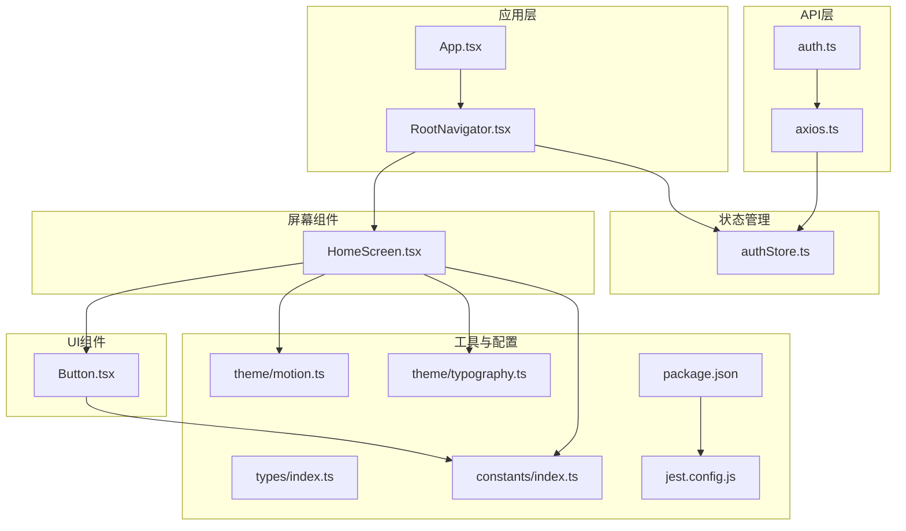
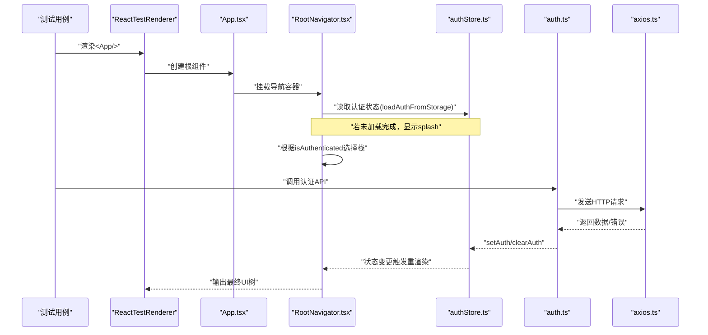
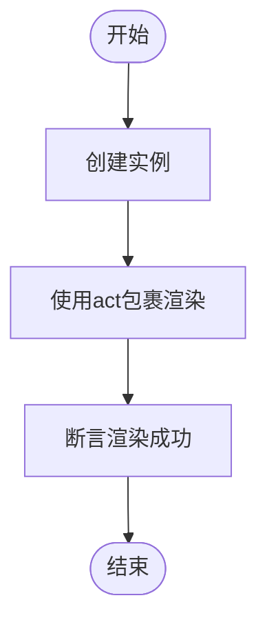
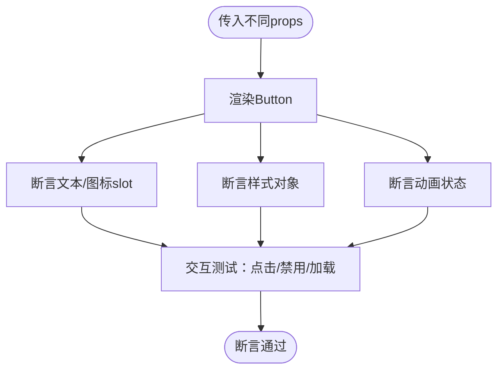
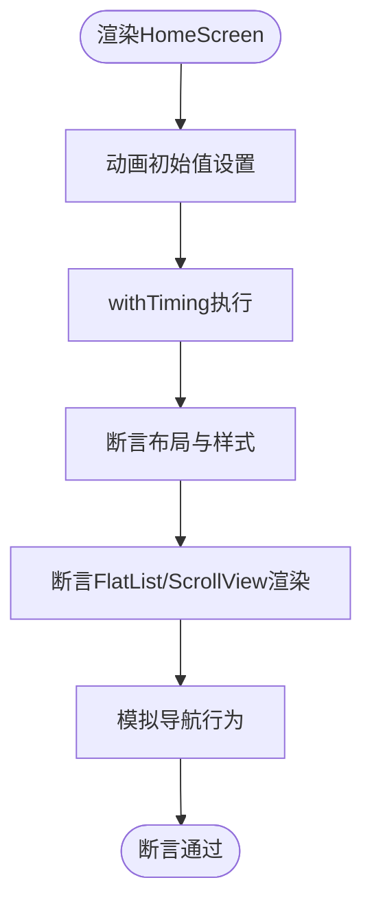
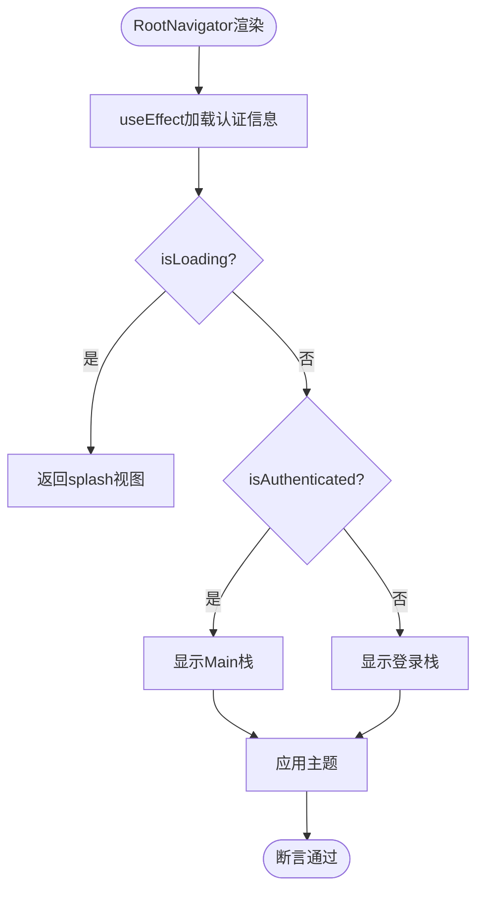
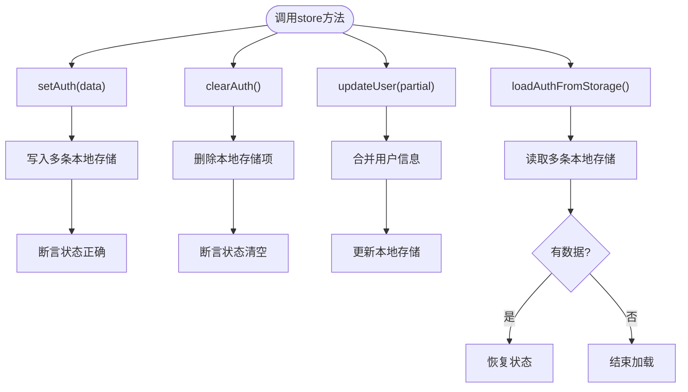
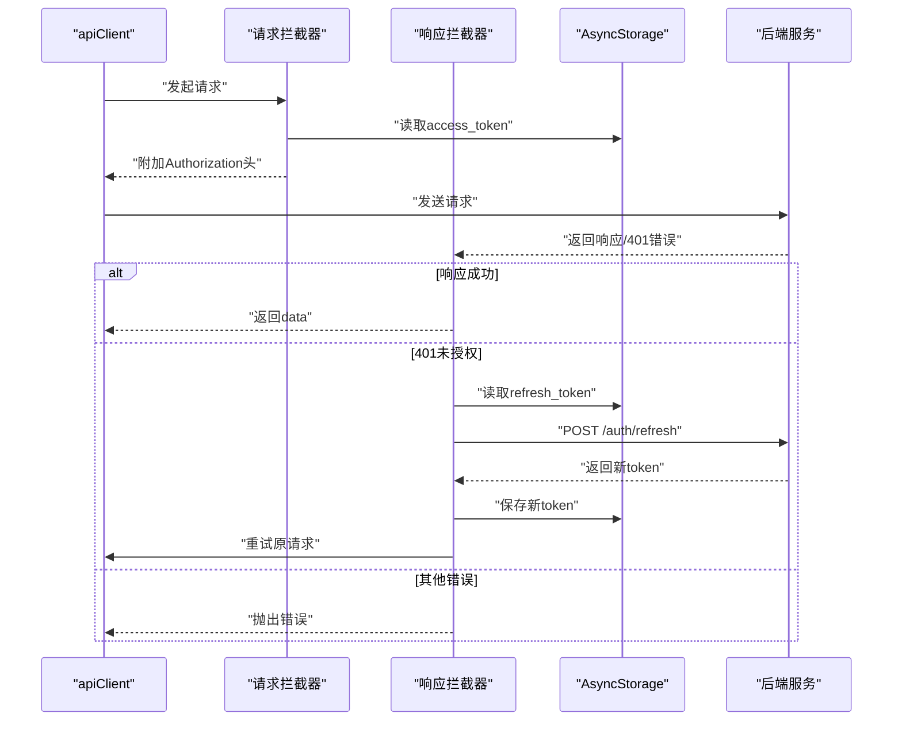
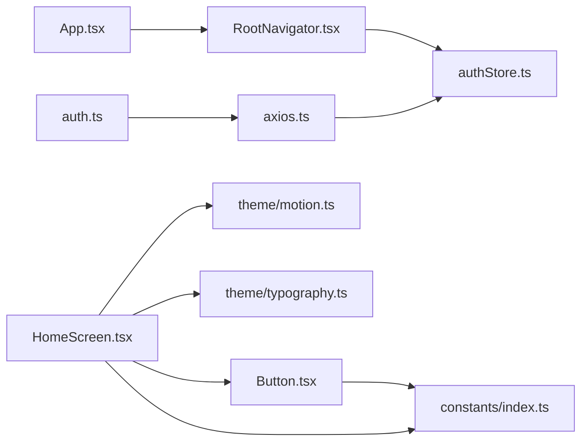

# 前端测试

<cite>
**本文档引用的文件**
- [FreeDressApp/__tests__/App.test.tsx](file://FreeDressApp/__tests__/App.test.tsx)
- [FreeDressApp/jest.config.js](file://FreeDressApp/jest.config.js)
- [FreeDressApp/package.json](file://FreeDressApp/package.json)
- [FreeDressApp/src/App.tsx](file://FreeDressApp/src/App.tsx)
- [FreeDressApp/src/navigation/RootNavigator.tsx](file://FreeDressApp/src/navigation/RootNavigator.tsx)
- [FreeDressApp/src/store/authStore.ts](file://FreeDressApp/src/store/authStore.ts)
- [FreeDressApp/src/api/auth.ts](file://FreeDressApp/src/api/auth.ts)
- [FreeDressApp/src/api/axios.ts](file://FreeDressApp/src/api/axios.ts)
- [FreeDressApp/src/components/Button.tsx](file://FreeDressApp/src/components/Button.tsx)
- [FreeDressApp/src/screns/HomeScreen.tsx](file://FreeDressApp/src/screns/HomeScreen.tsx)
- [FreeDressApp/src/constants/index.ts](file://FreeDressApp/src/constants/index.ts)
- [FreeDressApp/src/types/index.ts](file://FreeDressApp/src/types/index.ts)
- [FreeDressApp/src/theme/motion.ts](file://FreeDressApp/src/theme/motion.ts)
- [FreeDressApp/src/theme/typography.ts](file://FreeDressApp/src/theme/typography.ts)
</cite>

## 目录
1. [简介](#简介)
2. [项目结构](#项目结构)
3. [核心组件](#核心组件)
4. [架构总览](#架构总览)
5. [详细组件分析](#详细组件分析)
6. [依赖关系分析](#依赖关系分析)
7. [性能考量](#性能考量)
8. [故障排查指南](#故障排查指南)
9. [结论](#结论)
10. [附录](#附录)

## 简介
本测试文档面向畅搭(FreeDress)项目的React Native前端，系统化阐述测试策略与落地实践，覆盖以下方面：
- Jest测试框架配置与运行方式
- 组件测试：App基础渲染、UI组件（如Button）、屏幕组件（如HomeScreen）
- 状态管理测试：Zustand store（认证状态）
- 导航组件测试要点
- API客户端与拦截器测试思路
- 测试环境配置、模拟数据与覆盖率监控
- 调试技巧与常见问题处理

目标是帮助团队建立稳定、可维护且覆盖面广的前端测试体系。

## 项目结构
FreeDressApp采用按功能域组织的目录结构，测试文件位于应用根目录下的__tests__目录中，遵循“与源文件同名”的约定。核心模块包括：
- 应用根组件与导航：App、RootNavigator
- 状态管理：authStore（Zustand）
- API层：axios实例与业务API封装
- UI组件：Button等
- 屏幕组件：HomeScreen等
- 类型与常量：types、constants
- 主题与动效：theme/motion、theme/typography

图表来源
- [FreeDressApp/src/App.tsx:1-28](file://FreeDressApp/src/App.tsx#L1-L28)
- [FreeDressApp/src/navigation/RootNavigator.tsx:1-95](file://FreeDressApp/src/navigation/RootNavigator.tsx#L1-L95)
- [FreeDressApp/src/store/authStore.ts:1-123](file://FreeDressApp/src/store/authStore.ts#L1-L123)
- [FreeDressApp/src/api/axios.ts:1-108](file://FreeDressApp/src/api/axios.ts#L1-L108)
- [FreeDressApp/src/api/auth.ts:1-101](file://FreeDressApp/src/api/auth.ts#L1-L101)
- [FreeDressApp/src/components/Button.tsx:1-201](file://FreeDressApp/src/components/Button.tsx#L1-L201)
- [FreeDressApp/src/screns/HomeScreen.tsx:1-606](file://FreeDressApp/src/screns/HomeScreen.tsx#L1-L606)
- [FreeDressApp/src/constants/index.ts:1-212](file://FreeDressApp/src/constants/index.ts#L1-L212)
- [FreeDressApp/src/types/index.ts:1-98](file://FreeDressApp/src/types/index.ts#L1-L98)
- [FreeDressApp/src/theme/motion.ts:1-32](file://FreeDressApp/src/theme/motion.ts#L1-L32)
- [FreeDressApp/src/theme/typography.ts:1-115](file://FreeDressApp/src/theme/typography.ts#L1-L115)
- [FreeDressApp/jest.config.js:1-4](file://FreeDressApp/jest.config.js#L1-L4)
- [FreeDressApp/package.json:1-57](file://FreeDressApp/package.json#L1-L57)

章节来源
- [FreeDressApp/src/App.tsx:1-28](file://FreeDressApp/src/App.tsx#L1-L28)
- [FreeDressApp/src/navigation/RootNavigator.tsx:1-95](file://FreeDressApp/src/navigation/RootNavigator.tsx#L1-L95)
- [FreeDressApp/jest.config.js:1-4](file://FreeDressApp/jest.config.js#L1-L4)
- [FreeDressApp/package.json:1-57](file://FreeDressApp/package.json#L1-L57)

## 核心组件
本节聚焦测试相关的几个关键模块及其职责：
- App.tsx：应用根组件，负责提供手势、安全区域与导航容器
- RootNavigator.tsx：根据认证状态切换登录/主界面栈，并应用主题
- authStore.ts：Zustand认证状态，包含setAuth、clearAuth、loadAuthFromStorage等方法
- axios.ts：Axios实例与请求/响应拦截器，统一处理鉴权与刷新
- auth.ts：认证相关API封装（注册、登录、忘记密码、刷新Token、获取资料）
- Button.tsx：多变体、多配色、多尺寸的按钮组件，含动画反馈
- HomeScreen.tsx：首页聚合组件，包含多个子卡片与动画逻辑
- constants/index.ts：设计Token、API基础地址、存储键名等
- types/index.ts：全局类型定义
- theme/motion.ts、theme/typography.ts：动效与排版样式

章节来源
- [FreeDressApp/src/App.tsx:1-28](file://FreeDressApp/src/App.tsx#L1-L28)
- [FreeDressApp/src/navigation/RootNavigator.tsx:1-95](file://FreeDressApp/src/navigation/RootNavigator.tsx#L1-L95)
- [FreeDressApp/src/store/authStore.ts:1-123](file://FreeDressApp/src/store/authStore.ts#L1-L123)
- [FreeDressApp/src/api/axios.ts:1-108](file://FreeDressApp/src/api/axios.ts#L1-L108)
- [FreeDressApp/src/api/auth.ts:1-101](file://FreeDressApp/src/api/auth.ts#L1-L101)
- [FreeDressApp/src/components/Button.tsx:1-201](file://FreeDressApp/src/components/Button.tsx#L1-L201)
- [FreeDressApp/src/screns/HomeScreen.tsx:1-606](file://FreeDressApp/src/screns/HomeScreen.tsx#L1-L606)
- [FreeDressApp/src/constants/index.ts:1-212](file://FreeDressApp/src/constants/index.ts#L1-L212)
- [FreeDressApp/src/types/index.ts:1-98](file://FreeDressApp/src/types/index.ts#L1-L98)
- [FreeDressApp/src/theme/motion.ts:1-32](file://FreeDressApp/src/theme/motion.ts#L1-L32)
- [FreeDressApp/src/theme/typography.ts:1-115](file://FreeDressApp/src/theme/typography.ts#L1-L115)

## 架构总览
下图展示测试关注的端到端路径：组件渲染 → 导航状态 → 认证状态 → API请求 → 响应处理 → UI更新。

图表来源
- [FreeDressApp/src/App.tsx:1-28](file://FreeDressApp/src/App.tsx#L1-L28)
- [FreeDressApp/src/navigation/RootNavigator.tsx:1-95](file://FreeDressApp/src/navigation/RootNavigator.tsx#L1-L95)
- [FreeDressApp/src/store/authStore.ts:1-123](file://FreeDressApp/src/store/authStore.ts#L1-L123)
- [FreeDressApp/src/api/auth.ts:1-101](file://FreeDressApp/src/api/auth.ts#L1-L101)
- [FreeDressApp/src/api/axios.ts:1-108](file://FreeDressApp/src/api/axios.ts#L1-L108)

## 详细组件分析

### App组件基础渲染测试
- 目标：验证App根组件能正确渲染，不抛出异常
- 关键点：使用ReactTestRenderer创建组件树；通过act包裹异步初始化流程
- 建议断言：渲染成功、无未处理异常；可选断言根容器样式存在

图表来源
- [FreeDressApp/__tests__/App.test.tsx:1-14](file://FreeDressApp/__tests__/App.test.tsx#L1-L14)
- [FreeDressApp/src/App.tsx:1-28](file://FreeDressApp/src/App.tsx#L1-L28)

章节来源
- [FreeDressApp/__tests__/App.test.tsx:1-14](file://FreeDressApp/__tests__/App.test.tsx#L1-L14)
- [FreeDressApp/src/App.tsx:1-28](file://FreeDressApp/src/App.tsx#L1-L28)

### UI组件测试：Button
- 目标：验证不同变体、颜色、尺寸、禁用/加载态的行为与样式
- 关键点：通过props组合不同场景；断言渲染内容、样式对象、动画状态
- 建议断言：
  - 文本内容与左右slot存在
  - 禁用/加载态下交互行为被阻止
  - 样式对象包含预期的颜色、尺寸、边框、阴影等
  - 动画值在pressIn/pressOut时变化

图表来源
- [FreeDressApp/src/components/Button.tsx:1-201](file://FreeDressApp/src/components/Button.tsx#L1-L201)

章节来源
- [FreeDressApp/src/components/Button.tsx:1-201](file://FreeDressApp/src/components/Button.tsx#L1-L201)

### 屏幕组件测试：HomeScreen
- 目标：验证首页布局、动画、列表渲染与导航行为
- 关键点：首页包含多个子组件与动画，需关注：
  - 动画初始值与完成后的样式
  - FlatList与ScrollView的渲染
  - 快捷入口点击后导航行为
- 建议断言：
  - 启动动画完成后，封面区域可见
  - 推荐与电台区域渲染正常
  - 点击快捷入口触发导航（可结合导航mock）

图表来源
- [FreeDressApp/src/screns/HomeScreen.tsx:1-606](file://FreeDressApp/src/screns/HomeScreen.tsx#L1-L606)

章节来源
- [FreeDressApp/src/screns/HomeScreen.tsx:1-606](file://FreeDressApp/src/screns/HomeScreen.tsx#L1-L606)

### 导航组件测试：RootNavigator
- 目标：验证根据认证状态切换栈、主题应用与加载态
- 关键点：useEffect加载认证信息；isLoading期间显示splash；根据isAuthenticated决定显示登录栈或主栈
- 建议断言：
  - 加载期间返回splash视图
  - 已认证：显示Main栈
  - 未认证：显示Login/Register/Forgot/Reset栈
  - 主题颜色与背景符合设计Token

图表来源
- [FreeDressApp/src/navigation/RootNavigator.tsx:1-95](file://FreeDressApp/src/navigation/RootNavigator.tsx#L1-L95)
- [FreeDressApp/src/constants/index.ts:1-212](file://FreeDressApp/src/constants/index.ts#L1-L212)

章节来源
- [FreeDressApp/src/navigation/RootNavigator.tsx:1-95](file://FreeDressApp/src/navigation/RootNavigator.tsx#L1-L95)
- [FreeDressApp/src/constants/index.ts:1-212](file://FreeDressApp/src/constants/index.ts#L1-L212)

### 状态管理测试：authStore（Zustand）
- 目标：验证setAuth、clearAuth、updateUser、loadAuthFromStorage的正确性
- 关键点：与AsyncStorage交互；状态变更与本地存储同步
- 建议断言：
  - setAuth后：用户信息、token、isAuthenticated、isLoading均正确
  - clearAuth后：清空状态并删除本地存储
  - updateUser后：合并用户信息并更新本地存储
  - loadAuthFromStorage：从本地恢复状态或在无数据时结束加载

图表来源
- [FreeDressApp/src/store/authStore.ts:1-123](file://FreeDressApp/src/store/authStore.ts#L1-L123)

章节来源
- [FreeDressApp/src/store/authStore.ts:1-123](file://FreeDressApp/src/store/authStore.ts#L1-L123)

### API客户端与拦截器测试：axios与auth
- 目标：验证请求头注入、响应数据透传、401自动刷新与错误处理
- 关键点：请求拦截器附加Authorization；响应拦截器处理401并尝试刷新；刷新失败清理本地存储
- 建议断言：
  - 有token时请求头包含Bearer
  - 无token时请求头不含Authorization
  - 401时尝试刷新并重试原请求
  - 刷新失败后清理本地存储并抛出错误

图表来源
- [FreeDressApp/src/api/axios.ts:1-108](file://FreeDressApp/src/api/axios.ts#L1-L108)
- [FreeDressApp/src/api/auth.ts:1-101](file://FreeDressApp/src/api/auth.ts#L1-L101)
- [FreeDressApp/src/constants/index.ts:1-212](file://FreeDressApp/src/constants/index.ts#L1-L212)

章节来源
- [FreeDressApp/src/api/axios.ts:1-108](file://FreeDressApp/src/api/axios.ts#L1-L108)
- [FreeDressApp/src/api/auth.ts:1-101](file://FreeDressApp/src/api/auth.ts#L1-L101)
- [FreeDressApp/src/constants/index.ts:1-212](file://FreeDressApp/src/constants/index.ts#L1-L212)

## 依赖关系分析
- 组件依赖：App依赖RootNavigator；RootNavigator依赖authStore；HomeScreen依赖Button、主题与常量；Button依赖常量与主题
- 状态依赖：RootNavigator通过authStore读取认证状态；authStore依赖AsyncStorage
- API依赖：auth.ts封装具体业务；axios.ts提供统一实例与拦截器；两者共同驱动认证流程

图表来源
- [FreeDressApp/src/App.tsx:1-28](file://FreeDressApp/src/App.tsx#L1-L28)
- [FreeDressApp/src/navigation/RootNavigator.tsx:1-95](file://FreeDressApp/src/navigation/RootNavigator.tsx#L1-L95)
- [FreeDressApp/src/store/authStore.ts:1-123](file://FreeDressApp/src/store/authStore.ts#L1-L123)
- [FreeDressApp/src/components/Button.tsx:1-201](file://FreeDressApp/src/components/Button.tsx#L1-L201)
- [FreeDressApp/src/screns/HomeScreen.tsx:1-606](file://FreeDressApp/src/screns/HomeScreen.tsx#L1-L606)
- [FreeDressApp/src/api/auth.ts:1-101](file://FreeDressApp/src/api/auth.ts#L1-L101)
- [FreeDressApp/src/api/axios.ts:1-108](file://FreeDressApp/src/api/axios.ts#L1-L108)
- [FreeDressApp/src/constants/index.ts:1-212](file://FreeDressApp/src/constants/index.ts#L1-L212)
- [FreeDressApp/src/theme/motion.ts:1-32](file://FreeDressApp/src/theme/motion.ts#L1-L32)
- [FreeDressApp/src/theme/typography.ts:1-115](file://FreeDressApp/src/theme/typography.ts#L1-L115)

章节来源
- [FreeDressApp/src/App.tsx:1-28](file://FreeDressApp/src/App.tsx#L1-L28)
- [FreeDressApp/src/navigation/RootNavigator.tsx:1-95](file://FreeDressApp/src/navigation/RootNavigator.tsx#L1-L95)
- [FreeDressApp/src/store/authStore.ts:1-123](file://FreeDressApp/src/store/authStore.ts#L1-L123)
- [FreeDressApp/src/components/Button.tsx:1-201](file://FreeDressApp/src/components/Button.tsx#L1-L201)
- [FreeDressApp/src/screns/HomeScreen.tsx:1-606](file://FreeDressApp/src/screns/HomeScreen.tsx#L1-L606)
- [FreeDressApp/src/api/auth.ts:1-101](file://FreeDressApp/src/api/auth.ts#L1-L101)
- [FreeDressApp/src/api/axios.ts:1-108](file://FreeDressApp/src/api/axios.ts#L1-L108)
- [FreeDressApp/src/constants/index.ts:1-212](file://FreeDressApp/src/constants/index.ts#L1-L212)
- [FreeDressApp/src/theme/motion.ts:1-32](file://FreeDressApp/src/theme/motion.ts#L1-L32)
- [FreeDressApp/src/theme/typography.ts:1-115](file://FreeDressApp/src/theme/typography.ts#L1-L115)

## 性能考量
- 渲染性能：优先使用ReactTestRenderer进行快照渲染，避免真实设备/模拟器开销
- 动画测试：对Reanimated动画，建议断言动画值变化而非等待帧完成；必要时使用测试专用时长配置
- 状态测试：Zustand store测试应隔离副作用，确保每次测试前重置store状态
- API测试：对Axios拦截器，建议使用拦截器mock或代理库，减少真实网络请求
- 覆盖率：合理拆分测试文件，保证组件、导航、状态、API各维度均有覆盖

## 故障排查指南
- 渲染异常
  - 症状：测试报错或渲染失败
  - 排查：确认App根组件已正确导入Provider；检查RootNavigator是否正确挂载
  - 参考路径：[App.tsx:1-28](file://FreeDressApp/src/App.tsx#L1-L28)、[RootNavigator.tsx:1-95](file://FreeDressApp/src/navigation/RootNavigator.tsx#L1-L95)
- 认证状态不生效
  - 症状：导航未按预期切换
  - 排查：确认store初始化与loadAuthFromStorage调用；检查AsyncStorage键名一致性
  - 参考路径：[authStore.ts:1-123](file://FreeDressApp/src/store/authStore.ts#L1-L123)、[constants/index.ts:200-205](file://FreeDressApp/src/constants/index.ts#L200-L205)
- 请求未携带Token
  - 症状：401错误频繁
  - 排查：确认请求拦截器已附加Authorization；检查本地存储中的access_token
  - 参考路径：[axios.ts:24-38](file://FreeDressApp/src/api/axios.ts#L24-L38)、[constants/index.ts:200-205](file://FreeDressApp/src/constants/index.ts#L200-L205)
- 刷新Token失败
  - 症状：刷新后仍401并清理本地存储
  - 排查：确认refresh接口可用；检查响应结构与本地存储写入
  - 参考路径：[axios.ts:54-98](file://FreeDressApp/src/api/axios.ts#L54-L98)
- 动画测试不稳定
  - 症状：动画断言时有时无
  - 排查：使用测试专用时长配置；断言动画值而非等待动画完成
  - 参考路径：[motion.ts:1-32](file://FreeDressApp/src/theme/motion.ts#L1-L32)

章节来源
- [FreeDressApp/src/App.tsx:1-28](file://FreeDressApp/src/App.tsx#L1-L28)
- [FreeDressApp/src/navigation/RootNavigator.tsx:1-95](file://FreeDressApp/src/navigation/RootNavigator.tsx#L1-L95)
- [FreeDressApp/src/store/authStore.ts:1-123](file://FreeDressApp/src/store/authStore.ts#L1-L123)
- [FreeDressApp/src/api/axios.ts:1-108](file://FreeDressApp/src/api/axios.ts#L1-L108)
- [FreeDressApp/src/constants/index.ts:1-212](file://FreeDressApp/src/constants/index.ts#L1-L212)
- [FreeDressApp/src/theme/motion.ts:1-32](file://FreeDressApp/src/theme/motion.ts#L1-L32)

## 结论
通过以上测试策略与实践，可以系统性地保障FreeDress前端的质量与稳定性。建议后续持续完善：
- 为每个核心组件补充单元测试与集成测试
- 对导航与API交互增加端到端测试
- 建立自动化覆盖率阈值与CI流水线
- 完善Mock与Fake数据，提升测试可重复性

## 附录

### 测试环境配置与运行
- Jest配置：使用@react-native/jest-preset，简化RN测试环境
- 运行命令：通过npm/yarn脚本执行jest
- 依赖：react-test-renderer、@types/jest、@types/react-test-renderer

章节来源
- [FreeDressApp/jest.config.js:1-4](file://FreeDressApp/jest.config.js#L1-L4)
- [FreeDressApp/package.json:1-57](file://FreeDressApp/package.json#L1-L57)

### 测试覆盖率监控
- 建议在jest配置中启用覆盖率统计，覆盖以下维度：
  - 组件：App、Button、HomeScreen等
  - 导航：RootNavigator路由分支
  - 状态：authStore方法与状态流
  - API：auth.ts与axios拦截器
- 覆盖率阈值：建议为组件与功能分别设定阈值，逐步提升

### 模拟数据与工具
- AsyncStorage：使用jest.mock模拟存储读写，便于控制认证状态
- API：对axios进行模块级mock，返回固定响应或错误
- 导航：使用React Navigation的测试工具或自定义mock

### 调试技巧
- 使用React DevTools或Flipper观察组件树与状态
- 在测试中打印关键状态与props，定位断言失败原因
- 对动画与异步逻辑使用act包裹，确保测试稳定