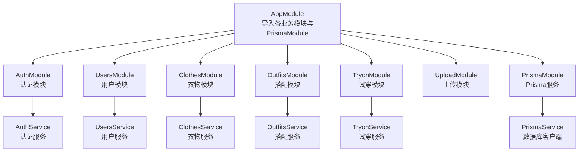
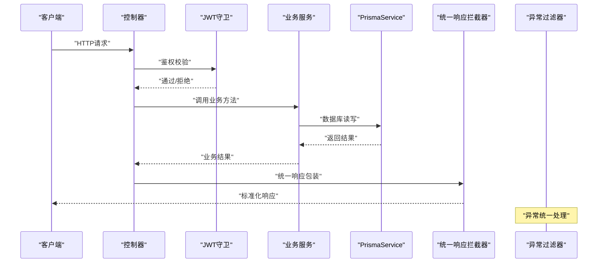
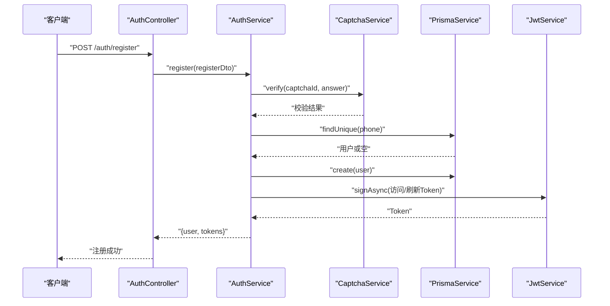
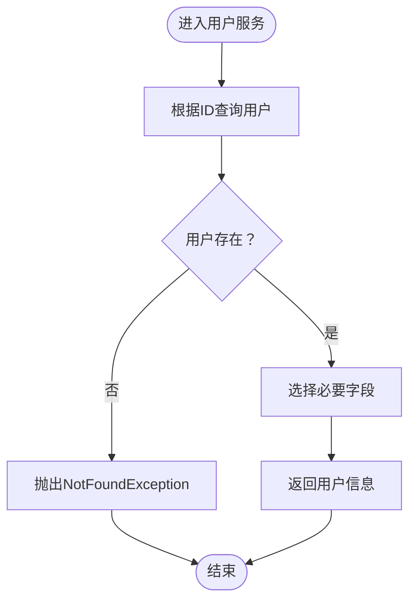
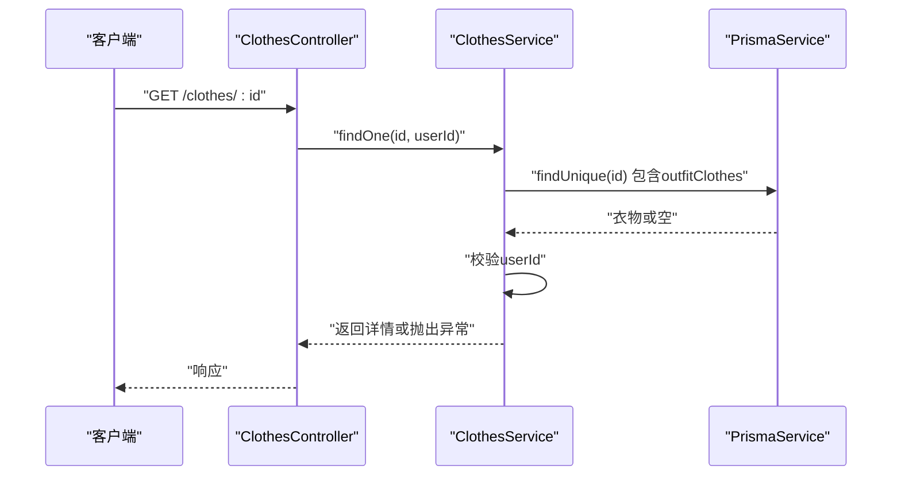
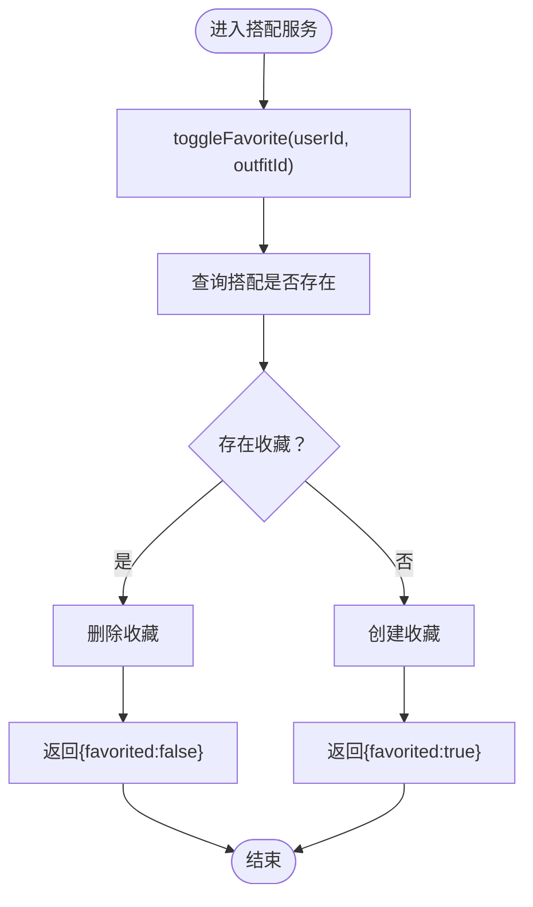
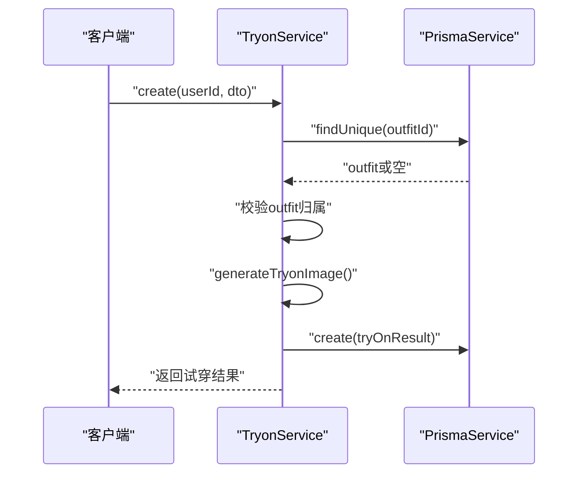
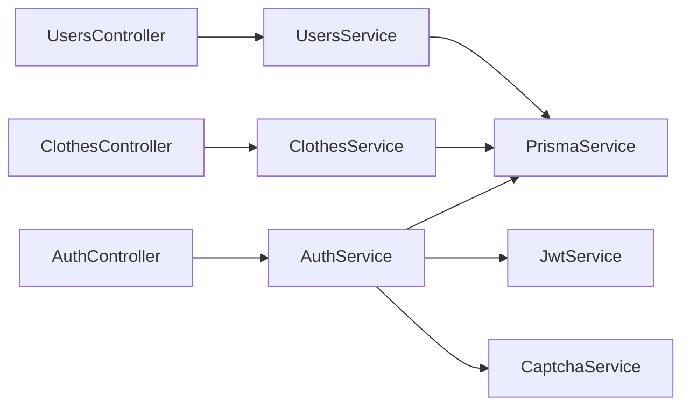

# 后端测试

<cite>
**本文引用的文件**
- [backend/package.json](file://backend/package.json)
- [backend/src/main.ts](file://backend/src/main.ts)
- [backend/src/app.module.ts](file://backend/src/app.module.ts)
- [backend/src/modules/auth/auth.controller.ts](file://backend/src/modules/auth/auth.controller.ts)
- [backend/src/modules/auth/auth.service.ts](file://backend/src/modules/auth/auth.service.ts)
- [backend/src/modules/users/users.controller.ts](file://backend/src/modules/users/users.controller.ts)
- [backend/src/modules/users/users.service.ts](file://backend/src/modules/users/users.service.ts)
- [backend/src/modules/clothes/clothes.controller.ts](file://backend/src/modules/clothes/clothes.controller.ts)
- [backend/src/modules/clothes/clothes.service.ts](file://backend/src/modules/clothes/clothes.service.ts)
- [backend/src/modules/outfits/outfits.service.ts](file://backend/src/modules/outfits/outfits.service.ts)
- [backend/src/modules/tryon/tryon.service.ts](file://backend/src/modules/tryon/tryon.service.ts)
- [backend/src/prisma/prisma.service.ts](file://backend/src/prisma/prisma.service.ts)
- [backend/src/prisma/prisma.module.ts](file://backend/src/prisma/prisma.module.ts)
- [backend/src/common/guards/jwt-auth.guard.ts](file://backend/src/common/guards/jwt-auth.guard.ts)
- [backend/src/common/interceptors/transform.interceptor.ts](file://backend/src/common/interceptors/transform.interceptor.ts)
- [backend/src/common/filters/http-exception.filter.ts](file://backend/src/common/filters/http-exception.filter.ts)
- [backend/src/common/decorators/current-user.decorator.ts](file://backend/src/common/decorators/current-user.decorator.ts)
</cite>

## 目录
1. [简介](#简介)
2. [项目结构](#项目结构)
3. [核心组件](#核心组件)
4. [架构总览](#架构总览)
5. [详细组件分析](#详细组件分析)
6. [依赖关系分析](#依赖关系分析)
7. [性能考量](#性能考量)
8. [故障排查指南](#故障排查指南)
9. [结论](#结论)
10. [附录](#附录)

## 简介
本测试文档面向畅搭(FreeDress)后端(NestJS)项目，系统性阐述测试策略与最佳实践，覆盖服务层测试、控制器测试与集成测试；重点说明认证服务、用户服务、衣物服务、搭配服务与试穿服务的测试方法；介绍数据库集成测试的配置与实现，以及Prisma ORM在测试中的支持方式；提供测试数据准备、模拟对象创建与测试隔离的实践建议，并给出异步操作、错误处理与业务逻辑的测试示例路径与流程图。

## 项目结构
后端采用NestJS标准分层与模块化组织：主模块导入认证、用户、衣物、搭配、试穿、上传与数据库模块；全局配置了验证管道、统一响应拦截器、异常过滤器、CORS与Swagger文档；Prisma作为ORM，通过PrismaModule注入PrismaService供各业务服务使用。

图表来源
- [backend/src/app.module.ts:13-31](file://backend/src/app.module.ts#L13-L31)
- [backend/src/prisma/prisma.module.ts](file://backend/src/prisma/prisma.module.ts)
- [backend/src/prisma/prisma.service.ts](file://backend/src/prisma/prisma.service.ts)

章节来源
- [backend/src/app.module.ts:13-31](file://backend/src/app.module.ts#L13-L31)
- [backend/src/main.ts:12-59](file://backend/src/main.ts#L12-L59)

## 核心组件
- 认证服务(AuthService)：负责注册、登录、刷新Token、忘记密码与重置密码、用户校验；依赖PrismaService与JwtService，集成图片验证码服务。
- 用户服务(UsersService)：提供用户查询、资料更新、统计数据聚合。
- 衣物服务(ClothesService)：提供衣物增删改查、分类统计、权限校验。
- 搭配服务(OutfitsService)：提供搭配创建、查询、收藏切换、收藏列表。
- 试穿服务(TryonService)：基于搭配生成试穿结果，Mock AI生成。
- 数据库服务(PrismaService)：由PrismaModule提供，贯穿所有业务服务。
- 安全与通用：JWT守卫、统一响应拦截器、异常过滤器、当前用户装饰器。

章节来源
- [backend/src/modules/auth/auth.service.ts:24-279](file://backend/src/modules/auth/auth.service.ts#L24-L279)
- [backend/src/modules/users/users.service.ts:10-102](file://backend/src/modules/users/users.service.ts#L10-L102)
- [backend/src/modules/clothes/clothes.service.ts:12-148](file://backend/src/modules/clothes/clothes.service.ts#L12-L148)
- [backend/src/modules/outfits/outfits.service.ts:6-123](file://backend/src/modules/outfits/outfits.service.ts#L6-L123)
- [backend/src/modules/tryon/tryon.service.ts:6-88](file://backend/src/modules/tryon/tryon.service.ts#L6-L88)
- [backend/src/prisma/prisma.service.ts](file://backend/src/prisma/prisma.service.ts)
- [backend/src/common/guards/jwt-auth.guard.ts](file://backend/src/common/guards/jwt-auth.guard.ts)
- [backend/src/common/interceptors/transform.interceptor.ts](file://backend/src/common/interceptors/transform.interceptor.ts)
- [backend/src/common/filters/http-exception.filter.ts](file://backend/src/common/filters/http-exception.filter.ts)
- [backend/src/common/decorators/current-user.decorator.ts](file://backend/src/common/decorators/current-user.decorator.ts)

## 架构总览
下图展示了从HTTP请求到业务处理再到数据库访问的整体流程，以及安全与统一响应/异常处理的横切关注点。

图表来源
- [backend/src/common/guards/jwt-auth.guard.ts](file://backend/src/common/guards/jwt-auth.guard.ts)
- [backend/src/common/interceptors/transform.interceptor.ts](file://backend/src/common/interceptors/transform.interceptor.ts)
- [backend/src/common/filters/http-exception.filter.ts](file://backend/src/common/filters/http-exception.filter.ts)
- [backend/src/prisma/prisma.service.ts](file://backend/src/prisma/prisma.service.ts)

## 详细组件分析

### 认证服务测试策略
- 测试目标
  - 注册：验证码校验、手机号唯一性、密码加密、Token生成。
  - 登录：用户存在性、密码校验、Token生成。
  - 刷新Token：合法用户与参数生成新Token。
  - 忘记密码：验证码校验、用户存在性、令牌生成与过期清理。
  - 重置密码：令牌有效性、过期判断、密码更新、令牌清理。
  - 用户校验：JWT策略中对用户存在性与状态的校验。
- 关键测试要点
  - 使用PrismaService的Mock或内存数据库进行隔离测试。
  - 使用JwtService的Mock以避免真实签名开销与密钥依赖。
  - 使用CaptchaService的Mock返回固定答案，确保可重复性。
  - 验证异常抛出与HTTP状态码一致性。
  - 并发场景下的令牌清理定时任务正确性。
- 示例路径
  - [backend/src/modules/auth/auth.service.ts:44-95](file://backend/src/modules/auth/auth.service.ts#L44-L95)
  - [backend/src/modules/auth/auth.service.ts:102-135](file://backend/src/modules/auth/auth.service.ts#L102-L135)
  - [backend/src/modules/auth/auth.service.ts:143-171](file://backend/src/modules/auth/auth.service.ts#L143-L171)
  - [backend/src/modules/auth/auth.service.ts:180-207](file://backend/src/modules/auth/auth.service.ts#L180-L207)
  - [backend/src/modules/auth/auth.service.ts:214-242](file://backend/src/modules/auth/auth.service.ts#L214-L242)
  - [backend/src/modules/auth/auth.service.ts:260-277](file://backend/src/modules/auth/auth.service.ts#L260-L277)

图表来源
- [backend/src/modules/auth/auth.controller.ts:37-41](file://backend/src/modules/auth/auth.controller.ts#L37-L41)
- [backend/src/modules/auth/auth.service.ts:44-95](file://backend/src/modules/auth/auth.service.ts#L44-L95)

章节来源
- [backend/src/modules/auth/auth.controller.ts:16-92](file://backend/src/modules/auth/auth.controller.ts#L16-L92)
- [backend/src/modules/auth/auth.service.ts:24-279](file://backend/src/modules/auth/auth.service.ts#L24-L279)

### 用户服务测试策略
- 测试目标
  - 查询用户：用户存在性与字段选择。
  - 更新资料：字段更新与返回值校验。
  - 统计数据：聚合统计字段的正确性。
- 关键测试要点
  - 使用PrismaService的Mock返回预设数据，验证字段映射与聚合逻辑。
  - 异常场景：用户不存在时抛出NotFoundException。
- 示例路径
  - [backend/src/modules/users/users.service.ts:18-44](file://backend/src/modules/users/users.service.ts#L18-L44)
  - [backend/src/modules/users/users.service.ts:52-68](file://backend/src/modules/users/users.service.ts#L52-L68)
  - [backend/src/modules/users/users.service.ts:75-100](file://backend/src/modules/users/users.service.ts#L75-L100)

图表来源
- [backend/src/modules/users/users.service.ts:18-44](file://backend/src/modules/users/users.service.ts#L18-L44)

章节来源
- [backend/src/modules/users/users.controller.ts:12-49](file://backend/src/modules/users/users.controller.ts#L12-L49)
- [backend/src/modules/users/users.service.ts:10-102](file://backend/src/modules/users/users.service.ts#L10-L102)

### 衣物服务测试策略
- 测试目标
  - 创建衣物：写入用户ID与衣物信息。
  - 查询列表：按用户与分类筛选、排序。
  - 查询详情：权限校验与关联加载。
  - 更新与删除：权限校验前置、删除成功返回消息。
  - 分类统计：按分类聚合数量并格式化输出。
- 关键测试要点
  - 权限校验：非本人衣物访问应抛出ForbiddenException。
  - 异常场景：衣物不存在时抛出NotFoundException。
  - 统计聚合：确保groupBy与_count正确映射。
- 示例路径
  - [backend/src/modules/clothes/clothes.service.ts:21-30](file://backend/src/modules/clothes/clothes.service.ts#L21-L30)
  - [backend/src/modules/clothes/clothes.service.ts:38-51](file://backend/src/modules/clothes/clothes.service.ts#L38-L51)
  - [backend/src/modules/clothes/clothes.service.ts:59-81](file://backend/src/modules/clothes/clothes.service.ts#L59-L81)
  - [backend/src/modules/clothes/clothes.service.ts:90-100](file://backend/src/modules/clothes/clothes.service.ts#L90-L100)
  - [backend/src/modules/clothes/clothes.service.ts:107-116](file://backend/src/modules/clothes/clothes.service.ts#L107-L116)
  - [backend/src/modules/clothes/clothes.service.ts:123-146](file://backend/src/modules/clothes/clothes.service.ts#L123-L146)

图表来源
- [backend/src/modules/clothes/clothes.controller.ts:59-66](file://backend/src/modules/clothes/clothes.controller.ts#L59-L66)
- [backend/src/modules/clothes/clothes.service.ts:59-81](file://backend/src/modules/clothes/clothes.service.ts#L59-L81)

章节来源
- [backend/src/modules/clothes/clothes.controller.ts:24-102](file://backend/src/modules/clothes/clothes.controller.ts#L24-L102)
- [backend/src/modules/clothes/clothes.service.ts:12-148](file://backend/src/modules/clothes/clothes.service.ts#L12-L148)

### 搭配服务测试策略
- 测试目标
  - 创建搭配：写入样式、场合、AI描述、封面图、衣物顺序。
  - 查询列表与详情：包含衣物明细与收藏状态。
  - 收藏切换：存在则取消，不存在则新增。
  - 收藏列表：按时间倒序返回。
- 关键测试要点
  - 关联插入：outfitClothes的order顺序与去重约束。
  - 权限校验：非本人访问抛出ForbiddenException。
  - 收藏状态：favorites长度判断与字段屏蔽。
- 示例路径
  - [backend/src/modules/outfits/outfits.service.ts:9-33](file://backend/src/modules/outfits/outfits.service.ts#L9-L33)
  - [backend/src/modules/outfits/outfits.service.ts:35-47](file://backend/src/modules/outfits/outfits.service.ts#L35-L47)
  - [backend/src/modules/outfits/outfits.service.ts:49-73](file://backend/src/modules/outfits/outfits.service.ts#L49-L73)
  - [backend/src/modules/outfits/outfits.service.ts:81-102](file://backend/src/modules/outfits/outfits.service.ts#L81-L102)
  - [backend/src/modules/outfits/outfits.service.ts:104-121](file://backend/src/modules/outfits/outfits.service.ts#L104-L121)

图表来源
- [backend/src/modules/outfits/outfits.service.ts:81-102](file://backend/src/modules/outfits/outfits.service.ts#L81-L102)

章节来源
- [backend/src/modules/outfits/outfits.service.ts:6-123](file://backend/src/modules/outfits/outfits.service.ts#L6-L123)

### 试穿服务测试策略
- 测试目标
  - 创建试穿：校验搭配归属、Mock AI生成结果、写入试穿记录。
  - 查询列表与详情：包含搭配与衣物明细、权限校验。
- 关键测试要点
  - Mock AI：验证占位返回与延迟行为，后续替换为真实AI服务。
  - 权限校验：非本人使用搭配抛出ForbiddenException。
- 示例路径
  - [backend/src/modules/tryon/tryon.service.ts:9-33](file://backend/src/modules/tryon/tryon.service.ts#L9-L33)
  - [backend/src/modules/tryon/tryon.service.ts:35-50](file://backend/src/modules/tryon/tryon.service.ts#L35-L50)
  - [backend/src/modules/tryon/tryon.service.ts:52-75](file://backend/src/modules/tryon/tryon.service.ts#L52-L75)
  - [backend/src/modules/tryon/tryon.service.ts:81-86](file://backend/src/modules/tryon/tryon.service.ts#L81-L86)

图表来源
- [backend/src/modules/tryon/tryon.service.ts:9-33](file://backend/src/modules/tryon/tryon.service.ts#L9-L33)
- [backend/src/modules/tryon/tryon.service.ts:81-86](file://backend/src/modules/tryon/tryon.service.ts#L81-L86)

章节来源
- [backend/src/modules/tryon/tryon.service.ts:6-88](file://backend/src/modules/tryon/tryon.service.ts#L6-L88)

## 依赖关系分析
- 控制器依赖服务：控制器仅依赖对应服务，便于单元测试时对服务进行Mock。
- 服务依赖PrismaService：所有业务逻辑通过PrismaService访问数据库，测试时可替换为内存数据库或Mock。
- 安全与横切：JWT守卫、统一响应拦截器、异常过滤器在请求生命周期中统一生效，测试时需考虑其对响应与异常的影响。
- 模块导入：AppModule集中导入各业务模块与PrismaModule，测试时可按需导入子模块以实现最小化测试集。

图表来源
- [backend/src/modules/auth/auth.controller.ts:16-92](file://backend/src/modules/auth/auth.controller.ts#L16-L92)
- [backend/src/modules/auth/auth.service.ts:30-37](file://backend/src/modules/auth/auth.service.ts#L30-L37)
- [backend/src/modules/users/users.controller.ts:12-49](file://backend/src/modules/users/users.controller.ts#L12-L49)
- [backend/src/modules/users/users.service.ts:11](file://backend/src/modules/users/users.service.ts#L11)
- [backend/src/modules/clothes/clothes.controller.ts:24-102](file://backend/src/modules/clothes/clothes.controller.ts#L24-L102)
- [backend/src/modules/clothes/clothes.service.ts:13](file://backend/src/modules/clothes/clothes.service.ts#L13)

章节来源
- [backend/src/app.module.ts:13-31](file://backend/src/app.module.ts#L13-L31)
- [backend/src/common/guards/jwt-auth.guard.ts](file://backend/src/common/guards/jwt-auth.guard.ts)
- [backend/src/common/interceptors/transform.interceptor.ts](file://backend/src/common/interceptors/transform.interceptor.ts)
- [backend/src/common/filters/http-exception.filter.ts](file://backend/src/common/filters/http-exception.filter.ts)

## 性能考量
- 异步与并发
  - AuthService中的令牌清理定时任务需在测试中通过Mock时间推进或直接调用清理方法验证。
  - 令牌生成使用Promise.all并行签名，测试时可通过Mock JwtService控制耗时。
- 数据库性能
  - 使用事务与批量插入优化创建搭配(outfitClothes)的性能。
  - 在测试中使用内存数据库或容器化数据库以减少I/O开销。
- 响应与异常
  - 统一拦截器与过滤器会增加少量CPU开销，但提升可维护性；测试时应覆盖其对响应结构与错误码的影响。

## 故障排查指南
- 常见异常与定位
  - 未授权/禁止访问：检查JWT守卫与权限校验逻辑，确认当前用户装饰器注入的userId。
  - 参数校验失败：检查DTO与ValidationPipe配置，确保白名单与转换选项符合预期。
  - 数据库异常：检查PrismaService的Mock或连接配置，确认事务与回滚行为。
- 排查步骤
  - 单元测试：针对服务方法编写最小化用例，逐步缩小问题范围。
  - 集成测试：使用内存数据库或测试专用数据库，复现真实场景。
  - 日志与断言：在关键分支添加断言，结合日志定位异常发生点。

章节来源
- [backend/src/common/filters/http-exception.filter.ts](file://backend/src/common/filters/http-exception.filter.ts)
- [backend/src/common/interceptors/transform.interceptor.ts](file://backend/src/common/interceptors/transform.interceptor.ts)
- [backend/src/common/guards/jwt-auth.guard.ts](file://backend/src/common/guards/jwt-auth.guard.ts)

## 结论
通过明确的测试分层与模块化设计，本项目可在服务层、控制器层与集成层构建完善的测试体系。结合Prisma的测试支持与Mock策略，能够高效验证认证、用户、衣物、搭配与试穿等核心业务逻辑，同时保证测试的稳定性与可维护性。建议持续完善测试覆盖率与自动化流水线，确保代码质量与交付效率。

## 附录

### 测试环境搭建与脚本
- 测试命令
  - 运行单次测试：使用测试脚本执行Jest。
  - 监听模式：持续运行测试并监听变更。
  - 覆盖率：生成覆盖率报告并输出至指定目录。
  - E2E测试：使用独立的E2E配置文件运行端到端测试。
- Jest配置要点
  - 模块扩展名、根目录、正则匹配、转换器、覆盖率收集与测试环境等均已在配置中声明。

章节来源
- [backend/package.json:8-25](file://backend/package.json#L8-L25)
- [backend/package.json:73-89](file://backend/package.json#L73-L89)

### 数据准备与隔离最佳实践
- 使用内存数据库或容器化数据库作为测试后端，确保每次测试前后的数据隔离。
- 在服务层使用Mock替换外部依赖（如JwtService、CaptchaService），降低耦合并提高可重复性。
- 使用Prisma事务包裹测试用例，必要时在测试结束后回滚，保持数据库状态一致。

### 测试覆盖率监控
- 使用Jest内置的覆盖率收集功能，结合CI流水线定期生成覆盖率报告，持续跟踪关键模块的覆盖情况。