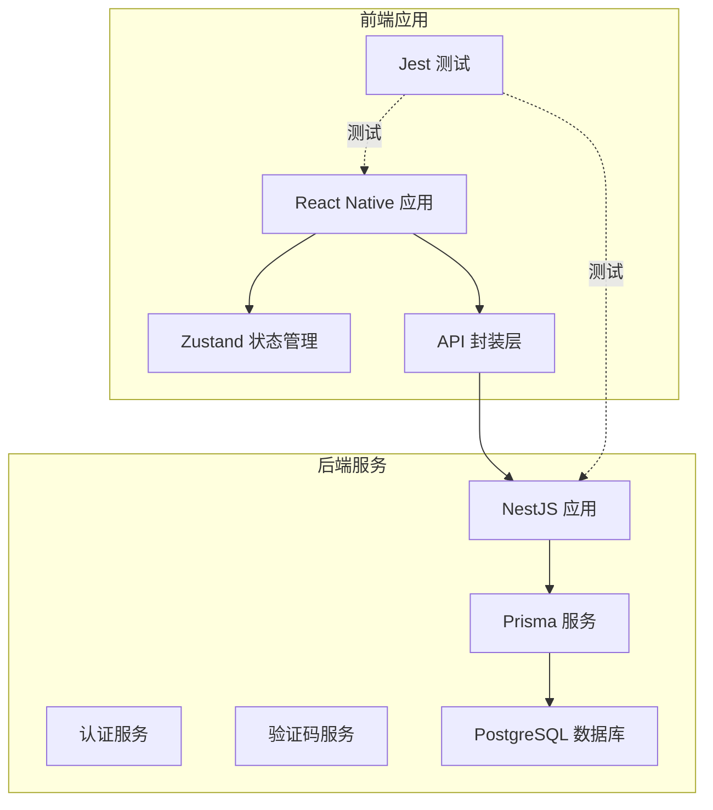
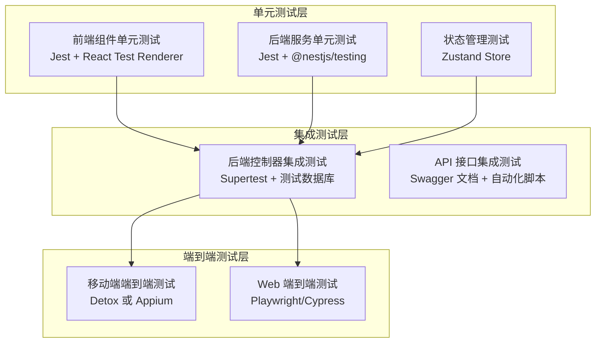
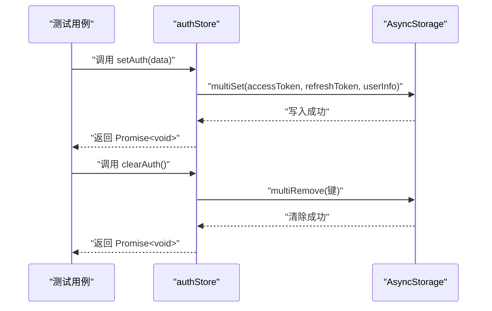
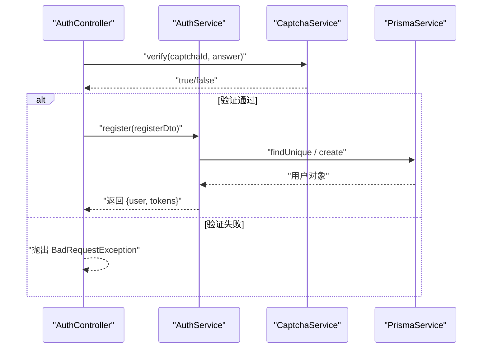
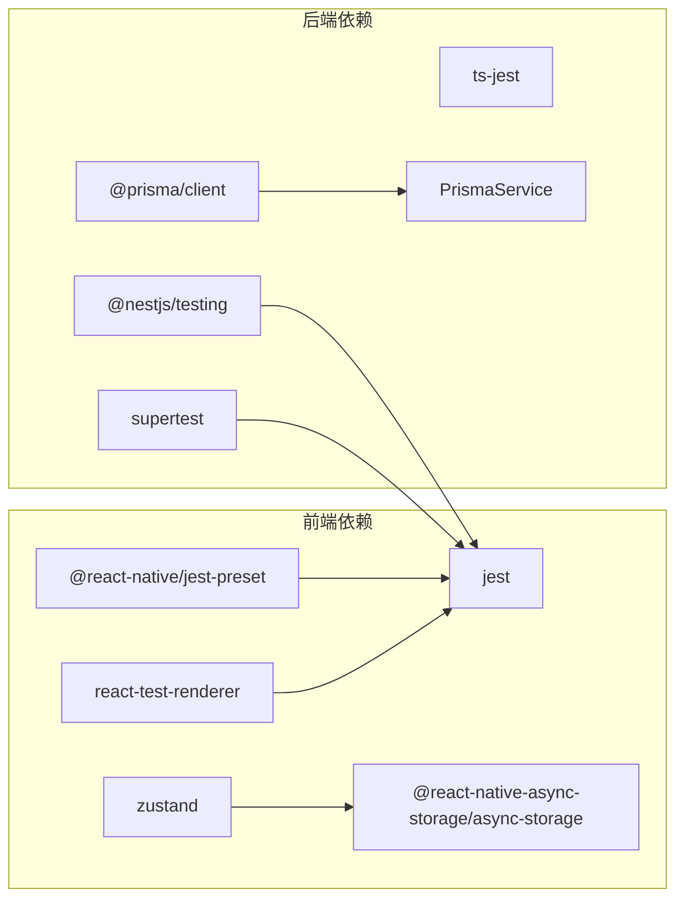

# 测试策略

<cite>
**本文引用的文件**
- [FreeDressApp/jest.config.js](file://FreeDressApp/jest.config.js)
- [FreeDressApp/package.json](file://FreeDressApp/package.json)
- [FreeDressApp/__tests__/App.test.tsx](file://FreeDressApp/__tests__/App.test.tsx)
- [FreeDressApp/src/store/authStore.ts](file://FreeDressApp/src/store/authStore.ts)
- [FreeDressApp/src/api/auth.ts](file://FreeDressApp/src/api/auth.ts)
- [backend/package.json](file://backend/package.json)
- [backend/src/app.module.ts](file://backend/src/app.module.ts)
- [backend/src/modules/auth/auth.service.ts](file://backend/src/modules/auth/auth.service.ts)
- [backend/src/modules/auth/auth.controller.ts](file://backend/src/modules/auth/auth.controller.ts)
- [backend/src/modules/auth/captcha.service.ts](file://backend/src/modules/auth/captcha.service.ts)
- [backend/src/prisma/prisma.service.ts](file://backend/src/prisma/prisma.service.ts)
- [backend/prisma/schema.prisma](file://backend/prisma/schema.prisma)
</cite>

## 目录
1. [引言](#引言)
2. [项目结构](#项目结构)
3. [核心组件](#核心组件)
4. [架构总览](#架构总览)
5. [详细组件分析](#详细组件分析)
6. [依赖分析](#依赖分析)
7. [性能考虑](#性能考虑)
8. [故障排查指南](#故障排查指南)
9. [结论](#结论)
10. [附录](#附录)

## 引言
本测试策略文档面向畅搭(FreeDress)项目，系统化阐述测试金字塔在前端与后端的落地实践，覆盖单元测试、集成测试与端到端测试；同时给出前端Jest配置与组件/状态管理测试方法、后端NestJS服务与控制器测试、数据库集成测试、API测试（含Swagger与自动化脚本）、测试数据准备与管理、持续集成中的测试自动化以及测试覆盖率监控与改进路径，帮助团队建立完善的质量保证流程。

## 项目结构
项目采用多模块结构：
- 前端应用：React Native + Zustand 状态管理，使用 Jest 进行单元测试。
- 后端服务：NestJS + Prisma ORM + PostgreSQL，使用 Jest 进行单元/集成测试，支持 e2e 测试脚本入口。
- 微信小程序：独立的前端实现，便于对比与复用部分测试思路。

图表来源
- [backend/src/app.module.ts:1-33](file://backend/src/app.module.ts#L1-L33)
- [backend/src/prisma/prisma.service.ts:1-27](file://backend/src/prisma/prisma.service.ts#L1-L27)
- [backend/prisma/schema.prisma:1-132](file://backend/prisma/schema.prisma#L1-L132)
- [FreeDressApp/src/api/auth.ts:1-101](file://FreeDressApp/src/api/auth.ts#L1-L101)
- [FreeDressApp/src/store/authStore.ts:1-123](file://FreeDressApp/src/store/authStore.ts#L1-L123)

章节来源
- [FreeDressApp/jest.config.js:1-4](file://FreeDressApp/jest.config.js#L1-L4)
- [FreeDressApp/package.json:1-57](file://FreeDressApp/package.json#L1-L57)
- [backend/package.json:1-91](file://backend/package.json#L1-L91)
- [backend/src/app.module.ts:1-33](file://backend/src/app.module.ts#L1-L33)

## 核心组件
- 前端测试基础
  - Jest 预设与脚本：前端工程已配置 Jest 预设与 test 脚本，可直接运行单元测试。
  - 示例测试：提供 App 渲染测试示例，展示 React Test Renderer 的基本用法。
- 后端测试基础
  - NestJS 工程：提供 test、test:watch、test:cov、test:e2e 等脚本，支持覆盖率与 e2e 测试。
  - Jest 配置：根目录 jest 配置项定义了模块扩展、测试正则、转换器、覆盖率收集范围与测试环境。
- 认证与验证码服务
  - 认证服务：处理注册、登录、刷新 Token、忘记密码、用户校验等业务逻辑。
  - 验证码服务：生成带干扰的 SVG 验证码，内置过期与限流控制。
- 数据层
  - Prisma 服务：封装数据库连接生命周期。
  - Prisma Schema：定义用户、衣物、搭配、收藏、AI试穿结果等模型与索引。

章节来源
- [FreeDressApp/jest.config.js:1-4](file://FreeDressApp/jest.config.js#L1-L4)
- [FreeDressApp/__tests__/App.test.tsx:1-14](file://FreeDressApp/__tests__/App.test.tsx#L1-L14)
- [backend/package.json:73-89](file://backend/package.json#L73-L89)
- [backend/src/modules/auth/auth.service.ts:1-279](file://backend/src/modules/auth/auth.service.ts#L1-L279)
- [backend/src/modules/auth/captcha.service.ts:1-259](file://backend/src/modules/auth/captcha.service.ts#L1-L259)
- [backend/src/prisma/prisma.service.ts:1-27](file://backend/src/prisma/prisma.service.ts#L1-L27)
- [backend/prisma/schema.prisma:1-132](file://backend/prisma/schema.prisma#L1-L132)

## 架构总览
下图展示了测试金字塔在畅搭项目中的分层与交互：

## 详细组件分析

### 前端测试策略（Jest + React Native）
- 测试框架与配置
  - 使用 @react-native/jest-preset，简化 React Native 测试环境配置。
  - package.json 提供 test 脚本，便于一键执行。
- 组件测试
  - 使用 React Test Renderer 渲染组件树，验证渲染正确性与交互行为。
  - 建议针对关键屏幕与可复用组件编写快照测试与交互测试。
- 状态管理测试（Zustand）
  - 针对 authStore 的 setAuth、clearAuth、updateUser、loadAuthFromStorage 等方法进行纯函数式测试。
  - 使用内存存根模拟 AsyncStorage，隔离外部依赖，提升测试稳定性与速度。
- API 层测试
  - 对 api/auth.ts 中的接口封装进行单元测试，模拟 axios 返回值，验证参数传递与响应处理。
- 覆盖率与调试
  - 结合 Jest 覆盖率输出，识别未覆盖的分支与路径，补充针对性测试。

图表来源
- [FreeDressApp/src/store/authStore.ts:39-78](file://FreeDressApp/src/store/authStore.ts#L39-L78)

章节来源
- [FreeDressApp/jest.config.js:1-4](file://FreeDressApp/jest.config.js#L1-L4)
- [FreeDressApp/package.json:5-11](file://FreeDressApp/package.json#L5-L11)
- [FreeDressApp/__tests__/App.test.tsx:1-14](file://FreeDressApp/__tests__/App.test.tsx#L1-L14)
- [FreeDressApp/src/store/authStore.ts:1-123](file://FreeDressApp/src/store/authStore.ts#L1-L123)
- [FreeDressApp/src/api/auth.ts:1-101](file://FreeDressApp/src/api/auth.ts#L1-L101)

### 后端测试策略（NestJS + Prisma）
- 单元测试
  - 使用 @nestjs/testing 构建测试模块，注入 PrismaService、JwtService、CaptchaService 等依赖。
  - 针对 AuthService 的 register、login、forgotPassword、resetPassword、validateUser 等方法编写用例。
  - 针对 CaptchaService 的 generate、verify、rate limit 等逻辑进行边界与异常场景测试。
- 控制器测试
  - 使用 Supertest 发起 HTTP 请求，验证 AuthController 的路由行为与响应状态。
  - 覆盖验证码获取、注册、登录、忘记密码、刷新 Token、获取用户信息等接口。
- 集成测试
  - 使用 PrismaClient 在测试前/后置钩子中准备与清理测试数据。
  - 通过 PrismaService 的连接生命周期确保数据库可用性。
- e2e 测试
  - 使用 NestJS 提供的 test:e2e 脚本入口，结合测试配置文件组织端到端测试。

图表来源
- [backend/src/modules/auth/auth.controller.ts:37-41](file://backend/src/modules/auth/auth.controller.ts#L37-L41)
- [backend/src/modules/auth/auth.service.ts:44-95](file://backend/src/modules/auth/auth.service.ts#L44-L95)
- [backend/src/modules/auth/captcha.service.ts:87-122](file://backend/src/modules/auth/captcha.service.ts#L87-L122)

章节来源
- [backend/package.json:16-24](file://backend/package.json#L16-L24)
- [backend/src/modules/auth/auth.service.ts:1-279](file://backend/src/modules/auth/auth.service.ts#L1-L279)
- [backend/src/modules/auth/auth.controller.ts:1-92](file://backend/src/modules/auth/auth.controller.ts#L1-L92)
- [backend/src/modules/auth/captcha.service.ts:1-259](file://backend/src/modules/auth/captcha.service.ts#L1-L259)
- [backend/src/prisma/prisma.service.ts:1-27](file://backend/src/prisma/prisma.service.ts#L1-L27)

### API 测试策略（Swagger + 自动化脚本）
- Swagger 文档测试
  - 通过 Swagger UI 验证接口签名、参数类型、鉴权方式与响应示例。
  - 结合认证流程（登录、刷新 Token）验证受保护接口的访问控制。
- 自动化 API 测试
  - 基于 Supertest 编写控制器层面的自动化测试脚本，覆盖正常与异常路径。
  - 可扩展至 OpenAPI/Swagger 规范驱动的契约测试，确保前后端一致性。

章节来源
- [backend/src/modules/auth/auth.controller.ts:1-92](file://backend/src/modules/auth/auth.controller.ts#L1-L92)

### 测试数据准备与管理
- 前端
  - 使用内存存根模拟 AsyncStorage，避免真实持久化影响测试。
  - 对 API 层使用 Mock 数据或测试桩，隔离网络依赖。
- 后端
  - 使用 Prisma 在测试前插入最小化数据集，测试后清理，确保测试隔离与可重复性。
  - 对验证码与 Token 场景，使用可控时间戳与固定值以保证可预测性。

章节来源
- [FreeDressApp/src/store/authStore.ts:97-121](file://FreeDressApp/src/store/authStore.ts#L97-L121)
- [backend/src/prisma/prisma.service.ts:1-27](file://backend/src/prisma/prisma.service.ts#L1-L27)

### 持续集成中的测试自动化
- 前端
  - 在 CI 中执行 npm test，并可输出 Jest 报告与覆盖率。
- 后端
  - 在 CI 中执行 nest test、nest test:cov 与 nest test:e2e（如需），并上传覆盖率报告。
  - 建议在 CI 中预热数据库迁移与种子数据，确保集成测试稳定。

章节来源
- [FreeDressApp/package.json:5-11](file://FreeDressApp/package.json#L5-L11)
- [backend/package.json:16-24](file://backend/package.json#L16-L24)

### 测试覆盖率监控与改进
- 覆盖率指标
  - 关注语句、分支、函数与行覆盖率，优先补齐低覆盖率区域。
- 改进策略
  - 针对未覆盖的分支（如异常路径、边界条件）补充用例。
  - 对复杂流程（如验证码生成/验证、Token 刷新）拆分为更小的可测单元。
  - 使用快照测试与交互测试平衡覆盖率与维护成本。

章节来源
- [backend/package.json:84-88](file://backend/package.json#L84-L88)

## 依赖分析
- 前端
  - 依赖 @react-native/jest-preset、jest、react-test-renderer 等进行测试。
  - 状态管理依赖 zustand 与 @react-native-async-storage/async-storage。
- 后端
  - 依赖 @nestjs/testing、jest、supertest、ts-jest 等进行测试。
  - 数据层依赖 @prisma/client 与 PrismaService。

图表来源
- [FreeDressApp/package.json:32-51](file://FreeDressApp/package.json#L32-L51)
- [backend/package.json:46-72](file://backend/package.json#L46-L72)

章节来源
- [FreeDressApp/package.json:32-51](file://FreeDressApp/package.json#L32-L51)
- [backend/package.json:46-72](file://backend/package.json#L46-L72)

## 性能考虑
- 测试执行性能
  - 使用 Jest 并行测试与缓存机制，缩短执行时间。
  - 将慢依赖（如数据库）替换为内存存根或轻量级测试数据库。
- 覆盖率收集性能
  - 在 CI 中按需开启覆盖率，避免在本地开发时过度消耗资源。

## 故障排查指南
- 前端
  - 若测试无法启动，检查 jest.config.js 与 package.json 中的脚本与依赖版本。
  - 若组件渲染异常，确认 React Test Renderer 的使用方式与异步更新处理。
- 后端
  - 若数据库连接失败，检查 PrismaService 生命周期钩子与环境变量。
  - 若验证码/Token 相关测试不稳定，检查时间相关逻辑与定时清理任务。
- API 测试
  - 若接口返回不符合预期，核对 Swagger 文档与控制器实现，必要时增加日志定位。

章节来源
- [FreeDressApp/jest.config.js:1-4](file://FreeDressApp/jest.config.js#L1-L4)
- [backend/src/prisma/prisma.service.ts:14-25](file://backend/src/prisma/prisma.service.ts#L14-L25)
- [backend/src/modules/auth/captcha.service.ts:241-257](file://backend/src/modules/auth/captcha.service.ts#L241-L257)

## 结论
通过在前端采用 Jest + React Native 测试栈，在后端采用 NestJS + Prisma 的测试体系，并结合 Swagger 与自动化脚本，畅搭项目可以构建从单元到端到端的完整测试金字塔。配合规范的测试数据管理与持续集成流程，能够有效保障代码质量与交付效率。

## 附录
- 测试金字塔实施清单
  - 前端：组件快照与交互测试、状态管理纯函数测试、API 层 Mock 测试。
  - 后端：服务单元测试、控制器集成测试、数据库集成测试、e2e 测试。
  - API：Swagger 文档校验、契约测试、自动化脚本。
  - 数据：最小化测试数据集、Mock 与存根策略。
  - CI：测试脚本、覆盖率上报、报告归档。