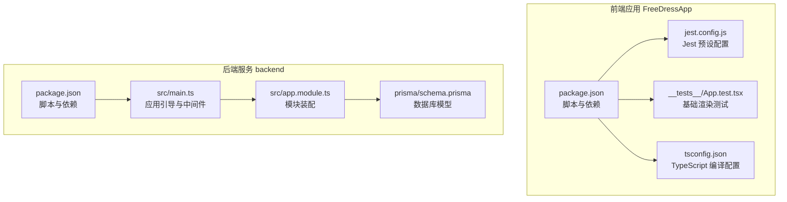
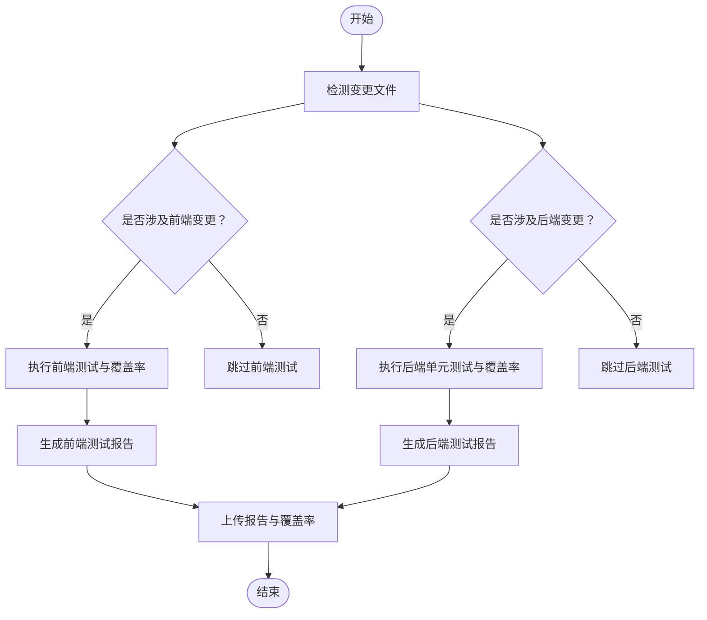
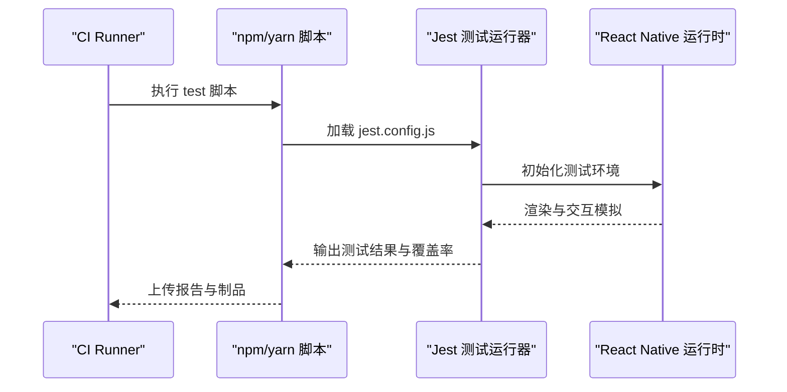
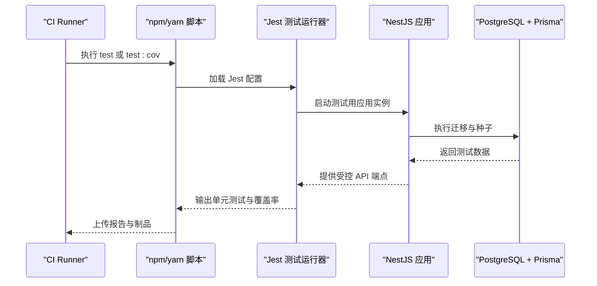
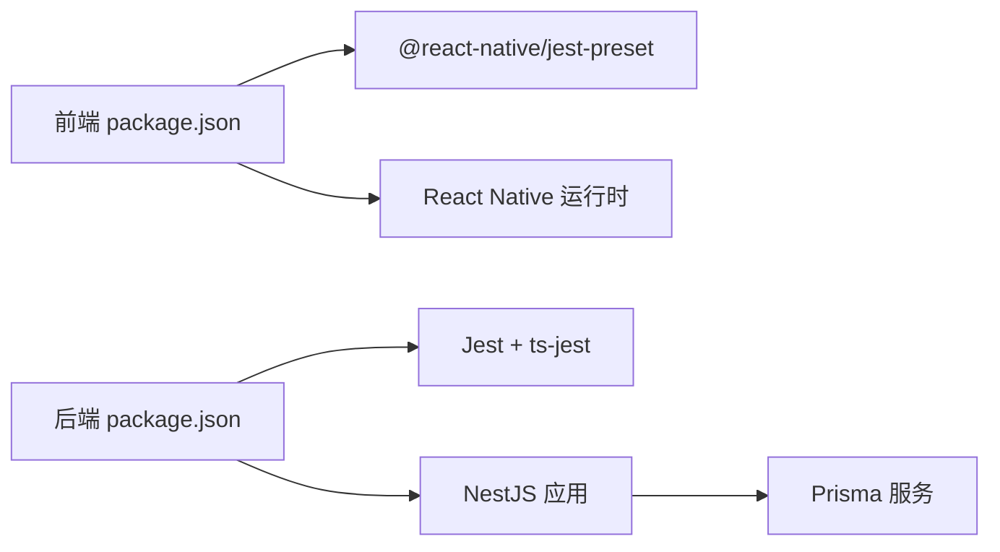

# 测试自动化

<cite>
**本文引用的文件**
- [FreeDressApp/package.json](file://FreeDressApp/package.json)
- [FreeDressApp/jest.config.js](file://FreeDressApp/jest.config.js)
- [FreeDressApp/__tests__/App.test.tsx](file://FreeDressApp/__tests__/App.test.tsx)
- [FreeDressApp/tsconfig.json](file://FreeDressApp/tsconfig.json)
- [backend/package.json](file://backend/package.json)
- [backend/src/app.module.ts](file://backend/src/app.module.ts)
- [backend/src/main.ts](file://backend/src/main.ts)
- [backend/prisma/schema.prisma](file://backend/prisma/schema.prisma)
</cite>

## 目录
1. [简介](#简介)
2. [项目结构](#项目结构)
3. [核心组件](#核心组件)
4. [架构总览](#架构总览)
5. [详细组件分析](#详细组件分析)
6. [依赖分析](#依赖分析)
7. [性能考虑](#性能考虑)
8. [故障排查指南](#故障排查指南)
9. [结论](#结论)
10. [附录](#附录)

## 简介
本指南面向畅搭(FreeDress)项目，提供一套完整的测试自动化实施方法，覆盖前端与后端的单元测试、集成测试与端到端测试在CI/CD中的落地策略；同时给出测试覆盖率的自动化监控与报告生成、测试环境与测试数据的自动化准备、测试失败告警与结果可视化建议，并配套可直接参考的配置文件路径与脚本编写要点，帮助团队快速建立高效稳定的测试自动化流程。

## 项目结构
- 前端应用位于 FreeDressApp，采用 React Native + TypeScript，使用 Jest 作为测试框架，当前存在基础的渲染测试用例。
- 后端服务位于 backend，基于 NestJS + Prisma，提供 REST API 与数据库访问能力，内置 Jest 单元测试与覆盖率配置，但缺少端到端测试配置文件。

**图表来源**
- [FreeDressApp/package.json:1-57](file://FreeDressApp/package.json#L1-L57)
- [FreeDressApp/jest.config.js:1-4](file://FreeDressApp/jest.config.js#L1-L4)
- [FreeDressApp/__tests__/App.test.tsx:1-14](file://FreeDressApp/__tests__/App.test.tsx#L1-L14)
- [FreeDressApp/tsconfig.json:1-9](file://FreeDressApp/tsconfig.json#L1-L9)
- [backend/package.json:1-91](file://backend/package.json#L1-L91)
- [backend/src/main.ts:1-62](file://backend/src/main.ts#L1-L62)
- [backend/src/app.module.ts:1-33](file://backend/src/app.module.ts#L1-L33)
- [backend/prisma/schema.prisma:1-132](file://backend/prisma/schema.prisma#L1-L132)

**章节来源**
- [FreeDressApp/package.json:1-57](file://FreeDressApp/package.json#L1-L57)
- [backend/package.json:1-91](file://backend/package.json#L1-L91)

## 核心组件
- 前端测试栈：Jest + @react-native/jest-preset，当前仅存在一个基础渲染测试用例，建议扩展至组件级与业务逻辑测试。
- 后端测试栈：Jest + ts-jest，支持 TypeScript，具备覆盖率收集与输出目录配置，建议补充 E2E 测试配置与数据库隔离策略。
- 数据层：Prisma Schema 定义了用户、衣物、搭配、收藏、AI试穿结果等模型，需在测试环境中进行迁移与种子数据准备。

**章节来源**
- [FreeDressApp/jest.config.js:1-4](file://FreeDressApp/jest.config.js#L1-L4)
- [FreeDressApp/__tests__/App.test.tsx:1-14](file://FreeDressApp/__tests__/App.test.tsx#L1-L14)
- [backend/package.json:73-89](file://backend/package.json#L73-L89)
- [backend/prisma/schema.prisma:1-132](file://backend/prisma/schema.prisma#L1-L132)

## 架构总览
下图展示了测试自动化在 CI 中的总体流程：前端与后端分别执行单元测试与覆盖率统计，后端可选执行 E2E 测试；所有产物通过 CI 平台进行归档与可视化展示。

[此图为概念性流程示意，不直接映射具体源码文件，故无“图表来源”标注]

## 详细组件分析

### 前端测试组件分析
- 测试框架与预设：使用 @react-native/jest-preset，简化 RN 环境下的测试配置。
- 当前测试：存在基础渲染测试，建议增加组件快照测试、异步行为测试与导航场景测试。
- 覆盖率：当前未启用覆盖率收集，可在 CI 中通过 Jest 的覆盖率选项开启并生成报告。

**图表来源**
- [FreeDressApp/package.json:5-11](file://FreeDressApp/package.json#L5-L11)
- [FreeDressApp/jest.config.js:1-4](file://FreeDressApp/jest.config.js#L1-L4)

**章节来源**
- [FreeDressApp/package.json:5-11](file://FreeDressApp/package.json#L5-L11)
- [FreeDressApp/jest.config.js:1-4](file://FreeDressApp/jest.config.js#L1-L4)
- [FreeDressApp/__tests__/App.test.tsx:1-14](file://FreeDressApp/__tests__/App.test.tsx#L1-L14)

### 后端测试组件分析
- 测试脚本：提供 test、test:watch、test:cov、test:e2e 等脚本，便于本地与 CI 使用。
- 配置：Jest 针对 TypeScript 的转换规则、根目录、覆盖率输出目录等已配置。
- E2E 测试：当前缺少 test:jest-e2e.json 配置文件，需要补充以支持端到端测试。
- 数据库：Prisma 模型定义完整，需在测试前进行迁移与种子数据准备。

**图表来源**
- [backend/package.json:8-25](file://backend/package.json#L8-L25)
- [backend/package.json:73-89](file://backend/package.json#L73-L89)
- [backend/src/main.ts:12-62](file://backend/src/main.ts#L12-L62)
- [backend/src/app.module.ts:13-33](file://backend/src/app.module.ts#L13-L33)
- [backend/prisma/schema.prisma:1-132](file://backend/prisma/schema.prisma#L1-L132)

**章节来源**
- [backend/package.json:8-25](file://backend/package.json#L8-L25)
- [backend/package.json:73-89](file://backend/package.json#L73-L89)
- [backend/src/main.ts:12-62](file://backend/src/main.ts#L12-L62)
- [backend/src/app.module.ts:13-33](file://backend/src/app.module.ts#L13-L33)
- [backend/prisma/schema.prisma:1-132](file://backend/prisma/schema.prisma#L1-L132)

### 测试覆盖率与报告
- 前端：可通过 Jest 的覆盖率选项在 CI 中启用并生成报告，建议将报告上传至 CI 平台的制品库或第三方覆盖率平台。
- 后端：已配置覆盖率收集目录，建议在 CI 中统一导出并生成 HTML 报告，便于审阅与对比。

**章节来源**
- [FreeDressApp/jest.config.js:1-4](file://FreeDressApp/jest.config.js#L1-L4)
- [backend/package.json:73-89](file://backend/package.json#L73-L89)

### 测试环境与数据准备
- 前端：建议在 CI 中使用缓存的 node_modules 与构建缓存，避免重复安装依赖。
- 后端：建议使用独立的测试数据库实例或容器化数据库，配合 Prisma CLI 在测试前执行迁移与种子数据注入，确保测试隔离与可重复性。

**章节来源**
- [backend/package.json:21-24](file://backend/package.json#L21-L24)
- [backend/prisma/schema.prisma:1-132](file://backend/prisma/schema.prisma#L1-L132)

### 测试失败告警与结果可视化
- 告警：可在 CI 中配置测试失败后的通知渠道（如邮件、IM 群组），并在制品中附带报告链接。
- 可视化：建议将测试报告与覆盖率以静态页面形式发布，或集成到 CI 平台的报告面板中，便于团队查看历史趋势。

[本节为通用实践建议，不直接分析具体文件，故无“章节来源”标注]

## 依赖分析
- 前端：Jest 与 @react-native/jest-preset 为测试核心；React Native 运行时负责渲染与交互模拟。
- 后端：Jest + ts-jest 负责 TS 单元测试；NestJS 提供应用引导、中间件与异常处理；Prisma 提供数据库访问与迁移能力。

**图表来源**
- [FreeDressApp/package.json:1-57](file://FreeDressApp/package.json#L1-L57)
- [backend/package.json:1-91](file://backend/package.json#L1-L91)

**章节来源**
- [FreeDressApp/package.json:1-57](file://FreeDressApp/package.json#L1-L57)
- [backend/package.json:1-91](file://backend/package.json#L1-L91)

## 性能考虑
- 测试并行：合理拆分测试文件，避免共享状态导致串行化；在 CI 中按模块并行执行不同语言的测试。
- 缓存策略：复用 node_modules 与构建缓存，减少安装与编译时间。
- 数据隔离：后端测试使用独立数据库实例或容器，避免锁竞争与数据污染。
- 报告优化：仅上传必要的报告文件，控制制品大小与传输时间。

[本节为通用指导，不直接分析具体文件，故无“章节来源”标注]

## 故障排查指南
- 前端测试失败
  - 检查 jest.config.js 是否正确加载预设。
  - 确认测试用例文件命名与路径符合 Jest 默认约定。
  - 若涉及异步渲染，确保使用 act 包裹与等待策略。
- 后端测试失败
  - 确认数据库连接字符串与环境变量在 CI 中可用。
  - 检查 Prisma 迁移与种子脚本是否能在测试前成功执行。
  - 如需 E2E 测试，补充 test:jest-e2e.json 并在 CI 中配置网络与端口。
- 覆盖率缺失
  - 确认 test:cov 脚本被调用且覆盖率目录可写。
  - 在 CI 中配置报告上传步骤，确保报告可见。

**章节来源**
- [FreeDressApp/jest.config.js:1-4](file://FreeDressApp/jest.config.js#L1-L4)
- [FreeDressApp/__tests__/App.test.tsx:1-14](file://FreeDressApp/__tests__/App.test.tsx#L1-L14)
- [backend/package.json:21-24](file://backend/package.json#L21-L24)
- [backend/package.json:18](file://backend/package.json#L18)

## 结论
通过在 CI 中统一执行前端与后端测试、启用覆盖率收集、准备隔离的测试环境与数据、配置失败告警与报告可视化，可以显著提升畅搭项目的质量保障效率与稳定性。建议优先补齐后端 E2E 配置与数据库隔离策略，再逐步扩展前端测试覆盖面，最终形成完善的测试自动化闭环。

[本节为总结性内容，不直接分析具体文件，故无“章节来源”标注]

## 附录

### CI/CD 流水线测试集成策略（GitHub Actions 示例思路）
- 触发条件：push 到主分支或发起 Pull Request。
- 步骤建议：
  - 前端：安装 Node 与依赖 → 运行前端测试 → 生成覆盖率报告 → 上传报告。
  - 后端：安装 Node 与依赖 → 启动 PostgreSQL 容器 → Prisma 迁移与种子 → 运行单元测试与覆盖率 → 可选：运行 E2E 测试 → 上传报告。
  - 告警：测试失败时发送通知；报告可发布到 CI 平台的制品库或静态站点。

[本节为通用实践建议，不直接分析具体文件，故无“章节来源”标注]

### 配置文件与脚本参考路径
- 前端
  - 测试脚本与依赖：[FreeDressApp/package.json:5-11](file://FreeDressApp/package.json#L5-L11)
  - Jest 预设配置：[FreeDressApp/jest.config.js:1-4](file://FreeDressApp/jest.config.js#L1-L4)
  - 基础测试用例：[FreeDressApp/__tests__/App.test.tsx:1-14](file://FreeDressApp/__tests__/App.test.tsx#L1-L14)
  - TypeScript 配置：[FreeDressApp/tsconfig.json:1-9](file://FreeDressApp/tsconfig.json#L1-L9)
- 后端
  - 测试脚本与依赖：[backend/package.json:8-25](file://backend/package.json#L8-L25)
  - Jest 配置（覆盖率与根目录）：[backend/package.json:73-89](file://backend/package.json#L73-L89)
  - 应用引导与中间件：[backend/src/main.ts:12-62](file://backend/src/main.ts#L12-L62)
  - 模块装配：[backend/src/app.module.ts:13-33](file://backend/src/app.module.ts#L13-L33)
  - 数据库模型：[backend/prisma/schema.prisma:1-132](file://backend/prisma/schema.prisma#L1-L132)

**章节来源**
- [FreeDressApp/package.json:5-11](file://FreeDressApp/package.json#L5-L11)
- [FreeDressApp/jest.config.js:1-4](file://FreeDressApp/jest.config.js#L1-L4)
- [FreeDressApp/__tests__/App.test.tsx:1-14](file://FreeDressApp/__tests__/App.test.tsx#L1-L14)
- [FreeDressApp/tsconfig.json:1-9](file://FreeDressApp/tsconfig.json#L1-L9)
- [backend/package.json:8-25](file://backend/package.json#L8-L25)
- [backend/package.json:73-89](file://backend/package.json#L73-L89)
- [backend/src/main.ts:12-62](file://backend/src/main.ts#L12-L62)
- [backend/src/app.module.ts:13-33](file://backend/src/app.module.ts#L13-L33)
- [backend/prisma/schema.prisma:1-132](file://backend/prisma/schema.prisma#L1-L132)