# AI试穿状态管理

<cite>
**本文档引用的文件**
- [tryOnStore.ts](file://FreeDressApp/src/store/tryOnStore.ts)
- [TryOnScreen.tsx](file://FreeDressApp/src/screens/TryOnScreen.tsx)
- [TryOnHistoryScreen.tsx](file://FreeDressApp/src/screens/TryOnHistoryScreen.tsx)
- [tryon.ts](file://FreeDressApp/src/api/tryon.ts)
- [upload.ts](file://FreeDressApp/src/api/upload.ts)
- [index.ts](file://FreeDressApp/src/types/index.ts)
- [outfitStore.ts](file://FreeDressApp/src/store/outfitStore.ts)
- [MainTabNavigator.tsx](file://FreeDressApp/src/navigation/MainTabNavigator.tsx)
- [tryon.service.ts](file://backend/src/modules/tryon/tryon.service.ts)
- [tryon.controller.ts](file://backend/src/modules/tryon/tryon.controller.ts)
- [create-tryon.dto.ts](file://backend/src/modules/tryon/dto/create-tryon.dto.ts)
- [upload.service.ts](file://backend/src/modules/upload/upload.service.ts)
- [schema.prisma](file://backend/prisma/schema.prisma)
</cite>

## 目录
1. [简介](#简介)
2. [项目结构](#项目结构)
3. [核心组件](#核心组件)
4. [架构概览](#架构概览)
5. [详细组件分析](#详细组件分析)
6. [依赖关系分析](#依赖关系分析)
7. [性能考虑](#性能考虑)
8. [故障排除指南](#故障排除指南)
9. [结论](#结论)
10. [附录](#附录)

## 简介

畅搭(FreeDress)的AI试穿状态管理系统是一个完整的虚拟试穿解决方案，通过前端状态管理和后端AI服务集成，为用户提供从全身照上传到试穿效果展示的一站式体验。本系统采用React Native + NestJS技术栈，结合Zustand状态管理库和Prisma ORM，实现了高效、可扩展的试穿功能。

系统的核心特性包括：
- 实时状态管理与响应式UI更新
- 完整的试穿流程控制（上传、选择、生成）
- 云端存储与图片处理
- 试穿历史记录管理
- Mock AI服务与真实AI集成的平滑过渡

## 项目结构

畅搭项目采用分层架构设计，AI试穿功能主要分布在以下层次：

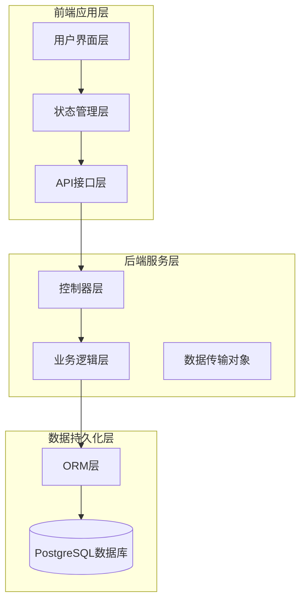

**图表来源**
- [MainTabNavigator.tsx:1-38](file://FreeDressApp/src/navigation/MainTabNavigator.tsx#L1-L38)
- [tryOnStore.ts:1-59](file://FreeDressApp/src/store/tryOnStore.ts#L1-L59)
- [tryon.controller.ts:1-41](file://backend/src/modules/tryon/tryon.controller.ts#L1-L41)

**章节来源**
- [MainTabNavigator.tsx:1-38](file://FreeDressApp/src/navigation/MainTabNavigator.tsx#L1-L38)
- [schema.prisma:1-132](file://backend/prisma/schema.prisma#L1-L132)

## 核心组件

AI试穿状态管理系统由四个核心组件构成，每个组件都有明确的职责分工：

### 1. 状态管理组件 (tryOnStore)
负责管理试穿过程中的所有状态数据，包括：
- 试穿结果列表
- 当前选中的试穿结果
- 加载状态管理
- 生成状态跟踪

### 2. 屏幕组件 (TryOnScreen)
提供完整的试穿交互界面，包含三个主要步骤：
- 全身照上传
- 搭配选择
- 效果生成与展示

### 3. 历史记录组件 (TryOnHistoryScreen)
管理用户的试穿历史，提供查看、刷新和空状态处理

### 4. API服务组件
封装与后端的通信逻辑，包括试穿请求和图片上传

**章节来源**
- [tryOnStore.ts:13-22](file://FreeDressApp/src/store/tryOnStore.ts#L13-L22)
- [TryOnScreen.tsx:37-41](file://FreeDressApp/src/screens/TryOnScreen.tsx#L37-L41)
- [TryOnHistoryScreen.tsx:24-33](file://FreeDressApp/src/screens/TryOnHistoryScreen.tsx#L24-L33)

## 架构概览

AI试穿系统的整体架构采用前后端分离设计，通过RESTful API进行通信：

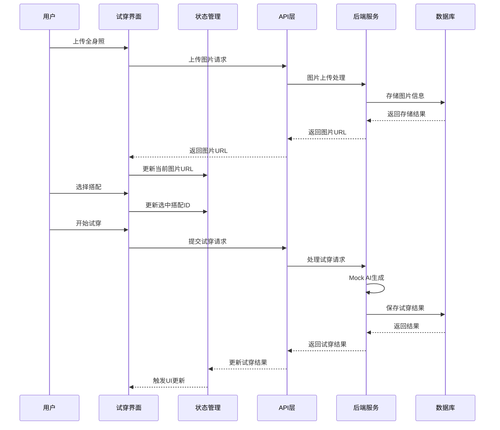

**图表来源**
- [TryOnScreen.tsx:60-97](file://FreeDressApp/src/screens/TryOnScreen.tsx#L60-L97)
- [tryon.ts:17-27](file://FreeDressApp/src/api/tryon.ts#L17-L27)
- [tryon.service.ts:9-33](file://backend/src/modules/tryon/tryon.service.ts#L9-L33)

## 详细组件分析

### 状态管理组件 (tryOnStore)

tryOnStore是整个试穿功能的核心状态管理中心，采用Zustand轻量级状态管理库实现：

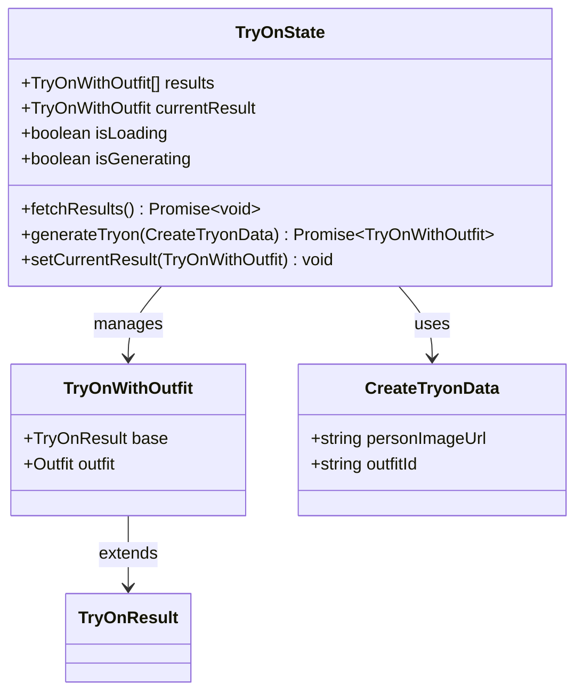

**图表来源**
- [tryOnStore.ts:5-22](file://FreeDressApp/src/store/tryOnStore.ts#L5-L22)
- [tryon.ts:12-15](file://FreeDressApp/src/api/tryon.ts#L12-L15)

#### 状态数据结构

系统使用统一的TryOnResult接口定义试穿结果数据：

| 字段名 | 类型 | 描述 | 必填 |
|--------|------|------|------|
| id | string | 试穿结果唯一标识符 | 是 |
| userId | string | 用户ID | 是 |
| outfitId | string | 搭配ID | 是 |
| personImageUrl | string | 人物照片URL | 是 |
| resultImageUrl | string | 试穿结果URL | 是 |
| createdAt | string | 创建时间 | 是 |

#### 核心操作流程

1. **获取试穿结果列表**
   - 设置isLoading状态为true
   - 调用getTryonResults API
   - 更新results状态
   - 设置isLoading状态为false

2. **生成新的试穿结果**
   - 设置isGenerating状态为true
   - 调用createTryon API
   - 将新结果插入到结果列表开头
   - 设置currentResult为新结果
   - 设置isGenerating状态为false

**章节来源**
- [tryOnStore.ts:30-55](file://FreeDressApp/src/store/tryOnStore.ts#L30-L55)
- [index.ts:49-56](file://FreeDressApp/src/types/index.ts#L49-L56)

### 试穿界面组件 (TryOnScreen)

TryOnScreen提供了完整的试穿交互体验，采用三步流程设计：

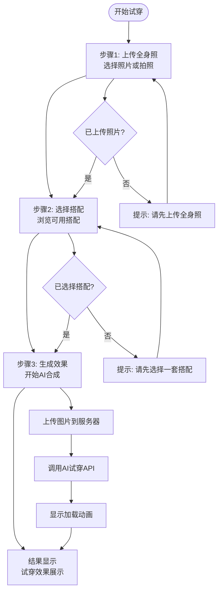

**图表来源**
- [TryOnScreen.tsx:37-41](file://FreeDressApp/src/screens/TryOnScreen.tsx#L37-L41)
- [TryOnScreen.tsx:85-97](file://FreeDressApp/src/screens/TryOnScreen.tsx#L85-L97)

#### 界面组件层次结构

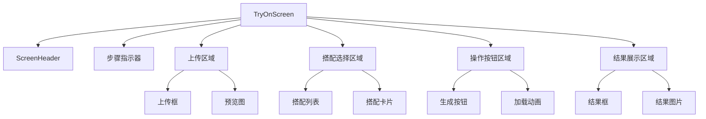

**图表来源**
- [TryOnScreen.tsx:99-323](file://FreeDressApp/src/screens/TryOnScreen.tsx#L99-L323)

#### 交互状态管理

系统通过activeStep变量动态控制界面状态：

| 步骤编号 | 条件表达式 | 状态含义 |
|----------|------------|----------|
| 0 | !personUrl | 未上传照片 |
| 1 | personUrl && !selectedOutfitId | 已上传照片，未选择搭配 |
| 2 | personUrl && selectedOutfitId | 已上传照片且已选择搭配 |

**章节来源**
- [TryOnScreen.tsx:43-58](file://FreeDressApp/src/screens/TryOnScreen.tsx#L43-L58)
- [TryOnScreen.tsx:112-152](file://FreeDressApp/src/screens/TryOnScreen.tsx#L112-L152)

### 历史记录组件 (TryOnHistoryScreen)

TryOnHistoryScreen负责管理用户的试穿历史记录：

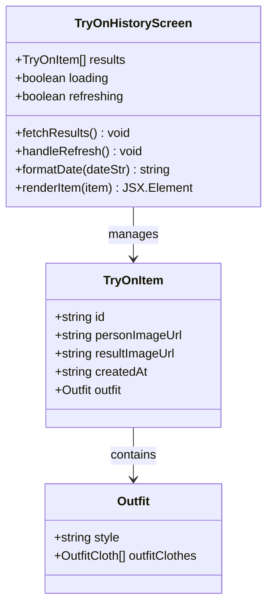

**图表来源**
- [TryOnHistoryScreen.tsx:24-33](file://FreeDressApp/src/screens/TryOnHistoryScreen.tsx#L24-L33)
- [TryOnHistoryScreen.tsx:67-81](file://FreeDressApp/src/screens/TryOnHistoryScreen.tsx#L67-L81)

#### 历史记录数据结构

| 字段名 | 类型 | 描述 |
|--------|------|------|
| id | string | 记录ID |
| personImageUrl | string | 原始照片URL |
| resultImageUrl | string | 试穿结果URL |
| createdAt | string | 创建时间 |
| outfit | Outfit | 搭配信息（可选） |

**章节来源**
- [TryOnHistoryScreen.tsx:35-60](file://FreeDressApp/src/screens/TryOnHistoryScreen.tsx#L35-L60)
- [TryOnHistoryScreen.tsx:67-81](file://FreeDressApp/src/screens/TryOnHistoryScreen.tsx#L67-L81)

### 后端服务组件

后端采用NestJS框架实现，提供完整的AI试穿服务：

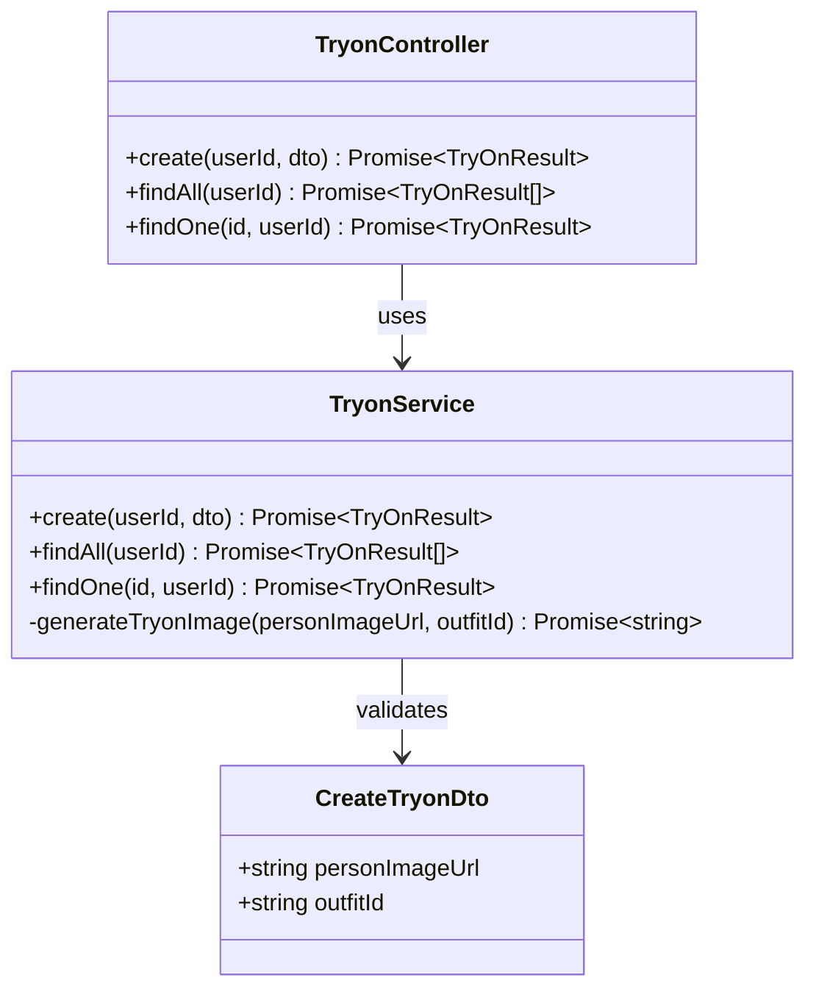

**图表来源**
- [tryon.controller.ts:14-40](file://backend/src/modules/tryon/tryon.controller.ts#L14-L40)
- [tryon.service.ts:6-33](file://backend/src/modules/tryon/tryon.service.ts#L6-L33)
- [create-tryon.dto.ts:4-14](file://backend/src/modules/tryon/dto/create-tryon.dto.ts#L4-L14)

#### Mock AI服务实现

后端使用Mock AI服务模拟试穿生成过程：

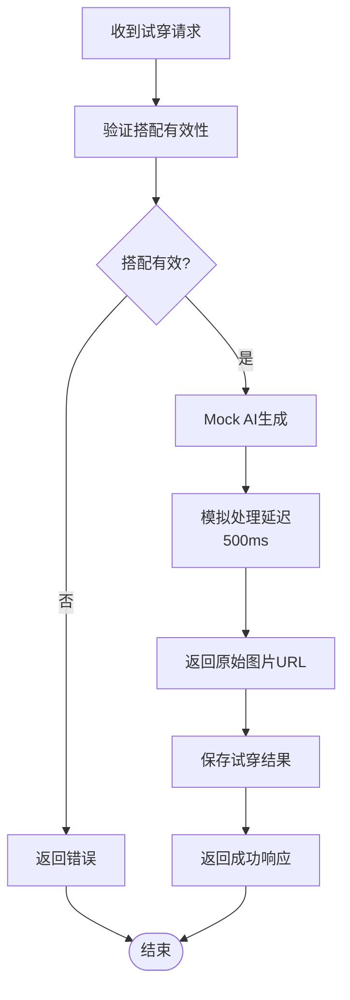

**图表来源**
- [tryon.service.ts:9-33](file://backend/src/modules/tryon/tryon.service.ts#L9-L33)
- [tryon.service.ts:77-86](file://backend/src/modules/tryon/tryon.service.ts#L77-L86)

**章节来源**
- [tryon.controller.ts:17-39](file://backend/src/modules/tryon/tryon.controller.ts#L17-L39)
- [tryon.service.ts:20-33](file://backend/src/modules/tryon/tryon.service.ts#L20-L33)

## 依赖关系分析

AI试穿系统的依赖关系呈现清晰的分层结构：

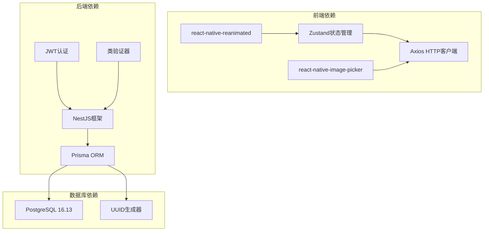

**图表来源**
- [tryOnStore.ts:1](file://FreeDressApp/src/store/tryOnStore.ts#L1)
- [upload.service.ts:1](file://backend/src/modules/upload/upload.service.ts#L1)
- [schema.prisma:8-11](file://backend/prisma/schema.prisma#L8-L11)

### 数据库模型关系

系统采用Prisma ORM定义了完整的数据模型关系：

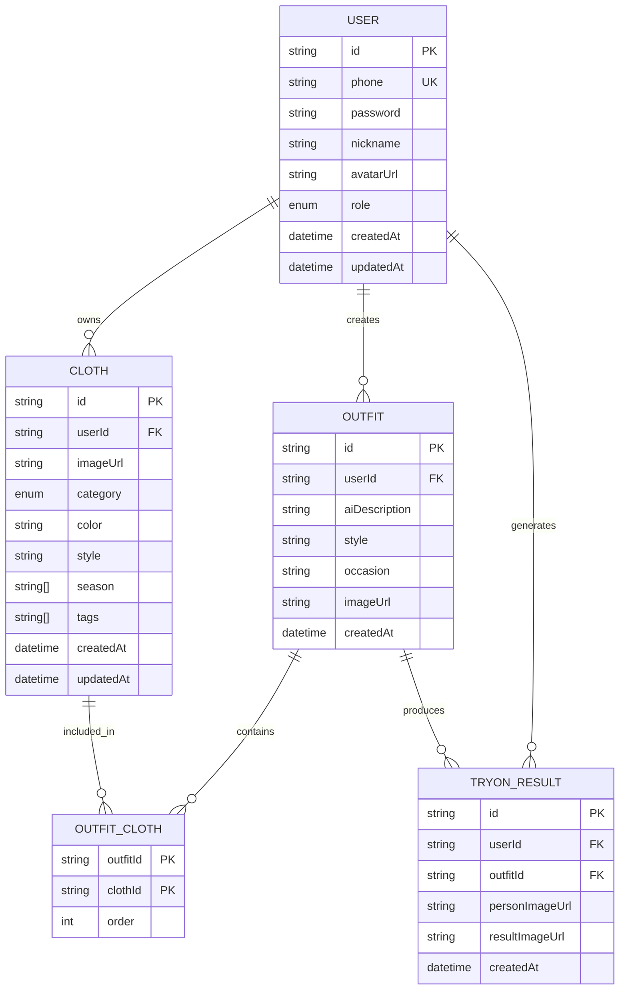

**图表来源**
- [schema.prisma:14-131](file://backend/prisma/schema.prisma#L14-L131)

**章节来源**
- [schema.prisma:116-131](file://backend/prisma/schema.prisma#L116-L131)

## 性能考虑

### 前端性能优化

1. **状态管理优化**
   - 使用Zustand替代Redux，减少不必要的状态更新
   - 组件级状态隔离，避免全局状态污染
   - 异步操作状态管理，防止竞态条件

2. **图片处理优化**
   - 图片质量压缩(80%)，平衡画质与体积
   - 上传进度实时反馈，提升用户体验
   - 缓存策略：本地缓存最近使用的图片URL

3. **UI渲染优化**
   - 使用FlatList优化历史记录列表渲染
   - 动画组件使用react-native-reanimated
   - 条件渲染减少DOM节点数量

### 后端性能优化

1. **数据库查询优化**
   - 合理使用索引(用户ID、搭配ID)
   - N+1查询问题预防，使用include关联查询
   - 分页查询支持大量历史记录

2. **AI服务优化**
   - Mock服务提供快速响应
   - 可扩展的AI服务集成点
   - 错误处理和超时机制

3. **文件上传优化**
   - 文件大小限制(10MB)
   - 支持多种图片格式
   - 本地临时存储，避免内存溢出

## 故障排除指南

### 常见问题及解决方案

#### 1. 图片上传失败
**症状**: 上传过程中出现错误提示
**可能原因**:
- 网络连接不稳定
- 图片格式不支持
- 图片大小超出限制

**解决方法**:
- 检查网络连接状态
- 确认图片格式为JPG/PNG/WebP/GIF
- 确认图片大小不超过10MB

#### 2. 试穿结果为空
**症状**: 试穿历史列表显示为空
**可能原因**:
- 用户尚未创建任何试穿记录
- API请求失败
- 权限验证失败

**解决方法**:
- 确认用户已登录
- 检查API响应状态码
- 验证用户权限

#### 3. 搭配选择异常
**症状**: 搭配列表无法正常显示
**可能原因**:
- 搭配数据加载失败
- 网络请求超时
- 数据格式不正确

**解决方法**:
- 检查搭配数据API
- 验证数据格式完整性
- 清除应用缓存后重试

**章节来源**
- [upload.service.ts:30-38](file://backend/src/modules/upload/upload.service.ts#L30-L38)
- [tryon.service.ts:13-18](file://backend/src/modules/tryon/tryon.service.ts#L13-L18)

### 错误处理机制

系统采用多层次的错误处理机制：

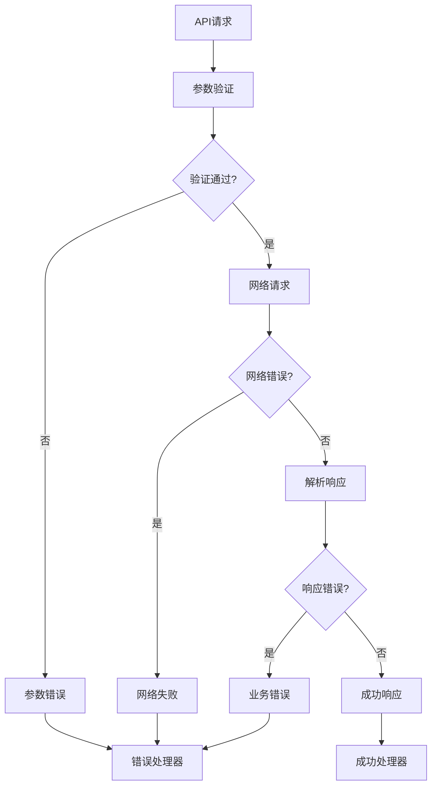

**图表来源**
- [tryon.service.ts:13-18](file://backend/src/modules/tryon/tryon.service.ts#L13-L18)
- [upload.service.ts:26-38](file://backend/src/modules/upload/upload.service.ts#L26-L38)

## 结论

畅搭AI试穿状态管理系统通过精心设计的架构和实现，为用户提供了流畅、可靠的虚拟试穿体验。系统的主要优势包括：

1. **模块化设计**: 清晰的组件分离和职责划分
2. **状态管理**: 基于Zustand的轻量级状态管理
3. **可扩展性**: Mock AI服务与真实AI集成的无缝过渡
4. **用户体验**: 响应式的UI设计和流畅的交互流程
5. **数据安全**: 完善的权限验证和数据保护机制

未来可以进一步优化的方向包括：
- 集成真实的AI试穿服务
- 添加离线缓存机制
- 实现结果分享功能
- 增强错误恢复能力
- 优化移动端性能表现

## 附录

### API接口规范

| 接口名称 | 方法 | 路径 | 功能描述 |
|----------|------|------|----------|
| 创建试穿 | POST | /tryon | 提交试穿请求 |
| 获取试穿列表 | GET | /tryon | 获取试穿记录列表 |
| 获取单个试穿 | GET | /tryon/:id | 获取指定试穿记录 |
| 上传图片 | POST | /upload/image | 上传图片文件 |

### 数据模型字段说明

| 模型名称 | 字段名 | 类型 | 描述 |
|----------|--------|------|------|
| TryOnResult | id | string | 试穿结果ID |
| TryOnResult | userId | string | 用户ID |
| TryOnResult | outfitId | string | 搭配ID |
| TryOnResult | personImageUrl | string | 人物照片URL |
| TryOnResult | resultImageUrl | string | 试穿结果URL |
| TryOnResult | createdAt | string | 创建时间 |

### 开发最佳实践

1. **状态管理**: 使用原子化状态，避免状态污染
2. **错误处理**: 统一的错误处理机制和用户友好的错误提示
3. **性能优化**: 合理的缓存策略和异步操作处理
4. **代码组织**: 清晰的文件结构和命名约定
5. **测试覆盖**: 完善的单元测试和集成测试