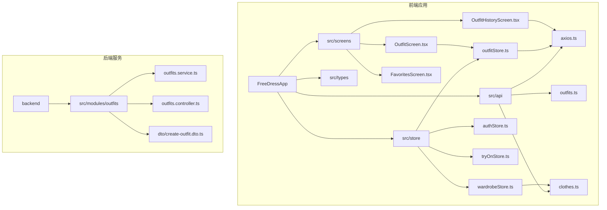
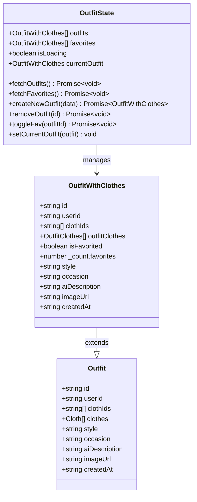
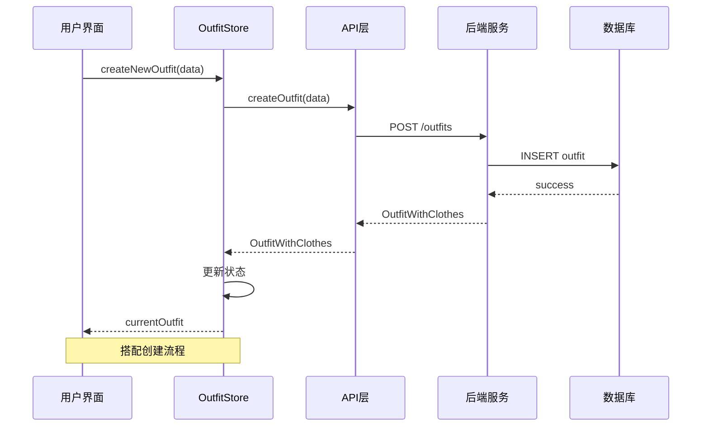
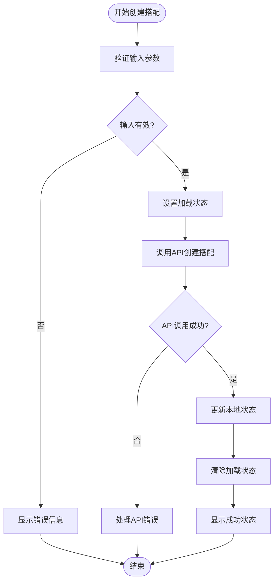
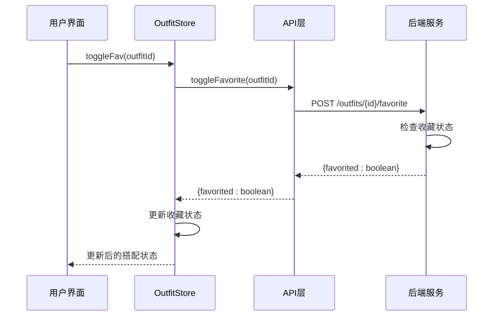
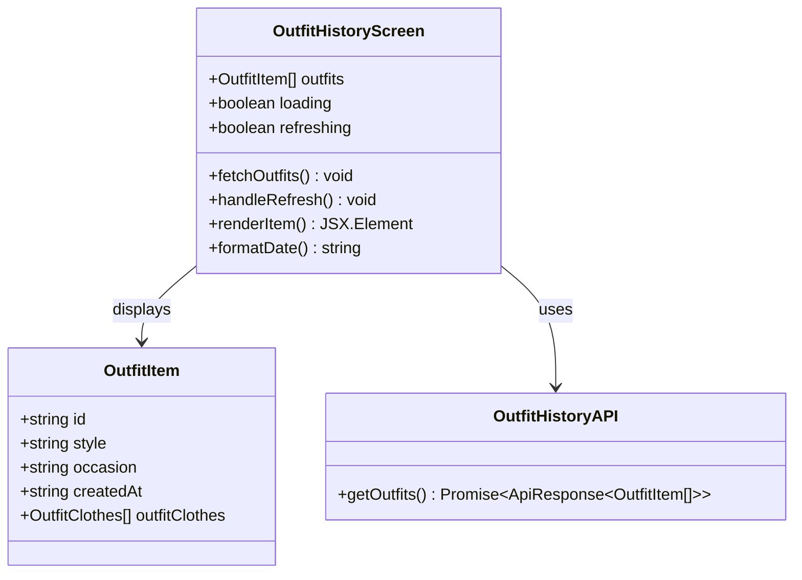
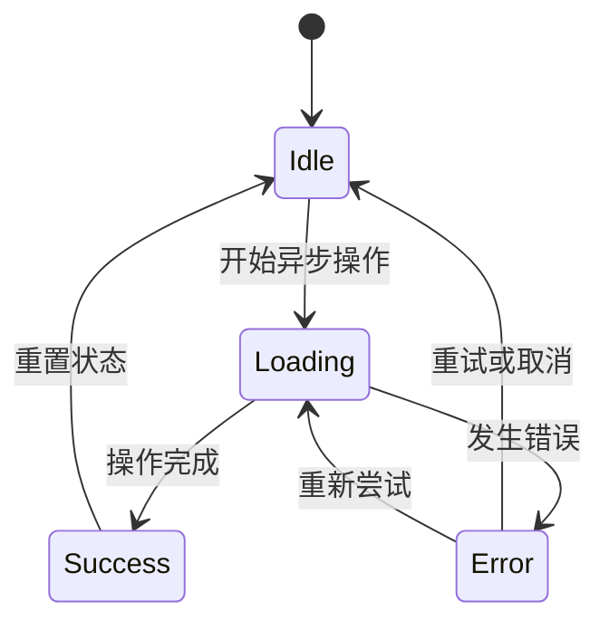
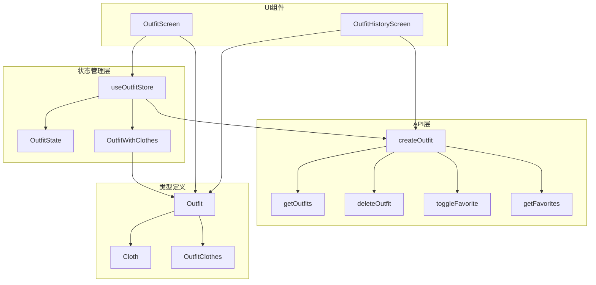
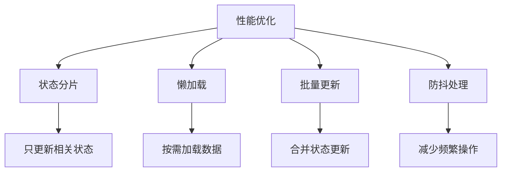

# 搭配状态管理

<cite>
**本文档引用的文件**
- [outfitStore.ts](file://FreeDressApp/src/store/outfitStore.ts)
- [outfits.ts](file://FreeDressApp/src/api/outfits.ts)
- [OutfitScreen.tsx](file://FreeDressApp/src/screens/OutfitScreen.tsx)
- [OutfitHistoryScreen.tsx](file://FreeDressApp/src/screens/OutfitHistoryScreen.tsx)
- [index.ts](file://FreeDressApp/src/types/index.ts)
- [axios.ts](file://FreeDressApp/src/api/axios.ts)
- [wardrobeStore.ts](file://FreeDressApp/src/store/wardrobeStore.ts)
- [outfits.service.ts](file://backend/src/modules/outfits/outfits.service.ts)
- [outfits.controller.ts](file://backend/src/modules/outfits/outfits.controller.ts)
- [create-outfit.dto.ts](file://backend/src/modules/outfits/dto/create-outfit.dto.ts)
- [index.ts](file://FreeDressApp/src/constants/index.ts)
</cite>

## 目录
1. [简介](#简介)
2. [项目结构](#项目结构)
3. [核心组件](#核心组件)
4. [架构概览](#架构概览)
5. [详细组件分析](#详细组件分析)
6. [依赖关系分析](#依赖关系分析)
7. [性能考虑](#性能考虑)
8. [故障排除指南](#故障排除指南)
9. [结论](#结论)
10. [附录](#附录)

## 简介

本文档深入解析畅搭(FreeDress)应用中的搭配状态管理系统，重点围绕`outfitStore`的实现原理进行详细说明。该系统负责管理用户的搭配数据，包括创建、编辑、保存和删除操作，以及搭配状态的数据结构设计。

搭配状态管理是畅搭应用的核心功能之一，它通过Zustand状态管理库实现了高效的状态同步，结合后端API提供了完整的搭配生命周期管理。系统支持临时状态、预览模式和最终提交机制，并具备完善的异步处理策略和错误恢复能力。

## 项目结构

畅搭应用采用模块化的项目结构，搭配状态管理位于以下关键位置：

**图表来源**
- [outfitStore.ts:1-90](file://FreeDressApp/src/store/outfitStore.ts#L1-L90)
- [outfits.ts:1-40](file://FreeDressApp/src/api/outfits.ts#L1-L40)
- [OutfitScreen.tsx:1-603](file://FreeDressApp/src/screens/OutfitScreen.tsx#L1-L603)

**章节来源**
- [outfitStore.ts:1-90](file://FreeDressApp/src/store/outfitStore.ts#L1-L90)
- [index.ts:1-98](file://FreeDressApp/src/types/index.ts#L1-L98)

## 核心组件

### OutfitStore 状态管理器

`outfitStore`是搭配状态管理的核心，基于Zustand库实现，提供了完整的搭配生命周期管理功能。

#### 状态结构设计

**图表来源**
- [outfitStore.ts:12-30](file://FreeDressApp/src/store/outfitStore.ts#L12-L30)
- [index.ts:35-46](file://FreeDressApp/src/types/index.ts#L35-L46)

#### 数据模型定义

搭配系统的核心数据模型包括：

1. **Outfit 基础模型**: 描述搭配的基本信息
2. **OutfitWithClothes 扩展模型**: 包含衣物详情和收藏状态
3. **OutfitClothes 关联模型**: 管理衣物在搭配中的顺序

**章节来源**
- [outfitStore.ts:12-16](file://FreeDressApp/src/store/outfitStore.ts#L12-L16)
- [index.ts:35-46](file://FreeDressApp/src/types/index.ts#L35-L46)

## 架构概览

搭配状态管理系统采用分层架构设计，确保了清晰的关注点分离和良好的可维护性。

**图表来源**
- [outfitStore.ts:59-64](file://FreeDressApp/src/store/outfitStore.ts#L59-L64)
- [outfits.ts:17-19](file://FreeDressApp/src/api/outfits.ts#L17-L19)

系统架构的关键特点：

1. **状态隔离**: 使用Zustand实现独立的状态管理
2. **API抽象**: 通过专门的API层处理网络请求
3. **类型安全**: 完整的TypeScript类型定义
4. **错误处理**: 统一的错误处理和状态更新机制

**章节来源**
- [outfitStore.ts:32-89](file://FreeDressApp/src/store/outfitStore.ts#L32-L89)
- [axios.ts:24-38](file://FreeDressApp/src/api/axios.ts#L24-L38)

## 详细组件分析

### 搭配创建流程

搭配创建是系统中最复杂的业务流程，涉及多个状态转换和异步操作。

#### 创建流程状态图

**图表来源**
- [OutfitScreen.tsx:67-84](file://FreeDressApp/src/screens/OutfitScreen.tsx#L67-L84)
- [outfitStore.ts:59-64](file://FreeDressApp/src/store/outfitStore.ts#L59-L64)

#### 关键实现细节

1. **输入验证**: 确保至少选择一件衣物
2. **状态管理**: 使用`generating`状态指示创建过程
3. **错误处理**: 通过Alert组件提供用户友好的错误反馈
4. **状态更新**: 自动更新搭配列表和当前选中状态

**章节来源**
- [OutfitScreen.tsx:67-84](file://FreeDressApp/src/screens/OutfitScreen.tsx#L67-L84)
- [OutfitScreen.tsx:74-78](file://FreeDressApp/src/screens/OutfitScreen.tsx#L74-L78)

### 收藏状态管理

收藏功能提供了搭配的个性化管理能力，支持快速标记和检索。

#### 收藏状态切换序列图

**图表来源**
- [outfitStore.ts:74-86](file://FreeDressApp/src/store/outfitStore.ts#L74-L86)
- [outfits.ts:33-35](file://FreeDressApp/src/api/outfits.ts#L33-L35)

收藏状态管理的关键特性：

1. **实时更新**: 收藏状态变更立即反映在UI上
2. **状态同步**: 当前选中搭配和列表中的搭配状态保持一致
3. **后端持久化**: 收藏状态通过API持久化到服务器

**章节来源**
- [outfitStore.ts:74-86](file://FreeDressApp/src/store/outfitStore.ts#L74-L86)

### 搭配历史管理

搭配历史功能提供了完整的搭配记录查看和管理能力。

#### 历史记录展示组件

**图表来源**
- [OutfitHistoryScreen.tsx:24-31](file://FreeDressApp/src/screens/OutfitHistoryScreen.tsx#L24-L31)
- [OutfitHistoryScreen.tsx:38-57](file://FreeDressApp/src/screens/OutfitHistoryScreen.tsx#L38-L57)

历史记录管理的主要功能：

1. **无限滚动**: 支持大量历史记录的分页加载
2. **下拉刷新**: 提供即时更新的历史记录
3. **空状态处理**: 友好的无记录提示界面
4. **日期格式化**: 用户友好的时间显示格式

**章节来源**
- [OutfitHistoryScreen.tsx:32-138](file://FreeDressApp/src/screens/OutfitHistoryScreen.tsx#L32-L138)

### 异步处理策略

系统采用统一的异步处理策略，确保用户体验的一致性和可靠性。

#### 异步操作状态管理

**图表来源**
- [outfitStore.ts:38-48](file://FreeDressApp/src/store/outfitStore.ts#L38-L48)
- [OutfitScreen.tsx:72-83](file://FreeDressApp/src/screens/OutfitScreen.tsx#L72-L83)

异步处理的关键策略：

1. **加载状态管理**: 使用`isLoading`和`generating`状态指示操作进度
2. **错误恢复**: 统一的错误处理和用户反馈机制
3. **状态回滚**: 操作失败时自动回滚到之前的状态
4. **并发控制**: 避免重复请求和状态竞态

**章节来源**
- [outfitStore.ts:38-48](file://FreeDressApp/src/store/outfitStore.ts#L38-L48)
- [axios.ts:49-105](file://FreeDressApp/src/api/axios.ts#L49-L105)

## 依赖关系分析

搭配状态管理系统涉及多个层面的依赖关系，需要清晰地理解和管理。

**图表来源**
- [outfitStore.ts:1-10](file://FreeDressApp/src/store/outfitStore.ts#L1-L10)
- [index.ts:35-46](file://FreeDressApp/src/types/index.ts#L35-L46)

### 外部依赖

系统依赖的关键外部库和工具：

1. **Zustand**: 轻量级状态管理库
2. **Axios**: HTTP客户端库
3. **React Native**: 移动端开发框架
4. **Prisma**: 数据库ORM工具

**章节来源**
- [outfitStore.ts:1](file://FreeDressApp/src/store/outfitStore.ts#L1)
- [axios.ts:1](file://FreeDressApp/src/api/axios.ts#L1)

## 性能考虑

搭配状态管理系统在设计时充分考虑了性能优化，采用了多种策略来提升用户体验。

### 缓存策略

系统采用多层次的缓存策略来优化性能：

1. **内存缓存**: Zustand状态管理器提供快速的状态访问
2. **网络缓存**: Axios拦截器支持请求重试和缓存管理
3. **本地存储**: AsyncStorage用于持久化认证信息

### 性能优化技术

**图表来源**
- [outfitStore.ts:32-89](file://FreeDressApp/src/store/outfitStore.ts#L32-L89)
- [wardrobeStore.ts:35-82](file://FreeDressApp/src/store/wardrobeStore.ts#L35-L82)

具体的性能优化措施：

1. **状态分片**: 将搭配状态与其他状态分离，避免不必要的重渲染
2. **懒加载**: 衣物列表按需加载，减少初始加载时间
3. **批量更新**: 使用`set`函数的批处理能力减少状态更新次数
4. **防抖处理**: 对频繁的操作进行防抖处理，如搜索和过滤

**章节来源**
- [outfitStore.ts:32-89](file://FreeDressApp/src/store/outfitStore.ts#L32-L89)
- [wardrobeStore.ts:35-82](file://FreeDressApp/src/store/wardrobeStore.ts#L35-L82)

## 故障排除指南

### 常见问题及解决方案

#### 网络请求错误

当网络请求失败时，系统会自动处理并提供用户友好的错误反馈：

1. **401未授权**: 自动尝试刷新token并重试请求
2. **网络超时**: 提供重试机制和超时警告
3. **服务器错误**: 显示具体的错误信息和解决建议

#### 状态同步问题

当出现状态不同步时：

1. **手动刷新**: 提供下拉刷新功能强制更新数据
2. **状态重置**: 支持重置到初始状态
3. **错误回滚**: 自动回滚到上一个正确状态

**章节来源**
- [axios.ts:49-105](file://FreeDressApp/src/api/axios.ts#L49-L105)
- [OutfitScreen.tsx:79-83](file://FreeDressApp/src/screens/OutfitScreen.tsx#L79-L83)

### 调试技巧

1. **状态检查**: 使用浏览器开发者工具检查Zustand状态
2. **网络监控**: 监控API请求和响应
3. **错误日志**: 查看控制台中的错误信息

## 结论

畅搭应用的搭配状态管理系统展现了现代移动应用开发的最佳实践。通过精心设计的状态管理架构、完善的错误处理机制和性能优化策略，系统为用户提供了流畅、可靠的搭配体验。

系统的核心优势包括：

1. **清晰的架构设计**: 分层架构确保了代码的可维护性和可扩展性
2. **强大的状态管理**: 基于Zustand的状态管理提供了高效的性能表现
3. **完善的错误处理**: 统一的错误处理机制提升了用户体验
4. **灵活的扩展性**: 模块化的设计便于功能扩展和定制

未来可以考虑的改进方向：

1. **离线支持**: 添加离线数据同步功能
2. **性能监控**: 集成性能监控和分析工具
3. **测试覆盖**: 增加单元测试和集成测试覆盖率
4. **国际化**: 支持多语言和多地区适配

## 附录

### API接口规范

搭配系统的API接口遵循RESTful设计原则，提供了完整的CRUD操作：

| 接口 | 方法 | 描述 | 请求参数 | 响应数据 |
|------|------|------|----------|----------|
| `/outfits` | GET | 获取搭配列表 | 无 | OutfitWithClothes[] |
| `/outfits` | POST | 创建新搭配 | CreateOutfitData | OutfitWithClothes |
| `/outfits/:id` | GET | 获取搭配详情 | id | OutfitWithClothes |
| `/outfits/:id` | DELETE | 删除搭配 | id | {message: string} |
| `/outfits/:id/favorite` | POST | 收藏/取消收藏 | id | {favorited: boolean} |
| `/outfits/favorites` | GET | 获取收藏列表 | 无 | OutfitWithClothes[] |

### 类型定义参考

系统使用TypeScript提供完整的类型安全保障，主要类型包括：

1. **Outfit**: 搭配基础数据模型
2. **OutfitWithClothes**: 扩展的搭配数据模型
3. **CreateOutfitData**: 创建搭配的请求数据模型
4. **ApiResponse<T>**: API响应的标准格式

这些类型定义确保了前后端数据传输的一致性和安全性。