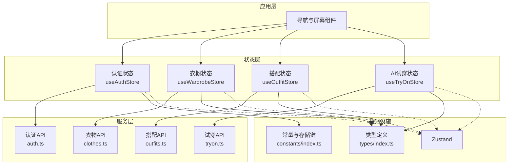
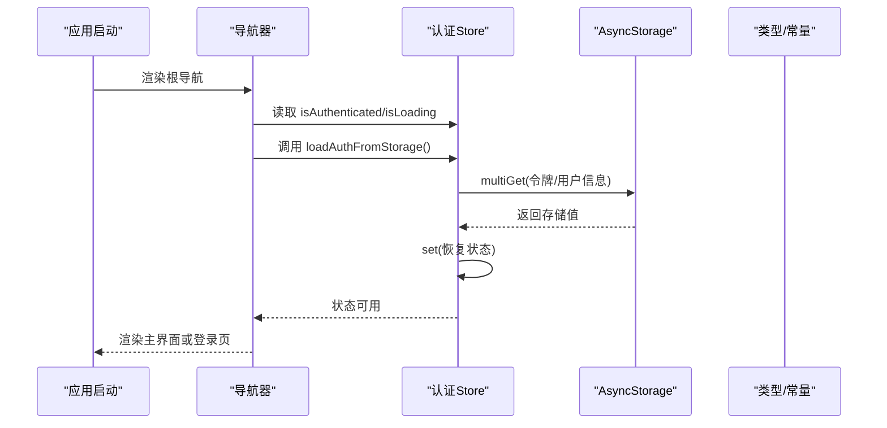
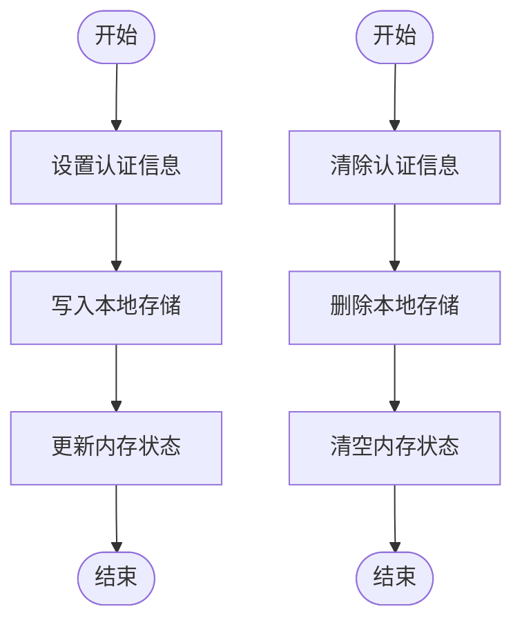
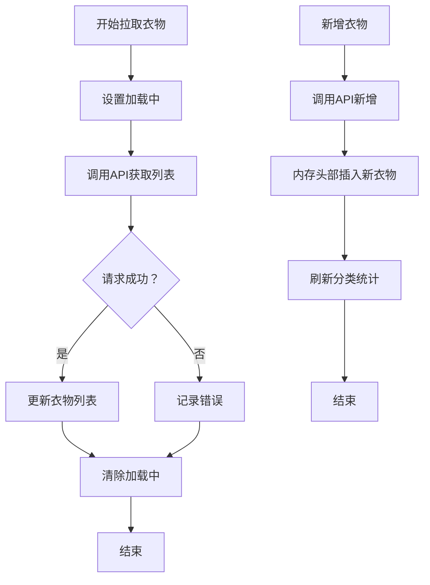
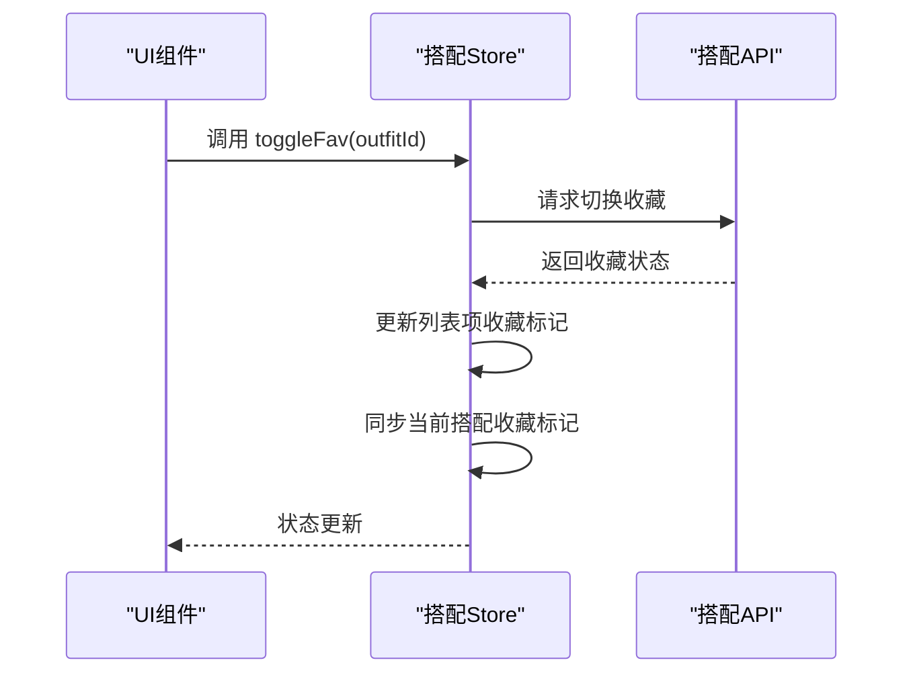
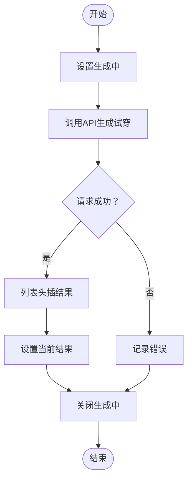
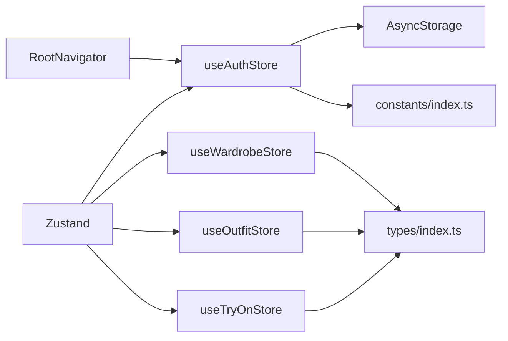

# 状态管理

<cite>
**本文档引用的文件**
- [authStore.ts](file://FreeDressApp/src/store/authStore.ts)
- [wardrobeStore.ts](file://FreeDressApp/src/store/wardrobeStore.ts)
- [outfitStore.ts](file://FreeDressApp/src/store/outfitStore.ts)
- [tryOnStore.ts](file://FreeDressApp/src/store/tryOnStore.ts)
- [index.ts（类型定义）](file://FreeDressApp/src/types/index.ts)
- [index.ts（常量与设计）](file://FreeDressApp/src/constants/index.ts)
- [auth.ts](file://FreeDressApp/src/api/auth.ts)
- [clothes.ts](file://FreeDressApp/src/api/clothes.ts)
- [outfits.ts](file://FreeDressApp/src/api/outfits.ts)
- [tryon.ts](file://FreeDressApp/src/api/tryon.ts)
- [RootNavigator.tsx](file://FreeDressApp/src/navigation/RootNavigator.tsx)
- [package.json](file://FreeDressApp/package.json)
</cite>

## 目录
1. [简介](#简介)
2. [项目结构](#项目结构)
3. [核心组件](#核心组件)
4. [架构总览](#架构总览)
5. [详细组件分析](#详细组件分析)
6. [依赖分析](#依赖分析)
7. [性能考虑](#性能考虑)
8. [故障排查指南](#故障排查指南)
9. [结论](#结论)
10. [附录](#附录)

## 简介
本文件系统性梳理畅搭（FreeDress）应用的状态管理方案，基于 Zustand 实现的多 Store 架构，覆盖认证状态、衣橱状态、搭配状态与 AI 试穿状态。文档重点阐述：
- Store 的设计模式与职责边界
- 状态定义、动作函数与订阅机制
- 生命周期管理与数据持久化策略
- 状态同步与异步操作处理
- 调试与性能优化技巧
- 最佳实践与常见陷阱
- 与导航、屏幕组件的集成方式

## 项目结构
状态管理位于前端应用 FreeDressApp 的 store 目录，围绕四个核心 Store 组织业务域：
- 认证状态：管理用户登录态、令牌与用户信息，并负责本地持久化
- 衣橱状态：管理衣物列表、分类统计与增删改查
- 搭配状态：管理搭配集合、收藏与当前搭配
- AI 试穿状态：管理试穿结果与生成流程

Store 通过 API 层进行后端交互，类型与常量在 types 与 constants 中统一定义；导航层在启动时加载认证状态，确保应用启动即具备正确的登录态。

图表来源
- [authStore.ts:1-123](file://FreeDressApp/src/store/authStore.ts#L1-L123)
- [wardrobeStore.ts:1-83](file://FreeDressApp/src/store/wardrobeStore.ts#L1-L83)
- [outfitStore.ts:1-90](file://FreeDressApp/src/store/outfitStore.ts#L1-L90)
- [tryOnStore.ts:1-59](file://FreeDressApp/src/store/tryOnStore.ts#L1-L59)
- [auth.ts:1-101](file://FreeDressApp/src/api/auth.ts#L1-L101)
- [clothes.ts:1-54](file://FreeDressApp/src/api/clothes.ts#L1-L54)
- [outfits.ts:1-40](file://FreeDressApp/src/api/outfits.ts#L1-L40)
- [tryon.ts:1-28](file://FreeDressApp/src/api/tryon.ts#L1-L28)
- [index.ts（常量与设计）:200-205](file://FreeDressApp/src/constants/index.ts#L200-L205)
- [index.ts（类型定义）:58-71](file://FreeDressApp/src/types/index.ts#L58-L71)

章节来源
- [authStore.ts:1-123](file://FreeDressApp/src/store/authStore.ts#L1-L123)
- [wardrobeStore.ts:1-83](file://FreeDressApp/src/store/wardrobeStore.ts#L1-L83)
- [outfitStore.ts:1-90](file://FreeDressApp/src/store/outfitStore.ts#L1-L90)
- [tryOnStore.ts:1-59](file://FreeDressApp/src/store/tryOnStore.ts#L1-L59)
- [index.ts（常量与设计）:200-205](file://FreeDressApp/src/constants/index.ts#L200-L205)
- [index.ts（类型定义）:58-71](file://FreeDressApp/src/types/index.ts#L58-L71)

## 核心组件
- 认证状态（useAuthStore）
  - 状态：用户信息、访问令牌、刷新令牌、是否已认证、加载中标志
  - 动作：设置认证信息、清除认证信息、更新用户信息、从本地存储加载认证信息
  - 持久化：使用 AsyncStorage 多键写入/删除，键名来自常量
  - 订阅：导航层在应用启动时调用加载逻辑，确保首次渲染前完成状态恢复
- 衣橱状态（useWardrobeStore）
  - 状态：衣物列表、分类统计、加载中、当前激活分类
  - 动作：设置激活分类、拉取衣物列表、拉取分类统计、新增衣物、编辑衣物、删除衣物
  - 同步：新增/编辑/删除后即时更新内存状态，并触发统计刷新
- 搭配状态（useOutfitStore）
  - 状态：搭配列表、收藏列表、加载中、当前搭配
  - 动作：拉取搭配、拉取收藏、新建搭配、删除搭配、切换收藏、设置当前搭配
  - 同步：收藏切换后同时更新当前搭配与列表中的收藏标记
- AI 试穿状态（useTryOnStore）
  - 状态：试穿结果列表、当前结果、加载中、生成中
  - 动作：拉取历史、生成试穿、设置当前结果
  - 流程：生成时开启“生成中”标志，完成后关闭并更新当前结果

章节来源
- [authStore.ts:9-22](file://FreeDressApp/src/store/authStore.ts#L9-L22)
- [authStore.ts:28-122](file://FreeDressApp/src/store/authStore.ts#L28-L122)
- [wardrobeStore.ts:21-33](file://FreeDressApp/src/store/wardrobeStore.ts#L21-L33)
- [wardrobeStore.ts:35-82](file://FreeDressApp/src/store/wardrobeStore.ts#L35-L82)
- [outfitStore.ts:18-30](file://FreeDressApp/src/store/outfitStore.ts#L18-L30)
- [outfitStore.ts:32-89](file://FreeDressApp/src/store/outfitStore.ts#L32-L89)
- [tryOnStore.ts:13-22](file://FreeDressApp/src/store/tryOnStore.ts#L13-L22)
- [tryOnStore.ts:24-58](file://FreeDressApp/src/store/tryOnStore.ts#L24-L58)

## 架构总览
Zustand 在本项目中承担轻量状态容器，Store 之间保持松耦合，仅通过 API 层与后端交互。导航层在启动阶段完成认证状态恢复，随后按需订阅各 Store 的状态变化以驱动 UI 更新。

图表来源
- [RootNavigator.tsx:41-47](file://FreeDressApp/src/navigation/RootNavigator.tsx#L41-L47)
- [authStore.ts:97-121](file://FreeDressApp/src/store/authStore.ts#L97-L121)
- [index.ts（常量与设计）:200-205](file://FreeDressApp/src/constants/index.ts#L200-L205)

## 详细组件分析

### 认证状态（useAuthStore）
- 设计要点
  - 使用接口明确状态与动作签名，保证类型安全
  - 将“设置认证信息”和“清除认证信息”封装为异步动作，确保本地持久化与状态同步
  - “从存储加载”在应用启动时执行，避免首屏闪烁
- 数据流
  - 登录成功后写入令牌与用户信息，随后进入主界面
  - 登出时清空状态与本地存储
  - 更新用户信息时同步到本地存储
- 订阅与副作用
  - 导航层在挂载时调用加载逻辑，等待完成后再决定路由
- 关键路径
  - 设置认证：[authStore.ts:39-57](file://FreeDressApp/src/store/authStore.ts#L39-L57)
  - 清除认证：[authStore.ts:62-78](file://FreeDressApp/src/store/authStore.ts#L62-L78)
  - 更新用户信息：[authStore.ts:83-92](file://FreeDressApp/src/store/authStore.ts#L83-L92)
  - 从存储加载：[authStore.ts:97-121](file://FreeDressApp/src/store/authStore.ts#L97-L121)

图表来源
- [authStore.ts:39-78](file://FreeDressApp/src/store/authStore.ts#L39-L78)
- [index.ts（常量与设计）:200-205](file://FreeDressApp/src/constants/index.ts#L200-L205)

章节来源
- [authStore.ts:9-22](file://FreeDressApp/src/store/authStore.ts#L9-L22)
- [authStore.ts:28-122](file://FreeDressApp/src/store/authStore.ts#L28-L122)
- [RootNavigator.tsx:41-47](file://FreeDressApp/src/navigation/RootNavigator.tsx#L41-L47)
- [index.ts（常量与设计）:200-205](file://FreeDressApp/src/constants/index.ts#L200-L205)

### 衣橱状态（useWardrobeStore）
- 设计要点
  - 将“分类统计”与“衣物列表”解耦，分别维护
  - 增删改后即时更新内存列表，并触发统计刷新
- 数据流
  - 拉取列表：设置加载中 → 请求成功 → 更新列表 → 结束加载
  - 新增/编辑/删除：请求成功 → 内存状态变更 → 触发统计刷新
- 关键路径
  - 拉取衣物：[wardrobeStore.ts:43-53](file://FreeDressApp/src/store/wardrobeStore.ts#L43-L53)
  - 拉取统计：[wardrobeStore.ts:55-62](file://FreeDressApp/src/store/wardrobeStore.ts#L55-L62)
  - 新增衣物：[wardrobeStore.ts:64-68](file://FreeDressApp/src/store/wardrobeStore.ts#L64-L68)
  - 编辑衣物：[wardrobeStore.ts:70-75](file://FreeDressApp/src/store/wardrobeStore.ts#L70-L75)
  - 删除衣物：[wardrobeStore.ts:77-81](file://FreeDressApp/src/store/wardrobeStore.ts#L77-L81)

图表来源
- [wardrobeStore.ts:43-81](file://FreeDressApp/src/store/wardrobeStore.ts#L43-L81)
- [clothes.ts:30-53](file://FreeDressApp/src/api/clothes.ts#L30-L53)

章节来源
- [wardrobeStore.ts:21-33](file://FreeDressApp/src/store/wardrobeStore.ts#L21-L33)
- [wardrobeStore.ts:35-82](file://FreeDressApp/src/store/wardrobeStore.ts#L35-L82)
- [clothes.ts:1-54](file://FreeDressApp/src/api/clothes.ts#L1-L54)

### 搭配状态（useOutfitStore）
- 设计要点
  - 将“搭配列表”与“收藏列表”分离，避免重复计算
  - 收藏切换时同步更新当前搭配与列表项
- 数据流
  - 新建搭配：请求成功 → 列表头插 → 设置为当前搭配
  - 删除搭配：请求成功 → 过滤掉该搭配 → 若为当前搭配则清空
  - 切换收藏：请求成功 → 更新对应项的收藏标记 → 同步当前搭配
- 关键路径
  - 拉取搭配：[outfitStore.ts:38-48](file://FreeDressApp/src/store/outfitStore.ts#L38-L48)
  - 拉取收藏：[outfitStore.ts:50-57](file://FreeDressApp/src/store/outfitStore.ts#L50-L57)
  - 新建搭配：[outfitStore.ts:59-64](file://FreeDressApp/src/store/outfitStore.ts#L59-L64)
  - 删除搭配：[outfitStore.ts:66-72](file://FreeDressApp/src/store/outfitStore.ts#L66-L72)
  - 切换收藏：[outfitStore.ts:74-86](file://FreeDressApp/src/store/outfitStore.ts#L74-L86)

图表来源
- [outfitStore.ts:74-86](file://FreeDressApp/src/store/outfitStore.ts#L74-L86)
- [outfits.ts:33-35](file://FreeDressApp/src/api/outfits.ts#L33-L35)

章节来源
- [outfitStore.ts:18-30](file://FreeDressApp/src/store/outfitStore.ts#L18-L30)
- [outfitStore.ts:32-89](file://FreeDressApp/src/store/outfitStore.ts#L32-L89)
- [outfits.ts:1-40](file://FreeDressApp/src/api/outfits.ts#L1-L40)

### AI 试穿状态（useTryOnStore）
- 设计要点
  - 区分“加载历史”与“生成试穿”的不同状态位
  - 生成流程中设置“生成中”，完成后关闭并更新当前结果
- 数据流
  - 拉取历史：设置加载中 → 请求成功 → 更新结果列表
  - 生成试穿：设置生成中 → 请求成功 → 列表头插 → 设置当前结果
- 关键路径
  - 拉取历史：[tryOnStore.ts:30-40](file://FreeDressApp/src/store/tryOnStore.ts#L30-L40)
  - 生成试穿：[tryOnStore.ts:42-55](file://FreeDressApp/src/store/tryOnStore.ts#L42-L55)

图表来源
- [tryOnStore.ts:42-55](file://FreeDressApp/src/store/tryOnStore.ts#L42-L55)
- [tryon.ts:17-19](file://FreeDressApp/src/api/tryon.ts#L17-L19)

章节来源
- [tryOnStore.ts:13-22](file://FreeDressApp/src/store/tryOnStore.ts#L13-L22)
- [tryOnStore.ts:24-58](file://FreeDressApp/src/store/tryOnStore.ts#L24-L58)
- [tryon.ts:1-28](file://FreeDressApp/src/api/tryon.ts#L1-L28)

## 依赖分析
- 外部依赖
  - Zustand：状态容器，提供简洁的 Store 定义与订阅机制
  - AsyncStorage：移动端持久化存储，用于认证信息的跨会话保留
- 内部依赖
  - 类型与常量：统一的数据契约与存储键名
  - API 层：封装后端接口，Store 通过 API 层与服务通信
- 导航集成
  - 根导航器在启动时调用认证 Store 的加载逻辑，确保路由切换前状态可用

图表来源
- [package.json:30](file://FreeDressApp/package.json#L30)
- [authStore.ts:1-2](file://FreeDressApp/src/store/authStore.ts#L1-L2)
- [index.ts（常量与设计）:200-205](file://FreeDressApp/src/constants/index.ts#L200-L205)
- [index.ts（类型定义）:58-71](file://FreeDressApp/src/types/index.ts#L58-L71)
- [RootNavigator.tsx:10](file://FreeDressApp/src/navigation/RootNavigator.tsx#L10)

章节来源
- [package.json:12-31](file://FreeDressApp/package.json#L12-L31)
- [authStore.ts:1-2](file://FreeDressApp/src/store/authStore.ts#L1-L2)
- [RootNavigator.tsx:41-47](file://FreeDressApp/src/navigation/RootNavigator.tsx#L41-L47)

## 性能考虑
- 状态粒度控制
  - 将“列表”“当前项”“加载中”等状态拆分，避免无关 UI 重复渲染
- 异步操作优化
  - 在发起请求前设置“加载中/生成中”标志，减少 UI 抖动
  - 成功后批量更新状态，避免多次重渲染
- 本地存储策略
  - 认证信息采用多键写入/删除，确保一致性；对频繁更新的用户信息单独写入，降低序列化成本
- 列表更新策略
  - 新增采用头插，提升用户感知的新鲜度；编辑/删除采用映射/过滤，保持最小变更
- 导航启动优化
  - 在根导航器中尽早加载认证状态，避免首屏闪烁

## 故障排查指南
- 认证状态无法恢复
  - 检查本地存储键名是否与常量一致
  - 确认加载逻辑在应用启动时被调用
  - 参考路径：[authStore.ts:97-121](file://FreeDressApp/src/store/authStore.ts#L97-L121)，[index.ts（常量与设计）:200-205](file://FreeDressApp/src/constants/index.ts#L200-L205)，[RootNavigator.tsx:41-47](file://FreeDressApp/src/navigation/RootNavigator.tsx#L41-L47)
- 衣物列表不更新
  - 确认新增/编辑/删除后是否调用了统计刷新
  - 参考路径：[wardrobeStore.ts:64-68](file://FreeDressApp/src/store/wardrobeStore.ts#L64-L68)，[wardrobeStore.ts:70-75](file://FreeDressApp/src/store/wardrobeStore.ts#L70-L75)，[wardrobeStore.ts:77-81](file://FreeDressApp/src/store/wardrobeStore.ts#L77-L81)
- 收藏状态未同步
  - 检查收藏切换后是否同时更新了当前搭配与列表项
  - 参考路径：[outfitStore.ts:74-86](file://FreeDressApp/src/store/outfitStore.ts#L74-L86)
- 试穿生成卡住
  - 确认生成流程中“生成中”标志的开启与关闭
  - 参考路径：[tryOnStore.ts:42-55](file://FreeDressApp/src/store/tryOnStore.ts#L42-L55)

章节来源
- [authStore.ts:97-121](file://FreeDressApp/src/store/authStore.ts#L97-L121)
- [index.ts（常量与设计）:200-205](file://FreeDressApp/src/constants/index.ts#L200-L205)
- [RootNavigator.tsx:41-47](file://FreeDressApp/src/navigation/RootNavigator.tsx#L41-L47)
- [wardrobeStore.ts:64-81](file://FreeDressApp/src/store/wardrobeStore.ts#L64-L81)
- [outfitStore.ts:74-86](file://FreeDressApp/src/store/outfitStore.ts#L74-L86)
- [tryOnStore.ts:42-55](file://FreeDressApp/src/store/tryOnStore.ts#L42-L55)

## 结论
本项目采用轻量、直观的 Zustand Store 架构，结合 AsyncStorage 实现关键状态的持久化，配合 API 层完成与后端的交互。通过清晰的职责划分与最小状态更新策略，实现了良好的开发体验与运行性能。建议在后续迭代中持续关注状态粒度与副作用管理，进一步完善调试与监控能力。

## 附录
- 状态设计指导原则
  - 明确状态边界：每个 Store 聚焦单一业务域
  - 动作幂等：异步动作内部处理错误与回滚
  - 状态最小化：仅保存 UI 需要的状态，避免冗余
  - 类型约束：通过类型定义保证数据契约
- 常见陷阱
  - 在动作中遗漏本地存储同步
  - 列表更新未触发统计刷新
  - 未正确处理“加载中/生成中”状态导致 UI 抖动
- 重构策略
  - 将通用的 CRUD 模板抽象为高阶函数，减少重复代码
  - 对常用 API 调用封装统一的错误处理与重试机制
  - 引入状态快照与时间旅行调试工具（如 Zustand DevTools），提升可观测性