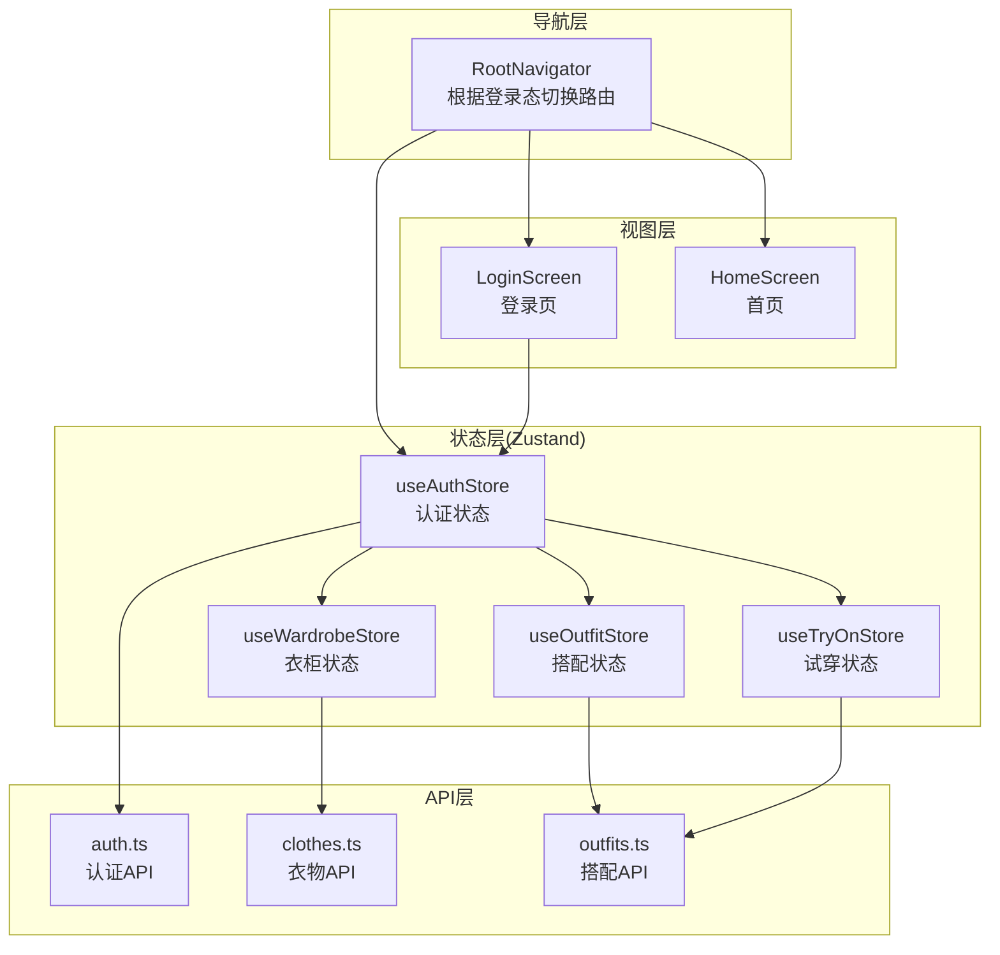
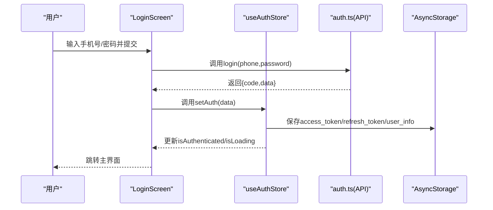
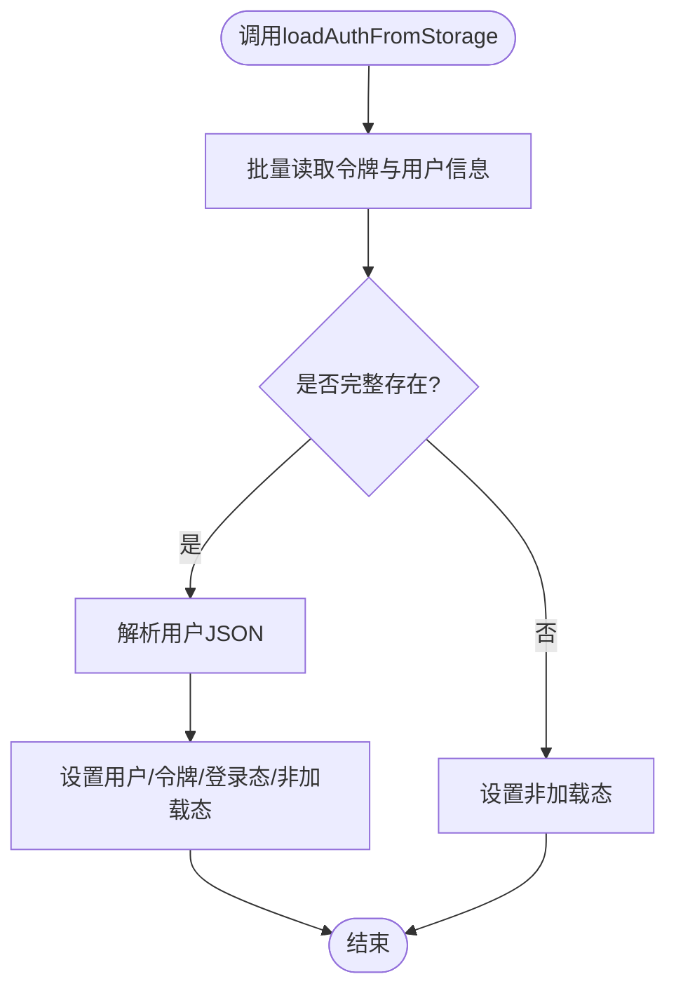
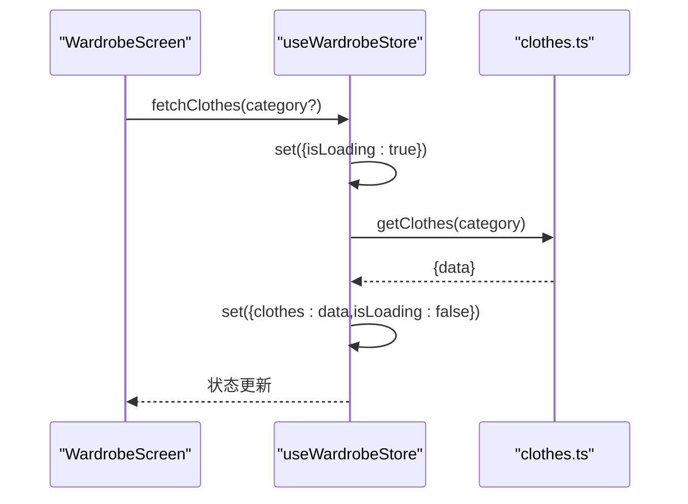
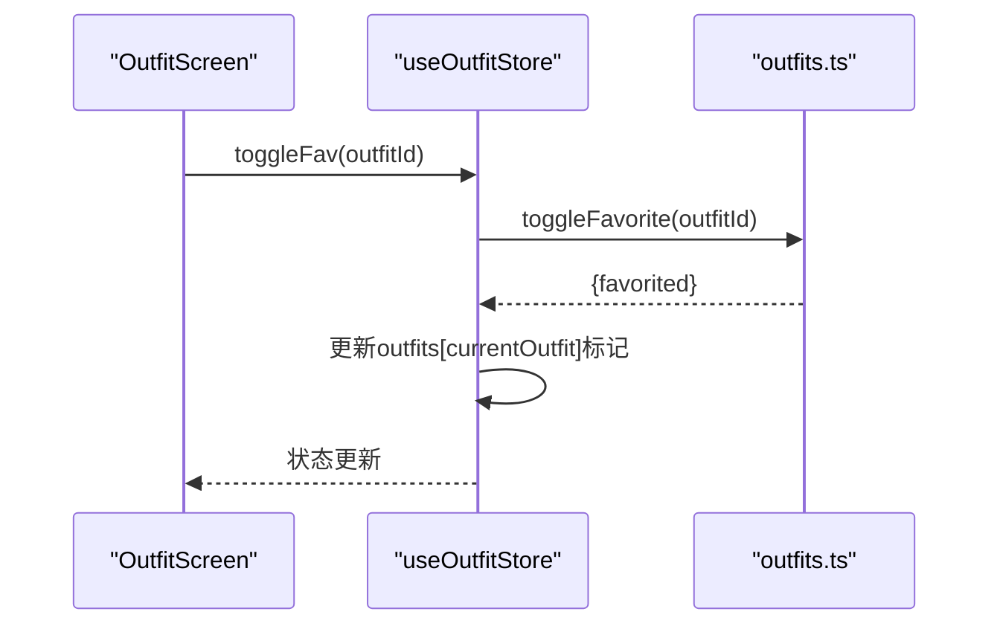
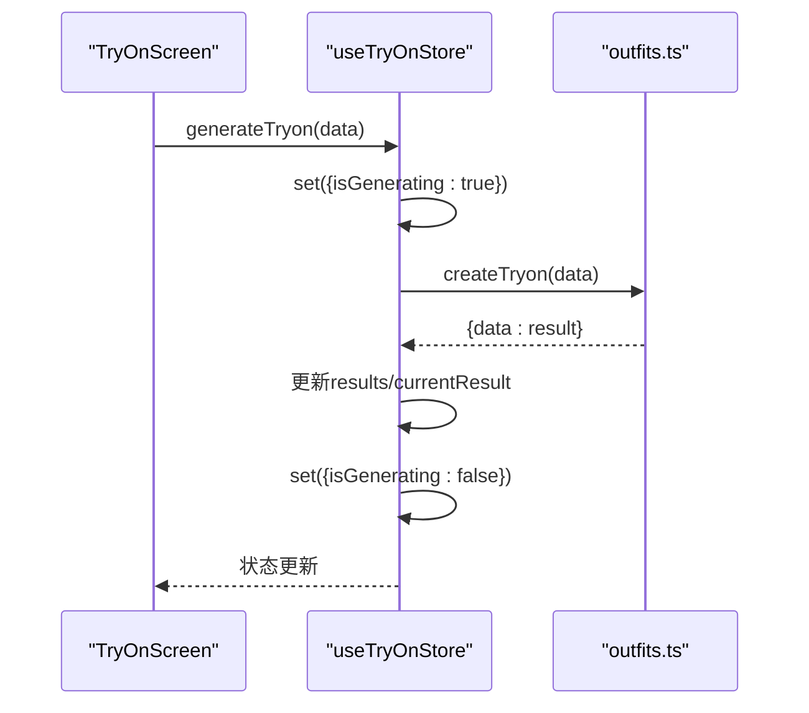
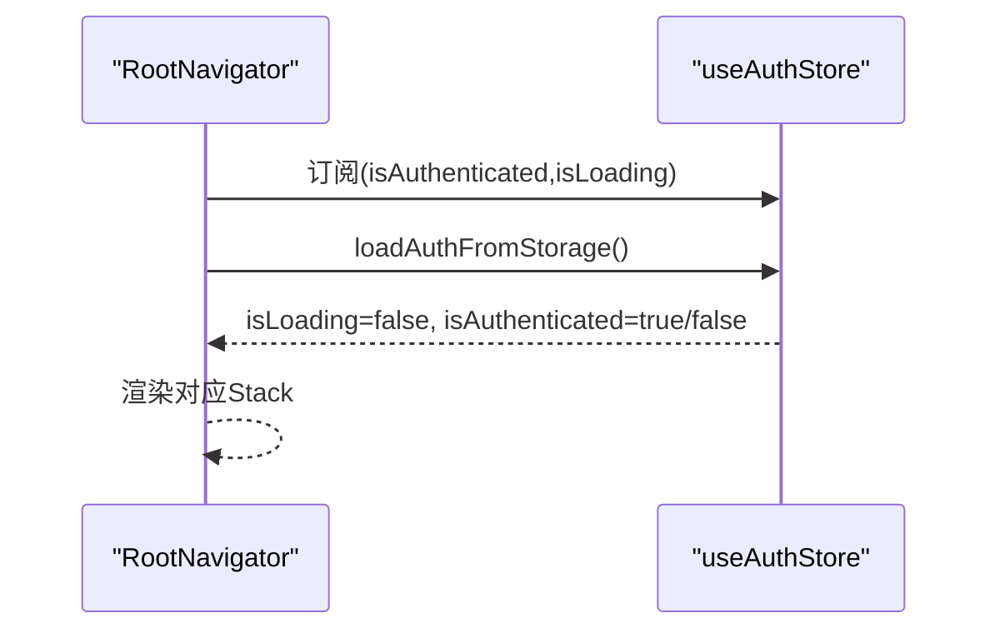
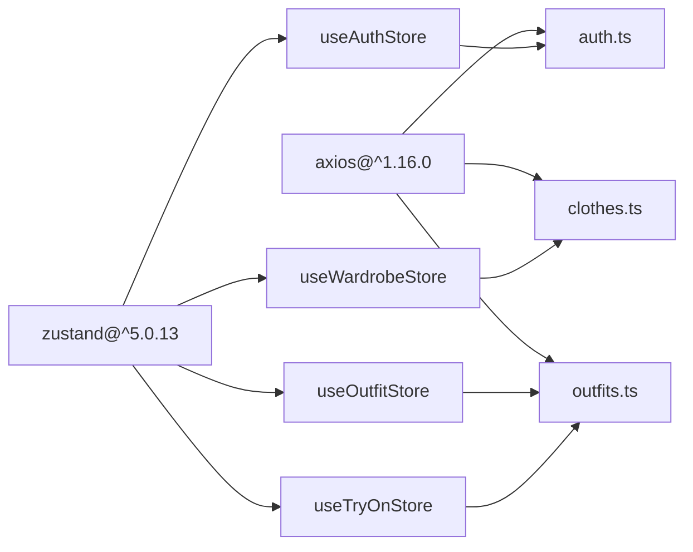

# 状态管理模式与最佳实践

<cite>
**本文引用的文件**
- [FreeDressApp/src/store/authStore.ts](file://FreeDressApp/src/store/authStore.ts)
- [FreeDressApp/src/store/outfitStore.ts](file://FreeDressApp/src/store/outfitStore.ts)
- [FreeDressApp/src/store/tryOnStore.ts](file://FreeDressApp/src/store/tryOnStore.ts)
- [FreeDressApp/src/store/wardrobeStore.ts](file://FreeDressApp/src/store/wardrobeStore.ts)
- [FreeDressApp/src/types/index.ts](file://FreeDressApp/src/types/index.ts)
- [FreeDressApp/src/constants/index.ts](file://FreeDressApp/src/constants/index.ts)
- [FreeDressApp/src/navigation/RootNavigator.tsx](file://FreeDressApp/src/navigation/RootNavigator.tsx)
- [FreeDressApp/src/screens/LoginScreen.tsx](file://FreeDressApp/src/screens/LoginScreen.tsx)
- [FreeDressApp/src/api/auth.ts](file://FreeDressApp/src/api/auth.ts)
- [FreeDressApp/src/api/clothes.ts](file://FreeDressApp/src/api/clothes.ts)
- [FreeDressApp/src/api/outfits.ts](file://FreeDressApp/src/api/outfits.ts)
- [FreeDressApp/package.json](file://FreeDressApp/package.json)
</cite>

## 目录
1. [引言](#引言)
2. [项目结构](#项目结构)
3. [核心组件](#核心组件)
4. [架构总览](#架构总览)
5. [详细组件分析](#详细组件分析)
6. [依赖关系分析](#依赖关系分析)
7. [性能考量](#性能考量)
8. [故障排查指南](#故障排查指南)
9. [结论](#结论)
10. [附录](#附录)

## 引言
本文件面向畅搭(FreeDress)应用的状态管理模式与最佳实践，系统梳理基于Zustand的状态管理方案，覆盖Store创建、状态与动作设计、数据流控制、副作用处理、性能优化、调试与监控、异步与并发控制、错误恢复、以及与导航和API层的集成方式。文档同时提供重构策略与演进路径建议，并给出扩展与迁移至其他状态管理库的指导思路。

## 项目结构
畅搭前端采用React Native + TypeScript构建，状态管理集中在store目录，围绕认证(auth)、衣柜(wardrobe)、搭配(outfit)、AI试穿(tryon)四个业务域划分独立Store；类型与常量集中于types与constants目录；导航由RootNavigator统一调度，按登录态切换主界面或登录注册流程；API层通过axios封装，各模块Store直接消费API返回的数据并更新状态。

图表来源
- [FreeDressApp/src/navigation/RootNavigator.tsx:41-84](file://FreeDressApp/src/navigation/RootNavigator.tsx#L41-L84)
- [FreeDressApp/src/store/authStore.ts:28-122](file://FreeDressApp/src/store/authStore.ts#L28-L122)
- [FreeDressApp/src/store/wardrobeStore.ts:35-82](file://FreeDressApp/src/store/wardrobeStore.ts#L35-L82)
- [FreeDressApp/src/store/outfitStore.ts:32-89](file://FreeDressApp/src/store/outfitStore.ts#L32-L89)
- [FreeDressApp/src/store/tryOnStore.ts:24-58](file://FreeDressApp/src/store/tryOnStore.ts#L24-L58)
- [FreeDressApp/src/api/auth.ts:45-53](file://FreeDressApp/src/api/auth.ts#L45-L53)
- [FreeDressApp/src/api/clothes.ts:30-53](file://FreeDressApp/src/api/clothes.ts#L30-L53)
- [FreeDressApp/src/api/outfits.ts:17-39](file://FreeDressApp/src/api/outfits.ts#L17-L39)

章节来源
- [FreeDressApp/src/navigation/RootNavigator.tsx:41-84](file://FreeDressApp/src/navigation/RootNavigator.tsx#L41-L84)
- [FreeDressApp/src/store/authStore.ts:28-122](file://FreeDressApp/src/store/authStore.ts#L28-L122)
- [FreeDressApp/src/store/wardrobeStore.ts:35-82](file://FreeDressApp/src/store/wardrobeStore.ts#L35-L82)
- [FreeDressApp/src/store/outfitStore.ts:32-89](file://FreeDressApp/src/store/outfitStore.ts#L32-L89)
- [FreeDressApp/src/store/tryOnStore.ts:24-58](file://FreeDressApp/src/store/tryOnStore.ts#L24-L58)

## 核心组件
- 认证状态(useAuthStore)
  - 管理用户信息、访问令牌、刷新令牌、登录态与加载状态
  - 提供设置认证、清除认证、更新用户信息、从本地存储加载等动作
  - 与AsyncStorage持久化结合，支持应用启动时自动恢复登录态
- 衣柜状态(useWardrobeStore)
  - 管理衣物列表、分类统计、活动分类筛选
  - 提供获取衣物、新增、编辑、删除、统计等动作
- 搭配状态(useOutfitStore)
  - 管理搭配列表、收藏列表、当前搭配、加载状态
  - 提供获取搭配、获取收藏、创建搭配、删除搭配、切换收藏等动作
- 试穿状态(useTryOnStore)
  - 管理试穿结果列表、当前结果、加载与生成状态
  - 提供获取结果、生成试穿、设置当前结果等动作

章节来源
- [FreeDressApp/src/store/authStore.ts:9-22](file://FreeDressApp/src/store/authStore.ts#L9-L22)
- [FreeDressApp/src/store/wardrobeStore.ts:21-33](file://FreeDressApp/src/store/wardrobeStore.ts#L21-L33)
- [FreeDressApp/src/store/outfitStore.ts:18-30](file://FreeDressApp/src/store/outfitStore.ts#L18-L30)
- [FreeDressApp/src/store/tryOnStore.ts:13-22](file://FreeDressApp/src/store/tryOnStore.ts#L13-L22)

## 架构总览
Zustand在畅搭中承担“就近就近”的状态管理职责：每个业务域一个Store，动作函数内完成API调用与状态合并，视图组件通过Hook订阅所需状态。导航层根据登录态决定渲染内容，登录页通过调用认证Store的动作完成登录并持久化；主界面内的子模块Store负责各自数据的增删改查与缓存。

图表来源
- [FreeDressApp/src/screens/LoginScreen.tsx:74-92](file://FreeDressApp/src/screens/LoginScreen.tsx#L74-L92)
- [FreeDressApp/src/api/auth.ts:45-53](file://FreeDressApp/src/api/auth.ts#L45-L53)
- [FreeDressApp/src/store/authStore.ts:39-57](file://FreeDressApp/src/store/authStore.ts#L39-L57)

## 详细组件分析

### 认证状态管理(useAuthStore)
- 状态隔离
  - 将用户信息、令牌、登录态与加载态分离为独立字段，避免相互污染
  - 通过loadAuthFromStorage在应用启动时进行幂等恢复，避免重复初始化
- 数据流控制
  - setAuth与clearAuth分别承担登录与登出两条主干流程，保证单一职责
  - updateUser仅做浅合并更新，避免深层对象拷贝开销
- 副作用处理
  - setAuth/clearAuth均同步写入AsyncStorage，确保状态与持久化一致
  - loadAuthFromStorage使用多键读取，异常时安全降级为非加载态
- 设计要点
  - 动作函数内部封装API调用与本地存储，降低视图层复杂度
  - 使用Promise包装异步动作，便于在组件中await

图表来源
- [FreeDressApp/src/store/authStore.ts:97-121](file://FreeDressApp/src/store/authStore.ts#L97-L121)

章节来源
- [FreeDressApp/src/store/authStore.ts:28-122](file://FreeDressApp/src/store/authStore.ts#L28-L122)
- [FreeDressApp/src/constants/index.ts:200-205](file://FreeDressApp/src/constants/index.ts#L200-L205)

### 衣柜状态管理(useWardrobeStore)
- 状态隔离
  - 衣物列表与分类统计拆分，避免统计变更影响列表渲染
  - activeCategory用于筛选，减少不必要的全量刷新
- 数据流控制
  - fetchClothes在请求前后显式设置isLoading，确保UI反馈一致
  - addCloth与removeCloth在成功后主动触发fetchStats，保持统计一致性
- 副作用处理
  - fetchStats捕获异常但不阻断主流程，保证列表加载不受影响
- 设计要点
  - 动作函数内直接调用API，返回Promise以便上层await
  - 编辑动作使用映射替换，避免深度拷贝

图表来源
- [FreeDressApp/src/store/wardrobeStore.ts:43-52](file://FreeDressApp/src/store/wardrobeStore.ts#L43-L52)
- [FreeDressApp/src/api/clothes.ts:34-37](file://FreeDressApp/src/api/clothes.ts#L34-L37)

章节来源
- [FreeDressApp/src/store/wardrobeStore.ts:35-82](file://FreeDressApp/src/store/wardrobeStore.ts#L35-L82)
- [FreeDressApp/src/api/clothes.ts:30-53](file://FreeDressApp/src/api/clothes.ts#L30-L53)

### 搭配状态管理(useOutfitStore)
- 状态隔离
  - outfits与favorites分离，避免收藏切换影响列表渲染
  - currentOutfit独立管理，便于详情页与列表页解耦
- 数据流控制
  - fetchOutfits与fetchFavorites分别维护各自的isLoading
  - createNewOutfit在成功后同时更新列表与当前搭配
- 副作用处理
  - toggleFav仅更新isFavorited标记与当前搭配，避免全量重载
- 设计要点
  - 动作函数内聚合API调用与状态合并，保持组件逻辑简洁

图表来源
- [FreeDressApp/src/store/outfitStore.ts:74-86](file://FreeDressApp/src/store/outfitStore.ts#L74-L86)
- [FreeDressApp/src/api/outfits.ts:33-35](file://FreeDressApp/src/api/outfits.ts#L33-L35)

章节来源
- [FreeDressApp/src/store/outfitStore.ts:32-89](file://FreeDressApp/src/store/outfitStore.ts#L32-L89)
- [FreeDressApp/src/api/outfits.ts:17-39](file://FreeDressApp/src/api/outfits.ts#L17-L39)

### 试穿状态管理(useTryOnStore)
- 状态隔离
  - results与currentResult分离，支持列表与详情页独立渲染
  - isGenerating与isLoading区分不同阶段的加载态
- 数据流控制
  - generateTryon在生成过程中设置isGenerating，finally中清理
  - fetchResults在请求前后设置isLoading
- 副作用处理
  - 生成成功后立即更新results与currentResult，保证即时可见
- 设计要点
  - 动作函数内直接调用API，返回Promise以便上层await

图表来源
- [FreeDressApp/src/store/tryOnStore.ts:42-55](file://FreeDressApp/src/store/tryOnStore.ts#L42-L55)
- [FreeDressApp/src/api/outfits.ts:17-19](file://FreeDressApp/src/api/outfits.ts#L17-L19)

章节来源
- [FreeDressApp/src/store/tryOnStore.ts:24-58](file://FreeDressApp/src/store/tryOnStore.ts#L24-L58)
- [FreeDressApp/src/api/outfits.ts:17-19](file://FreeDressApp/src/api/outfits.ts#L17-L19)

### 导航与状态联动(RootNavigator)
- 登录态驱动路由
  - RootNavigator订阅useAuthStore的isAuthenticated与isLoading，在加载完成后决定显示主界面还是登录注册流程
- 启动时加载
  - 在首次挂载时调用loadAuthFromStorage，实现无感恢复

图表来源
- [FreeDressApp/src/navigation/RootNavigator.tsx:42-51](file://FreeDressApp/src/navigation/RootNavigator.tsx#L42-L51)

章节来源
- [FreeDressApp/src/navigation/RootNavigator.tsx:41-84](file://FreeDressApp/src/navigation/RootNavigator.tsx#L41-L84)
- [FreeDressApp/src/store/authStore.ts:97-121](file://FreeDressApp/src/store/authStore.ts#L97-L121)

## 依赖关系分析
- 外部依赖
  - Zustand版本：^5.0.13
  - Async Storage：@react-native-async-storage/async-storage ^1.24.0
  - Axios：axios ^1.16.0
- 内部依赖
  - Store之间通过API层间接耦合，避免直接互相依赖
  - 类型与常量集中管理，降低跨模块耦合

图表来源
- [FreeDressApp/package.json:12-30](file://FreeDressApp/package.json#L12-L30)
- [FreeDressApp/src/store/authStore.ts:1-4](file://FreeDressApp/src/store/authStore.ts#L1-L4)
- [FreeDressApp/src/store/wardrobeStore.ts:1-11](file://FreeDressApp/src/store/wardrobeStore.ts#L1-L11)
- [FreeDressApp/src/store/outfitStore.ts:1-10](file://FreeDressApp/src/store/outfitStore.ts#L1-L10)
- [FreeDressApp/src/store/tryOnStore.ts:1-3](file://FreeDressApp/src/store/tryOnStore.ts#L1-L3)
- [FreeDressApp/src/api/auth.ts:1-2](file://FreeDressApp/src/api/auth.ts#L1-L2)
- [FreeDressApp/src/api/clothes.ts:1-2](file://FreeDressApp/src/api/clothes.ts#L1-L2)
- [FreeDressApp/src/api/outfits.ts:1-2](file://FreeDressApp/src/api/outfits.ts#L1-L2)

章节来源
- [FreeDressApp/package.json:12-30](file://FreeDressApp/package.json#L12-L30)

## 性能考量
- 状态粒度与渲染优化
  - 将列表与详情状态分离，避免列表频繁重渲染
  - 使用局部状态与浅比较，减少不必要的重渲染
- 异步与并发控制
  - 在动作函数内显式设置isLoading/isGenerating，确保UI稳定反馈
  - 对于可能并发的操作，建议引入去抖/节流或请求去重策略（见“重构策略”）
- 内存管理
  - 定期清理历史结果与临时状态，避免无限增长
  - 对大列表采用分页或虚拟化列表(如已使用FlashList)降低内存占用
- 网络与缓存
  - API层统一拦截与错误处理，Store内仅做状态合并，避免重复请求
  - 对热点数据可考虑内存缓存与失效策略

## 故障排查指南
- 登录后仍显示登录页
  - 检查setAuth是否成功写入令牌与用户信息
  - 确认AsyncStorage键名与STORAGE_KEYS一致
- 加载态未消失
  - 确保所有异步动作在finally或catch后设置非加载态
- 收藏切换无效
  - 检查toggleFavorite返回值与outfitId匹配
- 试穿生成无响应
  - 确认generateTryon在finally中清理isGenerating
- 导航切换异常
  - 检查RootNavigator中loadAuthFromStorage是否执行且无异常

章节来源
- [FreeDressApp/src/store/authStore.ts:39-78](file://FreeDressApp/src/store/authStore.ts#L39-L78)
- [FreeDressApp/src/store/outfitStore.ts:74-86](file://FreeDressApp/src/store/outfitStore.ts#L74-L86)
- [FreeDressApp/src/store/tryOnStore.ts:42-55](file://FreeDressApp/src/store/tryOnStore.ts#L42-L55)
- [FreeDressApp/src/navigation/RootNavigator.tsx:44-47](file://FreeDressApp/src/navigation/RootNavigator.tsx#L44-L47)

## 结论
畅搭基于Zustand的状态管理方案以“就近管理、动作聚合、状态隔离”为核心，实现了认证、衣柜、搭配、试穿四大领域的清晰职责划分。通过与导航层、API层的协同，形成从登录态恢复到业务数据流转的闭环。建议在后续迭代中进一步完善并发控制、错误恢复与调试监控能力，并评估引入中间件或可观测性工具以提升可维护性与稳定性。

## 附录

### 最佳实践清单
- 状态结构设计
  - 将列表与详情、加载态与数据态分离，避免混杂
  - 使用明确的初始值与边界条件处理
- 动作函数设计
  - 将API调用与状态合并放在动作内，保持组件简洁
  - 显式设置加载态并在finally中清理
- 性能优化
  - 使用局部状态与浅比较，避免深层对象拷贝
  - 对大列表采用虚拟化或分页
- 并发与错误恢复
  - 对并发请求引入去重或队列策略
  - 对异常进行分类处理并提供回退方案
- 调试与监控
  - 在开发环境启用严格模式与日志输出
  - 对关键动作添加时间戳与上下文信息，便于追踪

### 重构策略与演进路径
- 从Zustand迁移到Redux Toolkit
  - 将动作与Reducer拆分为独立模块，引入createSlice与createAsyncThunk
  - 使用RTK Query替代手写API动作，统一缓存与并发控制
- 引入中间件
  - 开发期引入日志中间件，生产期引入错误边界与性能监控中间件
- 状态持久化
  - 使用Redux Persist或Zustand持久化插件，支持选择性持久化与序列化策略
- 并发控制
  - 引入请求去重、超时与重试策略，避免重复请求与雪崩效应
- 可观测性
  - 集成性能分析工具，记录状态变更轨迹与渲染耗时

### 与导航和API的集成要点
- 导航联动
  - 在RootNavigator中订阅认证状态，实现登录态驱动的路由切换
  - 在登录页调用认证Store的动作完成登录并持久化
- API集成
  - Store动作内直接调用API，返回Promise以便上层await
  - 对API错误进行统一处理并映射到Store状态

章节来源
- [FreeDressApp/src/navigation/RootNavigator.tsx:41-84](file://FreeDressApp/src/navigation/RootNavigator.tsx#L41-L84)
- [FreeDressApp/src/screens/LoginScreen.tsx:74-92](file://FreeDressApp/src/screens/LoginScreen.tsx#L74-L92)
- [FreeDressApp/src/api/auth.ts:45-53](file://FreeDressApp/src/api/auth.ts#L45-L53)
- [FreeDressApp/src/store/authStore.ts:39-57](file://FreeDressApp/src/store/authStore.ts#L39-L57)