# 衣橱状态管理

<cite>
**本文档引用的文件**
- [wardrobeStore.ts](file://FreeDressApp/src/store/wardrobeStore.ts)
- [index.ts](file://FreeDressApp/src/types/index.ts)
- [clothes.ts](file://FreeDressApp/src/api/clothes.ts)
- [WardrobeScreen.tsx](file://FreeDressApp/src/screens/WardrobeScreen.tsx)
- [ClothDetailSheet.tsx](file://FreeDressApp/src/components/ClothDetailSheet.tsx)
- [index.ts](file://FreeDressApp/src/constants/index.ts)
- [WardrobeStack.tsx](file://FreeDressApp/src/navigation/WardrobeStack.tsx)
- [AddClothingScreen.tsx](file://FreeDressApp/src/screens/AddClothingScreen.tsx)
- [axios.ts](file://FreeDressApp/src/api/axios.ts)
- [upload.ts](file://FreeDressApp/src/api/upload.ts)
- [clothes.controller.ts](file://backend/src/modules/clothes/clothes.controller.ts)
- [clothes.service.ts](file://backend/src/modules/clothes/clothes.service.ts)
- [create-cloth.dto.ts](file://backend/src/modules/clothes/dto/create-cloth.dto.ts)
- [update-cloth.dto.ts](file://backend/src/modules/clothes/dto/update-cloth.dto.ts)
</cite>

## 目录
1. [简介](#简介)
2. [项目结构概览](#项目结构概览)
3. [核心组件架构](#核心组件架构)
4. [数据模型与类型定义](#数据模型与类型定义)
5. [状态管理实现](#状态管理实现)
6. [UI组件集成](#ui组件集成)
7. [API交互机制](#api交互机制)
8. [搜索与过滤功能](#搜索与过滤功能)
9. [分类管理](#分类管理)
10. [数据同步与缓存策略](#数据同步与缓存策略)
11. [性能优化策略](#性能优化策略)
12. [错误处理与最佳实践](#错误处理与最佳实践)
13. [扩展与定制指南](#扩展与定制指南)
14. [总结](#总结)

## 简介

FreeDress衣橱状态管理系统是一个基于React Native和NestJS构建的现代化衣橱管理应用。该系统通过Zustand状态管理库实现了高效的衣物数据状态管理，提供了完整的增删改查操作、分类管理、搜索过滤和实时数据同步功能。系统采用前后端分离架构，前端使用TypeScript进行强类型开发，后端使用NestJS框架提供RESTful API服务。

## 项目结构概览

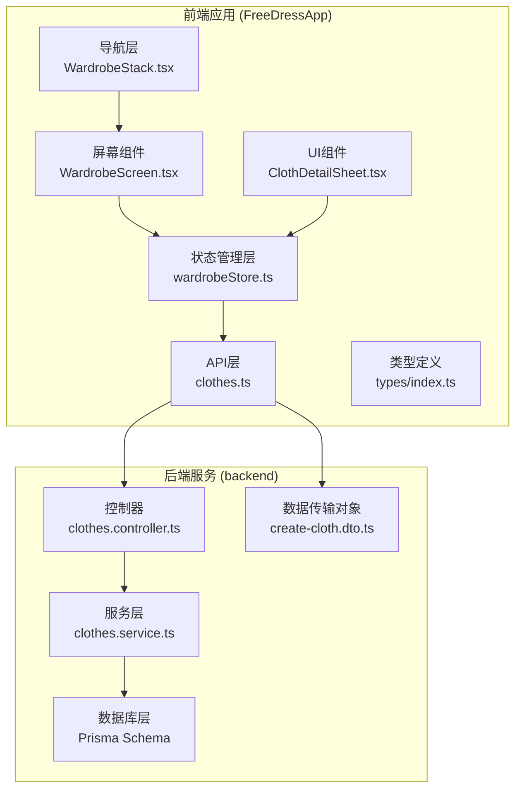

**图表来源**
- [wardrobeStore.ts:1-83](file://FreeDressApp/src/store/wardrobeStore.ts#L1-L83)
- [clothes.ts:1-54](file://FreeDressApp/src/api/clothes.ts#L1-L54)
- [WardrobeScreen.tsx:1-423](file://FreeDressApp/src/screens/WardrobeScreen.tsx#L1-L423)

**章节来源**
- [wardrobeStore.ts:1-83](file://FreeDressApp/src/store/wardrobeStore.ts#L1-L83)
- [index.ts:1-98](file://FreeDressApp/src/types/index.ts#L1-L98)

## 核心组件架构

### 状态管理架构图

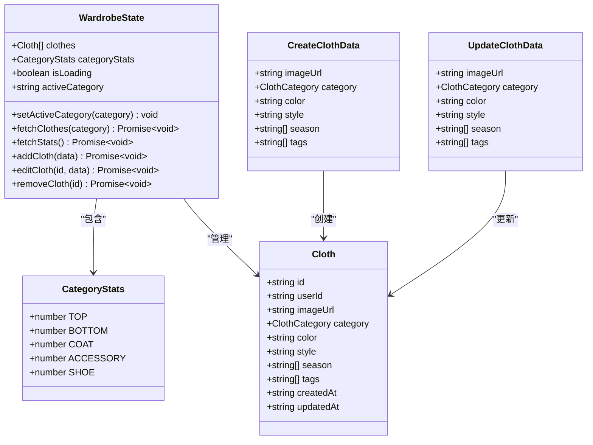

**图表来源**
- [wardrobeStore.ts:21-33](file://FreeDressApp/src/store/wardrobeStore.ts#L21-L33)
- [index.ts:18-33](file://FreeDressApp/src/types/index.ts#L18-L33)

### 数据流架构图

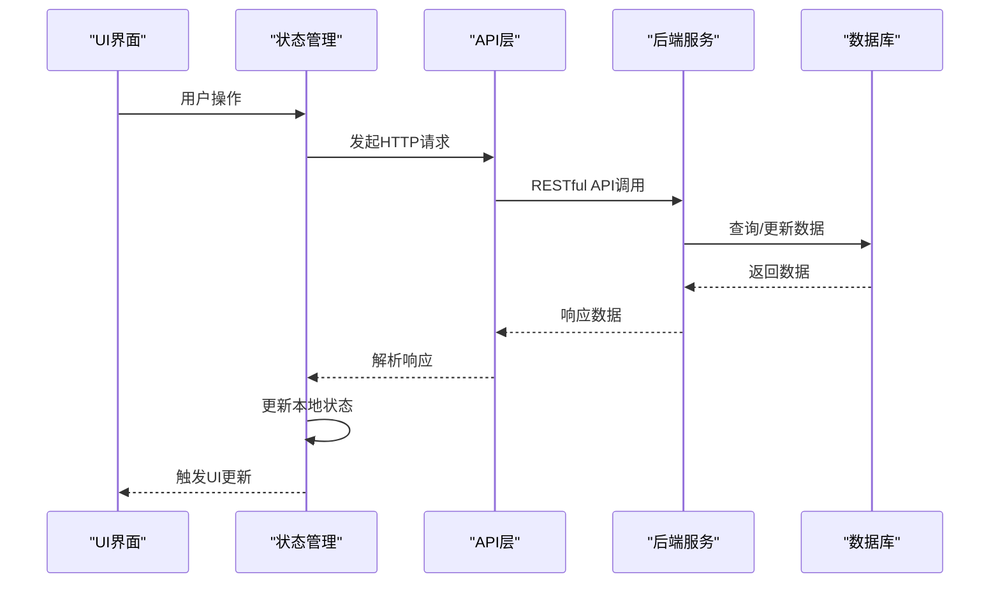

**图表来源**
- [WardrobeScreen.tsx:40-107](file://FreeDressApp/src/screens/WardrobeScreen.tsx#L40-L107)
- [wardrobeStore.ts:35-82](file://FreeDressApp/src/store/wardrobeStore.ts#L35-L82)

## 数据模型与类型定义

### 衣物数据模型

系统的核心数据模型围绕`Cloth`接口构建，定义了完整的衣物信息结构：

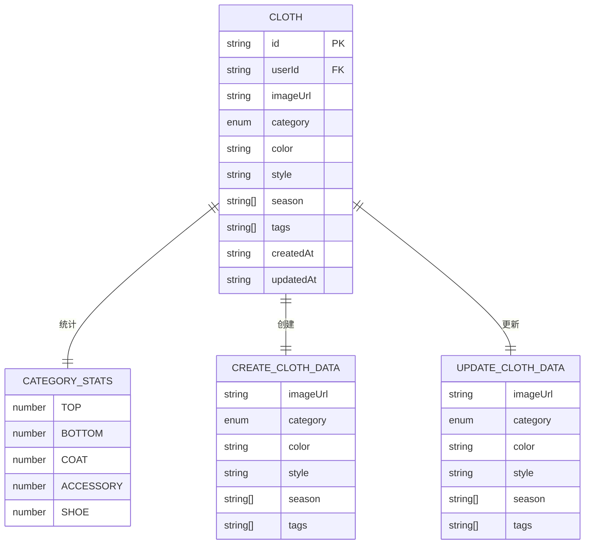

**图表来源**
- [index.ts:21-33](file://FreeDressApp/src/types/index.ts#L21-L33)
- [index.ts:13-19](file://FreeDressApp/src/types/index.ts#L13-L19)

### 衣物分类体系

系统支持五种标准衣物分类，每种分类都有对应的中文标签和简写标识：

| 分类代码 | 中文名称 | 英文简写 | 图标 |
|---------|---------|---------|------|
| TOP | 上衣 | TOP | tshirt |
| BOTTOM | 下装 | BOTTOM | user |
| COAT | 外套 | COAT | archive |
| ACCESSORY | 配饰 | ACC | gem |
| SHOE | 鞋子 | SHOES | shoe-prints |

**章节来源**
- [index.ts:18-33](file://FreeDressApp/src/types/index.ts#L18-L33)
- [index.ts:176-183](file://FreeDressApp/src/constants/index.ts#L176-L183)

## 状态管理实现

### Zustand状态管理器

wardrobeStore使用Zustand实现了轻量级但功能强大的状态管理：

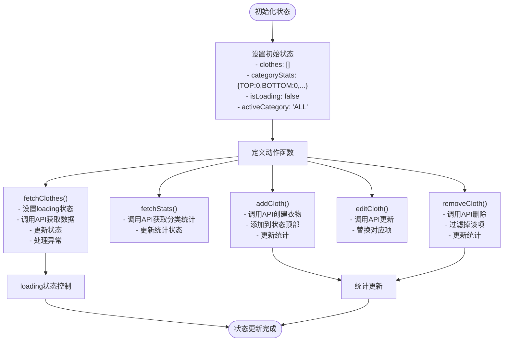

**图表来源**
- [wardrobeStore.ts:35-82](file://FreeDressApp/src/store/wardrobeStore.ts#L35-L82)

### 状态更新流程

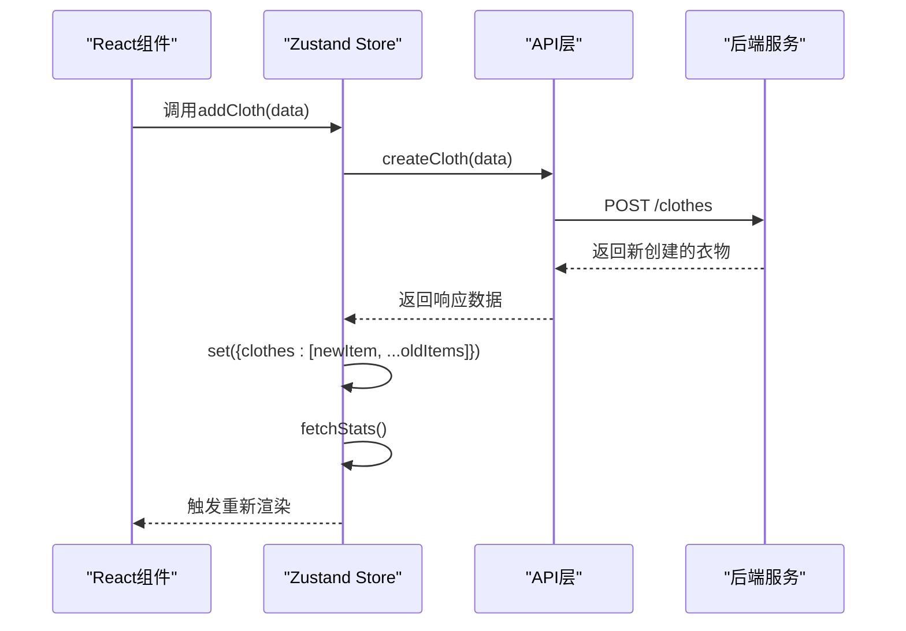

**图表来源**
- [wardrobeStore.ts:64-68](file://FreeDressApp/src/store/wardrobeStore.ts#L64-L68)

**章节来源**
- [wardrobeStore.ts:1-83](file://FreeDressApp/src/store/wardrobeStore.ts#L1-L83)

## UI组件集成

### 衣橱主界面

WardrobeScreen作为主要的UI入口，集成了完整的衣橱管理功能：

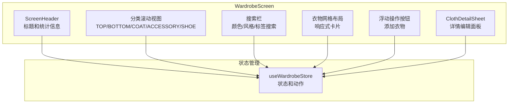

**图表来源**
- [WardrobeScreen.tsx:40-258](file://FreeDressApp/src/screens/WardrobeScreen.tsx#L40-L258)

### 详情编辑面板

ClothDetailSheet提供了完整的衣物详情查看和编辑功能：

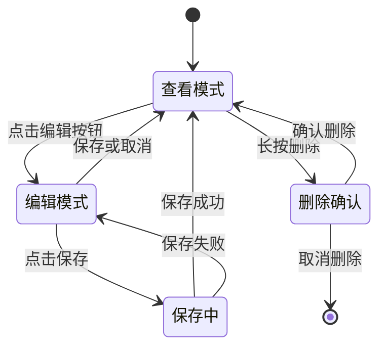

**图表来源**
- [ClothDetailSheet.tsx:29-86](file://FreeDressApp/src/components/ClothDetailSheet.tsx#L29-L86)

**章节来源**
- [WardrobeScreen.tsx:1-423](file://FreeDressApp/src/screens/WardrobeScreen.tsx#L1-L423)
- [ClothDetailSheet.tsx:1-353](file://FreeDressApp/src/components/ClothDetailSheet.tsx#L1-L353)

## API交互机制

### 前端API层设计

前端使用Axios封装了统一的API客户端，提供了完整的HTTP请求处理能力：

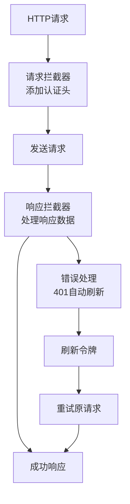

**图表来源**
- [axios.ts:24-105](file://FreeDressApp/src/api/axios.ts#L24-L105)

### 后端API架构

后端使用NestJS框架实现了RESTful API服务，提供了完整的CRUD操作：

```mermaid
classDiagram
class ClothesController {
+create(createClothDto) ApiResponse~Cloth~
+findAll(category?) ApiResponse~Cloth[]~
+findOne(id) ApiResponse~Cloth~
+update(id, updateClothDto) ApiResponse~Cloth~
+remove(id) ApiResponse~{message}~
+getCategoryStats() ApiResponse~CategoryStats~
}
class ClothesService {
+create(userId, createClothDto) Promise~Cloth~
+findAll(userId, category?) Promise~Cloth[]~
+findOne(id, userId) Promise~Cloth~
+update(id, userId, updateClothDto) Promise~Cloth~
+remove(id, userId) Promise~{message}~
+getCategoryStats(userId) Promise~CategoryStats~
}
class PrismaService {
+cloth.create() Prisma~
+cloth.findMany() Prisma~
+cloth.findUnique() Prisma~
+cloth.update() Prisma~
+cloth.delete() Prisma~
+cloth.groupBy() Prisma~
}
ClothesController --> ClothesService : "依赖"
ClothesService --> PrismaService : "使用"
```

**图表来源**
- [clothes.controller.ts:28-101](file://backend/src/modules/clothes/clothes.controller.ts#L28-L101)
- [clothes.service.ts:12-147](file://backend/src/modules/clothes/clothes.service.ts#L12-L147)

**章节来源**
- [clothes.ts:1-54](file://FreeDressApp/src/api/clothes.ts#L1-L54)
- [axios.ts:1-108](file://FreeDressApp/src/api/axios.ts#L1-L108)
- [clothes.controller.ts:1-102](file://backend/src/modules/clothes/clothes.controller.ts#L1-L102)

## 搜索与过滤功能

### 智能搜索算法

系统实现了多维度的智能搜索功能，支持颜色、风格和标签的组合搜索：

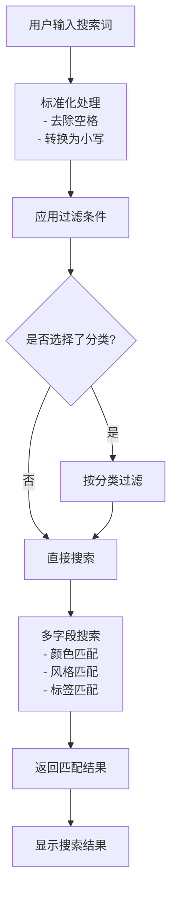

**图表来源**
- [WardrobeScreen.tsx:61-76](file://FreeDressApp/src/screens/WardrobeScreen.tsx#L61-L76)

### 实时搜索优化

系统使用`useMemo`和`useCallback`优化了搜索性能：

- **useMemo**: 缓存过滤结果，避免重复计算
- **useCallback**: 缓存回调函数，防止不必要的组件重渲染
- **防抖处理**: 搜索输入采用防抖机制，减少API调用频率

**章节来源**
- [WardrobeScreen.tsx:61-90](file://FreeDressApp/src/screens/WardrobeScreen.tsx#L61-L90)

## 分类管理

### 分类统计系统

系统实现了完整的分类统计功能，为用户提供直观的衣橱概览：

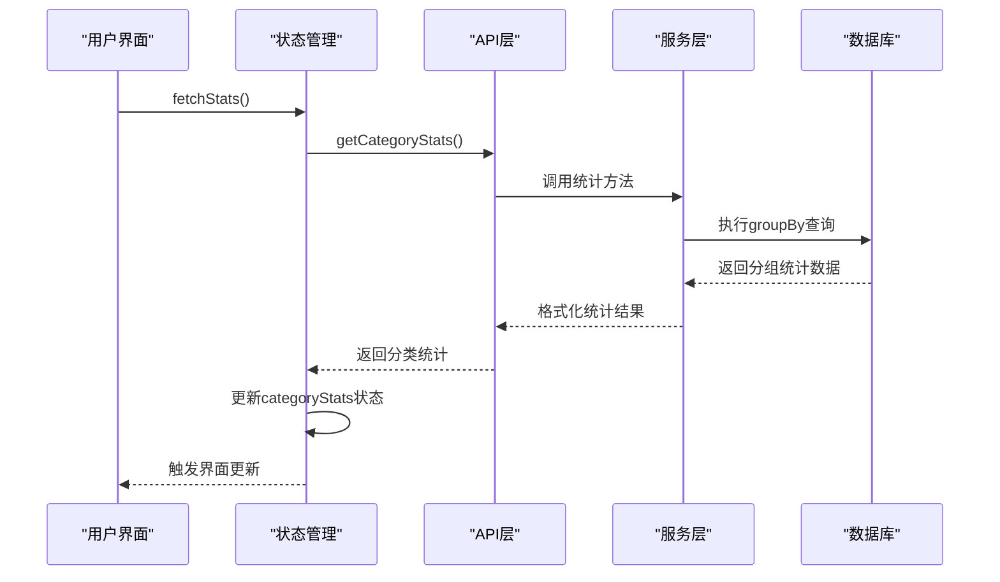

**图表来源**
- [wardrobeStore.ts:55-62](file://FreeDressApp/src/store/wardrobeStore.ts#L55-L62)
- [clothes.service.ts:123-146](file://backend/src/modules/clothes/clothes.service.ts#L123-L146)

### 分类导航系统

系统提供了直观的分类导航界面，支持快速切换不同的衣物分类：

- **分类标签**: 使用彩色标签展示不同分类
- **分类统计**: 显示每个分类的衣物数量
- **动态高亮**: 当前选中的分类会高亮显示
- **响应式布局**: 支持横向滚动查看更多分类

**章节来源**
- [WardrobeScreen.tsx:31-38](file://FreeDressApp/src/screens/WardrobeScreen.tsx#L31-L38)
- [index.ts:176-183](file://FreeDressApp/src/constants/index.ts#L176-L183)

## 数据同步与缓存策略

### 实时数据同步

系统采用了多种策略确保数据的实时性和一致性：

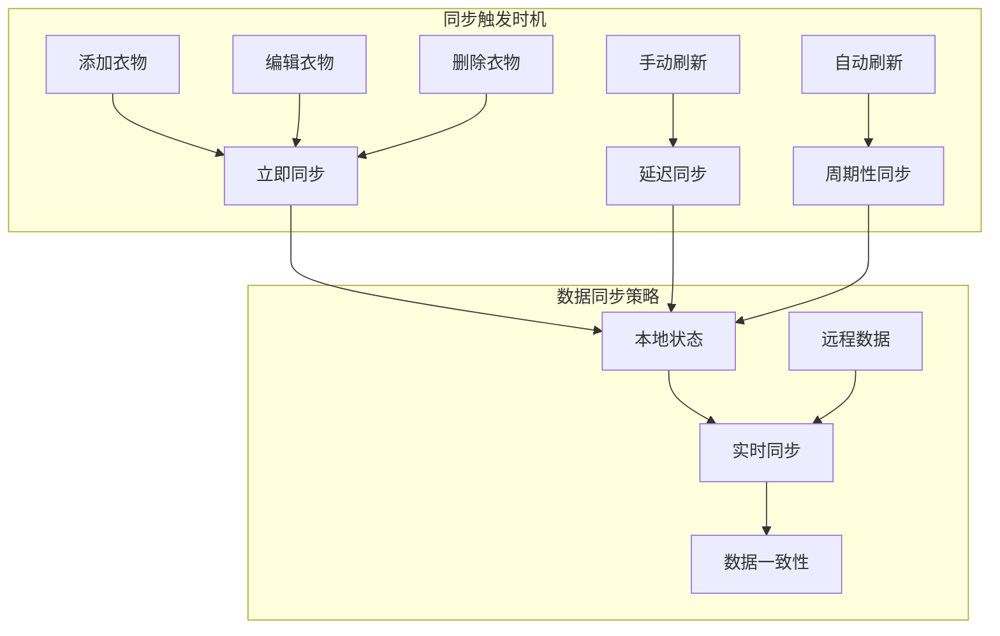

**图表来源**
- [wardrobeStore.ts:64-81](file://FreeDressApp/src/store/wardrobeStore.ts#L64-L81)

### 缓存策略

系统实现了多层次的缓存策略来提升性能：

1. **内存缓存**: Zustand状态管理器中的本地状态缓存
2. **网络缓存**: Axios拦截器中的请求缓存机制
3. **持久化缓存**: Async Storage中的用户认证信息缓存

**章节来源**
- [axios.ts:24-38](file://FreeDressApp/src/api/axios.ts#L24-L38)
- [index.ts:200-205](file://FreeDressApp/src/constants/index.ts#L200-L205)

## 性能优化策略

### 渲染性能优化

系统采用了多种技术来优化渲染性能：

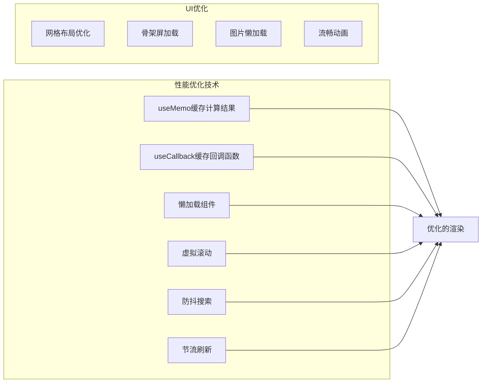

### 内存管理技巧

系统实现了有效的内存管理策略：

1. **状态清理**: 组件卸载时自动清理状态
2. **图片优化**: 使用适当的图片尺寸和格式
3. **事件监听**: 及时移除不需要的事件监听器
4. **定时器管理**: 合理管理定时器和异步任务

**章节来源**
- [WardrobeScreen.tsx:61-76](file://FreeDressApp/src/screens/WardrobeScreen.tsx#L61-L76)
- [ClothDetailSheet.tsx:37-44](file://FreeDressApp/src/components/ClothDetailSheet.tsx#L37-L44)

## 错误处理与最佳实践

### 错误处理机制

系统建立了完善的错误处理机制：

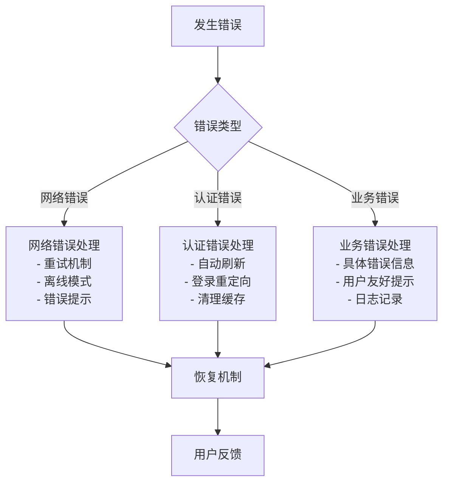

**图表来源**
- [axios.ts:49-105](file://FreeDressApp/src/api/axios.ts#L49-L105)

### 最佳实践指南

#### 数据验证
- **前端验证**: 输入数据的即时验证和错误提示
- **后端验证**: DTO验证确保数据完整性
- **类型安全**: TypeScript确保类型安全

#### 用户体验
- **加载状态**: 明确的加载指示器
- **错误反馈**: 友好的错误提示信息
- **操作确认**: 关键操作的二次确认

#### 性能考虑
- **批量操作**: 支持批量删除和更新
- **分页加载**: 大数据集的分页处理
- **缓存策略**: 合理的缓存和同步策略

**章节来源**
- [AddClothingScreen.tsx:61-87](file://FreeDressApp/src/screens/AddClothingScreen.tsx#L61-L87)
- [axios.ts:49-105](file://FreeDressApp/src/api/axios.ts#L49-L105)

## 扩展与定制指南

### 功能扩展建议

#### 新增属性
要为衣物添加新的属性，需要：

1. **类型定义**: 在`types/index.ts`中更新`Cloth`接口
2. **状态管理**: 在`wardrobeStore.ts`中更新状态结构
3. **API层**: 在`clothes.ts`中更新DTO定义
4. **UI组件**: 更新相关的表单和显示组件

#### 新增分类
要添加新的衣物分类：

1. **类型定义**: 在`types/index.ts`中更新`ClothCategory`类型
2. **常量定义**: 在`constants/index.ts`中添加新的分类选项
3. **UI适配**: 更新分类标签和图标
4. **后端支持**: 在数据库schema中添加新的枚举值

### 定制化方案

#### 主题定制
系统支持灵活的主题定制：

- **颜色系统**: 通过`COLORS`常量统一管理
- **字体系统**: 支持不同平台的字体适配
- **间距系统**: 基于4px网格的间距规范
- **圆角系统**: 统一的圆角半径规范

#### 功能定制
可以根据需求定制以下功能：

- **搜索增强**: 添加更多搜索条件和过滤器
- **排序选项**: 支持按不同字段排序
- **批量操作**: 批量删除、编辑、导出等功能
- **导入导出**: 支持Excel等格式的数据导入导出

**章节来源**
- [index.ts:15-52](file://FreeDressApp/src/constants/index.ts#L15-L52)
- [index.ts:176-198](file://FreeDressApp/src/constants/index.ts#L176-L198)

## 总结

FreeDress衣橱状态管理系统展现了现代移动应用开发的最佳实践。通过精心设计的状态管理架构、完善的API交互机制、智能化的搜索过滤功能和高效的性能优化策略，系统为用户提供了流畅、可靠的衣橱管理体验。

### 核心优势

1. **架构清晰**: 前后端分离，职责明确
2. **状态管理**: 使用Zustand实现轻量级状态管理
3. **类型安全**: TypeScript提供完整的类型安全保障
4. **用户体验**: 丰富的UI组件和流畅的交互体验
5. **性能优化**: 多层次的性能优化策略
6. **扩展性强**: 模块化设计便于功能扩展

### 技术亮点

- **实时同步**: 确保数据的一致性和实时性
- **智能搜索**: 支持多维度的智能搜索功能
- **分类管理**: 完整的分类统计和导航系统
- **错误处理**: 健壮的错误处理和恢复机制
- **性能优化**: 多种性能优化技术和策略

该系统为开发者提供了一个优秀的参考实现，展示了如何构建一个功能完整、性能优异的衣橱管理应用。通过遵循本文档的指导，开发者可以轻松地扩展和定制系统功能，满足不同场景下的需求。