# 认证状态管理

<cite>
**本文档引用的文件**
- [authStore.ts](file://FreeDressApp/src/store/authStore.ts)
- [auth.ts](file://FreeDressApp/src/api/auth.ts)
- [axios.ts](file://FreeDressApp/src/api/axios.ts)
- [users.ts](file://FreeDressApp/src/api/users.ts)
- [index.ts](file://FreeDressApp/src/constants/index.ts)
- [index.ts](file://FreeDressApp/src/types/index.ts)
- [LoginScreen.tsx](file://FreeDressApp/src/screens/LoginScreen.tsx)
- [RegisterScreen.tsx](file://FreeDressApp/src/screens/RegisterScreen.tsx)
- [RootNavigator.tsx](file://FreeDressApp/src/navigation/RootNavigator.tsx)
- [ProfileScreen.tsx](file://FreeDressApp/src/screens/ProfileScreen.tsx)
- [MainTabNavigator.tsx](file://FreeDressApp/src/navigation/MainTabNavigator.tsx)
</cite>

## 目录
1. [简介](#简介)
2. [项目结构](#项目结构)
3. [核心组件](#核心组件)
4. [架构概览](#架构概览)
5. [详细组件分析](#详细组件分析)
6. [依赖关系分析](#依赖关系分析)
7. [性能考量](#性能考量)
8. [故障排除指南](#故障排除指南)
9. [结论](#结论)
10. [附录](#附录)

## 简介

畅搭(FreeDress)认证状态管理系统是基于React Native和Zustand的状态管理解决方案，负责管理用户的认证状态、JWT令牌管理和本地数据持久化。该系统实现了完整的认证生命周期管理，包括用户登录、注册、令牌刷新、状态同步和清理等功能。

系统采用现代化的前端架构模式，通过Zustand提供轻量级的状态管理，结合AsyncStorage实现数据持久化，通过Axios拦截器自动处理认证令牌的添加和刷新机制。

## 项目结构

认证状态管理相关的文件组织结构如下：

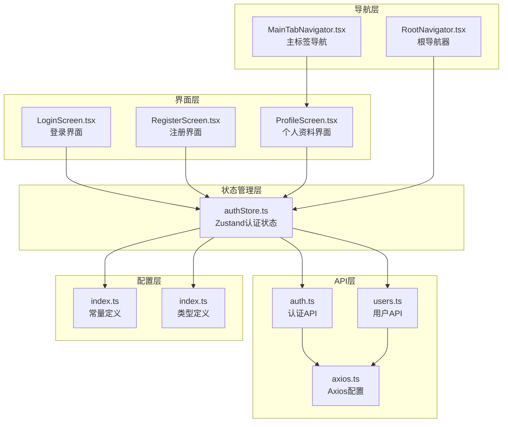

**图表来源**
- [authStore.ts:1-123](file://FreeDressApp/src/store/authStore.ts#L1-L123)
- [auth.ts:1-101](file://FreeDressApp/src/api/auth.ts#L1-L101)
- [axios.ts:1-108](file://FreeDressApp/src/api/axios.ts#L1-L108)

**章节来源**
- [authStore.ts:1-123](file://FreeDressApp/src/store/authStore.ts#L1-L123)
- [auth.ts:1-101](file://FreeDressApp/src/api/auth.ts#L1-L101)
- [axios.ts:1-108](file://FreeDressApp/src/api/axios.ts#L1-L108)

## 核心组件

### 认证状态接口定义

认证状态管理的核心接口定义了完整的状态结构和操作方法：

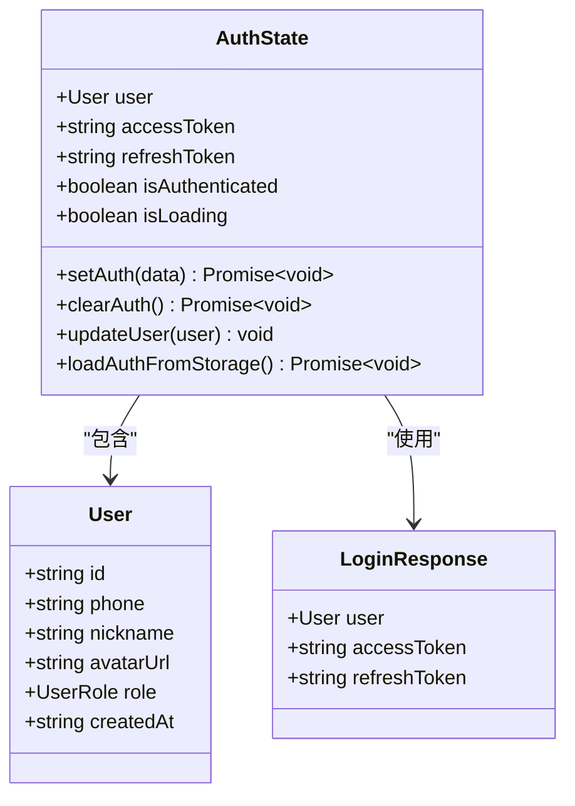

**图表来源**
- [authStore.ts:9-22](file://FreeDressApp/src/store/authStore.ts#L9-L22)
- [index.ts:8-16](file://FreeDressApp/src/types/index.ts#L8-L16)
- [index.ts:66-71](file://FreeDressApp/src/types/index.ts#L66-L71)

### 状态管理策略

系统采用Zustand作为状态管理库，提供了以下核心特性：
- **轻量级**: 相比Redux更简洁的API
- **模块化**: 支持状态分割和组合
- **类型安全**: 完整的TypeScript支持
- **异步操作**: 内置对Promise的支持

**章节来源**
- [authStore.ts:28-122](file://FreeDressApp/src/store/authStore.ts#L28-L122)

## 架构概览

认证系统的整体架构采用分层设计，确保关注点分离和代码的可维护性：

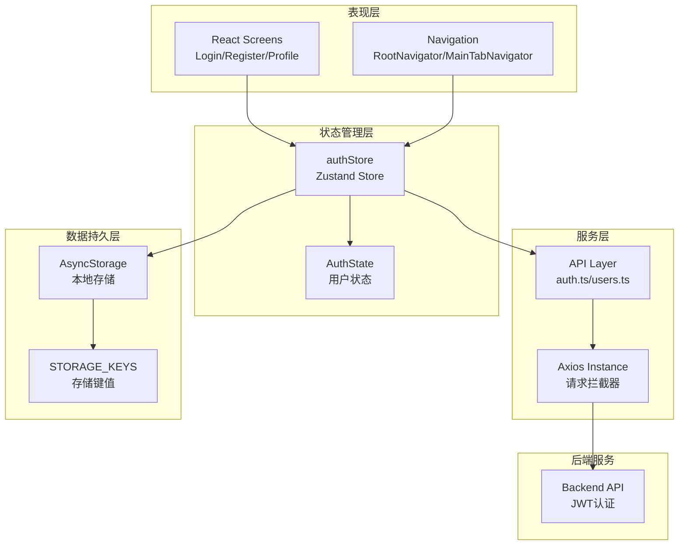

**图表来源**
- [RootNavigator.tsx:41-84](file://FreeDressApp/src/navigation/RootNavigator.tsx#L41-L84)
- [authStore.ts:28-122](file://FreeDressApp/src/store/authStore.ts#L28-L122)
- [axios.ts:12-38](file://FreeDressApp/src/api/axios.ts#L12-L38)

## 详细组件分析

### authStore核心实现

#### 状态定义与初始化

authStore使用Zustand的create函数创建状态管理实例，初始状态包括用户信息、认证令牌和加载状态：

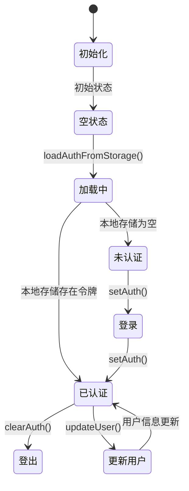

**图表来源**
- [authStore.ts:28-35](file://FreeDressApp/src/store/authStore.ts#L28-L35)
- [authStore.ts:97-121](file://FreeDressApp/src/store/authStore.ts#L97-L121)

#### setAuth方法实现

setAuth方法负责处理用户登录后的认证信息设置：

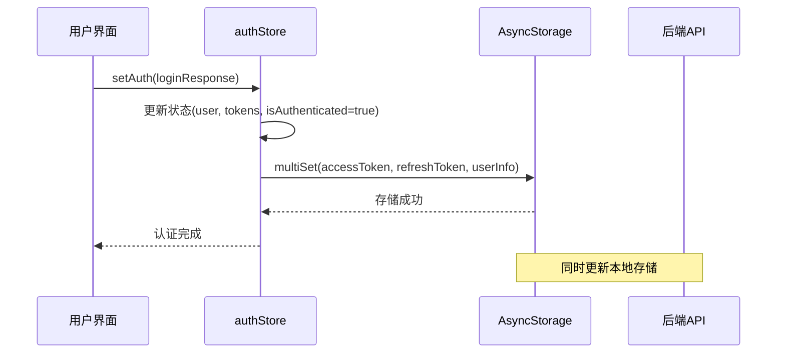

**图表来源**
- [authStore.ts:39-57](file://FreeDressApp/src/store/authStore.ts#L39-L57)

#### clearAuth方法实现

clearAuth方法实现用户登出功能，清理所有认证相关信息：

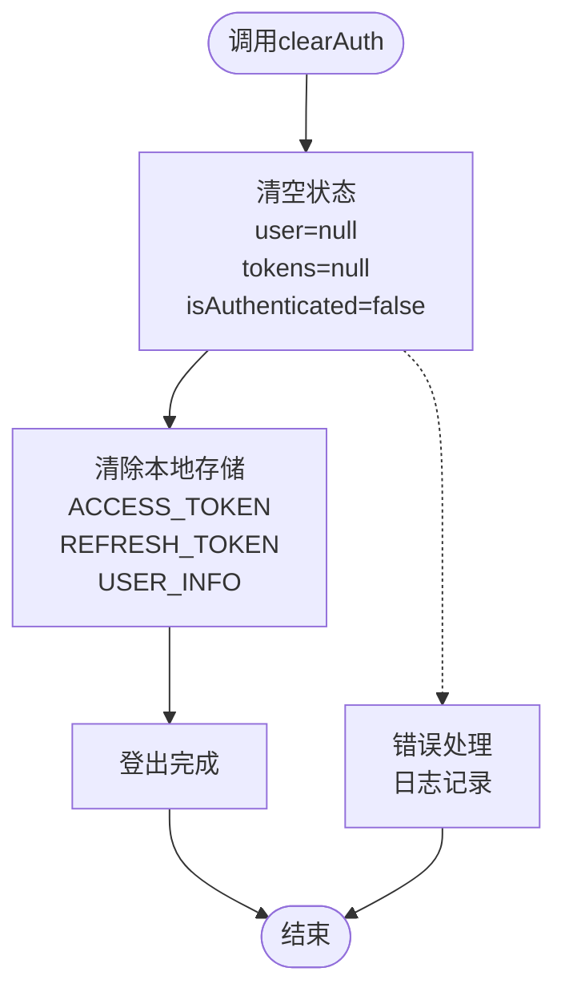

**图表来源**
- [authStore.ts:62-78](file://FreeDressApp/src/store/authStore.ts#L62-L78)

#### updateUser方法实现

updateUser方法提供用户信息的增量更新功能：

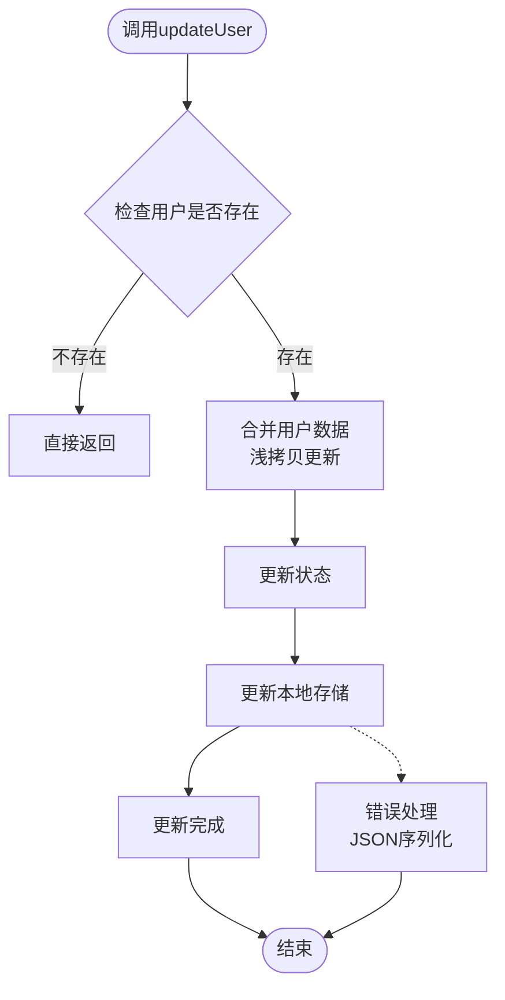

**图表来源**
- [authStore.ts:83-92](file://FreeDressApp/src/store/authStore.ts#L83-L92)

#### loadAuthFromStorage方法实现

loadAuthFromStorage方法负责从本地存储加载认证状态：

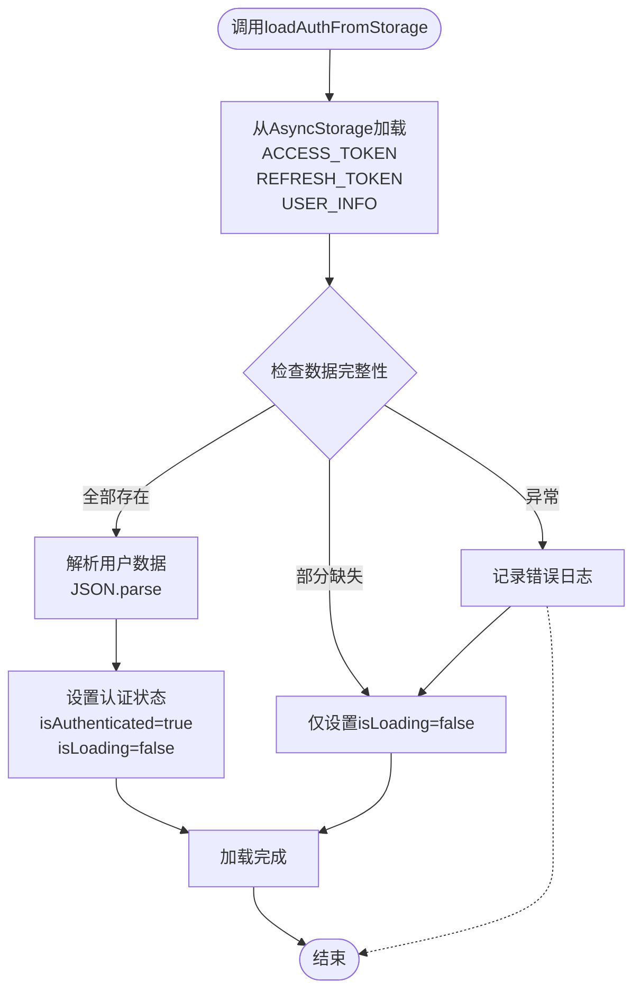

**图表来源**
- [authStore.ts:97-121](file://FreeDressApp/src/store/authStore.ts#L97-L121)

**章节来源**
- [authStore.ts:39-121](file://FreeDressApp/src/store/authStore.ts#L39-L121)

### API集成与拦截器

#### Axios拦截器配置

系统通过Axios拦截器实现自动认证令牌管理和错误处理：

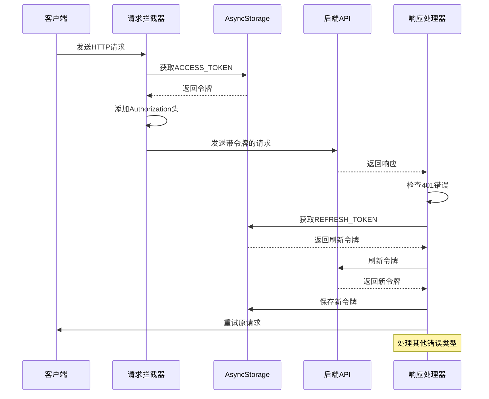

**图表来源**
- [axios.ts:24-105](file://FreeDressApp/src/api/axios.ts#L24-L105)

#### 认证API方法

系统提供了完整的认证API接口：

| 方法 | 参数 | 返回值 | 描述 |
|------|------|--------|------|
| getCaptcha | 无 | ApiResponse<{captchaId: string, image: string}> | 获取图片验证码 |
| register | phone, password, captchaId, captchaAnswer, nickname? | ApiResponse<LoginResponse> | 用户注册 |
| login | phone, password | ApiResponse<LoginResponse> | 用户登录 |
| forgotPassword | phone, captchaId, captchaAnswer | ApiResponse<{resetToken: string, message: string}> | 忘记密码 |
| resetPassword | resetToken, newPassword | ApiResponse<{message: string}> | 重置密码 |
| refreshToken | 无 | ApiResponse<{accessToken: string, refreshToken: string}> | 刷新访问令牌 |

**章节来源**
- [auth.ts:12-93](file://FreeDressApp/src/api/auth.ts#L12-L93)
- [axios.ts:24-105](file://FreeDressApp/src/api/axios.ts#L24-L105)

### 导航集成

#### 根导航器集成

RootNavigator负责根据认证状态切换不同的界面栈：

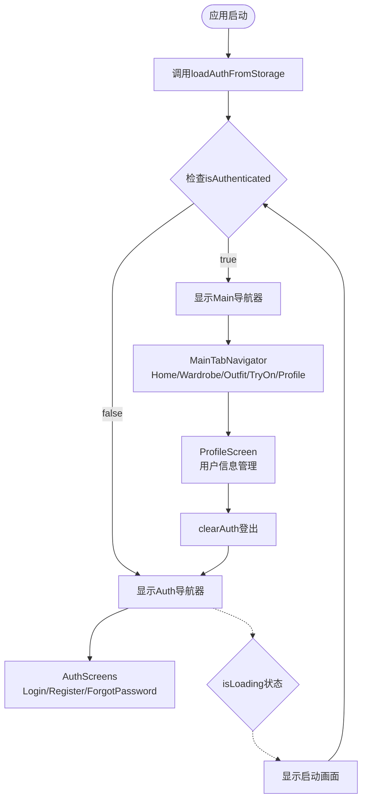

**图表来源**
- [RootNavigator.tsx:41-84](file://FreeDressApp/src/navigation/RootNavigator.tsx#L41-L84)

**章节来源**
- [RootNavigator.tsx:41-84](file://FreeDressApp/src/navigation/RootNavigator.tsx#L41-L84)

## 依赖关系分析

### 组件耦合度分析

认证状态管理系统展现了良好的模块化设计：

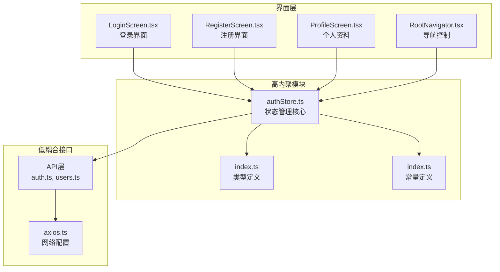

**图表来源**
- [authStore.ts:1-4](file://FreeDressApp/src/store/authStore.ts#L1-L4)
- [auth.ts:1-2](file://FreeDressApp/src/api/auth.ts#L1-L2)
- [axios.ts:1-7](file://FreeDressApp/src/api/axios.ts#L1-L7)

### 数据流分析

认证状态的数据流向体现了清晰的单向数据流原则：

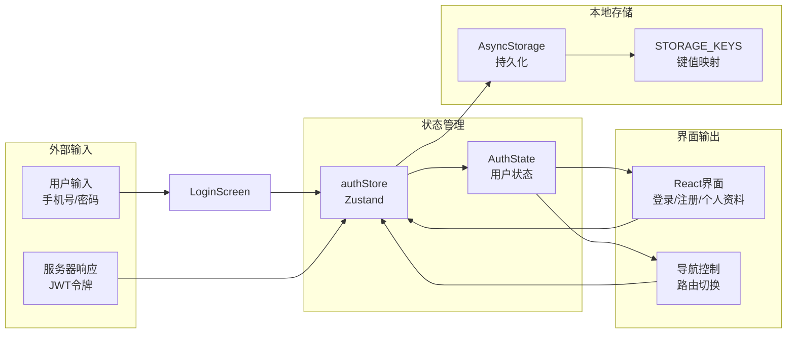

**图表来源**
- [authStore.ts:28-122](file://FreeDressApp/src/store/authStore.ts#L28-L122)
- [LoginScreen.tsx:74-92](file://FreeDressApp/src/screens/LoginScreen.tsx#L74-L92)

**章节来源**
- [authStore.ts:1-123](file://FreeDressApp/src/store/authStore.ts#L1-L123)
- [LoginScreen.tsx:74-92](file://FreeDressApp/src/screens/LoginScreen.tsx#L74-L92)

## 性能考量

### 状态更新优化

系统在状态管理方面采用了多项性能优化策略：

1. **批量状态更新**: 使用multiSet进行批量存储操作，减少AsyncStorage调用次数
2. **条件更新**: updateUser方法只在用户存在时执行，避免不必要的状态变更
3. **懒加载**: loadAuthFromStorage方法仅在应用启动时执行一次
4. **内存优化**: 通过局部状态管理避免全局状态污染

### 网络请求优化

Axios拦截器实现了智能的请求缓存和重试机制：

1. **令牌预加载**: 在请求发送前自动添加Authorization头
2. **自动刷新**: 401错误时自动尝试刷新令牌
3. **重试机制**: 刷新失败后自动清理认证状态
4. **超时控制**: 10秒请求超时设置

## 故障排除指南

### 常见问题及解决方案

#### 认证状态无法持久化

**问题症状**: 用户重新启动应用后需要重新登录

**可能原因**:
- AsyncStorage权限问题
- JSON序列化失败
- 存储键值不匹配

**解决方案**:
1. 检查STORAGE_KEYS配置是否正确
2. 验证用户对象的可序列化性
3. 确认AsyncStorage权限设置

#### 令牌刷新失败

**问题症状**: 应用频繁出现401未授权错误

**可能原因**:
- 刷新令牌过期
- 网络连接问题
- 后端服务异常

**解决方案**:
1. 检查refreshToken的有效期
2. 验证网络连接状态
3. 查看后端API响应日志

#### 界面状态不同步

**问题症状**: 登录后界面仍然显示登录状态

**可能原因**:
- 状态更新时机问题
- 导航状态未正确切换
- 组件重新渲染问题

**解决方案**:
1. 确保setAuth调用后等待Promise完成
2. 检查RootNavigator的条件渲染逻辑
3. 验证组件的useAuthStore订阅

**章节来源**
- [authStore.ts:117-121](file://FreeDressApp/src/store/authStore.ts#L117-L121)
- [axios.ts:54-98](file://FreeDressApp/src/api/axios.ts#L54-L98)

## 结论

畅搭(FreeDress)认证状态管理系统展现了现代React Native应用的最佳实践：

### 主要优势

1. **架构清晰**: 分层设计确保了代码的可维护性和可扩展性
2. **状态管理**: Zustand提供了简洁高效的状态管理解决方案
3. **数据持久化**: AsyncStorage实现可靠的本地存储机制
4. **错误处理**: 完善的错误处理和异常恢复机制
5. **用户体验**: 流畅的认证流程和状态切换体验

### 技术亮点

- **类型安全**: 完整的TypeScript支持确保开发时的类型安全
- **异步处理**: Promise和async/await的合理使用
- **模块化设计**: 关注点分离，便于测试和维护
- **性能优化**: 多种性能优化策略确保应用流畅运行

### 改进建议

1. **增加单元测试**: 为关键状态管理逻辑添加测试用例
2. **增强错误监控**: 集成错误追踪系统
3. **优化存储策略**: 考虑使用更高级的存储方案如Realm
4. **添加调试工具**: 集成Redux DevTools等调试工具

## 附录

### API接口规范

#### 认证相关API

| 接口 | 方法 | URL | 请求体 | 响应体 |
|------|------|-----|--------|--------|
| 获取验证码 | GET | `/auth/captcha` | 无 | `{ captchaId: string, image: string }` |
| 用户注册 | POST | `/auth/register` | `{ phone, password, captchaId, captchaAnswer, nickname? }` | `LoginResponse` |
| 用户登录 | POST | `/auth/login` | `{ phone, password }` | `LoginResponse` |
| 忘记密码 | POST | `/auth/forgot-password` | `{ phone, captchaId, captchaAnswer }` | `{ resetToken: string, message: string }` |
| 重置密码 | POST | `/auth/reset-password` | `{ resetToken, newPassword }` | `{ message: string }` |
| 刷新令牌 | POST | `/auth/refresh` | 无 | `{ accessToken: string, refreshToken: string }` |
| 获取用户信息 | GET | `/auth/profile` | 无 | `User` |

#### 用户相关API

| 接口 | 方法 | URL | 请求体 | 响应体 |
|------|------|-----|--------|--------|
| 获取用户统计 | GET | `/users/stats` | 无 | `{ clothesCount, outfitsCount, favoritesCount, tryOnCount }` |
| 更新用户信息 | PUT | `/users/profile` | `{ nickname?, avatarUrl? }` | `User` |

### 存储键值定义

| 键名 | 类型 | 描述 |
|------|------|------|
| `ACCESS_TOKEN` | string | JWT访问令牌 |
| `REFRESH_TOKEN` | string | JWT刷新令牌 |
| `USER_INFO` | string(JSON) | 用户信息对象 |

### 最佳实践建议

1. **安全性**: 
   - 使用HTTPS协议传输敏感数据
   - 定期轮换JWT令牌
   - 实施适当的令牌存储安全措施

2. **性能**:
   - 合理使用状态缓存
   - 优化网络请求频率
   - 实现适当的错误重试机制

3. **用户体验**:
   - 提供清晰的加载状态指示
   - 实现优雅的错误处理
   - 确保状态切换的流畅性

4. **可维护性**:
   - 保持代码模块化
   - 添加必要的注释和文档
   - 实施代码审查流程