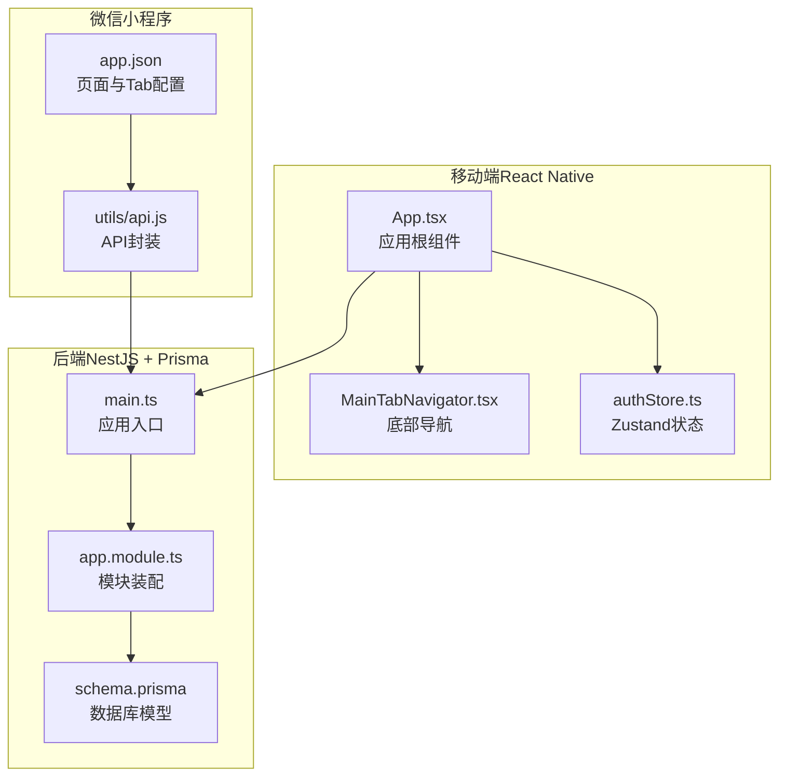
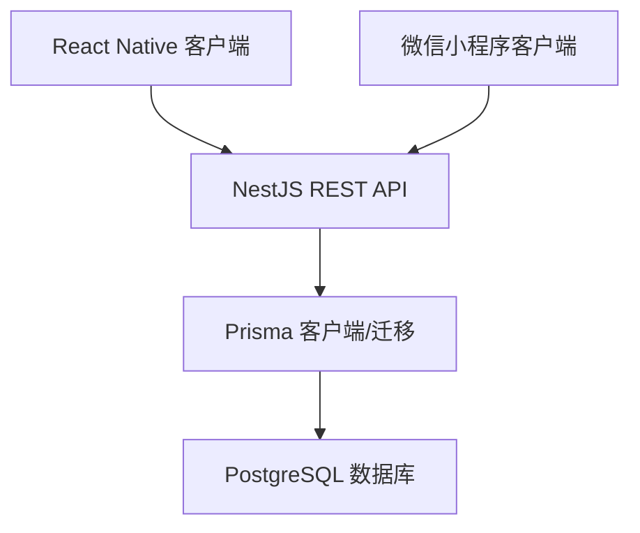
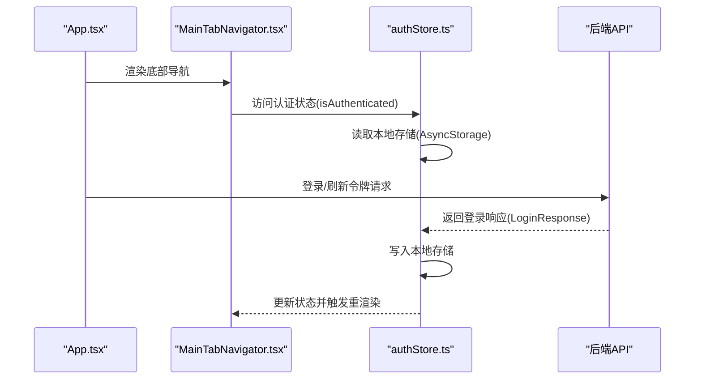
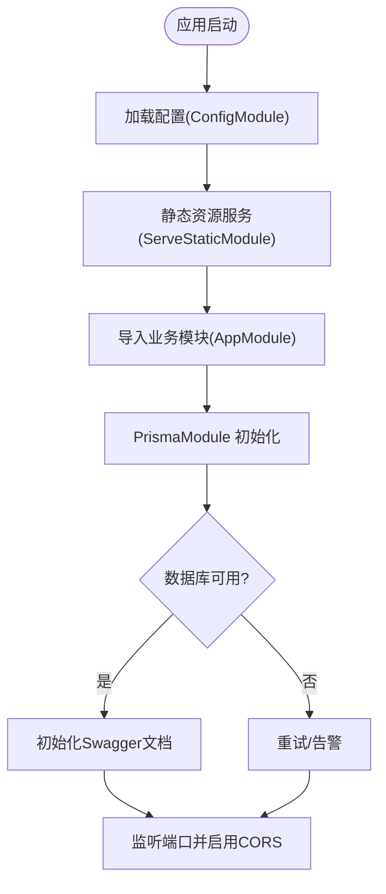
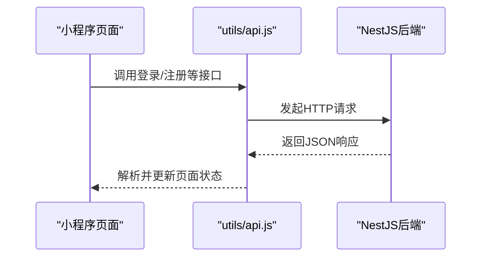

# 技术选型说明

<cite>
**本文引用的文件**
- [FreeDressApp/package.json](file://FreeDressApp/package.json)
- [FreeDressApp/tsconfig.json](file://FreeDressApp/tsconfig.json)
- [FreeDressApp/babel.config.js](file://FreeDressApp/babel.config.js)
- [FreeDressApp/src/App.tsx](file://FreeDressApp/src/App.tsx)
- [FreeDressApp/src/navigation/MainTabNavigator.tsx](file://FreeDressApp/src/navigation/MainTabNavigator.tsx)
- [FreeDressApp/src/store/authStore.ts](file://FreeDressApp/src/store/authStore.ts)
- [backend/package.json](file://backend/package.json)
- [backend/tsconfig.json](file://backend/tsconfig.json)
- [backend/src/main.ts](file://backend/src/main.ts)
- [backend/src/app.module.ts](file://backend/src/app.module.ts)
- [backend/prisma/schema.prisma](file://backend/prisma/schema.prisma)
- [freeDressWechat/app.json](file://freeDressWechat/app.json)
- [freeDressWechat/utils/api.js](file://freeDressWechat/utils/api.js)
</cite>

## 目录
1. [简介](#简介)
2. [项目结构](#项目结构)
3. [核心组件](#核心组件)
4. [架构总览](#架构总览)
5. [详细组件分析](#详细组件分析)
6. [依赖分析](#依赖分析)
7. [性能考量](#性能考量)
8. [故障排查指南](#故障排查指南)
9. [结论](#结论)
10. [附录](#附录)

## 简介
本文件面向畅搭(FreeDress)项目的开发与维护团队，系统化阐述前端、后端及微信小程序三端技术栈的选型依据、优势与约束，并提供替代方案对比、兼容性矩阵与版本要求，帮助团队在技术演进中做出一致、可追溯的决策。

## 项目结构
畅搭项目采用多端分离架构：
- 移动端（React Native）：负责跨平台原生体验与高性能交互
- 后端（NestJS + Prisma）：提供REST API、业务逻辑与数据持久化
- 微信小程序：覆盖微信生态内的轻量使用场景

**图表来源**
- [FreeDressApp/src/App.tsx:1-28](file://FreeDressApp/src/App.tsx#L1-L28)
- [FreeDressApp/src/navigation/MainTabNavigator.tsx:1-38](file://FreeDressApp/src/navigation/MainTabNavigator.tsx#L1-L38)
- [FreeDressApp/src/store/authStore.ts:1-123](file://FreeDressApp/src/store/authStore.ts#L1-L123)
- [backend/src/main.ts:1-62](file://backend/src/main.ts#L1-L62)
- [backend/src/app.module.ts:1-33](file://backend/src/app.module.ts#L1-L33)
- [backend/prisma/schema.prisma:1-132](file://backend/prisma/schema.prisma#L1-L132)
- [freeDressWechat/app.json:1-65](file://freeDressWechat/app.json#L1-L65)
- [freeDressWechat/utils/api.js:1-62](file://freeDressWechat/utils/api.js#L1-L62)

**章节来源**
- [FreeDressApp/src/App.tsx:1-28](file://FreeDressApp/src/App.tsx#L1-L28)
- [backend/src/app.module.ts:1-33](file://backend/src/app.module.ts#L1-L33)
- [freeDressWechat/app.json:1-65](file://freeDressWechat/app.json#L1-L65)

## 核心组件
本节聚焦三端关键技术组件及其选型理由：
- 前端：React Native 0.85.3、TypeScript、React Navigation 7.x、Zustand
- 后端：NestJS 10.3.0、Prisma 5.7.0、PostgreSQL 16+
- 小程序：基于微信小程序原生框架

**章节来源**
- [FreeDressApp/package.json:1-57](file://FreeDressApp/package.json#L1-L57)
- [backend/package.json:1-91](file://backend/package.json#L1-L91)
- [freeDressWechat/app.json:1-65](file://freeDressWechat/app.json#L1-L65)

## 架构总览
整体架构围绕“移动端 + 后端 + 小程序”三层展开，统一通过REST API进行通信；数据库层由Prisma抽象，支持快速迭代与安全迁移。

**图表来源**
- [backend/src/main.ts:1-62](file://backend/src/main.ts#L1-L62)
- [backend/prisma/schema.prisma:1-132](file://backend/prisma/schema.prisma#L1-L132)

## 详细组件分析

### 前端技术栈（React Native + TypeScript + Navigation + Zustand）

- React Native 0.85.3
  - 选择理由：稳定版本，生态成熟，跨平台渲染与原生能力平衡良好；配合Reanimated Worklets可实现高性能动画与手势。
  - 优势：一套代码多端运行，原生体验与性能兼顾；社区与工具链完善。
  - 约束：需关注平台差异与原生桥接问题。

- TypeScript
  - 选择理由：强类型保障开发效率与可维护性；与React Native官方配置集成良好。
  - 优势：编译期错误检测、智能提示、重构安全。
  - 约束：学习成本与配置复杂度略高。

- React Navigation 7.x
  - 选择理由：最新一代导航库，支持自定义TabBar与屏幕栈管理；与React 18并发特性兼容。
  - 优势：声明式路由、手势交互丰富、可扩展性强。
  - 约束：需要合理组织导航层级以避免过度嵌套。

- Zustand
  - 选择理由：轻量、易用、零样板代码的状态管理；适合中小型应用的状态集中管理。
  - 优势：API简洁、异步存储结合AsyncStorage实现持久化。
  - 约束：复杂场景建议评估Redux Toolkit或MobX。

**图表来源**
- [FreeDressApp/src/App.tsx:1-28](file://FreeDressApp/src/App.tsx#L1-L28)
- [FreeDressApp/src/navigation/MainTabNavigator.tsx:1-38](file://FreeDressApp/src/navigation/MainTabNavigator.tsx#L1-L38)
- [FreeDressApp/src/store/authStore.ts:1-123](file://FreeDressApp/src/store/authStore.ts#L1-L123)

**章节来源**
- [FreeDressApp/package.json:12-31](file://FreeDressApp/package.json#L12-L31)
- [FreeDressApp/tsconfig.json:1-9](file://FreeDressApp/tsconfig.json#L1-L9)
- [FreeDressApp/babel.config.js:1-4](file://FreeDressApp/babel.config.js#L1-L4)
- [FreeDressApp/src/App.tsx:1-28](file://FreeDressApp/src/App.tsx#L1-L28)
- [FreeDressApp/src/navigation/MainTabNavigator.tsx:1-38](file://FreeDressApp/src/navigation/MainTabNavigator.tsx#L1-L38)
- [FreeDressApp/src/store/authStore.ts:1-123](file://FreeDressApp/src/store/authStore.ts#L1-L123)

### 后端技术栈（NestJS + Prisma + PostgreSQL）

- NestJS 10.3.0
  - 选择理由：模块化架构清晰，装饰器与依赖注入便于组织业务；生态完善，测试友好。
  - 优势：企业级开发体验、Swagger文档、全局管道/拦截器/过滤器统一治理。
  - 约束：学习曲线较陡，需遵循模块化规范。

- Prisma 5.7.0
  - 选择理由：类型安全的ORM，支持数据库迁移与客户端生成；Schema驱动开发。
  - 优势：减少SQL手写错误、自动迁移、数据模型即代码。
  - 约束：生产环境迁移策略与备份需谨慎规划。

- PostgreSQL 16+
  - 选择理由：企业级关系型数据库，稳定性与扩展性优秀；支持JSON/数组等现代特性。
  - 优势：ACID、事务一致性、丰富的索引与查询优化。
  - 约束：运维与备份策略需配套完善。

**图表来源**
- [backend/src/main.ts:1-62](file://backend/src/main.ts#L1-L62)
- [backend/src/app.module.ts:1-33](file://backend/src/app.module.ts#L1-L33)
- [backend/prisma/schema.prisma:1-132](file://backend/prisma/schema.prisma#L1-L132)

**章节来源**
- [backend/package.json:26-45](file://backend/package.json#L26-L45)
- [backend/tsconfig.json:1-32](file://backend/tsconfig.json#L1-L32)
- [backend/src/main.ts:1-62](file://backend/src/main.ts#L1-L62)
- [backend/src/app.module.ts:1-33](file://backend/src/app.module.ts#L1-L33)
- [backend/prisma/schema.prisma:1-132](file://backend/prisma/schema.prisma#L1-L132)

### 微信小程序技术栈

- 选择考虑
  - 覆盖微信生态内的轻量使用场景，降低用户使用门槛。
  - 页面与Tab配置集中于app.json，便于统一管理。
  - API封装集中在utils/api.js，便于与后端保持一致的接口契约。

**图表来源**
- [freeDressWechat/app.json:1-65](file://freeDressWechat/app.json#L1-L65)
- [freeDressWechat/utils/api.js:1-62](file://freeDressWechat/utils/api.js#L1-L62)

**章节来源**
- [freeDressWechat/app.json:1-65](file://freeDressWechat/app.json#L1-L65)
- [freeDressWechat/utils/api.js:1-62](file://freeDressWechat/utils/api.js#L1-L62)

## 依赖分析
- 前端依赖关系
  - 导航与手势：@react-navigation/*、react-native-gesture-handler、react-native-reanimated
  - 状态管理：zustand + @react-native-async-storage/async-storage
  - 网络：axios
  - 类型：TypeScript、@types/react、@types/jest

- 后端依赖关系
  - Web框架：@nestjs/*（common/config/core/platform-express等）
  - 安全与认证：@nestjs/jwt、passport、passport-jwt
  - ORM与数据库：@prisma/client、prisma
  - 工具：class-transformer、class-validator、bcryptjs、uuid

- 小程序依赖关系
  - 原生框架：微信小程序基础库
  - API封装：utils/request.js（由api.js导出方法调用）

**章节来源**
- [FreeDressApp/package.json:12-31](file://FreeDressApp/package.json#L12-L31)
- [backend/package.json:26-45](file://backend/package.json#L26-L45)
- [freeDressWechat/utils/api.js:1-62](file://freeDressWechat/utils/api.js#L1-L62)

## 性能考量
- 前端
  - Reanimated Worklets用于高性能动画与手势，减少JS线程阻塞。
  - Flash List提升列表渲染性能，适合长列表场景。
  - Zustand无中间件开销，状态更新路径短，适合小型到中型应用。

- 后端
  - Prisma客户端生成与查询缓存可减少重复SQL构造。
  - 全局拦截器/过滤器统一响应与异常处理，降低重复逻辑。
  - Swagger文档便于接口调试与压测准备。

- 小程序
  - 页面懒加载与分包策略可优化首屏时间（参考app.json lazyCodeLoading配置）。

[本节为通用指导，无需特定文件引用]

## 故障排查指南
- 前端常见问题
  - 导航异常：检查MainTabNavigator的screen配置与参数类型。
  - 状态不更新：确认Zustand状态更新函数是否正确触发重渲染。
  - 存储读写：确保AsyncStorage键值与序列化方式一致。

- 后端常见问题
  - CORS跨域：确认main.ts中CORS配置与前端域名匹配。
  - 验证失败：检查DTO与ValidationPipe配置，确保白名单与转换生效。
  - 数据库连接：核对DATABASE_URL与PostgreSQL版本兼容性。

- 小程序常见问题
  - 接口404：核对utils/api.js中的路径前缀与后端全局前缀一致。
  - Tab图标：确认app.json中iconPath与实际资源路径一致。

**章节来源**
- [FreeDressApp/src/navigation/MainTabNavigator.tsx:1-38](file://FreeDressApp/src/navigation/MainTabNavigator.tsx#L1-L38)
- [FreeDressApp/src/store/authStore.ts:1-123](file://FreeDressApp/src/store/authStore.ts#L1-L123)
- [backend/src/main.ts:32-38](file://backend/src/main.ts#L32-L38)
- [freeDressWechat/utils/api.js:1-62](file://freeDressWechat/utils/api.js#L1-L62)

## 结论
本项目在三端采用成熟且互补的技术栈：前端以React Native与TypeScript构建跨平台体验，配合Navigation与Zustand实现高效交互与状态管理；后端以NestJS与Prisma提供企业级API与数据抽象，数据库选用PostgreSQL保证稳定性；小程序覆盖微信生态，形成完整的用户触达闭环。该选型在功能完整性、开发效率与可维护性之间取得平衡，并具备良好的扩展空间。

[本节为总结性内容，无需特定文件引用]

## 附录

### 技术栈兼容性矩阵与版本要求
- 前端（React Native）
  - React Native: 0.85.3
  - TypeScript: ^5.8.3
  - React Navigation: 7.x
  - Zustand: ^5.0.13
  - Node: >= 22.11.0

- 后端（NestJS）
  - NestJS: 10.3.0
  - Prisma: 5.7.0
  - PostgreSQL: 16+

- 小程序
  - 基于微信小程序原生框架（页面与Tab配置见app.json）

**章节来源**
- [FreeDressApp/package.json:53-55](file://FreeDressApp/package.json#L53-L55)
- [backend/package.json:64-71](file://backend/package.json#L64-L71)
- [backend/prisma/schema.prisma:2-2](file://backend/prisma/schema.prisma#L2-L2)
- [freeDressWechat/app.json:1-65](file://freeDressWechat/app.json#L1-L65)

### 替代方案对比与权衡
- 前端
  - React Navigation替代：React Router Native（适用于Web优先场景，但移动端生态不如7.x成熟）
  - 状态管理替代：Redux Toolkit（适合大型应用，样板代码较多；Zustand更轻量）
- 后端
  - Web框架替代：Fastify/Express（更灵活但缺少NestJS的模块化与装饰器生态）
  - ORM替代：TypeORM（功能丰富，但Prisma在类型安全与迁移方面更契合当前需求）
- 小程序
  - 框架替代：Taro/Remax（多端编译，但本项目目标明确为微信小程序，原生更直接）

[本节为概念性对比，无需特定文件引用]