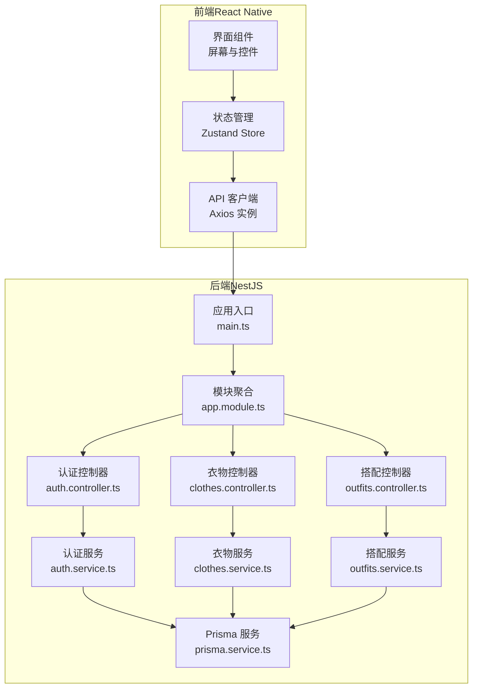
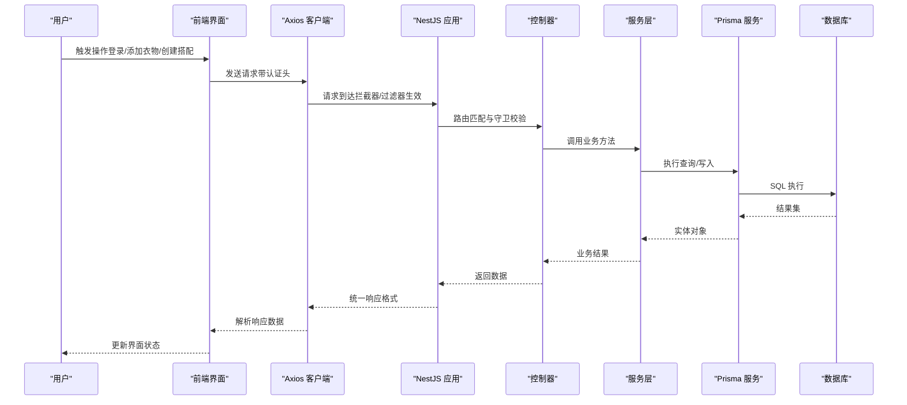
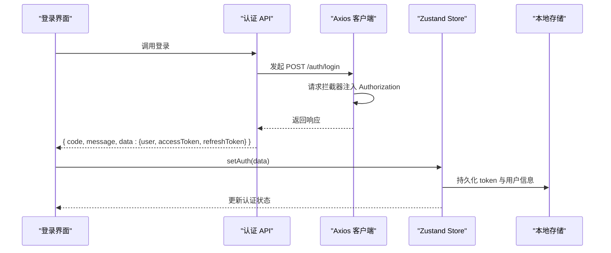
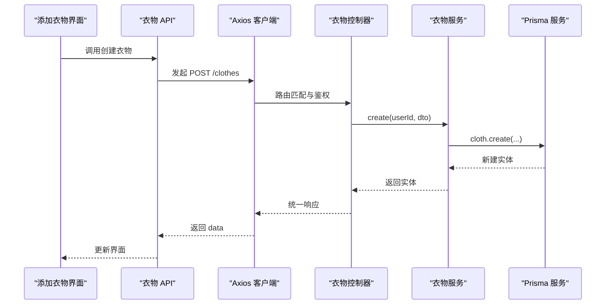
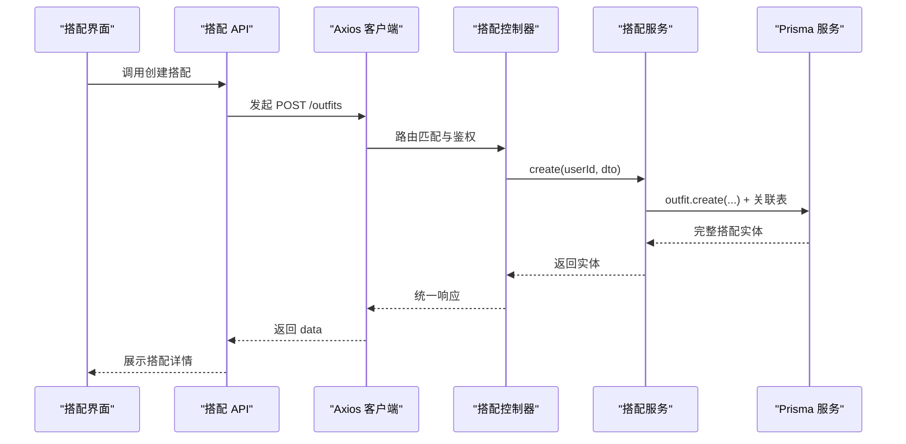
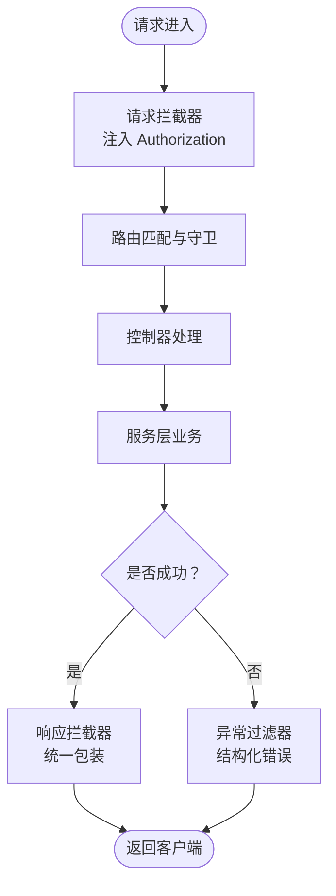
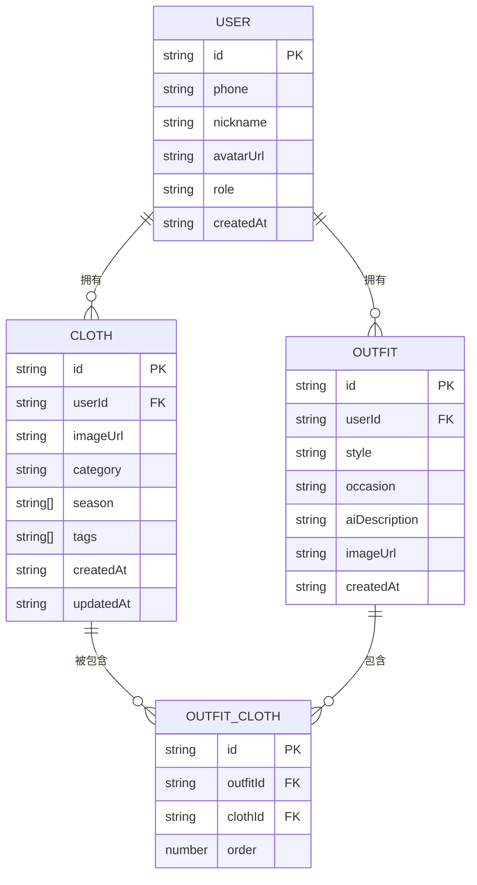
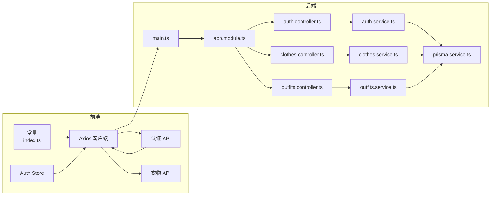

# 数据流架构

<cite>
**本文引用的文件**
- [FreeDressApp/src/App.tsx](file://FreeDressApp/src/App.tsx)
- [FreeDressApp/src/constants/index.ts](file://FreeDressApp/src/constants/index.ts)
- [FreeDressApp/src/api/axios.ts](file://FreeDressApp/src/api/axios.ts)
- [FreeDressApp/src/api/auth.ts](file://FreeDressApp/src/api/auth.ts)
- [FreeDressApp/src/api/clothes.ts](file://FreeDressApp/src/api/clothes.ts)
- [FreeDressApp/src/store/authStore.ts](file://FreeDressApp/src/store/authStore.ts)
- [FreeDressApp/src/types/index.ts](file://FreeDressApp/src/types/index.ts)
- [backend/src/main.ts](file://backend/src/main.ts)
- [backend/src/app.module.ts](file://backend/src/app.module.ts)
- [backend/src/common/interceptors/transform.interceptor.ts](file://backend/src/common/interceptors/transform.interceptor.ts)
- [backend/src/common/filters/http-exception.filter.ts](file://backend/src/common/filters/http-exception.filter.ts)
- [backend/src/modules/auth/auth.controller.ts](file://backend/src/modules/auth/auth.controller.ts)
- [backend/src/modules/auth/auth.service.ts](file://backend/src/modules/auth/auth.service.ts)
- [backend/src/modules/clothes/clothes.controller.ts](file://backend/src/modules/clothes/clothes.controller.ts)
- [backend/src/modules/clothes/clothes.service.ts](file://backend/src/modules/clothes/clothes.service.ts)
- [backend/src/modules/outfits/outfits.controller.ts](file://backend/src/modules/outfits/outfits.controller.ts)
- [backend/src/modules/outfits/outfits.service.ts](file://backend/src/modules/outfits/outfits.service.ts)
- [backend/src/prisma/prisma.service.ts](file://backend/src/prisma/prisma.service.ts)
</cite>

## 目录
1. [引言](#引言)
2. [项目结构](#项目结构)
3. [核心组件](#核心组件)
4. [架构总览](#架构总览)
5. [详细组件分析](#详细组件分析)
6. [依赖关系分析](#依赖关系分析)
7. [性能考虑](#性能考虑)
8. [故障排查指南](#故障排查指南)
9. [结论](#结论)

## 引言
本文件面向畅搭（FreeDress）应用，系统化梳理“从用户操作到数据持久化”的完整数据流，覆盖以下链路：
- 用户界面交互 → 前端状态管理 → API 客户端（Axios）→ 后端控制器（NestJS）→ 服务层（Service）→ Prisma ORM → 数据库存储
- 解释统一数据传输格式、状态管理策略与错误处理机制
- 描述请求拦截器、响应拦截器与异常过滤器的作用
- 提供数据流图与时序图，展示典型业务场景（用户登录、衣物添加、搭配创建）

## 项目结构
畅搭采用前后端分离架构：
- 前端（React Native）负责 UI 与状态管理，通过 Axios 发起请求
- 后端（NestJS）提供 REST API，统一响应格式与异常处理
- 数据库由 Prisma 管理，通过 Prisma Service 连接与断开

图表来源
- [FreeDressApp/src/App.tsx:1-28](file://FreeDressApp/src/App.tsx#L1-L28)
- [FreeDressApp/src/api/axios.ts:1-108](file://FreeDressApp/src/api/axios.ts#L1-L108)
- [FreeDressApp/src/store/authStore.ts:1-123](file://FreeDressApp/src/store/authStore.ts#L1-L123)
- [backend/src/main.ts:1-62](file://backend/src/main.ts#L1-L62)
- [backend/src/app.module.ts:1-33](file://backend/src/app.module.ts#L1-L33)
- [backend/src/modules/auth/auth.controller.ts:1-92](file://backend/src/modules/auth/auth.controller.ts#L1-L92)
- [backend/src/modules/clothes/clothes.controller.ts:1-102](file://backend/src/modules/clothes/clothes.controller.ts#L1-L102)
- [backend/src/modules/outfits/outfits.controller.ts:1-65](file://backend/src/modules/outfits/outfits.controller.ts#L1-L65)
- [backend/src/modules/auth/auth.service.ts:1-279](file://backend/src/modules/auth/auth.service.ts#L1-L279)
- [backend/src/modules/clothes/clothes.service.ts:1-148](file://backend/src/modules/clothes/clothes.service.ts#L1-L148)
- [backend/src/modules/outfits/outfits.service.ts:1-123](file://backend/src/modules/outfits/outfits.service.ts#L1-L123)
- [backend/src/prisma/prisma.service.ts:1-27](file://backend/src/prisma/prisma.service.ts#L1-L27)

章节来源
- [FreeDressApp/src/App.tsx:1-28](file://FreeDressApp/src/App.tsx#L1-L28)
- [backend/src/main.ts:1-62](file://backend/src/main.ts#L1-L62)
- [backend/src/app.module.ts:1-33](file://backend/src/app.module.ts#L1-L33)

## 核心组件
- 前端
  - API 客户端：统一请求/响应处理、自动注入认证头、Token 刷新与错误提示
  - 状态管理：Zustand Store 管理用户认证状态与本地持久化
  - 类型系统：统一的 API 响应与实体类型定义
- 后端
  - 应用入口：全局管道、拦截器、过滤器、CORS、Swagger、全局前缀
  - 控制器：暴露 REST 接口，绑定 DTO 与鉴权守卫
  - 服务层：实现业务逻辑，调用 Prisma 执行数据库操作
  - Prisma：数据库连接生命周期管理

章节来源
- [FreeDressApp/src/api/axios.ts:1-108](file://FreeDressApp/src/api/axios.ts#L1-L108)
- [FreeDressApp/src/store/authStore.ts:1-123](file://FreeDressApp/src/store/authStore.ts#L1-L123)
- [FreeDressApp/src/types/index.ts:1-98](file://FreeDressApp/src/types/index.ts#L1-L98)
- [backend/src/main.ts:1-62](file://backend/src/main.ts#L1-L62)
- [backend/src/modules/auth/auth.controller.ts:1-92](file://backend/src/modules/auth/auth.controller.ts#L1-L92)
- [backend/src/modules/clothes/clothes.controller.ts:1-102](file://backend/src/modules/clothes/clothes.controller.ts#L1-L102)
- [backend/src/modules/outfits/outfits.controller.ts:1-65](file://backend/src/modules/outfits/outfits.controller.ts#L1-L65)
- [backend/src/prisma/prisma.service.ts:1-27](file://backend/src/prisma/prisma.service.ts#L1-L27)

## 架构总览
统一响应与异常处理贯穿后端：
- 统一响应格式：拦截器将任意返回值包装为 { code, message, data, timestamp }
- 异常过滤：HTTP 异常与全局异常统一输出结构化错误
- 请求验证：ValidationPipe 白名单与类型转换
- CORS 与 API 前缀：跨域与统一前缀

图表来源
- [backend/src/main.ts:12-38](file://backend/src/main.ts#L12-L38)
- [backend/src/common/interceptors/transform.interceptor.ts:19-31](file://backend/src/common/interceptors/transform.interceptor.ts#L19-L31)
- [backend/src/common/filters/http-exception.filter.ts:8-44](file://backend/src/common/filters/http-exception.filter.ts#L8-L44)
- [backend/src/modules/auth/auth.controller.ts:16-92](file://backend/src/modules/auth/auth.controller.ts#L16-L92)
- [backend/src/modules/clothes/clothes.controller.ts:24-102](file://backend/src/modules/clothes/clothes.controller.ts#L24-L102)
- [backend/src/modules/outfits/outfits.controller.ts:10-65](file://backend/src/modules/outfits/outfits.controller.ts#L10-L65)
- [backend/src/prisma/prisma.service.ts:9-26](file://backend/src/prisma/prisma.service.ts#L9-L26)

## 详细组件分析

### 前端数据流：用户登录
- 用户输入手机号/密码，前端调用认证 API
- Axios 请求拦截器自动附加 Bearer Token
- 若 401 且存在刷新 Token，尝试刷新并重试原请求
- 成功后，前端 Store 写入用户信息与 Token，并持久化到本地存储

图表来源
- [FreeDressApp/src/api/auth.ts:45-53](file://FreeDressApp/src/api/auth.ts#L45-L53)
- [FreeDressApp/src/api/axios.ts:24-38](file://FreeDressApp/src/api/axios.ts#L24-L38)
- [FreeDressApp/src/api/axios.ts:44-105](file://FreeDressApp/src/api/axios.ts#L44-L105)
- [FreeDressApp/src/store/authStore.ts:39-57](file://FreeDressApp/src/store/authStore.ts#L39-L57)

章节来源
- [FreeDressApp/src/api/auth.ts:1-101](file://FreeDressApp/src/api/auth.ts#L1-L101)
- [FreeDressApp/src/api/axios.ts:1-108](file://FreeDressApp/src/api/axios.ts#L1-L108)
- [FreeDressApp/src/store/authStore.ts:1-123](file://FreeDressApp/src/store/authStore.ts#L1-L123)

### 前端数据流：衣物添加
- 用户在“添加衣物”界面填写信息并提交
- Axios 客户端发送 POST /clothes
- 服务层创建衣物记录，返回完整实体
- 前端根据响应更新本地列表

图表来源
- [FreeDressApp/src/api/clothes.ts:30-32](file://FreeDressApp/src/api/clothes.ts#L30-L32)
- [backend/src/modules/clothes/clothes.controller.ts:34-41](file://backend/src/modules/clothes/clothes.controller.ts#L34-L41)
- [backend/src/modules/clothes/clothes.service.ts:21-30](file://backend/src/modules/clothes/clothes.service.ts#L21-L30)

章节来源
- [FreeDressApp/src/api/clothes.ts:1-54](file://FreeDressApp/src/api/clothes.ts#L1-L54)
- [backend/src/modules/clothes/clothes.controller.ts:1-102](file://backend/src/modules/clothes/clothes.controller.ts#L1-L102)
- [backend/src/modules/clothes/clothes.service.ts:1-148](file://backend/src/modules/clothes/clothes.service.ts#L1-L148)

### 前端数据流：搭配创建
- 用户选择多件衣物组成搭配并提交
- 控制器接收 DTO，服务层创建搭配并关联衣物顺序
- 返回包含衣物明细的搭配实体

图表来源
- [backend/src/modules/outfits/outfits.controller.ts:17-24](file://backend/src/modules/outfits/outfits.controller.ts#L17-L24)
- [backend/src/modules/outfits/outfits.service.ts:9-33](file://backend/src/modules/outfits/outfits.service.ts#L9-L33)

章节来源
- [backend/src/modules/outfits/outfits.controller.ts:1-65](file://backend/src/modules/outfits/outfits.controller.ts#L1-L65)
- [backend/src/modules/outfits/outfits.service.ts:1-123](file://backend/src/modules/outfits/outfits.service.ts#L1-L123)

### 后端拦截器与过滤器
- 请求拦截器：统一注入 Authorization 头
- 响应拦截器：统一包装 { code, message, data, timestamp }
- 异常过滤器：捕获 HTTP 与全局异常，输出结构化错误

图表来源
- [FreeDressApp/src/api/axios.ts:24-38](file://FreeDressApp/src/api/axios.ts#L24-L38)
- [backend/src/common/interceptors/transform.interceptor.ts:19-31](file://backend/src/common/interceptors/transform.interceptor.ts#L19-L31)
- [backend/src/common/filters/http-exception.filter.ts:8-44](file://backend/src/common/filters/http-exception.filter.ts#L8-L44)

章节来源
- [backend/src/main.ts:12-38](file://backend/src/main.ts#L12-L38)
- [backend/src/common/interceptors/transform.interceptor.ts:1-32](file://backend/src/common/interceptors/transform.interceptor.ts#L1-L32)
- [backend/src/common/filters/http-exception.filter.ts:1-81](file://backend/src/common/filters/http-exception.filter.ts#L1-L81)

### 数据模型与类型
- 统一响应格式：{ code, message, data, timestamp }
- 用户、衣物、搭配、AI 试穿结果等实体类型
- 前端通过 API 客户端与后端交互，确保数据一致性

图表来源
- [FreeDressApp/src/types/index.ts:9-46](file://FreeDressApp/src/types/index.ts#L9-L46)
- [backend/src/modules/clothes/clothes.service.ts:21-30](file://backend/src/modules/clothes/clothes.service.ts#L21-L30)
- [backend/src/modules/outfits/outfits.service.ts:9-33](file://backend/src/modules/outfits/outfits.service.ts#L9-L33)

章节来源
- [FreeDressApp/src/types/index.ts:1-98](file://FreeDressApp/src/types/index.ts#L1-L98)

## 依赖关系分析
- 前端
  - API 客户端依赖常量（基础 URL、存储键名）
  - 认证 API 依赖 Axios 实例
  - Store 依赖 AsyncStorage 与认证 API
- 后端
  - AppModule 聚合各模块与 Prisma
  - 控制器依赖服务层
  - 服务层依赖 Prisma Service

图表来源
- [FreeDressApp/src/constants/index.ts:9,201-205](file://FreeDressApp/src/constants/index.ts#L9,L201-L205)
- [FreeDressApp/src/api/axios.ts:12-18](file://FreeDressApp/src/api/axios.ts#L12-L18)
- [FreeDressApp/src/api/auth.ts:1-101](file://FreeDressApp/src/api/auth.ts#L1-L101)
- [FreeDressApp/src/api/clothes.ts:1-54](file://FreeDressApp/src/api/clothes.ts#L1-L54)
- [FreeDressApp/src/store/authStore.ts:1-123](file://FreeDressApp/src/store/authStore.ts#L1-L123)
- [backend/src/main.ts:12-38](file://backend/src/main.ts#L12-L38)
- [backend/src/app.module.ts:14-30](file://backend/src/app.module.ts#L14-L30)
- [backend/src/modules/auth/auth.controller.ts:16-22](file://backend/src/modules/auth/auth.controller.ts#L16-L22)
- [backend/src/modules/clothes/clothes.controller.ts:24-29](file://backend/src/modules/clothes/clothes.controller.ts#L24-L29)
- [backend/src/modules/outfits/outfits.controller.ts:14-15](file://backend/src/modules/outfits/outfits.controller.ts#L14-L15)
- [backend/src/prisma/prisma.service.ts:9-26](file://backend/src/prisma/prisma.service.ts#L9-L26)

章节来源
- [FreeDressApp/src/constants/index.ts:1-212](file://FreeDressApp/src/constants/index.ts#L1-L212)
- [backend/src/app.module.ts:1-33](file://backend/src/app.module.ts#L1-L33)

## 性能考虑
- 前端
  - Axios 超时与统一 Content-Type，减少网络层不确定性
  - Store 仅在必要时更新，避免重复渲染
- 后端
  - 统一响应与异常处理降低客户端解析成本
  - ValidationPipe 白名单与类型转换减少脏数据进入数据库
  - Prisma 连接生命周期管理，避免资源泄漏

## 故障排查指南
- 前端
  - 401 未授权：检查本地存储的刷新 Token 是否存在；确认响应拦截器是否正确触发刷新流程
  - 网络错误：查看响应拦截器对错误消息的提取与 Promise reject 的抛出
- 后端
  - HTTP 异常：HttpExceptionFilter 输出结构化错误，包含状态码、路径与时间戳
  - 全局异常：AllExceptionsFilter 捕获未处理异常，开发模式打印堆栈便于定位
  - 鉴权问题：JwtAuthGuard 与 CurrentUser 装饰器确保请求上下文携带用户信息

章节来源
- [FreeDressApp/src/api/axios.ts:44-105](file://FreeDressApp/src/api/axios.ts#L44-L105)
- [backend/src/common/filters/http-exception.filter.ts:8-81](file://backend/src/common/filters/http-exception.filter.ts#L8-L81)

## 结论
本架构通过“前端状态管理 + 统一 API 客户端 + 后端统一拦截与过滤 + Prisma ORM”的组合，实现了清晰、一致且可维护的数据流。统一的响应格式与错误处理提升了可观测性与用户体验；鉴权与权限控制保障了数据安全；模块化设计便于扩展与演进。