# 整体架构设计

<cite>
**本文档引用的文件**
- [package.json](file://FreeDressApp/package.json)
- [package.json](file://backend/package.json)
- [app.json](file://freeDressWechat/app.json)
- [App.tsx](file://FreeDressApp/src/App.tsx)
- [RootNavigator.tsx](file://FreeDressApp/src/navigation/RootNavigator.tsx)
- [axios.ts](file://FreeDressApp/src/api/axios.ts)
- [authStore.ts](file://FreeDressApp/src/store/authStore.ts)
- [main.ts](file://backend/src/main.ts)
- [app.module.ts](file://backend/src/app.module.ts)
- [auth.module.ts](file://backend/src/modules/auth/auth.module.ts)
- [clothes.module.ts](file://backend/src/modules/clothes/clothes.module.ts)
- [outfits.module.ts](file://backend/src/modules/outfits/outfits.module.ts)
- [tryon.module.ts](file://backend/src/modules/tryon/tryon.module.ts)
- [upload.module.ts](file://backend/src/modules/upload/upload.module.ts)
- [schema.prisma](file://backend/prisma/schema.prisma)
- [jwt-auth.guard.ts](file://backend/src/common/guards/jwt-auth.guard.ts)
- [transform.interceptor.ts](file://backend/src/common/interceptors/transform.interceptor.ts)
- [http-exception.filter.ts](file://backend/src/common/filters/http-exception.filter.ts)
</cite>

## 目录
1. [简介](#简介)
2. [项目结构](#项目结构)
3. [核心组件](#核心组件)
4. [架构总览](#架构总览)
5. [详细组件分析](#详细组件分析)
6. [依赖关系分析](#依赖关系分析)
7. [性能考虑](#性能考虑)
8. [故障排除指南](#故障排除指南)
9. [结论](#结论)

## 简介
本文件为畅搭（FreeDress）应用的整体架构设计文档，采用三层架构模式：前端层（React Native 移动端 + 微信小程序）、后端层（NestJS API 服务）、数据库层（PostgreSQL + Prisma ORM）。文档详细说明各层职责与交互方式，包括数据流、控制流与错误处理机制，并阐述系统模块化组织方式及 App 的整合策略。

## 项目结构
畅搭项目采用多包/多端结构：
- 前端层：React Native 移动端应用位于 FreeDressApp，微信小程序位于 freeDressWechat
- 后端层：NestJS 应用位于 backend，使用 Prisma 进行数据库建模与访问
- 数据库层：PostgreSQL，通过 Prisma Client 提供类型安全的数据访问

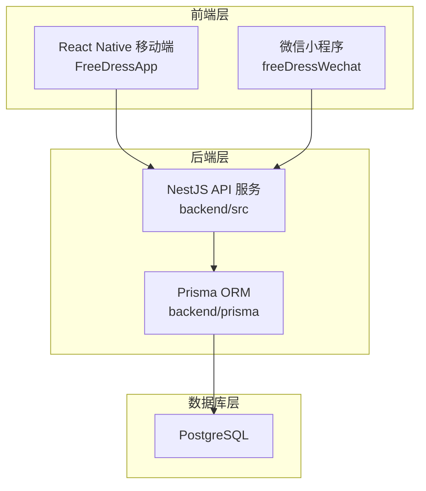

图表来源
- [main.ts:1-62](file://backend/src/main.ts#L1-L62)
- [app.module.ts:1-33](file://backend/src/app.module.ts#L1-L33)
- [schema.prisma:1-132](file://backend/prisma/schema.prisma#L1-L132)

章节来源
- [package.json:1-57](file://FreeDressApp/package.json#L1-L57)
- [package.json:1-91](file://backend/package.json#L1-L91)
- [app.json:1-65](file://freeDressWechat/app.json#L1-L65)

## 核心组件
- 前端入口与导航
  - React Native 根组件负责 Provider 包装与根导航器挂载
  - 根导航器根据认证状态在登录注册与主功能之间切换
- 前端 API 客户端
  - Axios 实例封装基础配置、请求/响应拦截器、Token 自动注入与刷新
  - 状态管理使用 Zustand 管理认证状态与本地持久化
- 后端入口与全局配置
  - NestFactory 创建应用，配置全局管道、拦截器、过滤器、CORS、API 前缀与 Swagger
- 后端模块化
  - AppModule 作为根模块整合 Auth、Users、Clothes、Upload、Outfits、Tryon 等业务模块
  - 各模块按功能划分，控制器/服务解耦，便于扩展与测试
- 数据层
  - Prisma Schema 定义用户、衣物、搭配、收藏、AI 试穿结果等模型与索引
  - PostgreSQL 作为生产数据库，Prisma Client 提供类型安全查询

章节来源
- [App.tsx:1-28](file://FreeDressApp/src/App.tsx#L1-L28)
- [RootNavigator.tsx:1-95](file://FreeDressApp/src/navigation/RootNavigator.tsx#L1-L95)
- [axios.ts:1-108](file://FreeDressApp/src/api/axios.ts#L1-L108)
- [authStore.ts:1-123](file://FreeDressApp/src/store/authStore.ts#L1-L123)
- [main.ts:1-62](file://backend/src/main.ts#L1-L62)
- [app.module.ts:1-33](file://backend/src/app.module.ts#L1-L33)
- [schema.prisma:1-132](file://backend/prisma/schema.prisma#L1-L132)

## 架构总览
三层架构的职责与交互如下：
- 前端层
  - 负责用户界面、状态管理、网络请求与本地存储
  - 通过 Axios 与后端 API 通信，自动携带认证头并处理 Token 刷新
- 后端层
  - 提供 RESTful API，统一响应格式与异常处理
  - 通过 Prisma 访问 PostgreSQL，实现数据持久化与查询
- 数据库层
  - 存储用户、衣物、搭配、收藏、试穿结果等业务数据
  - 通过索引优化常见查询路径（如用户 ID、分类等）

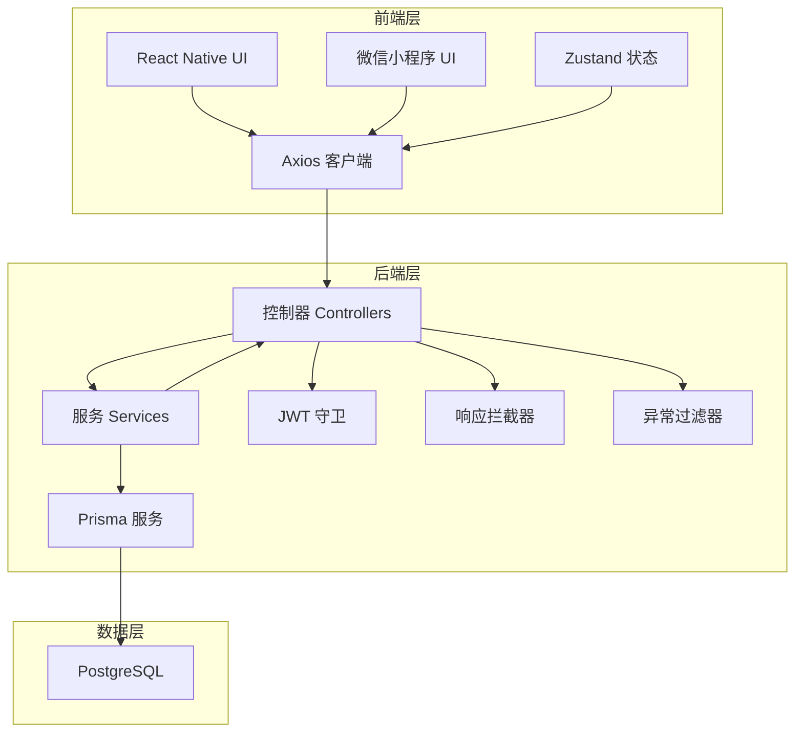

图表来源
- [axios.ts:1-108](file://FreeDressApp/src/api/axios.ts#L1-L108)
- [authStore.ts:1-123](file://FreeDressApp/src/store/authStore.ts#L1-L123)
- [main.ts:1-62](file://backend/src/main.ts#L1-L62)
- [jwt-auth.guard.ts:1-22](file://backend/src/common/guards/jwt-auth.guard.ts#L1-L22)
- [transform.interceptor.ts:1-32](file://backend/src/common/interceptors/transform.interceptor.ts#L1-L32)
- [http-exception.filter.ts:1-81](file://backend/src/common/filters/http-exception.filter.ts#L1-L81)
- [schema.prisma:1-132](file://backend/prisma/schema.prisma#L1-L132)

## 详细组件分析

### 前端组件分析

#### React Native 根组件与导航
- 根组件负责手势、安全区域与根导航器包装
- 根导航器根据认证状态决定显示登录/注册流程或主 Tab 导航

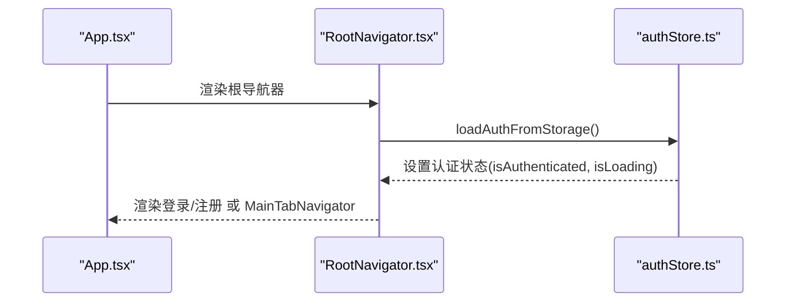

图表来源
- [App.tsx:1-28](file://FreeDressApp/src/App.tsx#L1-L28)
- [RootNavigator.tsx:1-95](file://FreeDressApp/src/navigation/RootNavigator.tsx#L1-L95)
- [authStore.ts:1-123](file://FreeDressApp/src/store/authStore.ts#L1-L123)

章节来源
- [App.tsx:1-28](file://FreeDressApp/src/App.tsx#L1-L28)
- [RootNavigator.tsx:1-95](file://FreeDressApp/src/navigation/RootNavigator.tsx#L1-L95)

#### Axios 客户端与 Token 刷新流程
- 请求拦截器自动附加 Bearer Token
- 响应拦截器处理 401 未授权：尝试刷新 Token 并重试原请求；刷新失败则清理本地认证信息

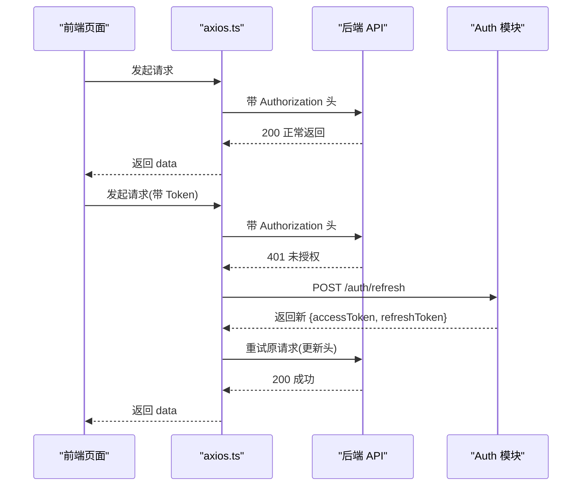

图表来源
- [axios.ts:1-108](file://FreeDressApp/src/api/axios.ts#L1-L108)

章节来源
- [axios.ts:1-108](file://FreeDressApp/src/api/axios.ts#L1-L108)

#### Zustand 认证状态管理
- 管理用户信息、访问/刷新 Token、认证状态与加载状态
- 提供 setAuth/clearAuth/updateUser/loadAuthFromStorage 等方法，支持本地持久化

章节来源
- [authStore.ts:1-123](file://FreeDressApp/src/store/authStore.ts#L1-L123)

### 后端组件分析

#### NestJS 应用入口与全局配置
- 创建应用实例，启用 CORS，设置全局前缀
- 注册全局管道（ValidationPipe）、拦截器（TransformInterceptor）、过滤器（HttpExceptionFilter/AllExceptionsFilter）
- 配置 Swagger 文档，暴露 /api/docs

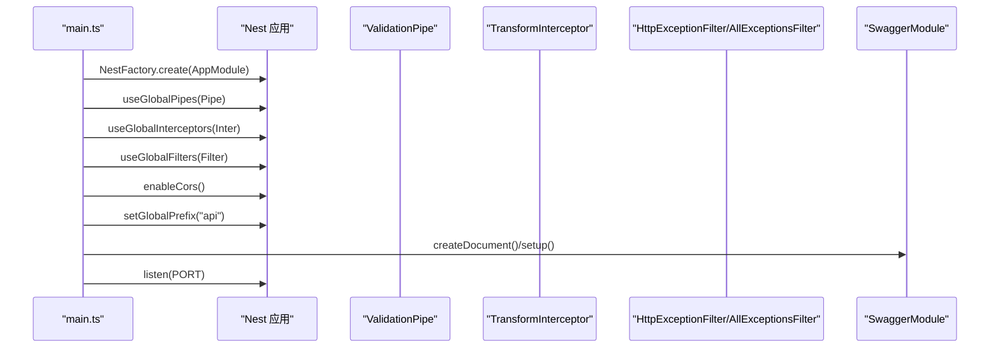

图表来源
- [main.ts:1-62](file://backend/src/main.ts#L1-L62)

章节来源
- [main.ts:1-62](file://backend/src/main.ts#L1-L62)

#### AppModule 模块整合
- 引入 ConfigModule、ServeStaticModule（静态资源上传目录映射）、PrismaModule
- 导入 Auth、Users、Clothes、Upload、Outfits、Tryon 等业务模块

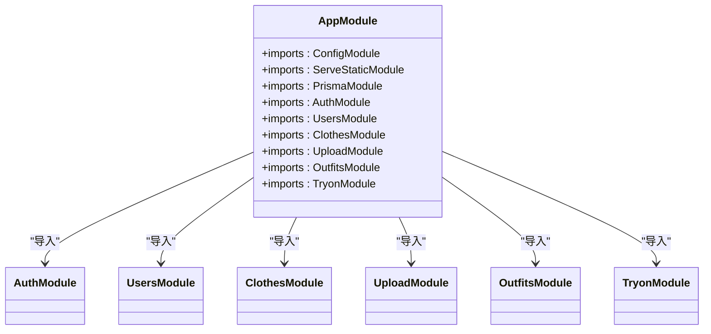

图表来源
- [app.module.ts:1-33](file://backend/src/app.module.ts#L1-L33)

章节来源
- [app.module.ts:1-33](file://backend/src/app.module.ts#L1-L33)

#### 认证模块与守卫
- AuthModule 配置 Passport 与 JWT，导出 AuthService/CaptchaService/JwtStrategy
- JwtAuthGuard 用于保护受保护路由，验证失败抛出未授权异常

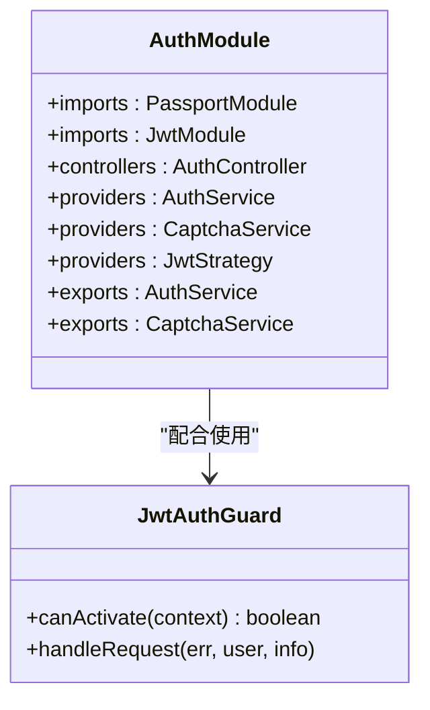

图表来源
- [auth.module.ts:1-30](file://backend/src/modules/auth/auth.module.ts#L1-L30)
- [jwt-auth.guard.ts:1-22](file://backend/src/common/guards/jwt-auth.guard.ts#L1-L22)

章节来源
- [auth.module.ts:1-30](file://backend/src/modules/auth/auth.module.ts#L1-L30)
- [jwt-auth.guard.ts:1-22](file://backend/src/common/guards/jwt-auth.guard.ts#L1-L22)

#### 统一响应与异常处理
- TransformInterceptor 将所有响应包装为 {code, message, data, timestamp}
- HttpExceptionFilter 与 AllExceptionsFilter 统一错误响应格式与日志输出

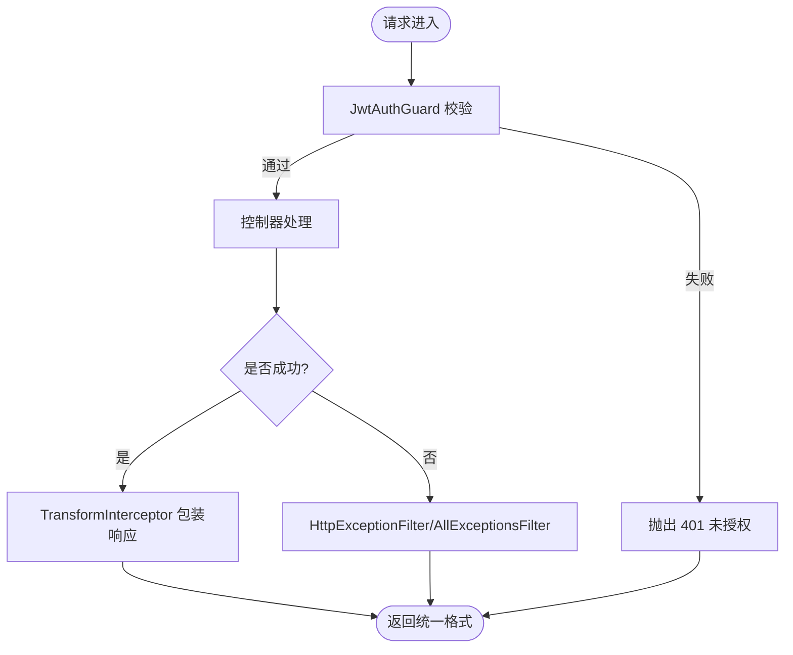

图表来源
- [transform.interceptor.ts:1-32](file://backend/src/common/interceptors/transform.interceptor.ts#L1-L32)
- [http-exception.filter.ts:1-81](file://backend/src/common/filters/http-exception.filter.ts#L1-L81)
- [jwt-auth.guard.ts:1-22](file://backend/src/common/guards/jwt-auth.guard.ts#L1-L22)

章节来源
- [transform.interceptor.ts:1-32](file://backend/src/common/interceptors/transform.interceptor.ts#L1-L32)
- [http-exception.filter.ts:1-81](file://backend/src/common/filters/http-exception.filter.ts#L1-L81)

#### 数据模型与索引
- 用户、衣物、搭配、收藏、试穿结果模型定义与关联关系
- 为常用查询字段建立索引（如用户 ID、分类等），提升查询性能

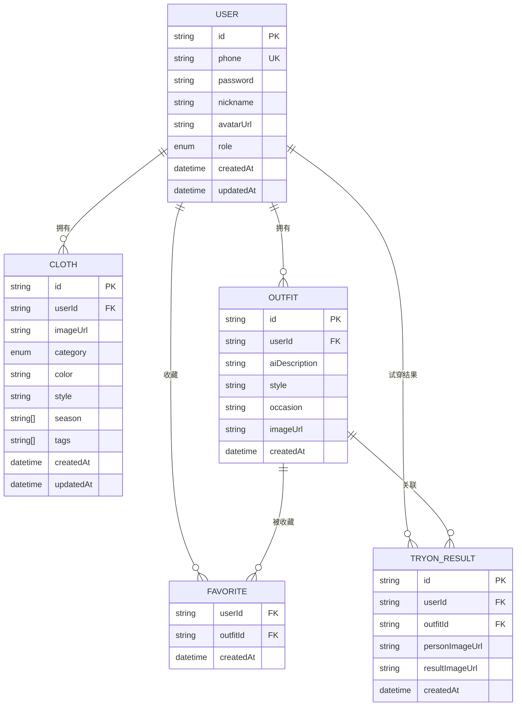

图表来源
- [schema.prisma:1-132](file://backend/prisma/schema.prisma#L1-L132)

章节来源
- [schema.prisma:1-132](file://backend/prisma/schema.prisma#L1-L132)

### 概念性总览
以下为概念性工作流图，展示从前端到后端再到数据库的整体交互：

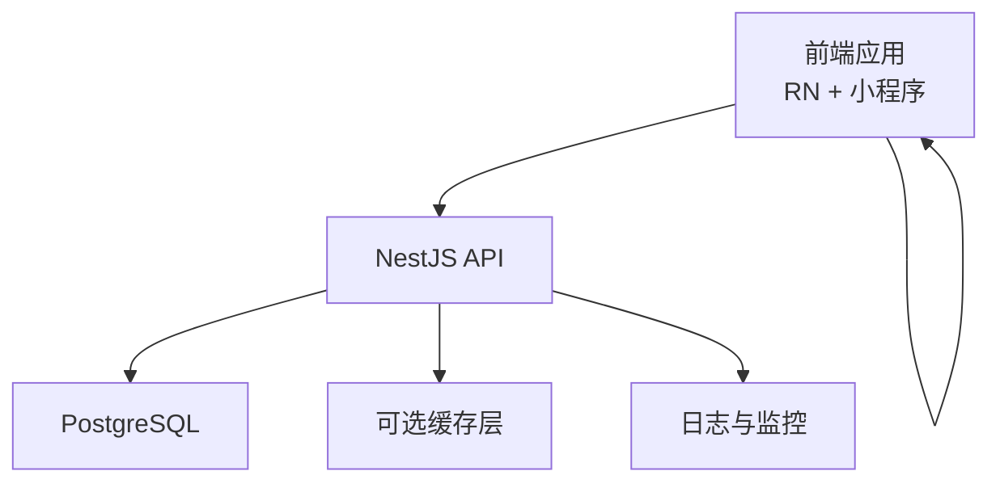

（该图为概念性示意，不对应具体源码文件）

## 依赖关系分析
- 前端依赖
  - React Native、Navigation、Axios、AsyncStorage、Zustand 等
- 后端依赖
  - NestJS 核心、Passport/JWT、Prisma、Class Validator/Transformer、Swagger 等
- 跨端配置
  - 微信小程序通过 app.json 配置页面与 TabBar，与后端 API 协议保持一致

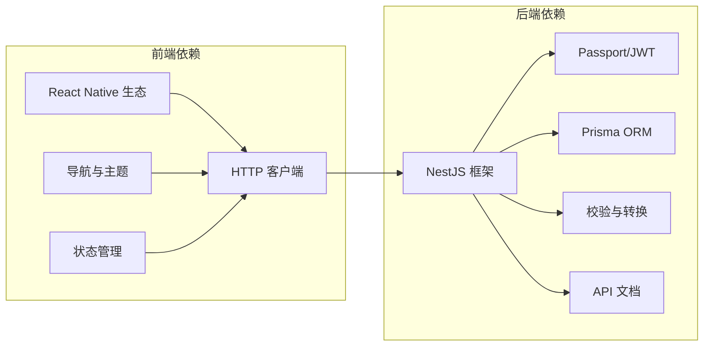

图表来源
- [package.json:1-57](file://FreeDressApp/package.json#L1-L57)
- [package.json:1-91](file://backend/package.json#L1-L91)

章节来源
- [package.json:1-57](file://FreeDressApp/package.json#L1-L57)
- [package.json:1-91](file://backend/package.json#L1-L91)
- [app.json:1-65](file://freeDressWechat/app.json#L1-L65)

## 性能考虑
- 前端
  - 使用本地存储减少重复登录，避免频繁网络请求
  - 图片与静态资源建议 CDN 加速与懒加载
- 后端
  - 合理使用 Prisma 查询与索引，避免 N+1 查询
  - 控制响应体大小，必要时分页与延迟加载
- 数据库
  - 为高频查询字段建立索引，定期分析与更新统计信息
  - 使用连接池与读写分离（如需）

（本节为通用指导，无需特定文件来源）

## 故障排除指南
- 前端
  - Token 刷新失败：检查刷新接口可用性与本地存储完整性；确认 401 重试逻辑正确执行
  - 登录状态异常：检查 Zustand 状态初始化与本地存储同步
- 后端
  - 401 未授权：确认请求头 Authorization 是否正确传递；检查 JwtAuthGuard 配置
  - 统一错误响应：确认 HttpExceptionFilter/AllExceptionsFilter 已注册且生效
  - Swagger 文档不可用：检查全局前缀与 Swagger 配置

章节来源
- [axios.ts:1-108](file://FreeDressApp/src/api/axios.ts#L1-L108)
- [authStore.ts:1-123](file://FreeDressApp/src/store/authStore.ts#L1-L123)
- [jwt-auth.guard.ts:1-22](file://backend/src/common/guards/jwt-auth.guard.ts#L1-L22)
- [http-exception.filter.ts:1-81](file://backend/src/common/filters/http-exception.filter.ts#L1-L81)
- [main.ts:1-62](file://backend/src/main.ts#L1-L62)

## 结论
畅搭（FreeDress）采用清晰的三层架构：前端负责用户体验与状态管理，后端提供统一 API 与数据访问，数据库承载业务数据。通过模块化设计与中间件体系（管道、拦截器、过滤器），系统具备良好的可维护性与扩展性。建议后续持续完善缓存策略、监控告警与自动化测试，以支撑业务增长。