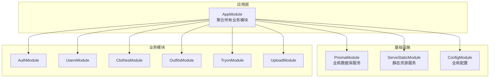
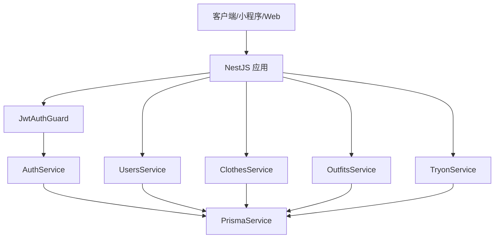
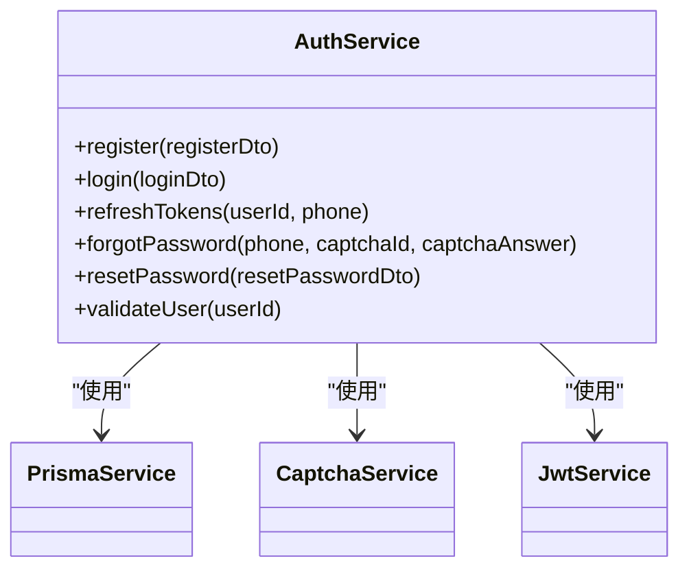
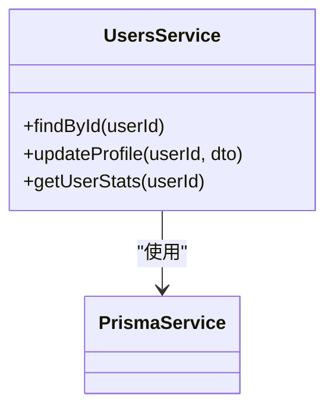
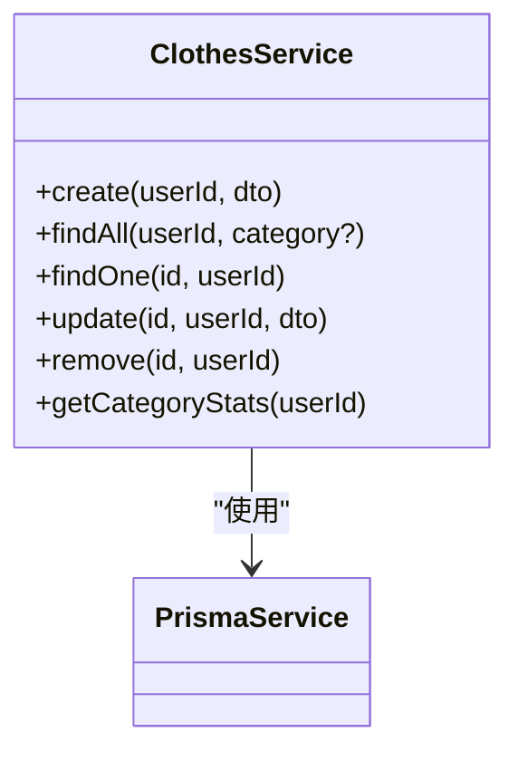
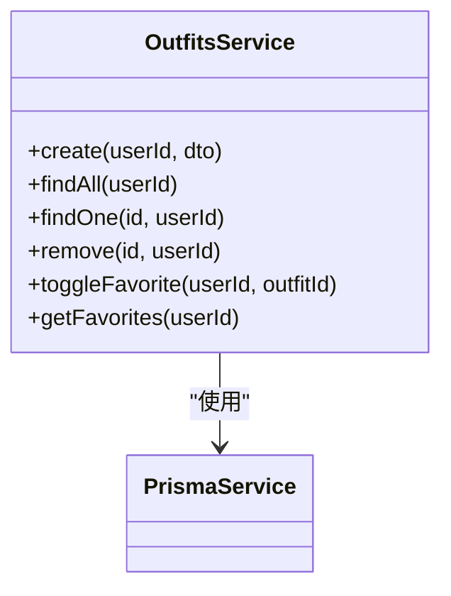
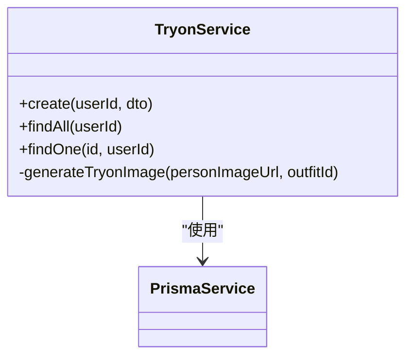
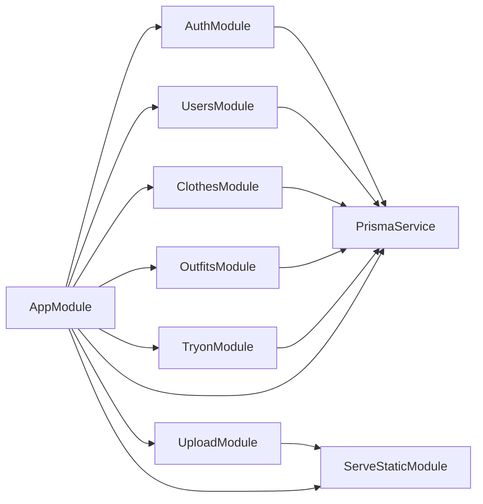

# 模块化设计

<cite>
**本文引用的文件**
- [backend/src/app.module.ts](file://backend/src/app.module.ts)
- [backend/src/main.ts](file://backend/src/main.ts)
- [backend/src/prisma/prisma.module.ts](file://backend/src/prisma/prisma.module.ts)
- [backend/src/modules/auth/auth.module.ts](file://backend/src/modules/auth/auth.module.ts)
- [backend/src/modules/auth/auth.service.ts](file://backend/src/modules/auth/auth.service.ts)
- [backend/src/modules/users/users.module.ts](file://backend/src/modules/users/users.module.ts)
- [backend/src/modules/users/users.service.ts](file://backend/src/modules/users/users.service.ts)
- [backend/src/modules/clothes/clothes.module.ts](file://backend/src/modules/clothes/clothes.module.ts)
- [backend/src/modules/clothes/clothes.service.ts](file://backend/src/modules/clothes/clothes.service.ts)
- [backend/src/modules/outfits/outfits.module.ts](file://backend/src/modules/outfits/outfits.module.ts)
- [backend/src/modules/outfits/outfits.service.ts](file://backend/src/modules/outfits/outfits.service.ts)
- [backend/src/modules/tryon/tryon.module.ts](file://backend/src/modules/tryon/tryon.module.ts)
- [backend/src/modules/tryon/tryon.service.ts](file://backend/src/modules/tryon/tryon.service.ts)
- [backend/src/modules/upload/upload.module.ts](file://backend/src/modules/upload/upload.module.ts)
- [backend/src/common/guards/jwt-auth.guard.ts](file://backend/src/common/guards/jwt-auth.guard.ts)
</cite>

## 目录
1. [简介](#简介)
2. [项目结构](#项目结构)
3. [核心组件](#核心组件)
4. [架构总览](#架构总览)
5. [详细组件分析](#详细组件分析)
6. [依赖分析](#依赖分析)
7. [性能考虑](#性能考虑)
8. [故障排查指南](#故障排查指南)
9. [结论](#结论)

## 简介
本设计文档面向畅搭(FreeDress)后端的模块化架构，系统性阐述认证模块(AuthModule)、用户模块(UsersModule)、衣物模块(ClothesModule)、搭配模块(OutfitsModule)、试穿模块(TryonModule)、上传模块(UploadModule)的设计理念、职责边界、依赖关系与接口设计。文档通过模块依赖图与交互时序图，帮助开发者快速理解模块化带来的可维护性、可扩展性与协作效率提升。

## 项目结构
后端采用 NestJS 模块化组织，根模块(AppModule)聚合各子模块；数据库访问通过全局模块(PrismaModule)统一注入；主进程(main.ts)集中配置全局管道、拦截器、过滤器、CORS、API 前缀与 Swagger 文档。

图表来源
- [backend/src/app.module.ts:13-30](file://backend/src/app.module.ts#L13-L30)
- [backend/src/prisma/prisma.module.ts:8-12](file://backend/src/prisma/prisma.module.ts#L8-L12)
- [backend/src/main.ts:31-35](file://backend/src/main.ts#L31-L35)

章节来源
- [backend/src/app.module.ts:1-33](file://backend/src/app.module.ts#L1-L33)
- [backend/src/main.ts:12-38](file://backend/src/main.ts#L12-L38)

## 核心组件
- 应用根模块(AppModule)：负责装配认证、用户、衣物、搭配、试穿、上传与数据库模块，并配置静态资源与全局中间件。
- 数据库模块(PrismaModule)：全局提供 PrismaService，为各业务模块注入数据访问能力。
- 认证模块(AuthModule)：提供登录、注册、验证码校验、Token 签发与刷新、忘记/重置密码等能力。
- 用户模块(UsersModule)：提供用户查询、资料更新、统计信息等服务。
- 衣物模块(ClothesModule)：提供衣物增删改查、分类统计等能力，并进行资源归属校验。
- 搭配模块(OutfitsModule)：提供搭配创建、收藏/取消收藏、收藏夹查询等能力。
- 试穿模块(TryonModule)：基于搭配生成“试穿”结果，当前为模拟 AI 输出，预留真实 AI 接入点。
- 上传模块(UploadModule)：提供文件上传能力（控制器与服务），结合静态资源模块对外提供上传文件访问。

章节来源
- [backend/src/app.module.ts:13-30](file://backend/src/app.module.ts#L13-L30)
- [backend/src/prisma/prisma.module.ts:8-12](file://backend/src/prisma/prisma.module.ts#L8-L12)
- [backend/src/modules/auth/auth.module.ts:13-27](file://backend/src/modules/auth/auth.module.ts#L13-L27)
- [backend/src/modules/users/users.module.ts:9-12](file://backend/src/modules/users/users.module.ts#L9-L12)
- [backend/src/modules/clothes/clothes.module.ts:9-12](file://backend/src/modules/clothes/clothes.module.ts#L9-L12)
- [backend/src/modules/outfits/outfits.module.ts:5-8](file://backend/src/modules/outfits/outfits.module.ts#L5-L8)
- [backend/src/modules/tryon/tryon.module.ts:5-8](file://backend/src/modules/tryon/tryon.module.ts#L5-L8)
- [backend/src/modules/upload/upload.module.ts:5-8](file://backend/src/modules/upload/upload.module.ts#L5-L8)

## 架构总览
模块化架构以“关注点分离”为核心，各模块职责清晰、边界明确，通过共享的 PrismaService 实现数据一致性与事务控制。认证模块提供安全边界，其余模块在受保护路由下工作；上传模块与静态资源模块配合，统一对外提供文件访问。

图表来源
- [backend/src/common/guards/jwt-auth.guard.ts:8-21](file://backend/src/common/guards/jwt-auth.guard.ts#L8-L21)
- [backend/src/modules/auth/auth.service.ts:30-37](file://backend/src/modules/auth/auth.service.ts#L30-L37)
- [backend/src/modules/users/users.service.ts:10-11](file://backend/src/modules/users/users.service.ts#L10-L11)
- [backend/src/modules/clothes/clothes.service.ts:12-13](file://backend/src/modules/clothes/clothes.service.ts#L12-L13)
- [backend/src/modules/outfits/outfits.service.ts:6-7](file://backend/src/modules/outfits/outfits.service.ts#L6-L7)
- [backend/src/modules/tryon/tryon.service.ts:6-7](file://backend/src/modules/tryon/tryon.service.ts#L6-L7)

## 详细组件分析

### 认证模块(AuthModule)
- 设计理念：围绕用户身份识别与会话管理，提供注册、登录、Token 签发与刷新、忘记/重置密码等完整流程。
- 职责边界：
  - 图片验证码校验与验证。
  - 密码加密与比对。
  - JWT 访问令牌与刷新令牌生成与管理。
  - 忘记密码流程中的临时令牌生成与过期清理。
- 关键依赖：
  - PrismaService：用户数据读写。
  - CaptchaService：验证码校验。
  - JwtService：Token 签发。
- 接口设计要点：
  - 注册/登录返回用户信息与 Token。
  - 忘记密码返回临时令牌，重置密码需提供有效令牌。
- 权限控制：
  - 使用 JwtAuthGuard 保护受控路由。
  - validateUser 用于策略中用户有效性校验。

图表来源
- [backend/src/modules/auth/auth.service.ts:24-37](file://backend/src/modules/auth/auth.service.ts#L24-L37)
- [backend/src/modules/auth/auth.module.ts:13-27](file://backend/src/modules/auth/auth.module.ts#L13-L27)

章节来源
- [backend/src/modules/auth/auth.module.ts:9-27](file://backend/src/modules/auth/auth.module.ts#L9-L27)
- [backend/src/modules/auth/auth.service.ts:44-135](file://backend/src/modules/auth/auth.service.ts#L44-L135)
- [backend/src/common/guards/jwt-auth.guard.ts:8-21](file://backend/src/common/guards/jwt-auth.guard.ts#L8-L21)

### 用户模块(UsersModule)
- 设计理念：围绕用户资料与统计信息，提供基础资料查询与更新、用户维度的统计汇总。
- 职责边界：
  - 根据 ID 查询用户详情与计数。
  - 更新用户资料。
  - 获取用户拥有的衣物、搭配、收藏、试穿次数等统计。
- 关键依赖：PrismaService。
- 接口设计要点：
  - findById 返回用户基本信息与计数聚合。
  - updateProfile 支持部分字段更新。
  - getUserStats 返回结构化的统计对象。

图表来源
- [backend/src/modules/users/users.service.ts:10-11](file://backend/src/modules/users/users.service.ts#L10-L11)
- [backend/src/modules/users/users.module.ts:9-12](file://backend/src/modules/users/users.module.ts#L9-L12)

章节来源
- [backend/src/modules/users/users.module.ts:5-12](file://backend/src/modules/users/users.module.ts#L5-L12)
- [backend/src/modules/users/users.service.ts:18-100](file://backend/src/modules/users/users.service.ts#L18-L100)

### 衣物模块(ClothesModule)
- 设计理念：围绕用户私有衣物资产，提供增删改查、分类统计与权限校验。
- 职责边界：
  - 创建衣物并绑定用户。
  - 分页/筛选查询（支持按分类）。
  - 单条详情查询并校验资源归属。
  - 更新与删除均进行归属校验。
  - 统计各分类数量。
- 关键依赖：PrismaService。
- 接口设计要点：
  - findOne 内部完成权限校验并返回包含关联信息的结果。
  - update/remove 先行校验归属再执行变更。
  - getCategoryStats 返回分类计数字典。

图表来源
- [backend/src/modules/clothes/clothes.service.ts:12-13](file://backend/src/modules/clothes/clothes.service.ts#L12-L13)
- [backend/src/modules/clothes/clothes.module.ts:9-12](file://backend/src/modules/clothes/clothes.module.ts#L9-L12)

章节来源
- [backend/src/modules/clothes/clothes.module.ts:5-12](file://backend/src/modules/clothes/clothes.module.ts#L5-L12)
- [backend/src/modules/clothes/clothes.service.ts:21-146](file://backend/src/modules/clothes/clothes.service.ts#L21-L146)

### 搭配模块(OutfitsModule)
- 设计理念：围绕用户搭配组合，提供搭配创建、收藏管理与收藏夹查询。
- 职责边界：
  - 创建搭配并建立与衣物的多对多关系。
  - 查询用户的全部搭配，包含每套搭配的组成衣物与收藏数。
  - 单条搭配详情查询并判断当前用户是否已收藏。
  - 收藏/取消收藏逻辑。
  - 查询当前用户的收藏夹。
- 关键依赖：PrismaService。
- 接口设计要点：
  - create 内联创建关联关系并按顺序排序。
  - findOne 返回 isFavorited 字段并隐藏内部辅助字段。
  - toggleFavorite 基于唯一索引实现幂等收藏/取消。

图表来源
- [backend/src/modules/outfits/outfits.service.ts:6-7](file://backend/src/modules/outfits/outfits.service.ts#L6-L7)
- [backend/src/modules/outfits/outfits.module.ts:5-8](file://backend/src/modules/outfits/outfits.module.ts#L5-L8)

章节来源
- [backend/src/modules/outfits/outfits.module.ts:5-10](file://backend/src/modules/outfits/outfits.module.ts#L5-L10)
- [backend/src/modules/outfits/outfits.service.ts:9-122](file://backend/src/modules/outfits/outfits.service.ts#L9-L122)

### 试穿模块(TryonModule)
- 设计理念：基于用户已有搭配生成“试穿”结果，当前为模拟 AI 输出，便于后续对接真实 AI 服务。
- 职责边界：
  - 校验搭配归属并创建试穿记录。
  - 查询用户试穿历史与单条详情。
  - 试穿结果生成（当前为模拟，预留真实 AI 接入点）。
- 关键依赖：PrismaService。
- 接口设计要点：
  - create 前置校验搭配归属与存在性。
  - generateTryonImage 为占位实现，后续替换为真实 AI 调用。

图表来源
- [backend/src/modules/tryon/tryon.service.ts:6-7](file://backend/src/modules/tryon/tryon.service.ts#L6-L7)
- [backend/src/modules/tryon/tryon.module.ts:5-8](file://backend/src/modules/tryon/tryon.module.ts#L5-L8)

章节来源
- [backend/src/modules/tryon/tryon.module.ts:5-10](file://backend/src/modules/tryon/tryon.module.ts#L5-L10)
- [backend/src/modules/tryon/tryon.service.ts:9-87](file://backend/src/modules/tryon/tryon.service.ts#L9-L87)

### 上传模块(UploadModule)
- 设计理念：提供文件上传能力，结合静态资源模块对外暴露上传目录。
- 职责边界：
  - 文件上传（控制器与服务）。
  - 与静态资源模块配合，提供上传文件访问路径。
- 关键依赖：静态资源模块 ServeStaticModule。
- 接口设计要点：
  - 上传接口由 UploadController 暴露，UploadService 负责具体逻辑。
  - 通过全局前缀与静态根路径统一对外访问。

章节来源
- [backend/src/app.module.ts:19-22](file://backend/src/app.module.ts#L19-L22)
- [backend/src/modules/upload/upload.module.ts:5-8](file://backend/src/modules/upload/upload.module.ts#L5-L8)

### 认证与权限守卫
- JwtAuthGuard：继承自 Passport 的 AuthGuard('jwt')，在请求进入受保护路由时进行身份验证，失败则抛出未授权异常。
- 与 AuthService 的集成：JwtStrategy 与 validateUser 保证 Token 解析后的用户有效性。

章节来源
- [backend/src/common/guards/jwt-auth.guard.ts:8-21](file://backend/src/common/guards/jwt-auth.guard.ts#L8-L21)
- [backend/src/modules/auth/auth.service.ts:260-277](file://backend/src/modules/auth/auth.service.ts#L260-L277)

## 依赖分析
- 模块耦合度：低耦合。各业务模块仅通过 PrismaService 进行数据访问，避免相互直接依赖。
- 外部依赖：JWT、Passport、Bcrypt、UUID 等第三方库在认证模块内使用；静态资源通过 ServeStaticModule 提供。
- 循环依赖：未见循环依赖迹象，模块导入链清晰。
- 可能的优化点：
  - 将认证模块的部分能力（如验证码）抽象为独立模块，提高复用性。
  - 在 TryonService 中将 generateTryonImage 抽象为可插拔的 AI 适配器，便于替换实现。

图表来源
- [backend/src/app.module.ts:13-30](file://backend/src/app.module.ts#L13-L30)
- [backend/src/prisma/prisma.module.ts:8-12](file://backend/src/prisma/prisma.module.ts#L8-L12)
- [backend/src/main.ts:19-22](file://backend/src/main.ts#L19-L22)

章节来源
- [backend/src/app.module.ts:13-30](file://backend/src/app.module.ts#L13-L30)
- [backend/src/main.ts:19-22](file://backend/src/main.ts#L19-L22)

## 性能考虑
- 数据访问：PrismaService 作为单一数据源，建议在高频查询场景使用分页与索引优化，避免一次性加载大量数据。
- Token 签发：AuthService 并行签发访问与刷新 Token，减少往返时间。
- 试穿生成：当前为同步模拟，建议将 generateTryonImage 改为异步任务队列或外部服务调用，避免阻塞请求线程。
- 缓存策略：对于只读统计（如用户统计、分类统计）可引入缓存，降低数据库压力。

## 故障排查指南
- 未授权访问：
  - 确认请求头携带有效的 Bearer Token。
  - 检查 JwtAuthGuard 是否正确应用于受保护路由。
- 资源归属校验失败：
  - 确认请求参数中的用户 ID 与 Token 中的用户 ID 一致。
  - 检查 ClothesService/OutfitsService/TryonService 的权限校验逻辑。
- 数据库异常：
  - 检查 PrismaService 的连接配置与迁移状态。
  - 关注唯一索引冲突（如收藏去重）导致的异常。
- 上传文件无法访问：
  - 确认 ServeStaticModule 的 rootPath 与 serveRoot 配置正确。
  - 检查文件权限与路径映射。

章节来源
- [backend/src/common/guards/jwt-auth.guard.ts:14-20](file://backend/src/common/guards/jwt-auth.guard.ts#L14-L20)
- [backend/src/modules/clothes/clothes.service.ts:75-78](file://backend/src/modules/clothes/clothes.service.ts#L75-L78)
- [backend/src/modules/outfits/outfits.service.ts:64-66](file://backend/src/modules/outfits/outfits.service.ts#L64-L66)
- [backend/src/modules/tryon/tryon.service.ts:67-72](file://backend/src/modules/tryon/tryon.service.ts#L67-L72)
- [backend/src/app.module.ts:19-22](file://backend/src/app.module.ts#L19-L22)

## 结论
该模块化架构通过清晰的职责划分与低耦合设计，实现了认证、用户、衣物、搭配、试穿与上传六大领域的高内聚、松耦合。配合全局中间件与守卫，确保了安全性与可维护性。未来可在 AI 试穿、验证码服务与缓存策略等方面进一步增强扩展性与性能表现。