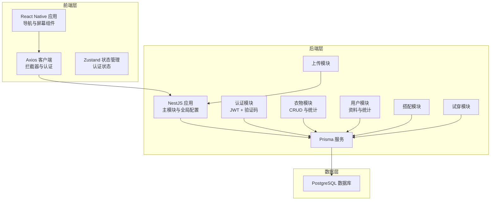
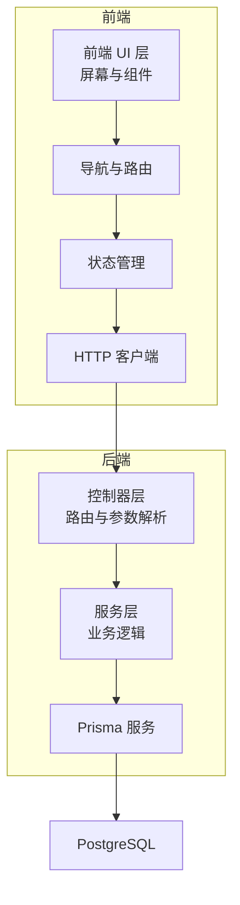
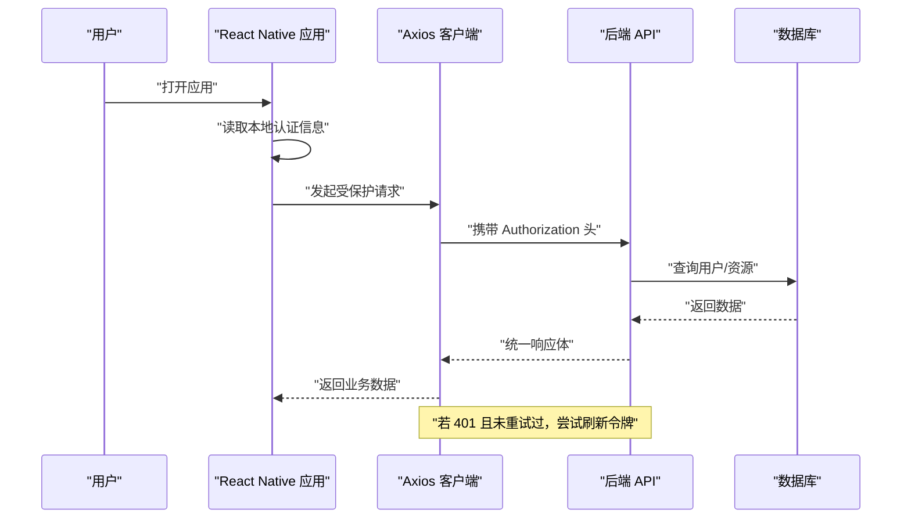
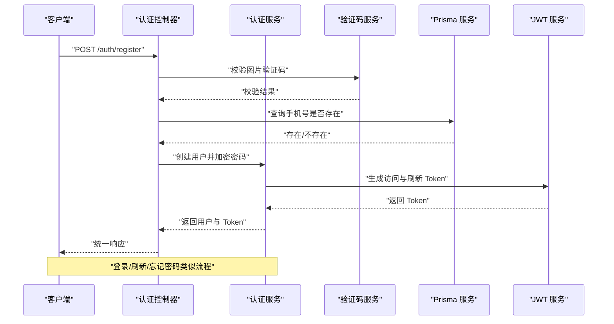
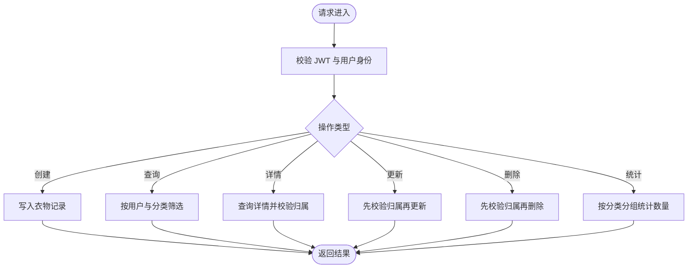
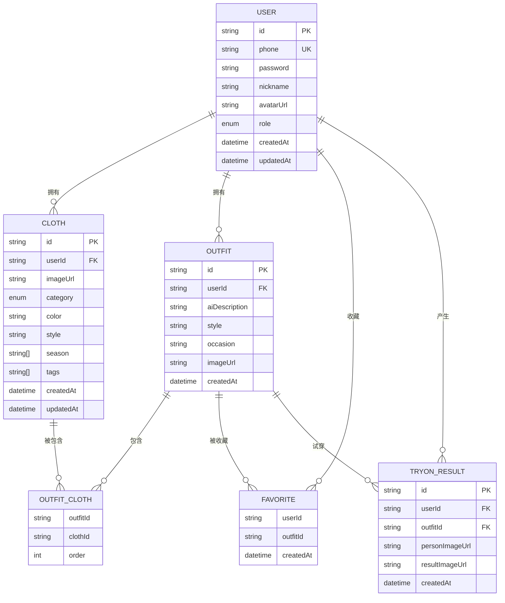
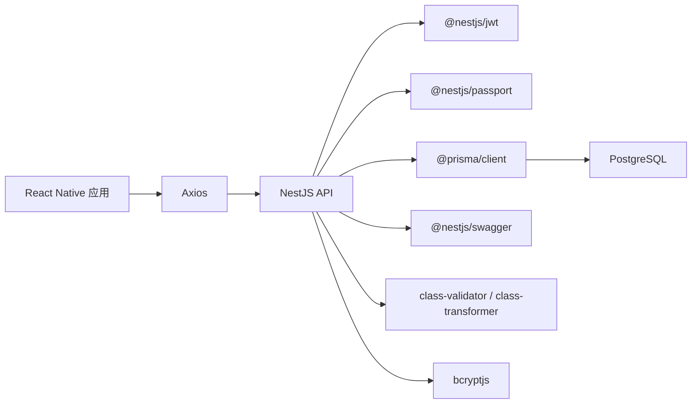

# 系统架构

<cite>
**本文引用的文件**   
- [FreeDressApp/package.json](file://FreeDressApp/package.json)
- [FreeDressApp/README.md](file://FreeDressApp/README.md)
- [FreeDressApp/src/App.tsx](file://FreeDressApp/src/App.tsx)
- [FreeDressApp/src/navigation/RootNavigator.tsx](file://FreeDressApp/src/navigation/RootNavigator.tsx)
- [FreeDressApp/src/api/axios.ts](file://FreeDressApp/src/api/axios.ts)
- [backend/package.json](file://backend/package.json)
- [backend/README.md](file://backend/README.md)
- [backend/src/main.ts](file://backend/src/main.ts)
- [backend/src/app.module.ts](file://backend/src/app.module.ts)
- [backend/prisma/schema.prisma](file://backend/prisma/schema.prisma)
- [backend/src/modules/auth/auth.module.ts](file://backend/src/modules/auth/auth.module.ts)
- [backend/src/modules/auth/auth.service.ts](file://backend/src/modules/auth/auth.service.ts)
- [backend/src/modules/clothes/clothes.module.ts](file://backend/src/modules/clothes/clothes.module.ts)
- [backend/src/modules/clothes/clothes.service.ts](file://backend/src/modules/clothes/clothes.service.ts)
- [backend/src/modules/users/users.module.ts](file://backend/src/modules/users/users.module.ts)
- [backend/src/modules/users/users.service.ts](file://backend/src/modules/users/users.service.ts)
- [backend/src/common/guards/jwt-auth.guard.ts](file://backend/src/common/guards/jwt-auth.guard.ts)
- [backend/src/common/interceptors/transform.interceptor.ts](file://backend/src/common/interceptors/transform.interceptor.ts)
</cite>

## 目录
1. [引言](#引言)
2. [项目结构](#项目结构)
3. [核心组件](#核心组件)
4. [架构总览](#架构总览)
5. [详细组件分析](#详细组件分析)
6. [依赖分析](#依赖分析)
7. [性能考虑](#性能考虑)
8. [故障排查指南](#故障排查指南)
9. [结论](#结论)
10. [附录](#附录)

## 引言
畅搭（FreeDress）是一个面向移动端的智能衣物搭配平台，采用前后端分离架构：前端为跨平台移动应用（React Native），后端为基于 NestJS 的 REST API 服务，数据库层采用 PostgreSQL 与 Prisma ORM。系统围绕“认证、用户管理、衣物管理、搭配管理、收藏管理、AI 试穿”等核心模块展开，提供从用户操作到 API 调用再到数据库持久化的完整数据流。

## 项目结构
系统分为三大层次：
- 前端层（React Native 移动应用）：负责用户界面、导航、状态管理与 API 通信。
- 后端层（NestJS 服务）：提供统一 API、认证鉴权、业务逻辑与数据访问。
- 数据层（PostgreSQL + Prisma）：持久化用户、衣物、搭配、收藏、试穿结果等实体。

**图表来源**
- [backend/src/app.module.ts:13-30](file://backend/src/app.module.ts#L13-L30)
- [backend/src/main.ts:12-59](file://backend/src/main.ts#L12-L59)
- [backend/prisma/schema.prisma:14-131](file://backend/prisma/schema.prisma#L14-L131)
- [FreeDressApp/src/api/axios.ts:12-107](file://FreeDressApp/src/api/axios.ts#L12-L107)

**章节来源**
- [FreeDressApp/README.md:86-118](file://FreeDressApp/README.md#L86-L118)
- [backend/README.md:119-154](file://backend/README.md#L119-L154)

## 核心组件
- 前端应用入口与导航
  - 应用根组件负责全局 Provider 与导航容器；根导航器根据登录状态切换主内容或登录注册流程。
- API 客户端
  - Axios 实例封装基础配置、请求/响应拦截器，自动注入认证头、处理 401 刷新令牌、统一错误提示。
- 后端应用入口
  - 初始化 Nest 应用，配置全局管道、拦截器、过滤器、CORS、全局前缀与 Swagger 文档。
- 数据库与模型
  - Prisma 定义用户、衣物、搭配、收藏、试穿结果等模型及其关系，映射到 PostgreSQL。

**章节来源**
- [FreeDressApp/src/App.tsx:11-27](file://FreeDressApp/src/App.tsx#L11-L27)
- [FreeDressApp/src/navigation/RootNavigator.tsx:41-84](file://FreeDressApp/src/navigation/RootNavigator.tsx#L41-L84)
- [FreeDressApp/src/api/axios.ts:24-105](file://FreeDressApp/src/api/axios.ts#L24-L105)
- [backend/src/main.ts:12-59](file://backend/src/main.ts#L12-L59)
- [backend/prisma/schema.prisma:14-131](file://backend/prisma/schema.prisma#L14-L131)

## 架构总览
系统采用分层与模块化设计：
- 表现层（React Native）：屏幕组件、自定义 UI 组件、导航与状态管理。
- 控制层（NestJS）：模块化业务域（认证、用户、衣物、搭配、试穿、上传），统一响应格式与异常处理。
- 数据访问层（Prisma）：类型安全的数据访问与数据库迁移工具链。
- 数据存储（PostgreSQL）：高可靠的关系型数据存储。

**图表来源**
- [FreeDressApp/src/navigation/RootNavigator.tsx:13-84](file://FreeDressApp/src/navigation/RootNavigator.tsx#L13-L84)
- [FreeDressApp/src/api/axios.ts:12-107](file://FreeDressApp/src/api/axios.ts#L12-L107)
- [backend/src/app.module.ts:13-30](file://backend/src/app.module.ts#L13-L30)
- [backend/prisma/schema.prisma:14-131](file://backend/prisma/schema.prisma#L14-L131)

## 详细组件分析

### 前端：认证与导航流程
- 登录/注册流程：根导航器在未登录状态下显示登录/注册页面；登录成功后进入主 Tab 导航。
- 认证状态：Zustand 管理登录态与加载状态；应用启动时尝试从本地存储恢复认证信息。
- API 通信：Axios 请求拦截器自动附加 Bearer Token；响应拦截器处理 401 并尝试刷新令牌；失败则清空本地认证信息。

**图表来源**
- [FreeDressApp/src/navigation/RootNavigator.tsx:42-47](file://FreeDressApp/src/navigation/RootNavigator.tsx#L42-L47)
- [FreeDressApp/src/api/axios.ts:24-105](file://FreeDressApp/src/api/axios.ts#L24-L105)
- [backend/src/common/interceptors/transform.interceptor.ts:20-31](file://backend/src/common/interceptors/transform.interceptor.ts#L20-L31)

**章节来源**
- [FreeDressApp/src/navigation/RootNavigator.tsx:41-84](file://FreeDressApp/src/navigation/RootNavigator.tsx#L41-L84)
- [FreeDressApp/src/api/axios.ts:24-105](file://FreeDressApp/src/api/axios.ts#L24-L105)

### 后端：认证模块（JWT + 验证码）
- 模块组成：认证控制器、服务、策略、验证码服务。
- 业务流程：注册（图片验证码校验 + 密码加密 + 生成双 Token）、登录（校验用户与密码 + 生成双 Token）、刷新 Token、忘记密码（生成临时重置令牌 + 校验过期 + 更新密码）。
- 安全性：bcrypt 密码加密、JWT 双 Token（短期访问 + 长期刷新）、Passport JWT 策略与守卫保护接口。

**图表来源**
- [backend/src/modules/auth/auth.module.ts:13-29](file://backend/src/modules/auth/auth.module.ts#L13-L29)
- [backend/src/modules/auth/auth.service.ts:44-95](file://backend/src/modules/auth/auth.service.ts#L44-L95)
- [backend/src/modules/auth/auth.service.ts:102-135](file://backend/src/modules/auth/auth.service.ts#L102-L135)
- [backend/src/modules/auth/auth.service.ts:143-145](file://backend/src/modules/auth/auth.service.ts#L143-L145)
- [backend/src/modules/auth/auth.service.ts:180-207](file://backend/src/modules/auth/auth.service.ts#L180-L207)
- [backend/src/modules/auth/auth.service.ts:214-242](file://backend/src/modules/auth/auth.service.ts#L214-L242)

**章节来源**
- [backend/src/modules/auth/auth.module.ts:13-29](file://backend/src/modules/auth/auth.module.ts#L13-L29)
- [backend/src/modules/auth/auth.service.ts:44-279](file://backend/src/modules/auth/auth.service.ts#L44-L279)

### 后端：衣物管理模块
- 业务职责：创建、查询（支持分类筛选）、详情（权限校验）、更新、删除、分类统计。
- 权限控制：通过当前用户装饰器与守卫确保资源归属。
- 数据访问：Prisma 查询与聚合统计。

**图表来源**
- [backend/src/modules/clothes/clothes.service.ts:21-146](file://backend/src/modules/clothes/clothes.service.ts#L21-L146)

**章节来源**
- [backend/src/modules/clothes/clothes.module.ts:9-14](file://backend/src/modules/clothes/clothes.module.ts#L9-L14)
- [backend/src/modules/clothes/clothes.service.ts:21-146](file://backend/src/modules/clothes/clothes.service.ts#L21-L146)

### 后端：用户管理模块
- 业务职责：按 ID 查询用户详情（含统计字段）、更新用户资料、获取用户统计数据（衣物/搭配/收藏/试穿数量）。
- 数据访问：Prisma 聚合统计与选择性字段返回。

**章节来源**
- [backend/src/modules/users/users.module.ts:9-14](file://backend/src/modules/users/users.module.ts#L9-L14)
- [backend/src/modules/users/users.service.ts:18-100](file://backend/src/modules/users/users.service.ts#L18-L100)

### 数据模型与关系
系统核心实体与关系如下：

**图表来源**
- [backend/prisma/schema.prisma:14-131](file://backend/prisma/schema.prisma#L14-L131)

**章节来源**
- [backend/prisma/schema.prisma:14-131](file://backend/prisma/schema.prisma#L14-L131)

## 依赖分析
- 前端依赖
  - React Native、React Navigation、Axios、Zustand、Async Storage、Reanimated、Image Picker 等，支撑跨平台 UI、导航、网络与状态管理。
- 后端依赖
  - NestJS 核心、JWT、Passport、Prisma、Swagger、Bcrypt、Class Validator/Transformer 等，支撑模块化架构、认证、ORM、文档与输入校验。
- 数据库与 ORM
  - Prisma 作为 ORM 与迁移工具，PostgreSQL 作为持久化存储，提供强一致性和关系建模能力。

**图表来源**
- [FreeDressApp/package.json:12-31](file://FreeDressApp/package.json#L12-L31)
- [backend/package.json:26-44](file://backend/package.json#L26-L44)
- [backend/prisma/schema.prisma:4-11](file://backend/prisma/schema.prisma#L4-L11)

**章节来源**
- [FreeDressApp/package.json:12-31](file://FreeDressApp/package.json#L12-L31)
- [backend/package.json:26-44](file://backend/package.json#L26-L44)

## 性能考虑
- 前端
  - 使用 Shopify Flash List 优化长列表渲染；Reanimated 提升动画性能；Async Storage 缓存轻量数据。
- 后端
  - 全局拦截器统一响应格式，减少重复封装；Prisma 查询使用索引列（如用户 ID、分类）进行筛选与排序；合理使用 include 与 select，避免 N+1 查询。
- 数据库
  - 为高频查询字段建立索引；利用 Prisma 的 groupBy 进行统计聚合；控制返回字段大小，避免不必要的大字段传输。

## 故障排查指南
- 前端
  - 401 未授权：检查本地存储的访问/刷新令牌是否有效；确认响应拦截器是否正确触发刷新流程；必要时清除本地认证信息并引导重新登录。
  - 网络超时/失败：检查 baseURL 与超时配置；查看拦截器错误处理日志。
- 后端
  - 全局异常过滤器与统一响应拦截器会将错误标准化输出；JWT 守卫会在认证失败时抛出未授权异常；Prisma 查询异常会向上抛出。
  - Swagger 文档可快速定位接口与参数，便于调试。

**章节来源**
- [FreeDressApp/src/api/axios.ts:44-105](file://FreeDressApp/src/api/axios.ts#L44-L105)
- [backend/src/common/interceptors/transform.interceptor.ts:20-31](file://backend/src/common/interceptors/transform.interceptor.ts#L20-L31)
- [backend/src/common/guards/jwt-auth.guard.ts:9-21](file://backend/src/common/guards/jwt-auth.guard.ts#L9-L21)

## 结论
畅搭系统通过 React Native 与 NestJS 的组合，实现了跨平台前端与高内聚后端的协同；借助 Prisma 与 PostgreSQL，系统具备清晰的数据模型与稳定的持久化能力。模块化设计使认证、用户、衣物、搭配与试穿等功能边界清晰、易于扩展与维护。统一的响应格式、JWT 认证与拦截器/守卫体系保障了系统的安全性与一致性。

## 附录
- 技术选型说明
  - React Native：跨平台移动开发框架，适合快速迭代与统一代码库。
  - NestJS：基于 TypeScript 的企业级 Node.js 框架，模块化与依赖注入提升可维护性。
  - Prisma：类型安全的 ORM，简化数据库建模与迁移。
  - PostgreSQL：成熟的关系型数据库，支持复杂查询与事务。
- 系统边界与集成
  - 前后端通过 REST API 通信，API 文档由 Swagger 自动生成；静态资源（如上传文件）由后端 ServeStatic 提供服务端访问路径。