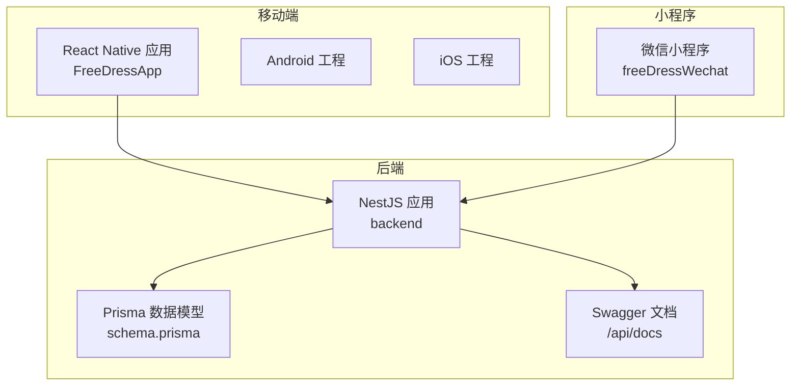
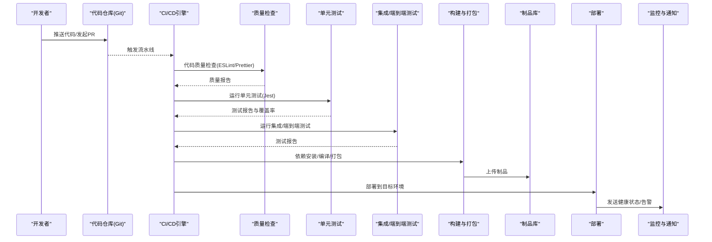
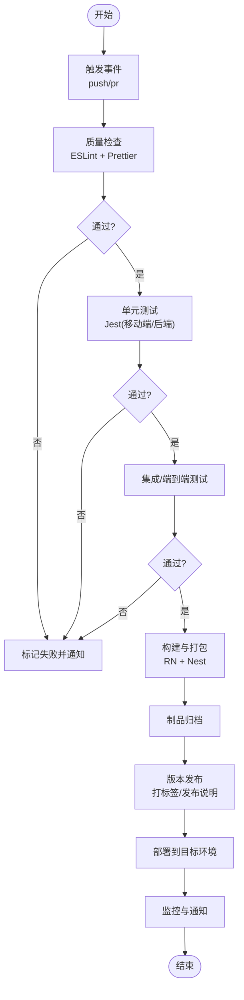
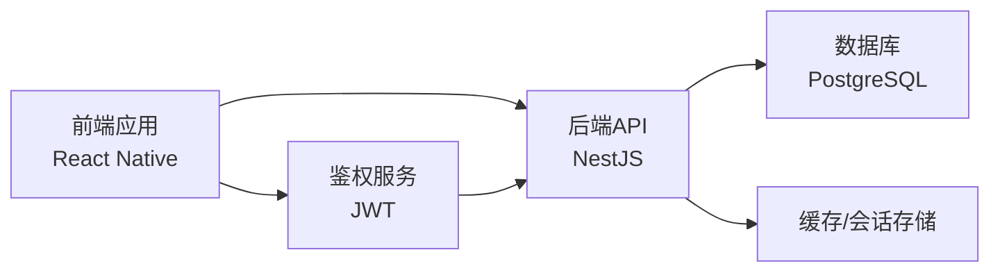

# CI/CD流水线

<cite>
**本文引用的文件**
- [FreeDressApp/package.json](file://FreeDressApp/package.json)
- [FreeDressApp/jest.config.js](file://FreeDressApp/jest.config.js)
- [FreeDressApp/.eslintrc.js](file://FreeDressApp/.eslintrc.js)
- [FreeDressApp/.prettierrc.js](file://FreeDressApp/.prettierrc.js)
- [FreeDressApp/babel.config.js](file://FreeDressApp/babel.config.js)
- [FreeDressApp/metro.config.js](file://FreeDressApp/metro.config.js)
- [FreeDressApp/app.json](file://FreeDressApp/app.json)
- [FreeDressApp/src/App.tsx](file://FreeDressApp/src/App.tsx)
- [backend/package.json](file://backend/package.json)
- [backend/tsconfig.json](file://backend/tsconfig.json)
- [backend/src/main.ts](file://backend/src/main.ts)
- [backend/src/app.module.ts](file://backend/src/app.module.ts)
- [backend/src/modules/auth/auth.service.ts](file://backend/src/modules/auth/auth.service.ts)
- [backend/prisma/schema.prisma](file://backend/prisma/schema.prisma)
</cite>

## 目录
1. [简介](#简介)
2. [项目结构](#项目结构)
3. [核心组件](#核心组件)
4. [架构总览](#架构总览)
5. [详细组件分析](#详细组件分析)
6. [依赖分析](#依赖分析)
7. [性能考虑](#性能考虑)
8. [故障排查指南](#故障排查指南)
9. [结论](#结论)
10. [附录](#附录)

## 简介
本指南面向畅搭(FreeDress)项目的开发与运维团队，提供一套可落地的CI/CD流水线实施与维护方案。内容覆盖自动化构建与部署、代码质量检查、单元测试与集成测试、依赖安装、编译与打包、产物管理与版本发布、以及监控与通知机制。文档同时给出基于GitHub Actions与Jenkins两种主流CI/CD工具的配置思路与最佳实践，帮助团队建立稳定、高效、可追溯的持续交付体系。

## 项目结构
畅搭项目采用前后端分离架构：
- 移动端：React Native应用，位于 FreeDressApp 目录，包含Android/iOS工程、TypeScript源码、测试与构建配置。
- 后端：NestJS应用，位于 backend 目录，包含TypeScript源码、Prisma数据模型与迁移、Swagger文档、测试配置等。
- 微信小程序：freeDressWechat 目录，提供微信小程序页面与组件，便于多端协同与数据互通。

**图表来源**
- [backend/src/main.ts:1-62](file://backend/src/main.ts#L1-L62)
- [backend/prisma/schema.prisma:1-132](file://backend/prisma/schema.prisma#L1-L132)

**章节来源**
- [FreeDressApp/package.json:1-57](file://FreeDressApp/package.json#L1-L57)
- [backend/package.json:1-91](file://backend/package.json#L1-L91)

## 核心组件
- 代码质量与格式化
  - ESLint规则继承自React Native官方预设，统一前端代码风格与质量基线。
  - Prettier配置启用单引号、尾逗号等约定，保证跨团队一致性。
- 测试框架
  - 移动端使用Jest + React Native官方预设进行单元测试。
  - 后端使用Jest + ts-jest进行单元测试与覆盖率统计；提供e2e测试脚本入口。
- 构建与打包
  - 移动端通过Babel与Metro进行编译与打包；RN CLI提供运行与调试命令。
  - 后端通过Nest CLI与TypeScript编译器进行构建，输出dist目录供运行时使用。
- 数据层
  - Prisma作为ORM，支持数据库模式定义、迁移与客户端生成；后端通过ConfigModule加载环境变量。
- API与文档
  - Swagger在后端提供API文档服务，便于接口联调与发布前验收。

**章节来源**
- [FreeDressApp/.eslintrc.js:1-5](file://FreeDressApp/.eslintrc.js#L1-L5)
- [FreeDressApp/.prettierrc.js:1-6](file://FreeDressApp/.prettierrc.js#L1-L6)
- [FreeDressApp/jest.config.js:1-4](file://FreeDressApp/jest.config.js#L1-L4)
- [FreeDressApp/babel.config.js:1-4](file://FreeDressApp/babel.config.js#L1-L4)
- [FreeDressApp/metro.config.js:1-12](file://FreeDressApp/metro.config.js#L1-L12)
- [backend/tsconfig.json:1-32](file://backend/tsconfig.json#L1-L32)
- [backend/src/main.ts:1-62](file://backend/src/main.ts#L1-L62)
- [backend/src/app.module.ts:1-33](file://backend/src/app.module.ts#L1-L33)
- [backend/prisma/schema.prisma:1-132](file://backend/prisma/schema.prisma#L1-L132)

## 架构总览
下图展示CI/CD流水线的关键阶段与组件交互：从代码提交触发流水线，到依赖安装、代码检查、测试执行、构建打包、制品归档与部署，再到发布与通知闭环。

**图表来源**
- [FreeDressApp/package.json:5-11](file://FreeDressApp/package.json#L5-L11)
- [backend/package.json:8-25](file://backend/package.json#L8-L25)
- [backend/src/main.ts:1-62](file://backend/src/main.ts#L1-L62)

## 详细组件分析

### GitHub Actions流水线配置
以下为基于本仓库现状的流水线阶段设计与建议，涵盖质量检查、测试、构建与部署。实际YAML配置需结合具体仓库权限、制品库与部署目标进行定制。

- 触发条件
  - 主分支保护：仅允许通过PR合并至主分支；主分支变更触发部署。
  - 开发分支：推送触发全量检查与测试。
- 作业拆分
  - 质量检查作业：运行ESLint与Prettier格式化检查。
  - 单元测试作业：分别执行移动端与后端Jest测试，并收集覆盖率。
  - 集成/端到端测试作业：在受控环境中运行e2e测试（如需要数据库迁移与种子数据）。
  - 构建与打包作业：移动端生成APK/APK签名、iOS IPA；后端生成dist包。
  - 制品归档与发布作业：上传制品至制品库，按语义化版本打标签并发布。
  - 部署作业：根据分支策略部署至测试/预发布/生产环境。
  - 监控与通知：失败时发送通知至IM或邮件。

**图表来源**
- [FreeDressApp/package.json:5-11](file://FreeDressApp/package.json#L5-L11)
- [backend/package.json:8-25](file://backend/package.json#L8-L25)

**章节来源**
- [FreeDressApp/package.json:5-11](file://FreeDressApp/package.json#L5-L11)
- [backend/package.json:8-25](file://backend/package.json#L8-L25)

### Jenkins流水线配置
- 流水线类型：Declarative Pipeline（推荐）或 Scripted Pipeline（高级场景）。
- 阶段划分
  - 初始化：声明工具链（Node、Android SDK、Xcode、JDK）、克隆代码、加载环境变量。
  - 质量检查：ESLint、Prettier。
  - 测试：Jest（移动端与后端），生成覆盖率报告。
  - 构建：移动端构建APK/IPA；后端编译dist。
  - 归档：上传制品至制品库（如Artifactory/Nexus）。
  - 部署：按分支策略部署至测试/预发布/生产。
  - 回收：清理工作空间与缓存。
- 插件建议：Pipeline Utility Steps、Publish Over SSH、Slack Notification、JUnit、CodeCoverage API、Artifact Archiver。
- 安全与权限：使用凭据绑定（Secret Text、SSH、证书），避免硬编码敏感信息。

**章节来源**
- [FreeDressApp/package.json:5-11](file://FreeDressApp/package.json#L5-L11)
- [backend/package.json:8-25](file://backend/package.json#L8-L25)

### 代码质量检查
- ESLint
  - 继承React Native官方预设，确保规则一致；可在仓库根目录新增.eslintrc扩展以满足团队规范。
  - 建议在CI中强制执行，失败即阻断流水线。
- Prettier
  - 与ESLint配合，统一代码风格；可配置Git钩子在提交前自动格式化。
- 规则建议
  - 禁止console调试输出（开发期可保留，CI中严格禁止）。
  - 限制导入路径别名使用范围，避免循环依赖。
  - 强制函数返回类型与参数类型标注，提升可维护性。

**章节来源**
- [FreeDressApp/.eslintrc.js:1-5](file://FreeDressApp/.eslintrc.js#L1-L5)
- [FreeDressApp/.prettierrc.js:1-6](file://FreeDressApp/.prettierrc.js#L1-L6)

### 单元测试与集成测试
- 移动端
  - Jest预设已配置，建议补充快照测试与组件测试；对网络请求与导航进行Mock。
  - 可选：Detox进行端到端测试（需额外配置设备/模拟器）。
- 后端
  - 使用Jest + ts-jest；建议为每个模块编写单元测试，覆盖业务逻辑与边界条件。
  - e2e测试：通过Supertest或Nest Test Host发起HTTP请求，结合数据库事务回滚。
- 覆盖率
  - 后端已内置覆盖率目录；建议在CI中设置阈值（如语句/分支/函数/行均不低于80%）。

**章节来源**
- [FreeDressApp/jest.config.js:1-4](file://FreeDressApp/jest.config.js#L1-L4)
- [backend/package.json:73-89](file://backend/package.json#L73-L89)

### 依赖安装、编译与打包
- 依赖安装
  - 移动端：使用npm/yarn安装依赖，缓存节点缓存以加速。
  - 后端：安装依赖后生成Prisma客户端。
- 编译
  - 移动端：Babel转译 + Metro打包；RN CLI提供调试与运行命令。
  - 后端：TypeScript编译至dist目录，Nest CLI负责构建。
- 打包
  - 移动端：Android生成APK/IPA；iOS需配置签名与描述文件；Android可启用混淆与资源压缩。
  - 后端：dist目录直接部署；可选容器镜像化（见“部署策略”）。

**章节来源**
- [FreeDressApp/babel.config.js:1-4](file://FreeDressApp/babel.config.js#L1-L4)
- [FreeDressApp/metro.config.js:1-12](file://FreeDressApp/metro.config.js#L1-L12)
- [backend/tsconfig.json:1-32](file://backend/tsconfig.json#L1-L32)

### 持续部署策略与分支管理
- 分支策略
  - 主分支：稳定版本，触发生产部署。
  - 预发布分支：合并重要功能，触发预发布环境部署。
  - 开发分支：日常开发，触发测试环境部署。
- 环境配置
  - 通过环境变量区分不同环境（开发/测试/预发布/生产）；敏感信息使用密钥管理服务。
- 部署方式
  - 容器化部署：后端构建镜像推送到镜像仓库，Kubernetes/Helm/Compose进行编排。
  - 传统部署：后端直接部署dist；移动端通过应用商店或内测渠道发布。
- 回滚策略：支持灰度发布与一键回滚，记录发布日志与变更摘要。

**章节来源**
- [backend/src/app.module.ts:1-33](file://backend/src/app.module.ts#L1-L33)
- [backend/src/main.ts:1-62](file://backend/src/main.ts#L1-L62)

### 构建产物管理与版本发布
- 语义化版本
  - 建议使用语义化版本号（主.次.修订），在主分支合并时由CI自动升级。
- 制品管理
  - 移动端：APK/IPA上传至制品库或应用商店；记录构建元数据（提交哈希、时间、构建者）。
  - 后端：dist目录与Docker镜像同时归档；记录依赖锁文件与构建脚本。
- 发布流程
  - 打标签并生成发布说明；触发部署作业；更新文档与公告。

**章节来源**
- [FreeDressApp/package.json:1-57](file://FreeDressApp/package.json#L1-L57)
- [backend/package.json:1-91](file://backend/package.json#L1-L91)

### 监控与通知机制
- 健康检查
  - 后端：提供/health端点；定时探活；异常时自动告警。
- 日志与追踪
  - 统一日志格式与采集；关键路径埋点与链路追踪。
- 通知
  - 失败通知：Slack/钉钉/邮件；成功通知：简要摘要。
- 可视化
  - CI/CD仪表盘展示成功率、耗时、失败原因分布。

**章节来源**
- [backend/src/main.ts:1-62](file://backend/src/main.ts#L1-L62)

## 依赖分析
- 前后端耦合点
  - API契约：后端Swagger提供接口文档；前端按契约对接。
  - 数据库：Prisma模型定义约束；迁移脚本需与后端同步演进。
- 第三方服务
  - 鉴权：JWT密钥与过期策略；后端集中管理。
  - 存储：静态资源上传路径与访问控制；后端ServeStatic模块提供服务。
- 依赖版本
  - Node版本要求已在前端package.json中声明；后端使用TypeScript与NestJS生态。

**图表来源**
- [backend/src/main.ts:1-62](file://backend/src/main.ts#L1-L62)
- [backend/prisma/schema.prisma:1-132](file://backend/prisma/schema.prisma#L1-L132)

**章节来源**
- [backend/src/main.ts:1-62](file://backend/src/main.ts#L1-L62)
- [backend/prisma/schema.prisma:1-132](file://backend/prisma/schema.prisma#L1-L132)

## 性能考虑
- 并行化
  - 将质量检查、测试、构建拆分为独立并行作业，缩短总时长。
- 缓存优化
  - 缓存Node模块、Gradle、Pod、Metro缓存，显著减少重复安装与编译时间。
- 资源隔离
  - 使用容器或专用Agent承载不同阶段，避免资源争用。
- 测试优化
  - 使用Jest的并发与覆盖率阈值，减少无效测试；e2e测试按模块分组执行。
- 构建优化
  - 后端启用增量编译；移动端启用ProGuard/R8混淆与资源压缩。

## 故障排查指南
- 质量检查失败
  - 检查ESLint/Prettier规则与本地配置一致性；在CI中开启严格模式。
- 测试失败
  - 查看测试报告与覆盖率；针对失败用例增加Mock与边界条件。
- 构建失败
  - 检查Node版本与依赖锁文件；确认Babel/Metro配置兼容。
- 部署失败
  - 校验环境变量与密钥；查看后端日志与数据库连接；回滚至上一版本。
- 数据库问题
  - Prisma迁移失败时，先备份再回滚；确保迁移脚本幂等。

**章节来源**
- [FreeDressApp/package.json:53-55](file://FreeDressApp/package.json#L53-L55)
- [backend/package.json:21-24](file://backend/package.json#L21-L24)
- [backend/src/modules/auth/auth.service.ts:1-279](file://backend/src/modules/auth/auth.service.ts#L1-L279)

## 结论
通过本指南，团队可以基于现有技术栈快速搭建稳定高效的CI/CD流水线。建议从质量检查与单元测试起步，逐步完善集成测试、构建与部署，并配套监控与通知机制，形成闭环的质量保障体系。随着业务发展，持续迭代流水线配置，引入更细粒度的权限与安全策略，确保交付效率与系统稳定性双提升。

## 附录
- 关键配置清单
  - 移动端：package.json脚本、Jest配置、ESLint与Prettier配置、Babel与Metro配置。
  - 后端：package.json脚本、Jest配置、TypeScript配置、Swagger与CORS配置、Prisma模型与迁移。
- 最佳实践
  - 以分支策略驱动部署；以语义化版本驱动发布；以监控与告警驱动运维。
  - 将安全与合规纳入流水线：依赖扫描、漏洞检测、密钥管理与最小权限原则。

**章节来源**
- [FreeDressApp/package.json:1-57](file://FreeDressApp/package.json#L1-L57)
- [backend/package.json:1-91](file://backend/package.json#L1-L91)
- [backend/tsconfig.json:1-32](file://backend/tsconfig.json#L1-L32)
- [backend/src/main.ts:1-62](file://backend/src/main.ts#L1-L62)
- [backend/prisma/schema.prisma:1-132](file://backend/prisma/schema.prisma#L1-L132)