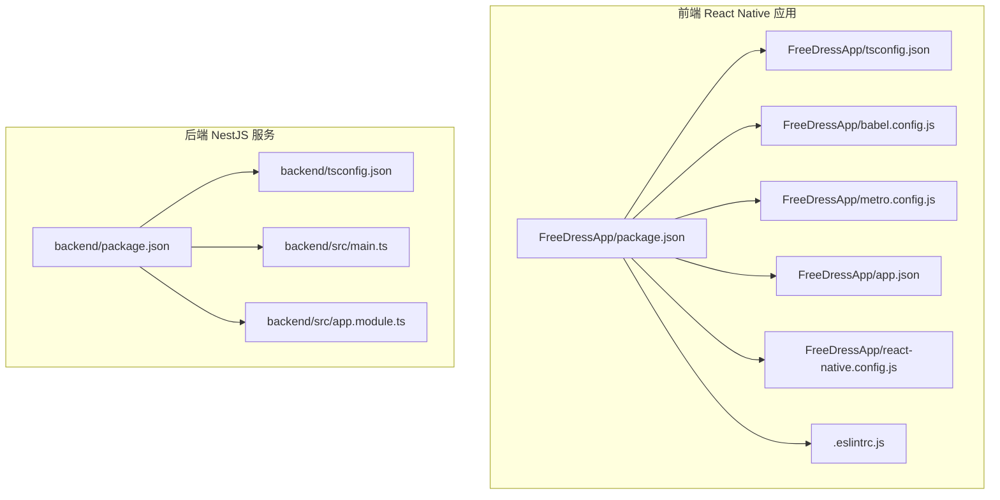
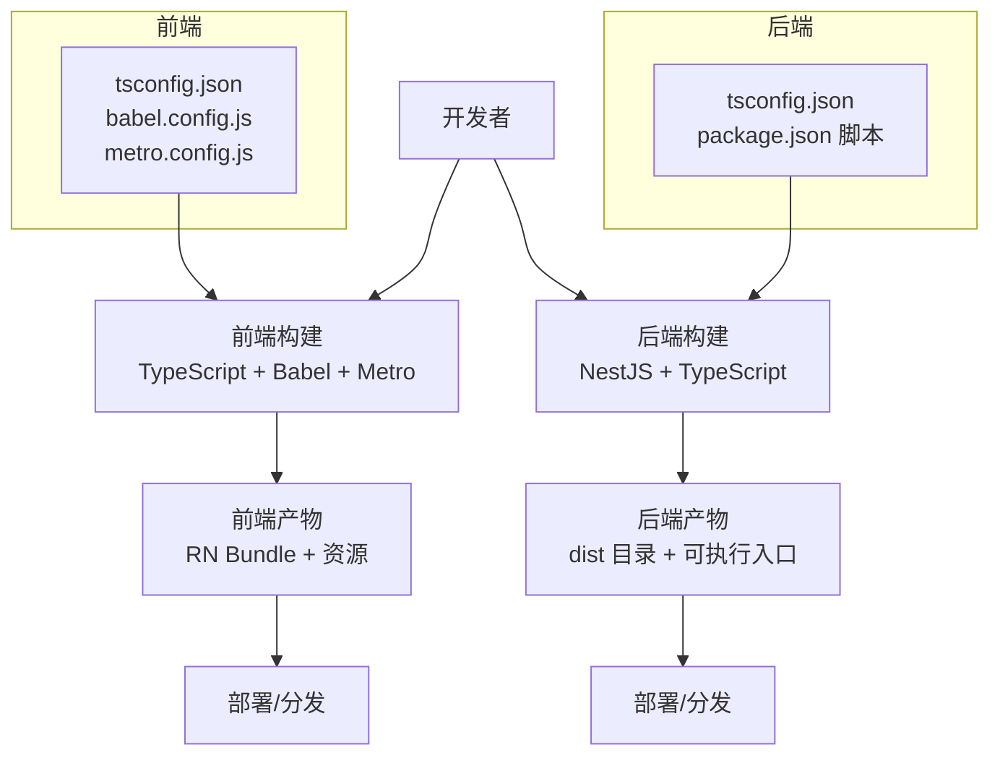
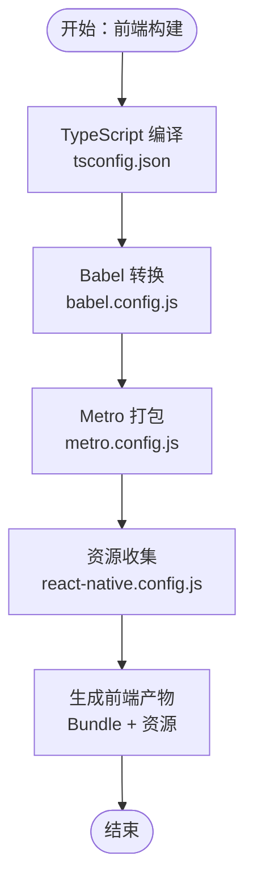
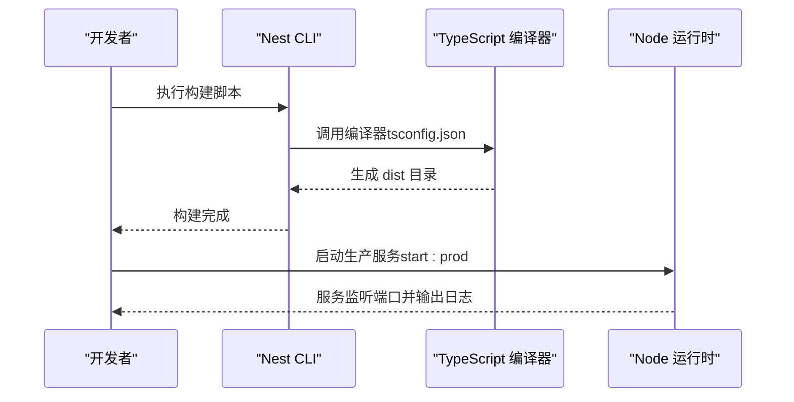
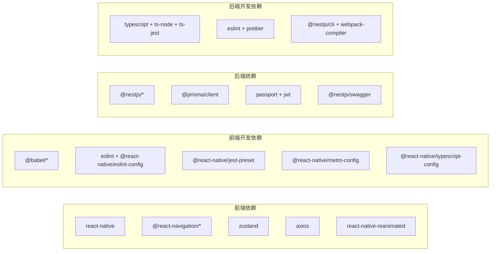

# 构建自动化

<cite>
**本文引用的文件**
- [FreeDressApp/package.json](file://FreeDressApp/package.json)
- [FreeDressApp/tsconfig.json](file://FreeDressApp/tsconfig.json)
- [FreeDressApp/babel.config.js](file://FreeDressApp/babel.config.js)
- [FreeDressApp/metro.config.js](file://FreeDressApp/metro.config.js)
- [FreeDressApp/app.json](file://FreeDressApp/app.json)
- [FreeDressApp/react-native.config.js](file://FreeDressApp/react-native.config.js)
- [FreeDressApp/.eslintrc.js](file://FreeDressApp/.eslintrc.js)
- [backend/package.json](file://backend/package.json)
- [backend/tsconfig.json](file://backend/tsconfig.json)
- [backend/src/main.ts](file://backend/src/main.ts)
- [backend/src/app.module.ts](file://backend/src/app.module.ts)
</cite>

## 目录
1. [简介](#简介)
2. [项目结构](#项目结构)
3. [核心组件](#核心组件)
4. [架构总览](#架构总览)
5. [详细组件分析](#详细组件分析)
6. [依赖关系分析](#依赖关系分析)
7. [性能考量](#性能考量)
8. [故障排查指南](#故障排查指南)
9. [结论](#结论)
10. [附录](#附录)

## 简介
本指南面向畅搭(FreeDress)项目的开发团队，系统化阐述前端 React Native 应用与后端 NestJS 服务的构建自动化配置与最佳实践。内容涵盖 TypeScript 编译配置、依赖管理、打包策略、构建脚本编写与执行、开发/生产环境差异、构建产物优化与压缩、构建缓存与增量构建等，帮助团队建立稳定高效的 CI/CD 流水线。

## 项目结构
畅搭项目采用多包结构：
- 前端：FreeDressApp（React Native 应用）
- 后端：backend（NestJS 应用）
- 微信小程序：freeDressWechat（微信小程序，不在本次构建自动化范围内）

前端与后端分别拥有独立的包管理与构建配置，通过各自脚本进行开发、测试与构建。

图表来源
- [FreeDressApp/package.json:1-57](file://FreeDressApp/package.json#L1-L57)
- [FreeDressApp/tsconfig.json:1-9](file://FreeDressApp/tsconfig.json#L1-L9)
- [FreeDressApp/babel.config.js:1-4](file://FreeDressApp/babel.config.js#L1-L4)
- [FreeDressApp/metro.config.js:1-12](file://FreeDressApp/metro.config.js#L1-L12)
- [FreeDressApp/app.json:1-5](file://FreeDressApp/app.json#L1-L5)
- [FreeDressApp/react-native.config.js:1-3](file://FreeDressApp/react-native.config.js#L1-L3)
- [FreeDressApp/.eslintrc.js:1-5](file://FreeDressApp/.eslintrc.js#L1-L5)
- [backend/package.json:1-91](file://backend/package.json#L1-L91)
- [backend/tsconfig.json:1-32](file://backend/tsconfig.json#L1-L32)
- [backend/src/main.ts:1-62](file://backend/src/main.ts#L1-L62)
- [backend/src/app.module.ts:1-33](file://backend/src/app.module.ts#L1-L33)

章节来源
- [FreeDressApp/package.json:1-57](file://FreeDressApp/package.json#L1-L57)
- [backend/package.json:1-91](file://backend/package.json#L1-L91)

## 核心组件
- 前端构建核心
  - TypeScript 配置：继承官方 RN TS 配置，统一编译选项与排除路径。
  - Babel 预设：使用官方 RN Babel 预设，并启用 Reanimated 插件。
  - Metro 配置：基于默认配置合并扩展，便于后续按需定制。
  - 应用元信息：app.json 提供应用名称与显示名。
  - 资源配置：react-native.config.js 声明字体资源目录。
  - Lint 规则：继承 @react-native ESLint 规则集。
- 后端构建核心
  - TypeScript 配置：目标 ES2021，启用增量编译，配置路径映射，输出到 dist。
  - NestJS 脚本：提供 build、start、start:dev、start:prod、测试与 Prisma 相关脚本。
  - 入口与模块：main.ts 初始化应用、注册全局管道/拦截器/过滤器、Swagger 文档与 CORS；app.module.ts 组合各业务模块与静态资源服务。

章节来源
- [FreeDressApp/tsconfig.json:1-9](file://FreeDressApp/tsconfig.json#L1-L9)
- [FreeDressApp/babel.config.js:1-4](file://FreeDressApp/babel.config.js#L1-L4)
- [FreeDressApp/metro.config.js:1-12](file://FreeDressApp/metro.config.js#L1-L12)
- [FreeDressApp/app.json:1-5](file://FreeDressApp/app.json#L1-L5)
- [FreeDressApp/react-native.config.js:1-3](file://FreeDressApp/react-native.config.js#L1-L3)
- [FreeDressApp/.eslintrc.js:1-5](file://FreeDressApp/.eslintrc.js#L1-L5)
- [backend/tsconfig.json:1-32](file://backend/tsconfig.json#L1-L32)
- [backend/package.json:8-25](file://backend/package.json#L8-L25)
- [backend/src/main.ts:12-62](file://backend/src/main.ts#L12-L62)
- [backend/src/app.module.ts:13-33](file://backend/src/app.module.ts#L13-L33)

## 架构总览
下图展示前端与后端在构建阶段的关键交互与职责边界：

图表来源
- [FreeDressApp/tsconfig.json:1-9](file://FreeDressApp/tsconfig.json#L1-L9)
- [FreeDressApp/babel.config.js:1-4](file://FreeDressApp/babel.config.js#L1-L4)
- [FreeDressApp/metro.config.js:1-12](file://FreeDressApp/metro.config.js#L1-L12)
- [backend/tsconfig.json:1-32](file://backend/tsconfig.json#L1-L32)
- [backend/package.json:8-25](file://backend/package.json#L8-L25)

## 详细组件分析

### 前端构建组件分析
- TypeScript 编译配置
  - 继承官方 RN TS 配置，确保与 React Native 工具链一致。
  - include/exclude 明确包含与排除范围，避免无关文件参与编译。
- Babel 转换
  - 使用官方 RN Babel 预设，保证语法与运行时兼容性。
  - 启用 Reanimated 插件以支持手势与动画工作槽。
- Metro 打包
  - 基于默认配置合并，便于扩展自定义解析器、加速器或插件。
- 应用与资源
  - app.json 提供应用元数据。
  - react-native.config.js 声明字体资源目录，确保打包时资源被正确收集。
- Lint 规则
  - 继承 @react-native ESLint 规则，统一代码风格与质量基线。

图表来源
- [FreeDressApp/tsconfig.json:1-9](file://FreeDressApp/tsconfig.json#L1-L9)
- [FreeDressApp/babel.config.js:1-4](file://FreeDressApp/babel.config.js#L1-L4)
- [FreeDressApp/metro.config.js:1-12](file://FreeDressApp/metro.config.js#L1-L12)
- [FreeDressApp/react-native.config.js:1-3](file://FreeDressApp/react-native.config.js#L1-L3)

章节来源
- [FreeDressApp/tsconfig.json:1-9](file://FreeDressApp/tsconfig.json#L1-L9)
- [FreeDressApp/babel.config.js:1-4](file://FreeDressApp/babel.config.js#L1-L4)
- [FreeDressApp/metro.config.js:1-12](file://FreeDressApp/metro.config.js#L1-L12)
- [FreeDressApp/react-native.config.js:1-3](file://FreeDressApp/react-native.config.js#L1-L3)
- [FreeDressApp/app.json:1-5](file://FreeDressApp/app.json#L1-L5)
- [FreeDressApp/.eslintrc.js:1-5](file://FreeDressApp/.eslintrc.js#L1-L5)

### 后端构建组件分析
- TypeScript 编译配置
  - 目标 ES2021，启用增量编译提升二次构建速度。
  - 配置路径映射，简化导入路径书写。
  - 输出目录 dist，便于统一产物管理。
- NestJS 脚本与生命周期
  - build：调用 nest build 完成编译。
  - start/start:dev/start:debug/start:prod：不同模式启动服务。
  - test/test:watch/test:cov/test:debug/test:e2e：覆盖测试场景。
  - Prisma 相关脚本：generate/migrate/studio/seed。
- 应用入口与模块
  - main.ts 注册全局验证管道、统一响应拦截器、异常过滤器、CORS 与 Swagger 文档。
  - app.module.ts 组合 Config、ServeStatic、Prisma 与各业务模块，并对外提供 /uploads 静态资源服务。

图表来源
- [backend/package.json:8-25](file://backend/package.json#L8-L25)
- [backend/tsconfig.json:1-32](file://backend/tsconfig.json#L1-L32)
- [backend/src/main.ts:12-62](file://backend/src/main.ts#L12-L62)

章节来源
- [backend/tsconfig.json:1-32](file://backend/tsconfig.json#L1-L32)
- [backend/package.json:8-25](file://backend/package.json#L8-L25)
- [backend/src/main.ts:12-62](file://backend/src/main.ts#L12-L62)
- [backend/src/app.module.ts:13-33](file://backend/src/app.module.ts#L13-L33)

### 开发与生产环境构建差异
- 前端
  - 开发：使用 react-native start 启动 Metro 服务器，支持热重载与调试。
  - 生产：通过 react-native run-android/run-ios 或打包工具产出可分发包；Metro 默认配置适用于开发，生产可结合平台原生打包流程。
- 后端
  - 开发：start:dev/watch 模式自动重启，适合迭代开发。
  - 生产：start:prod 直接运行 dist/main，建议配合进程管理器与环境变量部署。

章节来源
- [FreeDressApp/package.json:5-11](file://FreeDressApp/package.json#L5-L11)
- [backend/package.json:8-16](file://backend/package.json#L8-L16)

### 构建脚本编写与执行
- 前端
  - 常用脚本：start、test、lint、android、ios。
  - 建议在 CI 中增加：lint、test、bundle（针对平台）。
- 后端
  - 常用脚本：build、start、start:dev、start:debug、start:prod、test、test:watch、test:cov、test:e2e、prisma:*。
  - 建议在 CI 中增加：lint、test:cov、build、prisma:migrate（预校验迁移）。

章节来源
- [FreeDressApp/package.json:5-11](file://FreeDressApp/package.json#L5-L11)
- [backend/package.json:8-25](file://backend/package.json#L8-L25)

### 构建产物优化与压缩策略
- 前端
  - Metro 默认已对 JS/CSS/图片等进行打包与压缩；可在生产构建中开启最小化与资源内联策略（如适用）。
  - 图片与字体资源建议在 react-native.config.js 中集中声明，避免遗漏。
- 后端
  - TypeScript 输出为 CommonJS，配合 Node 运行时直接执行；可通过外部打包工具（如 webpack）进一步优化，但当前仓库未启用。
  - 建议在 CI 中生成 source map 以便问题定位，同时在生产禁用调试模式。

章节来源
- [FreeDressApp/metro.config.js:1-12](file://FreeDressApp/metro.config.js#L1-L12)
- [FreeDressApp/react-native.config.js:1-3](file://FreeDressApp/react-native.config.js#L1-L3)
- [backend/tsconfig.json:9-11](file://backend/tsconfig.json#L9-L11)

### 构建缓存与增量构建
- 前端
  - Metro 作为打包器，结合 React Native 的缓存机制可减少重复编译时间；建议在 CI 中缓存 node_modules 与 Metro 缓存目录。
- 后端
  - TypeScript 启用增量编译（incremental），显著缩短二次构建时间；建议在 CI 中缓存 node_modules 与 .tsbuildinfo。

章节来源
- [backend/tsconfig.json:15](file://backend/tsconfig.json#L15)
- [backend/package.json:8-16](file://backend/package.json#L8-L16)

## 依赖关系分析
- 前端
  - 依赖 React Native 与导航、状态管理、网络请求、动画等生态库；开发依赖包括 Babel、ESLint、Jest、Prettier、Metro 配置等。
- 后端
  - 依赖 NestJS 核心、数据库访问层、认证授权、Swagger、Prisma 等；开发依赖包括 TypeScript、ESLint、Jest、Webpack 编译器等。

图表来源
- [FreeDressApp/package.json:12-52](file://FreeDressApp/package.json#L12-L52)
- [backend/package.json:26-72](file://backend/package.json#L26-L72)

章节来源
- [FreeDressApp/package.json:12-52](file://FreeDressApp/package.json#L12-L52)
- [backend/package.json:26-91](file://backend/package.json#L26-L91)

## 性能考量
- 增量编译
  - 后端启用 TypeScript 增量编译，CI 中缓存 node_modules 与 .tsbuildinfo，可显著降低构建时间。
- 并行与流水线
  - 将 lint、test、build 步骤并行化，缩短整体流水线时长。
- 资源优化
  - 前端资源在 Metro 中默认压缩；建议在 CI 中开启更严格的压缩策略（如适用）。
- 运行时优化
  - 后端生产模式禁用调试与 watch，仅加载必要模块，减少内存占用。

[本节为通用指导，无需列出章节来源]

## 故障排查指南
- 前端
  - Metro 启动失败：检查 metro.config.js 与 babel.config.js 是否存在语法错误；确认 node 版本满足 engines 要求。
  - 资源缺失：确认 react-native.config.js 中资源路径是否正确。
  - Lint 失败：根据 .eslintrc.js 规则修复；必要时在 CI 中添加自动修复步骤。
- 后端
  - 构建失败：检查 tsconfig.json 路径映射与编译目标；确认依赖安装完整。
  - 启动异常：查看 main.ts 中全局管道/拦截器/过滤器配置；确认环境变量与数据库连接。
  - 测试失败：使用 test:watch 快速定位问题；关注覆盖率报告。

章节来源
- [FreeDressApp/package.json:53-56](file://FreeDressApp/package.json#L53-L56)
- [FreeDressApp/react-native.config.js:1-3](file://FreeDressApp/react-native.config.js#L1-L3)
- [FreeDressApp/.eslintrc.js:1-5](file://FreeDressApp/.eslintrc.js#L1-L5)
- [backend/tsconfig.json:1-32](file://backend/tsconfig.json#L1-L32)
- [backend/src/main.ts:12-62](file://backend/src/main.ts#L12-L62)

## 结论
通过明确的 TypeScript 编译配置、Babel 转换与 Metro 打包策略，以及 NestJS 的标准化构建脚本，畅搭项目在前后端均具备清晰的构建自动化基础。建议在 CI 中引入缓存、并行化与产物优化策略，持续提升构建效率与稳定性。

[本节为总结性内容，无需列出章节来源]

## 附录
- 关键配置文件清单
  - 前端：tsconfig.json、babel.config.js、metro.config.js、react-native.config.js、app.json、.eslintrc.js
  - 后端：tsconfig.json、package.json（含脚本）、src/main.ts、src/app.module.ts

[本节为概览性内容，无需列出章节来源]