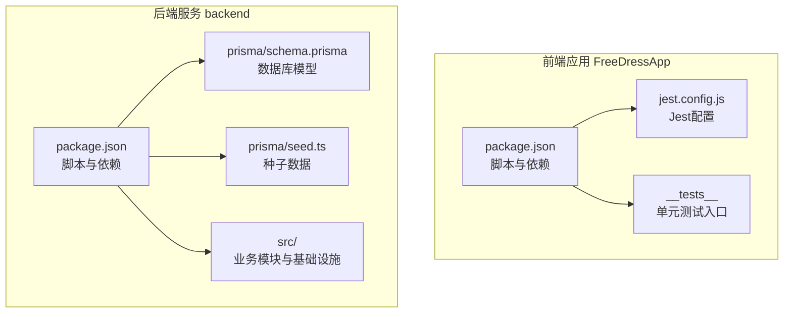
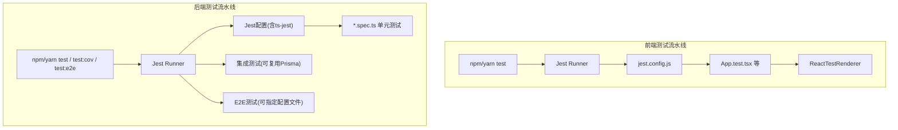
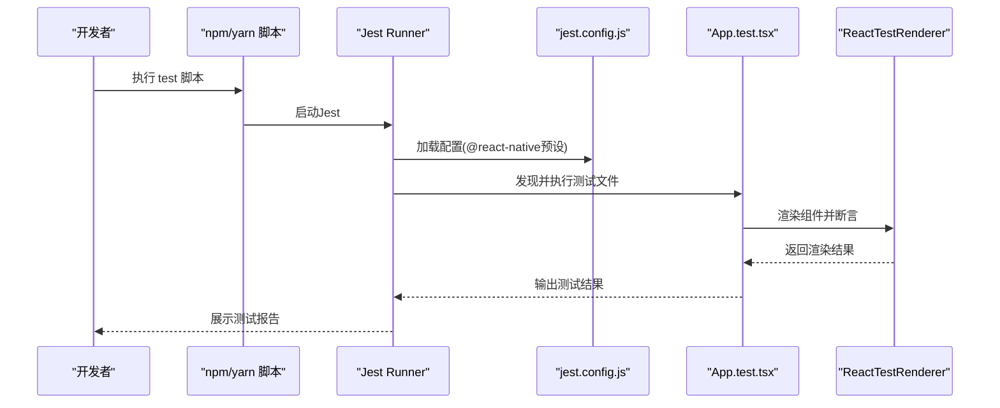
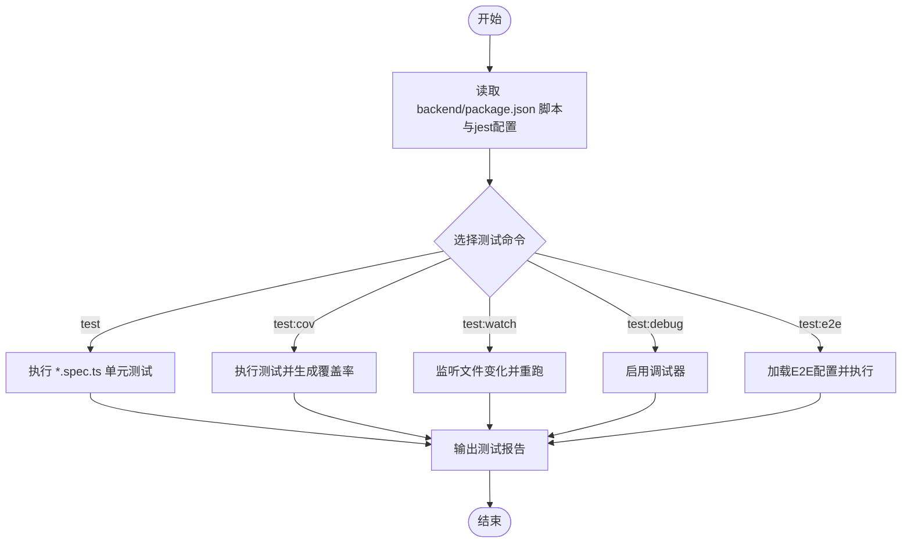
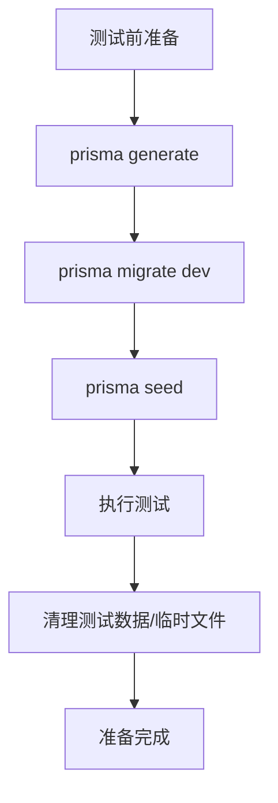
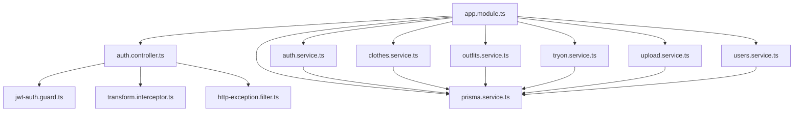

# 测试自动化

<cite>
**本文引用的文件**
- [FreeDressApp/jest.config.js](file://FreeDressApp/jest.config.js)
- [FreeDressApp/package.json](file://FreeDressApp/package.json)
- [FreeDressApp/__tests__/App.test.tsx](file://FreeDressApp/__tests__/App.test.tsx)
- [backend/package.json](file://backend/package.json)
- [backend/prisma/schema.prisma](file://backend/prisma/schema.prisma)
- [backend/prisma/seed.ts](file://backend/prisma/seed.ts)
- [backend/src/modules/auth/auth.service.ts](file://backend/src/modules/auth/auth.service.ts)
- [backend/src/modules/auth/auth.controller.ts](file://backend/src/modules/auth/auth.controller.ts)
- [backend/src/modules/clothes/clothes.service.ts](file://backend/src/modules/clothes/clothes.service.ts)
- [backend/src/modules/outfits/outfits.service.ts](file://backend/src/modules/outfits/outfits.service.ts)
- [backend/src/modules/tryon/tryon.service.ts](file://backend/src/modules/tryon/tryon.service.ts)
- [backend/src/modules/upload/upload.service.ts](file://backend/src/modules/upload/upload.service.ts)
- [backend/src/modules/users/users.service.ts](file://backend/src/modules/users/users.service.ts)
- [backend/src/common/guards/jwt-auth.guard.ts](file://backend/src/common/guards/jwt-auth.guard.ts)
- [backend/src/common/interceptors/transform.interceptor.ts](file://backend/src/common/interceptors/transform.interceptor.ts)
- [backend/src/common/filters/http-exception.filter.ts](file://backend/src/common/filters/http-exception.filter.ts)
- [backend/src/prisma/prisma.service.ts](file://backend/src/prisma/prisma.service.ts)
- [backend/src/app.module.ts](file://backend/src/app.module.ts)
- [backend/src/main.ts](file://backend/src/main.ts)
</cite>

## 目录
1. [简介](#简介)
2. [项目结构](#项目结构)
3. [核心组件](#核心组件)
4. [架构总览](#架构总览)
5. [详细组件分析](#详细组件分析)
6. [依赖分析](#依赖分析)
7. [性能考虑](#性能考虑)
8. [故障排查指南](#故障排查指南)
9. [结论](#结论)
10. [附录](#附录)

## 简介
本指南面向畅搭(FreeDress)项目，提供从零到一的测试自动化实施路径，覆盖前端React Native应用与后端NestJS服务的单元测试、集成测试与端到端测试。内容包括：
- Jest测试框架在前端与后端的配置与使用
- 测试覆盖率收集与报告生成
- 测试数据准备与清理策略
- 测试环境隔离与模拟服务配置
- 测试失败时的通知与回滚机制建议
- 面向开发团队的完整落地步骤

## 项目结构
畅搭项目采用多模块结构：前端React Native应用位于FreeDressApp，后端NestJS服务位于backend，数据库使用Prisma管理。

图表来源
- [FreeDressApp/package.json:1-57](file://FreeDressApp/package.json#L1-L57)
- [FreeDressApp/jest.config.js:1-4](file://FreeDressApp/jest.config.js#L1-L4)
- [backend/package.json:1-91](file://backend/package.json#L1-L91)
- [backend/prisma/schema.prisma](file://backend/prisma/schema.prisma)
- [backend/prisma/seed.ts](file://backend/prisma/seed.ts)

章节来源
- [FreeDressApp/package.json:1-57](file://FreeDressApp/package.json#L1-L57)
- [FreeDressApp/jest.config.js:1-4](file://FreeDressApp/jest.config.js#L1-L4)
- [backend/package.json:1-91](file://backend/package.json#L1-L91)

## 核心组件
- 前端测试核心
  - Jest配置：通过预设简化RN测试环境搭建
  - 单元测试：以App.test.tsx为例，验证UI渲染正确性
  - 脚本命令：npm/yarn test触发Jest
- 后端测试核心
  - Jest配置：ts-jest转换器、根目录src、正则匹配*.spec.ts、Node测试环境
  - 覆盖率：collectCoverageFrom与coverageDirectory
  - E2E：独立配置文件与脚本
  - 数据层：Prisma服务与迁移/种子脚本
  - 守卫/拦截器/过滤器：统一鉴权、响应格式与异常处理

章节来源
- [FreeDressApp/jest.config.js:1-4](file://FreeDressApp/jest.config.js#L1-L4)
- [FreeDressApp/__tests__/App.test.tsx:1-14](file://FreeDressApp/__tests__/App.test.tsx#L1-L14)
- [FreeDressApp/package.json:5-11](file://FreeDressApp/package.json#L5-L11)
- [backend/package.json:73-89](file://backend/package.json#L73-L89)

## 架构总览
下图展示测试自动化在前后端的执行路径与关键交互点：

图表来源
- [FreeDressApp/package.json:5-11](file://FreeDressApp/package.json#L5-L11)
- [FreeDressApp/jest.config.js:1-4](file://FreeDressApp/jest.config.js#L1-L4)
- [FreeDressApp/__tests__/App.test.tsx:1-14](file://FreeDressApp/__tests__/App.test.tsx#L1-L14)
- [backend/package.json:8-24](file://backend/package.json#L8-L24)

## 详细组件分析

### 前端测试：Jest配置与运行
- 配置要点
  - 使用@react-native/jest-preset，自动适配RN测试环境
  - 默认测试文件匹配规则适用于React Native项目
- 运行方式
  - 通过npm/yarn test脚本启动Jest
  - 可扩展添加watch模式或并行执行参数
- 示例测试
  - App.test.tsx演示了使用ReactTestRenderer进行UI渲染断言的基本流程

图表来源
- [FreeDressApp/package.json:5-11](file://FreeDressApp/package.json#L5-L11)
- [FreeDressApp/jest.config.js:1-4](file://FreeDressApp/jest.config.js#L1-L4)
- [FreeDressApp/__tests__/App.test.tsx:1-14](file://FreeDressApp/__tests__/App.test.tsx#L1-L14)

章节来源
- [FreeDressApp/jest.config.js:1-4](file://FreeDressApp/jest.config.js#L1-L4)
- [FreeDressApp/__tests__/App.test.tsx:1-14](file://FreeDressApp/__tests__/App.test.tsx#L1-L14)
- [FreeDressApp/package.json:5-11](file://FreeDressApp/package.json#L5-L11)

### 后端测试：Jest配置与覆盖率
- 配置要点
  - moduleFileExtensions/js/json/ts
  - rootDir指向src
  - testRegex匹配*.spec.ts
  - transform使用ts-jest
  - collectCoverageFrom覆盖所有ts文件
  - coverageDirectory输出至coverage目录
  - testEnvironment为node
- 脚本命令
  - test：基础单元测试
  - test:watch：监听模式
  - test:cov：带覆盖率
  - test:debug：调试模式
  - test:e2e：指定E2E配置文件
- 覆盖率报告
  - 通过test:cov生成覆盖率报告，便于持续集成中展示与阈值控制

图表来源
- [backend/package.json:8-24](file://backend/package.json#L8-L24)
- [backend/package.json:73-89](file://backend/package.json#L73-L89)

章节来源
- [backend/package.json:73-89](file://backend/package.json#L73-L89)
- [backend/package.json:8-24](file://backend/package.json#L8-L24)

### 测试数据准备与清理策略
- 数据库与迁移
  - Prisma schema定义模型，迁移用于数据库演进
  - 种子脚本用于初始化测试所需的基础数据
- 准备策略
  - 在测试前执行prisma:generate与prisma:migrate，确保数据库结构与模型一致
  - 使用prisma:seed填充测试所需的初始数据
- 清理策略
  - 在测试套件结束后，可执行数据库重置或删除测试专用schema/表
  - 对于上传等外部资源，需在测试后清理临时文件
- 建议
  - 为CI设置独立的测试数据库实例，避免污染主/开发库
  - 将种子数据与测试数据分离，确保可重复性

图表来源
- [backend/package.json:21-24](file://backend/package.json#L21-L24)
- [backend/prisma/schema.prisma](file://backend/prisma/schema.prisma)
- [backend/prisma/seed.ts](file://backend/prisma/seed.ts)

章节来源
- [backend/package.json:21-24](file://backend/package.json#L21-L24)
- [backend/prisma/schema.prisma](file://backend/prisma/schema.prisma)
- [backend/prisma/seed.ts](file://backend/prisma/seed.ts)

### 测试环境隔离与模拟服务
- 前端
  - 使用Jest的mock能力对网络请求、存储、导航等进行隔离
  - 通过jest.config.js中的预设减少真实设备/模拟器依赖
- 后端
  - 使用@nestjs/testing创建测试模块，注入测试替身(Providers/Mocks)
  - 通过@nestjs/common的Injectable装饰器替换真实服务为模拟实现
  - 使用@nestjs/platform-express的测试客户端发起HTTP请求，避免真实外部服务
- 数据隔离
  - 为测试环境配置独立的数据库连接字符串
  - 使用事务包裹单测，在测试结束后回滚，保证无副作用

章节来源
- [FreeDressApp/jest.config.js:1-4](file://FreeDressApp/jest.config.js#L1-L4)
- [backend/package.json:49-49](file://backend/package.json#L49-L49)

### 测试失败时的通知与回滚机制
- 通知
  - CI系统中结合Jest报告与覆盖率指标，失败时发送邮件/消息通知
  - 可在package.json脚本中集成通知钩子或调用外部服务
- 回滚
  - 数据库层面：测试失败时回滚事务；或在CI中重建测试数据库
  - 代码层面：失败时保留日志与快照，便于定位问题
  - 分支保护：禁止未通过测试的PR合并

章节来源
- [backend/package.json:8-24](file://backend/package.json#L8-L24)

## 依赖分析
后端模块间依赖关系与测试关注点如下：

图表来源
- [backend/src/app.module.ts](file://backend/src/app.module.ts)
- [backend/src/modules/auth/auth.service.ts](file://backend/src/modules/auth/auth.service.ts)
- [backend/src/modules/auth/auth.controller.ts](file://backend/src/modules/auth/auth.controller.ts)
- [backend/src/modules/clothes/clothes.service.ts](file://backend/src/modules/clothes/clothes.service.ts)
- [backend/src/modules/outfits/outfits.service.ts](file://backend/src/modules/outfits/outfits.service.ts)
- [backend/src/modules/tryon/tryon.service.ts](file://backend/src/modules/tryon/tryon.service.ts)
- [backend/src/modules/upload/upload.service.ts](file://backend/src/modules/upload/upload.service.ts)
- [backend/src/modules/users/users.service.ts](file://backend/src/modules/users/users.service.ts)
- [backend/src/common/guards/jwt-auth.guard.ts](file://backend/src/common/guards/jwt-auth.guard.ts)
- [backend/src/common/interceptors/transform.interceptor.ts](file://backend/src/common/interceptors/transform.interceptor.ts)
- [backend/src/common/filters/http-exception.filter.ts](file://backend/src/common/filters/http-exception.filter.ts)
- [backend/src/prisma/prisma.service.ts](file://backend/src/prisma/prisma.service.ts)

章节来源
- [backend/src/app.module.ts](file://backend/src/app.module.ts)
- [backend/src/modules/auth/auth.service.ts](file://backend/src/modules/auth/auth.service.ts)
- [backend/src/modules/auth/auth.controller.ts](file://backend/src/modules/auth/auth.controller.ts)
- [backend/src/modules/clothes/clothes.service.ts](file://backend/src/modules/clothes/clothes.service.ts)
- [backend/src/modules/outfits/outfits.service.ts](file://backend/src/modules/outfits/outfits.service.ts)
- [backend/src/modules/tryon/tryon.service.ts](file://backend/src/modules/tryon/tryon.service.ts)
- [backend/src/modules/upload/upload.service.ts](file://backend/src/modules/upload/upload.service.ts)
- [backend/src/modules/users/users.service.ts](file://backend/src/modules/users/users.service.ts)
- [backend/src/common/guards/jwt-auth.guard.ts](file://backend/src/common/guards/jwt-auth.guard.ts)
- [backend/src/common/interceptors/transform.interceptor.ts](file://backend/src/common/interceptors/transform.interceptor.ts)
- [backend/src/common/filters/http-exception.filter.ts](file://backend/src/common/filters/http-exception.filter.ts)
- [backend/src/prisma/prisma.service.ts](file://backend/src/prisma/prisma.service.ts)

## 性能考虑
- 前端
  - 使用Jest缓存与并行执行提升速度
  - 避免在测试中加载大型资源，必要时mock
- 后端
  - 单测中使用测试模块替代真实数据库连接，减少I/O
  - 利用事务快速回滚，避免多次迁移带来的开销
  - 控制测试集规模，优先执行高价值用例

## 故障排查指南
- 前端
  - 若测试无法启动，检查jest.config.js是否正确加载预设
  - 若渲染断言失败，确认组件是否异步更新，必要时使用act包装
- 后端
  - 若ts-jest转换失败，检查tsconfig与jest transform配置
  - 若覆盖率不准确，检查collectCoverageFrom与coverageDirectory路径
  - 若E2E失败，确认独立配置文件与数据库连接字符串
- 通用
  - 查看CI日志中的Jest输出与覆盖率报告
  - 失败时保留测试快照与日志，便于后续分析

章节来源
- [FreeDressApp/jest.config.js:1-4](file://FreeDressApp/jest.config.js#L1-L4)
- [FreeDressApp/__tests__/App.test.tsx:1-14](file://FreeDressApp/__tests__/App.test.tsx#L1-L14)
- [backend/package.json:73-89](file://backend/package.json#L73-L89)

## 结论
通过以上配置与实践，畅搭项目可在前端与后端分别建立完善的测试自动化体系：前端以Jest预设为基础，快速验证UI；后端以ts-jest为核心，结合Prisma与测试模块，覆盖单元与集成测试，并支持E2E与覆盖率报告。配合测试数据准备/清理、环境隔离与失败通知回滚机制，可显著提升交付质量与效率。

## 附录
- 快速清单
  - 前端：确认jest.config.js与test脚本可用，编写首个UI测试
  - 后端：确认jest配置与脚本可用，编写首个*.spec.ts，开启test:cov
  - 数据：prisma:generate → prisma:migrate → prisma:seed
  - CI：集成Jest与覆盖率报告，配置失败通知与回滚策略