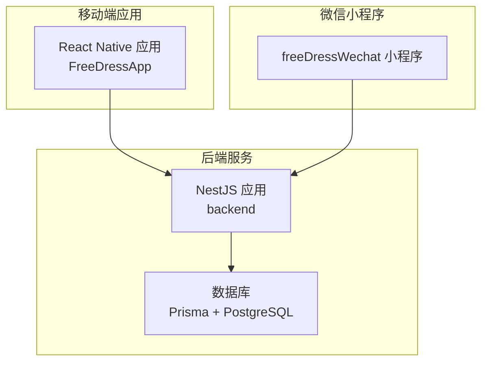
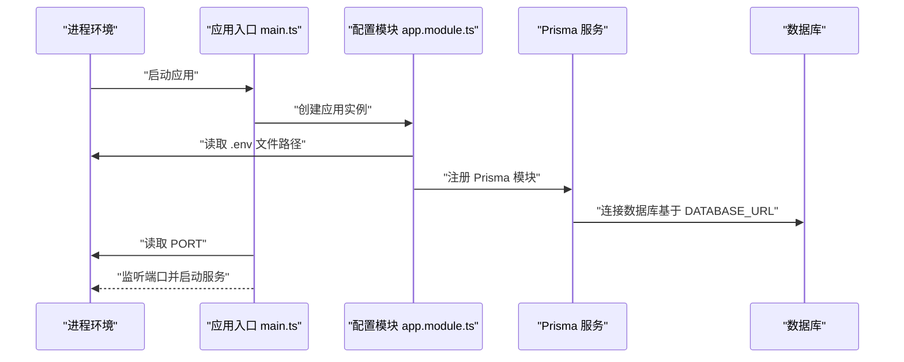
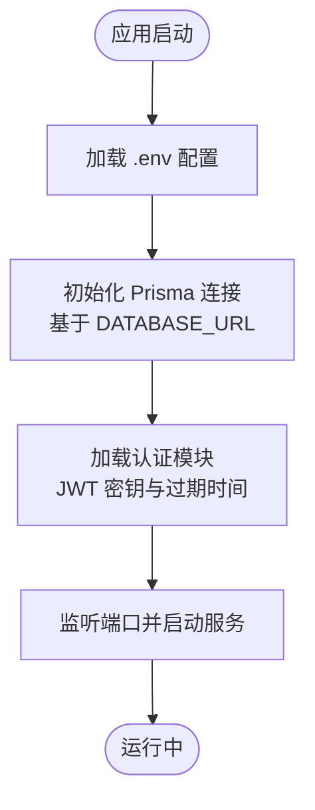
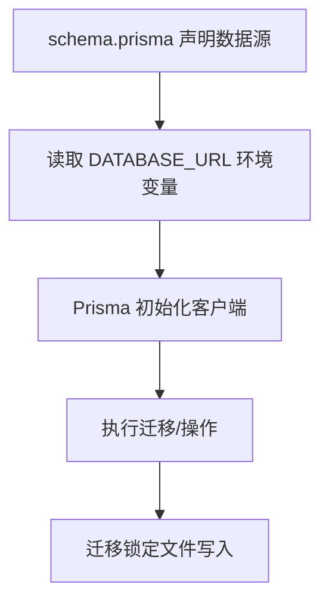
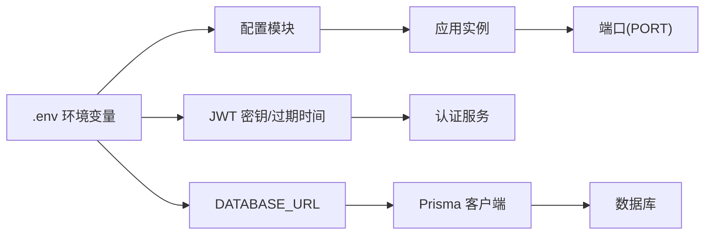

# 环境管理

<cite>
**本文引用的文件**
- [backend/src/app.module.ts](file://backend/src/app.module.ts)
- [backend/src/main.ts](file://backend/src/main.ts)
- [backend/src/modules/auth/auth.service.ts](file://backend/src/modules/auth/auth.service.ts)
- [backend/src/prisma/prisma.service.ts](file://backend/src/prisma/prisma.service.ts)
- [backend/prisma/schema.prisma](file://backend/prisma/schema.prisma)
- [backend/package.json](file://backend/package.json)
- [FreeDressApp/package.json](file://FreeDressApp/package.json)
- [FreeDressApp/.gitignore](file://FreeDressApp/.gitignore)
- [freeDressWechat/project.config.json](file://freeDressWechat/project.config.json)
- [freeDressWechat/project.private.config.json](file://freeDressWechat/project.private.config.json)
- [FreeDressApp/app.json](file://FreeDressApp/app.json)
</cite>

## 目录
1. [简介](#简介)
2. [项目结构](#项目结构)
3. [核心组件](#核心组件)
4. [架构总览](#架构总览)
5. [详细组件分析](#详细组件分析)
6. [依赖分析](#依赖分析)
7. [性能考虑](#性能考虑)
8. [故障排查指南](#故障排查指南)
9. [结论](#结论)
10. [附录](#附录)

## 简介
本指南面向畅搭（FreeDress）项目的开发与运维团队，提供一套系统化的“环境管理配置”方案。内容覆盖多环境配置（开发、测试、预生产、生产）的差异与落地方法，环境变量的安全管理与加密存储建议，配置文件的版本控制与敏感信息处理策略，环境切换与配置验证方法，环境依赖的服务与资源管理，以及配置变更的审批与发布流程建议。目标是帮助团队在保证安全与可追溯的前提下，高效、稳定地管理不同运行环境。

## 项目结构
畅搭项目包含三个主要部分：
- 移动端应用：React Native（FreeDressApp）
- 后端服务：NestJS（backend）
- 微信小程序：freeDressWechat

图表来源
- [backend/src/app.module.ts:13-32](file://backend/src/app.module.ts#L13-L32)
- [backend/src/prisma/prisma.service.ts:8-26](file://backend/src/prisma/prisma.service.ts#L8-L26)
- [backend/prisma/schema.prisma:8-11](file://backend/prisma/schema.prisma#L8-L11)

章节来源
- [backend/src/app.module.ts:13-32](file://backend/src/app.module.ts#L13-L32)
- [backend/src/prisma/prisma.service.ts:8-26](file://backend/src/prisma/prisma.service.ts#L8-L26)
- [backend/prisma/schema.prisma:8-11](file://backend/prisma/schema.prisma#L8-L11)

## 核心组件
- 后端应用通过全局模块加载配置，统一管理环境变量与外部依赖。
- 数据库连接由 Prisma 管理，数据源 URL 来自环境变量。
- 认证模块使用 JWT 密钥与过期时间，均来自环境变量。
- 启动脚本与端口由后端进程环境变量控制。
- 移动端与小程序通过各自配置文件进行构建与调试参数控制。

章节来源
- [backend/src/app.module.ts:15-18](file://backend/src/app.module.ts#L15-L18)
- [backend/prisma/schema.prisma:10](file://backend/prisma/schema.prisma#L10)
- [backend/src/modules/auth/auth.service.ts:157-165](file://backend/src/modules/auth/auth.service.ts#L157-L165)
- [backend/src/main.ts:51](file://backend/src/main.ts#L51)
- [backend/package.json:8-24](file://backend/package.json#L8-L24)
- [FreeDressApp/package.json:5-11](file://FreeDressApp/package.json#L5-L11)

## 架构总览
下图展示了后端应用如何加载配置、连接数据库，并对外提供服务。该流程体现了环境变量在启动阶段的关键作用。

图表来源
- [backend/src/main.ts:12-59](file://backend/src/main.ts#L12-L59)
- [backend/src/app.module.ts:15-18](file://backend/src/app.module.ts#L15-L18)
- [backend/src/prisma/prisma.service.ts:14-24](file://backend/src/prisma/prisma.service.ts#L14-L24)
- [backend/prisma/schema.prisma:10](file://backend/prisma/schema.prisma#L10)

## 详细组件分析

### 后端配置加载与环境变量
- 全局配置模块启用全局配置加载，并指定 .env 文件路径，确保所有模块可访问环境变量。
- 认证模块使用 JWT 密钥与过期时间，这些值来自环境变量，避免硬编码。
- 数据库连接字符串来自环境变量，Prisma 在 schema 中声明使用该变量。

图表来源
- [backend/src/app.module.ts:15-18](file://backend/src/app.module.ts#L15-L18)
- [backend/src/modules/auth/auth.service.ts:157-165](file://backend/src/modules/auth/auth.service.ts#L157-L165)
- [backend/prisma/schema.prisma:10](file://backend/prisma/schema.prisma#L10)
- [backend/src/main.ts:51](file://backend/src/main.ts#L51)

章节来源
- [backend/src/app.module.ts:15-18](file://backend/src/app.module.ts#L15-L18)
- [backend/src/modules/auth/auth.service.ts:157-165](file://backend/src/modules/auth/auth.service.ts#L157-L165)
- [backend/prisma/schema.prisma:10](file://backend/prisma/schema.prisma#L10)
- [backend/src/main.ts:51](file://backend/src/main.ts#L51)

### 数据库连接与迁移
- 数据库提供者与连接字符串来自环境变量，Prisma 在 schema 中声明。
- 迁移锁定文件用于防止并发迁移冲突，需纳入版本控制。

图表来源
- [backend/prisma/schema.prisma:8-11](file://backend/prisma/schema.prisma#L8-L11)
- [backend/src/prisma/prisma.service.ts:14-24](file://backend/src/prisma/prisma.service.ts#L14-L24)
- [backend/prisma/migrations/migration_lock.toml:1-3](file://backend/prisma/migrations/migration_lock.toml#L1-L3)

章节来源
- [backend/prisma/schema.prisma:8-11](file://backend/prisma/schema.prisma#L8-L11)
- [backend/src/prisma/prisma.service.ts:14-24](file://backend/src/prisma/prisma.service.ts#L14-L24)
- [backend/prisma/migrations/migration_lock.toml:1-3](file://backend/prisma/migrations/migration_lock.toml#L1-L3)

### 移动端与小程序配置
- React Native 应用通过 app.json 提供应用名称与显示名。
- 小程序项目配置分为公开配置与私有配置，分别控制编译、调试与本地开发行为。
- 移动端与小程序的构建参数与调试开关可通过各自配置文件调整。

章节来源
- [FreeDressApp/app.json:1-4](file://FreeDressApp/app.json#L1-L4)
- [freeDressWechat/project.config.json:1-58](file://freeDressWechat/project.config.json#L1-L58)
- [freeDressWechat/project.private.config.json:1-23](file://freeDressWechat/project.private.config.json#L1-L23)

## 依赖分析
- 后端依赖配置模块加载环境变量，Prisma 作为 ORM 读取数据库连接信息。
- 认证模块依赖 JWT 服务与环境变量中的密钥。
- 启动脚本与端口由后端进程环境变量决定。

图表来源
- [backend/src/app.module.ts:15-18](file://backend/src/app.module.ts#L15-L18)
- [backend/src/modules/auth/auth.service.ts:157-165](file://backend/src/modules/auth/auth.service.ts#L157-L165)
- [backend/prisma/schema.prisma:10](file://backend/prisma/schema.prisma#L10)
- [backend/src/main.ts:51](file://backend/src/main.ts#L51)

章节来源
- [backend/src/app.module.ts:15-18](file://backend/src/app.module.ts#L15-L18)
- [backend/src/modules/auth/auth.service.ts:157-165](file://backend/src/modules/auth/auth.service.ts#L157-L165)
- [backend/prisma/schema.prisma:10](file://backend/prisma/schema.prisma#L10)
- [backend/src/main.ts:51](file://backend/src/main.ts#L51)

## 性能考虑
- 环境变量读取发生在应用启动阶段，建议在 CI/CD 中提前注入，减少启动时延。
- 数据库连接池与 Prisma 的连接复用策略应在生产环境通过环境变量或配置文件优化。
- JWT 密钥长度与过期时间直接影响会话安全与性能，建议在测试与生产环境采用不同策略并定期轮换。

## 故障排查指南
- 端口占用或权限问题：检查后端启动脚本与端口环境变量，确认端口可用且无权限限制。
- 数据库连接失败：核对 DATABASE_URL 是否正确，网络连通性与凭据是否有效。
- JWT 认证异常：核对 JWT 密钥与过期时间是否匹配，密钥是否在各环境中一致。
- 配置未生效：确认 .env 文件路径与加载顺序，避免被后续覆盖；检查配置模块是否启用全局加载。

章节来源
- [backend/src/main.ts:51](file://backend/src/main.ts#L51)
- [backend/src/prisma/prisma.service.ts:14-24](file://backend/src/prisma/prisma.service.ts#L14-L24)
- [backend/src/modules/auth/auth.service.ts:157-165](file://backend/src/modules/auth/auth.service.ts#L157-L165)
- [backend/src/app.module.ts:15-18](file://backend/src/app.module.ts#L15-L18)

## 结论
通过将环境变量集中管理、明确区分多环境差异、强化敏感信息保护与版本控制，畅搭项目可在开发、测试、预生产与生产环境中实现稳定、可追溯的部署与运维。建议结合 CI/CD 流水线自动化注入与校验，持续提升环境管理效率与安全性。

## 附录

### 多环境配置管理方法
- 开发环境（Local）
  - 使用本地 .env 文件，开启严格日志与调试模式。
  - 数据库可使用本地容器或云服务的开发实例。
  - JWT 密钥与过期时间较短，便于快速迭代。
- 测试环境（Test）
  - 使用独立的 .env 文件，数据库与后端服务分离。
  - 启用更严格的日志级别与监控指标。
  - JWT 密钥与过期时间适中，模拟真实场景。
- 预生产环境（Staging）
  - 使用与生产相近的资源与配置，但隔离真实用户数据。
  - 启用完整的监控与告警，模拟生产流量。
  - JWT 密钥与过期时间与生产保持一致。
- 生产环境（Production）
  - 仅通过受控渠道注入环境变量，禁止直接修改。
  - 数据库连接使用只读副本与高可用架构。
  - JWT 密钥与过期时间严格管理，定期轮换。

### 环境变量的安全管理与加密存储
- 不将任何敏感信息提交到版本库，使用受控的密钥管理系统（如 KMS、Vault）注入。
- 对于必须随代码分发的最小必要配置，使用加密文件并在 CI/CD 中解密。
- 定期轮换密钥与令牌，记录轮换历史并审计访问日志。

### 配置文件的版本控制与敏感信息处理
- 将 .env 文件加入忽略列表，仅保留示例文件（如 .env.example）。
- 使用模板化配置与占位符，在 CI/CD 中替换为实际值。
- 对于小程序与移动端的配置文件，区分公开与私有配置，私有配置不进入版本库。

### 环境切换与配置验证
- 通过 CI/CD 的环境矩阵或作业组实现一键切换。
- 在部署前增加配置校验步骤：检查必需键是否存在、格式是否正确、数据库连通性等。
- 对关键配置（如数据库 URL、JWT 密钥）增加回滚与快速恢复机制。

### 环境依赖的服务与资源管理
- 数据库：使用独立实例或托管服务，按环境划分资源与备份策略。
- 缓存与消息队列：在测试与预生产中使用轻量级替代，生产使用高可用集群。
- 存储与上传：根据环境选择对象存储的访问策略与地域分布。

### 配置变更的审批与发布流程
- 变更请求（RFC）：描述影响范围、风险评估与回滚计划。
- 审批流程：至少两名维护者批准，关键配置需技术负责人审批。
- 发布窗口：在低峰时段发布，配合灰度与监控。
- 回滚机制：发布后若出现异常，立即回滚至上一版本并修复。