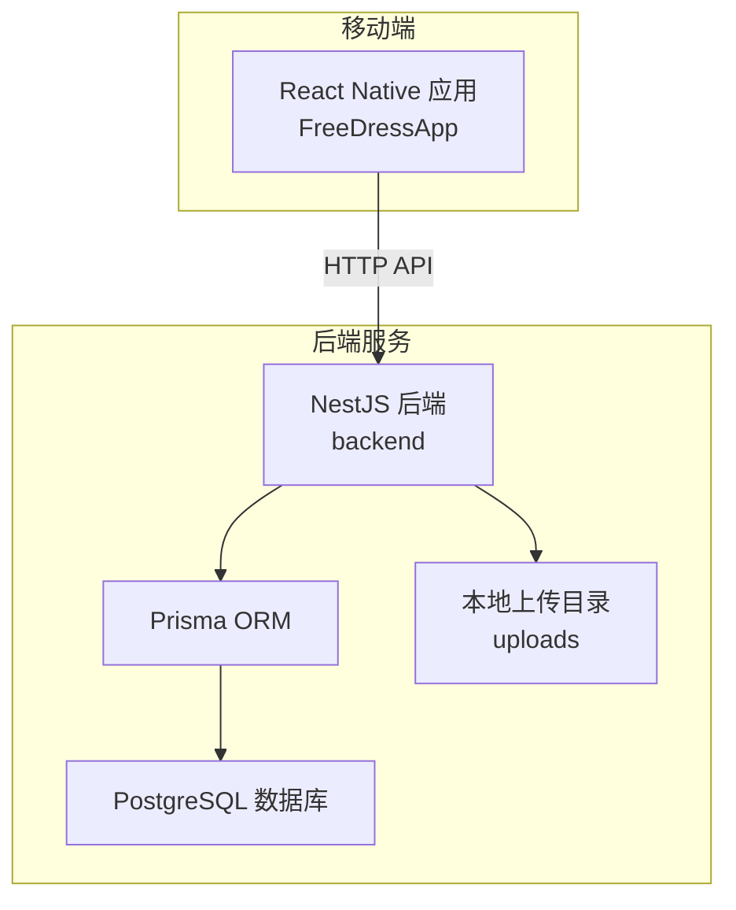
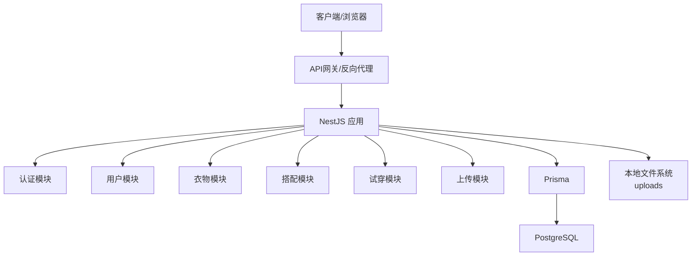
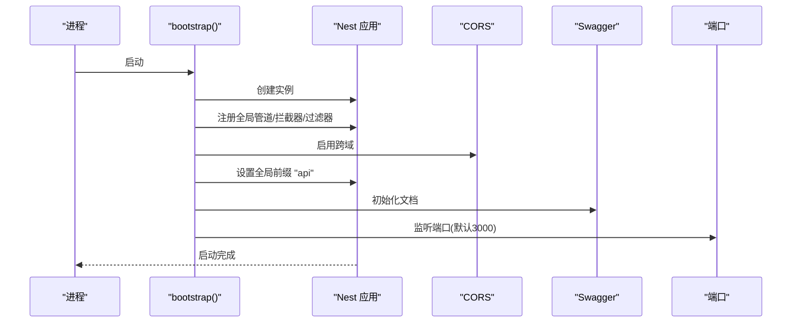
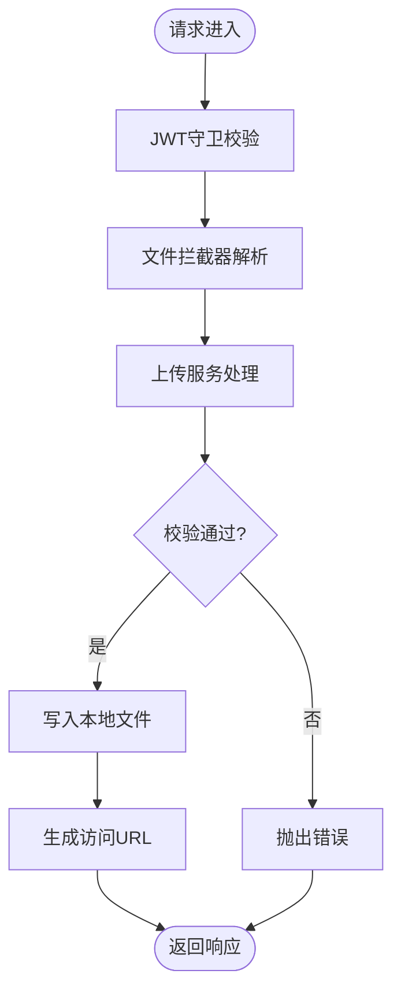
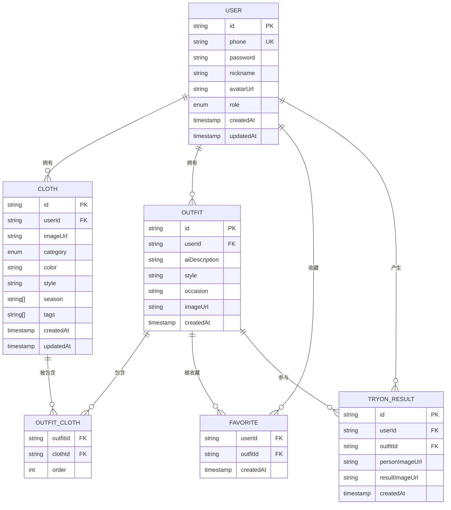
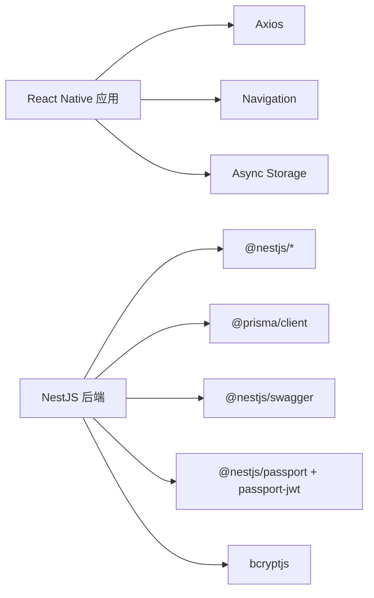

# 部署策略

<cite>
**本文引用的文件**
- [backend/package.json](file://backend/package.json)
- [backend/README.md](file://backend/README.md)
- [backend/src/main.ts](file://backend/src/main.ts)
- [backend/src/app.module.ts](file://backend/src/app.module.ts)
- [backend/src/modules/upload/upload.module.ts](file://backend/src/modules/upload/upload.module.ts)
- [backend/src/modules/upload/upload.controller.ts](file://backend/src/modules/upload/upload.controller.ts)
- [backend/src/modules/upload/upload.service.ts](file://backend/src/modules/upload/upload.service.ts)
- [backend/prisma/schema.prisma](file://backend/prisma/schema.prisma)
- [backend/prisma/migrations/migration_lock.toml](file://backend/prisma/migrations/migration_lock.toml)
- [FreeDressApp/package.json](file://FreeDressApp/package.json)
- [FreeDressApp/README.md](file://FreeDressApp/README.md)
- [FreeDressApp/ios/.xcode.env](file://FreeDressApp/ios/.xcode.env)
</cite>

## 目录
1. [简介](#简介)
2. [项目结构](#项目结构)
3. [核心组件](#核心组件)
4. [架构总览](#架构总览)
5. [详细组件分析](#详细组件分析)
6. [依赖分析](#依赖分析)
7. [性能考虑](#性能考虑)
8. [故障排查指南](#故障排查指南)
9. [结论](#结论)
10. [附录](#附录)

## 简介
本指南面向运维团队，提供畅搭(FreeDress)项目的完整部署策略实施手册。内容覆盖多环境部署（开发、测试、生产）、容器化与Docker配置、数据库迁移与数据同步自动化、蓝绿部署与滚动更新、负载均衡与高可用、监控与日志收集等关键主题。文档以仓库现有代码与配置为基础，结合最佳实践给出可操作的落地步骤。

## 项目结构
畅搭项目由三部分组成：
- 移动端应用：React Native（FreeDressApp），负责用户交互与调用后端API。
- 后端服务：NestJS（backend），提供REST API、认证、文件上传、Prisma数据库访问。
- 微信小程序：freeDressWechat（本指南不涉及微信小程序部署）。

图表来源
- [backend/src/app.module.ts:13-32](file://backend/src/app.module.ts#L13-L32)
- [backend/src/main.ts:12-61](file://backend/src/main.ts#L12-L61)
- [backend/prisma/schema.prisma:1-132](file://backend/prisma/schema.prisma#L1-L132)

章节来源
- [backend/README.md:119-154](file://backend/README.md#L119-L154)
- [FreeDressApp/README.md:86-118](file://FreeDressApp/README.md#L86-L118)

## 核心组件
- 后端入口与全局配置：负责启动、CORS、Swagger、全局管道/拦截器/过滤器、API前缀设置。
- 模块化架构：认证、用户、衣物、搭配、上传、试穿等模块按领域划分，便于独立演进与部署。
- 文件上传：基于Multer的本地文件存储，提供统一上传接口与鉴权保护。
- 数据库与迁移：使用Prisma管理Schema与迁移，PostgreSQL作为持久化存储。

章节来源
- [backend/src/main.ts:12-61](file://backend/src/main.ts#L12-L61)
- [backend/src/app.module.ts:13-32](file://backend/src/app.module.ts#L13-L32)
- [backend/src/modules/upload/upload.controller.ts:28-50](file://backend/src/modules/upload/upload.controller.ts#L28-L50)
- [backend/src/modules/upload/upload.service.ts:15-48](file://backend/src/modules/upload/upload.service.ts#L15-L48)
- [backend/prisma/schema.prisma:1-132](file://backend/prisma/schema.prisma#L1-L132)

## 架构总览
后端采用“单体微服务化”思路：以NestJS模块组织业务域，数据库集中于PostgreSQL，静态资源通过ServeStatic模块对外提供上传文件访问。前端通过HTTP协议与后端交互，遵循统一的API前缀与认证流程。

图表来源
- [backend/src/app.module.ts:13-32](file://backend/src/app.module.ts#L13-L32)
- [backend/src/main.ts:31-48](file://backend/src/main.ts#L31-L48)
- [backend/prisma/schema.prisma:1-132](file://backend/prisma/schema.prisma#L1-L132)

## 详细组件分析

### 后端启动与全局配置
- 启动流程：创建应用实例、注册全局管道/拦截器/过滤器、启用CORS、设置全局API前缀、初始化Swagger。
- 环境端口：监听环境变量PORT或默认3000。
- 认证与文档：启用JWT守卫与Swagger文档，便于开发与测试。

图表来源
- [backend/src/main.ts:12-61](file://backend/src/main.ts#L12-L61)

章节来源
- [backend/src/main.ts:12-61](file://backend/src/main.ts#L12-L61)

### 文件上传模块
- 控制器：受JWT保护，接收multipart/form-data，调用服务层处理。
- 服务层：校验MIME类型与大小，生成UUID文件名，写入本地uploads目录，返回访问路径。
- 模块：声明控制器与服务，导出服务供其他模块使用。

图表来源
- [backend/src/modules/upload/upload.controller.ts:28-50](file://backend/src/modules/upload/upload.controller.ts#L28-L50)
- [backend/src/modules/upload/upload.service.ts:15-48](file://backend/src/modules/upload/upload.service.ts#L15-L48)

章节来源
- [backend/src/modules/upload/upload.controller.ts:28-50](file://backend/src/modules/upload/upload.controller.ts#L28-L50)
- [backend/src/modules/upload/upload.service.ts:15-48](file://backend/src/modules/upload/upload.service.ts#L15-L48)
- [backend/src/modules/upload/upload.module.ts:1-11](file://backend/src/modules/upload/upload.module.ts#L1-L11)

### 数据库与迁移
- 数据源：PostgreSQL，通过环境变量DATABASE_URL连接。
- 模型：用户、衣物、搭配、收藏、试穿结果等，定义了主键、索引与外键关系。
- 迁移：使用Prisma迁移锁文件标识迁移状态，建议在CI中执行迁移脚本。

图表来源
- [backend/prisma/schema.prisma:13-131](file://backend/prisma/schema.prisma#L13-L131)

章节来源
- [backend/prisma/schema.prisma:1-132](file://backend/prisma/schema.prisma#L1-L132)
- [backend/prisma/migrations/migration_lock.toml:1-3](file://backend/prisma/migrations/migration_lock.toml#L1-L3)

### 认证与安全
- JWT配置：从环境变量读取密钥与过期时间，提供登录、刷新、获取当前用户等接口。
- 守卫：JwtAuthGuard统一拦截未认证请求，确保受保护接口的安全性。

章节来源
- [backend/src/modules/auth/auth.module.ts:13-29](file://backend/src/modules/auth/auth.module.ts#L13-L29)
- [backend/src/common/guards/jwt-auth.guard.ts:8-21](file://backend/src/common/guards/jwt-auth.guard.ts#L8-L21)

## 依赖分析
- 后端依赖：NestJS、Prisma、Swagger、Passport/JWT、bcryptjs等。
- 移动端依赖：React Native、Navigation、Axios、Async Storage、Reanimated等。
- 环境变量：后端通过ConfigModule加载.env；移动端通过.xcode.env控制iOS构建环境。

图表来源
- [backend/package.json:26-45](file://backend/package.json#L26-L45)
- [FreeDressApp/package.json:12-31](file://FreeDressApp/package.json#L12-L31)
- [FreeDressApp/ios/.xcode.env:1-11](file://FreeDressApp/ios/.xcode.env#L1-L11)

章节来源
- [backend/package.json:26-45](file://backend/package.json#L26-L45)
- [FreeDressApp/package.json:12-31](file://FreeDressApp/package.json#L12-L31)
- [FreeDressApp/ios/.xcode.env:1-11](file://FreeDressApp/ios/.xcode.env#L1-L11)

## 性能考虑
- 上传限制：服务端对MIME类型与文件大小进行严格限制，避免资源滥用。
- 本地存储：上传文件写入本地磁盘，适合小规模部署；大规模需结合对象存储与CDN。
- 数据库索引：模型中已定义必要索引，建议在高并发场景下评估复合索引与查询计划。
- 缓存策略：可在网关或应用层引入缓存（如Redis）以降低数据库压力。

章节来源
- [backend/src/modules/upload/upload.service.ts:30-38](file://backend/src/modules/upload/upload.service.ts#L30-L38)
- [backend/prisma/schema.prisma:56-58](file://backend/prisma/schema.prisma#L56-L58)
- [backend/prisma/schema.prisma:86-87](file://backend/prisma/schema.prisma#L86-L87)
- [backend/prisma/schema.prisma:128-129](file://backend/prisma/schema.prisma#L128-L129)

## 故障排查指南
- 启动失败
  - 检查端口占用与权限，确认环境变量PORT可用。
  - 查看CORS配置是否允许来源，避免跨域问题。
- 数据库连接
  - 确认DATABASE_URL正确，PostgreSQL可达且版本满足要求。
  - 在CI中执行迁移脚本，确保迁移锁一致。
- 上传异常
  - 检查文件类型与大小限制，确认uploads目录存在且可写。
  - 确保API携带正确的Authorization头。
- 认证失败
  - 核对JWT密钥与过期时间配置，确保前后端一致。
  - 检查守卫是否生效，请求头是否包含Bearer Token。

章节来源
- [backend/src/main.ts:31-35](file://backend/src/main.ts#L31-L35)
- [backend/prisma/migrations/migration_lock.toml:1-3](file://backend/prisma/migrations/migration_lock.toml#L1-L3)
- [backend/src/modules/upload/upload.service.ts:25-47](file://backend/src/modules/upload/upload.service.ts#L25-L47)
- [backend/src/modules/auth/auth.module.ts:18-23](file://backend/src/modules/auth/auth.module.ts#L18-L23)

## 结论
本指南基于仓库现有代码与配置，给出了多环境部署、容器化、数据库迁移、蓝绿/滚动更新、负载均衡与高可用、监控与日志的实施要点。建议在生产环境中结合对象存储、CDN、数据库备份与监控告警体系，持续优化性能与可靠性。

## 附录

### 多环境部署策略与流程
- 开发环境
  - 使用开发脚本启动后端，执行Prisma生成与迁移。
  - 移动端通过本地API地址访问后端。
- 测试环境
  - 配置独立数据库与环境变量，执行迁移脚本。
  - 通过反向代理暴露API，开启限流与健康检查。
- 生产环境
  - 使用容器镜像部署，分离静态资源与动态API。
  - 配置SSL/TLS、WAF与DDoS防护，启用数据库只读副本与备份。

章节来源
- [backend/README.md:100-109](file://backend/README.md#L100-L109)
- [backend/README.md:248-262](file://backend/README.md#L248-L262)

### 容器化部署与Docker配置
- 建议分层镜像：基础运行时层、依赖安装层、构建产物层、运行层。
- 环境变量：通过ConfigModule加载.env，确保容器内变量一致。
- 健康检查：在反向代理或容器编排中添加HTTP健康检查端点。
- 上传目录：生产环境建议挂载到持久化卷或对象存储。

章节来源
- [backend/src/app.module.ts:15-22](file://backend/src/app.module.ts#L15-L22)
- [backend/src/main.ts:50-52](file://backend/src/main.ts#L50-L52)
- [backend/src/modules/upload/upload.service.ts:17-23](file://backend/src/modules/upload/upload.service.ts#L17-L23)

### 数据库迁移与数据同步自动化
- 迁移执行：在CI中调用Prisma迁移脚本，确保迁移锁一致。
- 数据同步：对于多环境，建议使用只读副本与逻辑复制，避免直接跨库写入。
- 回滚策略：保留最近一次迁移快照，支持回滚至前一版本。

章节来源
- [backend/README.md:90-98](file://backend/README.md#L90-L98)
- [backend/prisma/migrations/migration_lock.toml:1-3](file://backend/prisma/migrations/migration_lock.toml#L1-L3)

### 蓝绿部署与滚动更新
- 蓝绿部署：准备两套实例，切换流量后回收旧实例。
- 滚动更新：逐批替换实例，配合健康检查与超时回滚。
- 配置变更：通过环境变量与配置中心管理，避免重启。

[本节为概念性说明，无需文件来源]

### 负载均衡与高可用
- 反向代理：Nginx/HAProxy前置，配置会话保持与健康检查。
- 高可用：多副本部署，自动扩缩容，数据库主从/集群。
- 存储：对象存储与CDN结合，静态资源就近分发。

[本节为概念性说明，无需文件来源]

### 监控与日志收集
- 指标采集：CPU、内存、请求延迟、错误率、数据库连接数。
- 日志聚合：结构化日志输出，集中收集与检索。
- 告警策略：阈值告警与趋势告警，结合SLA制定。

[本节为概念性说明，无需文件来源]