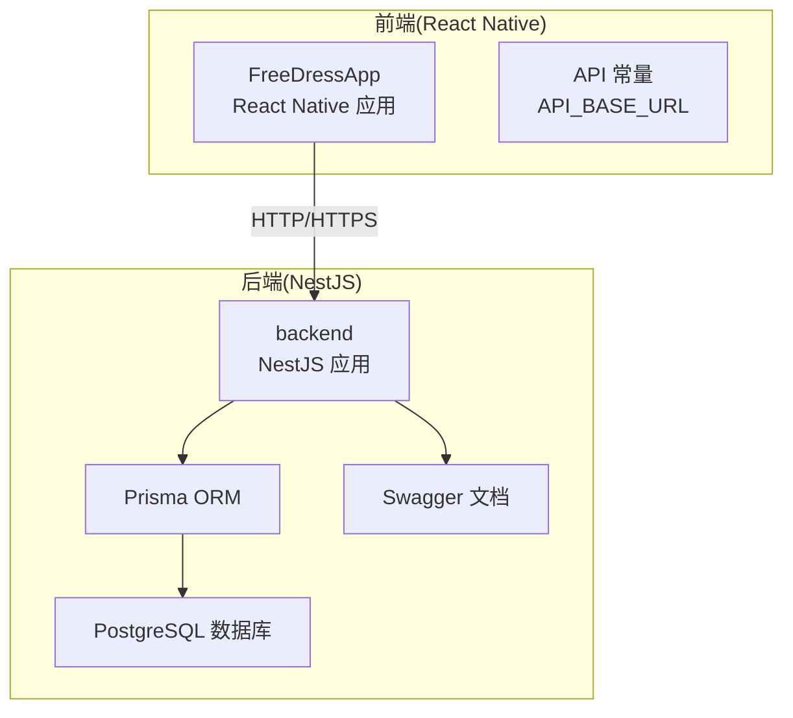
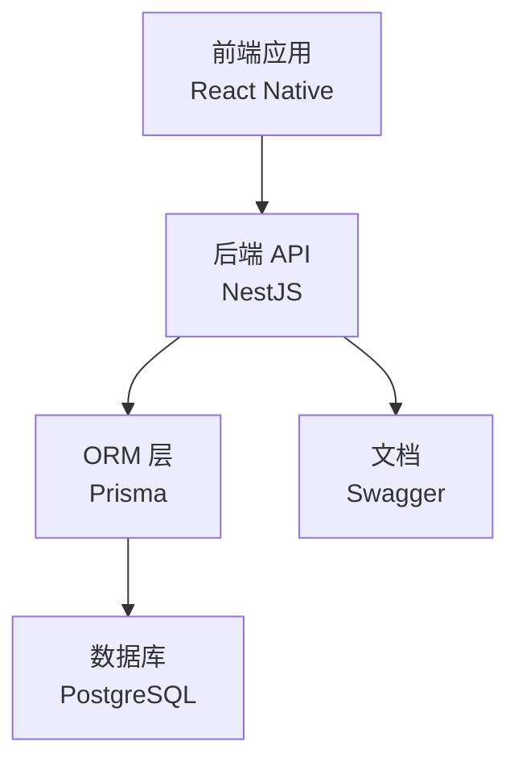
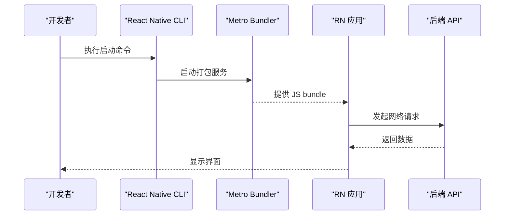
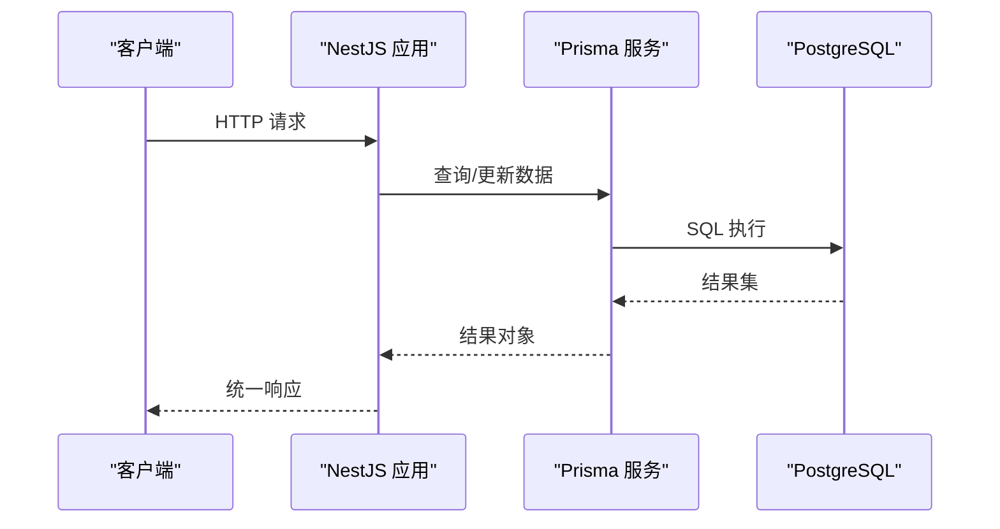
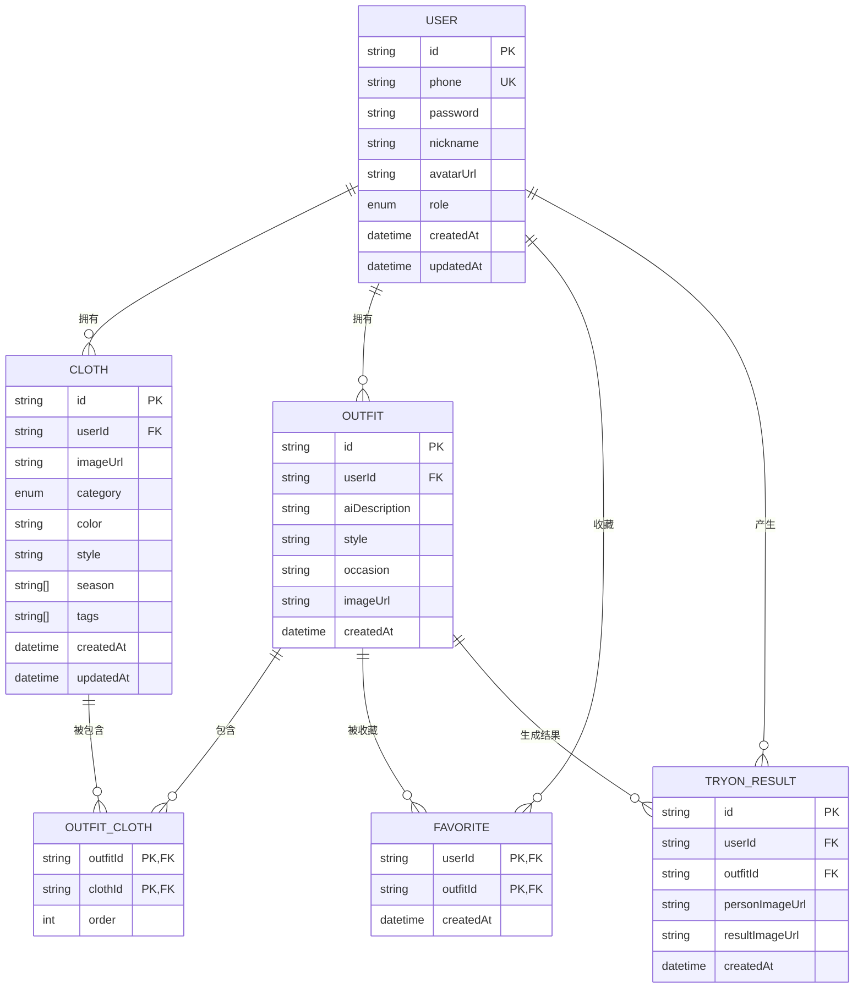
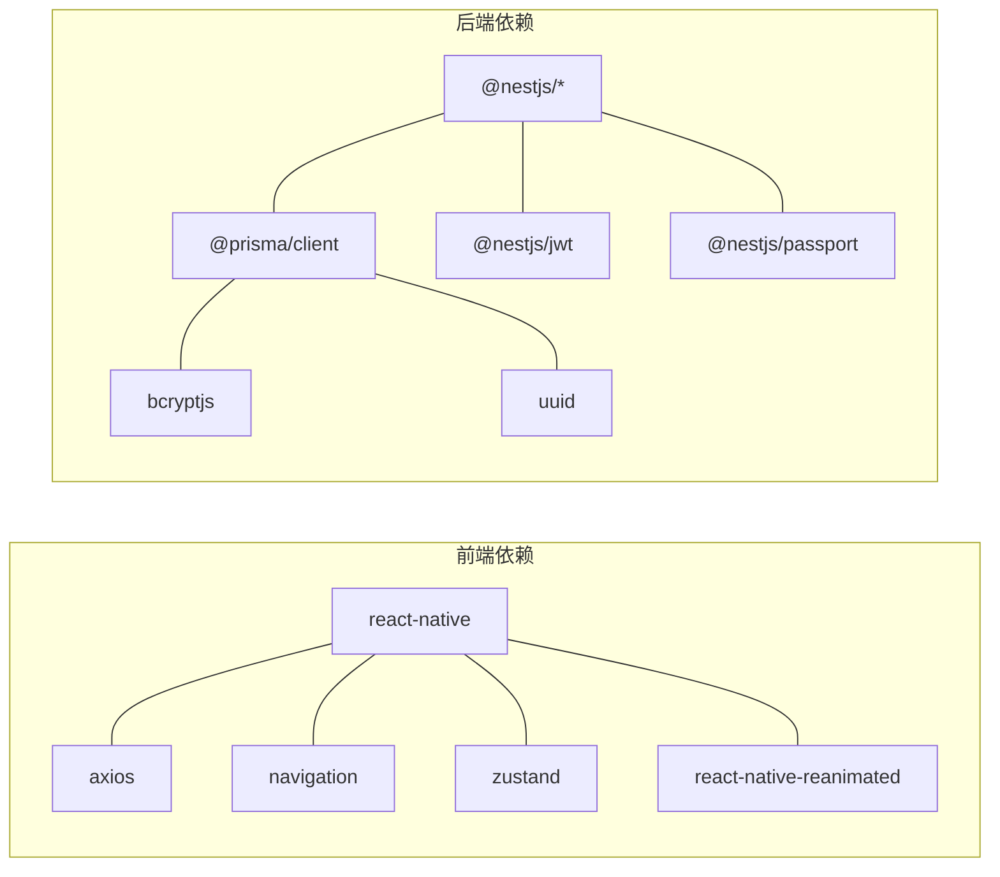

# 开发环境部署

<cite>
**本文引用的文件**
- [FreeDressApp/package.json](file://FreeDressApp/package.json)
- [FreeDressApp/tsconfig.json](file://FreeDressApp/tsconfig.json)
- [FreeDressApp/metro.config.js](file://FreeDressApp/metro.config.js)
- [FreeDressApp/babel.config.js](file://FreeDressApp/babel.config.js)
- [FreeDressApp/app.json](file://FreeDressApp/app.json)
- [FreeDressApp/src/constants/index.ts](file://FreeDressApp/src/constants/index.ts)
- [backend/package.json](file://backend/package.json)
- [backend/tsconfig.json](file://backend/tsconfig.json)
- [backend/src/main.ts](file://backend/src/main.ts)
- [backend/src/app.module.ts](file://backend/src/app.module.ts)
- [backend/src/prisma/prisma.service.ts](file://backend/src/prisma/prisma.service.ts)
- [backend/prisma/schema.prisma](file://backend/prisma/schema.prisma)
- [backend/src/modules/auth/auth.service.ts](file://backend/src/modules/auth/auth.service.ts)
</cite>

## 目录
1. [简介](#简介)
2. [项目结构](#项目结构)
3. [核心组件](#核心组件)
4. [架构总览](#架构总览)
5. [详细组件分析](#详细组件分析)
6. [依赖分析](#依赖分析)
7. [性能考虑](#性能考虑)
8. [故障排除指南](#故障排除指南)
9. [结论](#结论)
10. [附录](#附录)

## 简介
本指南面向畅搭(FreeDress)项目的开发者，提供从零到一的完整本地开发环境搭建手册。内容涵盖：
- 前端开发环境：React Native CLI、Metro Bundler、模拟器配置
- 后端开发环境：NestJS 框架、Prisma ORM、PostgreSQL 数据库
- TypeScript 工具链与 IDE 配置
- 环境变量与配置文件
- 依赖安装与版本兼容性
- 开发服务器启动与热重载
- 调试与常见问题排查

## 项目结构
畅搭项目采用前后端分离架构：
- 前端：React Native 移动应用，位于 FreeDressApp 目录
- 后端：NestJS 微服务，位于 backend 目录
- 小程序：freeDressWechat 目录（非本次部署重点）

**图表来源**
- [FreeDressApp/src/constants/index.ts:8-10](file://FreeDressApp/src/constants/index.ts#L8-L10)
- [backend/src/main.ts:40-48](file://backend/src/main.ts#L40-L48)
- [backend/prisma/schema.prisma:8-11](file://backend/prisma/schema.prisma#L8-L11)

**章节来源**
- [FreeDressApp/package.json:1-57](file://FreeDressApp/package.json#L1-L57)
- [backend/package.json:1-91](file://backend/package.json#L1-L91)

## 核心组件
- 前端 React Native：负责移动端 UI、导航、状态管理与网络请求
- 后端 NestJS：提供 RESTful API、认证授权、业务模块与数据访问
- Prisma：数据库抽象层，支持迁移、种子数据与查询构建
- PostgreSQL：持久化存储，支持用户、衣物、搭配、试穿记录等模型
- Metro Bundler：打包与热重载，配合 React Native CLI 进行开发调试

**章节来源**
- [FreeDressApp/package.json:12-51](file://FreeDressApp/package.json#L12-L51)
- [backend/package.json:26-72](file://backend/package.json#L26-L72)
- [backend/prisma/schema.prisma:1-132](file://backend/prisma/schema.prisma#L1-L132)

## 架构总览
畅搭系统由前端移动应用与后端微服务组成，通过 HTTP 接口通信；后端使用 Prisma 连接 PostgreSQL 数据库，并提供 Swagger 文档。

**图表来源**
- [backend/src/main.ts:12-59](file://backend/src/main.ts#L12-L59)
- [backend/src/app.module.ts:13-32](file://backend/src/app.module.ts#L13-L32)
- [backend/prisma/schema.prisma:8-11](file://backend/prisma/schema.prisma#L8-L11)

## 详细组件分析

### 前端开发环境（React Native）
- Node.js 版本要求：前端工程明确要求 Node 版本满足引擎约束
- React Native CLI：通过脚本命令运行 iOS/Android 模拟器或真机
- Metro Bundler：默认配置，支持热重载与打包
- TypeScript：启用 TS 编译与类型检查
- Babel：按需插件配置，支持 Reanimated
- 网络请求：Axios，统一 API 基础地址指向后端服务

**图表来源**
- [FreeDressApp/package.json:5-11](file://FreeDressApp/package.json#L5-L11)
- [FreeDressApp/metro.config.js:1-12](file://FreeDressApp/metro.config.js#L1-L12)
- [FreeDressApp/src/constants/index.ts:8-10](file://FreeDressApp/src/constants/index.ts#L8-L10)

**章节来源**
- [FreeDressApp/package.json:1-57](file://FreeDressApp/package.json#L1-L57)
- [FreeDressApp/tsconfig.json:1-9](file://FreeDressApp/tsconfig.json#L1-L9)
- [FreeDressApp/metro.config.js:1-12](file://FreeDressApp/metro.config.js#L1-L12)
- [FreeDressApp/babel.config.js:1-4](file://FreeDressApp/babel.config.js#L1-L4)
- [FreeDressApp/app.json:1-5](file://FreeDressApp/app.json#L1-L5)
- [FreeDressApp/src/constants/index.ts:8-10](file://FreeDressApp/src/constants/index.ts#L8-L10)

### 后端开发环境（NestJS + Prisma + PostgreSQL）
- NestJS：全局管道、拦截器、过滤器、CORS、Swagger 文档与全局前缀
- Prisma：数据源配置、模型定义、客户端生成与服务生命周期
- PostgreSQL：数据库连接字符串来自环境变量，模型覆盖用户、衣物、搭配、收藏、试穿结果等
- 认证模块：JWT 令牌生成与刷新、图片验证码、密码加密与重置流程

**图表来源**
- [backend/src/main.ts:12-59](file://backend/src/main.ts#L12-L59)
- [backend/src/prisma/prisma.service.ts:8-26](file://backend/src/prisma/prisma.service.ts#L8-L26)
- [backend/prisma/schema.prisma:8-11](file://backend/prisma/schema.prisma#L8-L11)

**章节来源**
- [backend/src/main.ts:1-62](file://backend/src/main.ts#L1-L62)
- [backend/src/app.module.ts:1-33](file://backend/src/app.module.ts#L1-L33)
- [backend/src/prisma/prisma.service.ts:1-27](file://backend/src/prisma/prisma.service.ts#L1-L27)
- [backend/prisma/schema.prisma:1-132](file://backend/prisma/schema.prisma#L1-L132)
- [backend/src/modules/auth/auth.service.ts:1-279](file://backend/src/modules/auth/auth.service.ts#L1-L279)

### 数据模型概览（简化）

**图表来源**
- [backend/prisma/schema.prisma:13-131](file://backend/prisma/schema.prisma#L13-L131)

## 依赖分析
- 前端依赖：React、React Native、导航、状态管理、网络请求、Reanimated、矢量图标等
- 前端开发依赖：Babel、Metro 配置、Jest、ESLint、Prettier、TypeScript
- 后端依赖：NestJS 核心、JWT、Passport、Prisma 客户端、bcrypt、UUID、Swagger 等
- 后端开发依赖：Prisma、ts-node、Jest、ESLint、Prettier、TypeScript

**图表来源**
- [FreeDressApp/package.json:12-31](file://FreeDressApp/package.json#L12-L31)
- [FreeDressApp/package.json:32-52](file://FreeDressApp/package.json#L32-L52)
- [backend/package.json:26-45](file://backend/package.json#L26-L45)
- [backend/package.json:46-72](file://backend/package.json#L46-L72)

**章节来源**
- [FreeDressApp/package.json:1-57](file://FreeDressApp/package.json#L1-L57)
- [backend/package.json:1-91](file://backend/package.json#L1-L91)

## 性能考虑
- 前端
  - 使用 Flash List 替代 FlatList 以提升滚动性能
  - 合理拆分组件与懒加载，减少重渲染
  - 使用 Reanimated 进行高性能动画
- 后端
  - 使用 Prisma 的索引优化查询（如用户 ID、分类等）
  - 启用全局拦截器统一响应格式，减少重复代码
  - 合理设置 Swagger 文档路径，避免暴露敏感信息
- 数据库
  - 为高频查询字段建立索引
  - 控制返回字段大小，避免一次性加载过多数据

## 故障排除指南
- 启动后端报错找不到数据库
  - 检查 DATABASE_URL 是否正确配置
  - 确认 PostgreSQL 服务已启动且可访问
- JWT 相关错误
  - 确认 JWT_SECRET 与 JWT_REFRESH_SECRET 已设置
  - 检查令牌过期时间与刷新策略
- 前端无法连接后端
  - 确认 API_BASE_URL 指向正确的 IP 和端口
  - 若使用 Android 模拟器，注意 10.0.2.2 的回环地址
- Prisma 生成失败
  - 确保 Prisma 版本与客户端一致
  - 执行 prisma:generate 与 prisma:migrate 脚本

**章节来源**
- [backend/src/modules/auth/auth.service.ts:153-171](file://backend/src/modules/auth/auth.service.ts#L153-L171)
- [FreeDressApp/src/constants/index.ts:8-10](file://FreeDressApp/src/constants/index.ts#L8-L10)
- [backend/prisma/schema.prisma:8-11](file://backend/prisma/schema.prisma#L8-L11)

## 结论
通过本指南，您可以在本地完成畅搭(FreeDress)项目的全栈开发环境搭建。建议在开始前准备好 Node.js、Android/iOS 开发工具链与 PostgreSQL 数据库，然后按照“依赖安装 → 环境变量配置 → 数据库迁移 → 启动后端 → 启动前端”的顺序进行。遇到问题时，优先检查网络连通性、环境变量与数据库连接。

## 附录

### 环境变量与配置
- 后端环境变量（示例键名）
  - DATABASE_URL：数据库连接字符串
  - JWT_SECRET：访问令牌密钥
  - JWT_REFRESH_SECRET：刷新令牌密钥
  - JWT_EXPIRES_IN：访问令牌过期间隔（默认 7 天）
- 前端环境变量（示例键名）
  - API_BASE_URL：后端 API 基础地址（默认指向 10.0.2.2:3000/api）

**章节来源**
- [backend/prisma/schema.prisma:8-11](file://backend/prisma/schema.prisma#L8-L11)
- [backend/src/modules/auth/auth.service.ts:156-165](file://backend/src/modules/auth/auth.service.ts#L156-L165)
- [FreeDressApp/src/constants/index.ts:8-10](file://FreeDressApp/src/constants/index.ts#L8-L10)

### 依赖安装与版本兼容性
- Node.js
  - 前端工程要求 Node 版本满足引擎约束
- React Native
  - 版本与 React 匹配，确保 CLI 与平台工具链一致
- NestJS
  - 与 TypeScript 版本匹配，Prisma 版本与客户端保持一致
- PostgreSQL
  - 使用 Prisma 支持的版本范围，确保驱动兼容

**章节来源**
- [FreeDressApp/package.json:53-55](file://FreeDressApp/package.json#L53-L55)
- [backend/package.json:64-71](file://backend/package.json#L64-L71)
- [backend/prisma/schema.prisma](file://backend/prisma/schema.prisma#L2)

### IDE 配置与调试
- VSCode
  - 安装 ESLint、Prettier、TypeScript TSServer 插件
  - 前端与后端分别配置工作区设置与任务
- 调试
  - 后端使用 NestJS 内置调试模式启动
  - 前端通过 React DevTools 与 Flipper 辅助调试

### 开发服务器启动与热重载
- 启动后端
  - 开发模式：执行后端脚本启动监听
  - 生产模式：构建后运行 dist/main
- 启动前端
  - 启动 Metro：运行前端启动脚本
  - 运行 iOS/Android：根据目标平台选择对应脚本
- 热重载
  - Metro 自动监听文件变更并推送更新

**章节来源**
- [backend/package.json:8-24](file://backend/package.json#L8-L24)
- [FreeDressApp/package.json:5-11](file://FreeDressApp/package.json#L5-L11)
- [FreeDressApp/metro.config.js:1-12](file://FreeDressApp/metro.config.js#L1-L12)