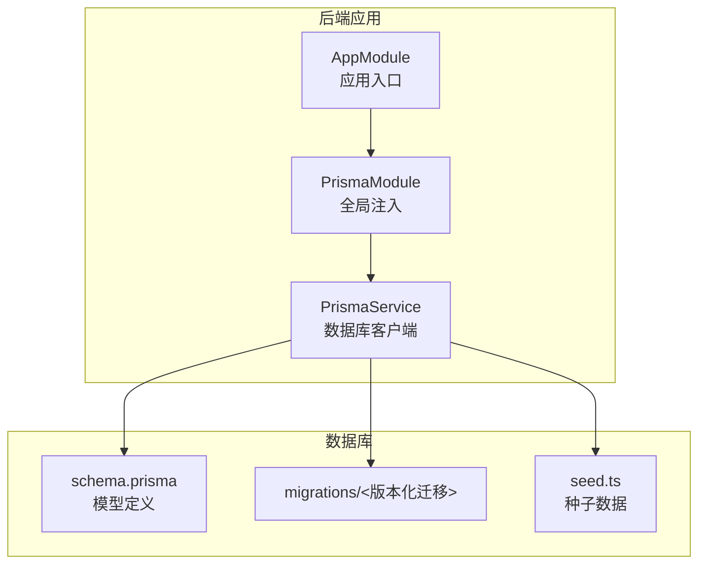
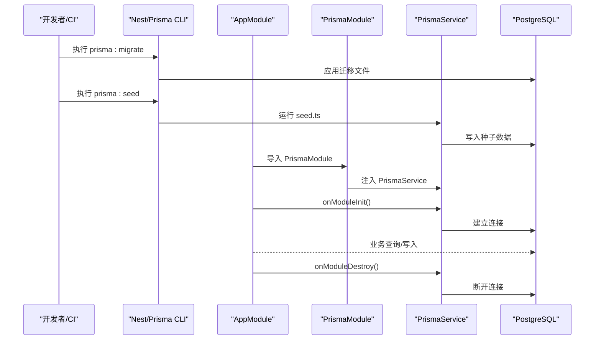
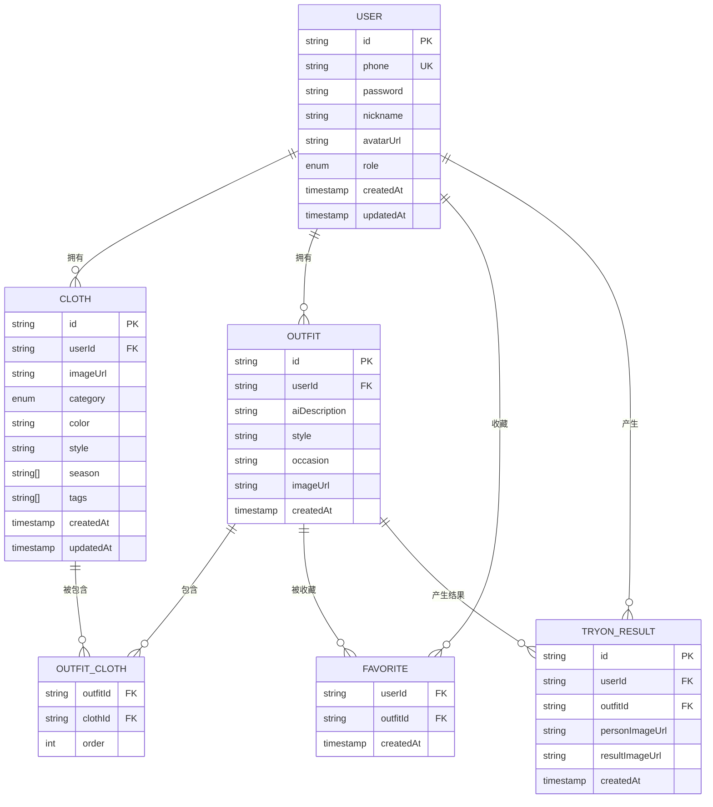
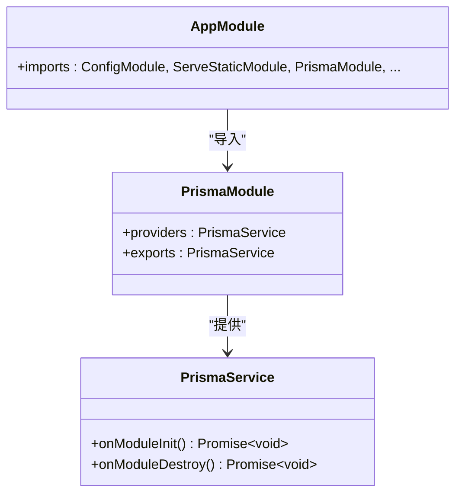
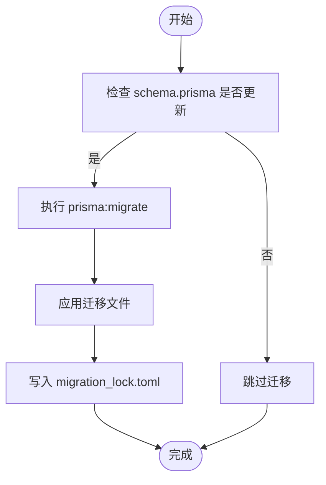
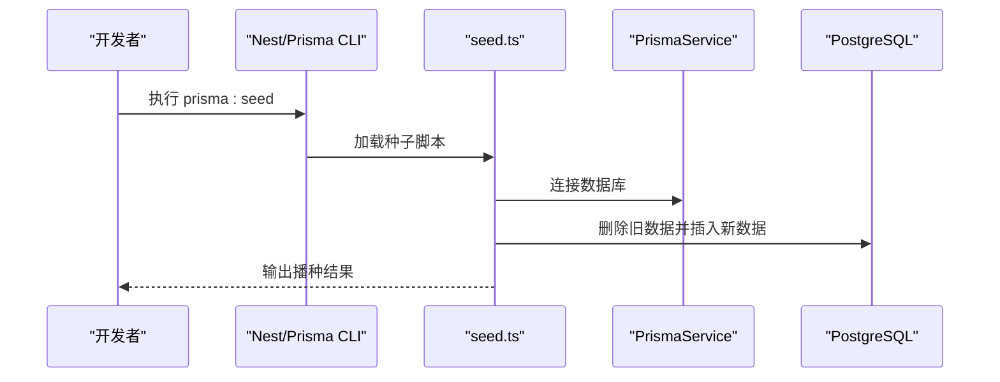
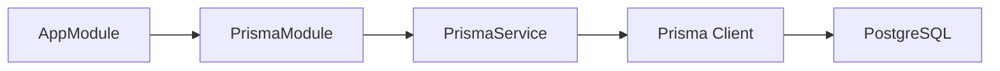

# 数据库部署

<cite>
**本文引用的文件**
- [schema.prisma](file://backend/prisma/schema.prisma)
- [seed.ts](file://backend/prisma/seed.ts)
- [prisma.service.ts](file://backend/src/prisma/prisma.service.ts)
- [prisma.module.ts](file://backend/src/prisma/prisma.module.ts)
- [package.json](file://backend/package.json)
- [.gitignore](file://backend/.gitignore)
- [app.module.ts](file://backend/src/app.module.ts)
</cite>

## 目录
1. [简介](#简介)
2. [项目结构](#项目结构)
3. [核心组件](#核心组件)
4. [架构总览](#架构总览)
5. [详细组件分析](#详细组件分析)
6. [依赖分析](#依赖分析)
7. [性能考虑](#性能考虑)
8. [故障排查指南](#故障排查指南)
9. [结论](#结论)
10. [附录](#附录)

## 简介
本指南面向数据库管理员（DBA）与后端开发者，围绕畅搭（FreeDress）项目的数据库部署与运维展开，重点覆盖以下内容：
- PostgreSQL 的安装与基础配置要点
- Prisma ORM 的配置与使用（含连接字符串设置）
- 数据库迁移的执行流程与版本控制
- 种子数据的导入方法与脚本编写
- 数据库备份与恢复策略（定期备份与灾难恢复）
- 性能优化与索引策略
- 数据库监控与日志管理
- 完整的部署与维护操作手册

## 项目结构
后端采用 NestJS + Prisma 架构，数据库层通过 PrismaService 提供统一接入点；数据库模型定义在 Prisma Schema 中，迁移与种子脚本位于 backend/prisma 目录。

图表来源
- [app.module.ts:13-33](file://backend/src/app.module.ts#L13-L33)
- [prisma.module.ts:1-14](file://backend/src/prisma/prisma.module.ts#L1-L14)
- [prisma.service.ts:1-27](file://backend/src/prisma/prisma.service.ts#L1-L27)
- [schema.prisma:1-132](file://backend/prisma/schema.prisma#L1-L132)

章节来源
- [app.module.ts:13-33](file://backend/src/app.module.ts#L13-L33)
- [prisma.module.ts:1-14](file://backend/src/prisma/prisma.module.ts#L1-L14)
- [prisma.service.ts:1-27](file://backend/src/prisma/prisma.service.ts#L1-L27)
- [schema.prisma:1-132](file://backend/prisma/schema.prisma#L1-L132)

## 核心组件
- 数据库模型与索引：通过 Prisma Schema 定义用户、衣物、搭配、收藏、AI 试穿结果等实体及索引策略。
- 连接与生命周期：PrismaService 在 NestJS 模块初始化时建立连接，在销毁时断开连接。
- 迁移与版本控制：Prisma 迁移文件按时间戳命名，配合 migration_lock.toml 锁定迁移提供者。
- 种子数据：通过 seed.ts 脚本批量插入演示数据，便于本地开发与测试。
- 命令与脚本：package.json 中提供 prisma:generate、prisma:migrate、prisma:studio、prisma:seed 等脚本。

章节来源
- [schema.prisma:1-132](file://backend/prisma/schema.prisma#L1-L132)
- [prisma.service.ts:1-27](file://backend/src/prisma/prisma.service.ts#L1-L27)
- [seed.ts:1-182](file://backend/prisma/seed.ts#L1-L182)
- [package.json:8-25](file://backend/package.json#L8-L25)

## 架构总览
下图展示从应用启动到数据库交互的关键路径，以及迁移与种子脚本的触发时机。

图表来源
- [package.json:21-24](file://backend/package.json#L21-L24)
- [app.module.ts:13-33](file://backend/src/app.module.ts#L13-L33)
- [prisma.module.ts:1-14](file://backend/src/prisma/prisma.module.ts#L1-L14)
- [prisma.service.ts:14-25](file://backend/src/prisma/prisma.service.ts#L14-L25)
- [seed.ts:6-172](file://backend/prisma/seed.ts#L6-L172)

## 详细组件分析

### 数据库模型与索引策略
- 用户（User）、衣物（Cloth）、搭配（Outfit）、收藏（Favorite）、试穿结果（TryOnResult）等实体均定义在 schema.prisma 中。
- 已显式声明的索引包括：
  - 衣物表：按用户 ID 与分类字段建立索引
  - 搭配表：按用户 ID 建立索引
  - 试穿结果表：按用户 ID 与搭配 ID 建立索引
- 这些索引有助于提升用户维度查询、搭配检索与试穿记录关联查询的性能。

图表来源
- [schema.prisma:14-131](file://backend/prisma/schema.prisma#L14-L131)

章节来源
- [schema.prisma:14-131](file://backend/prisma/schema.prisma#L14-L131)

### Prisma ORM 配置与使用
- 连接字符串设置：datasource db 的 url 字段读取环境变量 DATABASE_URL，确保在运行环境中正确配置。
- 客户端生成：通过 prisma:generate 脚本生成 Prisma 客户端类型与运行时代码。
- 生命周期管理：PrismaService 在 onModuleInit() 中连接数据库，在 onModuleDestroy() 中断开连接，保证应用启动与停止时的资源管理。
- 全局模块：PrismaModule 以 @Global() 注册，向整个应用提供 PrismaService。

图表来源
- [prisma.service.ts:8-26](file://backend/src/prisma/prisma.service.ts#L8-L26)
- [prisma.module.ts:1-14](file://backend/src/prisma/prisma.module.ts#L1-L14)
- [app.module.ts:13-33](file://backend/src/app.module.ts#L13-L33)

章节来源
- [schema.prisma:8-11](file://backend/prisma/schema.prisma#L8-L11)
- [prisma.service.ts:14-25](file://backend/src/prisma/prisma.service.ts#L14-L25)
- [prisma.module.ts:1-14](file://backend/src/prisma/prisma.module.ts#L1-L14)
- [app.module.ts:13-33](file://backend/src/app.module.ts#L13-L33)

### 数据库迁移与版本控制
- 迁移命令：使用 prisma:migrate 脚本执行迁移，自动应用未应用的迁移文件。
- 版本控制：迁移文件按时间戳命名，确保可重复且可追溯；migration_lock.toml 锁定迁移提供者为 PostgreSQL。
- .gitignore：排除 prisma/migrations/，避免将迁移文件纳入版本控制，建议仅保留 schema.prisma 与 seed.ts，并在团队内约定迁移变更流程。

图表来源
- [package.json:22](file://backend/package.json#L22)
- [schema.prisma:1-12](file://backend/prisma/schema.prisma#L1-L12)
- [migrations/migration_lock.toml](file://backend/prisma/migrations/migration_lock.toml)

章节来源
- [package.json:22](file://backend/package.json#L22)
- [schema.prisma:1-12](file://backend/prisma/schema.prisma#L1-L12)
- [.gitignore:82](file://backend/.gitignore#L82)

### 种子数据导入与脚本编写
- 种子脚本：seed.ts 通过 Prisma Client 批量清理并插入演示数据，包含用户、衣物、搭配、试穿记录与收藏。
- 执行方式：通过 prisma:seed 脚本运行种子数据导入。
- 最佳实践：
  - 在本地开发环境快速搭建演示数据
  - 对生产环境谨慎使用，必要时进行备份与回滚准备
  - 将种子脚本与 CI/CD 流程结合，实现自动化初始化

图表来源
- [package.json:24](file://backend/package.json#L24)
- [seed.ts:6-172](file://backend/prisma/seed.ts#L6-L172)

章节来源
- [seed.ts:1-182](file://backend/prisma/seed.ts#L1-L182)
- [package.json:24](file://backend/package.json#L24)

### 数据库备份与恢复策略
- 定期备份
  - 使用 PostgreSQL 自带工具进行逻辑备份与物理备份
  - 建议结合时间窗口与增量策略，确保备份频率满足 RPO/RTO 要求
- 恢复演练
  - 定期进行恢复演练，验证备份数据的完整性与可用性
- 灾难恢复
  - 制定跨地域容灾方案，确保主备切换与数据同步
  - 将备份存储于安全可靠的位置，并限制访问权限

[本节为通用运维建议，不直接分析具体源码文件]

### 数据库性能优化与索引策略
- 现有索引
  - 衣物表：按用户 ID 与分类字段建立索引，有利于用户资产查询与分类筛选
  - 搭配表：按用户 ID 建立索引，有利于用户搭配历史查询
  - 试穿结果表：按用户 ID 与搭配 ID 建立索引，有利于试穿记录与关联查询
- 建议
  - 结合慢查询日志识别热点查询，针对性补充复合索引
  - 定期分析表统计信息与索引使用率，清理冗余索引
  - 控制索引数量，平衡写入性能与查询性能

章节来源
- [schema.prisma:56-58](file://backend/prisma/schema.prisma#L56-L58)
- [schema.prisma:86](file://backend/prisma/schema.prisma#L86)
- [schema.prisma:128-129](file://backend/prisma/schema.prisma#L128-L129)

### 数据库监控与日志管理
- 查询监控
  - 启用 PostgreSQL 慢查询日志，定位高耗时 SQL
  - 结合应用侧日志（如 PrismaService 的连接日志）进行端到端追踪
- 连接池与健康检查
  - 在应用中配置合理的连接池参数，避免连接泄漏
  - 定期执行健康检查，确保数据库可用性
- 日志归档
  - 将数据库日志与应用日志分离存储，设置轮转与保留周期

章节来源
- [prisma.service.ts:14-25](file://backend/src/prisma/prisma.service.ts#L14-L25)

## 依赖分析
- 组件耦合
  - AppModule 通过导入 PrismaModule 获取 PrismaService，形成清晰的依赖注入链路
  - PrismaService 作为 PrismaClient 的扩展，负责连接生命周期管理
- 外部依赖
  - Prisma 客户端与 PostgreSQL 提供商
  - NestJS 框架生态（ConfigModule、ServeStaticModule 等）

图表来源
- [app.module.ts:13-33](file://backend/src/app.module.ts#L13-L33)
- [prisma.module.ts:1-14](file://backend/src/prisma/prisma.module.ts#L1-L14)
- [prisma.service.ts:1-27](file://backend/src/prisma/prisma.service.ts#L1-L27)

章节来源
- [app.module.ts:13-33](file://backend/src/app.module.ts#L13-L33)
- [prisma.module.ts:1-14](file://backend/src/prisma/prisma.module.ts#L1-L14)
- [prisma.service.ts:1-27](file://backend/src/prisma/prisma.service.ts#L1-L27)

## 性能考虑
- 查询优化
  - 基于现有索引设计，优先使用用户维度与关联维度的过滤条件
  - 避免 N+1 查询，合理使用预加载与批量查询
- 写入优化
  - 批量插入与事务封装，减少往返次数
  - 控制并发写入，避免热点表争用
- 存储与备份
  - 选择合适的存储介质与 IOPS，满足峰值写入需求
  - 备份策略与恢复时间目标相匹配

[本节提供通用指导，不直接分析具体源码文件]

## 故障排查指南
- 连接问题
  - 检查 DATABASE_URL 环境变量是否正确配置
  - 查看 PrismaService 初始化日志，确认连接建立与断开流程
- 迁移失败
  - 确认 schema.prisma 已更新并保存
  - 使用 prisma:migrate 命令重新应用迁移，检查 migration_lock.toml
- 种子数据异常
  - 使用 prisma:studio 或数据库客户端检查数据状态
  - 通过 seed.ts 的错误输出定位问题
- 日志与监控
  - 结合应用日志与数据库慢查询日志定位性能瓶颈

章节来源
- [schema.prisma:10](file://backend/prisma/schema.prisma#L10)
- [prisma.service.ts:14-25](file://backend/src/prisma/prisma.service.ts#L14-L25)
- [package.json:21-24](file://backend/package.json#L21-L24)

## 结论
本指南基于畅搭项目的实际代码与配置，提供了从 PostgreSQL 安装、Prisma 集成、迁移与种子脚本、到性能优化与运维监控的完整部署与维护路径。建议在开发、测试与生产环境分别制定差异化的策略，并将备份与恢复演练常态化，确保系统稳定与数据安全。

## 附录

### PostgreSQL 安装与基础配置（概要）
- 安装
  - 使用官方包管理器或 Docker 部署 PostgreSQL 16+
  - 初始化数据库集群与默认用户
- 基础配置
  - 设置监听地址与端口
  - 配置认证方式（如密码认证）
  - 调整共享内存与工作进程参数
- 安全加固
  - 限制远程访问与白名单
  - 启用 SSL/TLS
  - 定期更新与补丁管理

[本节为通用安装指导，不直接分析具体源码文件]

### 环境变量与连接字符串
- DATABASE_URL
  - 格式示例：postgresql://用户名:密码@主机:端口/数据库名?schema=模式
  - 在运行环境中设置，确保应用与迁移脚本均可读取

章节来源
- [schema.prisma:10](file://backend/prisma/schema.prisma#L10)

### 迁移与种子常用命令
- 生成客户端：prisma:generate
- 应用迁移：prisma:migrate
- 启动 Studio：prisma:studio
- 导入种子：prisma:seed

章节来源
- [package.json:21-24](file://backend/package.json#L21-L24)