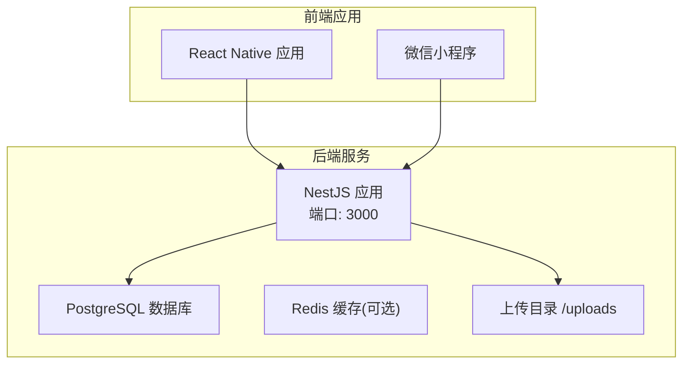
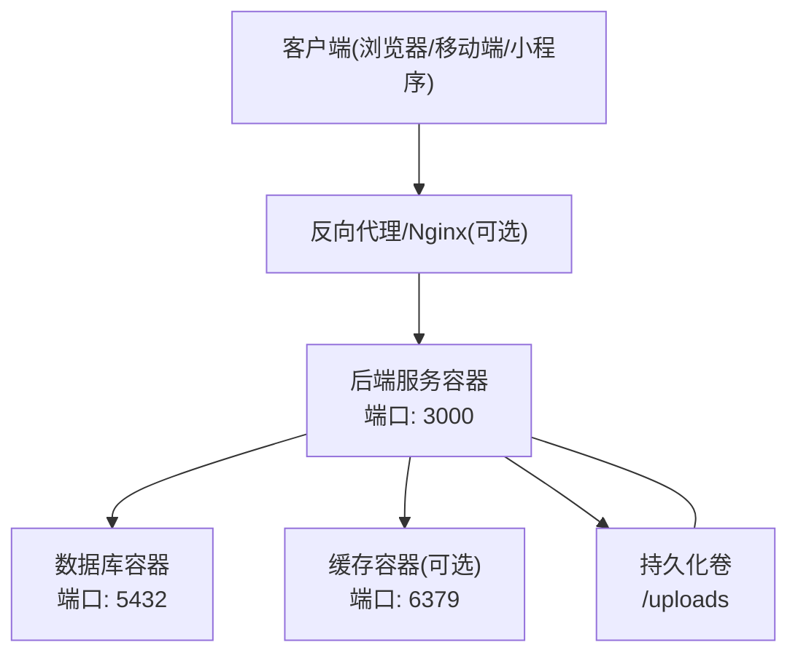
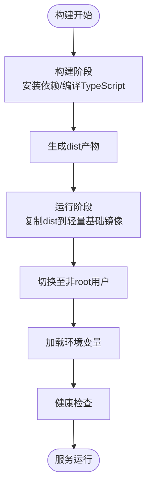
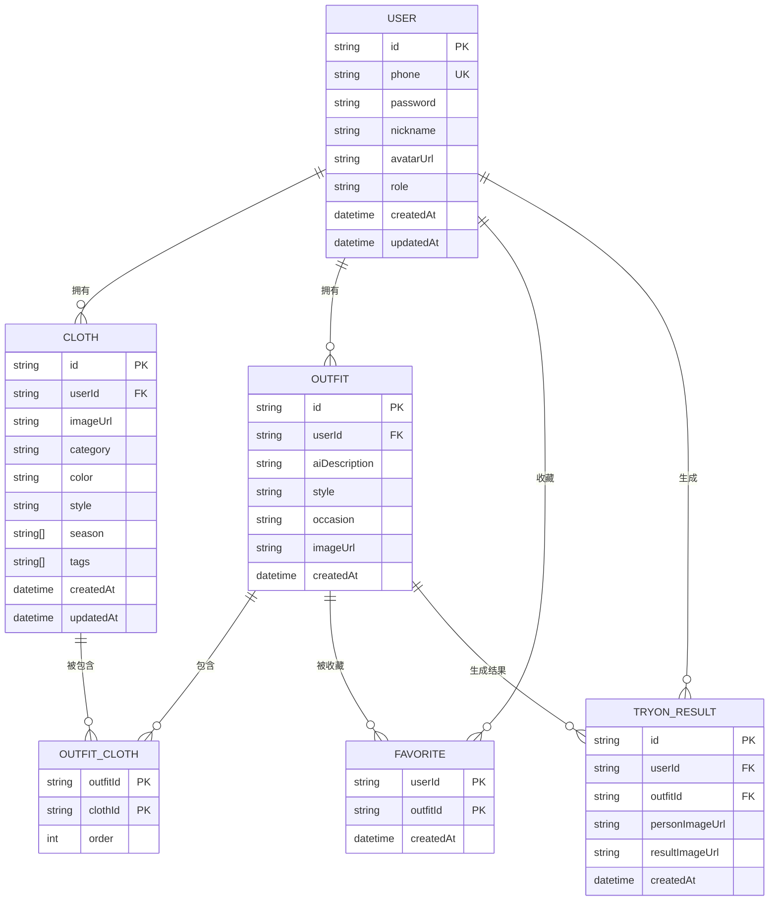
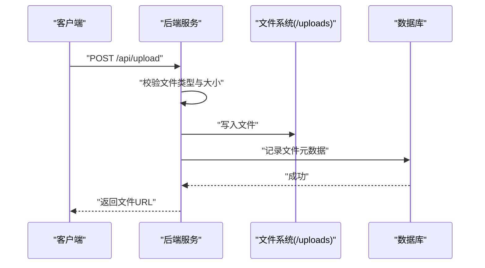
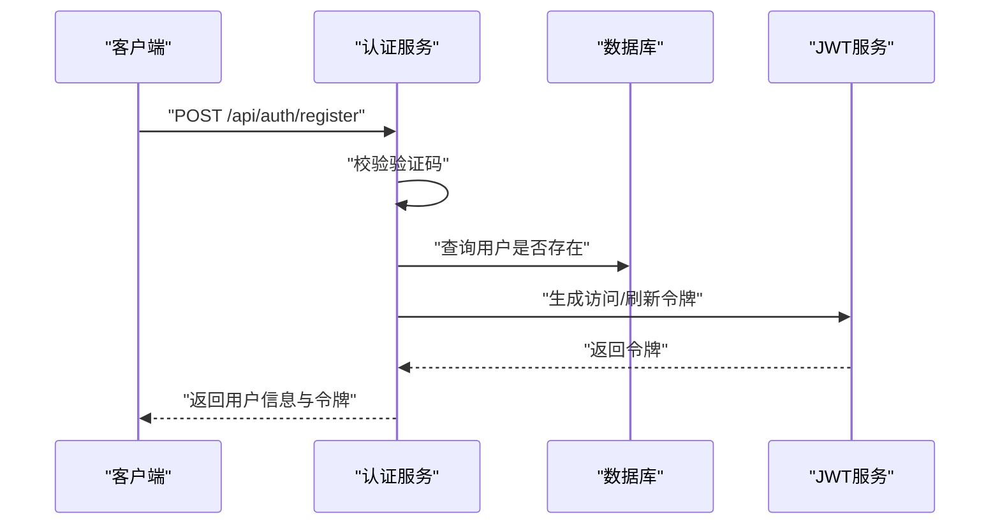
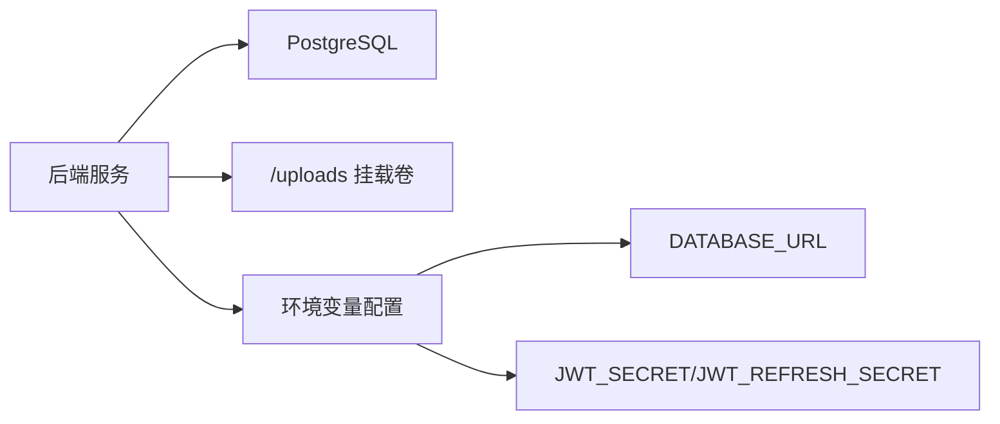

# Docker容器化部署

<cite>
**本文引用的文件**
- [backend/package.json](file://backend/package.json)
- [backend/src/main.ts](file://backend/src/main.ts)
- [backend/src/app.module.ts](file://backend/src/app.module.ts)
- [backend/src/prisma/prisma.service.ts](file://backend/src/prisma/prisma.service.ts)
- [backend/prisma/schema.prisma](file://backend/prisma/schema.prisma)
- [backend/src/modules/auth/auth.service.ts](file://backend/src/modules/auth/auth.service.ts)
- [backend/src/modules/upload/upload.service.ts](file://backend/src/modules/upload/upload.service.ts)
- [FreeDressApp/package.json](file://FreeDressApp/package.json)
- [freeDressWechat/app.json](file://freeDressWechat/app.json)
</cite>

## 目录
1. [简介](#简介)
2. [项目结构](#项目结构)
3. [核心组件](#核心组件)
4. [架构总览](#架构总览)
5. [详细组件分析](#详细组件分析)
6. [依赖关系分析](#依赖关系分析)
7. [性能考虑](#性能考虑)
8. [故障排除指南](#故障排除指南)
9. [结论](#结论)
10. [附录](#附录)

## 简介
本方案为畅搭(FreeDress)项目提供完整的Docker容器化部署指南，涵盖后端(NestJS)、数据库(PostgreSQL)与静态资源上传目录的容器化与编排。文档重点包括：
- 多阶段构建优化与镜像体积控制
- Docker Compose容器编排：后端服务、数据库、缓存
- 容器网络与端口映射策略
- 安全最佳实践：非root用户运行、最小权限原则
- 监控与日志收集方案
- 资源限制与性能调优建议
- Kubernetes部署配置示例与集群管理策略

## 项目结构
畅搭项目由三部分组成：
- 后端服务：基于NestJS的REST API，负责认证、用户、衣物、搭配、上传等功能模块
- 移动端应用：React Native应用，负责移动端交互
- 微信小程序：基于微信小程序框架的应用页面配置

**图表来源**
- [backend/src/main.ts:50-52](file://backend/src/main.ts#L50-L52)
- [backend/src/app.module.ts:19-22](file://backend/src/app.module.ts#L19-L22)
- [backend/prisma/schema.prisma:8-11](file://backend/prisma/schema.prisma#L8-L11)

**章节来源**
- [backend/src/main.ts:50-52](file://backend/src/main.ts#L50-L52)
- [backend/src/app.module.ts:19-22](file://backend/src/app.module.ts#L19-L22)
- [backend/prisma/schema.prisma:8-11](file://backend/prisma/schema.prisma#L8-L11)

## 核心组件
- 后端服务：监听端口3000，启用CORS，设置全局API前缀/api，并提供Swagger文档
- 数据库：PostgreSQL，通过Prisma进行ORM管理
- 上传服务：本地文件系统写入/uploads目录，提供图片上传能力
- 静态资源：通过ServeStaticModule对外提供/uploads静态访问

**章节来源**
- [backend/src/main.ts:31-48](file://backend/src/main.ts#L31-L48)
- [backend/src/app.module.ts:19-22](file://backend/src/app.module.ts#L19-L22)
- [backend/src/prisma/prisma.service.ts:14-24](file://backend/src/prisma/prisma.service.ts#L14-L24)
- [backend/src/modules/upload/upload.service.ts:17-47](file://backend/src/modules/upload/upload.service.ts#L17-L47)

## 架构总览
后端服务通过Docker镜像运行，使用环境变量配置数据库连接、JWT密钥与端口；静态上传目录挂载到持久化卷；数据库与缓存作为独立容器运行并通过网络互通。

**图表来源**
- [backend/src/main.ts:50-52](file://backend/src/main.ts#L50-L52)
- [backend/prisma/schema.prisma:8-11](file://backend/prisma/schema.prisma#L8-L11)
- [backend/src/app.module.ts:19-22](file://backend/src/app.module.ts#L19-L22)

## 详细组件分析

### 后端服务容器化设计
- 多阶段构建：使用Node.js官方镜像作为构建阶段，复制dist产物到精简的基础镜像中，减少镜像体积
- 运行时用户：以非root用户运行，降低权限风险
- 环境变量：通过.dockerenv或Compose注入DATABASE_URL、JWT_SECRET等关键配置
- 健康检查：提供HTTP健康检查端点，便于容器编排工具探测服务状态
- 日志：标准输出记录启动信息与数据库连接状态

**图表来源**
- [backend/package.json:8-24](file://backend/package.json#L8-L24)
- [backend/src/main.ts:50-52](file://backend/src/main.ts#L50-L52)

**章节来源**
- [backend/package.json:8-24](file://backend/package.json#L8-L24)
- [backend/src/main.ts:50-52](file://backend/src/main.ts#L50-L52)

### 数据库容器化设计
- 数据库类型：PostgreSQL，版本与Prisma适配
- 连接配置：通过DATABASE_URL环境变量注入，支持主机名、端口、用户名、密码与数据库名
- 初始化：首次启动时可执行迁移脚本，确保表结构与索引就绪
- 持久化：数据卷映射到宿主机，避免容器删除导致数据丢失

**图表来源**
- [backend/prisma/schema.prisma:14-131](file://backend/prisma/schema.prisma#L14-L131)

**章节来源**
- [backend/prisma/schema.prisma:8-11](file://backend/prisma/schema.prisma#L8-L11)
- [backend/src/prisma/prisma.service.ts:14-24](file://backend/src/prisma/prisma.service.ts#L14-L24)

### 上传服务与静态资源
- 上传目录：/uploads，通过ServeStaticModule对外提供静态访问
- 文件系统：写入到容器内指定路径，需挂载到持久化卷
- 安全性：限制文件类型与大小，防止恶意文件上传

**图表来源**
- [backend/src/modules/upload/upload.service.ts:25-47](file://backend/src/modules/upload/upload.service.ts#L25-L47)
- [backend/src/app.module.ts:19-22](file://backend/src/app.module.ts#L19-L22)

**章节来源**
- [backend/src/modules/upload/upload.service.ts:17-47](file://backend/src/modules/upload/upload.service.ts#L17-L47)
- [backend/src/app.module.ts:19-22](file://backend/src/app.module.ts#L19-L22)

### 认证与安全
- JWT令牌：登录成功后生成访问令牌与刷新令牌，支持配置过期时间
- 密码加密：使用bcrypt对密码进行加盐哈希存储
- 验证码：注册/忘记密码流程集成图片验证码校验
- 权限控制：JWT守卫保护受保护路由

**图表来源**
- [backend/src/modules/auth/auth.service.ts:44-95](file://backend/src/modules/auth/auth.service.ts#L44-L95)
- [backend/src/modules/auth/auth.service.ts:153-171](file://backend/src/modules/auth/auth.service.ts#L153-L171)

**章节来源**
- [backend/src/modules/auth/auth.service.ts:24-37](file://backend/src/modules/auth/auth.service.ts#L24-L37)
- [backend/src/modules/auth/auth.service.ts:153-171](file://backend/src/modules/auth/auth.service.ts#L153-L171)

## 依赖关系分析
后端服务依赖数据库与上传目录，同时通过环境变量与外部服务交互。

**图表来源**
- [backend/src/main.ts:50-52](file://backend/src/main.ts#L50-L52)
- [backend/prisma/schema.prisma:8-11](file://backend/prisma/schema.prisma#L8-L11)
- [backend/src/app.module.ts:19-22](file://backend/src/app.module.ts#L19-L22)

**章节来源**
- [backend/src/main.ts:50-52](file://backend/src/main.ts#L50-L52)
- [backend/prisma/schema.prisma:8-11](file://backend/prisma/schema.prisma#L8-L11)
- [backend/src/app.module.ts:19-22](file://backend/src/app.module.ts#L19-L22)

## 性能考虑
- 镜像体积：多阶段构建仅保留运行时必需文件，减少攻击面与拉取时间
- 连接池：在生产环境配置数据库连接池参数，避免频繁建立/释放连接
- 缓存：使用Redis缓存热点数据与会话信息，减轻数据库压力
- 文件上传：限制文件大小与类型，结合CDN加速静态资源访问
- 健康检查：定期探活，快速发现并重启异常容器

## 故障排除指南
- 数据库连接失败：检查DATABASE_URL格式与可达性，确认容器网络与端口映射
- JWT签名错误：核对JWT_SECRET与JWT_REFRESH_SECRET是否一致且长度足够
- 上传失败：确认/uploads目录权限与磁盘空间，检查文件类型与大小限制
- CORS问题：确认后端CORS配置允许的来源与凭证设置

**章节来源**
- [backend/src/prisma/prisma.service.ts:14-24](file://backend/src/prisma/prisma.service.ts#L14-L24)
- [backend/src/modules/auth/auth.service.ts:153-171](file://backend/src/modules/auth/auth.service.ts#L153-L171)
- [backend/src/modules/upload/upload.service.ts:30-38](file://backend/src/modules/upload/upload.service.ts#L30-L38)

## 结论
通过多阶段构建与非root运行，结合Compose编排与持久化卷，畅搭项目可在Docker环境中实现高效、安全、可扩展的部署。配合健康检查与监控体系，可进一步提升系统的稳定性与可观测性。

## 附录

### Dockerfile编写指南
- 构建阶段：使用Node.js官方镜像，安装依赖并编译TypeScript
- 运行阶段：复制dist产物到轻量基础镜像，设置非root用户与工作目录
- 环境变量：通过.dockerenv或Compose注入DATABASE_URL、JWT_SECRET等
- 健康检查：提供HTTP GET /health端点，返回200表示服务可用
- 安全：禁用不必要的包，清理缓存，最小化暴露端口

**章节来源**
- [backend/package.json:8-24](file://backend/package.json#L8-L24)
- [backend/src/main.ts:50-52](file://backend/src/main.ts#L50-L52)

### Docker Compose配置要点
- 服务定义：后端、数据库、缓存(可选)分别定义
- 网络：自定义桥接网络，服务间通过服务名通信
- 卷：/uploads挂载到持久化卷，数据库数据卷映射到宿主机
- 环境变量：统一管理DATABASE_URL、JWT密钥、端口等
- 健康检查：为后端与数据库配置健康检查
- 重启策略：设置适当的重启策略，保证服务高可用

**章节来源**
- [backend/src/main.ts:50-52](file://backend/src/main.ts#L50-L52)
- [backend/prisma/schema.prisma:8-11](file://backend/prisma/schema.prisma#L8-L11)
- [backend/src/app.module.ts:19-22](file://backend/src/app.module.ts#L19-L22)

### 容器网络与端口映射
- 后端服务：容器内80端口，宿主机映射到3000
- 数据库：容器内5432端口，不建议直接映射到外网，通过内部网络访问
- 缓存：容器内6379端口，同样通过内部网络访问
- CORS：后端启用CORS，允许来自前端域名的请求

**章节来源**
- [backend/src/main.ts:31-35](file://backend/src/main.ts#L31-L35)
- [backend/src/main.ts:50-52](file://backend/src/main.ts#L50-L52)

### 容器安全最佳实践
- 非root用户：运行时切换到非root用户，限制文件系统权限
- 最小权限：仅授予容器运行所需的最小权限
- 只读根文件系统：在可能的情况下将根文件系统设为只读
- 环境变量加密：敏感信息通过Secret管理，不在镜像中硬编码
- 定期更新：保持基础镜像与依赖包最新，修复安全漏洞

**章节来源**
- [backend/src/main.ts:50-52](file://backend/src/main.ts#L50-L52)

### 容器监控与日志收集
- 日志：后端标准输出记录启动与数据库连接信息
- 监控：Prometheus + Grafana收集容器指标，如CPU、内存、网络与健康检查状态
- 告警：设置阈值告警，及时发现异常

**章节来源**
- [backend/src/prisma/prisma.service.ts:14-24](file://backend/src/prisma/prisma.service.ts#L14-L24)

### 容器资源限制与性能调优
- CPU/内存限制：根据业务峰值设置合理上限，避免资源争抢
- 连接池：数据库连接池大小与后端并发数匹配
- 缓存：Redis缓存热点数据，降低数据库负载
- 文件上传：结合CDN与对象存储，提升上传与访问性能

**章节来源**
- [backend/src/modules/auth/auth.service.ts:24-37](file://backend/src/modules/auth/auth.service.ts#L24-L37)
- [backend/src/modules/upload/upload.service.ts:30-38](file://backend/src/modules/upload/upload.service.ts#L30-L38)

### Kubernetes部署配置示例与集群管理策略
- Deployment：定义副本数、滚动更新策略与资源限制
- Service：ClusterIP/NodePort/LoadBalancer暴露服务
- ConfigMap：存放非敏感配置，如CORS与API前缀
- Secret：存放数据库连接串与JWT密钥
- PersistentVolume：为/exports与数据库数据卷提供持久化存储
- HPA：根据CPU/内存或自定义指标自动扩缩容
- Ingress：统一入口，配置TLS与路径转发规则

**章节来源**
- [backend/src/main.ts:31-48](file://backend/src/main.ts#L31-L48)
- [backend/src/app.module.ts:19-22](file://backend/src/app.module.ts#L19-L22)
- [backend/prisma/schema.prisma:8-11](file://backend/prisma/schema.prisma#L8-L11)