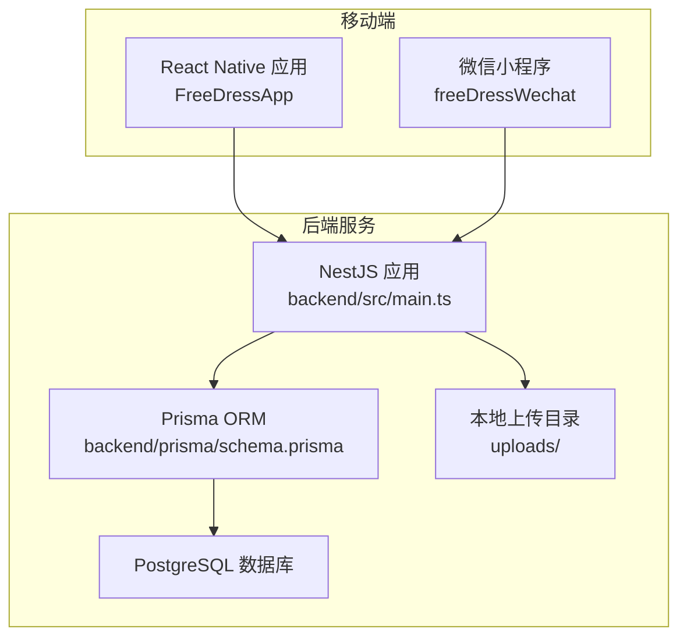
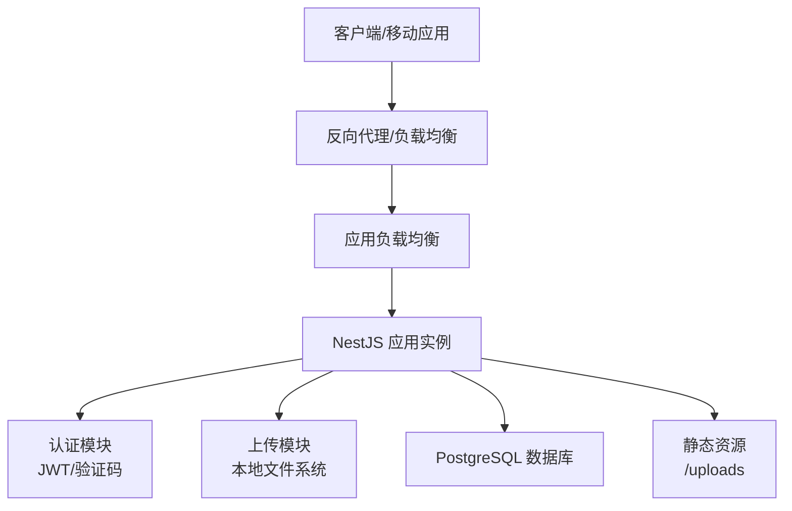
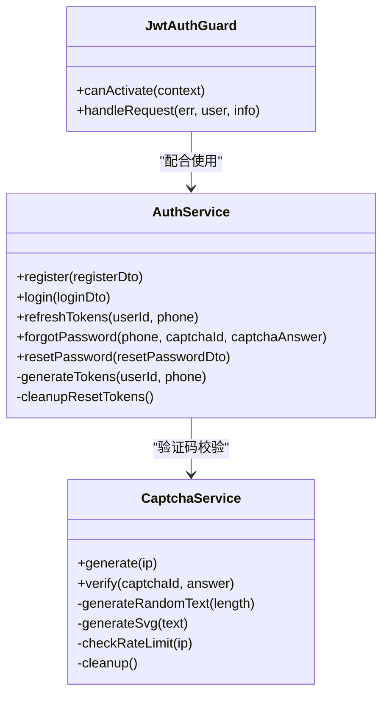
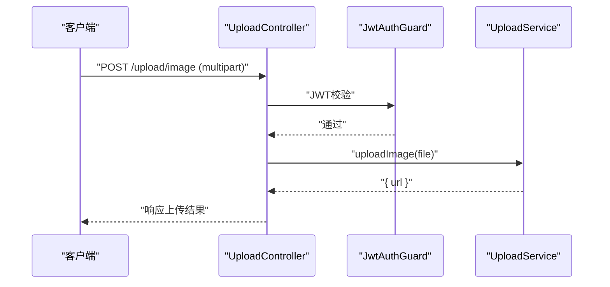
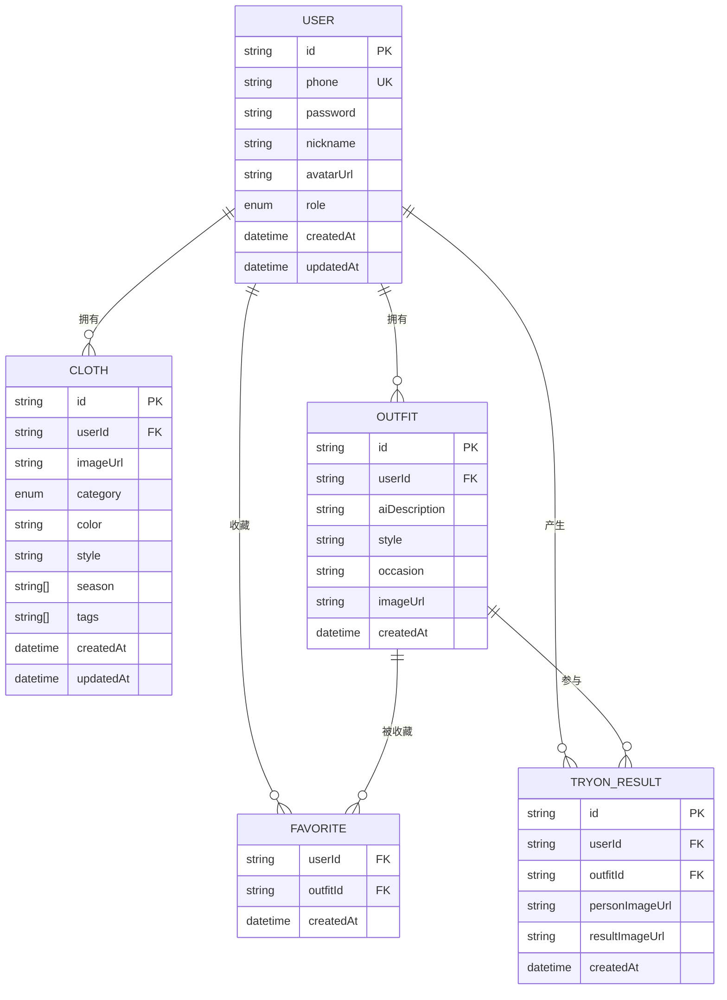
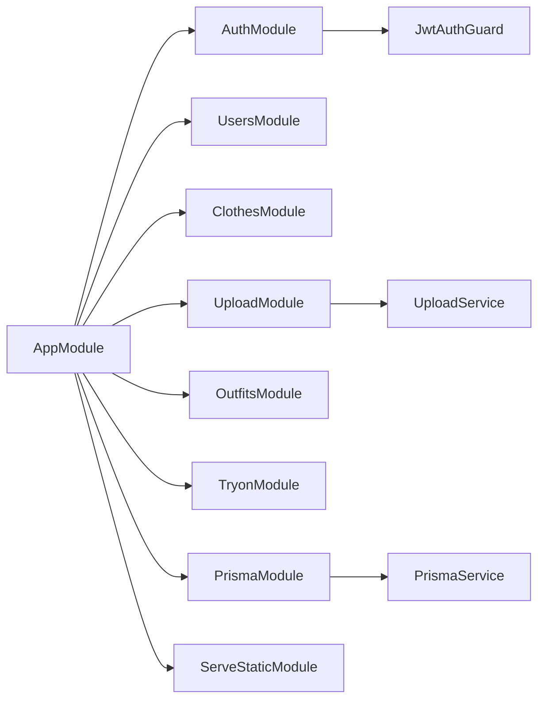

# 云平台部署

<cite>
**本文引用的文件**
- [backend/src/main.ts](file://backend/src/main.ts)
- [backend/src/app.module.ts](file://backend/src/app.module.ts)
- [backend/package.json](file://backend/package.json)
- [backend/README.md](file://backend/README.md)
- [backend/prisma/schema.prisma](file://backend/prisma/schema.prisma)
- [backend/src/modules/upload/upload.service.ts](file://backend/src/modules/upload/upload.service.ts)
- [backend/src/modules/upload/upload.controller.ts](file://backend/src/modules/upload/upload.controller.ts)
- [backend/src/modules/auth/auth.service.ts](file://backend/src/modules/auth/auth.service.ts)
- [backend/src/modules/auth/captcha.service.ts](file://backend/src/modules/auth/captcha.service.ts)
- [backend/src/common/guards/jwt-auth.guard.ts](file://backend/src/common/guards/jwt-auth.guard.ts)
- [backend/src/prisma/prisma.service.ts](file://backend/src/prisma/prisma.service.ts)
- [FreeDressApp/package.json](file://FreeDressApp/package.json)
- [FreeDressApp/README.md](file://FreeDressApp/README.md)
</cite>

## 目录
1. [简介](#简介)
2. [项目结构](#项目结构)
3. [核心组件](#核心组件)
4. [架构总览](#架构总览)
5. [详细组件分析](#详细组件分析)
6. [依赖分析](#依赖分析)
7. [性能考虑](#性能考虑)
8. [故障排查指南](#故障排查指南)
9. [结论](#结论)
10. [附录](#附录)

## 简介
本指南面向畅搭(FreeDress)项目在主流云平台的部署实践，覆盖 AWS、阿里云、腾讯云三大平台的部署方案，包括计算实例、数据库、对象存储与CDN、负载均衡与自动扩缩容、SSL证书与域名解析、成本优化与监控、以及灾备与高可用配置。文档同时结合项目现有技术栈与实现细节，给出可落地的部署步骤与最佳实践。

## 项目结构
畅搭项目由三部分组成：
- 移动端应用（React Native）：负责用户交互与调用后端API。
- 后端服务（NestJS + Prisma + PostgreSQL）：提供REST API、认证鉴权、业务逻辑与数据持久化。
- 微信小程序（freeDressWechat）：提供微信生态内的轻量化体验（部署可选）。

**图表来源**
- [backend/src/main.ts:12-52](file://backend/src/main.ts#L12-L52)
- [backend/src/app.module.ts:13-31](file://backend/src/app.module.ts#L13-L31)
- [backend/prisma/schema.prisma:1-132](file://backend/prisma/schema.prisma#L1-L132)

**章节来源**
- [backend/src/main.ts:12-52](file://backend/src/main.ts#L12-L52)
- [backend/src/app.module.ts:13-31](file://backend/src/app.module.ts#L13-L31)
- [backend/README.md:119-154](file://backend/README.md#L119-L154)

## 核心组件
- 后端入口与中间件
  - 应用启动、全局管道、拦截器、过滤器、CORS、Swagger文档与端口配置。
- 模块化架构
  - ConfigModule、ServeStaticModule、PrismaModule与各业务模块（auth、users、clothes、upload、outfits、tryon）。
- 数据层
  - Prisma客户端与PostgreSQL数据源；静态资源通过ServeStaticModule暴露/uploads路径。
- 认证与安全
  - JWT认证守卫、密码加密、图片验证码服务与防刷策略。
- 上传能力
  - 本地文件系统上传（生产环境建议迁移到云存储）。

**章节来源**
- [backend/src/main.ts:12-52](file://backend/src/main.ts#L12-L52)
- [backend/src/app.module.ts:13-31](file://backend/src/app.module.ts#L13-L31)
- [backend/src/prisma/prisma.service.ts:8-26](file://backend/src/prisma/prisma.service.ts#L8-L26)
- [backend/src/common/guards/jwt-auth.guard.ts:8-21](file://backend/src/common/guards/jwt-auth.guard.ts#L8-L21)
- [backend/src/modules/auth/captcha.service.ts:30-51](file://backend/src/modules/auth/captcha.service.ts#L30-L51)
- [backend/src/modules/upload/upload.service.ts:15-47](file://backend/src/modules/upload/upload.service.ts#L15-L47)

## 架构总览
后端服务采用NestJS模块化设计，通过Prisma访问PostgreSQL，静态资源通过静态服务模块暴露。认证模块提供JWT与图片验证码能力，上传模块提供图片上传接口。

**图表来源**
- [backend/src/main.ts:31-48](file://backend/src/main.ts#L31-L48)
- [backend/src/app.module.ts:19-22](file://backend/src/app.module.ts#L19-L22)
- [backend/prisma/schema.prisma:8-11](file://backend/prisma/schema.prisma#L8-L11)

## 详细组件分析

### 认证与安全组件
- JWT认证守卫：统一保护受保护接口，失败时返回未授权异常。
- 认证服务：注册、登录、Token刷新、忘记密码与重置密码流程，使用bcrypt进行密码加密。
- 图片验证码服务：生成SVG验证码、内存存储答案、过期控制、尝试次数限制与IP限流。

**图表来源**
- [backend/src/common/guards/jwt-auth.guard.ts:8-21](file://backend/src/common/guards/jwt-auth.guard.ts#L8-L21)
- [backend/src/modules/auth/auth.service.ts:24-37](file://backend/src/modules/auth/auth.service.ts#L24-L37)
- [backend/src/modules/auth/captcha.service.ts:30-51](file://backend/src/modules/auth/captcha.service.ts#L30-L51)

**章节来源**
- [backend/src/common/guards/jwt-auth.guard.ts:8-21](file://backend/src/common/guards/jwt-auth.guard.ts#L8-L21)
- [backend/src/modules/auth/auth.service.ts:44-95](file://backend/src/modules/auth/auth.service.ts#L44-L95)
- [backend/src/modules/auth/auth.service.ts:180-242](file://backend/src/modules/auth/auth.service.ts#L180-L242)
- [backend/src/modules/auth/captcha.service.ts:58-122](file://backend/src/modules/auth/captcha.service.ts#L58-L122)

### 上传组件
- 上传控制器：基于JWT守卫，接收multipart文件，调用上传服务。
- 上传服务：校验MIME类型与大小，生成UUID文件名，写入本地uploads目录，返回相对URL。

**图表来源**
- [backend/src/modules/upload/upload.controller.ts:28-50](file://backend/src/modules/upload/upload.controller.ts#L28-L50)
- [backend/src/common/guards/jwt-auth.guard.ts:8-21](file://backend/src/common/guards/jwt-auth.guard.ts#L8-L21)
- [backend/src/modules/upload/upload.service.ts:25-47](file://backend/src/modules/upload/upload.service.ts#L25-L47)

**章节来源**
- [backend/src/modules/upload/upload.controller.ts:28-50](file://backend/src/modules/upload/upload.controller.ts#L28-L50)
- [backend/src/modules/upload/upload.service.ts:15-47](file://backend/src/modules/upload/upload.service.ts#L15-L47)

### 数据模型与数据库
- 数据库：PostgreSQL 16+，Prisma作为ORM。
- 核心模型：User、Cloth、Outfit、Favorite、TryOnResult，定义了用户、衣物、搭配、收藏与试穿结果的数据结构与索引。

**图表来源**
- [backend/prisma/schema.prisma:14-31](file://backend/prisma/schema.prisma#L14-L31)
- [backend/prisma/schema.prisma:40-59](file://backend/prisma/schema.prisma#L40-L59)
- [backend/prisma/schema.prisma:71-88](file://backend/prisma/schema.prisma#L71-L88)
- [backend/prisma/schema.prisma:104-114](file://backend/prisma/schema.prisma#L104-L114)
- [backend/prisma/schema.prisma:117-131](file://backend/prisma/schema.prisma#L117-L131)

**章节来源**
- [backend/prisma/schema.prisma:1-132](file://backend/prisma/schema.prisma#L1-L132)

## 依赖分析
- 后端运行时依赖：NestJS、Prisma、PostgreSQL、JWT、Swagger、bcryptjs等。
- 移动端运行时依赖：React Native、Axios、导航与动画库等。
- 模块间耦合：AppModule聚合各业务模块；PrismaService负责数据库连接；ServeStaticModule提供静态资源服务。

**图表来源**
- [backend/src/app.module.ts:13-31](file://backend/src/app.module.ts#L13-L31)
- [backend/src/prisma/prisma.service.ts:8-26](file://backend/src/prisma/prisma.service.ts#L8-L26)
- [backend/src/modules/upload/upload.service.ts:15-47](file://backend/src/modules/upload/upload.service.ts#L15-L47)
- [backend/src/common/guards/jwt-auth.guard.ts:8-21](file://backend/src/common/guards/jwt-auth.guard.ts#L8-L21)

**章节来源**
- [backend/package.json:26-44](file://backend/package.json#L26-L44)
- [FreeDressApp/package.json:12-31](file://FreeDressApp/package.json#L12-L31)

## 性能考虑
- 数据库连接池与索引：合理设置连接数，为高频查询字段建立索引（如用户ID、分类等）。
- 缓存策略：对热点数据与接口结果引入缓存（如Redis），减少数据库压力。
- 上传优化：生产环境将本地uploads迁移到云对象存储（如S3、OSS、COS），并启用CDN加速。
- 压缩与静态资源：开启Gzip/Br压缩，静态资源走CDN。
- 监控与日志：接入APM与日志收集，持续观察QPS、延迟、错误率与数据库慢查询。

[本节为通用指导，无需具体文件引用]

## 故障排查指南
- 启动与端口
  - 确认端口占用与防火墙放行，默认监听端口可在启动脚本中调整。
- 数据库连接
  - 检查DATABASE_URL、网络连通性与数据库权限；PrismaService在模块初始化时会打印连接状态。
- 认证问题
  - JWT密钥与过期时间配置；验证码过期与尝试次数限制；IP限流触发。
- 上传失败
  - MIME类型与大小限制；磁盘空间与权限；uploads目录是否存在且可写。

**章节来源**
- [backend/src/main.ts:50-58](file://backend/src/main.ts#L50-L58)
- [backend/src/prisma/prisma.service.ts:14-25](file://backend/src/prisma/prisma.service.ts#L14-L25)
- [backend/src/modules/auth/captcha.service.ts:98-122](file://backend/src/modules/auth/captcha.service.ts#L98-L122)
- [backend/src/modules/upload/upload.service.ts:30-38](file://backend/src/modules/upload/upload.service.ts#L30-L38)

## 结论
本指南提供了畅搭项目在主流云平台的部署蓝图：以NestJS为核心的服务端、PostgreSQL为数据底座、JWT与验证码保障安全、本地上传作为起点并建议迁移到云存储与CDN。通过合理的负载均衡、自动扩缩容、SSL证书与域名解析、成本优化与监控，以及灾备与高可用配置，可构建稳定、可扩展的生产环境。

[本节为总结性内容，无需具体文件引用]

## 附录

### AWS 部署方案
- EC2 实例配置
  - 选择合适规格（根据并发与数据库负载评估），安装Node.js与PostgreSQL。
  - 配置安全组放行HTTP/HTTPS与数据库端口。
- RDS 数据库设置
  - 使用PostgreSQL 16+，启用备份与跨可用区部署，配置只读副本提升读扩展。
- S3 存储桶配置
  - 创建桶并设置访问控制与跨域规则；将后端上传目录替换为S3上传。
- CloudFront CDN 部署
  - 源站指向后端域名或S3桶；配置HTTPS证书与缓存策略。
- 负载均衡与自动扩缩容
  - ALB + ECS Auto Scaling 或 EC2 Auto Scaling；健康检查与容量规划。
- SSL 证书与域名解析
  - ACM申请证书；Route 53解析到ALB/CloudFront。
- 成本优化与监控
  - Spot实例与预留实例组合；CloudWatch告警；Prisma/数据库慢查询日志。
- 灾备与高可用
  - 多可用区部署、读副本、备份保留策略与恢复演练。

[本节为概念性部署流程，无需具体文件引用]

### 阿里云部署流程
- ECS 实例与镜像
  - 部署Node.js与PostgreSQL环境；安全组放行端口。
- RDS 实例
  - 高可用主从架构，开启备份与跨可用区。
- OSS 对象存储
  - 替换本地上传为OSS直传或签名URL；CDN加速。
- SLB 负载均衡
  - 配置四层/七层转发；健康检查与会话保持。
- SSL 证书与域名解析
  - 证书服务申请；解析到SLB。
- 成本优化与监控
  - 专有网络VPC隔离；按量付费与资源包组合；云监控与日志服务。
- 灾备与高可用
  - 多可用区与异地灾备；数据库主备切换演练。

[本节为概念性部署流程，无需具体文件引用]

### 腾讯云部署方案
- CVM 云服务器
  - 部署后端与数据库；安全组与网络ACL配置。
- DBS 数据库服务
  - 使用云数据库，开启备份、只读实例与跨可用区。
- COS 对象存储
  - 替换本地上传为COS；CDN加速与防盗链。
- 负载均衡与自动扩缩容
  - CLB + AS弹性伸缩；健康检查与扩缩策略。
- SSL 证书与域名解析
  - 证书服务申请；解析到CLB。
- 成本优化与监控
  - 包年包月与按量混合；云监控与日志检索。
- 灾备与高可用
  - 多地域备份与容灾；数据库双活或多活架构。

[本节为概念性部署流程，无需具体文件引用]

### 通用运维要点
- 环境变量与密钥管理：使用云厂商密钥管理服务（KMS/凭据管理）。
- 静态资源与上传：生产环境务必使用云存储与CDN，避免单点故障。
- 监控与告警：应用性能监控（APM）、日志聚合、数据库性能指标。
- 安全加固：最小权限原则、内网访问、WAF防护、定期漏洞扫描。
- 备份与恢复：自动化备份、定期恢复演练、灾难恢复计划。

[本节为通用指导，无需具体文件引用]