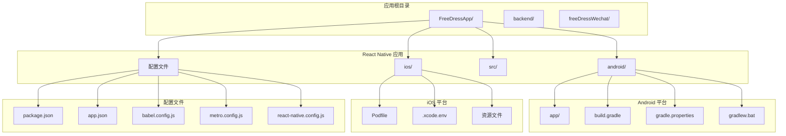
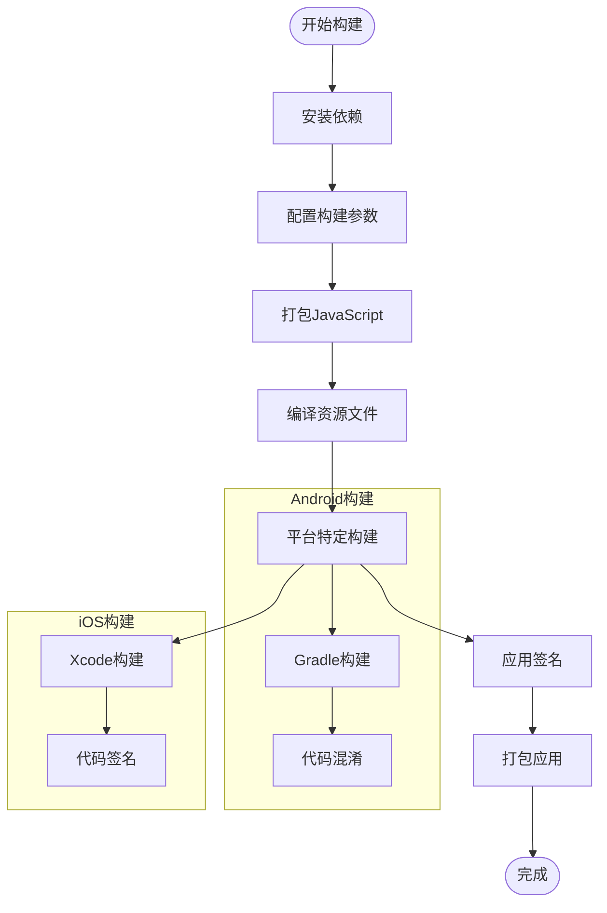
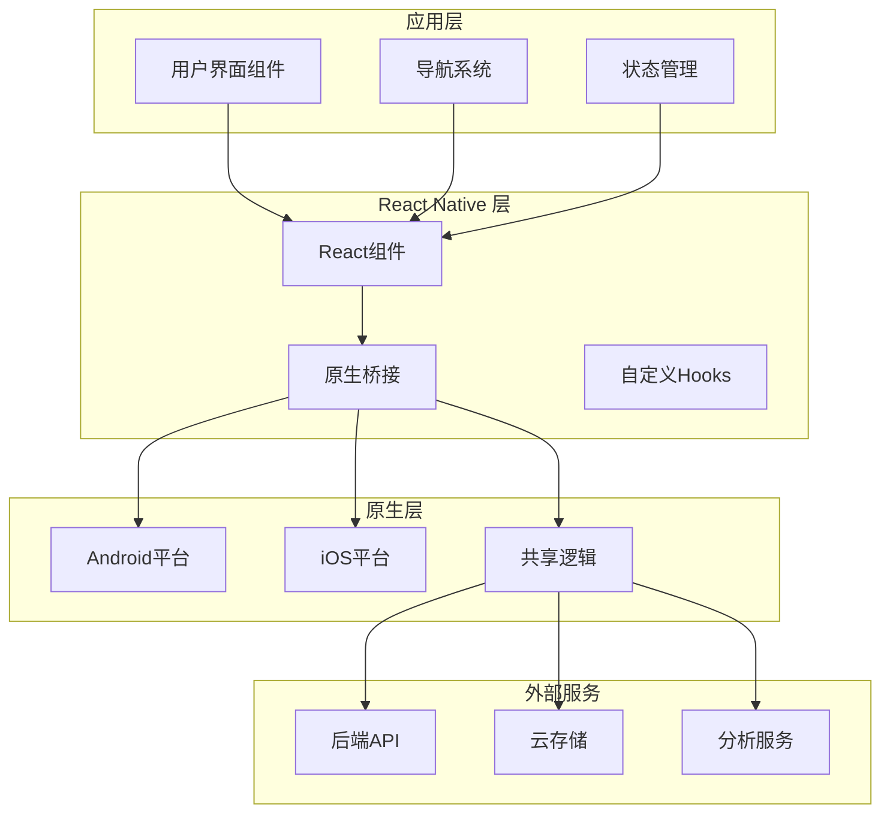
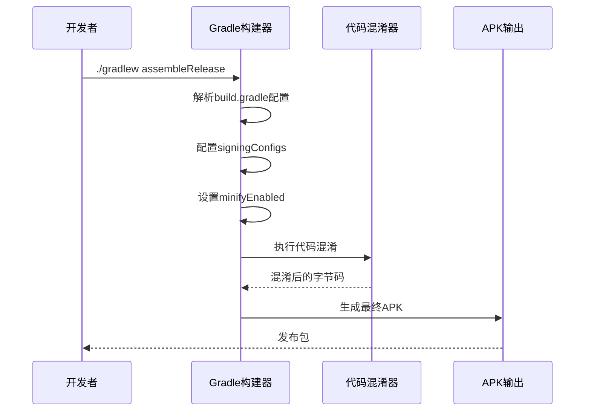
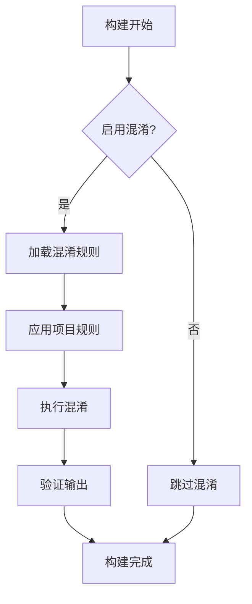
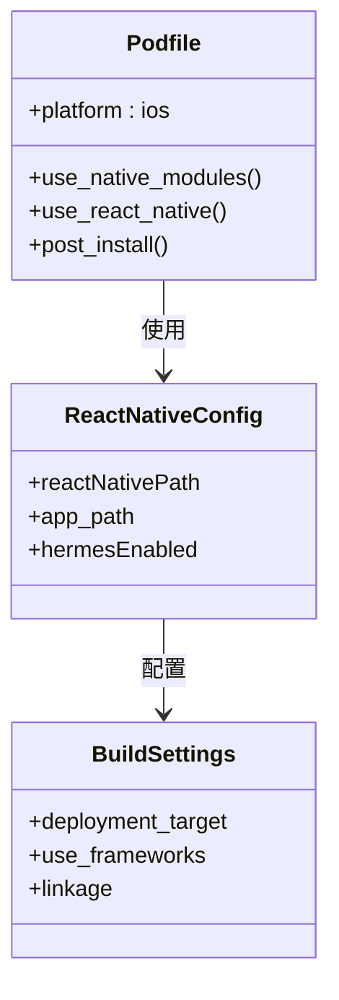
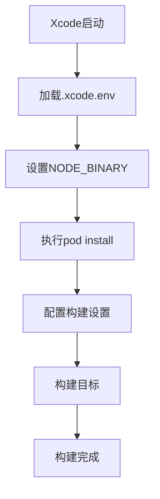
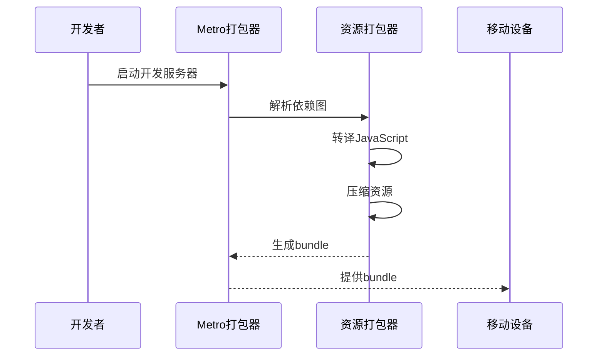

# 前端应用部署

<cite>
**本文档引用的文件**
- [package.json](file://FreeDressApp/package.json)
- [app.json](file://FreeDressApp/app.json)
- [build.gradle](file://FreeDressApp/android/build.gradle)
- [app/build.gradle](file://FreeDressApp/android/app/build.gradle)
- [proguard-rules.pro](file://FreeDressApp/android/app/proguard-rules.pro)
- [gradle.properties](file://FreeDressApp/android/gradle.properties)
- [gradlew.bat](file://FreeDressApp/android/gradlew.bat)
- [Podfile](file://FreeDressApp/ios/Podfile)
- [.xcode.env](file://FreeDressApp/ios/.xcode.env)
- [babel.config.js](file://FreeDressApp/babel.config.js)
- [metro.config.js](file://FreeDressApp/metro.config.js)
- [react-native.config.js](file://FreeDressApp/react-native.config.js)
</cite>

## 目录
1. [简介](#简介)
2. [项目结构](#项目结构)
3. [核心组件](#核心组件)
4. [架构概览](#架构概览)
5. [详细组件分析](#详细组件分析)
6. [依赖分析](#依赖分析)
7. [性能考虑](#性能考虑)
8. [故障排除指南](#故障排除指南)
9. [结论](#结论)
10. [附录](#附录)

## 简介

畅搭(FreeDress)是一个基于React Native开发的跨平台移动应用，支持Android和iOS平台。本指南提供了完整的生产环境部署方案，涵盖应用构建、打包、签名配置、应用商店发布、内测分发以及CI/CD流水线配置。

## 项目结构

畅搭项目采用标准的React Native项目结构，主要包含以下关键目录：



**图表来源**
- [package.json:1-57](file://FreeDressApp/package.json#L1-L57)
- [build.gradle:1-22](file://FreeDressApp/android/build.gradle#L1-L22)
- [Podfile:1-35](file://FreeDressApp/ios/Podfile#L1-L35)

**章节来源**
- [package.json:1-57](file://FreeDressApp/package.json#L1-L57)
- [app.json:1-5](file://FreeDressApp/app.json#L1-L5)

## 核心组件

### 构建系统配置

应用使用React Native CLI进行构建管理，支持多平台统一构建流程：

- **Node.js版本要求**: >= 22.11.0
- **React Native版本**: 0.85.3
- **React版本**: 19.2.3
- **构建工具**: Gradle (Android) + CocoaPods (iOS)

### 包管理配置



**图表来源**
- [package.json:5-11](file://FreeDressApp/package.json#L5-L11)
- [gradle.properties:25-44](file://FreeDressApp/android/gradle.properties#L25-L44)

**章节来源**
- [package.json:53-55](file://FreeDressApp/package.json#L53-L55)
- [gradle.properties:13-44](file://FreeDressApp/android/gradle.properties#L13-L44)

## 架构概览

应用采用现代化的React Native架构，支持原生模块集成和高性能渲染：



**图表来源**
- [babel.config.js:1-4](file://FreeDressApp/babel.config.js#L1-L4)
- [metro.config.js:1-12](file://FreeDressApp/metro.config.js#L1-L12)

## 详细组件分析

### Android构建配置

#### Gradle构建系统

Android应用使用Gradle作为构建工具，配置了完整的构建生命周期：



**图表来源**
- [app/build.gradle:88-108](file://FreeDressApp/android/app/build.gradle#L88-L108)
- [gradlew.bat:1-99](file://FreeDressApp/android/gradlew.bat#L1-L99)

#### 签名配置

应用当前使用调试签名配置，生产环境需要替换为正式签名：

| 配置项 | 当前值 | 生产环境建议 |
|--------|--------|-------------|
| storeFile | debug.keystore | 生产keystore文件 |
| storePassword | android | 强密码（至少12位） |
| keyAlias | androiddebugkey | 自定义别名 |
| keyPassword | android | 强密码 |

**章节来源**
- [app/build.gradle:88-108](file://FreeDressApp/android/app/build.gradle#L88-L108)

#### 代码混淆配置



**图表来源**
- [app/build.gradle:60](file://FreeDressApp/android/app/build.gradle#L60)
- [proguard-rules.pro:1-11](file://FreeDressApp/android/app/proguard-rules.pro#L1-L11)

**章节来源**
- [app/build.gradle:58-108](file://FreeDressApp/android/app/build.gradle#L58-L108)
- [proguard-rules.pro:1-11](file://FreeDressApp/android/app/proguard-rules.pro#L1-L11)

### iOS构建配置

#### CocoaPods依赖管理

iOS平台使用CocoaPods进行原生依赖管理，配置了完整的React Native集成：



**图表来源**
- [Podfile:17-34](file://FreeDressApp/ios/Podfile#L17-L34)

#### Xcode环境配置



**图表来源**
- [.xcode.env:1-12](file://FreeDressApp/ios/.xcode.env#L1-L12)
- [Podfile:26-33](file://FreeDressApp/ios/Podfile#L26-L33)

**章节来源**
- [Podfile:1-35](file://FreeDressApp/ios/Podfile#L1-L35)
- [.xcode.env:1-12](file://FreeDressApp/ios/.xcode.env#L1-L12)

### 构建工具链

#### Babel配置

应用使用Babel进行JavaScript转译和优化：

| 配置项 | 值 | 用途 |
|--------|-----|------|
| preset | @react-native/babel-preset | React Native标准预设 |
| plugin | react-native-reanimated/plugin | Reanimated性能优化 |

#### Metro打包器

Metro作为默认的JavaScript打包器，提供了快速开发和生产构建支持：



**图表来源**
- [babel.config.js:1-4](file://FreeDressApp/babel.config.js#L1-L4)
- [metro.config.js:1-12](file://FreeDressApp/metro.config.js#L1-L12)

**章节来源**
- [babel.config.js:1-4](file://FreeDressApp/babel.config.js#L1-L4)
- [metro.config.js:1-12](file://FreeDressApp/metro.config.js#L1-L12)

## 依赖分析

### 平台特定依赖

```mermaid
graph LR
subgraph "Android依赖"
RN[react-native: 0.85.3]
RNNative[react-native-*]
VectorIcons[react-native-vector-icons]
AsyncStorage[@react-native-async-storage/async-storage]
end
subgraph "iOS依赖"
RN --> RNIOS[react-native-ios]
RNNative --> RNIOSNative[react-native-ios-*]
end
subgraph "开发依赖"
Babel[@babel/*]
Jest[jest]
ESLint[eslint]
TypeScript[@types/*]
end
```

**图表来源**
- [package.json:12-31](file://FreeDressApp/package.json#L12-L31)
- [package.json:32-51](file://FreeDressApp/package.json#L32-L51)

### 版本兼容性

| 组件 | 当前版本 | 最小推荐版本 | 兼容性 |
|------|----------|--------------|--------|
| Node.js | >= 22.11.0 | 22.11.0 | ✅ 完全兼容 |
| React Native | 0.85.3 | 0.85.0 | ✅ 兼容 |
| Android SDK | 36 | 36+ | ✅ 兼容 |
| iOS SDK | 15.0+ | 15.0+ | ✅ 兼容 |

**章节来源**
- [package.json:53-55](file://FreeDressApp/package.json#L53-L55)
- [build.gradle:4-8](file://FreeDressApp/android/build.gradle#L4-L8)

## 性能考虑

### 构建性能优化

1. **并行构建**: 启用Gradle并行构建以提高构建速度
2. **增量编译**: 利用React Native的增量编译特性
3. **缓存策略**: 配置Metro缓存减少重复构建时间
4. **资源优化**: 压缩图片和字体资源

### 运行时性能

1. **Hermes引擎**: 默认启用Hermes JavaScript引擎提升性能
2. **Reanimated**: 使用Reanimated进行高性能动画
3. **原生模块**: 通过原生模块提升复杂操作性能

## 故障排除指南

### 常见构建问题

#### Android签名错误
**问题**: `Signing failed` 或 `Keystore not found`
**解决方案**: 
1. 生成新的keystore文件
2. 更新`build.gradle`中的签名配置
3. 设置正确的环境变量

#### iOS构建失败
**问题**: `pod install` 失败或Xcode构建错误
**解决方案**:
1. 清理Pod缓存：`rm -rf Pods/ Podfile.lock build/ DerivedData/`
2. 重新安装依赖：`pod install --repo-update`
3. 更新Xcode到最新版本

#### Metro打包错误
**问题**: `Metro bundler` 启动失败
**解决方案**:
1. 清理缓存：`npx react-native start --reset-cache`
2. 检查端口占用：`lsof -i :8081`
3. 重启开发服务器

**章节来源**
- [app/build.gradle:100-106](file://FreeDressApp/android/app/build.gradle#L100-L106)
- [gradle.properties:13](file://FreeDressApp/android/gradle.properties#L13)

## 结论

畅搭(FreeDress)应用提供了完整的跨平台移动应用解决方案。通过合理的构建配置、签名管理和CI/CD集成，可以实现高效的生产环境部署。建议在生产环境中重点关注应用安全、性能优化和用户体验。

## 附录

### 生产环境部署检查清单

- [ ] 配置正式签名证书
- [ ] 启用代码混淆和压缩
- [ ] 配置推送通知
- [ ] 设置应用图标和启动画面
- [ ] 配置隐私权限说明
- [ ] 测试所有核心功能
- [ ] 准备应用商店元数据
- [ ] 建立监控和日志系统

### CI/CD最佳实践

1. **分支策略**: 使用GitFlow工作流
2. **自动化测试**: 集成单元测试和E2E测试
3. **构建缓存**: 配置依赖缓存
4. **安全扫描**: 集成安全漏洞扫描
5. **发布管道**: 自动化部署到应用商店