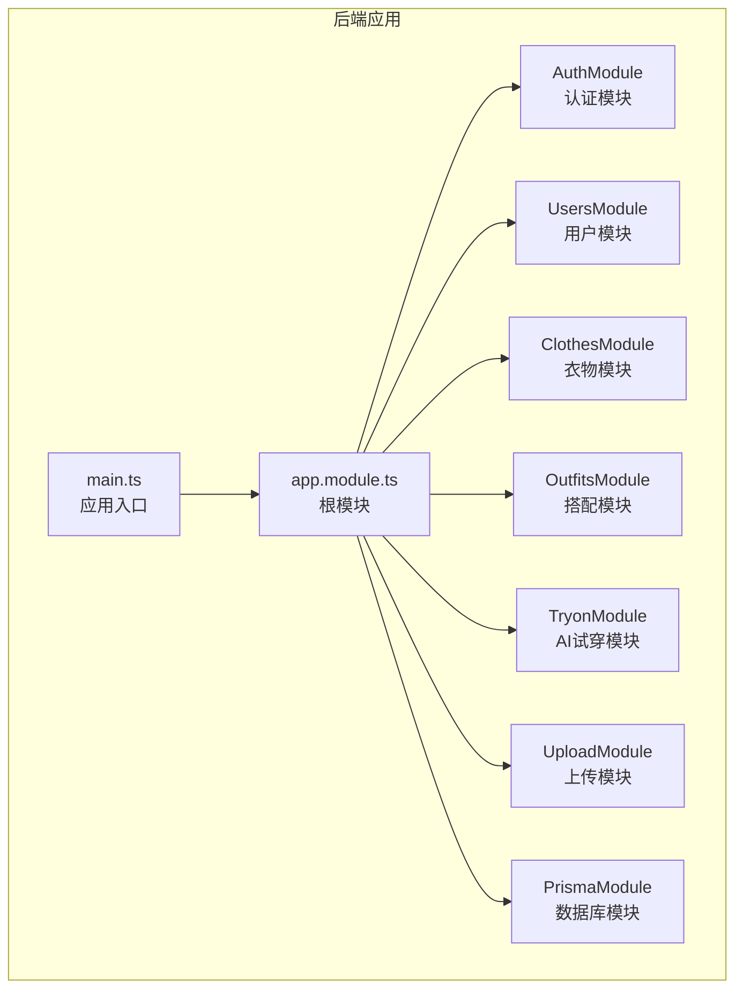
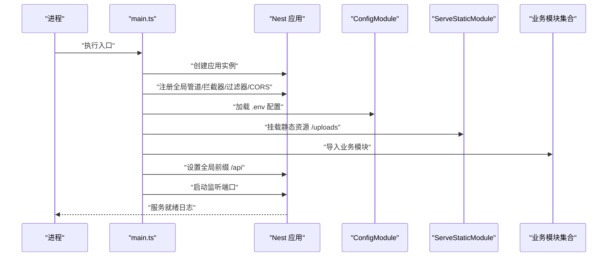
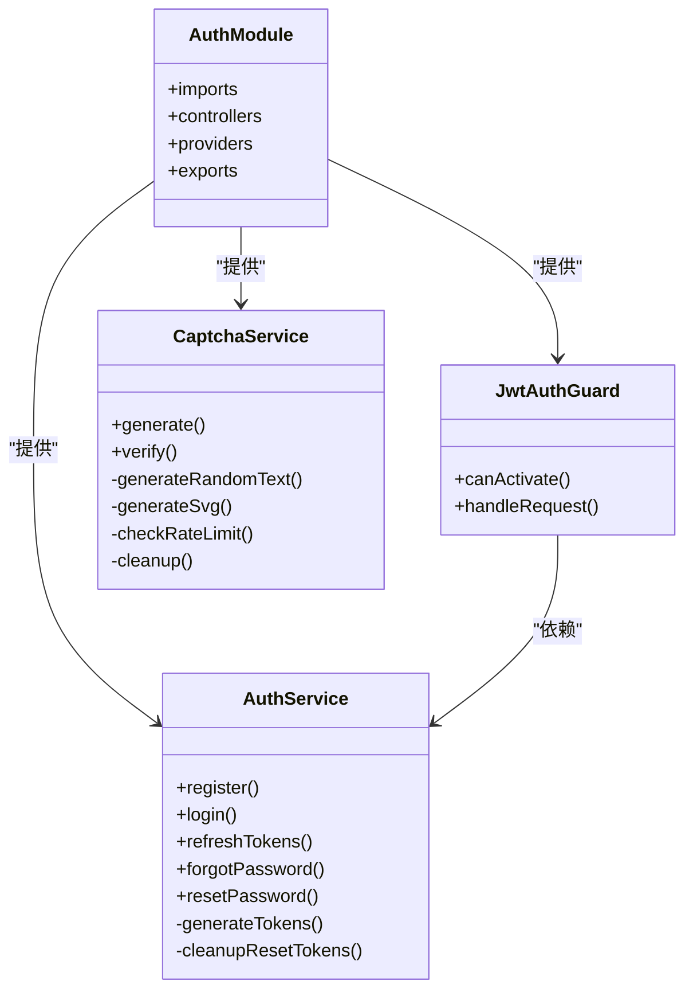
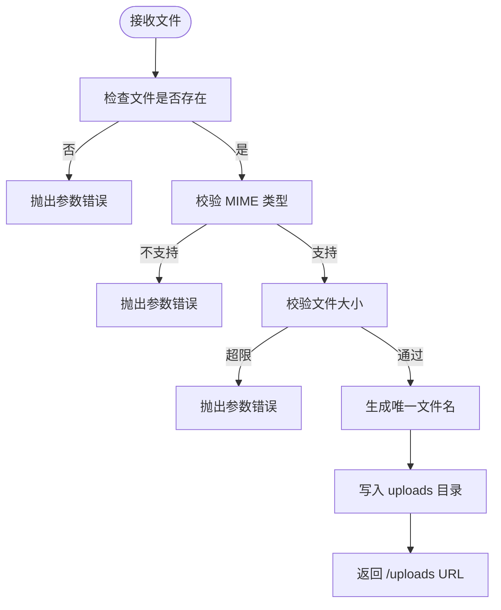
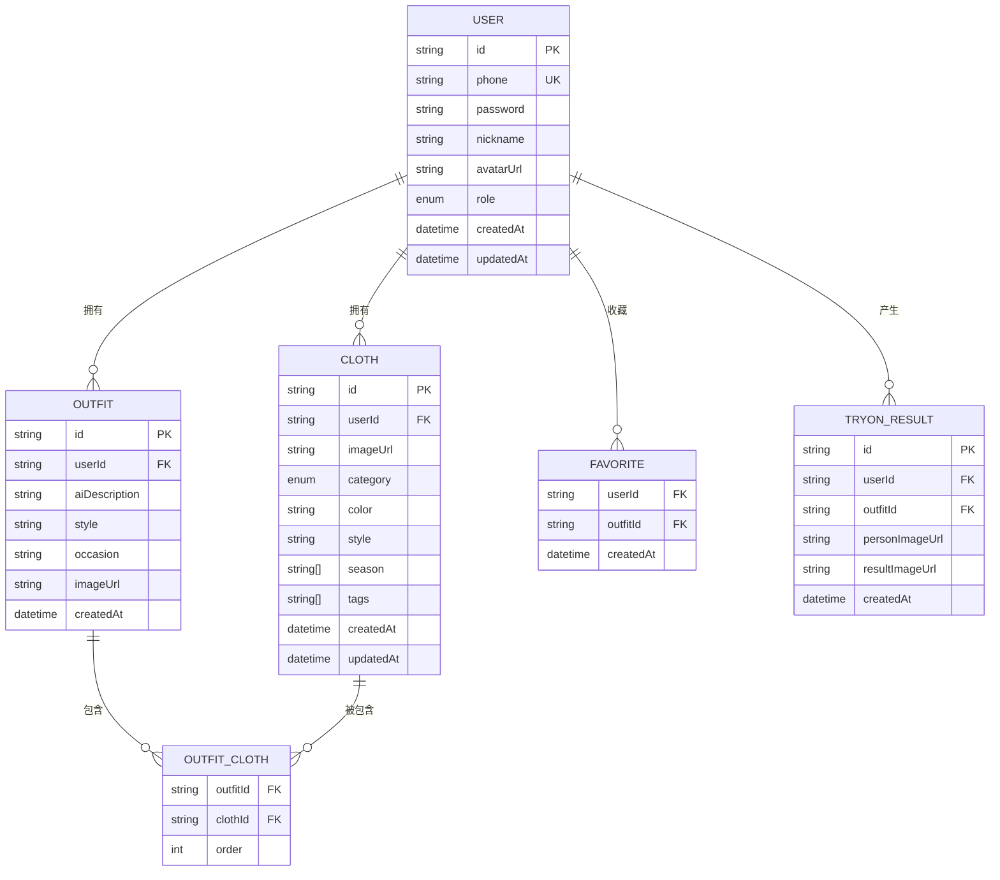
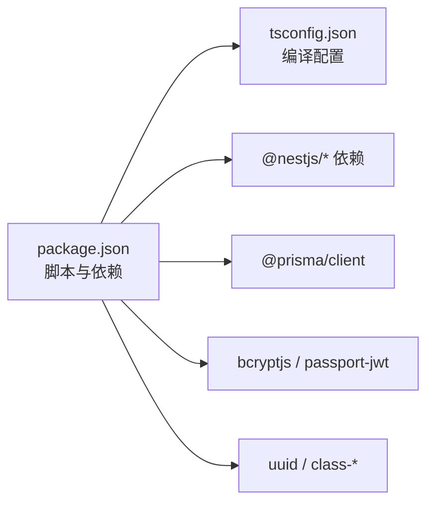

# 后端服务部署

<cite>
**本文引用的文件**
- [package.json](file://backend/package.json)
- [tsconfig.json](file://backend/tsconfig.json)
- [main.ts](file://backend/src/main.ts)
- [app.module.ts](file://backend/src/app.module.ts)
- [schema.prisma](file://backend/prisma/schema.prisma)
- [auth.module.ts](file://backend/src/modules/auth/auth.module.ts)
- [auth.service.ts](file://backend/src/modules/auth/auth.service.ts)
- [upload.module.ts](file://backend/src/modules/upload/upload.module.ts)
- [upload.service.ts](file://backend/src/modules/upload/upload.service.ts)
- [jwt-auth.guard.ts](file://backend/src/common/guards/jwt-auth.guard.ts)
- [captcha.service.ts](file://backend/src/modules/auth/captcha.service.ts)
</cite>

## 目录
1. [简介](#简介)
2. [项目结构](#项目结构)
3. [核心组件](#核心组件)
4. [架构总览](#架构总览)
5. [详细组件分析](#详细组件分析)
6. [依赖分析](#依赖分析)
7. [性能考虑](#性能考虑)
8. [故障排查指南](#故障排查指南)
9. [结论](#结论)
10. [附录](#附录)

## 简介
本指南面向生产环境部署畅搭（FreeDress）后端服务，基于 NestJS 构建，采用 TypeScript 编写，使用 Prisma 进行数据库访问，并通过 JWT 实现认证与权限控制。文档涵盖编译与构建流程、环境变量配置、进程管理、性能优化、健康检查与监控集成，以及自动化部署脚本与流程。

## 项目结构
后端位于 backend 目录，采用标准 NestJS 结构：
- src：源代码目录
  - app.module.ts：根模块，负责导入各业务模块与静态资源服务
  - main.ts：应用入口，初始化 Nest 应用、全局中间件与 Swagger 文档
  - modules：业务模块（auth、users、clothes、outfits、tryon、upload）
  - common：通用装饰器、守卫、拦截器、过滤器
  - prisma：Prisma 模块与服务
- prisma：数据库模型与迁移
- uploads：静态文件上传目录（通过 ServeStaticModule 对外提供 /uploads 访问）

**图表来源**
- [main.ts:1-62](file://backend/src/main.ts#L1-L62)
- [app.module.ts:1-33](file://backend/src/app.module.ts#L1-L33)

**章节来源**
- [main.ts:1-62](file://backend/src/main.ts#L1-L62)
- [app.module.ts:1-33](file://backend/src/app.module.ts#L1-L33)

## 核心组件
- 应用入口与启动：在 main.ts 中创建 Nest 应用工厂，配置全局管道、拦截器、过滤器、CORS、全局前缀与 Swagger 文档，并监听端口启动服务。
- 根模块：在 app.module.ts 中启用 ConfigModule 读取 .env，挂载 ServeStaticModule 提供 /uploads 静态资源访问，并导入各业务模块。
- 数据库：Prisma schema 定义了用户、衣物、搭配、收藏、AI试穿结果等模型，使用 PostgreSQL 作为数据源。
- 认证与安全：AuthModule 使用 JWT 与 Passport，JwtAuthGuard 保护受保护路由；AuthService 负责登录、注册、Token 生成与密码重置；CaptchaService 提供图片验证码与防刷策略。
- 文件上传：UploadModule/UploadService 将文件保存到本地 uploads 目录并通过 /uploads 访问。

**章节来源**
- [main.ts:12-59](file://backend/src/main.ts#L12-L59)
- [app.module.ts:14-30](file://backend/src/app.module.ts#L14-L30)
- [schema.prisma:1-132](file://backend/prisma/schema.prisma#L1-L132)
- [auth.module.ts:13-28](file://backend/src/modules/auth/auth.module.ts#L13-L28)
- [auth.service.ts:23-37](file://backend/src/modules/auth/auth.service.ts#L23-L37)
- [upload.service.ts:15-48](file://backend/src/modules/upload/upload.service.ts#L15-L48)

## 架构总览
下图展示了应用启动与模块装配的关键交互：

**图表来源**
- [main.ts:12-59](file://backend/src/main.ts#L12-L59)
- [app.module.ts:14-30](file://backend/src/app.module.ts#L14-L30)

## 详细组件分析

### 认证与安全组件
- AuthModule：注册 Passport 默认策略为 jwt，配置 JwtModule 的 secret 与过期时间，从环境变量读取。
- AuthService：实现注册、登录、Token 刷新、忘记密码与重置密码流程；使用 bcrypt 进行密码加密；维护内存中的重置令牌映射（生产建议使用 Redis）。
- JwtAuthGuard：继承 AuthGuard('jwt')，在验证失败时抛出未授权异常。
- CaptchaService：生成带噪声干扰的 SVG 验证码，内存存储答案与限流记录；支持验证码过期、最大尝试次数与 IP 限流。

**图表来源**
- [auth.module.ts:13-28](file://backend/src/modules/auth/auth.module.ts#L13-L28)
- [auth.service.ts:23-37](file://backend/src/modules/auth/auth.service.ts#L23-L37)
- [jwt-auth.guard.ts:8-21](file://backend/src/common/guards/jwt-auth.guard.ts#L8-L21)
- [captcha.service.ts:30-51](file://backend/src/modules/auth/captcha.service.ts#L30-L51)

**章节来源**
- [auth.module.ts:13-28](file://backend/src/modules/auth/auth.module.ts#L13-L28)
- [auth.service.ts:143-171](file://backend/src/modules/auth/auth.service.ts#L143-L171)
- [jwt-auth.guard.ts:8-21](file://backend/src/common/guards/jwt-auth.guard.ts#L8-L21)
- [captcha.service.ts:58-122](file://backend/src/modules/auth/captcha.service.ts#L58-L122)

### 文件上传组件
- UploadModule：声明控制器与服务。
- UploadService：校验 MIME 类型与大小，生成唯一文件名，写入 uploads 目录，并返回 /uploads 相对路径。

**图表来源**
- [upload.service.ts:25-47](file://backend/src/modules/upload/upload.service.ts#L25-L47)

**章节来源**
- [upload.module.ts:5-10](file://backend/src/modules/upload/upload.module.ts#L5-L10)
- [upload.service.ts:15-48](file://backend/src/modules/upload/upload.service.ts#L15-L48)

### 数据库模型与连接
- Prisma schema 定义用户、衣物、搭配、收藏、AI试穿结果等模型，使用 PostgreSQL 数据源，通过 DATABASE_URL 环境变量连接。
- 模型间建立外键与索引，确保查询效率与数据一致性。

**图表来源**
- [schema.prisma:14-131](file://backend/prisma/schema.prisma#L14-L131)

**章节来源**
- [schema.prisma:8-11](file://backend/prisma/schema.prisma#L8-L11)

## 依赖分析
- 构建与运行脚本：package.json 提供 build、start、start:prod 等脚本；tsconfig.json 定义编译目标、输出目录与路径别名。
- 运行时依赖：@nestjs/*、@prisma/client、bcryptjs、class-transformer、class-validator、passport、passport-jwt、uuid 等。
- 开发依赖：@nestjs/cli、jest、prisma、typescript 等。

**图表来源**
- [package.json:8-25](file://backend/package.json#L8-L25)
- [package.json:26-44](file://backend/package.json#L26-L44)
- [tsconfig.json:3-30](file://backend/tsconfig.json#L3-L30)

**章节来源**
- [package.json:8-25](file://backend/package.json#L8-L25)
- [package.json:26-44](file://backend/package.json#L26-L44)
- [tsconfig.json:3-30](file://backend/tsconfig.json#L3-L30)

## 性能考虑
- 编译与打包
  - 使用 Nest CLI 的 build 命令进行 TypeScript 编译，输出至 dist 目录；生产启动使用 node dist/main。
  - tsconfig.json 目标为 ES2021，启用增量编译与严格模式相关选项，便于生产构建优化。
- 内存与并发
  - 生产环境建议使用 PM2 或 systemd 管理多进程；根据 CPU 核数设置进程数，结合负载均衡与健康检查。
  - 上传服务默认使用本地磁盘，建议在容器化或分布式部署中替换为对象存储（如 S3），并开启 CDN。
- 安全与限流
  - JWT 密钥与刷新密钥应分别配置；验证码与登录接口建议配合 IP 限流与速率限制中间件。
  - 使用 HTTPS 与安全头，避免明文传输敏感信息。

[本节为通用指导，无需列出具体文件来源]

## 故障排查指南
- 启动失败
  - 检查端口占用与防火墙；确认 .env 中的 DATABASE_URL、JWT_SECRET、JWT_EXPIRES_IN 是否正确。
  - 查看应用日志输出，关注数据库连接、静态资源目录权限与 Prisma 客户端初始化。
- 认证问题
  - 确认 AuthModule 的 JwtModule secret 与 AuthService 的 generateTokens 使用的密钥一致。
  - 验证 JwtAuthGuard 是否正确应用于受保护路由。
- 上传失败
  - 检查 uploads 目录权限与磁盘空间；确认文件类型与大小限制。
- 数据库异常
  - 使用 Prisma CLI 执行迁移与种子脚本，确保数据库版本与 schema 一致。

**章节来源**
- [main.ts:50-58](file://backend/src/main.ts#L50-L58)
- [auth.module.ts:18-23](file://backend/src/modules/auth/auth.module.ts#L18-L23)
- [auth.service.ts:153-171](file://backend/src/modules/auth/auth.service.ts#L153-L171)
- [jwt-auth.guard.ts:14-20](file://backend/src/common/guards/jwt-auth.guard.ts#L14-L20)
- [upload.service.ts:25-47](file://backend/src/modules/upload/upload.service.ts#L25-L47)
- [schema.prisma:8-11](file://backend/prisma/schema.prisma#L8-L11)

## 结论
本部署指南提供了从编译构建、环境变量配置、进程管理、性能优化到健康检查与监控的完整方案。建议在生产环境中结合容器化与对象存储，强化安全与高可用能力，并通过自动化脚本实现持续交付。

[本节为总结性内容，无需列出具体文件来源]

## 附录

### A. 编译与构建流程
- 安装依赖
  - 在 backend 目录执行依赖安装命令。
- TypeScript 编译
  - 使用 Nest CLI 的 build 脚本生成 dist 输出。
- 生成 Prisma 客户端
  - 执行 Prisma 相关脚本以生成客户端与迁移。
- 生产启动
  - 使用 node dist/main 启动应用。

**章节来源**
- [package.json:8-25](file://backend/package.json#L8-L25)
- [tsconfig.json:10-13](file://backend/tsconfig.json#L10-L13)

### B. 环境变量配置清单
- 数据库连接
  - DATABASE_URL：PostgreSQL 连接字符串。
- JWT 配置
  - JWT_SECRET：用于签名访问令牌的密钥。
  - JWT_EXPIRES_IN：访问令牌过期时间（如 7d）。
  - JWT_REFRESH_SECRET：用于签名刷新令牌的密钥。
- 服务端口
  - PORT：HTTP 监听端口，默认 3000。
- 静态资源
  - uploads 目录由 ServeStaticModule 提供 /uploads 访问。

**章节来源**
- [schema.prisma:8-11](file://backend/prisma/schema.prisma#L8-L11)
- [auth.module.ts:19-22](file://backend/src/modules/auth/auth.module.ts#L19-L22)
- [auth.service.ts:156-165](file://backend/src/modules/auth/auth.service.ts#L156-L165)
- [main.ts:51-52](file://backend/src/main.ts#L51-L52)
- [app.module.ts:19-22](file://backend/src/app.module.ts#L19-L22)

### C. 进程管理配置
- PM2（推荐）
  - 使用 ecosystem.config.js 定义应用名称、脚本、环境变量、日志与进程数。
  - 启动：pm2 start ecosystem.config.js；守护进程：pm2 startup && pm2 save。
- systemd（Linux）
  - 编写 .service 文件，设置 WorkingDirectory、ExecStart、Restart 等。
  - 启用开机自启：systemctl enable freedress-backend；启动：systemctl start freedress-backend。

[本节为通用部署实践，无需列出具体文件来源]

### D. 健康检查与监控
- 健康检查端点
  - 建议在根路径或 /health 提供简单 GET 接口，返回服务状态与数据库连通性。
- 监控集成
  - 结合 Prometheus 与 Grafana，采集应用指标（请求量、错误率、响应时间、内存与 CPU）。
  - 使用 APM 工具（如 New Relic、DataDog）追踪链路与慢调用。

[本节为通用指导，无需列出具体文件来源]

### E. 自动化部署脚本与流程
- GitOps/CI 流水线建议步骤
  - 代码提交触发 CI：安装依赖、运行测试、构建应用、生成镜像、推送仓库。
  - CD：拉取镜像、重启容器或滚动更新、运行数据库迁移、健康检查。
- Docker 部署要点
  - 使用多阶段构建减少镜像体积；将 .env 通过环境注入；持久化 uploads 目录与数据库。
- Kubernetes 部署要点
  - 配置 Deployment、Service、ConfigMap、Secret、PersistentVolumeClaim。
  - 使用 readinessProbe 与 livenessProbe 集成健康检查。

[本节为通用指导，无需列出具体文件来源]