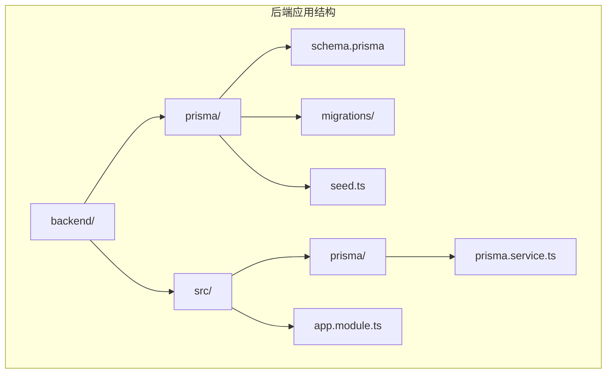
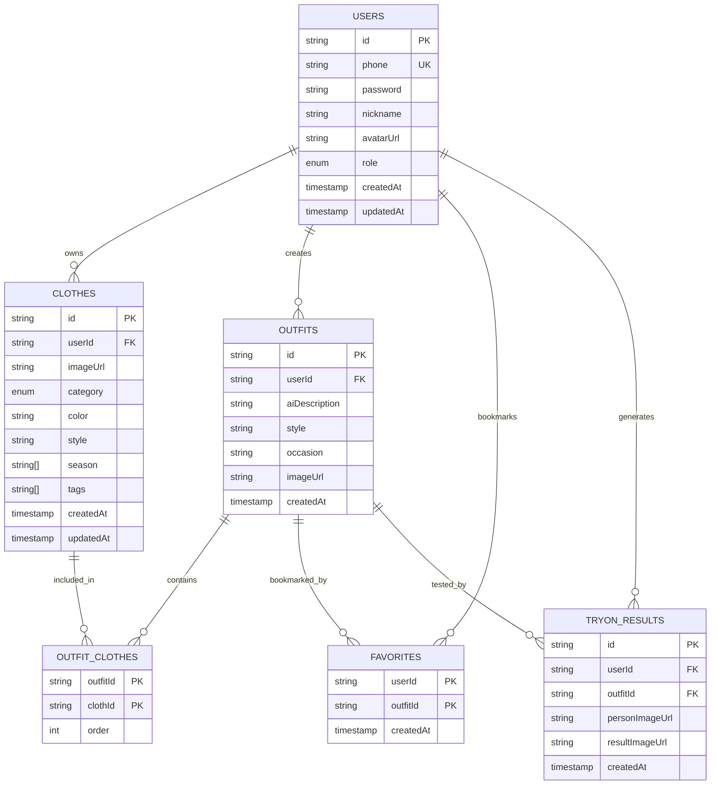
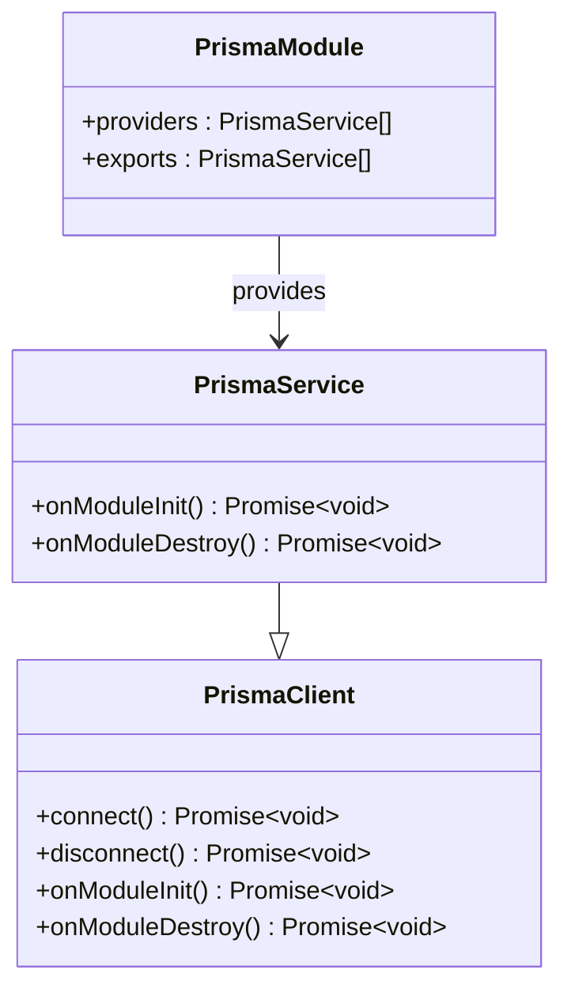
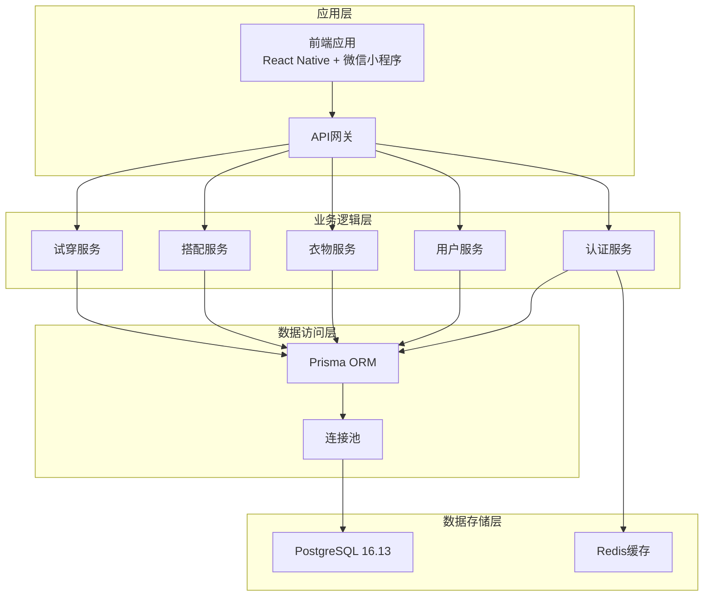
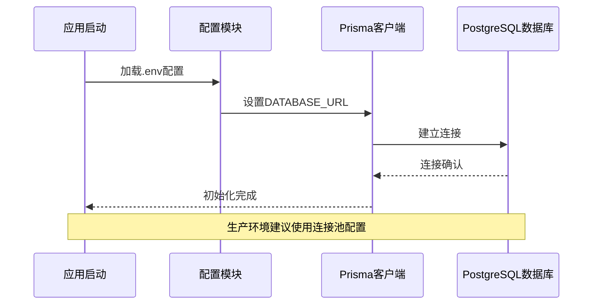
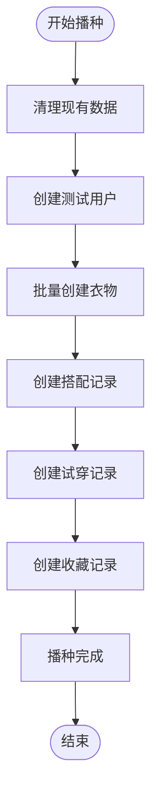
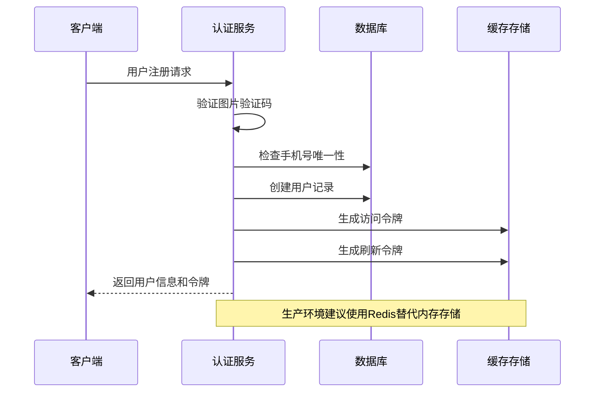
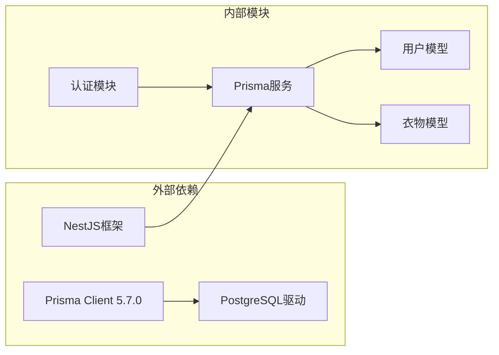
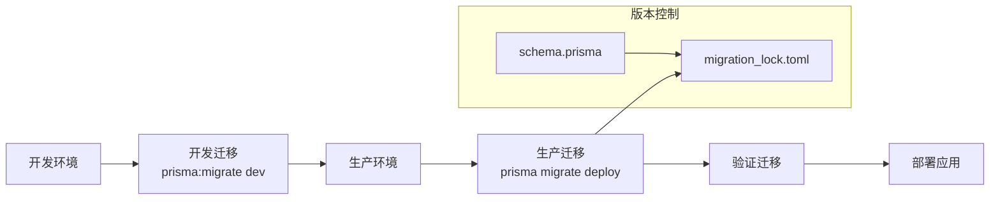
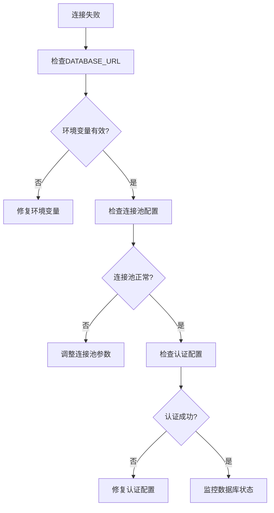

# 数据库生产配置

<cite>
**本文档引用的文件**
- [schema.prisma](file://backend/prisma/schema.prisma)
- [migration.sql](file://backend/prisma/migrations/20260507090458_init/migration.sql)
- [prisma.service.ts](file://backend/src/prisma/prisma.service.ts)
- [prisma.module.ts](file://backend/src/prisma/prisma.module.ts)
- [package.json](file://backend/package.json)
- [seed.ts](file://backend/prisma/seed.ts)
- [app.module.ts](file://backend/src/app.module.ts)
- [auth.service.ts](file://backend/src/modules/auth/auth.service.ts)
- [migration_lock.toml](file://backend/prisma/migrations/migration_lock.toml)
</cite>

## 目录
1. [简介](#简介)
2. [项目结构](#项目结构)
3. [核心组件](#核心组件)
4. [架构概览](#架构概览)
5. [详细组件分析](#详细组件分析)
6. [依赖关系分析](#依赖关系分析)
7. [性能考虑](#性能考虑)
8. [故障排除指南](#故障排除指南)
9. [结论](#结论)

## 简介

本指南为畅搭(FreeDress)数据库提供完整的生产环境配置方案。基于现有的Prisma ORM配置和NestJS架构，文档涵盖了PostgreSQL数据库的安装配置、连接池设置、性能参数调优、安全配置，以及Prisma在生产环境中的使用最佳实践。

畅搭是一个智能衣物搭配平台，采用现代化的技术栈：React Native移动端、微信小程序前端、NestJS后端服务和PostgreSQL数据库。系统设计支持高并发用户访问和大规模数据存储需求。

## 项目结构

畅搭项目的数据库相关文件主要集中在后端目录中，采用分层架构设计：



**图表来源**
- [schema.prisma:1-132](file://backend/prisma/schema.prisma#L1-L132)
- [prisma.service.ts:1-27](file://backend/src/prisma/prisma.service.ts#L1-L27)
- [app.module.ts:1-33](file://backend/src/app.module.ts#L1-L33)

**章节来源**
- [schema.prisma:1-132](file://backend/prisma/schema.prisma#L1-L132)
- [prisma.service.ts:1-27](file://backend/src/prisma/prisma.service.ts#L1-L27)
- [app.module.ts:1-33](file://backend/src/app.module.ts#L1-L33)

## 核心组件

### 数据库模型设计

系统采用关系型数据库设计，包含以下核心实体：



**图表来源**
- [schema.prisma:14-131](file://backend/prisma/schema.prisma#L14-L131)
- [migration.sql:7-121](file://backend/prisma/migrations/20260507090458_init/migration.sql#L7-L121)

### 连接管理组件

系统采用单例模式管理数据库连接，确保资源的有效利用和生命周期的正确管理：



**图表来源**
- [prisma.service.ts:8-26](file://backend/src/prisma/prisma.service.ts#L8-L26)
- [prisma.module.ts:1-14](file://backend/src/prisma/prisma.module.ts#L1-L14)

**章节来源**
- [schema.prisma:14-131](file://backend/prisma/schema.prisma#L14-L131)
- [prisma.service.ts:1-27](file://backend/src/prisma/prisma.service.ts#L1-L27)
- [prisma.module.ts:1-14](file://backend/src/prisma/prisma.module.ts#L1-L14)

## 架构概览

畅搭系统的数据库架构采用分层设计，确保高可用性和可扩展性：



**图表来源**
- [app.module.ts:13-30](file://backend/src/app.module.ts#L13-L30)
- [auth.service.ts:24-37](file://backend/src/modules/auth/auth.service.ts#L24-L37)

## 详细组件分析

### 数据库连接配置

系统通过环境变量管理数据库连接，采用Prisma的动态配置机制：



**图表来源**
- [schema.prisma:8-11](file://backend/prisma/schema.prisma#L8-L11)
- [app.module.ts:15-18](file://backend/src/app.module.ts#L15-L18)

### 种子数据管理

系统提供完整的种子数据加载机制，用于开发和测试环境的数据准备：



**图表来源**
- [seed.ts:6-171](file://backend/prisma/seed.ts#L6-L171)

**章节来源**
- [seed.ts:1-182](file://backend/prisma/seed.ts#L1-L182)

### 认证与会话管理

系统采用JWT令牌进行用户认证，结合内存存储管理重置令牌：



**图表来源**
- [auth.service.ts:44-95](file://backend/src/modules/auth/auth.service.ts#L44-L95)

**章节来源**
- [auth.service.ts:1-279](file://backend/src/modules/auth/auth.service.ts#L1-L279)

## 依赖关系分析

### 数据库依赖图



**图表来源**
- [package.json:26-44](file://backend/package.json#L26-L44)
- [prisma.service.ts:1-27](file://backend/src/prisma/prisma.service.ts#L1-L27)

### 迁移管理流程



**图表来源**
- [package.json:21-24](file://backend/package.json#L21-L24)
- [migration_lock.toml:1-3](file://backend/prisma/migrations/migration_lock.toml#L1-L3)

**章节来源**
- [package.json:1-91](file://backend/package.json#L1-L91)
- [migration_lock.toml:1-3](file://backend/prisma/migrations/migration_lock.toml#L1-L3)

## 性能考虑

### 连接池配置建议

针对生产环境，建议配置以下连接池参数：

| 参数 | 建议值 | 说明 |
|------|--------|------|
| connectionLimit | 25-50 | 根据CPU核心数和内存配置 |
| queueLimit | 300 | 防止请求积压 |
| acquireTimeout | 60000 | 连接获取超时时间 |
| timeout | 120000 | 查询超时时间 |
| idleTimeout | 300000 | 连接空闲超时 |
| maxUses | 10000 | 连接复用次数 |

### 索引优化策略

根据业务查询模式，建议创建以下复合索引：

```sql
-- 用户相关查询优化
CREATE INDEX idx_users_phone_role ON users(phone, role);
CREATE INDEX idx_users_created_at ON users(created_at);

-- 衣物查询优化
CREATE INDEX idx_clothes_user_category ON clothes(userId, category);
CREATE INDEX idx_clothes_user_season ON clothes(userId, season);
CREATE INDEX idx_clothes_tags ON clothes(tags);

-- 搭配查询优化
CREATE INDEX idx_outfits_user_style ON outfits(userId, style);
CREATE INDEX idx_outfits_created_at ON outfits(created_at);

-- 关联表优化
CREATE INDEX idx_outfit_clothes_order ON outfit_clothes(order);
```

### 查询性能优化

1. **分页查询**：使用LIMIT和OFFSET实现高效分页
2. **批量操作**：使用事务处理批量数据插入
3. **缓存策略**：对热点数据使用Redis缓存
4. **异步处理**：耗时操作使用队列异步执行

## 故障排除指南

### 常见连接问题



### 数据库监控指标

建议监控以下关键指标：

- **连接数**：活跃连接、空闲连接、最大连接数
- **查询性能**：慢查询数量、平均响应时间
- **锁等待**：锁等待时间、死锁次数
- **磁盘空间**：表大小、索引大小、可用空间
- **缓冲区命中率**：共享缓冲区命中率

**章节来源**
- [prisma.service.ts:14-25](file://backend/src/prisma/prisma.service.ts#L14-L25)

## 结论

畅搭数据库生产配置方案提供了完整的技术实现路径。通过合理的数据库设计、连接管理和性能优化，可以确保系统在高并发场景下的稳定运行。

关键实施要点：
1. 采用Prisma ORM简化数据库操作
2. 实施连接池配置优化数据库连接
3. 建立完善的种子数据管理机制
4. 设计合理的索引策略提升查询性能
5. 建立监控告警体系保障系统稳定

建议在正式部署前进行全面的压力测试和性能调优，确保系统满足生产环境的可靠性要求。