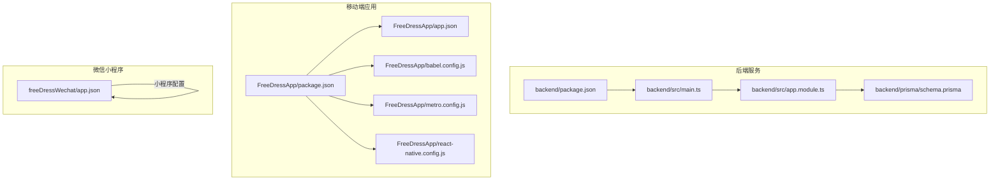
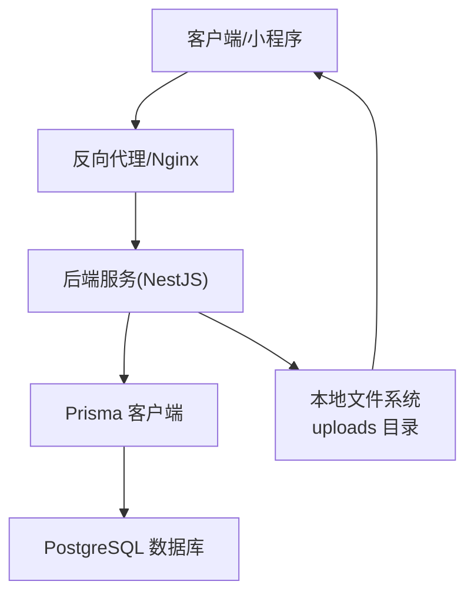
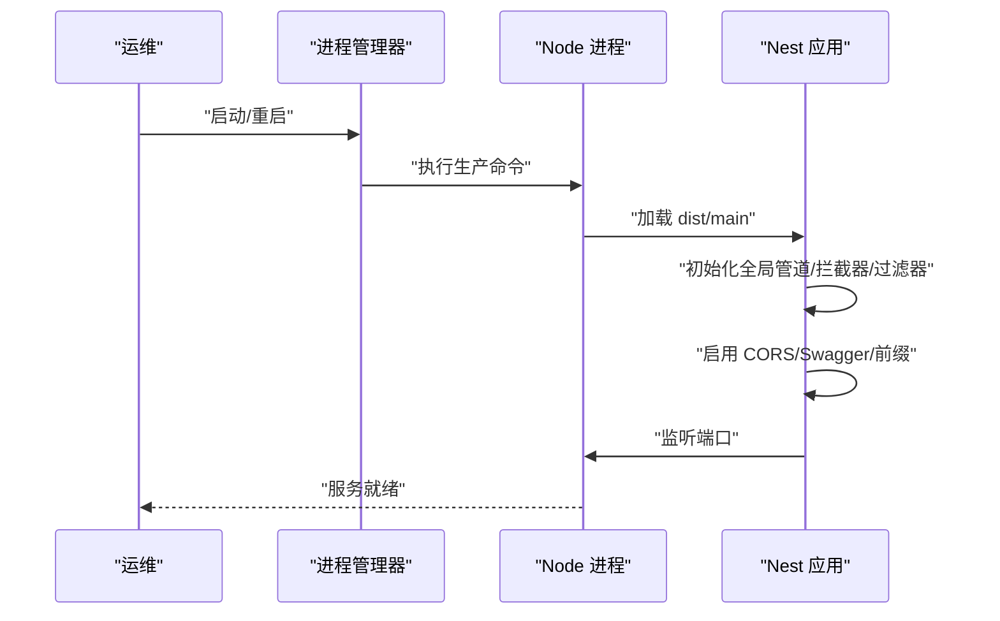
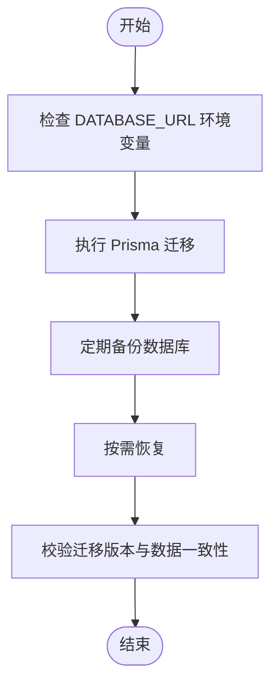
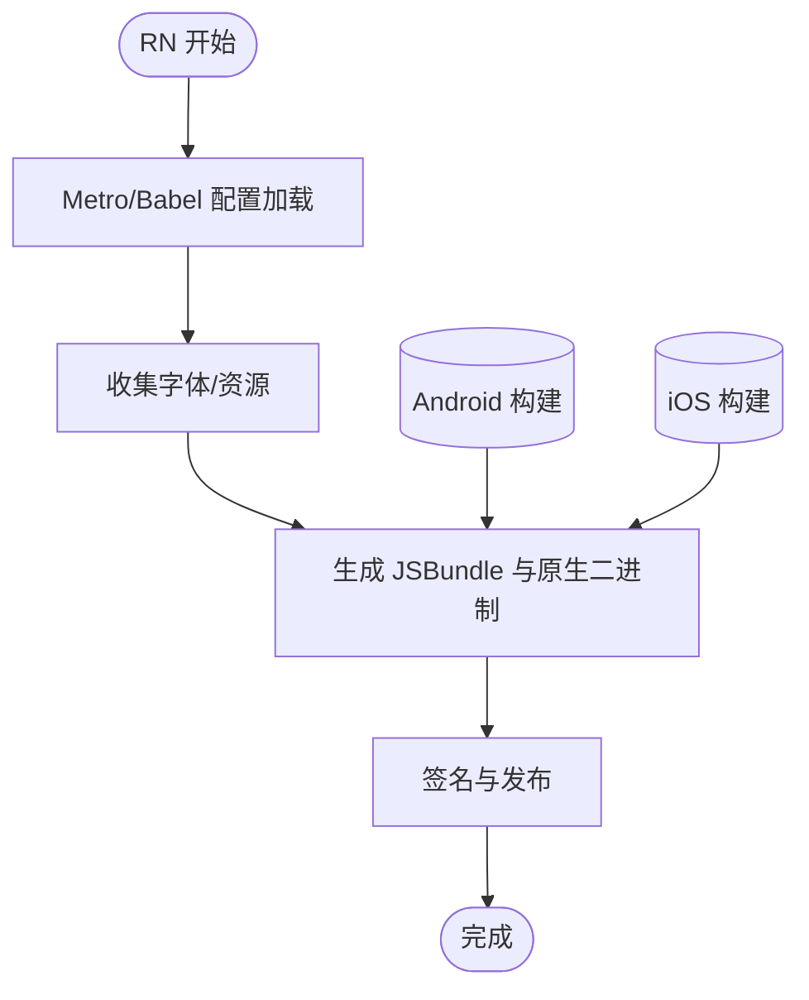
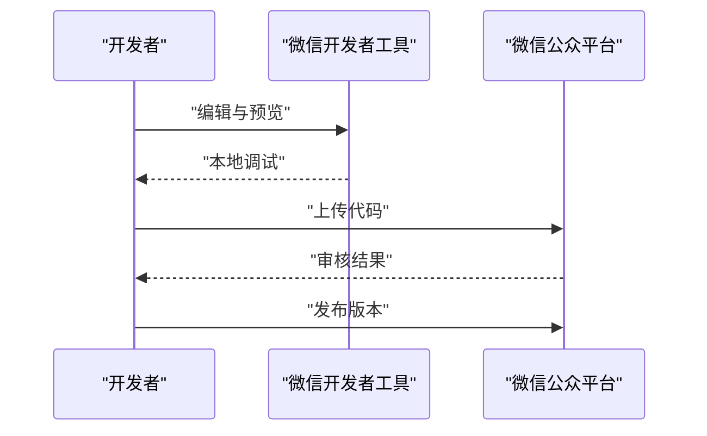
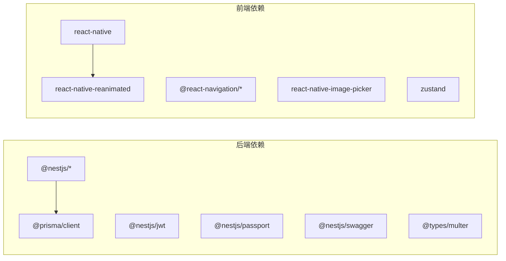

# 生产环境部署

<cite>
**本文引用的文件**
- [backend/package.json](file://backend/package.json)
- [backend/src/main.ts](file://backend/src/main.ts)
- [backend/src/app.module.ts](file://backend/src/app.module.ts)
- [backend/src/modules/auth/auth.module.ts](file://backend/src/modules/auth/auth.module.ts)
- [backend/prisma/schema.prisma](file://backend/prisma/schema.prisma)
- [FreeDressApp/package.json](file://FreeDressApp/package.json)
- [FreeDressApp/app.json](file://FreeDressApp/app.json)
- [FreeDressApp/babel.config.js](file://FreeDressApp/babel.config.js)
- [FreeDressApp/metro.config.js](file://FreeDressApp/metro.config.js)
- [FreeDressApp/react-native.config.js](file://FreeDressApp/react-native.config.js)
- [freeDressWechat/app.json](file://freeDressWechat/app.json)
</cite>

## 目录
1. [简介](#简介)
2. [项目结构](#项目结构)
3. [核心组件](#核心组件)
4. [架构总览](#架构总览)
5. [详细组件分析](#详细组件分析)
6. [依赖分析](#依赖分析)
7. [性能考虑](#性能考虑)
8. [故障排查指南](#故障排查指南)
9. [结论](#结论)
10. [附录](#附录)

## 简介
本指南面向运维与开发团队，提供畅搭(FreeDress)项目的生产环境部署与维护全链路方案。内容覆盖后端(NestJS)与前端(React Native、微信小程序)的构建、打包、签名与发布；容器化(Docker)与云平台(AWS、阿里云)部署要点；负载均衡与反向代理配置；SSL证书与域名绑定；以及数据库生产级备份与恢复策略。文档以仓库现有实现为依据，避免臆造信息。

## 项目结构
- 后端采用 NestJS 框架，使用 Prisma 连接 PostgreSQL 数据库，提供 REST API 与 Swagger 文档。
- 前端包含 React Native 移动应用与微信小程序两套产物，分别独立构建与发布。
- 项目根目录提供通用忽略规则与状态说明文件。

**图表来源**
- [backend/src/main.ts:1-62](file://backend/src/main.ts#L1-L62)
- [backend/src/app.module.ts:1-33](file://backend/src/app.module.ts#L1-L33)
- [backend/prisma/schema.prisma:1-132](file://backend/prisma/schema.prisma#L1-L132)
- [FreeDressApp/package.json:1-57](file://FreeDressApp/package.json#L1-L57)
- [FreeDressApp/app.json:1-5](file://FreeDressApp/app.json#L1-L5)
- [FreeDressApp/babel.config.js:1-4](file://FreeDressApp/babel.config.js#L1-L4)
- [FreeDressApp/metro.config.js:1-12](file://FreeDressApp/metro.config.js#L1-L12)
- [FreeDressApp/react-native.config.js:1-3](file://FreeDressApp/react-native.config.js#L1-L3)
- [freeDressWechat/app.json](file://freeDressWechat/app.json)

**章节来源**
- [backend/src/main.ts:1-62](file://backend/src/main.ts#L1-L62)
- [backend/src/app.module.ts:1-33](file://backend/src/app.module.ts#L1-L33)
- [backend/prisma/schema.prisma:1-132](file://backend/prisma/schema.prisma#L1-L132)
- [FreeDressApp/package.json:1-57](file://FreeDressApp/package.json#L1-L57)
- [FreeDressApp/app.json:1-5](file://FreeDressApp/app.json#L1-L5)
- [FreeDressApp/babel.config.js:1-4](file://FreeDressApp/babel.config.js#L1-L4)
- [FreeDressApp/metro.config.js:1-12](file://FreeDressApp/metro.config.js#L1-L12)
- [FreeDressApp/react-native.config.js:1-3](file://FreeDressApp/react-native.config.js#L1-L3)
- [freeDressWechat/app.json](file://freeDressWechat/app.json)

## 核心组件
- 后端入口与全局配置：应用启动、CORS、全局管道/拦截器/过滤器、Swagger 文档、统一前缀与端口。
- 模块化架构：Config、ServeStatic、Prisma、认证、用户、衣物、搭配、上传、AI 试穿等模块。
- 数据层：PostgreSQL 数据源通过 Prisma 定义，支持迁移与种子数据脚本。
- 前端构建：React Native 使用 Metro 打包，Babel 转换与 Reanimated 插件；小程序通过项目配置文件管理。

**章节来源**
- [backend/src/main.ts:12-59](file://backend/src/main.ts#L12-L59)
- [backend/src/app.module.ts:14-30](file://backend/src/app.module.ts#L14-L30)
- [backend/prisma/schema.prisma:8-11](file://backend/prisma/schema.prisma#L8-L11)
- [FreeDressApp/metro.config.js:1-12](file://FreeDressApp/metro.config.js#L1-L12)
- [FreeDressApp/babel.config.js:1-4](file://FreeDressApp/babel.config.js#L1-L4)

## 架构总览
下图展示生产部署的关键交互：客户端/小程序通过反向代理访问后端 API；静态资源由后端 ServeStatic 提供；数据库通过 Prisma 连接；上传文件存储于 uploads 目录。

**图表来源**
- [backend/src/main.ts:31-38](file://backend/src/main.ts#L31-L38)
- [backend/src/app.module.ts:19-22](file://backend/src/app.module.ts#L19-L22)
- [backend/prisma/schema.prisma:8-11](file://backend/prisma/schema.prisma#L8-L11)

## 详细组件分析

### 后端服务生产部署
- 编译与运行
  - 构建：使用后端脚本进行编译，生成 dist 目录产物。
  - 运行：生产模式启动 dist/main，监听环境端口或默认端口。
- 环境变量
  - JWT 密钥与过期时间在认证模块中读取。
  - 数据库连接字符串通过 Prisma 的 datasource 环境变量注入。
  - 全局前缀为 api，Swagger 文档路径为 api/docs。
- 进程管理
  - 建议使用 systemd 或 PM2 等进程守护工具，确保崩溃重启与日志聚合。
- 静态资源
  - uploads 目录通过 ServeStatic 挂载至 /uploads，需保证目录存在与权限正确。

**图表来源**
- [backend/package.json:8-24](file://backend/package.json#L8-L24)
- [backend/src/main.ts:12-59](file://backend/src/main.ts#L12-L59)
- [backend/src/app.module.ts:19-22](file://backend/src/app.module.ts#L19-L22)

**章节来源**
- [backend/package.json:8-24](file://backend/package.json#L8-L24)
- [backend/src/main.ts:12-59](file://backend/src/main.ts#L12-L59)
- [backend/src/app.module.ts:14-22](file://backend/src/app.module.ts#L14-L22)
- [backend/src/modules/auth/auth.module.ts:18-23](file://backend/src/modules/auth/auth.module.ts#L18-L23)

### 数据库生产策略
- 连接与迁移
  - 数据源为 PostgreSQL，连接字符串来自环境变量。
  - 使用 Prisma 迁移与生成客户端，建议在 CI 中执行迁移。
- 备份与恢复
  - 建议使用数据库厂商提供的备份工具定期导出快照。
  - 恢复时先停止写入，导入后执行 Prisma 迁移以确保模式一致。
- 性能与监控
  - 配置连接池大小与超时参数，监控慢查询与连接数峰值。

**图表来源**
- [backend/prisma/schema.prisma:8-11](file://backend/prisma/schema.prisma#L8-L11)
- [backend/package.json:21-24](file://backend/package.json#L21-L24)

**章节来源**
- [backend/prisma/schema.prisma:8-11](file://backend/prisma/schema.prisma#L8-L11)
- [backend/package.json:21-24](file://backend/package.json#L21-L24)

### 前端应用构建与发布

#### React Native 应用
- 构建与打包
  - 使用 Metro 默认配置进行打包，Babel 预设与 Reanimated 插件已启用。
  - 项目引擎要求 Node 版本满足需求。
- 签名与发布
  - Android：在 Gradle 中配置签名密钥与混淆规则，使用 release 构建变体。
  - iOS：在 Xcode 中配置签名与描述文件，使用 Archive 导出 IPA。
- 资源与字体
  - react-native.config.js 声明了自定义字体资源目录，需确保打包时包含。

**图表来源**
- [FreeDressApp/metro.config.js:1-12](file://FreeDressApp/metro.config.js#L1-L12)
- [FreeDressApp/babel.config.js:1-4](file://FreeDressApp/babel.config.js#L1-L4)
- [FreeDressApp/react-native.config.js:1-3](file://FreeDressApp/react-native.config.js#L1-L3)
- [FreeDressApp/package.json:53-55](file://FreeDressApp/package.json#L53-L55)

**章节来源**
- [FreeDressApp/metro.config.js:1-12](file://FreeDressApp/metro.config.js#L1-L12)
- [FreeDressApp/babel.config.js:1-4](file://FreeDressApp/babel.config.js#L1-L4)
- [FreeDressApp/react-native.config.js:1-3](file://FreeDressApp/react-native.config.js#L1-L3)
- [FreeDressApp/package.json:53-55](file://FreeDressApp/package.json#L53-L55)

#### 微信小程序
- 配置与构建
  - 通过项目配置文件管理页面路由、窗口样式与分包等。
  - 使用开发者工具进行预览与上传。
- 发布流程
  - 在微信公众平台提交审核，审核通过后发布。

**图表来源**
- [freeDressWechat/app.json](file://freeDressWechat/app.json)

**章节来源**
- [freeDressWechat/app.json](file://freeDressWechat/app.json)

### Docker 容器化部署
- 建议策略
  - 使用多阶段构建：基础镜像安装依赖，构建产物仅复制到精简运行镜像。
  - 将 .env 文件挂载为只读卷，避免硬编码敏感信息。
  - 暴露后端监听端口，映射到宿主机端口。
  - 将 uploads 目录挂载为持久卷，确保静态资源与上传文件持久化。
- 运行示例
  - 使用 docker run 或 docker-compose 启动容器，设置环境变量与卷挂载。
  - 结合反向代理与健康检查，实现高可用部署。

[本节为通用实践指导，不直接分析具体文件，故无“章节来源”]

### 云服务部署选项
- AWS
  - 使用 EC2/ECS/Fargate 托管后端服务；RDS 托管 PostgreSQL；S3 存储静态资源。
  - 使用 ALB/NLB 作为负载均衡器，结合 WAF 与安全组。
- 阿里云
  - 使用 ECS/K8s 托管服务；RDS 托管数据库；OSS 存储静态资源。
  - 使用 SLB/NLB 与 WAF，结合安全组与访问控制。
- 通用步骤
  - 准备镜像与配置；创建数据库实例并初始化；配置域名与 SSL；部署并灰度发布；监控与告警。

[本节为通用实践指导，不直接分析具体文件，故无“章节来源”]

### 负载均衡与反向代理
- 反向代理作用
  - 统一入口、SSL 终止、静态资源缓存、健康检查与故障转移。
- Nginx 示例要点
  - 将 /api 前缀转发至后端服务；将 /uploads 映射到后端静态资源。
  - 配置超时、缓冲区与压缩；开启 HTTPS 并配置证书。
- 负载均衡
  - 多实例部署后端，结合健康检查与自动扩缩容策略。

[本节为通用实践指导，不直接分析具体文件，故无“章节来源”]

### SSL 证书与域名绑定
- 证书来源
  - 使用 Let’s Encrypt 或云厂商托管证书；确保域名解析指向负载均衡器。
- 配置要点
  - 反向代理启用 HTTPS；重定向 HTTP 至 HTTPS；配置安全头与 HSTS。
  - 证书续期自动化，监控到期时间。

[本节为通用实践指导，不直接分析具体文件，故无“章节来源”]

## 依赖分析
- 后端依赖
  - NestJS 核心、配置、JWT、Passport、Swagger、Prisma 客户端、Multer 类型等。
  - 测试与开发工具链，包括 ESLint、Jest、TypeScript。
- 前端依赖
  - React Native、导航、图片选择、Reanimated、Zustand 状态管理等。
  - 开发工具链与类型声明。

**图表来源**
- [backend/package.json:26-44](file://backend/package.json#L26-L44)
- [FreeDressApp/package.json:12-31](file://FreeDressApp/package.json#L12-L31)

**章节来源**
- [backend/package.json:26-72](file://backend/package.json#L26-L72)
- [FreeDressApp/package.json:12-52](file://FreeDressApp/package.json#L12-L52)

## 性能考虑
- 后端
  - 启用生产日志级别，避免调试输出；合理设置请求体大小限制与超时。
  - 使用连接池与索引优化数据库查询；对静态资源启用缓存与压缩。
- 前端
  - 图片懒加载与尺寸适配；减少不必要的重渲染；使用原生模块提升性能。
- 基础设施
  - CDN 加速静态资源；数据库只读副本与读写分离；缓存层（Redis）降低数据库压力。

[本节为通用实践指导，不直接分析具体文件，故无“章节来源”]

## 故障排查指南
- 启动失败
  - 检查端口占用与防火墙；确认 DATABASE_URL 是否正确；查看进程日志。
- 认证问题
  - 核对 JWT_SECRET 与过期时间；确认客户端携带正确的 Bearer Token。
- 静态资源 404
  - 确认 uploads 目录存在且权限正确；检查 ServeStatic 挂载路径。
- 数据库异常
  - 查看迁移是否成功；核对连接字符串与网络连通性；检查慢查询与锁等待。

**章节来源**
- [backend/src/main.ts:31-38](file://backend/src/main.ts#L31-L38)
- [backend/src/app.module.ts:19-22](file://backend/src/app.module.ts#L19-L22)
- [backend/src/modules/auth/auth.module.ts:18-23](file://backend/src/modules/auth/auth.module.ts#L18-L23)
- [backend/prisma/schema.prisma:8-11](file://backend/prisma/schema.prisma#L8-L11)

## 结论
本指南基于仓库现有实现，给出了后端与前端的生产部署要点、容器化与云平台实践、负载均衡与 SSL 配置、数据库备份恢复策略。建议在正式上线前完成环境隔离、自动化测试与发布流水线，并建立完善的监控与应急响应机制。

## 附录
- 快速检查清单
  - 环境变量齐全（DATABASE_URL、JWT_SECRET、端口等）
  - 数据库迁移成功
  - 上传目录权限与持久化
  - 反向代理与 SSL 正常
  - 前端签名与发布配置完成
  - 备份策略与演练计划

[本节为通用实践指导，不直接分析具体文件，故无“章节来源”]