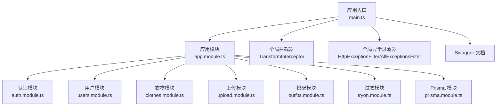
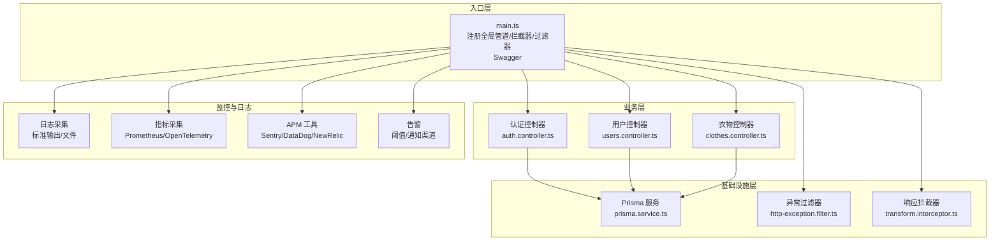
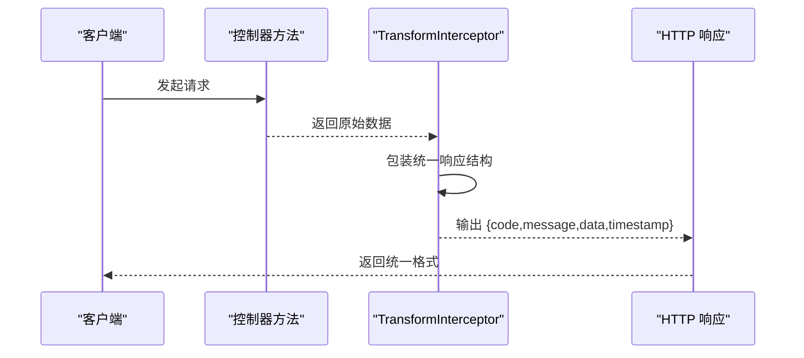
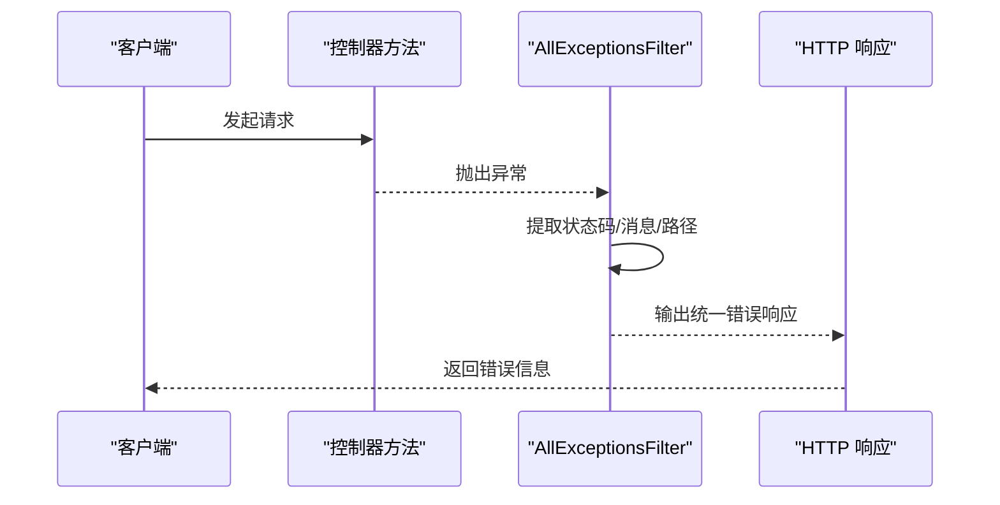
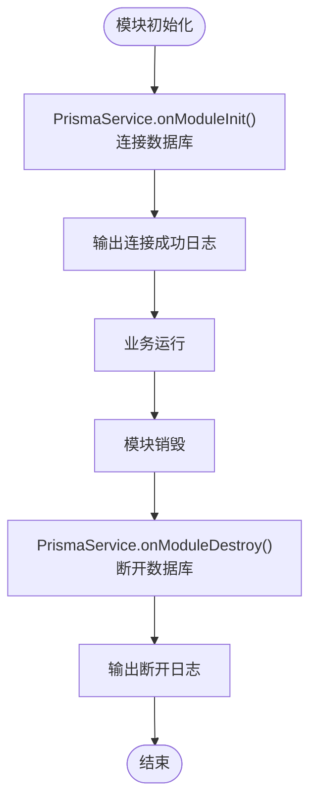
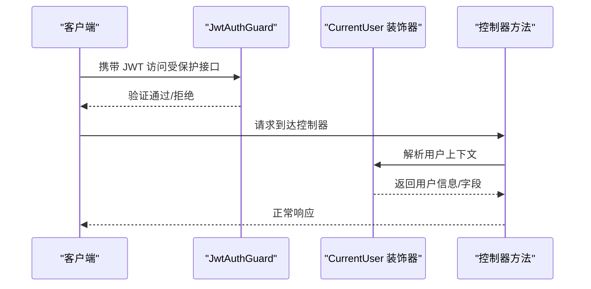
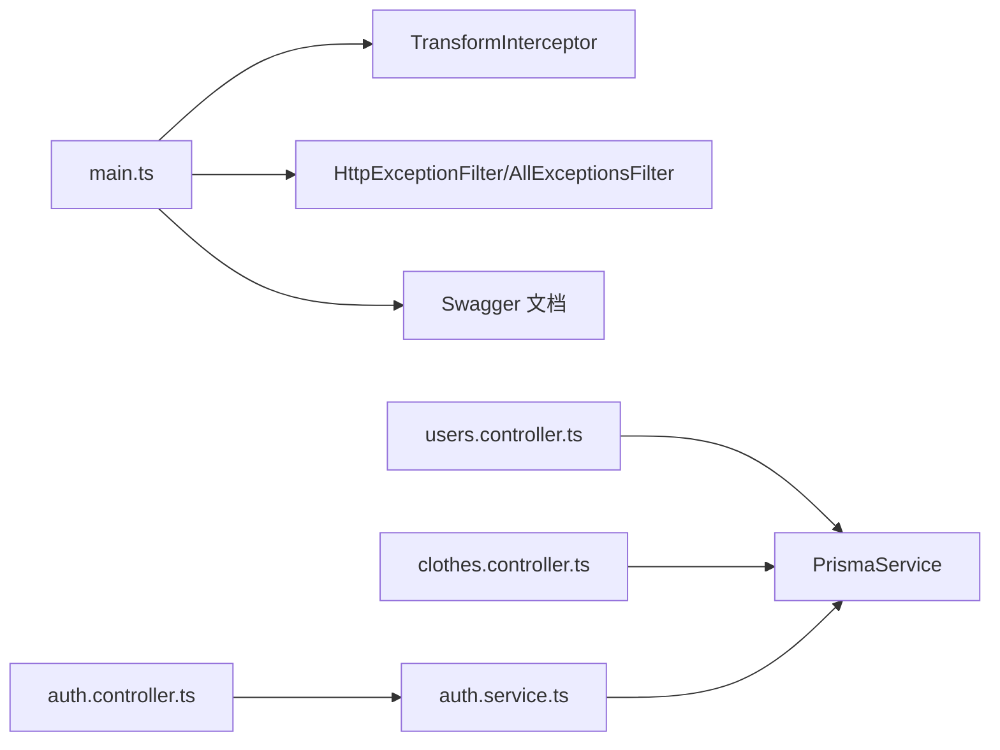
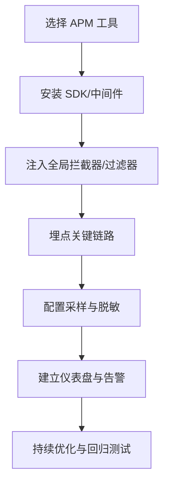

# 监控与日志

<cite>
**本文引用的文件**
- [main.ts](file://backend/src/main.ts)
- [app.module.ts](file://backend/src/app.module.ts)
- [http-exception.filter.ts](file://backend/src/common/filters/http-exception.filter.ts)
- [transform.interceptor.ts](file://backend/src/common/interceptors/transform.interceptor.ts)
- [prisma.service.ts](file://backend/src/prisma/prisma.service.ts)
- [jwt-auth.guard.ts](file://backend/src/common/guards/jwt-auth.guard.ts)
- [current-user.decorator.ts](file://backend/src/common/decorators/current-user.decorator.ts)
- [auth.controller.ts](file://backend/src/modules/auth/auth.controller.ts)
- [auth.service.ts](file://backend/src/modules/auth/auth.service.ts)
- [users.controller.ts](file://backend/src/modules/users/users.controller.ts)
- [clothes.controller.ts](file://backend/src/modules/clothes/clothes.controller.ts)
- [package.json](file://backend/package.json)
</cite>

## 目录
1. [简介](#简介)
2. [项目结构](#项目结构)
3. [核心组件](#核心组件)
4. [架构总览](#架构总览)
5. [详细组件分析](#详细组件分析)
6. [依赖关系分析](#依赖关系分析)
7. [性能考虑](#性能考虑)
8. [故障排查指南](#故障排查指南)
9. [结论](#结论)
10. [附录](#附录)

## 简介
本指南面向运维与开发团队，围绕畅搭(FreeDress)项目的监控与日志体系提供从零到一的配置与实施建议。内容覆盖应用性能监控(APM)集成、日志收集与分析、错误追踪与异常监控、健康检查端点、告警机制、性能与资源使用跟踪，以及日志聚合与分析工具的集成路径。文档基于现有代码结构与最佳实践，帮助快速搭建稳定可靠的监控体系。

## 项目结构
后端采用 NestJS 架构，核心入口位于 main.ts，全局管道、拦截器与过滤器在此统一注册；模块化设计将认证、用户、衣物、搭配等功能拆分至独立模块；Prisma 作为 ORM 连接数据库；Swagger 提供 API 文档。

图表来源
- [main.ts:12-59](file://backend/src/main.ts#L12-L59)
- [app.module.ts:13-31](file://backend/src/app.module.ts#L13-L31)

章节来源
- [main.ts:12-59](file://backend/src/main.ts#L12-L59)
- [app.module.ts:13-31](file://backend/src/app.module.ts#L13-L31)

## 核心组件
- 全局响应拦截器：统一 API 响应格式，便于日志与监控标准化输出。
- 全局异常过滤器：捕获 HTTP 异常与未处理异常，统一错误响应与日志记录。
- 数据库连接服务：Prisma 生命周期钩子，便于监控数据库连接状态。
- 认证守卫与用户装饰器：统一鉴权入口，便于审计与异常定位。
- Swagger 文档：自动生成 API 文档，辅助健康检查与接口可用性监控。

章节来源
- [transform.interceptor.ts:19-31](file://backend/src/common/interceptors/transform.interceptor.ts#L19-L31)
- [http-exception.filter.ts:8-81](file://backend/src/common/filters/http-exception.filter.ts#L8-L81)
- [prisma.service.ts:8-26](file://backend/src/prisma/prisma.service.ts#L8-L26)
- [jwt-auth.guard.ts:8-22](file://backend/src/common/guards/jwt-auth.guard.ts#L8-L22)
- [current-user.decorator.ts:7-16](file://backend/src/common/decorators/current-user.decorator.ts#L7-L16)

## 架构总览
下图展示监控与日志在系统中的位置与交互关系：入口层负责注册全局组件；业务模块承载具体功能；ORM 层负责数据持久化；外部监控与日志系统通过标准协议对接。

图表来源
- [main.ts:12-59](file://backend/src/main.ts#L12-L59)
- [auth.controller.ts:16-92](file://backend/src/modules/auth/auth.controller.ts#L16-L92)
- [users.controller.ts:12-49](file://backend/src/modules/users/users.controller.ts#L12-L49)
- [clothes.controller.ts:24-102](file://backend/src/modules/clothes/clothes.controller.ts#L24-L102)
- [prisma.service.ts:8-26](file://backend/src/prisma/prisma.service.ts#L8-L26)
- [http-exception.filter.ts:8-81](file://backend/src/common/filters/http-exception.filter.ts#L8-L81)
- [transform.interceptor.ts:19-31](file://backend/src/common/interceptors/transform.interceptor.ts#L19-L31)

## 详细组件分析

### 全局响应拦截器（TransformInterceptor）
- 作用：统一包装响应体，包含状态码、消息、数据与时间戳，便于前端与监控系统解析。
- 影响范围：所有控制器返回的数据都会经过此拦截器，确保日志与指标的一致性。
- 性能影响：轻量级映射操作，对吞吐影响可忽略。

图表来源
- [transform.interceptor.ts:19-31](file://backend/src/common/interceptors/transform.interceptor.ts#L19-L31)

章节来源
- [transform.interceptor.ts:19-31](file://backend/src/common/interceptors/transform.interceptor.ts#L19-L31)

### 全局异常过滤器（HttpExceptionFilter / AllExceptionsFilter）
- 作用：捕获 HTTP 异常与未处理异常，统一输出结构化错误响应，并在开发环境打印堆栈便于调试。
- 日志价值：错误响应包含时间戳、路径与状态码，便于日志聚合与告警。
- 审计价值：统一错误格式，便于追踪用户行为与异常模式。

图表来源
- [http-exception.filter.ts:8-81](file://backend/src/common/filters/http-exception.filter.ts#L8-L81)

章节来源
- [http-exception.filter.ts:8-81](file://backend/src/common/filters/http-exception.filter.ts#L8-L81)

### 数据库连接服务（PrismaService）
- 作用：管理 Prisma 客户端生命周期，在模块初始化与销毁时自动连接/断开数据库。
- 监控价值：可在连接/断开时输出日志，结合数据库慢查询日志进行性能分析。

图表来源
- [prisma.service.ts:8-26](file://backend/src/prisma/prisma.service.ts#L8-L26)

章节来源
- [prisma.service.ts:8-26](file://backend/src/prisma/prisma.service.ts#L8-L26)

### 认证守卫与用户装饰器
- 作用：JwtAuthGuard 保护受保护路由；CurrentUser 装饰器简化从请求中提取用户上下文。
- 监控价值：可用于审计登录/登出行为、权限访问与异常登录尝试。

图表来源
- [jwt-auth.guard.ts:8-22](file://backend/src/common/guards/jwt-auth.guard.ts#L8-L22)
- [current-user.decorator.ts:7-16](file://backend/src/common/decorators/current-user.decorator.ts#L7-L16)

章节来源
- [jwt-auth.guard.ts:8-22](file://backend/src/common/guards/jwt-auth.guard.ts#L8-L22)
- [current-user.decorator.ts:7-16](file://backend/src/common/decorators/current-user.decorator.ts#L7-L16)

### 控制器与业务逻辑（示例：认证、用户、衣物）
- 认证控制器：处理验证码、注册、登录、重置密码、刷新 Token 等。
- 用户控制器：获取/更新用户资料、统计信息。
- 衣物控制器：增删改查、分类统计。

这些控制器是监控与日志的关键入口，建议在每个控制器方法中增加：
- 请求参数与用户标识的日志
- 关键业务操作的审计日志
- 异常捕获与统一错误响应

章节来源
- [auth.controller.ts:16-92](file://backend/src/modules/auth/auth.controller.ts#L16-L92)
- [users.controller.ts:12-49](file://backend/src/modules/users/users.controller.ts#L12-L49)
- [clothes.controller.ts:24-102](file://backend/src/modules/clothes/clothes.controller.ts#L24-L102)

## 依赖关系分析
- 入口层依赖全局组件：拦截器、过滤器、Swagger。
- 控制器依赖服务层与守卫，服务层依赖 Prisma。
- 监控与日志通过标准输出与第三方工具对接。

图表来源
- [main.ts:12-59](file://backend/src/main.ts#L12-L59)
- [auth.controller.ts:16-92](file://backend/src/modules/auth/auth.controller.ts#L16-L92)
- [auth.service.ts:24-279](file://backend/src/modules/auth/auth.service.ts#L24-L279)
- [users.controller.ts:12-49](file://backend/src/modules/users/users.controller.ts#L12-L49)
- [clothes.controller.ts:24-102](file://backend/src/modules/clothes/clothes.controller.ts#L24-L102)
- [prisma.service.ts:8-26](file://backend/src/prisma/prisma.service.ts#L8-L26)

章节来源
- [main.ts:12-59](file://backend/src/main.ts#L12-L59)
- [auth.controller.ts:16-92](file://backend/src/modules/auth/auth.controller.ts#L16-L92)
- [auth.service.ts:24-279](file://backend/src/modules/auth/auth.service.ts#L24-L279)
- [users.controller.ts:12-49](file://backend/src/modules/users/users.controller.ts#L12-L49)
- [clothes.controller.ts:24-102](file://backend/src/modules/clothes/clothes.controller.ts#L24-L102)
- [prisma.service.ts:8-26](file://backend/src/prisma/prisma.service.ts#L8-L26)

## 性能考虑
- 响应统一：拦截器减少重复封装，降低出错概率。
- 异常收敛：过滤器统一错误输出，避免泄漏敏感信息。
- 数据库连接：Prisma 生命周期钩子确保连接释放，减少资源泄露风险。
- 中间件顺序：ValidationPipe → TransformInterceptor → Global Filters，保证请求验证与响应格式化优先执行。

章节来源
- [transform.interceptor.ts:19-31](file://backend/src/common/interceptors/transform.interceptor.ts#L19-L31)
- [http-exception.filter.ts:8-81](file://backend/src/common/filters/http-exception.filter.ts#L8-L81)
- [prisma.service.ts:8-26](file://backend/src/prisma/prisma.service.ts#L8-L26)
- [main.ts:12-59](file://backend/src/main.ts#L12-L59)

## 故障排查指南
- 开发环境异常堆栈：AllExceptionsFilter 在开发环境会输出完整堆栈，便于定位问题。
- 统一错误响应：所有异常最终以统一结构返回，便于日志聚合与告警。
- 数据库连接：PrismaService 初始化/销毁日志可用于判断连接问题。
- 鉴权失败：JwtAuthGuard 将未授权异常抛出，便于审计与告警。

章节来源
- [http-exception.filter.ts:67-70](file://backend/src/common/filters/http-exception.filter.ts#L67-L70)
- [prisma.service.ts:14-24](file://backend/src/prisma/prisma.service.ts#L14-L24)
- [jwt-auth.guard.ts:14-20](file://backend/src/common/guards/jwt-auth.guard.ts#L14-L20)

## 结论
通过在入口层统一注册全局组件、在业务层规范日志与异常处理、在基础设施层管理数据库连接，畅搭项目已具备完善的监控与日志基础。结合本文提供的 APM、日志聚合、健康检查与告警配置建议，可进一步完善可观测性体系，提升系统稳定性与可维护性。

## 附录

### 健康检查端点建议
- 基础健康：返回服务状态与版本信息。
- 数据库健康：调用 PrismaService 的连接状态。
- 外部依赖：如缓存、对象存储等健康探测。
- 接口可用性：Swagger 文档端点可作为可用性检查的一部分。

章节来源
- [prisma.service.ts:14-24](file://backend/src/prisma/prisma.service.ts#L14-L24)
- [main.ts:40-48](file://backend/src/main.ts#L40-L48)

### 监控指标定义建议
- QPS：按路径与方法统计请求速率。
- 延迟：P50/P90/P99 响应时间。
- 错误率：按状态码与异常类型统计。
- 资源：CPU、内存、连接数、数据库连接池使用率。
- 业务指标：注册/登录/试衣/搭配等关键操作次数与成功率。

### 告警机制配置建议
- 阈值：错误率超过阈值、延迟超时、QPS骤降/骤升、资源使用率过高。
- 通知渠道：邮件、IM、电话；区分严重/警告级别。
- 去噪：同类型告警合并、静默窗口、白名单。

### 日志聚合与分析工具集成
- 收集：容器标准输出/文件日志，结合日志采集器。
- 存储：集中式日志存储，保留策略与索引优化。
- 分析：基于时间序列与维度分析，构建仪表盘与告警规则。

### APM 集成步骤（概念流程）
