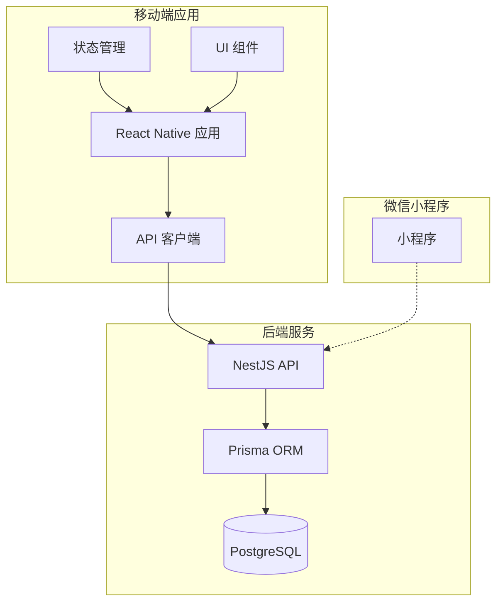
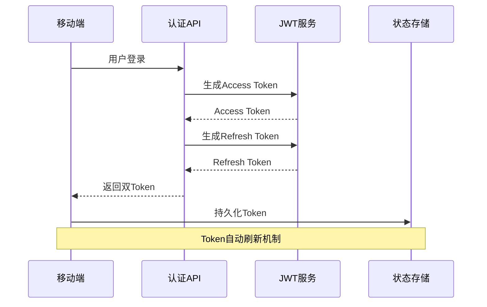
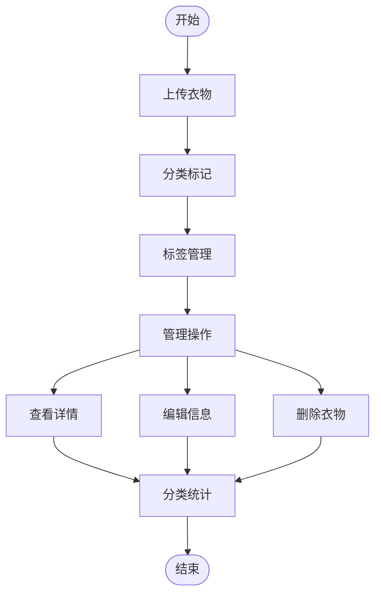
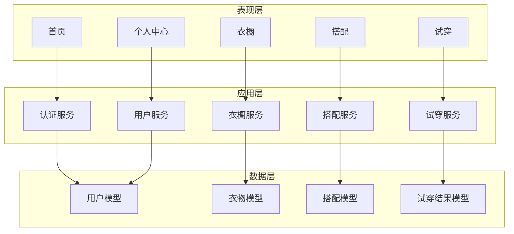
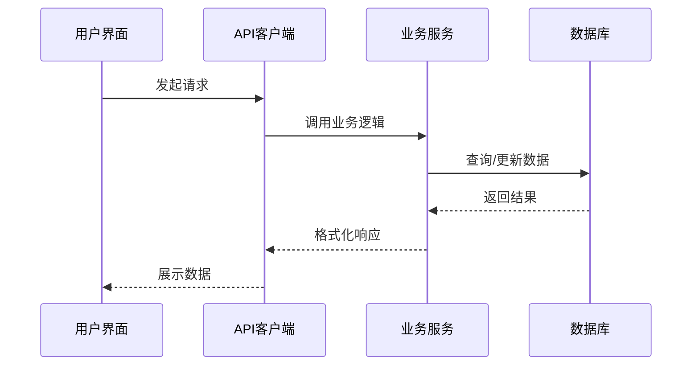
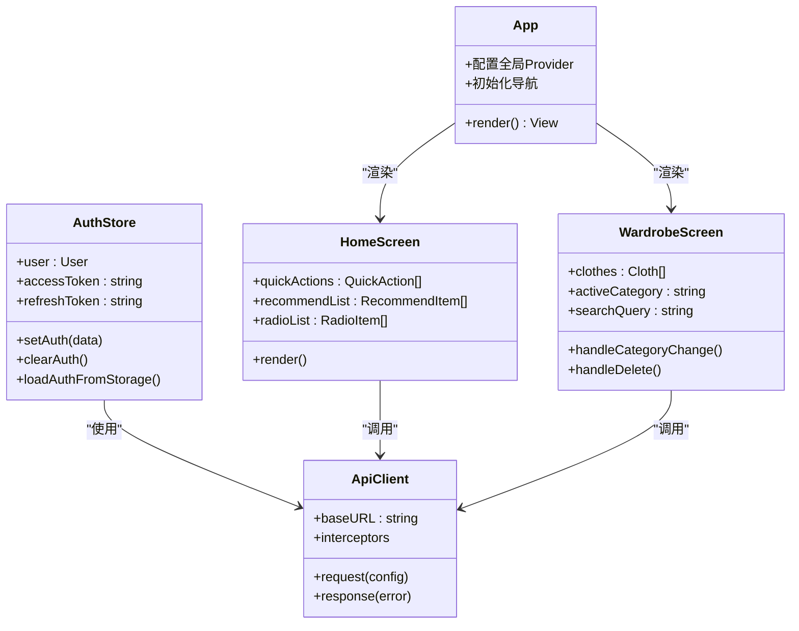
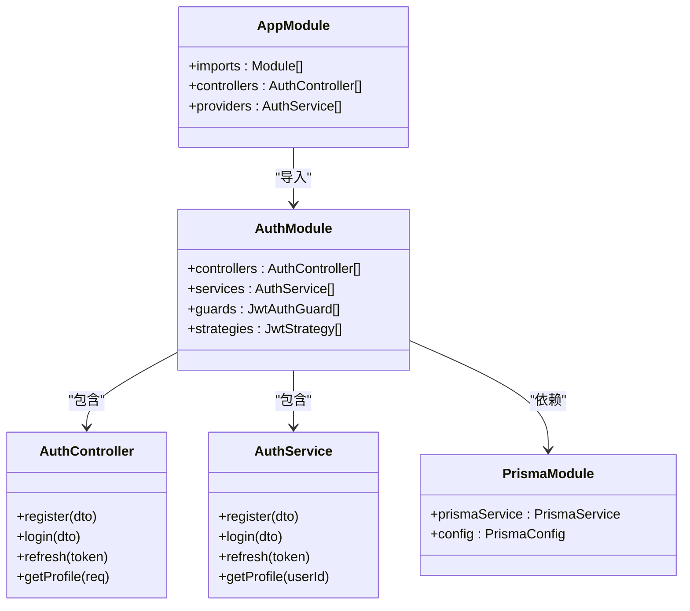
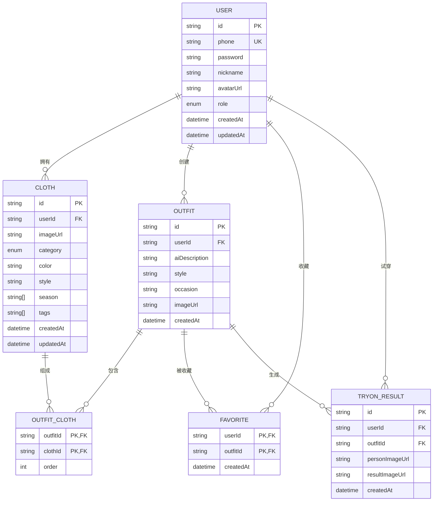
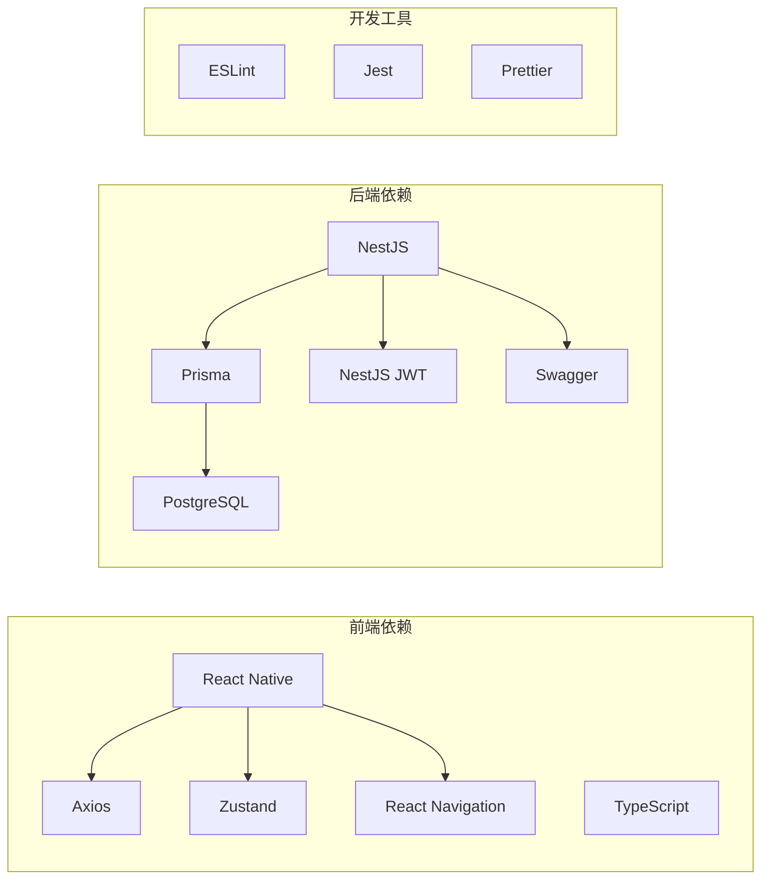

# 项目概述

<cite>
**本文档引用的文件**
- [README.md](file://FreeDressApp/README.md)
- [README.md](file://backend/README.md)
- [PROJECT_STATUS.md](file://PROJECT_STATUS.md)
- [package.json](file://FreeDressApp/package.json)
- [package.json](file://backend/package.json)
- [App.tsx](file://FreeDressApp/src/App.tsx)
- [axios.ts](file://FreeDressApp/src/api/axios.ts)
- [auth.ts](file://FreeDressApp/src/api/auth.ts)
- [clothes.ts](file://FreeDressApp/src/api/clothes.ts)
- [authStore.ts](file://FreeDressApp/src/store/authStore.ts)
- [index.ts](file://FreeDressApp/src/constants/index.ts)
- [HomeScreen.tsx](file://FreeDressApp/src/screens/HomeScreen.tsx)
- [WardrobeScreen.tsx](file://FreeDressApp/src/screens/WardrobeScreen.tsx)
- [app.module.ts](file://backend/src/app.module.ts)
- [schema.prisma](file://backend/prisma/schema.prisma)
</cite>

## 目录
1. [简介](#简介)
2. [项目结构](#项目结构)
3. [核心组件](#核心组件)
4. [架构总览](#架构总览)
5. [详细组件分析](#详细组件分析)
6. [依赖分析](#依赖分析)
7. [性能考虑](#性能考虑)
8. [故障排除指南](#故障排除指南)
9. [结论](#结论)
10. [附录](#附录)

## 简介
畅搭（FreeDress）是一个基于AI技术的智能穿搭应用，旨在帮助用户高效管理衣橱、获得个性化搭配建议，并通过AI试穿功能预览穿搭效果。项目采用前后端分离架构，前端使用React Native + TypeScript构建跨平台移动应用，后端基于NestJS提供RESTful API服务，数据库采用PostgreSQL配合Prisma ORM。

### 核心价值主张
- **智能衣橱管理**：支持衣物上传、分类筛选、标签管理与统计分析
- **AI智能搭配**：基于用户衣橱内容与偏好生成个性化搭配方案
- **AI试穿体验**：上传人物照片即可获得AI合成的试穿效果
- **个性化推荐**：结合季节、场合与用户风格偏好提供穿搭建议

### 目标用户群体
- 注重个人形象与穿搭品质的年轻人
- 希望简化每日穿搭决策的都市白领
- 对AI技术在生活场景应用感兴趣的科技用户

### 市场定位
面向年轻用户的轻量级AI穿搭工具，强调简洁直观的交互体验与实用的AI功能，通过Editorial Couture设计语言打造独特的品牌视觉。

## 项目结构
项目采用典型的前后端分离架构，包含移动端应用、后端API服务和微信小程序三个主要组成部分：



**图表来源**
- [app.module.ts:13-32](file://backend/src/app.module.ts#L13-L32)
- [App.tsx:1-28](file://FreeDressApp/src/App.tsx#L1-L28)

### 前端架构
- **技术栈**：React Native 0.85.3 + TypeScript 5.8.3 + Zustand 5.0.13
- **状态管理**：Zustand 管理认证状态与全局状态
- **网络层**：Axios 封装，支持自动Token刷新与错误处理
- **UI组件**：自定义组件库，遵循Editorial Couture设计语言

### 后端架构
- **技术栈**：NestJS 10.3 + Prisma 5.7 + PostgreSQL 16
- **认证机制**：JWT Token + Refresh Token 双Token机制
- **数据模型**：完整的穿搭生态数据模型设计
- **API规范**：Swagger 自动生成API文档

**章节来源**
- [README.md:34-48](file://FreeDressApp/README.md#L34-L48)
- [README.md:43-54](file://backend/README.md#L43-L54)
- [package.json:12-31](file://FreeDressApp/package.json#L12-L31)
- [package.json:26-45](file://backend/package.json#L26-L45)

## 核心组件
项目围绕四大核心业务模块构建，每个模块都有明确的职责边界和清晰的接口定义。

### 认证模块
负责用户身份验证与会话管理，采用JWT双Token机制确保安全性与用户体验。



**图表来源**
- [auth.ts:45-53](file://FreeDressApp/src/api/auth.ts#L45-L53)
- [axios.ts:54-98](file://FreeDressApp/src/api/axios.ts#L54-L98)
- [authStore.ts:39-57](file://FreeDressApp/src/store/authStore.ts#L39-L57)

### 衣橱管理模块
提供完整的衣物生命周期管理，从上传到删除的全流程支持。



**图表来源**
- [WardrobeScreen.tsx:40-90](file://FreeDressApp/src/screens/WardrobeScreen.tsx#L40-L90)
- [clothes.ts:30-53](file://FreeDressApp/src/api/clothes.ts#L30-L53)

### 智能搭配模块
基于用户衣橱内容生成个性化搭配方案，支持收藏与历史管理。

### AI试穿模块
上传人物照片与选择搭配，通过AI算法生成试穿效果。

**章节来源**
- [HomeScreen.tsx:100-160](file://FreeDressApp/src/screens/HomeScreen.tsx#L100-L160)
- [WardrobeScreen.tsx:261-301](file://FreeDressApp/src/screens/WardrobeScreen.tsx#L261-L301)

## 架构总览
项目采用分层架构设计，前后端通过RESTful API进行通信，数据库采用关系型存储确保数据一致性。



**图表来源**
- [schema.prisma:14-131](file://backend/prisma/schema.prisma#L14-L131)
- [app.module.ts:13-32](file://backend/src/app.module.ts#L13-L32)

### 数据流设计
系统采用事件驱动的数据流架构，每个模块通过标准化的API接口进行交互。



**图表来源**
- [axios.ts:12-18](file://FreeDressApp/src/api/axios.ts#L12-L18)
- [auth.ts:8-14](file://FreeDressApp/src/api/auth.ts#L8-L14)

## 详细组件分析

### 前端组件架构
前端采用模块化设计，每个功能模块都有独立的目录结构和职责划分。



**图表来源**
- [App.tsx:11-19](file://FreeDressApp/src/App.tsx#L11-L19)
- [authStore.ts:28-57](file://FreeDressApp/src/store/authStore.ts#L28-L57)
- [axios.ts:12-18](file://FreeDressApp/src/api/axios.ts#L12-L18)
- [HomeScreen.tsx:100-160](file://FreeDressApp/src/screens/HomeScreen.tsx#L100-L160)
- [WardrobeScreen.tsx:40-90](file://FreeDressApp/src/screens/WardrobeScreen.tsx#L40-L90)

### 后端服务架构
后端采用模块化架构，每个业务领域都有独立的控制器、服务和数据传输对象。



**图表来源**
- [app.module.ts:13-32](file://backend/src/app.module.ts#L13-L32)
- [auth.ts:45-53](file://FreeDressApp/src/api/auth.ts#L45-L53)

### 数据模型设计
系统采用关系型数据库设计，通过Prisma ORM实现类型安全的数据访问。



**图表来源**
- [schema.prisma:14-131](file://backend/prisma/schema.prisma#L14-L131)

**章节来源**
- [schema.prisma:1-132](file://backend/prisma/schema.prisma#L1-L132)
- [app.module.ts:1-33](file://backend/src/app.module.ts#L1-L33)

## 依赖分析
项目依赖关系清晰，前后端分离程度高，便于独立开发和部署。



**图表来源**
- [package.json:12-31](file://FreeDressApp/package.json#L12-L31)
- [package.json:26-45](file://backend/package.json#L26-L45)

### 技术选型优势
- **React Native**：一次开发，多端部署，降低维护成本
- **NestJS**：企业级Node.js框架，提供良好的架构基础
- **Prisma**：类型安全的ORM，提升开发效率
- **PostgreSQL**：成熟的关系型数据库，支持复杂查询

**章节来源**
- [package.json:1-57](file://FreeDressApp/package.json#L1-L57)
- [package.json:1-91](file://backend/package.json#L1-L91)

## 性能考虑
项目在性能方面采用了多项优化策略：

### 前端性能优化
- **虚拟列表**：使用Shopify Flash List优化大列表渲染
- **动画性能**：基于Reanimated的高性能动画引擎
- **状态管理**：Zustand替代Redux，减少不必要的重渲染
- **图片处理**：React Native Image组件优化图片加载

### 后端性能优化
- **数据库索引**：为常用查询字段建立索引
- **连接池**：Prisma连接池管理数据库连接
- **缓存策略**：Redis缓存热点数据（待实现）
- **分页查询**：大数据量场景下的分页处理

### 网络优化
- **请求拦截器**：统一处理Token刷新与错误处理
- **超时控制**：10秒请求超时防止长时间等待
- **重试机制**：弱网环境下的自动重试

## 故障排除指南
常见问题及解决方案：

### 认证相关问题
- **Token过期**：系统自动刷新，如失败则需要重新登录
- **401错误**：检查网络连接和Token有效性
- **登录失败**：确认用户名密码正确性和验证码输入

### 数据加载问题
- **列表空白**：检查网络连接和API可达性
- **图片无法显示**：确认图片URL有效和服务器配置
- **搜索无结果**：检查搜索关键词和数据完整性

### 性能问题
- **页面卡顿**：检查是否有过多的重渲染
- **内存泄漏**：确认组件卸载时清理定时器和订阅
- **启动缓慢**：优化Bundle大小和懒加载策略

**章节来源**
- [axios.ts:54-104](file://FreeDressApp/src/api/axios.ts#L54-L104)
- [authStore.ts:97-121](file://FreeDressApp/src/store/authStore.ts#L97-L121)

## 结论
畅搭（FreeDress）项目已经完成了核心业务框架的搭建，具备了完整的认证、衣橱管理、搭配管理和试穿功能。项目采用现代化的技术栈和清晰的架构设计，为后续的AI能力集成和功能扩展奠定了坚实基础。

### 当前完成度
- **后端API完成度**：95%
- **前端UI完成度**：85%
- **核心业务逻辑**：80%
- **整体综合完成度**：约88%

### 未来发展方向
1. **AI能力落地**：接入真实的AI试穿算法和智能搭配推荐
2. **功能完善**：实现完整的设置页面、会员体系和社交功能
3. **性能优化**：引入缓存、CDN和更好的错误监控
4. **质量保障**：完善测试覆盖和持续集成流程

## 附录

### 快速开始指南
```bash
# 启动后端服务
cd backend
npm install
npm run prisma:generate
npm run prisma:migrate
npm run start:dev

# 启动前端应用
cd FreeDressApp
npm install
npm start
```

### 开发环境配置
- **Node.js**：≥ 22.11.0
- **JDK**：17（Android）
- **Xcode**：≥ 15（iOS）
- **PostgreSQL**：≥ 16.0

### API接口对照
项目实现了100%的前后端接口匹配，确保前后端协同开发的顺畅进行。

**章节来源**
- [README.md:49-84](file://FreeDressApp/README.md#L49-L84)
- [README.md:55-109](file://backend/README.md#L55-L109)
- [PROJECT_STATUS.md:125-153](file://PROJECT_STATUS.md#L125-L153)