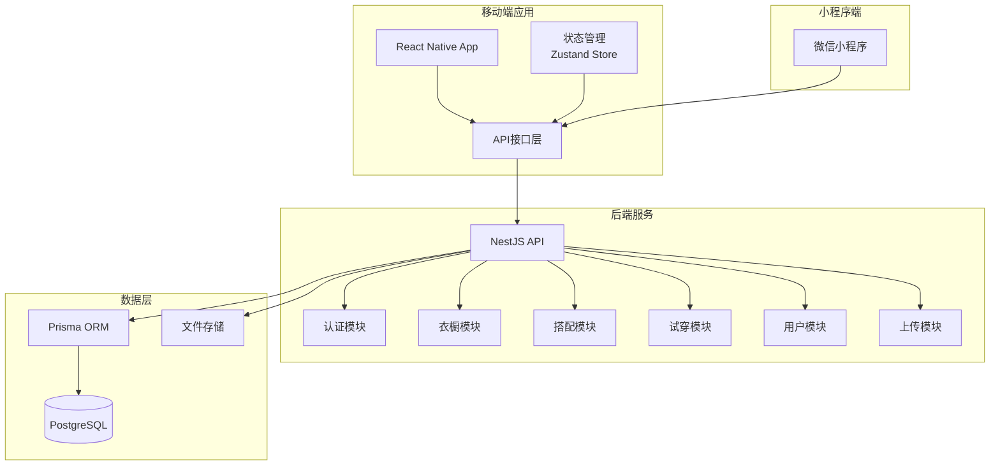
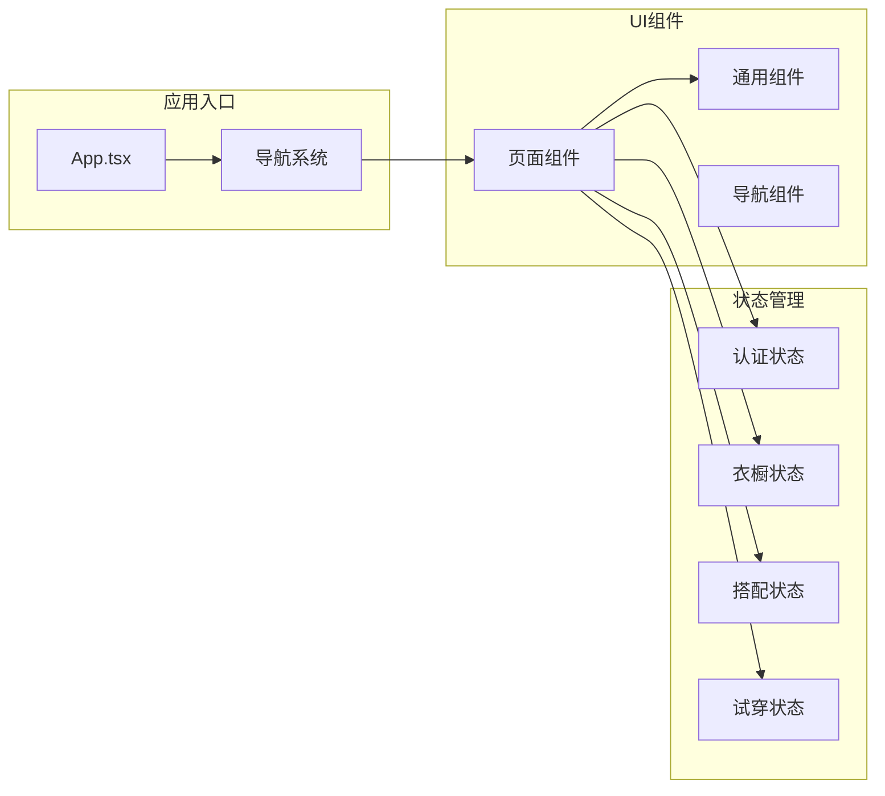
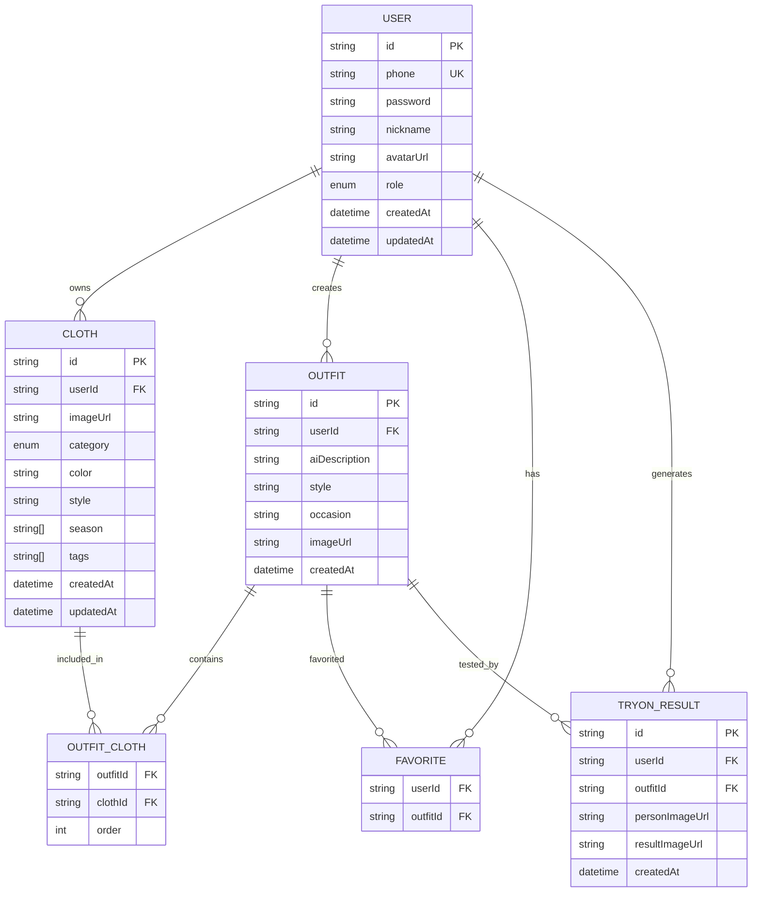
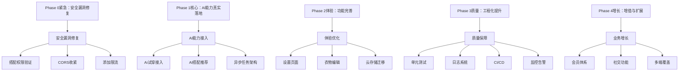

# 项目状态文档

<cite>
**本文档引用的文件**
- [PROJECT_STATUS.md](file://PROJECT_STATUS.md)
- [README.md](file://README.md)
- [backend/README.md](file://backend/README.md)
- [backend/package.json](file://backend/package.json)
- [freeDressWechat/app.json](file://freeDressWechat/app.json)
- [backend/src/app.module.ts](file://backend/src/app.module.ts)
- [FreeDressApp/src/App.tsx](file://FreeDressApp/src/App.tsx)
- [backend/src/main.ts](file://backend/src/main.ts)
- [backend/prisma/schema.prisma](file://backend/prisma/schema.prisma)
- [FreeDressApp/package.json](file://FreeDressApp/package.json)
- [backend/src/modules/auth/auth.service.ts](file://backend/src/modules/auth/auth.service.ts)
- [backend/src/modules/clothes/clothes.service.ts](file://backend/src/modules/clothes/clothes.service.ts)
- [backend/src/modules/outfits/outfits.service.ts](file://backend/src/modules/outfits/outfits.service.ts)
- [FreeDressApp/src/store/authStore.ts](file://FreeDressApp/src/store/authStore.ts)
- [FreeDressApp/src/store/wardrobeStore.ts](file://FreeDressApp/src/store/wardrobeStore.ts)
</cite>

## 目录
1. [项目概述](#项目概述)
2. [整体完成度评估](#整体完成度评估)
3. [核心模块状态](#核心模块状态)
4. [技术架构概览](#技术架构概览)
5. [数据模型分析](#数据模型分析)
6. [安全与质量评估](#安全与质量评估)
7. [后续开发计划](#后续开发计划)
8. [技术债务与改进](#技术债务与改进)
9. [总结与建议](#总结与建议)

## 项目概述

畅搭（FreeDress）是一个基于AI技术的智能穿搭应用，旨在为用户提供个性化的衣物搭配建议和AI试穿功能。项目采用前后端分离架构，包含React Native移动端应用、NestJS后端服务和微信小程序端。

### 项目定位与目标用户
- **目标用户**：追求时尚、注重个人形象的各年龄段人群
- **核心价值**：解决用户日常穿搭难题，提供个性化、智能化的搭配建议
- **市场定位**：轻量级穿搭工具，结合AI技术提供差异化体验

### 技术栈概览
- **前端**：React Native 0.85.3 + TypeScript 5.8.3 + Zustand 5.0.13
- **后端**：NestJS 10.3.0 + Prisma 5.7.0 + PostgreSQL 16+
- **小程序**：微信小程序端（初步框架）

## 整体完成度评估

根据最新的项目状态报告，畅搭项目的整体完成度为90%，具体评估如下：

### 各维度完成度
| 维度 | 完成度 | 说明 |
|------|--------|------|
| 后端 API | **95%** | 核心CRUD全部完成，AI服务为Mock |
| 前端 UI/UX | **96%** | 14个Screen全部实现，仅3个菜单项为规划中 |
| 前后端联调 | **100%** | 21个API接口全部匹配 |
| 设计语言落地 | **95%** | Editorial Couture风格贯穿，组件/排版/动效完善 |
| 数据模型 | **100%** | 6个核心实体+2个枚举+关联关系完整 |
| 核心业务逻辑 | **80%** | 认证/衣橱/搭配完整，AI服务待接入 |
| 状态管理 | **100%** | 4个Zustand store完整覆盖所有业务 |
| 组件复用率 | **100%** | 15个通用组件库全部投入使用 |

## 核心模块状态

### 1. 用户认证模块 ✅ 已完成
认证模块实现了完整的用户身份验证流程：

**后端功能**：
- 手机号+密码注册/登录
- JWT Token生成（7天有效期）
- Refresh Token（30天有效期）
- Token自动刷新（401拦截重试）
- 图片验证码（SVG生成+防自动化）
- 忘记密码/重置密码

**前端功能**：
- 登出清除本地数据
- 本地持久化登录状态
- 前后端联调完成

### 2. 衣橱管理模块 ✅ 已完成
衣橱管理提供了完整的衣物生命周期管理：

**核心功能**：
- 衣物列表展示（网格布局）
- 按分类筛选（上衣/下装/外套/配饰/鞋）
- 添加衣物（拍照/相册）
- 衣物图片上传
- 衣物属性设置（分类/颜色/风格/季节/标签）
- 衣物删除（带确认弹窗）
- 分类统计
- 衣物详情查看
- 下拉刷新

**部分完成**：
- 衣物编辑：store方法已有但无独立编辑页面

### 3. 智能搭配模块 ✅ 已完成
搭配模块实现了基础的搭配管理功能：

**核心功能**：
- 选择多件衣物创建搭配
- 风格意图标签选择
- 搭配列表查询
- 搭配详情展示
- 搭配收藏/取消收藏
- 搭配删除

**待完成**：
- AI智能搭配推荐
- 搭配效果图生成

### 4. AI试穿模块 ⚠️ 部分完成（Mock实现）
试穿模块目前为Mock实现：

**已完成功能**：
- 上传全身照
- 选择搭配
- 试穿记录保存
- 试穿历史列表

**待完成**：
- 试穿结果生成（Mock返回原图）
- 真实AI算法接入

### 5. 用户中心模块 ✅ 基本完成
用户中心模块基本实现：

**已完成功能**：
- 用户资料展示
- 用户资料编辑
- 数据统计（衣物/搭配/收藏/试穿）
- 收藏夹页面
- 搭配历史
- 试穿记录

**待完成**：
- 会员中心
- 设置页面
- 帮助与反馈
- 头像上传（页面未集成）

## 技术架构概览

### 系统架构图

**图表来源**
- [backend/src/app.module.ts:13-31](file://backend/src/app.module.ts#L13-L31)
- [backend/src/main.ts:1-62](file://backend/src/main.ts#L1-L62)

### 前端架构组织

**图表来源**
- [FreeDressApp/src/App.tsx:1-28](file://FreeDressApp/src/App.tsx#L1-L28)
- [FreeDressApp/src/store/authStore.ts:1-123](file://FreeDressApp/src/store/authStore.ts#L1-L123)

## 数据模型分析

### 数据库模型设计

**图表来源**
- [backend/prisma/schema.prisma:14-131](file://backend/prisma/schema.prisma#L14-L131)

### 核心实体关系

| 实体 | 关键字段 | 关联关系 | 索引 |
|------|----------|----------|------|
| User | id, phone, password, nickname, avatarUrl, role | clothes[], outfits[], favorites[], tryOnResults[] | phone(unique) |
| Cloth | id, userId, imageUrl, category, color, style, season[], tags[] | user, outfitClothes[] | userId, category |
| Outfit | id, userId, aiDescription, style, occasion, imageUrl | user, outfitClothes[], favorites[], tryOnResults[] | userId |
| OutfitCloth | outfitId, clothId, order | outfit, cloth | 复合主键 |
| Favorite | userId, outfitId | user, outfit | 复合主键 |
| TryOnResult | id, userId, outfitId, personImageUrl, resultImageUrl | user, outfit | userId, outfitId |

## 安全与质量评估

### 安全问题清单

**P0 - 必须立即修复**：
- 搭配创建未验证衣物归属权
- CORS配置 `origin: true` 允许任意域名跨域访问
- resetToken存于内存Map，重启丢失

**P1 - 本周修复**：
- MIME类型仅检查header字段，可伪造文件类型
- JWT Secret明文存.env，开发环境Key过弱
- 无API限流，存在暴力攻击风险

**P2 - 需关注**：
- Token刷新用JwtAuthGuard保护，需有效accessToken才能刷新
- 无Token黑名单，退登用户Token仍可用至过期
- 关系查询无分页，高数据量时内存溢出

### 代码质量评分

**后端代码质量评分**：
| 模块 | 评分 | 核心问题 |
|------|------|---------|
| 认证 (Auth) | 7/10 | 内存存储resetToken、JWT配置不完整 |
| 衣橱 (Clothes) | 6.5/10 | 关系查询N+1问题、分类统计硬编码 |
| 搭配 (Outfits) | 4/10 | **严重**：衣物权限验证缺失 |
| 试穿 (TryOn) | 5/10 | Mock过于简化、缺少异步任务架构 |
| 上传 (Upload) | 6/10 | MIME类型可伪造、本地存储不可扩展 |
| 用户 (Users) | 7/10 | 基础完善，缺少细节校验 |
| 公共设施 (Common) | 6.5/10 | CORS完全开放、管道配置需调优 |
| **后端综合** | **6.1/10** | 基础实现完善，生产级准备不足 |

**前端代码质量评分**：
| 维度 | 评分 | 说明 |
|------|------|------|
| 页面实现完整度 | 95% | 14个Screen完整，3个菜单项产品规划中 |
| 类型安全 | 100% | 全TypeScript覆盖，类型定义完整 |
| 组件复用度 | 优秀 | 15个通用组件，无重复代码 |
| 性能优化 | 良好 | useMemo/useCallback合理使用，FlatList虚拟滚动 |
| 错误处理 | 良好 | 所有API调用有try-catch，Alert提示用户 |
| 加载状态 | 完善 | Skeleton骨架屏 + EmptyState空状态 |
| 设计语言落地 | 优秀 | Editorial Couture一致性高 |
| **前端综合** | **8.5/10** | 生产就绪水平 |

## 后续开发计划

### Phase 1：核心缺失功能补齐（优先级：高）

#### 1.1 AI试穿真实算法接入
**目标**：替换 `tryon.service.ts` 中的 Mock 实现

**技术方案**：
- 接入 Kolors / IDM-VTON / OOTDiffusion 等开源模型
- 或对接第三方 AI 试穿 API（如 Replicate、阿里云 AI）
- 后端新增队列机制处理异步 AI 生成任务
- 前端增加生成进度展示

**改动文件**：
- `backend/src/modules/tryon/tryon.service.ts` — 替换 generateTryonImage()
- 新增 `backend/src/modules/tryon/ai-provider.service.ts`
- Prisma schema 增加 status 字段（pending/processing/done/failed）
- 前端增加轮询/WebSocket 获取生成状态

#### 1.2 注册验证码功能
**目标**：实现真实短信验证码校验

**技术方案**：
- 接入阿里云短信 / 腾讯云短信 / Twilio
- 后端新增 `/auth/send-code` 接口
- Redis 缓存验证码（5分钟有效）
- 注册时校验验证码正确性

**改动文件**：
- 新增 `backend/src/modules/auth/sms.service.ts`
- 修改 `backend/src/modules/auth/auth.service.ts` — 增加验证码校验
- `backend/src/modules/auth/auth.controller.ts` — 增加发送验证码接口
- 前端注册页增加倒计时按钮逻辑

#### 1.3 AI 智能搭配推荐
**目标**：根据衣橱内容、天气、场合自动推荐搭配

**技术方案**：
- 接入 LLM（GPT-4 / 通义千问）生成搭配建议
- 基于颜色互补、风格匹配规则的推荐算法
- 后端新增 `/outfits/recommend` 接口
- 前端搭配页增加"AI推荐"入口

**改动文件**：
- 新增 `backend/src/modules/outfits/recommendation.service.ts`
- `backend/src/modules/outfits/outfits.controller.ts` — 增加推荐接口
- `FreeDressApp/src/screens/OutfitScreen.tsx` — 增加AI推荐卡片

### Phase 2：体验优化（优先级：中）

#### 2.1 衣物编辑页面
**目标**：独立的衣物编辑页面，支持修改所有属性

**实现方案**：
- 新增 `EditClothingScreen.tsx`（复用 AddClothingScreen 组件逻辑）
- 导航增加 EditClothing 路由
- ClothDetailSheet 增加"编辑"按钮跳转

#### 2.2 设置页面
**目标**：用户偏好和系统设置

**实现方案**：
- 新增 `SettingsScreen.tsx`
- 功能项：修改密码、通知设置、清除缓存、关于我们、隐私政策
- 后端增加 `/auth/change-password` 接口

#### 2.3 图片存储云化
**目标**：将本地文件存储替换为云存储

**实现方案**：
- 接入阿里云 OSS / AWS S3 / 七牛云
- 修改 `upload.service.ts` 调用云存储 SDK
- 增加图片压缩和 CDN 加速

### Phase 3：增值功能（优先级：低）

#### 3.1 会员中心
**方案**：VIP 等级体系、付费解锁高级AI功能、月度搭配报告

**数据模型**：User 已有 role: USER/VIP，扩展 Subscription 模型

#### 3.2 社交与分享
**方案**：搭配分享到社交平台、搭配卡片图片导出、好友动态

#### 3.3 天气联动搭配
**方案**：接入天气 API，根据实时天气推荐适合的衣物搭配

## 技术债务与改进

### 已知技术债务

| 编号 | 问题 | 影响 | 建议 |
|------|------|------|------|
| T1 | 搜索仅前端实现 | 大数据量时性能差 | 后端增加搜索接口+模糊查询 |
| T2 | 无请求超时重试 | 弱网体验差 | axios 配置 retry 插件 |
| T3 | 无错误上报系统 | 线上问题难以追踪 | 接入 Sentry/Bugly |
| T4 | 无单元测试 | 回归风险高 | 补充 Service 层单元测试 |
| T5 | 无E2E测试 | 接口变更易出问题 | 补充 Supertest 集成测试 |
| T6 | API_BASE_URL 硬编码 | 多环境切换不便 | 使用 .env 环境变量 |
| T7 | 本地文件存储 | 不适合生产/多实例部署 | 迁移至云存储 |
| T8 | 无日志系统 | 问题排查困难 | 集成 Winston/Pino 日志 |
| T9 | 无接口限流 | 存在安全风险 | 添加 @nestjs/throttler |
| T10 | 无数据分页 | 列表数据量大时性能问题 | 后端增加分页参数 |

### 性能优化建议

**前端性能优化**：
- 搜索防抖：添加500ms debounce
- 图片缓存：替换为react-native-fast-image
- 列表缓存：增加SWR缓存策略
- 离线模式：AsyncStorage缓存关键数据
- 首屏加载：SplashScreen+预加载

**后端性能优化**：
- 搜索优化：后端增加`GET /clothes?search=`模糊搜索
- 分页优化：增加`page/pageSize`参数
- 缓存策略：Redis缓存热门数据
- 异步处理：队列机制处理耗时任务

## 总结与建议

### 项目强项
1. **架构规范**：前后端分离清晰，模块化设计，职责单一
2. **设计品质**：Editorial Couture设计语言高度统一，辨识度强
3. **接口完整**：21个API 100%对接，前后端协作无缝
4. **代码规范**：全TypeScript覆盖，命名一致，组件复用率高
5. **用户体验**：加载/空/错误状态全覆盖，交互细节打磨到位

### 核心短板
1. **AI能力空心**：产品核心卖点（试穿+推荐）仅为占位实现
2. **安全问题**：搭配模块权限漏洞为关键风险
3. **生产就绪度低**：本地存储/无限流/无监控/无测试
4. **缺少运营支撑**：无后台管理、无数据统计、无用户反馈通道

### 建议执行优先级

**建议优先执行顺序**：
1. **安全漏洞修复**（搭配模块权限、CORS配置）
2. **AI试穿算法接入**（产品核心价值）
3. **AI搭配推荐**（产品竞争力）
4. **云存储迁移 + 设置页面**（上线必备）
5. **测试覆盖 + 错误监控**（质量保障）

畅搭（FreeDress）项目的核心业务功能框架已经搭建完整，前后端协作流畅，设计语言统一且具有高度辨识度。当前最关键的差距在于 AI 能力的真实落地（试穿生成和智能推荐），这是产品的核心差异化卖点。建议按照上述优先级逐步推进，确保项目质量和用户体验的持续提升。